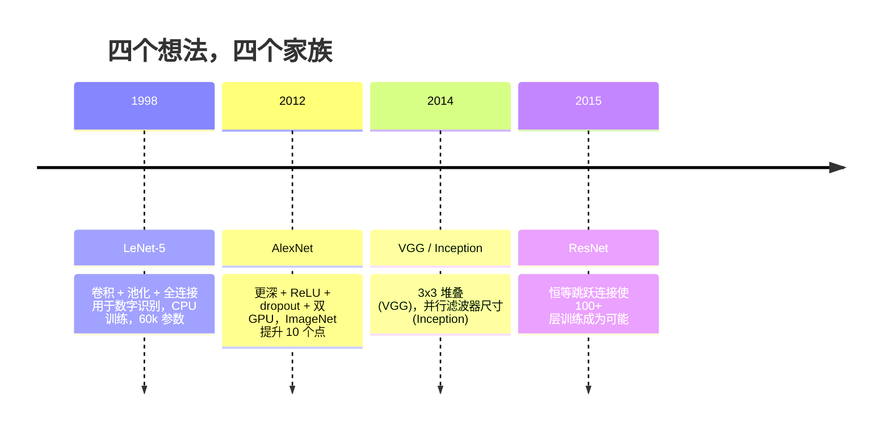
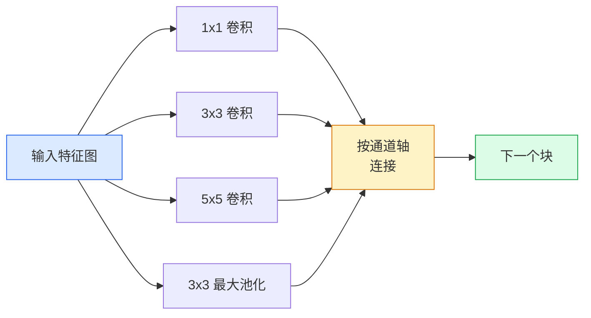
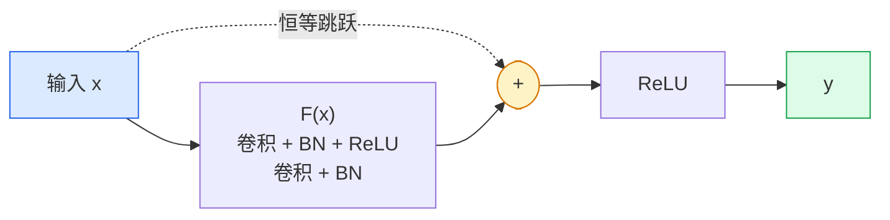

# CNNs — LeNet to ResNet

> 在过去三十年里，每一个重要的 CNN 都是相同的 卷积–非线性–下采样 配方，加上一个新的想法。按顺序学习这些想法。

**Type:** 学习 + 实践
**Languages:** Python
**Prerequisites:** Phase 3 Lesson 11 (PyTorch), Phase 4 Lesson 01 (图像基础), Phase 4 Lesson 02 (从头实现卷积)
**Time:** ~75 分钟

## 学习目标

- 追踪 LeNet-5 -> AlexNet -> VGG -> Inception -> ResNet 的架构谱系，并说明每一类贡献的单一新想法
- 在 PyTorch 中在各自 40 行以内实现 LeNet-5、一个 VGG 风格的块和一个 ResNet BasicBlock
- 解释为何残差连接能把一个 1000 层的网络从不可训练变为最先进
- 在查看源码之前，阅读一个现代骨干网（ResNet-18、ResNet-50），并预测它的输出形状、感受野和参数量

## 问题背景

2011 年，最佳的 ImageNet 分类器大约 74% top-5 准确率。2012 年 AlexNet 达到 85%。2015 年 ResNet 达到 96%。没有新数据，也没有新一代 GPU。性能提升来自架构上的想法。作为一个实用的视觉工程师，你必须知道每个想法来自哪篇论文，因为在 2026 年你发布的每个生产骨干网都是这些相同部件的重组合——而且这些想法会不断迁移：分组卷积从 CNN 转移到 transformer，残差连接从 ResNet 扩展到所有存在的 LLM，批归一化也在扩散模型中存在。

按顺序研究这些网络还能防止一个常见错误：在 LeNet 大小的网络就能解决问题时，直接去用最大的可用模型。MNIST 不需要 ResNet。了解每一类的扩展曲线能告诉你应该在哪个规模上选取模型。

## 概念

### 改变视觉领域的四个想法



在经典视觉中，没有其它东西比这四次跃迁更重要。

### LeNet-5 (1998)

Yann LeCun 的数字识别器。60,000 个参数。两个卷积-池化块，两个全连接层，tanh 激活。它定义了每个 CNN 继承的模板：

```
input (1, 32, 32)
  conv 5x5 -> (6, 28, 28)
  avg pool 2x2 -> (6, 14, 14)
  conv 5x5 -> (16, 10, 10)
  avg pool 2x2 -> (16, 5, 5)
  flatten -> 400
  dense -> 120
  dense -> 84
  dense -> 10
```

现代世界所称的所有 CNN —— 交替的卷积与下采样，然后送入一个小型分类头 —— 都是 LeNet，只是层数更多、通道更大、激活更好。

### AlexNet (2012)

三个变化共同打破了 ImageNet 的记录：

1. **ReLU** 代替 tanh。梯度不再消失。训练速度提升约 6 倍。
2. **Dropout** 应用于全连接头。正则化成为一个层，而不是技巧。
3. **更深更宽**。五个卷积层，三个全连层，60M 参数，在两块 GPU 上训练，模型在 GPU 之间拆分。

论文的图 2 仍然显示了作为两个并行流的 GPU 拆分。这种并行性是硬件上的权宜之计，不是架构洞见——但上面三点现在仍存在于你使用的每个模型中。

### VGG (2014)

VGG 问：如果只使用 3x3 卷积并把网络做深，会发生什么？

```
stack:   conv 3x3 -> conv 3x3 -> pool 2x2
repeat:  16 或 19 个卷积层
```

两个 3x3 的卷积看到的感受野与一个 5x5 卷积相同，但参数更少（2*9*C^2 = 18C^2 vs 25*C^2），且中间多了一个 ReLU。VGG 把这个观察变成了整套架构。其简单性——一种块类型反复堆叠——使它成为之后所有工作的参考点。

代价：138M 参数，训练慢，推理昂贵。

### Inception (2014，同年)

Google 对“我应该用什么核大小？”的回答是：都用，放在并行分支中。



每个分支有不同的专长——1x1 用于通道混合，3x3 用于局部纹理，5x5 用于更大模式，池化用于平移不变特征——连接操作让下一层选择哪条分支有用。Inception v1 在每个分支内部使用 1x1 卷积作为瓶颈以保持参数数量合理。

### 退化问题

到 2015 年，VGG-19 能工作而 VGG-32 不能。深度本应有利，但超过大约 20 层后，训练和测试损失都变差。这不是过拟合。这是优化器找不到有用权重，因为梯度在每一层上乘性地缩小。

```
Plain deep network:
  y = f_L( f_{L-1}( ... f_1(x) ... ) )

Gradient wrt early layer:
  dL/dW_1 = dL/dy * df_L/df_{L-1} * ... * df_2/df_1 * df_1/dW_1

Each multiplicative term has magnitude roughly (weight magnitude) * (activation gain).
Stack 100 of them with gains < 1 and the gradient is effectively zero.
```

VGG 在 19 层时能工作是因为批归一化（与其同时发表）保持了激活的良好尺度。但即便是 BN 也救不了超过大约 30 层的深度。

### ResNet (2015)

He、Zhang、Ren、Sun 提出了一个改变，解决了一切：

```
standard block:   y = F(x)
residual block:   y = F(x) + x
```

加上 `+ x` 的意思是层始终可以通过让 `F(x)` 变成零来选择什么都不做。1,000 层的 ResNet 最坏情况也不过与 1 层网络一样糟糕，因为每个额外的块都有一个简单的逃生出口。有了这个保证，优化器愿意使每个块变得*稍微*有用——而稍微有用的东西堆叠 100 次就能成为最先进。



有两种块变体广泛出现：

- **BasicBlock**（ResNet-18、ResNet-34）：两个 3x3 卷积，跳跃连接绕过两者。
- **Bottleneck**（ResNet-50、-101、-152）：1x1 压缩、3x3 中间、1x1 恢复，跳跃连接绕过三者。在通道数高时更便宜。

当跳跃路径需要跨越下采样（stride=2）时，恒等路径会被一个 1x1 stride=2 的卷积替代以匹配形状。

### 为什么残差在视觉之外也重要

这个想法并不只是关于图像分类。它是关于把深度网络从“交叉手指希望梯度没消失”变为一个可靠、可扩展的工程工具。你下一阶段将读到的每一个 transformer 都在每个块里有完全相同的跳跃连接。没有 ResNet，就没有 GPT。

```figure
pooling
```

## 实现

### 第 1 步：LeNet-5

一个最小且忠实的 LeNet。tanh 激活，平均池化。唯一对现代的让步是我们在下游使用 `nn.CrossEntropyLoss`，而不是原始的高斯连接。

```python
import torch
import torch.nn as nn
import torch.nn.functional as F

class LeNet5(nn.Module):
    def __init__(self, num_classes=10):
        super().__init__()
        self.conv1 = nn.Conv2d(1, 6, kernel_size=5)
        self.conv2 = nn.Conv2d(6, 16, kernel_size=5)
        self.pool = nn.AvgPool2d(2)
        self.fc1 = nn.Linear(16 * 5 * 5, 120)
        self.fc2 = nn.Linear(120, 84)
        self.fc3 = nn.Linear(84, num_classes)

    def forward(self, x):
        x = self.pool(torch.tanh(self.conv1(x)))
        x = self.pool(torch.tanh(self.conv2(x)))
        x = torch.flatten(x, 1)
        x = torch.tanh(self.fc1(x))
        x = torch.tanh(self.fc2(x))
        return self.fc3(x)

net = LeNet5()
x = torch.randn(1, 1, 32, 32)
print(f"output: {net(x).shape}")
print(f"params: {sum(p.numel() for p in net.parameters()):,}")
```

预期输出：`output: torch.Size([1, 10])`，`params: 61,706`。这就是开启现代视觉的整套数字分类器。

### 第 2 步：一个 VGG 块

一个可复用的块：两个 3x3 卷积，ReLU，批归一化，最大池化。

```python
class VGGBlock(nn.Module):
    def __init__(self, in_c, out_c):
        super().__init__()
        self.conv1 = nn.Conv2d(in_c, out_c, kernel_size=3, padding=1)
        self.bn1 = nn.BatchNorm2d(out_c)
        self.conv2 = nn.Conv2d(out_c, out_c, kernel_size=3, padding=1)
        self.bn2 = nn.BatchNorm2d(out_c)
        self.pool = nn.MaxPool2d(2)

    def forward(self, x):
        x = F.relu(self.bn1(self.conv1(x)))
        x = F.relu(self.bn2(self.conv2(x)))
        return self.pool(x)

class MiniVGG(nn.Module):
    def __init__(self, num_classes=10):
        super().__init__()
        self.stack = nn.Sequential(
            VGGBlock(3, 32),
            VGGBlock(32, 64),
            VGGBlock(64, 128),
        )
        self.head = nn.Sequential(
            nn.AdaptiveAvgPool2d(1),
            nn.Flatten(),
            nn.Linear(128, num_classes),
        )

    def forward(self, x):
        return self.head(self.stack(x))

net = MiniVGG()
x = torch.randn(1, 3, 32, 32)
print(f"output: {net(x).shape}")
print(f"params: {sum(p.numel() for p in net.parameters()):,}")
```

在 CIFAR 尺寸输入上使用三个 VGG 块，一个自适应池化和一个线性层。约 29 万参数。对于 CIFAR-10 足够了。

### 第 3 步：ResNet BasicBlock

ResNet-18 与 ResNet-34 的核心构建块。

```python
class BasicBlock(nn.Module):
    def __init__(self, in_c, out_c, stride=1):
        super().__init__()
        self.conv1 = nn.Conv2d(in_c, out_c, kernel_size=3, stride=stride, padding=1, bias=False)
        self.bn1 = nn.BatchNorm2d(out_c)
        self.conv2 = nn.Conv2d(out_c, out_c, kernel_size=3, stride=1, padding=1, bias=False)
        self.bn2 = nn.BatchNorm2d(out_c)
        if stride != 1 or in_c != out_c:
            self.shortcut = nn.Sequential(
                nn.Conv2d(in_c, out_c, kernel_size=1, stride=stride, bias=False),
                nn.BatchNorm2d(out_c),
            )
        else:
            self.shortcut = nn.Identity()

    def forward(self, x):
        out = F.relu(self.bn1(self.conv1(x)))
        out = self.bn2(self.conv2(out))
        out = out + self.shortcut(x)
        return F.relu(out)
```

在卷积层上使用 `bias=False` 是 BN 的惯例——BN 的 beta 参数已经处理偏置了，所以卷积再带偏置是浪费。只有在 stride 或通道数变化时，`shortcut` 才需要真实的卷积；否则它是一个无操作的恒等映射。

### 第 4 步：一个小型 ResNet

堆叠四组 BasicBlock 来得到一个用于 CIFAR 尺寸输入的可用 ResNet。

```python
class TinyResNet(nn.Module):
    def __init__(self, num_classes=10):
        super().__init__()
        self.stem = nn.Sequential(
            nn.Conv2d(3, 32, kernel_size=3, stride=1, padding=1, bias=False),
            nn.BatchNorm2d(32),
            nn.ReLU(inplace=True),
        )
        self.layer1 = self._make_group(32, 32, num_blocks=2, stride=1)
        self.layer2 = self._make_group(32, 64, num_blocks=2, stride=2)
        self.layer3 = self._make_group(64, 128, num_blocks=2, stride=2)
        self.layer4 = self._make_group(128, 256, num_blocks=2, stride=2)
        self.head = nn.Sequential(
            nn.AdaptiveAvgPool2d(1),
            nn.Flatten(),
            nn.Linear(256, num_classes),
        )

    def _make_group(self, in_c, out_c, num_blocks, stride):
        blocks = [BasicBlock(in_c, out_c, stride=stride)]
        for _ in range(num_blocks - 1):
            blocks.append(BasicBlock(out_c, out_c, stride=1))
        return nn.Sequential(*blocks)

    def forward(self, x):
        x = self.stem(x)
        x = self.layer1(x)
        x = self.layer2(x)
        x = self.layer3(x)
        x = self.layer4(x)
        return self.head(x)

net = TinyResNet()
x = torch.randn(1, 3, 32, 32)
print(f"output: {net(x).shape}")
print(f"params: {sum(p.numel() for p in net.parameters()):,}")
```

四个组，每组两个块。组 2、3、4 的起始处 stride=2 下采样。每次下采样通道数翻倍。大约 280 万参数。这是一个可以干净扩展到 ResNet-152 的标准配方。

### 第 5 步：比较参数到特征效率

把相同输入通过三种网络并比较参数数量。

```python
def summary(name, net, x):
    y = net(x)
    params = sum(p.numel() for p in net.parameters())
    print(f"{name:12s}  input {tuple(x.shape)} -> output {tuple(y.shape)}  params {params:>10,}")

x = torch.randn(1, 3, 32, 32)
summary("LeNet5",     LeNet5(),       torch.randn(1, 1, 32, 32))
summary("MiniVGG",    MiniVGG(),      x)
summary("TinyResNet", TinyResNet(),   x)
```

三种模型，三段时代，参数数量差了三个数量级。对于 CIFAR-10 的准确率，大致所需：LeNet 60%，MiniVGG 89%，TinyResNet 93%（训练若干个 epoch 后）。

## 使用方法

`torchvision.models` 提供了上述模型的预训练版本。不同家族的调用签名相同，这正是骨干网抽象的意义。

```python
from torchvision.models import resnet18, ResNet18_Weights, vgg16, VGG16_Weights

r18 = resnet18(weights=ResNet18_Weights.IMAGENET1K_V1)
r18.eval()

print(f"ResNet-18 params: {sum(p.numel() for p in r18.parameters()):,}")
print(r18.layer1[0])
print()

v16 = vgg16(weights=VGG16_Weights.IMAGENET1K_V1)
v16.eval()
print(f"VGG-16   params: {sum(p.numel() for p in v16.parameters()):,}")
```

ResNet-18 有 11.7M 参数。VGG-16 有 138M。相似的 ImageNet top-1 精度（69.8% vs 71.6%）。残差连接为你带来了约 12 倍的参数效率优势。这就是为什么 ResNet 变体在 2016 年到 ViT 在 2021 年出现之前占主导地位——并且在计算受限的实际部署中仍然占优势。

对于迁移学习，配方始终相同：加载预训练、冻结骨干网络、替换分类头。

```python
for p in r18.parameters():
    p.requires_grad = False
r18.fc = nn.Linear(r18.fc.in_features, 10)
```

三行。现在你有了一个 10 类的 CIFAR 分类器，它继承了 ImageNet 所付费的表示。

## 投产输出

本课产出：

- `outputs/prompt-backbone-selector.md` — 一个提示，用于根据任务、数据集大小和计算预算选择合适的 CNN 家族（LeNet/VGG/ResNet/MobileNet/ConvNeXt）。
- `outputs/skill-residual-block-reviewer.md` — 一个技能脚本，用于读取 PyTorch 模块并标记跳跃连接错误（例如在 stride 变化时缺少 shortcut、shortcut 的激活顺序、BN 相对于相加的位置）。

## 练习

1. **(简单)** 手动逐层计算 `TinyResNet` 的参数量。与 `sum(p.numel() for p in net.parameters())` 比较。参数预算的大头在哪——卷积、BN 还是分类头？
2. **(中等)** 实现 Bottleneck 块（1x1 -> 3x3 -> 1x1 并带跳跃），并用它构建一个适用于 CIFAR 的 ResNet-50 风格网络。与 `TinyResNet` 比较参数量。
3. **(困难)** 从 `BasicBlock` 中移除跳跃连接，分别训练一个 34 块的“plain”网络和一个 34 块的 ResNet，在 CIFAR-10 上各训 10 个 epoch。绘制训练损失随 epoch 的变化曲线。复现 He 等人在论文中图 1 的结果：plain 深网收敛到比它的较浅孪生更高的损失。

## 关键词

| 术语 | 人们常说 | 实际含义 |
|------|--------|--------|
| 主干网络 (Backbone) | “模型” | 产生送到任务头的特征图的卷积块堆叠 |
| 残差连接 (Residual connection) | “跳跃连接” | `y = F(x) + x`；通过将 F 设为零使优化器能学习恒等映射，从而使任意深度可训练 |
| 基本块 (BasicBlock) | “两个 3x3 卷积加跳跃” | ResNet-18/34 的构建块：conv-BN-ReLU-conv-BN-add-ReLU |
| 瓶颈块 (Bottleneck) | “1x1 压缩，3x3，中间，1x1 恢复” | ResNet-50/101/152 的块；在高通道数时更高效，因为 3x3 在缩减后的宽度上运行 |
| 退化问题 (Degradation problem) | “更深更差” | 超过大约 20 层的 plain 卷积网络，训练和测试误差都会上升；通过残差连接解决，而非更多数据 |
| Stem (首层) | “第一层” | 将 3 通道输入转换为基础特征宽度的初始卷积；ImageNet 上通常是 7x7 stride 2，CIFAR 上通常是 3x3 stride 1 |
| Head (分类头) | “分类器” | 最后一个主干块之后的层：自适应池化、展平、线性层 |
| 迁移学习 (Transfer learning) | “预训练权重” | 加载在 ImageNet 上训练的骨干，并只微调/训练你的任务头 |

## 延伸阅读

- [Deep Residual Learning for Image Recognition (He et al., 2015)](https://arxiv.org/abs/1512.03385) — ResNet 论文；每张图都值得深入研究
- [Very Deep Convolutional Networks (Simonyan & Zisserman, 2014)](https://arxiv.org/abs/1409.1556) — VGG 论文；仍然是“为什么用 3x3”问题的最佳参考
- [ImageNet Classification with Deep CNNs (Krizhevsky et al., 2012)](https://papers.nips.cc/paper_files/paper/2012/hash/c399862d3b9d6b76c8436e924a68c45b-Abstract.html) — AlexNet；结束手工特征时代的论文
- [Going Deeper with Convolutions (Szegedy et al., 2014)](https://arxiv.org/abs/1409.4842) — Inception v1；并行滤波器思想仍然出现在视觉 transformer 中