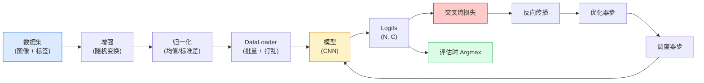

# Image Classification

> A classifier is a function from pixels to a probability distribution over classes. Everything else is plumbing.

**Type:** 构建  
**Languages:** Python  
**Prerequisites:** 阶段 2 课程 09 (模型评估), 阶段 3 课程 10 (迷你框架), 阶段 4 课程 03 (卷积神经网络)  
**Time:** ~75 分钟

## Learning Objectives

- 在 CIFAR-10 上构建端到端的图像分类流水线：数据集、数据增强、模型、训练循环、评估
- 解释每个组件的角色（dataloader、loss、optimizer、scheduler、augmentation），并能预测其中任一项损坏会如何在损失曲线中体现
- 从零实现 mixup、cutout 和 label smoothing，并说明在什么情况下值得加入它们
- 读懂混淆矩阵和按类的精确率/召回率表，以在总体准确率之外诊断数据集和模型故障

## The Problem

每个可发布的视觉任务在某种程度上都归结为图像分类。检测（detection）是对区域做分类。分割（segmentation）是对像素做分类。检索（retrieval）是按与类质心的相似度排序。把分类做好——数据集循环、增强策略、损失、评估——是迁移到本阶段其它任务的关键技能。

大多数分类错误不在模型内部，而在流水线里：错误的归一化、未打乱的训练集、使标签失真（label） 的增强、被训练数据污染的验证集、在第 30 个 epoch 后悄然发散的学习率。一个在正确设置下能在 CIFAR-10 达到 93% 的 CNN，在线路出问题时常常只得 70–75%，而损失曲线看起来一直合理。

本课手工连接整个流水线，以便每个部分都可检查。你不会使用任何可能隐藏错误的 `torchvision.datasets` 的便捷封装。

## The Concept

### The classification pipeline



这个循环中的每一条线都可能藏着一个 bug。交叉熵需要原始 logits，而不是 softmax 后的输出，因此在 loss 之前做了 `model(x).softmax()` 会悄无声息地产生错误的梯度。增强只应当作用于输入像素，不应修改标签——mixup 是个例外，它会混合输入和标签。`optimizer.zero_grad()` 必须在每个 step 做一次；跳过会导致梯度累积，看起来像学习率极不稳定。以上任何一个错误都会把学习曲线压扁而不会报错。

### Cross-entropy, logits, and softmax

分类器为每张图像产生 C 个数，称为 logits。对它们做 softmax 可以把它们变成概率分布：

```
softmax(z)_i = exp(z_i) / sum_j exp(z_j)
```

交叉熵衡量正确类别的负对数概率：

```
CE(z, y) = -log( softmax(z)_y )
        = -z_y + log( sum_j exp(z_j) )
```

右侧的形式是数值稳定的（log-sum-exp）。PyTorch 的 `nn.CrossEntropyLoss` 将 softmax 与 NLL 合并在一次操作中，直接接受原始 logits。你自己先做 softmax 几乎总是一个 bug——你会计算 log(softmax(softmax(z)))，这是没有意义的量。

### Why augmentation works

CNN 通过权重共享对平移有归纳偏置，但对裁剪、翻转、颜色抖动或遮挡没有内建的不变性。教会它这些不变性的唯一方法是向它展示能体现这些变化的像素。训练期间的每一个随机变换都在传递一个信号：“这两张图像有相同的标签；学习忽略它们之间差异的特征。”

```
原始裁剪：  "朝左的狗"
翻转：      "朝右的狗"       <- 相同标签，不同像素
旋转(+15)： "稍微倾斜的狗"
颜色扰动：  "更暖色光下的狗"
随机遮挡：  "部分被遮挡的狗"
```

规则：增强必须保持标签不变。在数字识别上，cutout 和旋转可能会把 "6" 变成 "9"；对于那类数据集，你要使用更小的旋转范围并挑选尊重数字不变性的增强。

### Mixup and cutmix

普通增强只变换像素并保持 one-hot 标签。Mixup 和 cutmix 通过插值输入与标签打破了这一点。

```
Mixup:
  lambda ~ Beta(a, a)
  x = lambda * x_i + (1 - lambda) * x_j
  y = lambda * y_i + (1 - lambda) * y_j

Cutmix:
  把 x_j 的一个随机矩形贴到 x_i 上
  y = 按面积加权的 y_i 和 y_j 的混合
```

为什么有用：模型不再记忆尖锐的 one-hot 目标，而是学习类之间的插值关系。训练损失会上升，测试准确率上升。它是任何分类器最便宜的鲁棒性升级之一。

### Label smoothing

mixup 的一个近亲。不是用 `[0, 0, 1, 0, 0]` 作为目标，而是用类似 `[eps/C, eps/C, 1-eps, eps/C, eps/C]` 的分布（eps 比如 0.1）。它阻止模型产生任意尖锐的 logits，并以几乎不损失精度的代价改善校准。自 PyTorch 1.10 起 `nn.CrossEntropyLoss(label_smoothing=0.1)` 已内置该功能。

### Evaluation beyond accuracy

总体准确率会掩盖类别不平衡。在一个 90-10 的二分类中，如果总是预测多数类也能得到 90%。真正能告诉你发生了什么的工具：

- 每类准确率（Per-class accuracy）— 每个类别一个数字；立即暴露表现不佳的类别。
- 混淆矩阵（Confusion matrix）— C x C 的表格，行 i 列 j 表示真实为 i 被预测为 j 的计数；对角线是正确，非对角线是模型的错误所在。
- Top-1 / Top-5 — 正确类别是否在前 1 或前 5 个预测中；Top-5 在 ImageNet 上很重要，因为像 “Norwich terrier” 和 “Norfolk terrier” 这类类本身就有歧义。
- 校准（ECE）— 置信度为 0.8 的预测是否有 80% 的概率正确？现代网络系统性地过于自信；用温度缩放或标签平滑修复。

```figure
receptive-field
```

## Build It

### Step 1: A deterministic synthetic dataset

CIFAR-10 存在磁盘上。为了让本课可复现且快速，我们构建一个看起来像 CIFAR 的合成数据集——32x32 的 RGB 图像，具有类特定的结构，模型必须学习这些结构。完全相同的流水线可以不变地应用到真实的 CIFAR-10 上。

```python
import numpy as np
import torch
from torch.utils.data import Dataset


def synthetic_cifar(num_per_class=1000, num_classes=10, seed=0):
    rng = np.random.default_rng(seed)
    X = []
    Y = []
    for c in range(num_classes):
        centre = rng.uniform(0, 1, (3,))
        freq = 2 + c
        for _ in range(num_per_class):
            yy, xx = np.meshgrid(np.linspace(0, 1, 32), np.linspace(0, 1, 32), indexing="ij")
            r = np.sin(xx * freq) * 0.5 + centre[0]
            g = np.cos(yy * freq) * 0.5 + centre[1]
            b = (xx + yy) * 0.5 * centre[2]
            img = np.stack([r, g, b], axis=-1)
            img += rng.normal(0, 0.08, img.shape)
            img = np.clip(img, 0, 1)
            X.append(img.astype(np.float32))
            Y.append(c)
    X = np.stack(X)
    Y = np.array(Y)
    idx = rng.permutation(len(X))
    return X[idx], Y[idx]


class ArrayDataset(Dataset):
    def __init__(self, X, Y, transform=None):
        self.X = X
        self.Y = Y
        self.transform = transform

    def __len__(self):
        return len(self.X)

    def __getitem__(self, i):
        img = self.X[i]
        if self.transform is not None:
            img = self.transform(img)
        img = torch.from_numpy(img).permute(2, 0, 1)
        return img, int(self.Y[i])
```

每个类别都有自己的颜色调色板和频率模式，外加高斯噪声以强制模型学习信号而不是记住像素。十类，每类一千张图，随后打乱。

### Step 2: Normalisation and augmentation

每个视觉流水线都有这两种变换。

```python
def standardize(mean, std):
    mean = np.array(mean, dtype=np.float32)
    std = np.array(std, dtype=np.float32)
    def _fn(img):
        return (img - mean) / std
    return _fn


def random_hflip(p=0.5):
    def _fn(img):
        if np.random.random() < p:
            return img[:, ::-1, :].copy()
        return img
    return _fn


def random_crop(pad=4):
    def _fn(img):
        h, w = img.shape[:2]
        padded = np.pad(img, ((pad, pad), (pad, pad), (0, 0)), mode="reflect")
        y = np.random.randint(0, 2 * pad)
        x = np.random.randint(0, 2 * pad)
        return padded[y:y + h, x:x + w, :]
    return _fn


def compose(*fns):
    def _fn(img):
        for fn in fns:
            img = fn(img)
        return img
    return _fn
```

在裁剪前使用反射填充（reflect-pad），而不是零填充，因为黑色边界是一个信号，模型会学会忽略它，这通常不是我们想要的。

### Step 3: Mixup

在训练步骤内混合两张图像和两个标签。实现为批次级变换，因此它与 forward 操作相邻，而不是放在 dataset 内部。

```python
def mixup_batch(x, y, num_classes, alpha=0.2):
    if alpha <= 0:
        return x, torch.nn.functional.one_hot(y, num_classes).float()
    lam = float(np.random.beta(alpha, alpha))
    idx = torch.randperm(x.size(0), device=x.device)
    x_mixed = lam * x + (1 - lam) * x[idx]
    y_onehot = torch.nn.functional.one_hot(y, num_classes).float()
    y_mixed = lam * y_onehot + (1 - lam) * y_onehot[idx]
    return x_mixed, y_mixed


def soft_cross_entropy(logits, soft_targets):
    log_probs = torch.log_softmax(logits, dim=-1)
    return -(soft_targets * log_probs).sum(dim=-1).mean()
```

`soft_cross_entropy` 是针对软标签分布的交叉熵。当目标恰好是一热向量时，它会退化为通常的交叉熵。

### Step 4: The training loop

完整配方：遍历一次数据，每个批次做一次梯度计算，每个 epoch 做一次 scheduler.step()。

```python
import torch
import torch.nn as nn
from torch.utils.data import DataLoader
from torch.optim import SGD
from torch.optim.lr_scheduler import CosineAnnealingLR

def train_one_epoch(model, loader, optimizer, device, num_classes, use_mixup=True):
    model.train()
    total, correct, loss_sum = 0, 0, 0.0
    for x, y in loader:
        x, y = x.to(device), y.to(device)
        if use_mixup:
            x_m, y_soft = mixup_batch(x, y, num_classes)
            logits = model(x_m)
            loss = soft_cross_entropy(logits, y_soft)
        else:
            logits = model(x)
            loss = nn.functional.cross_entropy(logits, y, label_smoothing=0.1)
        optimizer.zero_grad()
        loss.backward()
        optimizer.step()
        loss_sum += loss.item() * x.size(0)
        total += x.size(0)
        # 当启用 mixup 时，用未混合的标签 `y` 计算训练准确率只是一个近似值
        # （模型看到的是软目标，而不是 y）。把它当作粗略的进度信号；
        # 真实性能依赖验证集准确率。
        with torch.no_grad():
            pred = logits.argmax(dim=-1)
            correct += (pred == y).sum().item()
    return loss_sum / total, correct / total


@torch.no_grad()
def evaluate(model, loader, device, num_classes):
    model.eval()
    total, correct = 0, 0
    loss_sum = 0.0
    cm = torch.zeros(num_classes, num_classes, dtype=torch.long)
    for x, y in loader:
        x, y = x.to(device), y.to(device)
        logits = model(x)
        loss = nn.functional.cross_entropy(logits, y)
        pred = logits.argmax(dim=-1)
        for t, p in zip(y.cpu(), pred.cpu()):
            cm[t, p] += 1
        loss_sum += loss.item() * x.size(0)
        total += x.size(0)
        correct += (pred == y).sum().item()
    return loss_sum / total, correct / total, cm
```

每次写训练循环时要检查的五个不变式：

1. 训练前调用 `model.train()`，评估前调用 `model.eval()` — 切换 dropout 和 batchnorm 的行为。
2. 在 `.backward()` 之前调用 `.zero_grad()`。
3. 累加度量时使用 `.item()`，不要让计算图意外保留。
4. 在评估期间使用 `@torch.no_grad()` — 节省内存和时间，避免微妙的事故。
5. 在原始 logits 上做 argmax，而不是 softmax — 结果相同，但少一个操作。

### Step 5: Put it together

使用上一课的 `TinyResNet`，训练几个 epoch，然后评估。

```python
from main import synthetic_cifar, ArrayDataset
from main import standardize, random_hflip, random_crop, compose
from main import mixup_batch, soft_cross_entropy
from main import train_one_epoch, evaluate
# TinyResNet 来自上一课（03-cnns-lenet-to-resnet）。
# 根据你保存上一课代码的位置调整导入路径。
from cnns_lenet_to_resnet import TinyResNet  # 示例占位符

X, Y = synthetic_cifar(num_per_class=500)
split = int(0.9 * len(X))
X_train, Y_train = X[:split], Y[:split]
X_val, Y_val = X[split:], Y[split:]

mean = [0.5, 0.5, 0.5]
std = [0.25, 0.25, 0.25]
train_tf = compose(random_hflip(), random_crop(pad=4), standardize(mean, std))
eval_tf = standardize(mean, std)

train_ds = ArrayDataset(X_train, Y_train, transform=train_tf)
val_ds = ArrayDataset(X_val, Y_val, transform=eval_tf)

train_loader = DataLoader(train_ds, batch_size=128, shuffle=True, num_workers=0)
val_loader = DataLoader(val_ds, batch_size=256, shuffle=False, num_workers=0)

device = "cuda" if torch.cuda.is_available() else "cpu"
model = TinyResNet(num_classes=10).to(device)
optimizer = SGD(model.parameters(), lr=0.1, momentum=0.9, weight_decay=5e-4, nesterov=True)
scheduler = CosineAnnealingLR(optimizer, T_max=10)

for epoch in range(10):
    tr_loss, tr_acc = train_one_epoch(model, train_loader, optimizer, device, 10, use_mixup=True)
    va_loss, va_acc, _ = evaluate(model, val_loader, device, 10)
    scheduler.step()
    print(f"epoch {epoch:2d}  lr {scheduler.get_last_lr()[0]:.4f}  "
          f"train {tr_loss:.3f}/{tr_acc:.3f}  val {va_loss:.3f}/{va_acc:.3f}")
```

在合成数据集上，这会在五个 epoch 内达到近乎完美的验证准确率，这就是要点：流水线正确时，模型能学到可学的信息。把数据集换成真实的 CIFAR-10，相同的循环在不改变任何东西的情况下可以训练到 ~90%。

### Step 6: Read the confusion matrix

仅靠准确率从来不足以告诉你模型具体哪里出问题。混淆矩阵会给出答案。

```python
def print_confusion(cm, labels=None):
    c = cm.shape[0]
    labels = labels or [str(i) for i in range(c)]
    print(f"{'':>6}" + "".join(f"{l:>5}" for l in labels))
    for i in range(c):
        row = cm[i].tolist()
        print(f"{labels[i]:>6}" + "".join(f"{v:>5}" for v in row))
    print()
    tp = cm.diag().float()
    fp = cm.sum(dim=0).float() - tp
    fn = cm.sum(dim=1).float() - tp
    prec = tp / (tp + fp).clamp_min(1)
    rec = tp / (tp + fn).clamp_min(1)
    f1 = 2 * prec * rec / (prec + rec).clamp_min(1e-9)
    for i in range(c):
        print(f"{labels[i]:>6}  prec {prec[i]:.3f}  rec {rec[i]:.3f}  f1 {f1[i]:.3f}")

_, _, cm = evaluate(model, val_loader, device, 10)
print_confusion(cm)
```

行表示真实类别，列表示预测。类别 3 与 5 之间的非对角线计数聚集说明模型将这两类混淆了，给你一个有针对性的数据采集或特定类别增强的起点。

## Use It

`torchvision` 将上述所有内容封装为惯用组件。对真实 CIFAR-10 来说完整流水线是四行代码加上一个训练循环。

```python
from torchvision.datasets import CIFAR10
from torchvision.transforms import Compose, RandomCrop, RandomHorizontalFlip, ToTensor, Normalize

mean = (0.4914, 0.4822, 0.4465)
std = (0.2470, 0.2435, 0.2616)
train_tf = Compose([
    RandomCrop(32, padding=4, padding_mode="reflect"),
    RandomHorizontalFlip(),
    ToTensor(),
    Normalize(mean, std),
])
eval_tf = Compose([ToTensor(), Normalize(mean, std)])

train_ds = CIFAR10(root="./data", train=True,  download=True, transform=train_tf)
val_ds   = CIFAR10(root="./data", train=False, download=True, transform=eval_tf)
```

注意两点：均值/标准差是与数据集相关的——是在 CIFAR-10 的训练集上计算的，而不是 ImageNet 的；反射填充是社区默认的裁剪策略。在这里直接拷贝 ImageNet 的统计量会泄露大约 ~1% 的准确率，这通常在有人做模型分析时才发现。

## Ship It

本课产出：

- `outputs/prompt-classifier-pipeline-auditor.md` — 一个提示（prompt），用于审计训练脚本的五个不变式并找出第一个违规项。
- `outputs/skill-classification-diagnostics.md` — 一个技能，当给定混淆矩阵和类别名称列表时，总结每类的失败并提出单一最有影响力的修复建议。

## Exercises

1. **(Easy)** 在合成数据集上将同一模型在有无 mixup 的条件下训练五个 epoch。绘制训练与验证损失曲线并比较。解释为什么启用 mixup 时训练损失更高但验证准确率相似或更好。
2. **(Medium)** 实现 Cutout —— 在每张训练图像上随机置零一个 8x8 的方块 —— 并运行消融实验：无增强、hflip+crop、hflip+crop+cutout、hflip+crop+mixup。报告每种配置的验证准确率。
3. **(Hard)** 构建 CIFAR-100 流水线（100 类、相同输入尺寸）并把 ResNet-34 的训练复现到与公开结果在 1% 以内。扩展：对三个学习率和两个 weight decay 做扫参，记录到本地 CSV，并生成最终的混淆矩阵与最常混淆类表。

## Key Terms

| Term | What people say | What it actually means |
|------|----------------|----------------------|
| Logits | "Raw outputs" | 每张图像在 softmax 前的 C 维向量；交叉熵期望接收这些原始值，而不是 softmax 后的值 |
| Cross-entropy | "The loss" | 正确类别的负对数概率；在一个稳定的操作中结合了 log-softmax 和 NLL |
| DataLoader | "The batcher" | 把 dataset 包装成带有打乱、分批和（可选）多 worker 加载的接口；它常常被指责为一半的训练错误来源 |
| Augmentation | "Random transforms" | 训练时的任意像素级变换，只要保持标签不变；教会 CNN 它本身不具备的不变性 |
| Mixup / Cutmix | "Mix two images" | 同时混合输入和标签，使分类器学习平滑的插值而非硬边界 |
| Label smoothing | "Softer targets" | 用 (1-eps, eps/(C-1), ...) 代替 one-hot；改善校准并略微提升准确率 |
| Top-k accuracy | "Top-5" | 正确类别是否出现在概率最高的 k 个预测中；用于类本身存在真实歧义的数据集 |
| Confusion matrix | "Where errors live" | C x C 的表格，条目 (i, j) 计数真实为 i 被预测为 j 的图像；对角线为正确，非对角线告诉你需要修正的地方 |

## Further Reading

- [CS231n: Training Neural Networks](https://cs231n.github.io/neural-networks-3/) — 仍然是对训练流水线最清晰的单页讲解
- [Bag of Tricks for Image Classification (He et al., 2019)](https://arxiv.org/abs/1812.01187) — 汇总了许多小技巧，合在一起能为 ResNet 在 ImageNet 上增加 3–4% 的准确率
- [mixup: Beyond Empirical Risk Minimization (Zhang et al., 2017)](https://arxiv.org/abs/1710.09412) — 原始的 mixup 论文；三页理论加上有说服力的实验
- [Why temperature scaling matters (Guo et al., 2017)](https://arxiv.org/abs/1706.04599) — 证明现代网络校准不足并用一个标量参数修复的论文