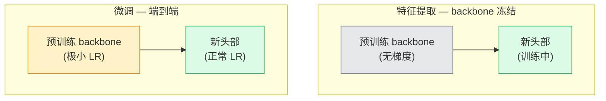

# Transfer Learning & Fine-Tuning

> Somebody else spent a million GPU hours teaching a network what edges, textures, and object parts look like. You should borrow those features before training your own.

**Type:** 构建
**Languages:** Python
**Prerequisites:** Phase 4 Lesson 03（卷积神经网络, CNNs）, Phase 4 Lesson 04（图像分类）
**Time:** ~75 分钟

## Learning Objectives

- 区分特征提取与微调，并根据数据集大小、领域距离和计算预算选择合适的策略
- 加载预训练 backbone，替换其分类头，并在不到 20 行代码内仅训练头部以达到可用基线
- 逐步解冻层并使用差异化学习率，使得早期通用特征的更新幅度小于后期任务特定特征
- 诊断三种常见失败：在解冻块上学习率过高导致的特征漂移、在极小数据集上 BatchNorm 统计量崩溃、以及灾难性遗忘

## The Problem

在 ImageNet 上训练一个 ResNet-50 约需 2,000 GPU 小时。很少有团队能为每个项目都承担这样的预算。几乎所有团队真正部署的，是一个预训练的 backbone，配上一个在几百或几千张任务特定图片上训练得到的新头部。

这并不是捷径。任何在 ImageNet 上训练的 CNN 的第一个 conv 块会学到边缘和类似 Gabor 的滤波器。接下来的几个块学到纹理和简单的图案。中间的块学到对象部件。最后的块学到开始看起来像 1,000 个 ImageNet 类别的组合。该层级的前 90% 在几乎所有视觉任务中几乎不变地迁移——因为自然界的边缘和纹理词汇是有限的。最后的 10% 才是你真正需要训练的部分。

把迁移做对有三种常见错误在等着你：用过高学习率破坏预训练特征、冻结过多导致模型丧失信息、以及让 BatchNorm 的 running 统计量朝着一个其他部分从未学习过的小数据集方向漂移。本课故意演示每一种问题及其解决办法。

## The Concept

### 特征提取 vs 微调

两种范式，取决于你对预训练特征的信任程度以及可用数据量。



经验法则：

| Dataset size | Domain distance | Recipe |
|--------------|-----------------|--------|
| < 1k images | close to ImageNet | 冻结 backbone，只训练 head |
| 1k-10k | close | 冻结前 2-3 个 stage，微调其余层 |
| 10k-100k | any | 端到端微调并使用差异化学习率 |
| 100k+ | far | 微调全部层；如果领域差距足够大，考虑从头训练 |

“接近 ImageNet” 大致指的是自然的 RGB 照片、具有类似物体内容的图像。医学 CT 扫描、航拍卫星影像和显微镜图像属于远领域——预训练特征仍然有用，但你需要让更多层自适应。

### 为什么冻结会奏效

CNN 在 ImageNet 上学到的特征并不是针对 1,000 个类别做高度专化。它们是针对自然图像的统计特征：特定方向的边缘、纹理、对比模式、形状原语。这些统计在几乎所有人能命名的视觉领域中都很稳定。这就是为什么在 CIFAR-10 上，仅用新的线性头（不微调 backbone）对 ImageNet 预训练模型做零样本测试就能达到 80%+ 的准确率。头部在学习如何为这个任务加权已学到的特征。

### 差异化学习率（Discriminative learning rates）

当你解冻时，早期层的训练步伐应该比后期层小。早期层编码通用特征，需要保留；后期层编码任务特定结构，需要更大幅度更新。

```
典型配方：

  stage 0（stem + 第一个 group）： lr = base_lr / 100    （大部分保持固定）
  stage 1:                          lr = base_lr / 10
  stage 2:                          lr = base_lr / 3
  stage 3（最后一个 backbone group）： lr = base_lr
  head:                             lr = base_lr  （或略高）
```

在 PyTorch 中，这只是传给优化器的参数组列表。一个模型，五个学习率，零额外代码。

### BatchNorm 问题

BN 层保存了在 ImageNet 上计算的 `running_mean` 和 `running_var` 缓存。如果你的任务有不同的像素分布 —— 不同的光照、不同的传感器、不同的色彩空间 —— 这些缓存就是不正确的。有三种按优先级排序的选项：

1. 微调时让 BN 保持训练模式。让 BN 同时更新运行统计量和其他参数。当任务数据集中等大小（>= 5k 样本）时，这是默认选择。
2. 冻结 BN 到 eval 模式。保留 ImageNet 的统计量并只训练权重。当数据集小到 BN 的移动平均会很嘈杂时这是正确的。
3. 用 GroupNorm 替换 BN。完全消除了移动平均的问题。在检测和分割 backbone 中常用（每 GPU 的 batch size 很小）。

做错会悄无声息地把准确率砍掉 5-15%。

### Head 设计

分类头通常是 1-3 个线性层加上可选的 dropout。每个 torchvision backbone 都自带一个默认头，你需要替换它：

```python
backbone.fc = nn.Linear(backbone.fc.in_features, num_classes)          # ResNet 的头部
backbone.classifier[1] = nn.Linear(..., num_classes)                    # EfficientNet、MobileNet 的分类器部分
backbone.heads.head = nn.Linear(..., num_classes)                       # torchvision ViT 的 heads
```

对于小数据集，单层线性通常已足够。当任务分布与 backbone 的训练分布差距更大时，添加一个隐藏层（Linear -> ReLU -> Dropout -> Linear）会有所帮助。

### 按层学习率衰减（Layer-wise LR decay）

现代微调（如 BEiT、DINOv2、ViT-B 微调）常用的一种更平滑的差异化 LR。与其把层分组，不如让每一层的学习率略低于其上层：

```
lr_layer_k = base_lr * decay^(L - k)
```

使用 decay = 0.75、L = 12 的 transformer block 时，第一个 block 的训练速率为头部 LR 的 `0.75^11 ≈ 0.04x`。对于 transformer 微调比对 CNN 更重要，后者通常按 stage 分组的 LR 已够用。

### 评估哪些指标

迁移学习运行需要两个你在从头训练时不会追踪的数值：

- 预训练仅头部准确率（Pretrained-only accuracy）—— backbone 冻结时头部的准确率。这是你的下界。
- 微调后准确率（Fine-tuned accuracy）—— 端到端训练后的准确率。这是你的上界。

如果微调结果低于预训练仅头部，说明你有学习率或 BN 的问题。始终打印两者。

## Build It

### Step 1: 加载预训练 backbone 并查看结构

```python
import torch
import torch.nn as nn
from torchvision.models import resnet18, ResNet18_Weights

backbone = resnet18(weights=ResNet18_Weights.IMAGENET1K_V1)
print(backbone)
print()
print("classifier head:", backbone.fc)
print("feature dim:", backbone.fc.in_features)
```

`ResNet18` 有四个 stage（`layer1..layer4`），外加一个 stem 和一个 `fc` 头。每个 torchvision 的分类 backbone 都有类似的结构。

### Step 2: 特征提取 — 冻结全部参数，替换头部

```python
def make_feature_extractor(num_classes=10):
    model = resnet18(weights=ResNet18_Weights.IMAGENET1K_V1)
    for p in model.parameters():
        p.requires_grad = False
    model.fc = nn.Linear(model.fc.in_features, num_classes)
    return model

model = make_feature_extractor(num_classes=10)
trainable = sum(p.numel() for p in model.parameters() if p.requires_grad)
frozen = sum(p.numel() for p in model.parameters() if not p.requires_grad)
print(f"trainable: {trainable:>10,}")
print(f"frozen:    {frozen:>10,}")
```

只有 `model.fc` 是可训练的。backbone 是一个冻结的特征提取器。

### Step 3: 差异化微调

一个实用函数，用来为不同 stage 构建带有阶段性学习率的参数组。

```python
def discriminative_param_groups(model, base_lr=1e-3, decay=0.3):
    stages = [
        ["conv1", "bn1"],
        ["layer1"],
        ["layer2"],
        ["layer3"],
        ["layer4"],
        ["fc"],
    ]
    groups = []
    for i, names in enumerate(stages):
        lr = base_lr * (decay ** (len(stages) - 1 - i))
        params = [p for n, p in model.named_parameters()
                  if any(n.startswith(k) for k in names)]
        if params:
            groups.append({"params": params, "lr": lr, "name": "_".join(names)})
    return groups

model = resnet18(weights=ResNet18_Weights.IMAGENET1K_V1)
model.fc = nn.Linear(model.fc.in_features, 10)
for p in model.parameters():
    p.requires_grad = True

groups = discriminative_param_groups(model)
for g in groups:
    print(f"{g['name']:>10s}  lr={g['lr']:.2e}  params={sum(p.numel() for p in g['params']):>8,}")
```

`decay=0.3` 意味着每个 stage 的训练速率是其下一层的 30%。`fc` 得到 `base_lr`，`layer4` 得到 `0.3 * base_lr`，`conv1` 得到 `0.3^5 * base_lr ≈ 0.00243 * base_lr`。听起来极端，但实证上有效。

### Step 4: BatchNorm 处理

一个辅助函数，用来冻结 BN 的运行统计量，但不冻结其权重。

```python
def freeze_bn_stats(model):
    for m in model.modules():
        if isinstance(m, (nn.BatchNorm1d, nn.BatchNorm2d, nn.BatchNorm3d)):
            m.eval()
            for p in m.parameters():
                p.requires_grad = False
    return model
```

在每个 epoch 开始时调用它，紧随你设置 `model.train()` 之后。`model.train()` 会把所有模块切到训练模式；这个函数仅对 BN 层进行反向操作。

### Step 5: 一个最小端到端微调循环

```python
from torch.optim import SGD
from torch.utils.data import DataLoader
from torch.optim.lr_scheduler import CosineAnnealingLR
import torch.nn.functional as F

def fine_tune(model, train_loader, val_loader, device, epochs=5, base_lr=1e-3, freeze_bn=False):
    model = model.to(device)
    groups = discriminative_param_groups(model, base_lr=base_lr)
    optimizer = SGD(groups, momentum=0.9, weight_decay=1e-4, nesterov=True)
    scheduler = CosineAnnealingLR(optimizer, T_max=epochs)

    for epoch in range(epochs):
        model.train()
        if freeze_bn:
            freeze_bn_stats(model)
        tr_loss, tr_correct, tr_total = 0.0, 0, 0
        for x, y in train_loader:
            x, y = x.to(device), y.to(device)
            logits = model(x)
            loss = F.cross_entropy(logits, y, label_smoothing=0.1)
            optimizer.zero_grad()
            loss.backward()
            optimizer.step()
            tr_loss += loss.item() * x.size(0)
            tr_total += x.size(0)
            tr_correct += (logits.argmax(-1) == y).sum().item()
        scheduler.step()

        model.eval()
        va_total, va_correct = 0, 0
        with torch.no_grad():
            for x, y in val_loader:
                x, y = x.to(device), y.to(device)
                pred = model(x).argmax(-1)
                va_total += x.size(0)
                va_correct += (pred == y).sum().item()
        print(f"epoch {epoch}  train {tr_loss/tr_total:.3f}/{tr_correct/tr_total:.3f}  "
              f"val {va_correct/va_total:.3f}")
    return model
```

在 CIFAR-10 上用上面的配方训练五个 epoch，`ResNet18-IMAGENET1K_V1` 的线性探针（zero-shot linear-probe）大约从 ~70% 提升到 ~93% 的微调准确率。仅训练头部会在 ~86% 左右停滞，而不会触碰 backbone。

### Step 6: 渐进解冻（Progressive unfreezing）

一个调度策略，从后向前每个 epoch 解冻一个 stage。可以缓解特征漂移，但需更多 epoch。

```python
def progressive_unfreeze_schedule(model):
    stages = ["layer4", "layer3", "layer2", "layer1"]
    yielded = set()

    def start():
        for p in model.parameters():
            p.requires_grad = False
        for p in model.fc.parameters():
            p.requires_grad = True

    def unfreeze(epoch):
        if epoch < len(stages):
            name = stages[epoch]
            yielded.add(name)
            for n, p in model.named_parameters():
                if n.startswith(name):
                    p.requires_grad = True
            return name
        return None

    return start, unfreeze
```

在第一个 epoch 之前调用 `start()` 一次。在每个 epoch 开始时调用 `unfreeze(epoch)`。每当可训练参数集合发生变化时重建优化器，否则被冻结的参数仍会保留缓存的动量/二阶矩，造成混淆。

## Use It

对于大多数真实任务，`torchvision.models` + 三行代码就足够了。上面更重的工具链在你遇到库默认无法修复的问题时才重要。

```python
from torchvision.models import resnet50, ResNet50_Weights

model = resnet50(weights=ResNet50_Weights.IMAGENET1K_V2)
model.fc = nn.Linear(model.fc.in_features, num_classes)
optimizer = torch.optim.AdamW(model.parameters(), lr=1e-4, weight_decay=1e-4)
```

两个其他的生产级默认项：

- `timm` 提供约 800 个预训练视觉 backbone，API 一致（`timm.create_model("resnet50", pretrained=True, num_classes=10)`）。对于任何超出 torchvision 仓库的微调，timm 是行业标准。
- 对于 transformer，`transformers.AutoModelForImageClassification.from_pretrained(name, num_labels=N)` 会为你提供 ViT / BEiT / DeiT，与文本模型的加载语义一致。

## Ship It

本课产出：

- `outputs/prompt-fine-tune-planner.md` — 一个提示词，基于数据集大小、领域距离和计算预算选择特征提取、渐进解冻或端到端微调。
- `outputs/skill-freeze-inspector.md` — 一个技能（skill），给定一个 PyTorch 模型，报告哪些参数是可训练的、哪些 BatchNorm 层处于 eval 模式，以及优化器是否真正收到了那些可训练参数。

## Exercises

1. **(Easy)** 将 `ResNet18` 作为线性探针（backbone 冻结）和作为完整微调在相同的合成 CIFAR 数据集上训练。并列报告两者准确率。解释哪个差距说明特征能很好迁移，哪个说明特征迁移性差。
2. **(Medium)** 故意引入一个 bug：将 backbone stage 的 base_lr 设为 1e-1（而不是 head）。展示训练损失爆炸，然后通过应用 `discriminative_param_groups` 辅助函数恢复。记录每个 stage 开始发散的学习率。
3. **(Hard)** 采用一个医学影像数据集（如 CheXpert-small、PatchCamelyon 或 HAM10000），比较三种范式：（a）ImageNet 预训练冻结 backbone + 线性头；（b）ImageNet 预训练端到端微调；（c）从零开始训练。报告每种方法的准确率和计算成本。在哪个数据集规模下从头训练变得有竞争力？

## Key Terms

| Term | What people say | What it actually means |
|------|----------------|----------------------|
| Feature extraction | "Freeze and train head" | Backbone 参数冻结，只有新的分类头接收梯度（特征提取） |
| Fine-tuning | "Retrain end-to-end" | 所有参数可训练，通常比从零训练使用更小的学习率（微调） |
| Discriminative LR | "Smaller LR for early layers" | 优化器参数组，早期 stage 的 LR 是后期 stage 的一部分（差异化学习率） |
| Layer-wise LR decay | "Smooth LR gradient" | 每层 LR *= decay^(L - k)；在 transformer 微调中常见（按层学习率衰减） |
| Catastrophic forgetting | "The model lost ImageNet" | 学习率过高在新任务信号学到之前覆盖了预训练特征（灾难性遗忘） |
| BN statistics drift | "Running mean is wrong" | BatchNorm 的 running_mean/var 在与当前任务不同的分布上计算，悄然降低准确率（BN 统计漂移） |
| Linear probe | "Frozen backbone + linear head" | 对预训练特征的评估——在冻结表示上训练最优线性分类器（线性探针） |
| Catastrophic collapse | "Everything predicts one class" | 当微调学习率足够高以在头部梯度稳定前破坏特征时发生（灾难性崩溃） |

## Further Reading

- [How transferable are features in deep neural networks? (Yosinski et al., 2014)](https://arxiv.org/abs/1411.1792) — 量化特征在各层间可迁移性的论文
- [Universal Language Model Fine-tuning (ULMFiT, Howard & Ruder, 2018)](https://arxiv.org/abs/1801.06146) — 最初提出差异化学习率 / 渐进解冻的配方；这些思想可直接迁移到视觉领域
- [timm documentation](https://huggingface.co/docs/timm) — 现代视觉 backbone 的参考文档，以及它们训练时的微调默认配置
- [A Simple Framework for Linear-Probe Evaluation (Kornblith et al., 2019)](https://arxiv.org/abs/1805.08974) — 说明为什么线性探针准确率重要以及如何正确报告它