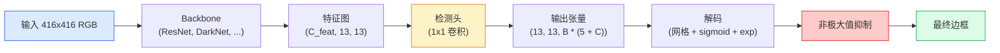

# Object Detection — YOLO from Scratch

> Detection is classification plus regression, run at every position in a feature map, then cleaned up with non-maximum suppression.

**Type:** 构建
**Languages:** Python
**Prerequisites:** Phase 4 Lesson 03 (卷积神经网络, CNNs), Phase 4 Lesson 04 (图像分类, Image Classification), Phase 4 Lesson 05 (迁移学习, Transfer Learning)
**Time:** ~75 分钟

## Learning Objectives

- 解释将检测转为密集预测问题的网格和锚框设计，并说明输出张量中每个数字的含义
- 计算框的交并比（IoU）并从零实现非极大值抑制（NMS）
- 在预训练主干之上构建最小化的 YOLO 风格头部，包括分类、目标存在性（objectness）和框回归损失
- 阅读检测指标行（precision@0.5、recall、mAP@0.5、mAP@0.5:0.95）并选择下一个最有用的调参方向

## The Problem

Classification says "this image is a dog." Detection says "there is a dog at pixels (112, 40, 280, 210), there is a cat at (400, 180, 560, 310), and nothing else in the frame." That one structural change — predicting a variable number of labelled boxes instead of one label per image — is what every autonomous system, every surveillance product, every document layout parser, and every factory vision line depends on.

Detection is also where every engineering trade-off in vision shows up at once. You want boxes that are accurate (regression head), you want the right class for each box (classification head), you want the model to know when there is nothing to detect (objectness score), and you want exactly one prediction per real object (non-maximum suppression). Miss any of these and the pipeline either misses objects, reports hallucinated boxes, or predicts the same object fifteen times in slightly different positions.

YOLO (You Only Look Once, Redmon et al. 2016) was the design that made all of this run in real time by doing it with a single forward pass of a conv net, and the same structural decisions are still the backbone of modern detectors (YOLOv8, YOLOv9, YOLO-NAS, RT-DETR). Learn the core and every variant becomes a rearrangement of the same parts.

## The Concept

### Detection as dense prediction

A classifier outputs C numbers per image. A YOLO-style detector outputs `(S x S x (5 + C))` numbers per image, where S is the spatial grid size.



Each of the `S * S` grid cells predicts `B` boxes. For each box:

- 4 numbers describe geometry: `tx, ty, tw, th`.
- 1 number is the objectness score: "is there an object centred in this cell?"
- C numbers are class probabilities.

Total per cell: `B * (5 + C)`. For VOC with `S=13, B=2, C=20`, that is 50 numbers per cell.

### Why grids and anchors

Plain regression would predict `(x, y, w, h)` for every object as an absolute coordinate. That is hard for a conv network because translating the image should not translate all predictions by the same amount — each object is spatially anchored. The grid answers this by assigning each ground-truth box to the grid cell its centre falls in; only that cell is responsible for that object.

Anchors address a second problem. A 3x3 conv cannot easily regress a 500-pixel-wide box out of a 16-pixel receptive field feature cell. Instead, we pre-define `B` prior box shapes (anchors) per cell and predict small deltas from each anchor. The model learns to pick the right anchor and nudge it rather than regress from nothing.

```
Anchor box priors (example for 416x416 input):

  small:   (30,  60)
  medium:  (75,  170)
  large:   (200, 380)

At each grid cell, every anchor emits (tx, ty, tw, th, obj, c_1, ..., c_C).
```

Modern detectors often use `FPN` with different anchor sets per resolution — small anchors on shallow high-resolution maps, large anchors on deep low-resolution maps. Same idea, more scales.

### Decoding predictions

The raw `tx, ty, tw, th` are not box coordinates; they are regression targets to be transformed before plotting:

```
centre x  = (sigmoid(tx) + cell_x) * stride
centre y  = (sigmoid(ty) + cell_y) * stride
width     = anchor_w * exp(tw)
height    = anchor_h * exp(th)
```

`sigmoid` keeps centre offsets inside the cell. `exp` lets the width scale freely from the anchor without a sign flip. `stride` scales the grid coordinates back to pixels. This decode step is the same in every YOLO version since v2.

### IoU

Detection's universal similarity metric between two boxes:

```
IoU(A, B) = area(A intersect B) / area(A union B)
```

IoU = 1 means identical; IoU = 0 means no overlap. IoU between the prediction and the ground-truth box is what decides whether a prediction counts as a true positive (typically IoU >= 0.5). IoU between two predictions is what NMS uses to deduplicate.

### Non-maximum suppression

A conv network trained on adjacent anchors will often predict overlapping boxes for the same object. NMS keeps the highest-confidence prediction and deletes any other prediction with IoU above a threshold.

```
NMS(boxes, scores, iou_threshold):
    sort boxes by score descending
    keep = []
    while boxes not empty:
        pick the top-scoring box, add to keep
        remove every box with IoU > iou_threshold to the picked box
    return keep
```

Typical threshold: 0.45 for object detection. Recent detectors replace standard NMS with `soft-NMS`, `DIoU-NMS`, or learn the suppression directly (RT-DETR) but the structural purpose is the same.

### The loss

YOLO loss is three losses added with weights:

```
L = lambda_coord * L_box(pred, target, where obj=1)
  + lambda_obj   * L_obj(pred, 1,     where obj=1)
  + lambda_noobj * L_obj(pred, 0,     where obj=0)
  + lambda_cls   * L_cls(pred, target, where obj=1)
```

Only cells that contain an object contribute to the box-regression and classification losses. Cells without objects contribute only to the objectness loss (teaching the model to stay silent). `lambda_noobj` is usually small (~0.5) because the vast majority of cells are empty and would otherwise dominate the total loss.

Modern variants swap MSE box loss for CIoU / DIoU (which optimise IoU directly), use focal loss for class imbalance, and balance objectness with quality focal loss. The three-component structure is unchanged.

### Detection metrics

Accuracy does not transfer to detection. Four numbers that do:

- **Precision@IoU=0.5** — of the predictions counted as positives, how many are actually correct.
- **Recall@IoU=0.5** — of the real objects, how many did we find.
- **AP@0.5** — precision-recall curve area at IoU threshold 0.5; one number per class.
- **mAP@0.5:0.95** — average of AP over IoU thresholds 0.5, 0.55, ..., 0.95. The COCO metric; strictest and most informative.

Report all four. A detector that is strong on mAP@0.5 but weak on mAP@0.5:0.95 is localising roughly but not tightly; fix with better box-regression loss. A detector with high precision and low recall is too conservative; lower the confidence threshold or increase the objectness weight.

## Build It

### Step 1: IoU

The workhorse of the whole lesson. Works on two arrays of boxes in `(x1, y1, x2, y2)` format.

```python
import numpy as np

def box_iou(boxes_a, boxes_b):
    ax1, ay1, ax2, ay2 = boxes_a[:, 0], boxes_a[:, 1], boxes_a[:, 2], boxes_a[:, 3]
    bx1, by1, bx2, by2 = boxes_b[:, 0], boxes_b[:, 1], boxes_b[:, 2], boxes_b[:, 3]

    inter_x1 = np.maximum(ax1[:, None], bx1[None, :])
    inter_y1 = np.maximum(ay1[:, None], by1[None, :])
    inter_x2 = np.minimum(ax2[:, None], bx2[None, :])
    inter_y2 = np.minimum(ay2[:, None], by2[None, :])

    inter_w = np.clip(inter_x2 - inter_x1, 0, None)
    inter_h = np.clip(inter_y2 - inter_y1, 0, None)
    inter = inter_w * inter_h

    area_a = (ax2 - ax1) * (ay2 - ay1)
    area_b = (bx2 - bx1) * (by2 - by1)
    union = area_a[:, None] + area_b[None, :] - inter
    return inter / np.clip(union, 1e-8, None)
```

返回一个形状为 `(N_a, N_b)` 的成对 IoU 矩阵。可以通过将其中一个数组设为形状 `(1, 4)` 来对单个真值框进行计算。

### Step 2: Non-max suppression

```python
def nms(boxes, scores, iou_threshold=0.45):
    order = np.argsort(-scores)
    keep = []
    while len(order) > 0:
        i = order[0]
        keep.append(i)
        if len(order) == 1:
            break
        rest = order[1:]
        ious = box_iou(boxes[[i]], boxes[rest])[0]
        order = rest[ious <= iou_threshold]
    return np.array(keep, dtype=np.int64)
```

确定性算法，从排序有 `O(N log N)` 复杂度，并在相同输入上与 `torchvision.ops.nms` 的行为一致。

### Step 3: Box encoding and decoding

Convert between pixel coordinates and the `(tx, ty, tw, th)` targets that the network actually regresses.

```python
def encode(box_xyxy, cell_x, cell_y, stride, anchor_wh):
    x1, y1, x2, y2 = box_xyxy
    cx = 0.5 * (x1 + x2)
    cy = 0.5 * (y1 + y2)
    w = x2 - x1
    h = y2 - y1
    tx = cx / stride - cell_x
    ty = cy / stride - cell_y
    tw = np.log(w / anchor_wh[0] + 1e-8)
    th = np.log(h / anchor_wh[1] + 1e-8)
    return np.array([tx, ty, tw, th])


def decode(tx_ty_tw_th, cell_x, cell_y, stride, anchor_wh):
    tx, ty, tw, th = tx_ty_tw_th
    cx = (sigmoid(tx) + cell_x) * stride
    cy = (sigmoid(ty) + cell_y) * stride
    w = anchor_wh[0] * np.exp(tw)
    h = anchor_wh[1] * np.exp(th)
    return np.array([cx - w / 2, cy - h / 2, cx + w / 2, cy + h / 2])


def sigmoid(x):
    return 1.0 / (1.0 + np.exp(-x))
```

测试：先对一个框做 `encode`，再做 `decode` —— 你应当得到与原始框非常接近的结果（注意 sigmoid 的逆并不总是完美可逆，因此有小误差是正常的）。

### Step 4: A minimal YOLO head

One 1x1 conv on a feature map, reshaping to `(B, S, S, num_anchors, 5 + C)`.

```python
import torch
import torch.nn as nn

class YOLOHead(nn.Module):
    def __init__(self, in_c, num_anchors, num_classes):
        super().__init__()
        self.num_anchors = num_anchors
        self.num_classes = num_classes
        self.conv = nn.Conv2d(in_c, num_anchors * (5 + num_classes), kernel_size=1)

    def forward(self, x):
        n, _, h, w = x.shape
        y = self.conv(x)
        y = y.view(n, self.num_anchors, 5 + self.num_classes, h, w)
        y = y.permute(0, 3, 4, 1, 2).contiguous()
        return y
```

输出形状：`(N, H, W, num_anchors, 5 + C)`。最后一个维度按顺序保存 `[tx, ty, tw, th, obj, cls_0, ..., cls_{C-1}]`。

### Step 5: Ground-truth assignment

For every ground-truth box, decide which `(cell, anchor)` is responsible.

```python
def assign_targets(boxes_xyxy, classes, anchors, stride, grid_size, num_classes):
    num_anchors = len(anchors)
    target = np.zeros((grid_size, grid_size, num_anchors, 5 + num_classes), dtype=np.float32)
    has_obj = np.zeros((grid_size, grid_size, num_anchors), dtype=bool)

    for box, cls in zip(boxes_xyxy, classes):
        x1, y1, x2, y2 = box
        cx, cy = 0.5 * (x1 + x2), 0.5 * (y1 + y2)
        gx, gy = int(cx / stride), int(cy / stride)
        bw, bh = x2 - x1, y2 - y1

        ious = np.array([
            (min(bw, aw) * min(bh, ah)) / (bw * bh + aw * ah - min(bw, aw) * min(bh, ah))
            for aw, ah in anchors
        ])
        best = int(np.argmax(ious))
        aw, ah = anchors[best]

        target[gy, gx, best, 0] = cx / stride - gx
        target[gy, gx, best, 1] = cy / stride - gy
        target[gy, gx, best, 2] = np.log(bw / aw + 1e-8)
        target[gy, gx, best, 3] = np.log(bh / ah + 1e-8)
        target[gy, gx, best, 4] = 1.0
        target[gy, gx, best, 5 + cls] = 1.0
        has_obj[gy, gx, best] = True
    return target, has_obj
```

锚框选择使用“与真值框形状 IoU 最匹配”的策略 — 这是一种廉价的近似方法，和 YOLOv2/v3 的赋值策略一致。v5 及以后版本使用更复杂的匹配策略（如 task-aligned matching、dynamic k），但本质思想相同。

### Step 6: The three losses

```python
def yolo_loss(pred, target, has_obj, lambda_coord=5.0, lambda_obj=1.0, lambda_noobj=0.5, lambda_cls=1.0):
    has_obj_t = torch.from_numpy(has_obj).bool()
    target_t = torch.from_numpy(target).float()

    # 边框回归损失：仅在包含目标的单元上计算
    box_pred = pred[..., :4][has_obj_t]
    box_true = target_t[..., :4][has_obj_t]
    loss_box = torch.nn.functional.mse_loss(box_pred, box_true, reduction="sum")

    # 目标存在性损失
    obj_pred = pred[..., 4]
    obj_true = target_t[..., 4]
    loss_obj_pos = torch.nn.functional.binary_cross_entropy_with_logits(
        obj_pred[has_obj_t], obj_true[has_obj_t], reduction="sum")
    loss_obj_neg = torch.nn.functional.binary_cross_entropy_with_logits(
        obj_pred[~has_obj_t], obj_true[~has_obj_t], reduction="sum")

    # 分类损失：仅在包含目标的单元上计算
    cls_pred = pred[..., 5:][has_obj_t]
    cls_true = target_t[..., 5:][has_obj_t]
    loss_cls = torch.nn.functional.binary_cross_entropy_with_logits(
        cls_pred, cls_true, reduction="sum")

    total = (lambda_coord * loss_box
             + lambda_obj * loss_obj_pos
             + lambda_noobj * loss_obj_neg
             + lambda_cls * loss_cls)
    return total, {"box": loss_box.item(), "obj_pos": loss_obj_pos.item(),
                   "obj_neg": loss_obj_neg.item(), "cls": loss_cls.item()}
```

五个超参数通常在各类 YOLO 教程中要么被硬编码要么被网格搜索。比例很重要：`lambda_coord=5, lambda_noobj=0.5` 对应最初 YOLOv1 的设定，仍然是合理的默认值。

### Step 7: Inference pipeline

Decode the raw head output, apply sigmoid/exp, threshold on objectness, and NMS.

```python
def postprocess(pred_tensor, anchors, stride, img_size, conf_threshold=0.25, iou_threshold=0.45):
    pred = pred_tensor.detach().cpu().numpy()
    grid_h, grid_w = pred.shape[1], pred.shape[2]
    num_anchors = len(anchors)

    boxes, scores, classes = [], [], []
    for gy in range(grid_h):
        for gx in range(grid_w):
            for a in range(num_anchors):
                tx, ty, tw, th, obj, *cls = pred[0, gy, gx, a]
                score = sigmoid(obj) * sigmoid(np.array(cls)).max()
                if score < conf_threshold:
                    continue
                cls_idx = int(np.argmax(cls))
                cx = (sigmoid(tx) + gx) * stride
                cy = (sigmoid(ty) + gy) * stride
                w = anchors[a][0] * np.exp(tw)
                h = anchors[a][1] * np.exp(th)
                boxes.append([cx - w / 2, cy - h / 2, cx + w / 2, cy + h / 2])
                scores.append(float(score))
                classes.append(cls_idx)

    if not boxes:
        return np.zeros((0, 4)), np.zeros((0,)), np.zeros((0,), dtype=int)
    boxes = np.array(boxes)
    scores = np.array(scores)
    classes = np.array(classes)
    keep = nms(boxes, scores, iou_threshold)
    return boxes[keep], scores[keep], classes[keep]
```

这就是完整的推理路径：head -> 解码 -> 阈值筛选 -> NMS。

## Use It

`torchvision.models.detection` ships production detectors with the same conceptual structure. Loading a pretrained model takes three lines.

```python
import torch
from torchvision.models.detection import fasterrcnn_resnet50_fpn_v2

model = fasterrcnn_resnet50_fpn_v2(weights="DEFAULT")
model.eval()
with torch.no_grad():
    predictions = model([torch.randn(3, 400, 600)])
print(predictions[0].keys())
print(f"boxes:  {predictions[0]['boxes'].shape}")
print(f"scores: {predictions[0]['scores'].shape}")
print(f"labels: {predictions[0]['labels'].shape}")
```

对于实时推理流水线，`ultralytics`（YOLOv8/v9）是标准选择：`from ultralytics import YOLO; model = YOLO('yolov8n.pt'); model(img)`。模型会在内部处理解码和 NMS，并返回与上面构建的相同的 `boxes / scores / labels` 三元组。

## Ship It

This lesson produces:

- `outputs/prompt-detection-metric-reader.md` — 一个提示词，用来将 `precision, recall, AP, mAP@0.5:0.95` 的一行指标转成一句话的诊断与最有用的下一步实验建议。
- `outputs/skill-anchor-designer.md` — 一个技能脚本，给定一个真值框数据集，对 `(w, h)` 运行 k-means，返回每个 FPN 级别的锚框集合以及你需要的覆盖率统计以决定锚框数量。

## Exercises

1. **(Easy)** Implement `box_iou` and run it against `torchvision.ops.box_iou` on 1,000 random box pairs. Verify max absolute difference is below `1e-6`.
2. **(Medium)** Port `yolo_loss` to a version that uses `CIoU` box loss instead of MSE. Show on a 100-image synthetic dataset that CIoU converges to a better final mAP@0.5:0.95 than MSE in the same number of epochs.
3. **(Hard)** Implement multi-scale inference: feed the same image at three resolutions through the model, union the box predictions, and run a single NMS at the end. Measure the mAP lift vs single-scale inference on a held-out set.

## Key Terms

| Term | What people say | What it actually means |
|------|----------------|----------------------|
| Anchor | "Box prior" | 在每个网格单元上预定义的框形状，网络对其预测增量而不是绝对坐标 |
| IoU | "Overlap" | 两个框的交并比（Intersection-over-Union）；检测中的通用相似度度量 |
| NMS | "Deduplicate" | 贪心算法：保留得分最高的预测并移除与其 IoU 超过阈值的其他预测 |
| Objectness | "Is there something here" | 每个锚框、每个单元的标量，预测该单元中心是否有目标（目标存在性/置信度） |
| Grid stride | "Downsample factor" | 每个网格单元对应的像素数；例如 416 像素输入和 13×13 的 head 对应 stride=32 |
| mAP | "Mean average precision" | 精度-召回曲线下面积的平均值，按类别（以及对于 COCO 按不同 IoU 阈值）平均 |
| AP@0.5 | "PASCAL VOC AP" | IoU 阈值为 0.5 时的平均精度；该指标较宽松 |
| mAP@0.5:0.95 | "COCO AP" | 在 IoU 阈值 0.5..0.95（步长 0.05）上对 AP 求平均；更严格，也是当前社区标准 |

## Further Reading

- [YOLOv1: You Only Look Once (Redmon et al., 2016)](https://arxiv.org/abs/1506.02640) — the founding paper; every YOLO since is a refinement of this structure
- [YOLOv3 (Redmon & Farhadi, 2018)](https://arxiv.org/abs/1804.02767) — the paper that introduced multi-scale FPN-style heads; still the clearest diagram
- [Ultralytics YOLOv8 docs](https://docs.ultralytics.com) — the current production reference; covers dataset formats, augmentations, training recipes
- [The Illustrated Guide to Object Detection (Jonathan Hui)](https://jonathan-hui.medium.com/object-detection-series-24d03a12f904) — best plain-English tour of the full detector zoo; priceless for understanding how DETR, RetinaNet, FCOS, and YOLO relate