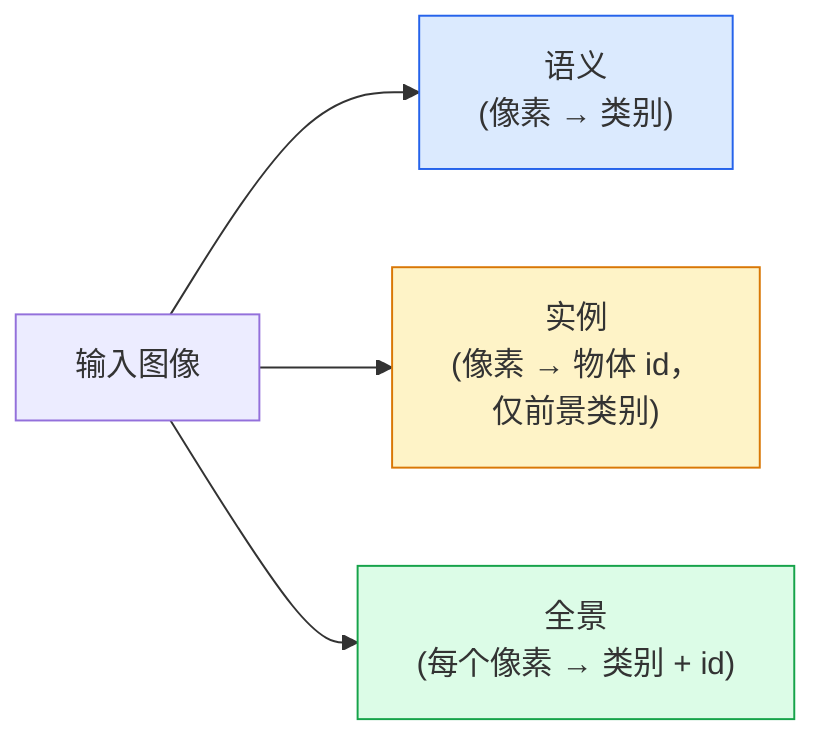
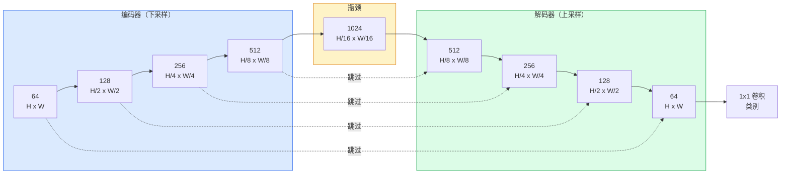

# 语义分割 — U-Net

> 分割是在每个像素上做分类。U-Net 通过将下采样的编码器与上采样的解码器配对，并在它们之间接入跳跃连接，从而实现了这一点。

**Type:** 构建  
**Languages:** Python  
**Prerequisites:** Phase 4 Lesson 03（CNNs）、Phase 4 Lesson 04（图像分类）  
**Time:** ~75 分钟

## 学习目标

- 区分语义分割、实例分割与全景分割，并为给定问题选择合适的任务
- 在 PyTorch 中从头构建一个 U-Net，包含编码器模块、瓶颈、带转置卷积或双线性上采样的解码器，以及跳跃连接
- 实现像素级交叉熵、Dice 损失，以及当前医学与工业分割默认使用的组合损失
- 每类读取 IoU 与 Dice 指标，并诊断糟糕得分是由小目标召回、边界精度还是类别不平衡引起

## 问题描述

分类在每张图片输出一个标签。检测在每张图片输出若干个框。分割在每个像素上输出一个标签。对于尺寸为 `H x W` 的输入，输出是形状为 `H x W`（语义）或 `H x W x N_instances`（实例）的张量。也就是说这是每张图像上百万级的预测，而不是一个。

分割之所以能驱动几乎所有密集预测的视觉产品，是因为它的结构满足真实任务的需求：医学影像（肿瘤掩码）、自动驾驶（路面、车道、障碍物）、卫星影像（建筑边界、作物边界）、文档解析（版面分区）、机器人（可抓取区域）。这些任务都不能仅用一个包围框解决；它们需要精确的轮廓。

架构上的问题说起来简单，做起来不易：网络需要同时看到图像的全局上下文（这是怎样的场景）和像素级的局部细节（哪个像素是路，哪个是人行道）。标准 CNN 为了获取上下文会进行空间压缩，这会丢弃细节。U-Net 的设计既保留了上下文又保留了细节。

## 概念

### 语义 vs 实例 vs 全景



- **语义** 表示“这个像素是路，那个人像素是车”。相邻的两辆车会合并成一个整体区域。
- **实例** 表示“这个像素是车 #3，那个像素是车 #5”。通常仅对前景物体（things）进行分离，忽略背景“stuff”（如天空、路面、草地）。
- **全景** 将两者统一：每个像素得到一个类别标签，每个实例还得到一个唯一 id，既划分 stuff 也划分 things。

本课覆盖语义分割。下一课（Mask R-CNN）覆盖实例分割。

### U-Net 的结构



编码器将空间分辨率下采样四次并将通道数每次翻倍。解码器则反向操作：上采样四次并每次将通道数减半。跳跃连接在每个分辨率上将匹配的编码器特征与解码器特征进行拼接。最后的 1x1 卷积将 `64 -> num_classes` 映射到全分辨率上。

为什么需要跳跃连接：当解码器尝试输出像素级预测时，它只见过较小的特征图。没有跳跃连接的话，编码器在下采样过程中丢弃了边界等定位信息，解码器无法精确定位。跳跃连接把编码器在下采样过程中计算出的高分辨率特征图直接交给解码器。

### 转置卷积 vs 双线性上采样

解码器需要扩展空间维度。有两种常见方案：

- **转置卷积**（`nn.ConvTranspose2d`）— 可学习的上采样。历史上的 U-Net 默认。若 stride 与 kernel_size 不整除可能产生棋盘状伪影。
- **双线性上采样 + 3x3 卷积** — 先做平滑的上采样再跟一层卷积。更少伪影、参数更少，现在更常用。

两者在实践中都能见到。对于第一个 U-Net，双线性上采样更稳妥。

### 像素网格上的交叉熵

对于具有 C 个类别的语义分割，模型输出形状为 `(N, C, H, W)`。目标是形状 `(N, H, W)` 的整数类别 ID。交叉熵与分类情形完全相同，只是在每个空间位置上都应用：

```
Loss = mean over (n, h, w) of -log( softmax(logits[n, :, h, w])[target[n, h, w]] )
```

PyTorch 中的 `F.cross_entropy` 原生支持这个形状。无需重塑张量。

### Dice 损失及其必要性

交叉熵对每个像素一视同仁。当某个类别主导图像时（例如医学影像：99% 背景，1% 肿瘤），这会带来问题。网络可能通过预测所有像素为背景就得到 99% 的准确率，但这对任务没有用。

Dice 损失通过直接优化预测与真实掩码的重叠来解决这个问题：

```
Dice(p, y) = 2 * sum(p * y) / (sum(p) + sum(y) + epsilon)
Dice_loss = 1 - Dice
```

其中 `p` 是某类的 sigmoid/softmax 概率图，`y` 是该类的二值真值掩码。当且仅当重叠完全相同时损失为零。因为它是基于比率的，类别不平衡对它无关紧要。

实际上推荐使用**组合损失**：

```
L = L_cross_entropy + lambda * L_dice       (lambda ~ 1)
```

交叉熵在训练早期提供稳定梯度；Dice 则在训练后期聚焦于匹配掩码形状。这个组合是医学影像的默认，并且在任何类别不平衡的数据集上都很难被超越。

### 评估指标

- **像素准确率（Pixel accuracy）** — 预测正确的像素百分比。计算便宜。但在不平衡数据上会失效（与分类中的准确率问题相同）。
- **每类 IoU** — 每个类别掩码的交并比；对类别取平均得到 mIoU。
- **Dice（像素级 F1）** — 与 IoU 相近；`Dice = 2 * IoU / (1 + IoU)`。医学界偏好 Dice，视觉社区偏好 IoU；两者单调相关。
- **Boundary F1** — 测量预测边界与真实边界的接近程度，对微小偏移也会惩罚。对高精度任务（如半导体检测）很重要。

请按类报告 IoU，而不仅仅给出 mIoU。平均 IoU 会掩盖某个类别的糟糕表现（例如一个类别 IoU 是 15%，其余九类都是 85% 时，平均仍然看起来不错）。

### 输入分辨率权衡

U-Net 的编码器将分辨率下采样四次，因此输入必须能被 16 整除。医学图像通常是 512x512 或 1024x1024。自动驾驶裁剪通常是 2048x1024。U-Net 的显存占用随 `H * W * C_max` 增长，在 1024x1024 且瓶颈通道为 1024 时前向传播就会使用数 GB 的显存。

两种常见的变通：
1. 切块输入 — 处理带重叠的 256x256 瓦片并拼接。
2. 将瓶颈替换为空洞卷积（dilated convs），保持更高的空间分辨率同时扩大感受野（例如 DeepLab 系列）。

对于第一个模型，使用 256x256 输入与 base=64 的 U-Net 在 8 GB VRAM 上训练是舒适可行的。

## 实现

### 步骤 1：编码器块

两个 3x3 卷积，后接 BatchNorm 与 ReLU。第一个卷积改变通道数，第二个保持通道数。

```python
import torch
import torch.nn as nn
import torch.nn.functional as F

class DoubleConv(nn.Module):
    def __init__(self, in_c, out_c):
        super().__init__()
        self.net = nn.Sequential(
            nn.Conv2d(in_c, out_c, kernel_size=3, padding=1, bias=False),
            nn.BatchNorm2d(out_c),
            nn.ReLU(inplace=True),
            nn.Conv2d(out_c, out_c, kernel_size=3, padding=1, bias=False),
            nn.BatchNorm2d(out_c),
            nn.ReLU(inplace=True),
        )

    def forward(self, x):
        return self.net(x)
```

这个模块在整个网络中复用。`bias=False` 是因为 BN 的偏置项承担了偏移的作用。

### 步骤 2：下采样与上采样模块

```python
class Down(nn.Module):
    def __init__(self, in_c, out_c):
        super().__init__()
        self.net = nn.Sequential(
            nn.MaxPool2d(2),
            DoubleConv(in_c, out_c),
        )

    def forward(self, x):
        return self.net(x)


class Up(nn.Module):
    def __init__(self, in_c, out_c):
        super().__init__()
        self.up = nn.Upsample(scale_factor=2, mode="bilinear", align_corners=False)
        self.conv = DoubleConv(in_c, out_c)

    def forward(self, x, skip):
        x = self.up(x)
        if x.shape[-2:] != skip.shape[-2:]:
            x = F.interpolate(x, size=skip.shape[-2:], mode="bilinear", align_corners=False)
        x = torch.cat([skip, x], dim=1)
        return self.conv(x)
```

这里只比较空间维度（`shape[-2:]`）以处理输入尺寸不能被 16 整除的情况；在拼接之前用安全的 `F.interpolate` 对齐张量。若比较完整形状会在通道数不匹配时也触发，这应当是个显而易见的错误而不是静默地插值。

### 步骤 3：U-Net

```python
class UNet(nn.Module):
    def __init__(self, in_channels=3, num_classes=2, base=64):
        super().__init__()
        self.inc = DoubleConv(in_channels, base)
        self.d1 = Down(base, base * 2)
        self.d2 = Down(base * 2, base * 4)
        self.d3 = Down(base * 4, base * 8)
        self.d4 = Down(base * 8, base * 16)
        self.u1 = Up(base * 16 + base * 8, base * 8)
        self.u2 = Up(base * 8 + base * 4, base * 4)
        self.u3 = Up(base * 4 + base * 2, base * 2)
        self.u4 = Up(base * 2 + base, base)
        self.outc = nn.Conv2d(base, num_classes, kernel_size=1)

    def forward(self, x):
        x1 = self.inc(x)
        x2 = self.d1(x1)
        x3 = self.d2(x2)
        x4 = self.d3(x3)
        x5 = self.d4(x4)
        x = self.u1(x5, x4)
        x = self.u2(x, x3)
        x = self.u3(x, x2)
        x = self.u4(x, x1)
        return self.outc(x)

net = UNet(in_channels=3, num_classes=2, base=32)
x = torch.randn(1, 3, 256, 256)
print(f"output: {net(x).shape}")
print(f"params: {sum(p.numel() for p in net.parameters()):,}")
```

输出形状为 `(1, 2, 256, 256)` —— 与输入在空间尺寸上相同，通道数为 `num_classes`。当 `base=32` 时大约有 7.7M 参数。

### 步骤 4：损失

```python
def dice_loss(logits, targets, num_classes, eps=1e-6):
    probs = F.softmax(logits, dim=1)
    targets_one_hot = F.one_hot(targets, num_classes).permute(0, 3, 1, 2).float()
    dims = (0, 2, 3)
    intersection = (probs * targets_one_hot).sum(dim=dims)
    denom = probs.sum(dim=dims) + targets_one_hot.sum(dim=dims)
    dice = (2 * intersection + eps) / (denom + eps)
    return 1 - dice.mean()


def combined_loss(logits, targets, num_classes, lam=1.0):
    ce = F.cross_entropy(logits, targets)
    dc = dice_loss(logits, targets, num_classes)
    return ce + lam * dc, {"ce": ce.item(), "dice": dc.item()}
```

Dice 在每个类别上单独计算后取平均（macro Dice）。`eps` 防止在批次中某些类别缺失时出现除零问题。

### 步骤 5：每类 IoU 指标

```python
@torch.no_grad()
def iou_per_class(logits, targets, num_classes):
    preds = logits.argmax(dim=1)
    ious = torch.zeros(num_classes)
    for c in range(num_classes):
        pred_c = (preds == c)
        true_c = (targets == c)
        inter = (pred_c & true_c).sum().float()
        union = (pred_c | true_c).sum().float()
        ious[c] = (inter / union) if union > 0 else torch.tensor(float("nan"))
    return ious
```

返回长度为 C 的向量。`nan` 标记在该批次中不存在的类别——在计算 mIoU 时不要将这些 `nan` 纳入平均。

### 步骤 6：用于端到端验证的合成数据集

在有色背景上生成形状，使网络必须学习形状而非像素颜色。

```python
import numpy as np
from torch.utils.data import Dataset, DataLoader

def synthetic_segmentation(num_samples=200, size=64, seed=0):
    rng = np.random.default_rng(seed)
    images = np.zeros((num_samples, size, size, 3), dtype=np.float32)
    masks = np.zeros((num_samples, size, size), dtype=np.int64)
    for i in range(num_samples):
        bg = rng.uniform(0, 1, (3,))
        images[i] = bg
        masks[i] = 0
        num_shapes = rng.integers(1, 4)
        for _ in range(num_shapes):
            cls = int(rng.integers(1, 3))
            color = rng.uniform(0, 1, (3,))
            cx, cy = rng.integers(10, size - 10, size=2)
            r = int(rng.integers(4, 12))
            yy, xx = np.meshgrid(np.arange(size), np.arange(size), indexing="ij")
            if cls == 1:
                mask = (xx - cx) ** 2 + (yy - cy) ** 2 < r ** 2
            else:
                mask = (np.abs(xx - cx) < r) & (np.abs(yy - cy) < r)
            images[i][mask] = color
            masks[i][mask] = cls
        images[i] += rng.normal(0, 0.02, images[i].shape)
        images[i] = np.clip(images[i], 0, 1)
    return images, masks


class SegDataset(Dataset):
    def __init__(self, images, masks):
        self.images = images
        self.masks = masks

    def __len__(self):
        return len(self.images)

    def __getitem__(self, i):
        img = torch.from_numpy(self.images[i]).permute(2, 0, 1).float()
        mask = torch.from_numpy(self.masks[i]).long()
        return img, mask
```

三个类别：背景（0）、圆形（1）、方形（2）。网络必须学习区分形状。

### 步骤 7：训练循环

```python
def train_one_epoch(model, loader, optimizer, device, num_classes):
    model.train()
    loss_sum, total = 0.0, 0
    iou_sum = torch.zeros(num_classes)
    for x, y in loader:
        x, y = x.to(device), y.to(device)
        logits = model(x)
        loss, _ = combined_loss(logits, y, num_classes)
        optimizer.zero_grad()
        loss.backward()
        optimizer.step()
        loss_sum += loss.item() * x.size(0)
        total += x.size(0)
        iou_sum += iou_per_class(logits, y, num_classes).nan_to_num(0)
    return loss_sum / total, iou_sum / len(loader)
```

在合成数据集上运行 10–30 个 epoch，可以看到形状类别的 mIoU 越过 0.9。注意这里使用 `nan_to_num(0)` 把批次中缺失的类别视为 0；要获得准确的每类 IoU，应在评估时用存在性掩码并使用 `torch.nanmean` 在批次间求平均，而不是在训练循环里简单平均。

## 使用（Production）

在生产中，`segmentation_models_pytorch`（简称 "smp"）封装了所有标准分割架构并支持 torchvision 或 timm 的 backbone。三行代码即可：

```python
import segmentation_models_pytorch as smp

model = smp.Unet(
    encoder_name="resnet34",
    encoder_weights="imagenet",
    in_channels=3,
    classes=3,
)
```

另外值得了解的真实工作流替代方案：
- **DeepLabV3+** 用空洞卷积替代基于 max-pool 的下采样，使瓶颈保留更高分辨率；在卫星与驾驶数据上对边界更友好。
- **SegFormer** 用分层 Transformer 代替卷积编码器；在许多基准上为当前 SOTA。
- **Mask2Former** / **OneFormer** 将语义、实例与全景分割统一到单个架构中。

这三者在 `smp` 或 `transformers` 中都是可直接替换的模型，使用相同的数据加载器。

## 交付成果

本课产出：

- `outputs/prompt-segmentation-task-picker.md` — 一个用于在语义/实例/全景分割之间选择并为给定任务命名合适架构的 prompt。
- `outputs/skill-segmentation-mask-inspector.md` — 一个技能（skill），用于报告类别分布、预测掩码统计以及那些被低估或边界模糊的类别。

## 练习

1. **（简单）** 为二分类分割任务（前景 vs 背景）实现 `bce_dice_loss`。在一个合成的两类数据集上验证：当前景占 5% 像素时，组合损失比单独的 BCE 收敛得更快。
2. **（中等）** 将 `nn.Upsample + conv` 的上采样模块替换为 `nn.ConvTranspose2d` 上采样模块。在合成数据集上分别训练两者并比较 mIoU。观察转置卷积版本中棋盘状伪影出现的位置。
3. **（困难）** 选取一个真实的分割数据集（Oxford-IIIT Pets、Cityscapes 的小子集或某个医学子集），训练 U-Net 使其与 `smp.Unet` 参考模型的 IoU 相差不超过 2 个百分点。报告每类 IoU，并识别哪些类别在添加 Dice 到损失后受益最多。

## 术语表

| 术语 | 大家怎么说 | 实际含义 |
|------|----------------|----------------------|
| 语义分割 | "Label every pixel" | 将每个像素分类到 C 个类别；同类的不同实例会合并 |
| 实例分割 | "Label every object" | 区分同类的不同实例；通常只对前景物体进行 |
| 全景分割 | "Semantic + instance" | 每个像素都有类别；每个 thing 实例还有唯一 id |
| 跳跃连接 | "U-Net bridge" | 将编码器在相同分辨率下的特征拼接到解码器特征中；保留高频细节 |
| 转置卷积 | "Deconvolution" | 可学习的上采样；可能产生棋盘伪影 |
| Dice 损失 | "Overlap loss" | 1 - 2|A ∩ B| / (|A| + |B|)；直接优化掩码重叠，对类别不平衡鲁棒 |
| mIoU | "Mean intersection over union" | 各类 IoU 的平均；分割任务的社区标准度量 |
| 边界 F1 | "Boundary accuracy" | 仅在边界像素上计算的 F1；对精度敏感的任务很重要 |

## 参考阅读

- [U-Net: Convolutional Networks for Biomedical Image Segmentation (Ronneberger et al., 2015)](https://arxiv.org/abs/1505.04597) — 原始论文；第 2 页的图是大家常拷贝的那张图
- [Fully Convolutional Networks (Long et al., 2015)](https://arxiv.org/abs/1411.4038) — 首次提出将分割作为端到端卷积问题的论文
- [segmentation_models_pytorch](https://github.com/qubvel/segmentation_models.pytorch) — 生产分割的参考实现；涵盖所有主流架构与常用损失
- [Lessons learned from training SOTA segmentation (kaggle.com competitions)](https://www.kaggle.com/code/iafoss/carvana-unet-pytorch) — 一篇关于为什么 TTA、伪标签（pseudo-labeling）和类别权重在真实数据上很重要的实战讲解