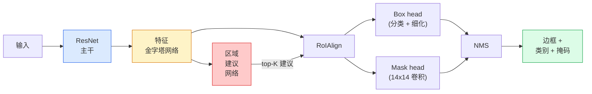

# Instance Segmentation — Mask R-CNN

> Add a tiny mask branch to a Faster R-CNN detector and you have instance segmentation. The hard part is RoIAlign, and it is harder than it looks.

**Type:** 构建 + 学习  
**Languages:** Python  
**Prerequisites:** 第4阶段 第06课 (YOLO), 第4阶段 第07课 (U-Net)  
**Time:** ~75 分钟

## Learning Objectives

- 跟踪 Mask R-CNN 架构的端到端流程：backbone、FPN、RPN、RoIAlign、box head、mask head
- 从零实现 RoIAlign 并解释为什么不再使用 RoIPool
- 使用 torchvision 的 `maskrcnn_resnet50_fpn_v2` 预训练模型获得生产级实例掩码并正确读取其输出格式
- 通过替换 box 和 mask heads 且保持 backbone 冻结，在小型自定义数据集上微调 Mask R-CNN

## The Problem

语义分割为每个类别给出一个掩码。实例分割为每个对象给出一个掩码，即使两个对象属于同一类别也会区分。计数个体、跨帧跟踪以及测量（比如墙上每块砖的边界框、显微镜图像中每个细胞）都需要实例分割。

Mask R-CNN（He 等，2017）通过将实例分割重新表述为检测 + 掩码来解决这个问题。其设计非常简洁，随后五年内几乎所有实例分割的论文都是 Mask R-CNN 的变体，torchvision 的实现仍然是小到中等数据集的生产默认选择。

工程上的难点在于采样：如何从一个角点不对齐像素边界的候选框中裁剪出固定大小的特征区域？做错会在各处损失数十分之一的 mAP。RoIAlign 就是答案。

## The Concept

### The architecture



要理解的五个部分：

1. **Backbone** — 在 ImageNet 上训练的 ResNet-50 或 ResNet-101。产生步幅为 4、8、16、32 的特征图层级。
2. **FPN (Feature Pyramid Network)** — 自顶向下 + 侧连接，使每个层级都具有语义丰富的 C 通道特征。检测会查询匹配目标大小的 FPN 层级。
3. **RPN (Region Proposal Network)** — 一个小的卷积头，在每个 anchor 位置预测“这里有没有对象？”以及“如何回归修正框？”。每张图像产生约 1000 个候选框。
4. **RoIAlign** — 从任意 FPN 层的任意框中采样固定大小（例如 7x7）的特征补丁。双线性采样，无量化。
5. **Heads** — 两层的 box head 用于细化边框并选择类别，加上一个小型卷积 head 为每个候选框输出 `28x28` 的二值掩码。

### 为什么用 RoIAlign 而不是 RoIPool

原始的 Fast R-CNN 使用 RoIPool，将候选框分割为网格，取每个 cell 的最大特征，并将所有坐标四舍五入为整数。这样的四舍五入会使特征图与输入像素坐标错位最多一个特征图像素——在 224x224 图像上影响较小，但在步幅为 32 的特征图上则可能造成灾难性后果。

```
RoIPool:
  box (34.7, 51.3, 98.2, 142.9)
  round -> (34, 51, 98, 142)
  split grid -> round each cell boundary
  misalignment accumulates at every step

RoIAlign:
  box (34.7, 51.3, 98.2, 142.9)
  sample at exact float coordinates using bilinear interpolation
  no rounding anywhere
```

RoIAlign 在 COCO 上能免费提升掩码 AP 约 3-4 个点。现在所有关注定位的检测器都会使用它——YOLOv7 seg、RT-DETR、Mask2Former 都一样。

### RPN 一句话概述

在特征图的每个位置放置 K 个不同尺寸和形状的 anchor 框。为每个 anchor 预测一个物体性得分和一个回归偏移以将 anchor 变为更合适的框。按得分保留 top ~1,000 个框，在 IoU=0.7 处做 NMS，然后把幸存者交给 heads。RPN 使用自己的小损失进行训练——结构上与第6课中 YOLO 的损失相同，只是类别变为两个（有物体 / 无物体）。

### Mask head

对于每个候选框（经过 RoIAlign 后），mask head 是一个小型 FCN：四个 3x3 卷积，一个 2x 上采样的反卷积，最后一个 1x1 卷积输出 `num_classes` 通道的 `28x28` 分辨率。只保留与预测类别对应的通道；其余通道被忽略。这将掩码预测与分类解耦。

将 28x28 掩码上采样回候选框原始像素大小以生成最终的二值掩码。

### 损失

Mask R-CNN 的四个损失相加：

```
L = L_rpn_cls + L_rpn_box + L_box_cls + L_box_reg + L_mask
```

- `L_rpn_cls`, `L_rpn_box` — RPN 候选框的物体性 + 边框回归。
- `L_box_cls` — head 的分类器对 (C+1) 类（包含背景）的交叉熵。
- `L_box_reg` — head 的边框回归的 smooth L1。
- `L_mask` — 对 28x28 掩码输出的每像素二元交叉熵。

每个损失有自己的默认权重；torchvision 的实现将它们作为构造参数暴露出来。

### 输出格式

`torchvision.models.detection.maskrcnn_resnet50_fpn_v2` 返回一个字典列表，每张图像一个字典：

```
{
    "boxes":  (N, 4) in (x1, y1, x2, y2) pixel coordinates,
    "labels": (N,) class IDs, 0 = background so indices are 1-based,
    "scores": (N,) confidence scores,
    "masks":  (N, 1, H, W) float masks in [0, 1] — threshold at 0.5 for binary,
}
```

掩码已经是完整图像分辨率。28x28 的 head 输出在内部已被上采样。

## Build It

### Step 1: RoIAlign from scratch

这是 Mask R-CNN 中从代码角度比文字更容易理解的一个组件。

```python
import torch
import torch.nn.functional as F

def roi_align_single(feature, box, output_size=7, spatial_scale=1 / 16.0):
    """
    feature: (C, H, W) single-image feature map
    box: (x1, y1, x2, y2) in original image pixel coordinates
    output_size: side of the output grid (7 for box head, 14 for mask head)
    spatial_scale: reciprocal of the feature map stride
    """
    C, H, W = feature.shape
    x1, y1, x2, y2 = [c * spatial_scale - 0.5 for c in box]
    bin_w = (x2 - x1) / output_size
    bin_h = (y2 - y1) / output_size

    grid_y = torch.linspace(y1 + bin_h / 2, y2 - bin_h / 2, output_size)
    grid_x = torch.linspace(x1 + bin_w / 2, x2 - bin_w / 2, output_size)
    yy, xx = torch.meshgrid(grid_y, grid_x, indexing="ij")

    gx = 2 * (xx + 0.5) / W - 1
    gy = 2 * (yy + 0.5) / H - 1
    grid = torch.stack([gx, gy], dim=-1).unsqueeze(0)
    sampled = F.grid_sample(feature.unsqueeze(0), grid, mode="bilinear",
                            align_corners=False)
    return sampled.squeeze(0)
```

说明中的注释和实现确保每个采样点都位于双线性采样的位置。没有四舍五入、没有量化、没有中断梯度。

### Step 2: Compare to torchvision's RoIAlign

```python
from torchvision.ops import roi_align

feature = torch.randn(1, 16, 50, 50)
boxes = torch.tensor([[0, 10, 20, 100, 90]], dtype=torch.float32)  # (batch_idx, x1, y1, x2, y2)

ours = roi_align_single(feature[0], boxes[0, 1:].tolist(), output_size=7, spatial_scale=1/4)
theirs = roi_align(feature, boxes, output_size=(7, 7), spatial_scale=1/4, sampling_ratio=1, aligned=True)[0]

print(f"shape ours:   {tuple(ours.shape)}")
print(f"shape theirs: {tuple(theirs.shape)}")
print(f"max|diff|:    {(ours - theirs).abs().max().item():.3e}")
```

在 `sampling_ratio=1` 且 `aligned=True` 的设置下，两者在 `1e-5` 以内匹配。

### Step 3: Load a pretrained Mask R-CNN

```python
import torch
from torchvision.models.detection import maskrcnn_resnet50_fpn_v2, MaskRCNN_ResNet50_FPN_V2_Weights

model = maskrcnn_resnet50_fpn_v2(weights=MaskRCNN_ResNet50_FPN_V2_Weights.DEFAULT)
model.eval()
print(f"params: {sum(p.numel() for p in model.parameters()):,}")
print(f"classes (including background): {len(model.roi_heads.box_predictor.cls_score.out_features * [0])}")
```

46M 参数，91 个类别（COCO）。第一个类别（id 0）是背景；模型实际检测的类别从 id 1 开始。

### Step 4: Run inference

```python
with torch.no_grad():
    x = torch.randn(3, 400, 600)
    predictions = model([x])
p = predictions[0]
print(f"boxes:  {tuple(p['boxes'].shape)}")
print(f"labels: {tuple(p['labels'].shape)}")
print(f"scores: {tuple(p['scores'].shape)}")
print(f"masks:  {tuple(p['masks'].shape)}")
```

掩码张量形状为 `(N, 1, H, W)`。在 0.5 处阈值化以获得每个对象的二值掩码：

```python
binary_masks = (p['masks'] > 0.5).squeeze(1)  # (N, H, W) boolean
```

### Step 5: Swap the heads for a custom class count

常见的微调方案：复用 backbone、FPN 和 RPN；替换两个 classifier heads。

```python
from torchvision.models.detection.faster_rcnn import FastRCNNPredictor
from torchvision.models.detection.mask_rcnn import MaskRCNNPredictor

def build_custom_maskrcnn(num_classes):
    model = maskrcnn_resnet50_fpn_v2(weights=MaskRCNN_ResNet50_FPN_V2_Weights.DEFAULT)
    in_features = model.roi_heads.box_predictor.cls_score.in_features
    model.roi_heads.box_predictor = FastRCNNPredictor(in_features, num_classes)
    in_features_mask = model.roi_heads.mask_predictor.conv5_mask.in_channels
    hidden_layer = 256
    model.roi_heads.mask_predictor = MaskRCNNPredictor(in_features_mask, hidden_layer, num_classes)
    return model

custom = build_custom_maskrcnn(num_classes=5)
print(f"custom cls_score.out_features: {custom.roi_heads.box_predictor.cls_score.out_features}")
```

`num_classes` 必须包含背景类，因此有 4 个目标类别的数据集应使用 `num_classes=5`。

### Step 6: Freeze what does not need training

在小数据集上冻结 backbone 和 FPN。只有 RPN 的物体性与回归以及两个 heads 会被训练。

```python
def freeze_backbone_and_fpn(model):
    # torchvision Mask R-CNN 将 FPN 打包在 `model.backbone` 中（作为
    # `model.backbone.fpn`），因此遍历 `model.backbone.parameters()` 会覆盖
    # ResNet 的特征层以及 FPN 的侧/输出卷积。
    for p in model.backbone.parameters():
        p.requires_grad = False
    return model

custom = freeze_backbone_and_fpn(custom)
trainable = sum(p.numel() for p in custom.parameters() if p.requires_grad)
print(f"trainable after freeze: {trainable:,}")
```

在 500 张图像的数据集上，这通常决定了能否收敛而不是过拟合。

## Use It

torchvision 中用于 Mask R-CNN 的完整训练循环只有 40 行，任务之间没有实质性差别——替换数据集即可。

```python
def train_step(model, images, targets, optimizer):
    model.train()
    loss_dict = model(images, targets)
    losses = sum(loss for loss in loss_dict.values())
    optimizer.zero_grad()
    losses.backward()
    optimizer.step()
    return {k: v.item() for k, v in loss_dict.items()}
```

`targets` 列表必须包含每张图像的字典，含有 `boxes`、`labels` 和 `masks`（以 `(num_instances, H, W)` 的二值张量）。模型在训练时返回一个包含四个损失的字典，在评估时返回一个预测列表，这由 `model.training` 控制。

`pycocotools` 的评估器会给出 boxes 和 masks 两个维度上的 mAP@IoU=0.5:0.95；你需要两个数值来判断是 box head 还是 mask head 成为瓶颈。

## Ship It

本课产出：

- `outputs/prompt-instance-vs-semantic-router.md` — 一个提示词，询问三个问题并在实例、语义、全景分割之间选择，以及建议的初始模型。
- `outputs/skill-mask-rcnn-head-swapper.md` — 一个技能脚本，根据新的 `num_classes` 为任何 torchvision 检测模型生成用于替换 heads 的 10 行代码。

## Exercises

1. **(Easy)** 在 100 个随机框上将你的 RoIAlign 与 `torchvision.ops.roi_align` 校验。报告最大绝对差异。同时运行 RoIPool（2017 年前的行为）并展示其在靠近边界的框上会偏离约 1-2 个特征图像素。
2. **(Medium)** 在一个 50 张图像的自定义数据集上微调 `maskrcnn_resnet50_fpn_v2`（任意两类：气球、鱼、坑洞、标志）。冻结 backbone，训练 20 个 epoch，报告 mask AP@0.5。
3. **(Hard)** 将 Mask R-CNN 的 mask head 替换为预测 56x56 而不是 28x28。比较在 IoU=0.75 下的 mAP 变化。解释增益（或没有增益）如何符合边界精度 / 内存权衡的预期。

## Key Terms

| 术语 | 人们通常说 | 真实含义 |
|------|----------------|----------------------|
| Mask R-CNN | "Detection plus masks" | Faster R-CNN + 一个小型 FCN head，为每个候选框每个类别预测 28x28 掩码 |
| FPN | "Feature pyramid" | 自顶向下 + 侧连接，使每个步幅层都有 C 通道的语义丰富特征 |
| RPN | "Region proposer" | 一个小型卷积头，为每张图像产生约 1000 个有/无对象的候选框 |
| RoIAlign | "No-rounding crop" | 从任意浮点坐标的框上双线性采样固定大小的特征网格 |
| RoIPool | "Pre-2017 crop" | 与 RoIAlign 目的相同但对框坐标做四舍五入；已过时 |
| Mask AP | "Instance mAP" | 使用掩码 IoU 而非边框 IoU 计算的平均精度；COCO 的实例分割指标 |
| Binary mask head | "Per-class mask" | 为每个候选框的每个类别预测一个二值掩码；只保留预测类别对应的通道 |
| Background class | "Class 0" | 汇总的“无物体”类；真实类别的索引从 1 开始 |

## Further Reading

- [Mask R-CNN (He et al., 2017)](https://arxiv.org/abs/1703.06870) — 论文；第 3 节关于 RoIAlign 的内容是关键阅读
- [FPN: Feature Pyramid Networks (Lin et al., 2017)](https://arxiv.org/abs/1612.03144) — FPN 论文；每个现代检测器都会使用它
- [torchvision Mask R-CNN tutorial](https://pytorch.org/tutorials/intermediate/torchvision_tutorial.html) — 微调循环的参考
- [Detectron2 model zoo](https://github.com/facebookresearch/detectron2/blob/main/MODEL_ZOO.md) — 生产级实现与训练好的权重，覆盖几乎所有检测与分割变体