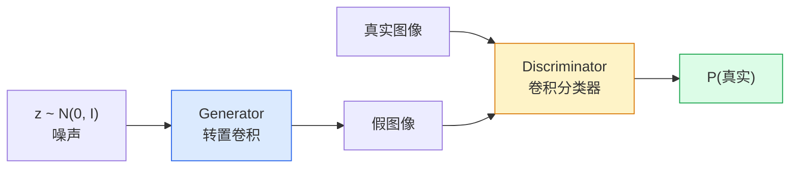
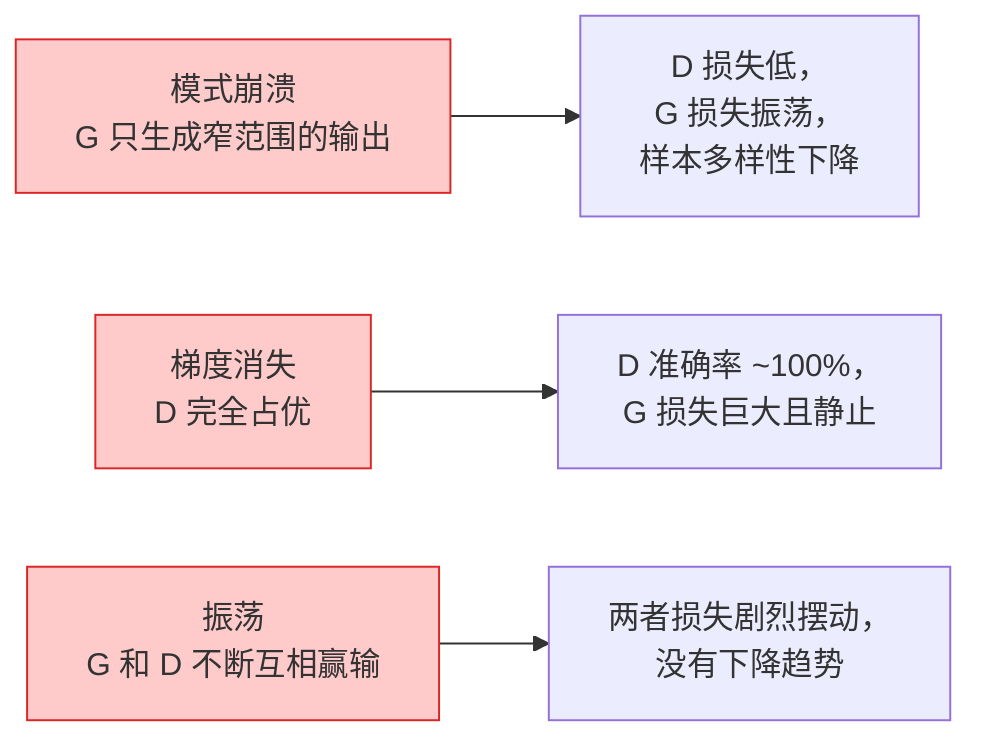

# Image Generation — GANs

> A GAN is two neural networks in a fixed game. One draws, one critiques. They get better together until the drawings fool the critic.

**Type:** 构建
**Languages:** Python
**Prerequisites:** Phase 4 Lesson 03 (卷积神经网络), Phase 3 Lesson 06 (优化器), Phase 3 Lesson 07 (正则化)
**Time:** ~75 分钟

## Learning Objectives

- 解释生成器与判别器之间的极小极大博弈以及为何平衡对应于 p_model = p_data
- 在 PyTorch 中实现一个 DCGAN，并在不到 60 行代码内生成连贯的 32x32 合成图像
- 使用三个标准技巧稳定 GAN 训练：非饱和损失、谱归一化、TTUR（双尺度更新规则）
- 通过训练曲线判断是健康收敛还是模式崩溃、振荡或判别器完全占优

## The Problem

分类任务教网络将图像映射到标签。生成任务将问题反过来：采样新图像，使其看起来像来自相同的分布。没有可以做差的“正确”输出；只有你想要模仿的分布。

标准损失函数（MSE，交叉熵）无法衡量“此样本是否来自真实分布”。最小化逐像素误差会产生模糊的平均图像，而不是逼真的样本。突破点是学习损失：训练第二个网络来分辨真伪，并用它的判断来推动生成器。

GAN（Goodfellow 等，2014）定义了这个框架。到 2018 年，StyleGAN 已能生成 1024x1024、可与照片难以区分的人脸。扩散模型后来在质量和可控性上占据了主导，但让扩散模型实用的每一个技巧——归一化选择、潜在空间、特征损失——最初都在 GAN 上被理解。

## The Concept

### The two networks



生成器 G 接受噪声向量 `z` 并输出图像。判别器 D 接受图像并输出一个标量：图像为真实的概率。

### The game

G 想让 D 错误。D 想要正确。形式化地：

```
min_G max_D  E_x[log D(x)] + E_z[log(1 - D(G(z)))]
```

从右到左读：D 最大化对真实图像（`log D(real)`）和伪造图像（`log (1 - D(fake))`）的准确率。G 最小化 D 在伪造样本上的准确性 —— 它希望 `D(G(z))` 很高。

Goodfellow 证明这个极小极大问题存在全局均衡，此时 `p_G = p_data`，D 在任何点输出 0.5，并且生成分布与真实分布的 Jensen-Shannon 散度为零。难点是如何到达该均衡。

### Non-saturating loss

上面的形式在数值上不稳定。训练早期，`D(G(z))` 对每个伪造样本都接近零，因此 `log(1 - D(G(z)))` 关于 G 的梯度会消失。修复方法：翻转 G 的损失。

```
L_D = -E_x[log D(x)] - E_z[log(1 - D(G(z)))]
L_G = -E_z[log D(G(z))]                          # 非饱和损失
```

现在当 `D(G(z))` 接近零时，G 的损失很大且梯度有信息。每个现代 GAN 都使用这个变体训练。

### DCGAN architecture rules

Radford、Metz、Chintala（2015）将多年的失败实验总结为五条规则，使 GAN 训练稳定：

1. 用带步幅的卷积替代池化（在两个网络中）。
2. 在生成器和判别器中使用批归一化，除去 G 的输出层和 D 的输入层。
3. 在更深的架构中去掉全连接层。
4. G 在所有层使用 ReLU，输出层除外（输出用 tanh 映射到 [-1, 1]）。
5. D 在所有层使用 LeakyReLU（negative_slope=0.2）。

每个现代基于卷积的 GAN（StyleGAN、BigGAN、GigaGAN）仍以这些规则为起点，然后逐步替换各个部分。

### Failure modes and their signatures



- 模式崩溃（Mode collapse）：G 找到一个能骗过 D 的图像并只生成它。修复：加入小批量判别（minibatch discrimination）、谱归一化或标签条件化。
- 判别器占优（Discriminator wins）：D 变得过强过快，G 的梯度消失。修复：缩小 D、降低 D 的学习率，或对真实标签应用标签平滑。
- 振荡（Oscillation）：两个网络交替获胜但从未接近均衡。修复：TTUR（令 D 学得比 G 快 2-4 倍），或切换到 Wasserstein 损失。

### Evaluation

GAN 没有地面真值，那么如何判断它们是否有效？

- 样本检查 — 每个 epoch 结束看 64 个样本。不可妥协的步骤。
- FID（Fréchet Inception Distance）— 真实与生成样本在 Inception-v3 特征空间的距离。越低越好。社区标准。
- Inception Score — 较旧且更脆弱；优先使用 FID。
- 生成模型的精度/召回（Precision/Recall）— 分别度量质量（precision）和覆盖度（recall）。比单独 FID 更具信息量。

对于小型合成数据实验，样本检查就足够了。

## Build It

### Step 1: Generator

一个小型 DCGAN 生成器，接受 64 维噪声并生成 32x32 图像。

```python
import torch
import torch.nn as nn

class Generator(nn.Module):
    def __init__(self, z_dim=64, img_channels=3, feat=64):
        super().__init__()
        self.net = nn.Sequential(
            nn.ConvTranspose2d(z_dim, feat * 4, kernel_size=4, stride=1, padding=0, bias=False),
            nn.BatchNorm2d(feat * 4),
            nn.ReLU(inplace=True),
            nn.ConvTranspose2d(feat * 4, feat * 2, kernel_size=4, stride=2, padding=1, bias=False),
            nn.BatchNorm2d(feat * 2),
            nn.ReLU(inplace=True),
            nn.ConvTranspose2d(feat * 2, feat, kernel_size=4, stride=2, padding=1, bias=False),
            nn.BatchNorm2d(feat),
            nn.ReLU(inplace=True),
            nn.ConvTranspose2d(feat, img_channels, kernel_size=4, stride=2, padding=1, bias=False),
            nn.Tanh(),
        )

    def forward(self, z):
        return self.net(z.view(z.size(0), -1, 1, 1))
```

四个转置卷积，每个都使用 `kernel_size=4, stride=2, padding=1`，因此空间尺寸成倍增长。输出激活通过 tanh 映射到 [-1, 1]。

### Step 2: Discriminator

生成器的镜像。使用 LeakyReLU、带步幅的卷积，最后输出一个标量 logit。

```python
class Discriminator(nn.Module):
    def __init__(self, img_channels=3, feat=64):
        super().__init__()
        self.net = nn.Sequential(
            nn.Conv2d(img_channels, feat, kernel_size=4, stride=2, padding=1),
            nn.LeakyReLU(0.2, inplace=True),
            nn.Conv2d(feat, feat * 2, kernel_size=4, stride=2, padding=1, bias=False),
            nn.BatchNorm2d(feat * 2),
            nn.LeakyReLU(0.2, inplace=True),
            nn.Conv2d(feat * 2, feat * 4, kernel_size=4, stride=2, padding=1, bias=False),
            nn.BatchNorm2d(feat * 4),
            nn.LeakyReLU(0.2, inplace=True),
            nn.Conv2d(feat * 4, 1, kernel_size=4, stride=1, padding=0),
        )

    def forward(self, x):
        return self.net(x).view(-1)
```

最后一个卷积将 `4x4` 特征图压缩为 `1x1`。输出是每张图像的单个标量；仅在计算损失时应用 sigmoid（或使用带 logits 的 BCE）。

### Step 3: Training step

交替更新：每个 batch 先更新 D 一次，再更新 G 一次。

```python
import torch.nn.functional as F

def train_step(G, D, real, z, opt_g, opt_d, device):
    real = real.to(device)
    bs = real.size(0)

    # 判别器步骤
    opt_d.zero_grad()
    d_real = D(real)
    d_fake = D(G(z).detach())
    loss_d = (F.binary_cross_entropy_with_logits(d_real, torch.ones_like(d_real))
              + F.binary_cross_entropy_with_logits(d_fake, torch.zeros_like(d_fake)))
    loss_d.backward()
    opt_d.step()

    # 生成器步骤
    opt_g.zero_grad()
    d_fake = D(G(z))
    loss_g = F.binary_cross_entropy_with_logits(d_fake, torch.ones_like(d_fake))
    loss_g.backward()
    opt_g.step()

    return loss_d.item(), loss_g.item()
```

在 D 步中使用 `G(z).detach()` 非常关键：我们不希望在更新判别器时让梯度流入生成器。忘记这一点是初学者常见的错误。

### Step 4: Full training loop on synthetic shapes

```python
from torch.utils.data import DataLoader, TensorDataset
import numpy as np

def synthetic_images(num=2000, size=32, seed=0):
    rng = np.random.default_rng(seed)
    imgs = np.zeros((num, 3, size, size), dtype=np.float32) - 1.0
    for i in range(num):
        r = rng.uniform(6, 12)
        cx, cy = rng.uniform(r, size - r, size=2)
        yy, xx = np.meshgrid(np.arange(size), np.arange(size), indexing="ij")
        mask = (xx - cx) ** 2 + (yy - cy) ** 2 < r ** 2
        color = rng.uniform(-0.5, 1.0, size=3)
        for c in range(3):
            imgs[i, c][mask] = color[c]
    return torch.from_numpy(imgs)

device = "cuda" if torch.cuda.is_available() else "cpu"
data = synthetic_images()
loader = DataLoader(TensorDataset(data), batch_size=64, shuffle=True)

G = Generator(z_dim=64, img_channels=3, feat=32).to(device)
D = Discriminator(img_channels=3, feat=32).to(device)
opt_g = torch.optim.Adam(G.parameters(), lr=2e-4, betas=(0.5, 0.999))
opt_d = torch.optim.Adam(D.parameters(), lr=2e-4, betas=(0.5, 0.999))

for epoch in range(10):
    for (batch,) in loader:
        z = torch.randn(batch.size(0), 64, device=device)
        ld, lg = train_step(G, D, batch, z, opt_g, opt_d, device)
    print(f"epoch {epoch}  D {ld:.3f}  G {lg:.3f}")
```

`Adam(lr=2e-4, betas=(0.5, 0.999))` 是 DCGAN 的默认配置 —— 较低的 beta1 防止动量项让对抗训练过于稳定，从而影响博弈动力学。

### Step 5: Sampling

```python
@torch.no_grad()
def sample(G, n=16, z_dim=64, device="cpu"):
    G.eval()
    z = torch.randn(n, z_dim, device=device)
    imgs = G(z)
    imgs = (imgs + 1) / 2
    return imgs.clamp(0, 1)
```

在采样前务必切换到 eval 模式。对于 DCGAN 来说这点很重要，因为批归一化的运行统计量会被使用，而不是当前 batch 的统计量。

### Step 6: Spectral normalisation

在判别器中替换 BN 的一种简单方案，能保证网络是 1-Lipschitz。能修复大多数“D 过强”失败。

```python
from torch.nn.utils import spectral_norm

def build_sn_discriminator(img_channels=3, feat=64):
    return nn.Sequential(
        spectral_norm(nn.Conv2d(img_channels, feat, 4, 2, 1)),
        nn.LeakyReLU(0.2, inplace=True),
        spectral_norm(nn.Conv2d(feat, feat * 2, 4, 2, 1)),
        nn.LeakyReLU(0.2, inplace=True),
        spectral_norm(nn.Conv2d(feat * 2, feat * 4, 4, 2, 1)),
        nn.LeakyReLU(0.2, inplace=True),
        spectral_norm(nn.Conv2d(feat * 4, 1, 4, 1, 0)),
    )
```

将 `Discriminator` 替换为 `build_sn_discriminator()`，通常就不需要 TTUR 了。谱归一化是你能应用的最简单且最有效的鲁棒性升级之一。

## Use It

用于严肃生成任务时，使用预训练权重或切换到扩散模型。两个常用库：

- `torch_fidelity` 可以在不写自定义评估代码的情况下计算 FID / IS。
- `pytorch-gan-zoo`（遗留）和 `StudioGAN` 提供了经过测试的 DCGAN、WGAN-GP、SN-GAN、StyleGAN、BigGAN 实现。

到 2026 年，GAN 在以下场景仍是最佳选择：实时图像生成（延迟 <10 ms）、风格迁移、以及需要精确控制的图像到图像翻译（Pix2Pix、CycleGAN）。扩散模型在照片真实度和文本条件化上占优。

## Ship It

本课产出：

- `outputs/prompt-gan-training-triage.md` — 一个提示词，读取训练曲线描述并判断失败模式（模式崩溃、D 占优、振荡）及单一推荐修复方法。
- `outputs/skill-dcgan-scaffold.md` — 一个 skill，从 `z_dim`、目标 `image_size` 和 `num_channels` 生成 DCGAN 框架，包括训练循环和样本保存器。

## Exercises

1. **(Easy)** 在上述合成圆形数据集上训练 DCGAN，并在每个 epoch 结束时保存 16 个样本的图像网格。生成的圆形在第几轮之后变得明显为圆？
2. **(Medium)** 将判别器的批归一化替换为谱归一化。并行训练两个版本。哪一个收敛更快？在三个随机种子下哪个方差更小？
3. **(Hard)** 实现一个条件 DCGAN：将类别标签同时输入到 G 和 D（在 G 中把 one-hot 拼接到噪声，在 D 中拼接一个类别嵌入通道）。在第 7 课的合成“圆 vs 方”数据集上训练，并通过指定标签采样展示条件化有效。

## Key Terms

| 术语 | 常说的话 | 实际含义 |
|------|----------------|----------------------|
| Generator (G) | "The draws-stuff net" | 将噪声映射到图像；训练目标是骗过判别器 |
| Discriminator (D) | "The critic" | 二分类器；训练目标是区分真实与生成图像 |
| Minimax | "The game" | 对 G 做极小化、对 D 做极大化的对抗损失；均衡时 p_G = p_data |
| Non-saturating loss | "The numerically sane version" | G 的损失用 -log(D(G(z))) 替代 log(1 - D(G(z)))，以避免训练早期梯度消失 |
| Mode collapse | "Generator makes one thing" | G 只生成数据分布的一小部分；可用谱归一化、小批量判别或增大 batch 修复 |
| TTUR | "Two learning rates" | D 的学习速度比 G 更快，通常快 2-4 倍；能稳定训练 |
| Spectral norm | "1-Lipschitz layer" | 一种权重归一化方法，约束每层的 Lipschitz 常数；防止 D 变得极陡峭 |
| FID | "Fréchet Inception Distance" | 真实集与生成集在 Inception-v3 特征空间的距离；评价标准 |

## Further Reading

- [Generative Adversarial Networks (Goodfellow et al., 2014)](https://arxiv.org/abs/1406.2661) — 开创性论文
- [DCGAN (Radford, Metz, Chintala, 2015)](https://arxiv.org/abs/1511.06434) — 使 GAN 能够训练的架构规则
- [Spectral Normalization for GANs (Miyato et al., 2018)](https://arxiv.org/abs/1802.05957) — 最有用的稳定化技巧之一
- [StyleGAN3 (Karras et al., 2021)](https://arxiv.org/abs/2106.12423) — SOTA GAN；像是一张过去十年所有技巧的精选集