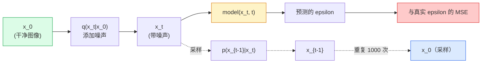

# Image Generation — Diffusion Models

> A diffusion model learns to denoise. Train it to remove a tiny bit of noise from a noisy image, repeat that backwards a thousand times, and you have an image generator.

**Type:** 构建  
**Languages:** Python  
**Prerequisites:** Phase 4 Lesson 07 (U-Net), Phase 1 Lesson 06 (概率), Phase 3 Lesson 06 (优化器)  
**Time:** ~75 分钟

## Learning Objectives

- 推导前向加噪过程 `x_0 -> x_1 -> ... -> x_T`，并解释为什么对任意 t 都成立封闭形式的 `q(x_t | x_0)`
- 实现一种 DDPM 风格的训练目标，回归每步加入的噪声，以及实现一个从纯噪声走回图像的采样器
- 构建一个时间条件的 U-Net（小到可以在 CPU 上训练），能够预测任意时间步的噪声
- 解释 DDPM 与 DDIM 采样的差别，以及何时适用（Lesson 23 深入讲解 flow matching 与 rectified flow）

## The Problem

GAN 是一次性生成：噪声进来，图像出去，一个前向传播。它们速度快但训练困难。扩散模型是迭代生成：从纯噪声开始，分小步去噪，图像逐步浮现。它们速度慢但训练容易。在过去五年里，后一项特性占了上风：任何小团队都能训练出合理样本；而 GAN 的训练是一门需要多年失败经验才能掌握的工艺。

除了训练稳定性外，扩散的迭代结构是解锁现代图像生成所有功能的关键：文本条件化、局部修补（inpainting）、图像编辑、超分辨率、可控风格。采样循环的每一步都是注入新约束的位置。正是这个钩子使得 Stable Diffusion、Imagen、DALL-E 3、Midjourney 以及你将会使用的每一个可控图像模型都基于扩散。

本课构建最小的 DDPM：前向加噪、反向去噪、训练循环。下一课（Stable Diffusion）会把它接入生产系统：VAE、文本编码器和 classifier-free guidance。

## The Concept

### The forward process

取一张图像 `x_0`。加入极小量的高斯噪声得到 `x_1`。再加入一点噪声得到 `x_2`。持续进行 T 步，直到 `x_T` 与纯高斯噪声几乎无法区分。

```
q(x_t | x_{t-1}) = N(x_t; sqrt(1 - beta_t) * x_{t-1},  beta_t * I)
```

`beta_t` 是一个小方差调度，通常在 T=1000 步内从 0.0001 线性变化到 0.02。每一步略微收缩信号并注入新的噪声。

### The closed-form jump

一步一步加噪是一个马尔可夫链，但数学可以简化：你可以直接从 `x_0` 采样 `x_t`。

```
Define alpha_t = 1 - beta_t
Define alpha_bar_t = prod_{s=1..t} alpha_s

Then:
  q(x_t | x_0) = N(x_t; sqrt(alpha_bar_t) * x_0,  (1 - alpha_bar_t) * I)

Equivalently:
  x_t = sqrt(alpha_bar_t) * x_0 + sqrt(1 - alpha_bar_t) * epsilon
  where epsilon ~ N(0, I)
```

这一个方程就是扩散实用性的全部原因。在训练期间你随机选择一个 `t`，直接从 `x_0` 采样 `x_t`，并在一步内训练——无需模拟完整的马尔可夫链。

### The reverse process

前向过程是固定的。反向过程 `p(x_{t-1} | x_t)` 是神经网络要学习的内容。扩散模型不直接预测 `x_{t-1}`；它们预测在步骤 t 加入的噪声 `epsilon`，数学上可以由此推导出 `x_{t-1}`。



### The training loss

每个训练步骤：

1. 采样一张真实图像 `x_0`。
2. 从 [1, T] 中均匀采样一个时间步 `t`。
3. 采样噪声 `epsilon ~ N(0, I)`。
4. 计算 `x_t = sqrt(alpha_bar_t) * x_0 + sqrt(1 - alpha_bar_t) * epsilon`。
5. 用网络预测 `epsilon_theta(x_t, t)`。
6. 最小化 `|| epsilon - epsilon_theta(x_t, t) ||^2`。

就是这样。神经网络学会在任一时间步去预测噪声。损失是 MSE。没有对抗博弈、没有崩溃、也没有振荡。

### The sampler (DDPM)

生成时：从 `x_T ~ N(0, I)` 开始，逐步向后走。

```
for t = T, T-1, ..., 1:
    eps = model(x_t, t)
    x_{t-1} = (1 / sqrt(alpha_t)) * (x_t - (beta_t / sqrt(1 - alpha_bar_t)) * eps) + sqrt(beta_t) * z
    where z ~ N(0, I) if t > 1, else 0
return x_0
```

关键在于：尽管反向条件分布一般没有封闭形式，但对于这个特定的高斯前向过程它是有的。那些看起来丑陋的系数就是贝叶斯规则给出的结果。

### Why 1000 steps

前向噪声调度的选择使得每一步加入的噪声恰到好处，使得反向步近似为高斯。步数太少，反向步远离高斯，网络无法很好建模；步数过多，采样代价高且收益递减。T=1000 且线性调度是 DDPM 的默认设定。

### DDIM: 20x faster sampling

训练不变。采样改变。DDIM（Song 等，2020）定义了一个确定性的反向过程，可以在不重训练的情况下跳过时间步。用 DDIM 在 50 步内采样能达到接近 1000 步 DDPM 的质量。每个生产系统都会使用 DDIM 或更快的变体（如 DPM-Solver、Euler ancestral）。

### Time conditioning

网络 `epsilon_theta(x_t, t)` 需要知道它正在去噪哪一个时间步。现代扩散模型通过正弦时间嵌入（与 transformer 的位置编码相同的思路）注入 `t`，这些嵌入会在每个 U-Net 层级被加入到特征图中。

```
t_embedding = sinusoidal(t)
feature_map += MLP(t_embedding)
```

如果没有时间条件，网络必须从图像本身猜测噪声等级，这虽然可行，但样本效率要低得多。

## Build It

### Step 1: Noise schedule

```python
import torch

def linear_beta_schedule(T=1000, beta_start=1e-4, beta_end=2e-2):
    return torch.linspace(beta_start, beta_end, T)


def precompute_schedule(betas):
    alphas = 1.0 - betas
    alphas_cumprod = torch.cumprod(alphas, dim=0)
    return {
        "betas": betas,
        "alphas": alphas,
        "alphas_cumprod": alphas_cumprod,
        "sqrt_alphas_cumprod": torch.sqrt(alphas_cumprod),
        "sqrt_one_minus_alphas_cumprod": torch.sqrt(1.0 - alphas_cumprod),
        "sqrt_recip_alphas": torch.sqrt(1.0 / alphas),
    }

schedule = precompute_schedule(linear_beta_schedule(T=1000))
```

预先计算一次，训练和采样时按索引读取。

### Step 2: Forward diffusion (q_sample)

```python
def q_sample(x0, t, noise, schedule):
    sqrt_a = schedule["sqrt_alphas_cumprod"][t].view(-1, 1, 1, 1)
    sqrt_one_minus_a = schedule["sqrt_one_minus_alphas_cumprod"][t].view(-1, 1, 1, 1)
    return sqrt_a * x0 + sqrt_one_minus_a * noise
```

一行封闭形式。`t` 是一个时间步的批次（batch），每张图像对应一个时间步。

### Step 3: A tiny time-conditioned U-Net

```python
import torch.nn as nn
import torch.nn.functional as F
import math

def timestep_embedding(t, dim=64):
    half = dim // 2
    freqs = torch.exp(-math.log(10000) * torch.arange(half, device=t.device) / half)
    args = t[:, None].float() * freqs[None]
    emb = torch.cat([args.sin(), args.cos()], dim=-1)
    return emb


class TinyUNet(nn.Module):
    def __init__(self, img_channels=3, base=32, t_dim=64):
        super().__init__()
        self.t_mlp = nn.Sequential(
            nn.Linear(t_dim, base * 4),
            nn.SiLU(),
            nn.Linear(base * 4, base * 4),
        )
        self.t_dim = t_dim
        self.enc1 = nn.Conv2d(img_channels, base, 3, padding=1)
        self.enc2 = nn.Conv2d(base, base * 2, 4, stride=2, padding=1)
        self.mid = nn.Conv2d(base * 2, base * 2, 3, padding=1)
        self.dec1 = nn.ConvTranspose2d(base * 2, base, 4, stride=2, padding=1)
        self.dec2 = nn.Conv2d(base * 2, img_channels, 3, padding=1)
        self.time_proj = nn.Linear(base * 4, base * 2)

    def forward(self, x, t):
        t_emb = timestep_embedding(t, self.t_dim)
        t_emb = self.t_mlp(t_emb)
        t_proj = self.time_proj(t_emb)[:, :, None, None]

        h1 = F.silu(self.enc1(x))
        h2 = F.silu(self.enc2(h1)) + t_proj
        h3 = F.silu(self.mid(h2))
        d1 = F.silu(self.dec1(h3))
        d2 = torch.cat([d1, h1], dim=1)
        return self.dec2(d2)
```

一个在瓶颈处注入时间条件的两层 U-Net。要处理真实图像请加深和加宽网络。

### Step 4: Training loop

```python
def train_step(model, x0, schedule, optimizer, device, T=1000):
    model.train()
    x0 = x0.to(device)
    bs = x0.size(0)
    t = torch.randint(0, T, (bs,), device=device)
    noise = torch.randn_like(x0)
    x_t = q_sample(x0, t, noise, schedule)
    pred = model(x_t, t)
    loss = F.mse_loss(pred, noise)
    optimizer.zero_grad()
    loss.backward()
    optimizer.step()
    return loss.item()
```

这就是完整的训练循环。没有 GAN 博弈、没有特殊损失，只有一次 MSE。

### Step 5: Sampler (DDPM)

```python
@torch.no_grad()
def sample(model, schedule, shape, T=1000, device="cpu"):
    model.eval()
    x = torch.randn(shape, device=device)
    betas = schedule["betas"].to(device)
    sqrt_one_minus_a = schedule["sqrt_one_minus_alphas_cumprod"].to(device)
    sqrt_recip_alphas = schedule["sqrt_recip_alphas"].to(device)

    for t in reversed(range(T)):
        t_batch = torch.full((shape[0],), t, dtype=torch.long, device=device)
        eps = model(x, t_batch)
        coef = betas[t] / sqrt_one_minus_a[t]
        mean = sqrt_recip_alphas[t] * (x - coef * eps)
        if t > 0:
            x = mean + torch.sqrt(betas[t]) * torch.randn_like(x)
        else:
            x = mean
    return x
```

生成一批样本需要 1000 次前向（模型）调用。在实际代码里你会用 DDIM 的 50 步采样替换它以加速。

### Step 6: DDIM sampler (deterministic, ~20x faster)

```python
@torch.no_grad()
def sample_ddim(model, schedule, shape, steps=50, T=1000, device="cpu", eta=0.0):
    model.eval()
    x = torch.randn(shape, device=device)
    alphas_cumprod = schedule["alphas_cumprod"].to(device)

    ts = torch.linspace(T - 1, 0, steps + 1).long()
    for i in range(steps):
        t = ts[i]
        t_prev = ts[i + 1]
        t_batch = torch.full((shape[0],), t, dtype=torch.long, device=device)
        eps = model(x, t_batch)
        a_t = alphas_cumprod[t]
        a_prev = alphas_cumprod[t_prev] if t_prev >= 0 else torch.tensor(1.0, device=device)
        x0_pred = (x - torch.sqrt(1 - a_t) * eps) / torch.sqrt(a_t)
        sigma = eta * torch.sqrt((1 - a_prev) / (1 - a_t) * (1 - a_t / a_prev))
        dir_xt = torch.sqrt(1 - a_prev - sigma ** 2) * eps
        noise = sigma * torch.randn_like(x) if eta > 0 else 0
        x = torch.sqrt(a_prev) * x0_pred + dir_xt + noise
    return x
```

`eta=0` 是完全确定性的（相同噪声输入总是产生相同输出）。`eta=1` 会还原 DDPM。

## Use It

在生产中，使用 `diffusers`：

```python
from diffusers import DDPMScheduler, UNet2DModel

unet = UNet2DModel(sample_size=32, in_channels=3, out_channels=3, layers_per_block=2)
scheduler = DDPMScheduler(num_train_timesteps=1000)
```

该库提供现成的调度器（DDPM、DDIM、DPM-Solver、Euler、Heun）、可配置的 U-Net、文本到图像与图像到图像的流水线，以及 LoRA 微调辅助工具。

用于研究的话，`k-diffusion`（Katherine Crowson）有最忠实的参考实现和最好的采样变体。

## Ship It

本课产出：

- `outputs/prompt-diffusion-sampler-picker.md` — 一个根据目标质量、延迟预算和条件类型选择 DDPM / DDIM / DPM-Solver / Euler 的提示（prompt）
- `outputs/skill-noise-schedule-designer.md` — 一个技能（工具），给定 T 和目标损坏程度，生成线性、余弦或 sigmoid 的 beta 调度，并输出信噪比随时间变化的诊断图

## Exercises

1. **(Easy)** 可视化前向过程：取一张图像并在 `t in [0, 100, 250, 500, 750, 1000]` 绘制 `x_t`。验证 `x_1000` 看起来像纯高斯噪声。
2. **(Medium)** 在 synthetic-circles 数据集上训练 TinyUNet 20 个 epoch，并采样 16 个圆。用相同的噪声种子比较 DDPM（1000 步）和 DDIM（50 步）采样——它们会产生相似的图像吗？
3. **(Hard)** 实现余弦噪声调度（Nichol & Dhariwal, 2021）：`alpha_bar_t = cos^2((t/T + s) / (1 + s) * pi / 2)`。用线性与余弦调度分别训练相同模型，并展示余弦调度在低步数时样本更好。

## Key Terms

| Term | What people say | What it actually means |
|------|----------------|----------------------|
| Forward process | "Add noise over time" | 将图像在 T 步内通过固定马尔可夫链腐蚀为高斯噪声 |
| Reverse process | "Denoise step by step" | 学到的分布，从噪声逐步走回图像 |
| Epsilon prediction | "Predict the noise" | 训练目标：`epsilon_theta(x_t, t)` 预测在时间步 t 加入的噪声 |
| Beta schedule | "Noise amounts" | 一系列 T 个小方差，定义每步注入多少噪声 |
| alpha_bar_t | "Cumulative retain factor" | 到时间 t 为止的 (1 - beta_s) 的乘积；t 越大，保留的信号越少 |
| DDPM sampler | "Ancestral, stochastic" | 每步从条件高斯中采样 x_{t-1}；1000 步 |
| DDIM sampler | "Deterministic, fast" | 将采样重写为确定性 ODE；20–100 步可取得相似质量 |
| Time conditioning | "Tell the model which t" | 将 t 的正弦嵌入注入 U-Net，使其知道噪声等级 |

（术语中使用的标准翻译：Prompt engineering -> 提示词工程，RAG -> RAG，Embeddings -> 嵌入，Fine-tuning -> 微调，Context window -> 上下文窗口，few-shot -> 少样本，chain-of-thought -> 思维链，guardrails -> 护栏，function calling -> 函数调用，speculative decoding -> 投机性解码，positional embeddings -> 位置嵌入，self-attention -> 自注意力，instruction tuning -> 指令微调，distributed training -> 分布式训练，Model Context Protocol -> 模型上下文协议。）

## Further Reading

- [Denoising Diffusion Probabilistic Models (Ho et al., 2020)](https://arxiv.org/abs/2006.11239) — 使扩散实用化并在 FID 上击败 GAN 的论文
- [Improved DDPM (Nichol & Dhariwal, 2021)](https://arxiv.org/abs/2102.09672) — 余弦调度与 v-参数化
- [DDIM (Song, Meng, Ermon, 2020)](https://arxiv.org/abs/2010.02502) — 使实时推理成为可能的确定性采样器
- [Elucidating the Design Space of Diffusion (Karras et al., 2022)](https://arxiv.org/abs/2206.00364) — 对每一种扩散设计选择的统一视角；当前最佳参考资料