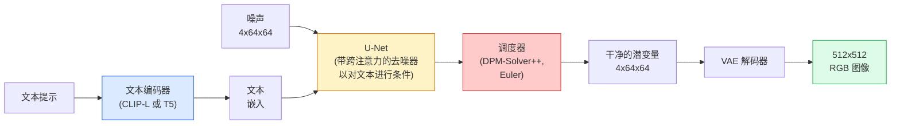

# Stable Diffusion — 架构与微调

> Stable Diffusion 是一个在预训练 VAE 的潜在空间中运行的 DDPM，通过跨注意力以文本为条件，使用快速确定性 ODE 求解器采样，并由无分类器引导（classifier-free guidance）进行引导。

**Type:** 学习 + 使用  
**Languages:** Python  
**Prerequisites:** Phase 4 Lesson 10（扩散），Phase 7 Lesson 02（自注意力）  
**Time:** ~75 分钟

## 学习目标

- 描述 Stable Diffusion 流水线的五个部分：VAE、文本编码器、U-Net、调度器、安全检测器 — 以及它们各自的实际作用
- 解释潜在扩散以及为什么在 4x64x64 的潜在空间（而不是 3x512x512 的像素空间）中训练可以在不损失质量的情况下将计算量降低 48 倍
- 使用 `diffusers` 生成图像，运行 image-to-image、inpainting，以及基于 ControlNet 的引导生成
- 在小规模自定义数据集上用 LoRA 微调 Stable Diffusion，并在推理时加载 LoRA 适配器

## 问题背景

直接在 512x512 的 RGB 图像上训练 DDPM 成本很高。每个训练步骤都需要对一个看到 3x512x512 = 786,432 个输入值的 U-Net 做反向传播，而采样需要对同一 U-Net 做 50+ 次前向传递。以 Stable Diffusion 1.5（2022 发布）的质量水平，像素空间扩散大约需要 256 GPU 月的训练，并且在消费级 GPU 上每张图像需要 10-30 秒。

使开源文本生成图像实用的关键技巧是 **潜在扩散（latent diffusion）**（Rombach et al., CVPR 2022）。训练一个 VAE 将 3x512x512 图像映射为 4x64x64 的潜变量并再解码回图像，然后在这个潜在空间中进行扩散。计算量下降为 (3*512*512)/(4*64*64) = 48 倍。采样时间也从几十秒降到同一 GPU 上不到两秒。

几乎所有现代图像生成模型 —— SDXL、SD3、FLUX、HunyuanDiT、Wan-Video —— 都是潜在扩散模型，只是在自编码器、去噪器（U-Net 或 DiT）和文本条件方式上有所变化。学会 Stable Diffusion 即可掌握这一模板。

## 概念

### 流水线



- **VAE** — 冻结的自编码器。编码器将图像转换为潜变量（用于 img2img 和训练）。解码器将潜变量还原为图像。
- **文本编码器** — CLIP 文本编码器（SD 1.x/2.x）、CLIP-L + CLIP-G（SDXL），或 T5-XXL（SD3/FLUX）。输出一个 token 嵌入序列。
- **U-Net** — 去噪器。在每个分辨率级别包含跨注意力层，从潜变量到文本嵌入进行注意力对齐。
- **调度器** — 采样算法（DDIM、Euler、DPM-Solver++）。选择 sigma 值，并将模型预测的噪声混合回潜变量。
- **安全检测器** — 可选的 NSFW / 非法内容过滤器，对输出图像进行检测。

### 无分类器引导（Classifier-free guidance, CFG）

普通的文本条件学习每个提示 c 对应学习 epsilon_theta(x_t, t, c)。CFG 训练时在 10% 的情况下丢弃 c（用空的嵌入替换），从而得到一个既能预测条件噪声也能预测无条件噪声的单一模型。在推理时：

```
eps = eps_uncond + w * (eps_cond - eps_uncond)
```

w 是引导尺度。w=0 表示无条件，w=1 表示普通条件，w>1 会使输出更“服从提示词”，以牺牲多样性为代价。SD 的默认值是 w=7.5。

CFG 是文本到图像能在生产质量下工作的原因。没有它，提示仅弱烈地偏置输出；有了它，提示会主导最终结果。

### 潜在空间几何

VAE 的 4 通道潜变量不仅仅是一个压缩图像。它是一个流形，在这里代数运算大体对应语义编辑（提示词工程和插值都在此进行），并且扩散 U-Net 已经被训练去把全部建模预算花在这里。解码一个随机的 4x64x64 潜变量不会产生一张随机看起来的图像 —— 它会产生垃圾，因为只有潜在空间的特定子流形能被解码为有效图像。

两个后果：

1. **Img2img** = 将图像编码到潜变量，加入部分噪声，运行去噪器，解码。因为编码接近可逆，图像结构得以保留；内容根据提示词改变。
2. **Inpainting（图像修复）** = 与 img2img 类似，但去噪器只更新被掩码的区域；未掩码区域保持编码后的潜变量。

### U-Net 架构

SD 的 U-Net 是 Lesson 10 中 TinyUNet 的大型版本，并包含三项扩展：

- 在每个空间分辨率上都有 **Transformer block**，包含自注意力 + 对文本嵌入的跨注意力。
- 通过对正弦位置编码做 MLP 实现 **时间嵌入**（time embedding）。
- 在编码器与解码器匹配分辨率之间有 **跳跃连接**（skip connections）。

SD 1.5 的总参数约 ~860M。SDXL 约 ~2.6B。FLUX 约 ~12B。参数激增主要来自注意力层。

### LoRA 微调

完整微调 Stable Diffusion 需要 20+ GB 的显存并更新 ~860M 参数。LoRA（低秩适配）让基础模型保持冻结，并将小型的低秩分解矩阵注入到注意力层中。一个用于 SD 的 LoRA 适配器通常是 10-50 MB，在单块消费级 GPU 上训练 10-60 分钟，并在推理时作为可插入的修改加载。

```
Original: W_q : (d_in, d_out)   frozen
LoRA:     W_q + alpha * (A @ B)   where A : (d_in, r), B : (r, d_out)

r is typically 4-32.
```

LoRA 是几乎所有社区微调分发的方式。CivitAI 和 Hugging Face 上托管着成千上万的 LoRA 模型。

```
Original: W_q : (d_in, d_out)   frozen
LoRA:     W_q + alpha * (A @ B)   where A : (d_in, r), B : (r, d_out)

r is typically 4-32.
```

```
Original: W_q : (d_in, d_out)   frozen
LoRA:     W_q + alpha * (A @ B)   where A : (d_in, r), B : (r, d_out)

r is typically 4-32.
```

（上面显示了 LoRA 将原始查询矩阵 W_q 用一个低秩修正项替代的形式；r 通常在 4-32 之间。）

### 你会看到的调度器

- **DDIM** — 确定性，约 50 步，简单。
- **Euler ancestral** — 随机性，30-50 步，样本略显更具创造性。
- **DPM-Solver++ 2M Karras** — 确定性，20-30 步，生产默认。
- **LCM / TCD / Turbo** — 一致性模型及蒸馏变体；1-4 步以牺牲一些质量为代价换取极低延迟。

在 `diffusers` 中切换调度器是一行代码的事情，有时能在不重新训练的情况下修复采样问题。

## 实战

本课使用 `diffusers` 端到端，而不是从零重建 Stable Diffusion。要重建的组件（VAE、文本编码器、U-Net、调度器）各自是独立的课程主题；这里的目标是熟练使用生产级 API。

### 步骤 1：文本生成图像（Text-to-image）

```python
import torch
from diffusers import StableDiffusionPipeline

pipe = StableDiffusionPipeline.from_pretrained(
    "runwayml/stable-diffusion-v1-5",
    torch_dtype=torch.float16,
).to("cuda")

image = pipe(
    prompt="a dog riding a skateboard in tokyo, studio ghibli style",
    guidance_scale=7.5,
    num_inference_steps=25,
    generator=torch.Generator("cuda").manual_seed(42),
).images[0]
image.save("dog.png")
```

使用 `float16` 可以将显存减半且无明显质量损失。使用默认的 DPM-Solver++ 时，`num_inference_steps=25` 与 DDIM 的 `num_inference_steps=50` 相当。

### 步骤 2：替换调度器

```python
from diffusers import DPMSolverMultistepScheduler, EulerAncestralDiscreteScheduler

pipe.scheduler = DPMSolverMultistepScheduler.from_config(pipe.scheduler.config)
pipe.scheduler = EulerAncestralDiscreteScheduler.from_config(pipe.scheduler.config)
```

调度器状态与 U-Net 权重是解耦的。你可以在 DDPM 上训练，在任何调度器下采样。

### 步骤 3：图像到图像（Image-to-image）

```python
from diffusers import StableDiffusionImg2ImgPipeline
from PIL import Image

img2img = StableDiffusionImg2ImgPipeline.from_pretrained(
    "runwayml/stable-diffusion-v1-5",
    torch_dtype=torch.float16,
).to("cuda")

init_image = Image.open("dog.png").convert("RGB").resize((512, 512))
out = img2img(
    prompt="a dog riding a skateboard, oil painting",
    image=init_image,
    strength=0.6,
    guidance_scale=7.5,
).images[0]
```

`strength` 表示在去噪前加入多少噪声（0.0 = 保持不变，1.0 = 完全重生成）。对于风格迁移，0.5-0.7 是标准范围。

### 步骤 4：图像修复（Inpainting）

```python
from diffusers import StableDiffusionInpaintPipeline

inpaint = StableDiffusionInpaintPipeline.from_pretrained(
    "runwayml/stable-diffusion-inpainting",
    torch_dtype=torch.float16,
).to("cuda")

image = Image.open("dog.png").convert("RGB").resize((512, 512))
mask = Image.open("dog_mask.png").convert("L").resize((512, 512))

out = inpaint(
    prompt="a cat",
    image=image,
    mask_image=mask,
    guidance_scale=7.5,
).images[0]
```

掩码中的白色像素是需要重生成的区域。黑色像素保持不变。

### 步骤 5：加载 LoRA

```python
pipe.load_lora_weights("sayakpaul/sd-lora-ghibli")
pipe.fuse_lora(lora_scale=0.8)

image = pipe(prompt="a village square in ghibli style").images[0]
```

`lora_scale` 控制效果强度；0.0 = 无效果，1.0 = 完全效果。`fuse_lora` 会将适配器烘烤进权重以加速，但会阻止切换适配器。若要加载不同的适配器，先调用 `pipe.unfuse_lora()`。

### 步骤 6：LoRA 训练（概要）

真实的 LoRA 训练通常在 `peft` 或 `diffusers.training` 中完成。大致流程如下：

```python
# 伪代码
for step, batch in enumerate(dataloader):
    images, prompts = batch
    latents = vae.encode(images).latent_dist.sample() * 0.18215

    t = torch.randint(0, num_train_timesteps, (batch_size,))
    noise = torch.randn_like(latents)
    noisy_latents = scheduler.add_noise(latents, noise, t)

    text_emb = text_encoder(tokenizer(prompts))

    pred_noise = unet(noisy_latents, t, text_emb)  # 在此注入 LoRA 权重

    loss = F.mse_loss(pred_noise, noise)
    loss.backward()
    optimizer.step()
```

只有 LoRA 矩阵会接收到梯度；基础 U-Net、VAE 和文本编码器均被冻结。使用 batch size 为 1 并启用梯度检查点（gradient checkpointing）时，这个流程可以在 8 GB 显存内运行。

## 在生产中的取舍

在生产环境，你需要做的实际决策包括：

- **模型家族**：SD 1.5 适合社区开源微调，SDXL 提供更高保真度，SD3 / FLUX 提供最新质量但有严格的许可约束。
- **调度器**：DPM-Solver++ 2M Karras（20-30 步），当延迟低于 1 秒时可考虑 LCM-LoRA。
- **数值精度**：在 4080/4090 上使用 `float16`，在 A100 及更新卡上使用 `bfloat16`，当显存紧张时使用 `int8`（通过 `bitsandbytes` 或 `compel`）。
- **条件方式**：普通文本条件可以工作；如果需要更强的控制，则在基础流水线上加入 ControlNet（canny、depth、pose）。

批量生成时，社区工具有 `AUTO1111` / `ComfyUI`；生产 API 则推荐 `diffusers` + `accelerate` 或配合 TensorRT 编译的 `optimum-nvidia`。

## 交付产物

本课将产出：

- `outputs/prompt-sd-pipeline-planner.md` — 一个提示词模板，基于延迟预算、保真目标和许可约束选择 SD 1.5 / SDXL / SD3 / FLUX 以及调度器和精度。
- `outputs/skill-lora-training-setup.md` — 一个技能（skill），为自定义数据集生成完整的 LoRA 训练配置，包括描述、rank、batch size 和学习率。

## 练习

1. **（简单）** 用 `guidance_scale` 在 `[1, 3, 5, 7.5, 10, 15]` 上生成同一提示词。描述图像如何变化。在哪个 guidance 值开始出现伪影（artefacts）？
2. **（中等）** 选取任意真实照片，用 `StableDiffusionImg2ImgPipeline` 在 `strength` 为 `[0.2, 0.4, 0.6, 0.8, 1.0]` 的设置下运行。哪个 strength 保留构图同时改变风格？为什么 1.0 会完全忽略输入？
3. **（困难）** 在 10-20 张单一主体（宠物、标志、角色）的图像上训练一个 LoRA，并生成包含该主体的新场景。报告在不发生过拟合的情况下最好地保留身份的 LoRA rank 和训练步数。

## 术语表

| 术语 | 常说法 | 实际含义 |
|------|--------|----------|
| Latent diffusion | “在潜在中扩散” | 在 VAE 潜在空间（4x64x64）中运行整个 DDPM，而不是像素空间（3x512x512）；节省 48 倍计算 |
| VAE scale factor | “0.18215” | 将 VAE 的原始潜变量重新缩放到大致单位方差的常数；每个 SD 流水线中硬编码的常数 |
| Classifier-free guidance | “CFG” | 混合条件与无条件的噪声预测；是推理中最重要的控制项 |
| Scheduler | “采样器” | 将噪声 + 模型预测转换为去噪潜变量轨迹的算法 |
| LoRA | “低秩适配” | 小型的低秩分解矩阵，用来微调注意力层而不改动基础权重 |
| Cross-attention | “文本-图像注意力” | 从潜变量 token 到文本 token 的注意力；在每个 U-Net 级别注入提示词信息 |
| ControlNet | “结构条件模块” | 一个单独训练的适配器，使用额外输入（canny、depth、pose、segmentation）来引导 SD |
| DPM-Solver++ | “默认调度器” | 二阶确定性 ODE 求解器；在低步数（20-30）下在 2026 年仍然提供最佳质量 |

## 延伸阅读

- [High-Resolution Image Synthesis with Latent Diffusion (Rombach et al., 2022)](https://arxiv.org/abs/2112.10752) — Stable Diffusion 论文；包含支持该设计的所有消融实验
- [Classifier-Free Diffusion Guidance (Ho & Salimans, 2022)](https://arxiv.org/abs/2207.12598) — CFG 论文
- [LoRA: Low-Rank Adaptation of Large Language Models (Hu et al., 2021)](https://arxiv.org/abs/2106.09685) — LoRA 最初来自 NLP；几乎不经修改就转移到了 SD
- [diffusers 文档](https://huggingface.co/docs/diffusers) — 每个 SD / SDXL / SD3 / FLUX 流水线的参考文档