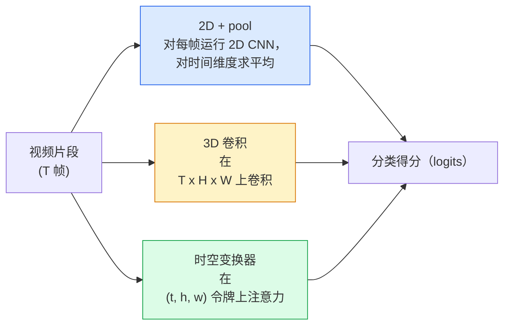

# Video Understanding — Temporal Modeling

> 一个视频是图像序列加上把它们连接起来的物理关系。每个视频模型要么把时间视为一个额外轴（3D 卷积），要么把它当作一个要注意的序列（transformer），要么把时间作为一次性提取并池化的特征（2D+pool）。

**Type:** 学习 + 构建
**Languages:** Python
**Prerequisites:** Phase 4 Lesson 03（CNNs），Phase 4 Lesson 04（图像分类）
**Time:** ~45 分钟

## 学习目标

- 区分三类主要的视频建模方法（2D+pool、3D conv、时空 transformer）并预测它们在计算开销与准确率上的权衡
- 在 PyTorch 中实现帧采样、时间池化，以及一个 2D+pool 的基线分类器
- 解释为什么 I3D 的“膨胀（inflated）”3D 卷积能很好地从 ImageNet 权重迁移，以及 factorised (2+1)D conv 的不同之处
- 阅读标准动作识别的数据集与指标：Kinetics-400/600、UCF101、Something-Something V2；剪辑级和视频级的 top-1 准确率

## 问题描述

一个 30 秒、30 fps 的视频有 900 帧。天真地做法是把视频分类视为对 900 张图片逐帧做图像分类，然后做某种聚合。当动作在几乎每一帧都可见时（体育、烹饪、健身视频），这种方法有效；但当动作本身由运动定义时（例如“把东西从左推到右”），每一帧都看起来像两个静态物体，这种方法就严重失败了。

每个视频架构的核心问题是：何时对时间结构建模，如何建模？这个答案决定了一切——计算代价、预训练策略、是否能重用 ImageNet 权重、模型训练所用的数据集。

本课比静态图像相关课程要短一些。图像方面的核心机制已经就位，视频理解主要围绕时间部分：采样、建模和聚合。

## 概念

### 三类架构家族



### 2D + pool

选一个 2D CNN（ResNet、EfficientNet、ViT）。对每个采样到的帧独立运行。对每帧的嵌入做平均（或最大池化，或注意力池化）。将池化后的向量送入分类器。

优点：
- ImageNet 预训练可以直接迁移。
- 最简单，易于实现。
- 便宜：T 帧 * 单张图像的推理成本。

缺点：
- 无法建模运动。动作等于外观的聚合。
- 时间池化对顺序不敏感；“开门”和“关门”看起来一样。

使用场景：外观驱动的任务、小型视频数据集上的迁移学习、初始基线。

### 3D 卷积

把 2D（H, W）卷积核替换为 3D（T, H, W）卷积核。网络在空间和时间上做卷积。早期家族：C3D、I3D、SlowFast。

I3D 技巧：取一个预训练的 2D ImageNet 模型，把每个 2D 卷积核沿新的时间轴“膨胀”拷贝。一个 3x3 的 2D conv 变成 3x3x3 的 3D conv。这样 3D 模型就有了强力的预训练权重而不是从头训练。

优点：
- 能直接建模运动。
- I3D 的膨胀提供了免费迁移学习。

缺点：
- 相比 2D 对应模型 FLOPs 增加大约 T/8（针对时间核为 3 且堆叠 3 次的情况）。
- 时间卷积核通常较小；长程运动需要金字塔或双流方法。

使用场景：以运动为信号的动作识别（如 Something-Something V2、包含大量运动的 Kinetics 类别）。

### 时空变换器

把视频分成时空 patch 网格，对所有这些令牌进行注意力。代表性工作：TimeSformer、ViViT、Video Swin、VideoMAE。

重要的注意力模式：
- Joint — 在所有 (t, h, w) 上做一次整体注意力。复杂度为 (T*H*W)^2；开销很大。
- Divided — 每个块做两次注意力：一次在时间上，一次在空间上。近似线性扩展。
- Factorised — 时间注意力与空间注意力在不同块中交替。

优点：
- 在主要基准上具有 SOTA 准确率。
- 可以通过 patch 膨胀从图像 transformer（ViT）迁移。
- 支持通过稀疏注意力处理长上下文视频。

缺点：
- 计算量大。
- 需要谨慎选择注意力模式，否则运行时内存或时间膨胀。

使用场景：大数据集、高精度视频理解、多模态视频+文本任务。

### 帧采样

一个 10 秒、30 fps 的剪辑有 300 帧，把全部 300 帧送入模型通常浪费。常见策略：

- Uniform sampling（均匀采样）— 在剪辑中均匀选择 T 帧。2D+pool 默认。
- Dense sampling（密集采样）— 随机选择连续的 T 帧窗口。3D 卷积常用，因为运动需要相邻帧。
- Multi-clip（多剪辑）— 从同一视频采样多个 T 帧窗口，分别分类，在测试时平均预测。

T 通常是 8、16、32 或 64。T 越高 = 时间信号越多但计算也越多。

### 评估

两个层级：
- Clip-level accuracy（剪辑级准确率）— 模型只看一个 T 帧剪辑，报告 top-k。
- Video-level accuracy（视频级准确率）— 对单个视频的多个剪辑的预测取平均；通常更高且更稳定。

两者都要报告。一个模型若给出 78% 剪辑 / 82% 视频，表明它高度依赖测试时的平均；若是 80% / 81%，则单剪辑更鲁棒。

### 常见数据集

- Kinetics-400 / 600 / 700 — 通用动作数据集。40 万剪辑；YouTube 链接（很多已失效）。
- Something-Something V2 — 由运动定义的动作（“把 X 从左到右移动”）。不能被 2D+pool 解决。
- UCF-101、HMDB-51 — 更老、更小，但仍常被引用。
- AVA — 在时空中进行动作定位；比分类更难。

## 实践

### 第 1 步：帧采样器

对帧列表（或视频张量）实现均匀和密集采样器。

```python
import numpy as np

def sample_uniform(num_frames_total, T):
    if num_frames_total <= T:
        return list(range(num_frames_total)) + [num_frames_total - 1] * (T - num_frames_total)
    step = num_frames_total / T
    return [int(i * step) for i in range(T)]


def sample_dense(num_frames_total, T, rng=None):
    rng = rng or np.random.default_rng()
    if num_frames_total <= T:
        return list(range(num_frames_total)) + [num_frames_total - 1] * (T - num_frames_total)
    start = int(rng.integers(0, num_frames_total - T + 1))
    return list(range(start, start + T))
```

两者都会返回 T 个索引，用于切片视频张量。

### 第 2 步：一个 2D+pool 基线

对每帧运行 2D ResNet-18，平均池化特征，分类。

```python
import torch
import torch.nn as nn
from torchvision.models import resnet18, ResNet18_Weights

class FramePool(nn.Module):
    def __init__(self, num_classes=400, pretrained=True):
        super().__init__()
        weights = ResNet18_Weights.IMAGENET1K_V1 if pretrained else None
        backbone = resnet18(weights=weights)
        self.features = nn.Sequential(*(list(backbone.children())[:-1]))  # 保留全局平均池化
        self.head = nn.Linear(512, num_classes)

    def forward(self, x):
        # x: (N, T, 3, H, W)
        N, T = x.shape[:2]
        x = x.view(N * T, *x.shape[2:])
        feats = self.features(x).view(N, T, -1)
        pooled = feats.mean(dim=1)  # 对时间维度平均池化
        return self.head(pooled)

model = FramePool(num_classes=10)
x = torch.randn(2, 8, 3, 224, 224)
print(f"output: {model(x).shape}")
print(f"params: {sum(p.numel() for p in model.parameters()):,}")
```

约 1100 万参数，ImageNet 预训练，逐帧运行，平均池化后分类。对于外观主导的任务，这个基线往往在准确率上落后真正的 3D 模型仅 5–10 个点——有时效果更好，因为它复用了更强的 ImageNet 骨干。

### 第 3 步：一个 I3D 风格的膨胀 3D 卷积

把单个 2D conv 变为 3D conv，通过沿时间轴重复权重来初始化。

```python
def inflate_2d_to_3d(conv2d, time_kernel=3):
    out_c, in_c, kh, kw = conv2d.weight.shape
    weight_3d = conv2d.weight.data.unsqueeze(2)  # (out, in, 1, kh, kw)
    weight_3d = weight_3d.repeat(1, 1, time_kernel, 1, 1) / time_kernel
    conv3d = nn.Conv3d(in_c, out_c, kernel_size=(time_kernel, kh, kw),
                        padding=(time_kernel // 2, conv2d.padding[0], conv2d.padding[1]),
                        stride=(1, conv2d.stride[0], conv2d.stride[1]),
                        bias=False)
    conv3d.weight.data = weight_3d
    return conv3d

conv2d = nn.Conv2d(3, 64, kernel_size=3, padding=1, bias=False)
conv3d = inflate_2d_to_3d(conv2d, time_kernel=3)
print(f"2D weight shape:  {tuple(conv2d.weight.shape)}")
print(f"3D weight shape:  {tuple(conv3d.weight.shape)}")
x = torch.randn(1, 3, 8, 56, 56)
print(f"3D output shape:  {tuple(conv3d(x).shape)}")
```

除以 `time_kernel` 可以保持激活幅度大致恒定——这对在第一次前向传播时不破坏 BatchNorm 的统计非常重要。

### 第 4 步：Factorised (2+1)D 卷积

把 3D conv 拆成一个 2D（空间）和一个 1D（时间）卷积。具有相同感受野、参数更少，在某些基准上精度更好。

```python
class Conv2Plus1D(nn.Module):
    def __init__(self, in_c, out_c, kernel_size=3):
        super().__init__()
        mid_c = (in_c * out_c * kernel_size * kernel_size * kernel_size) \
                // (in_c * kernel_size * kernel_size + out_c * kernel_size)
        self.spatial = nn.Conv3d(in_c, mid_c, kernel_size=(1, kernel_size, kernel_size),
                                 padding=(0, kernel_size // 2, kernel_size // 2), bias=False)
        self.bn = nn.BatchNorm3d(mid_c)
        self.act = nn.ReLU(inplace=True)
        self.temporal = nn.Conv3d(mid_c, out_c, kernel_size=(kernel_size, 1, 1),
                                  padding=(kernel_size // 2, 0, 0), bias=False)

    def forward(self, x):
        return self.temporal(self.act(self.bn(self.spatial(x))))

c = Conv2Plus1D(3, 64)
x = torch.randn(1, 3, 8, 56, 56)
print(f"(2+1)D output: {tuple(c(x).shape)}")
```

完整的 R(2+1)D 网络与 ResNet-18 相同，只是将每个 3x3 卷积替换为 `Conv2Plus1D`。

## 使用建议

两大库覆盖了生产级的视频工作：

- `torchvision.models.video` — 提供 R(2+1)D、MViT、Swin3D 等带有 Kinetics 预训练权重的模型。API 与图像模型一致。
- `pytorchvideo`（Meta）— 模型库、针对 Kinetics / SSv2 / AVA 的数据加载器，以及标准的变换。

对于视觉-语言视频模型（视频描述、视频问答），使用 `transformers`（如 `VideoMAE`、`VideoLLaMA`、`InternVideo`）。

## 交付物（Ship It）

本课将生成：

- `outputs/prompt-video-architecture-picker.md` — 一个提示词，根据外观 vs 运动、数据集大小和计算预算选择 2D+pool / I3D / (2+1)D / transformer。
- `outputs/skill-frame-sampler-auditor.md` — 一个技能，用于检查视频管道的采样器并标记常见错误：越界索引、当 `num_frames < T` 时采样不均、缺少保持宽高比的裁剪等。

## 练习

1. (简单) 估算 FramePool（T=8）与一个 I3D 风格 3D ResNet（T=8）的 FLOPs（近似）。说明为什么 2D+pool 便宜约 3–5 倍。
2. (中等) 生成合成视频数据集：随机小球以随机方向移动，标签为运动方向（“左到右”、“右到左”、“对角向上”等）。在这个数据集上训练 FramePool。证明其接近随机猜测的准确率，证明仅外观不足以解决运动任务。
3. (困难) 构建一个 R(2+1)D-18：把 ResNet-18 中的每个 Conv2d 替换为 `Conv2Plus1D`。将第一层 conv 的权重从 ImageNet 预训练的 ResNet-18 膨胀过来。在练习 2 的运动数据集上训练并超过 FramePool。

## 术语表

| Term | What people say | What it actually means |
|------|----------------|----------------------|
| 2D + pool | "Per-frame classifier" | 对采样到的每一帧运行 2D CNN，沿时间维度对特征做平均池化，然后分类 |
| 3D convolution | "Spatio-temporal kernel" | 在 (T, H, W) 上卷积的核；可以原生地建模运动 |
| Inflation | "Lift 2D weights to 3D" | 通过沿新的时间轴重复 2D 卷积的权重来初始化 3D conv，然后除以 kernel_T 以保持激活尺度 |
| (2+1)D | "Factorised conv" | 将 3D 分解为 2D 空间卷积 + 1D 时间卷积；参数更少，且中间有额外非线性 |
| Divided attention | "Time then space" | transformer 块在每层做两次注意力：一次在相同帧的令牌上（时间），一次在相同位置的令牌上（空间） |
| Clip | "T-frame window" | 被采样的 T 帧子序列；视频模型消费的单位 |
| Clip vs video accuracy | "Two eval settings" | 剪辑 = 每个视频只取一个样本；视频 = 对多个剪辑的预测取平均 |
| Kinetics | "The ImageNet of video" | 400–700 个动作类，300k+ YouTube 剪辑，是标准的视频预训练语料 |

## 延伸阅读

- [I3D: Quo Vadis, Action Recognition (Carreira & Zisserman, 2017)](https://arxiv.org/abs/1705.07750) — 介绍了膨胀和 Kinetics 数据集
- [R(2+1)D: A Closer Look at Spatiotemporal Convolutions (Tran et al., 2018)](https://arxiv.org/abs/1711.11248) — factorised conv，仍然是强基线
- [TimeSformer: Is Space-Time Attention All You Need? (Bertasius et al., 2021)](https://arxiv.org/abs/2102.05095) — 首个强视频 transformer
- [VideoMAE (Tong et al., 2022)](https://arxiv.org/abs/2203.12602) — 面向视频的 masked autoencoder 预训练；当前主流的预训练方案