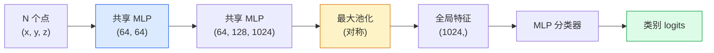

# 3D 视觉 — 点云与 NeRFs

> 3D 视觉有两种表现形式。点云是传感器的原始输出。NeRFs 是学习得到的体积场。两者都回答“空间中什么在什么位置”的问题。

**Type:** 学习 + 构建  
**Languages:** Python  
**Prerequisites:** Phase 4 Lesson 03（CNNs），Phase 1 Lesson 12（张量运算）  
**Time:** ~45 分钟

## 学习目标

- 区分显式（点云、网格、体素）与隐式（有符号距离场 SDF、NeRF）三维表示及各自适用场景  
- 理解 PointNet 的对称函数技巧，使得神经网络对无序点集具有置换不变性  
- 跟踪 NeRF 的前向过程：光线投射、体积渲染、位置编码、MLP 的密度+颜色头  
- 使用 `nerfstudio` 或 `instant-ngp` 从少量有位姿的图像进行预训练的 3D 重建

## 问题陈述

相机产生二维图像。LIDAR 输出一组无序的三维点。Structure-from-motion 管道产生稀疏的三维关键点云。NeRF 从少量有位姿的图像重建整个三维场景。所有这些都是“视觉”，但没有一个看起来像 CNN 期望的密集张量。

三维视觉重要，因为几乎所有高价值的机器人任务都在三维空间中运行：抓取、避障、导航、AR 遮挡、三维内容捕获。只理解二维图像的视觉工程师会被排除在该领域增长最快的部分之外（AR/VR 内容、机器人、自动驾驶栈、用于房产或建筑的基于 NeRF 的三维重建）。

这两种表示各有主导原因。点云是传感器直接给出的数据。NeRF 及其后继（3D Gaussian splatting、neural SDFs）是在请求神经网络去“学习”场景时得到的结果。

## 概念

### 点云

点云是 R^3 中 N 个点的无序集合，每个点可选地带有特征（颜色、强度、法向量）。

```
cloud = [
  (x1, y1, z1, r1, g1, b1),
  (x2, y2, z2, r2, g2, b2),
  ...
  (xN, yN, zN, rN, gN, bN),
]
```

没有网格，没有连通性。有两个性质让神经网络处理变得困难：

- **置换不变性（Permutation invariance）** — 输出不能依赖于点的顺序。  
- **可变 N** — 单个模型需要处理不同大小的点云。

PointNet（Qi 等，2017）用一个想法同时解决了这两个问题：对每个点应用一个共享的 MLP，然后用一个对称函数（最大池化）进行汇聚。结果是一个固定尺寸的向量，不依赖于点的顺序。

```
f(P) = max_{p in P} MLP(p)
```

这就是 PointNet 的核心。更深的变体（PointNet++、Point Transformer）加入了分层采样和局部聚合，但对称函数技巧不变。

### PointNet 架构



“共享 MLP” 意味着相同的 MLP 在每个点上独立运行。为提高效率，通常实现为沿点维度的 1x1 卷积。

### 神经辐射场（NeRFs）

NeRFs（Mildenhall 等，2020）提出了“能否从 N 张照片重建场景？”这一问题，并用一个本身就是场景的神经网络给出了答案。该网络将 `(x, y, z, viewing_direction)` 映射为 `(density, colour)`。渲染新视角就是对该网络做光线投射循环。

```
NeRF MLP:  (x, y, z, theta, phi) -> (sigma, r, g, b)

To render a pixel (u, v) of a new view:
  1. Cast a ray from the camera through pixel (u, v)
  2. Sample points along the ray at distances t_1, t_2, ..., t_N
  3. Query the MLP at each point
  4. Composite the colours weighted by (1 - exp(-sigma * dt))
  5. The sum is the rendered pixel colour
```

用渲染像素与训练照片中的真实像素比较损失。通过渲染步骤反向传播更新 MLP。没有三维真值、没有显式几何——场景被存储在 MLP 的权重中。

### NeRF 中的位置编码

在原始 MLP 上直接输入 `(x, y, z)` 无法表示高频细节，因为 MLP 在频谱上偏向低频。NeRF 通过在 MLP 之前把每个坐标编码为傅里叶特征向量来修复这一点：

```
gamma(p) = (sin(2^0 pi p), cos(2^0 pi p), sin(2^1 pi p), cos(2^1 pi p), ...)
```

最多到 L=10 个频率层。这与 Transformer 中的位置处理相同技巧，在扩散时间条件（Lesson 10）中也会再次出现。没有它，NeRF 会显得模糊。

### 体积渲染

```
C(r) = sum_i T_i * (1 - exp(-sigma_i * delta_i)) * c_i

T_i  = exp(- sum_{j<i} sigma_j * delta_j)
delta_i = t_{i+1} - t_i
```

`T_i` 是透射率——到达点 i 时还有多少光线存活。`(1 - exp(-sigma_i * delta_i))` 是点 i 的不透明度。`c_i` 是颜色。最终像素是沿光线的加权和。

### 取代 NeRF 的方法

纯 NeRF 训练慢（小时级）且渲染慢（每张图像秒级）。之后的谱系包括：

- **Instant-NGP**（2022）— 哈希网格编码替代了 MLP 的位置输入；训练耗时在秒级。  
- **Mip-NeRF 360** — 处理无界场景并做抗锯齿。  
- **3D Gaussian Splatting**（2023）— 用数百万个三维高斯取代体积场；训练分钟级，实时渲染。当前的生产默认选择。

到 2026 年，几乎所有真实的 NeRF 产品实际上是 3D Gaussian splatting，但思维模型仍是 NeRF。

### 数据集与基准

- **ShapeNet** — 用于 3D CAD 模型的分类与分割（以点云形式）。  
- **ScanNet** — 室内真实扫描用于分割。  
- **KITTI** — 用于自动驾驶的室外 LIDAR 点云。  
- **NeRF Synthetic** / **Blended MVS** — 有位姿图像的数据集，用于视角合成。  
- **Mip-NeRF 360** 数据集 — 无界真实场景。

## 实战

### 第 1 步：PointNet 分类器

```python
import torch
import torch.nn as nn

class PointNet(nn.Module):
    def __init__(self, num_classes=10):
        super().__init__()
        self.mlp1 = nn.Sequential(
            nn.Conv1d(3, 64, 1),    nn.BatchNorm1d(64),   nn.ReLU(inplace=True),
            nn.Conv1d(64, 64, 1),   nn.BatchNorm1d(64),   nn.ReLU(inplace=True),
        )
        self.mlp2 = nn.Sequential(
            nn.Conv1d(64, 128, 1),  nn.BatchNorm1d(128),  nn.ReLU(inplace=True),
            nn.Conv1d(128, 1024, 1), nn.BatchNorm1d(1024), nn.ReLU(inplace=True),
        )
        self.head = nn.Sequential(
            nn.Linear(1024, 512),   nn.BatchNorm1d(512),  nn.ReLU(inplace=True),
            nn.Dropout(0.3),
            nn.Linear(512, 256),    nn.BatchNorm1d(256),  nn.ReLU(inplace=True),
            nn.Dropout(0.3),
            nn.Linear(256, num_classes),
        )

    def forward(self, x):
        # x: (N, 3, num_points) — 已为 Conv1d 做了转置
        x = self.mlp1(x)
        x = self.mlp2(x)
        x = torch.max(x, dim=-1)[0]       # (N, 1024)
        return self.head(x)

pts = torch.randn(4, 3, 1024)
net = PointNet(num_classes=10)
print(f"output: {net(pts).shape}")
print(f"params: {sum(p.numel() for p in net.parameters()):,}")
```

大约 1.6M 参数。每个点云处理 1,024 个点。

### 第 2 步：位置编码

```python
def positional_encoding(x, L=10):
    """
    x: (..., D) -> (..., D * 2 * L)
    将每个坐标映射为多频率的 sin/cos 特征
    """
    freqs = 2.0 ** torch.arange(L, dtype=x.dtype, device=x.device)
    args = x.unsqueeze(-1) * freqs * 3.141592653589793
    sinc = torch.cat([args.sin(), args.cos()], dim=-1)
    return sinc.reshape(*x.shape[:-1], -1)

x = torch.randn(5, 3)
y = positional_encoding(x, L=10)
print(f"input:  {x.shape}")
print(f"encoded: {y.shape}     # (5, 60)")
```

乘以 `2^l * pi` 会产生逐渐更高的频率分量。

### 第 3 步：Tiny NeRF MLP

```python
class TinyNeRF(nn.Module):
    def __init__(self, L_pos=10, L_dir=4, hidden=128):
        super().__init__()
        self.L_pos = L_pos
        self.L_dir = L_dir
        pos_dim = 3 * 2 * L_pos
        dir_dim = 3 * 2 * L_dir
        self.trunk = nn.Sequential(
            nn.Linear(pos_dim, hidden), nn.ReLU(inplace=True),
            nn.Linear(hidden, hidden),  nn.ReLU(inplace=True),
            nn.Linear(hidden, hidden),  nn.ReLU(inplace=True),
            nn.Linear(hidden, hidden),  nn.ReLU(inplace=True),
        )
        self.sigma = nn.Linear(hidden, 1)
        self.color = nn.Sequential(
            nn.Linear(hidden + dir_dim, hidden // 2), nn.ReLU(inplace=True),
            nn.Linear(hidden // 2, 3), nn.Sigmoid(),
        )

    def forward(self, x, d):
        x_enc = positional_encoding(x, self.L_pos)
        d_enc = positional_encoding(d, self.L_dir)
        h = self.trunk(x_enc)
        sigma = torch.relu(self.sigma(h)).squeeze(-1)
        rgb = self.color(torch.cat([h, d_enc], dim=-1))
        return sigma, rgb

nerf = TinyNeRF()
x = torch.randn(128, 3)
d = torch.randn(128, 3)
s, c = nerf(x, d)
print(f"sigma: {s.shape}   rgb: {c.shape}")
```

和原始 NeRF（两条深度为 8 的 MLP 干路）相比很小。足够演示架构。

### 第 4 步：沿光线的体积渲染

```python
def volumetric_render(sigma, rgb, t_vals):
    """
    sigma: (..., N_samples)
    rgb:   (..., N_samples, 3)
    t_vals: (N_samples,) 光线上各采样点的距离
    """
    delta = torch.cat([t_vals[1:] - t_vals[:-1], torch.full_like(t_vals[:1], 1e10)])
    alpha = 1.0 - torch.exp(-sigma * delta)
    trans = torch.cumprod(torch.cat([torch.ones_like(alpha[..., :1]), 1.0 - alpha + 1e-10], dim=-1), dim=-1)[..., :-1]
    weights = alpha * trans
    rendered = (weights.unsqueeze(-1) * rgb).sum(dim=-2)
    depth = (weights * t_vals).sum(dim=-1)
    return rendered, depth, weights


N = 64
t_vals = torch.linspace(2.0, 6.0, N)
sigma = torch.rand(N) * 0.5
rgb = torch.rand(N, 3)
rendered, depth, weights = volumetric_render(sigma, rgb, t_vals)
print(f"rendered colour: {rendered.tolist()}")
print(f"depth:           {depth.item():.2f}")
```

一条光线，64 个采样点，合成出一个 RGB 像素和一个深度值。

## 使用建议

用于实际工作：

- `nerfstudio`（Tancik 等）— 当前 NeRF / Instant-NGP / Gaussian Splatting 的参考库。命令行工具并包含 web 查看器。  
- `pytorch3d`（Meta）— 可微渲染、点云工具与网格操作。  
- `open3d` — 点云处理、配准与可视化。

用于部署时，3D Gaussian splatting 在渲染速度上大幅优于纯 NeRF（快 100 倍），且重建质量可比。

## 交付物

本课产出：

- `outputs/prompt-3d-task-router.md` — 一个根据任务与输入数据路由到合适 3D 表示（点云、网格、体素、NeRF、Gaussian splat）的提示词。  
- `outputs/skill-point-cloud-loader.md` — 一个技能（skill），用于编写支持 .ply / .pcd / .xyz 文件的 PyTorch `Dataset`，包括正确的归一化、居中和点采样。

## 练习

1. **（简单）** 证明 PointNet 的置换不变性：对同一点云运行两次，一次在原始顺序，一次打乱点顺序。验证输出在浮点噪声内相同。  
2. **（中等）** 实现一个最小的光线生成函数，给定相机内参和位姿，生成 H x W 图像每个像素的光线原点和方向。  
3. **（困难）** 在一个合成数据集上训练 TinyNeRF：该数据集由彩色立方体的渲染视图构成（可用可微渲染器或简单光线追踪器生成）。报告第 1、10、100 个 epoch 的渲染损失。模型在哪个 epoch 开始产生可识别的视图？

## 术语

| 术语 | 大家怎么说 | 它实际上意味着 |
|------|----------------|----------------------|
| Point cloud | "3D points from LIDAR" | 无序的 (x, y, z) 集合，点上可选带有附加特征 |
| PointNet | "First neural net on point clouds" | 对每个点使用共享 MLP + 对称（max）池；从构造上具有置换不变性 |
| NeRF | "MLP that is the scene" | 网络将 (x, y, z, dir) 映射为 (密度, 颜色)；通过光线投射渲染 |
| Positional encoding | "Fourier features" | 将每个坐标编码为多频率的 sin/cos，以克服 MLP 的低频偏差 |
| Volumetric rendering | "Ray integration" | 使用透射率和 alpha 将沿光线的采样合成为单个像素 |
| Instant-NGP | "Hash-grid NeRF" | 用多分辨率哈希网格替代 NeRF 的坐标 MLP；快 100-1000x |
| 3D Gaussian splatting | "Millions of Gaussians" | 场景由大量三维高斯组成；实时渲染，训练分钟级 |
| SDF | "Signed distance field" | 返回到最近表面的有符号距离的函数；另一种隐式表示 |

## 延伸阅读

- [PointNet (Qi et al., 2017)](https://arxiv.org/abs/1612.00593) — 置换不变的点云分类器  
- [NeRF (Mildenhall et al., 2020)](https://arxiv.org/abs/2003.08934) — 将多张照片的三维重建转为神经网络问题的开创论文  
- [Instant-NGP (Müller et al., 2022)](https://arxiv.org/abs/2201.05989) — 哈希网格，数百到一千倍的加速  
- [3D Gaussian Splatting (Kerbl et al., 2023)](https://arxiv.org/abs/2308.04079) — 在生产中取代 NeRF 的架构