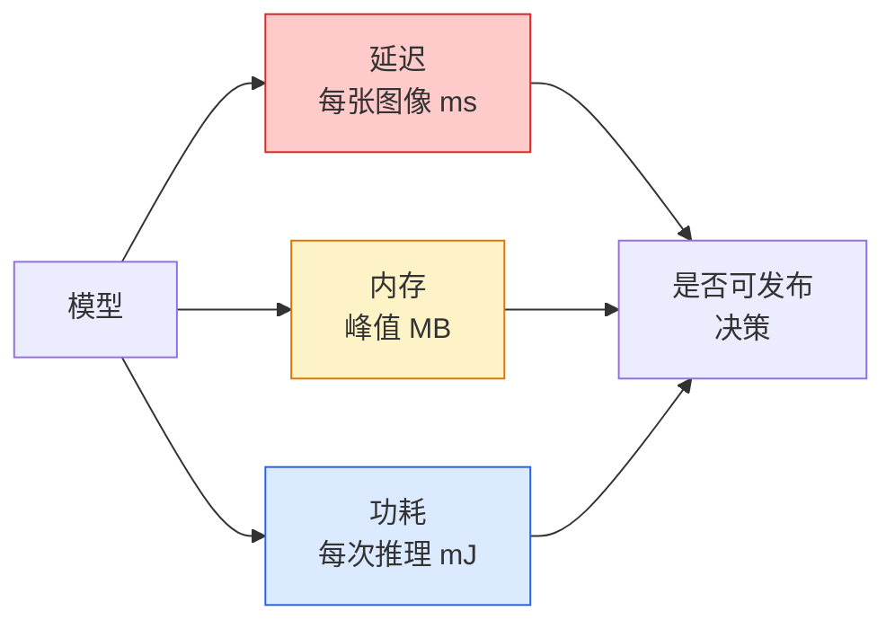

# 实时视觉 — 边缘部署

> 边缘推理的学问是在一台只有 2 GB 内存的设备上，以 30 fps 运行一个 90% 准确率的模型。每一个百分点的准确率都要用毫秒级的延迟去交换。

**Type:** 学习 + 实践
**Languages:** Python
**Prerequisites:** 第4阶段 第04课（图像分类），第10阶段 第11课（量化）
**Time:** ~75 分钟

## 学习目标

- 测量任何 PyTorch 模型的推理延迟、峰值内存和吞吐量，并理解 FLOPs / 参数 / 延迟 之间的权衡
- 使用 PyTorch 的后训练量化将视觉模型量化为 INT8，并验证精度损失 < 1%
- 导出为 ONNX 并用 ONNX Runtime 或 TensorRT 编译；能说出三种最常见的导出失败及其修复方法
- 解释在边缘受限场景下何时选择 MobileNetV3、EfficientNet-Lite、ConvNeXt-Tiny 或 MobileViT

## 问题背景

训练时的视觉模型通常是浮点数的“怪兽”。100M 参数、每次前向 10 GFLOPs、2 GB 显存。没有任何一项能直接放到手机、汽车信息娱乐单元、工业相机或无人机上。把视觉系统上线意味着要在小 100 倍的预算内实现相同的预测能力。

有三个旋钮能做大多数工作：模型选择（采用更小的架构但相同配方）、量化（用 INT8 替代 FP32）、以及推理运行时（ONNX Runtime、TensorRT、Core ML、TFLite）。把这些做对，是演示能在工作站运行与产品能在 30 美元摄像头模组上出货之间的差别。

本课先建立测量规范（你无法优化你无法衡量的东西），然后逐步演示三个旋钮。目标不是学习每一个边缘运行时，而是知道有哪些手段并能验证每一步是否按预期工作。

## 概念

### 三个预算



- **延迟**：p50、p95、p99。只看 p50 会掩盖对实时系统重要的尾部行为。
- **峰值内存**：设备见到的最大内存，而不是稳态平均值。嵌入式目标上 OOM 是致命的。
- **功耗 / 能量**：在电池供电设备上每次推理的毫焦。通常用 CPU/GPU 利用率 * 时间作为代理。

边缘决策基于一张（模型、延迟、内存、精度）的表格。每个单元格都应在目标设备上测量，而不是工作站。

### 测量规范

每个边缘配置剖面应遵循三条规则：

1. 先进行 5-10 次虚拟前向进行**预热**。冷缓存和 JIT 编译会产生不可代表的首次数字。
2. 在计时代块前后用 `torch.cuda.synchronize()` **同步** GPU 工作负载。否则你测到的是内核的调度时间，而不是内核执行时间。
3. **固定输入尺寸**为生产分辨率。224x224 的延迟不等于 512x512 的延迟。

### 将 FLOPs 作为代理

FLOPs（每次推理的浮点运算次数）是一个廉价、与设备无关的延迟代理。适合用于架构比较，但作为绝对墙钟时间会误导。一个 FLOPs 多 10% 的模型在实践中可能快 2 倍，因为它使用了更适合硬件的算子（深度可分卷积容易被编译优化，而大的 7x7 卷积则不然）。

规则：在架构搜索中使用 FLOPs，在部署决策中使用设备上的实际延迟。

### 一句话说明量化

用 INT8 替换 FP32 的权重和激活。模型大小减小 4 倍，内存带宽减小 4 倍，在支持 INT8 内核的硬件上计算加速 2–4 倍（现代移动 SoC、带 Tensor Cores 的 NVIDIA GPU 都支持）。视觉任务上后训练静态量化的精度损失通常在 0.1–1 个百分点。

类型：

- **动态** — 将权重量化为 INT8，激活在运行时以 FP 计算。简单，速度提升小。
- **静态（后训练）** — 将权重量化并用小规模校准集校准激活范围。比动态快得多。
- **量化感知训练（QAT）** — 在训练过程中模拟量化，让模型学习适应量化。精度最好，但需要有标签的数据。

对于视觉任务，后训练静态量化以很小的工作量拿到约 95% 的收益。只有在 PTQ 导致不可接受的精度下降时才使用 QAT。

### 剪枝与蒸馏

- **剪枝** — 移除不重要的权重（基于幅度）或通道（结构化剪枝）。在过参数化模型上效果好；在已高度压缩的架构上用处较小。
- **蒸馏** — 训练一个小的 student 去模仿一个大 teacher 的 logits。常常能恢复大部分因缩小模型而失去的精度。是生产级边缘模型的常见做法。

### 推理运行时

- **PyTorch eager** — 慢，不用于部署，仅用于开发。
- **TorchScript** — 旧方案。已被 `torch.compile` 和 ONNX 导出取代。
- **ONNX Runtime** — 中立运行时。CPU、CUDA、CoreML、TensorRT、OpenVINO 等都有 ONNX 提供器。从这里开始是合理的。
- **TensorRT** — NVIDIA 的编译器。在 NVIDIA GPU（工作站和 Jetson）上获得最佳延迟。可与 ONNX Runtime 集成或独立使用。
- **Core ML** — Apple 在 iOS/macOS 上的运行时。需要 `.mlmodel` 或 `.mlpackage`。
- **TFLite** — Google 在 Android/ARM 上的运行时。需要 `.tflite`。
- **OpenVINO** — Intel 在 CPU/VPU 上的运行时。需要 `.xml` + `.bin`。

实践流程：PyTorch -> ONNX -> 根据目标选择运行时。ONNX 是通用语言。

### 边缘架构选择器

| 预算 | 模型 | 为什么 |
|------|------|--------|
| < 3M 参数 | MobileNetV3-Small | 能在各处编译，通过性好，作基线不错 |
| 3-10M | EfficientNet-Lite-B0 | 在 TFLite 上单位参数精度最好 |
| 10-20M | ConvNeXt-Tiny | 单参数精度最好，CPU 友好 |
| 20-30M | MobileViT-S 或 EfficientViT | 具有 ImageNet 精度的 Transformer |
| 30-80M | Swin-V2-Tiny | 如果堆栈支持 window attention 时可选 |

除非有特殊理由，否则将以上模型量化为 INT8。

```figure
cnn-param-count
```

## 实战

### 步骤 1：正确测量延迟

```python
import time
import torch

def measure_latency(model, input_shape, device="cpu", warmup=10, iters=50):
    model = model.to(device).eval()
    x = torch.randn(input_shape, device=device)
    with torch.no_grad():
        for _ in range(warmup):
            model(x)
        if device == "cuda":
            torch.cuda.synchronize()
        times = []
        for _ in range(iters):
            if device == "cuda":
                torch.cuda.synchronize()
            t0 = time.perf_counter()
            model(x)
            if device == "cuda":
                torch.cuda.synchronize()
            times.append((time.perf_counter() - t0) * 1000)
    times.sort()
    return {
        "p50_ms": times[len(times) // 2],
        "p95_ms": times[int(len(times) * 0.95)],
        "p99_ms": times[int(len(times) * 0.99)],
        "mean_ms": sum(times) / len(times),
    }
```

预热、同步、使用 `time.perf_counter()`。报告百分位而不仅仅是平均值。

### 步骤 2：参数和 FLOP 计数

```python
def parameter_count(model):
    return sum(p.numel() for p in model.parameters())

def flops_estimate(model, input_shape):
    """
    用于只含卷积/线性层模型的粗略 FLOP 估计。生产环境请使用 `fvcore` 或 `ptflops`。
    """
    total = 0
    def conv_hook(m, inp, out):
        nonlocal total
        c_out, c_in, kh, kw = m.weight.shape
        h, w = out.shape[-2:]
        total += 2 * c_in * c_out * kh * kw * h * w
    def linear_hook(m, inp, out):
        nonlocal total
        total += 2 * m.in_features * m.out_features
    hooks = []
    for m in model.modules():
        if isinstance(m, torch.nn.Conv2d):
            hooks.append(m.register_forward_hook(conv_hook))
        elif isinstance(m, torch.nn.Linear):
            hooks.append(m.register_forward_hook(linear_hook))
    model.eval()
    with torch.no_grad():
        model(torch.randn(input_shape))
    for h in hooks:
        h.remove()
    return total
```

实际项目中请使用 `fvcore.nn.FlopCountAnalysis` 或 `ptflops`；它们能正确处理各种模块类型。

### 步骤 3：后训练静态量化

```python
def quantise_ptq(model, calibration_loader, backend="x86"):
    import torch.ao.quantization as tq
    model = model.eval().cpu()
    model.qconfig = tq.get_default_qconfig(backend)
    tq.prepare(model, inplace=True)
    with torch.no_grad():
        for x, _ in calibration_loader:
            model(x)
    tq.convert(model, inplace=True)
    return model
```

三个步骤：配置（qconfig）、准备（插入观察器）、用真实数据校准激活范围并转换（融合 + 量化）。要求模型先进行 fuse（如 `Conv -> BN -> ReLU` -> `ConvBnReLU`），可用 `torch.ao.quantization.fuse_modules` 来处理。

### 步骤 4：导出为 ONNX

```python
def export_onnx(model, sample_input, path="model.onnx"):
    model = model.eval()
    torch.onnx.export(
        model,
        sample_input,
        path,
        input_names=["input"],
        output_names=["output"],
        dynamic_axes={"input": {0: "batch"}, "output": {0: "batch"}},
        opset_version=17,
    )
    return path
```

`opset_version=17` 是 2026 年的安全默认值。`dynamic_axes` 允许 ONNX 模型使用任意 batch size。

### 步骤 5：基准比较不同方案

```python
import torch.nn as nn
from torchvision.models import mobilenet_v3_small

def compare_regimes():
    model = mobilenet_v3_small(weights=None, num_classes=10)
    params = parameter_count(model)
    flops = flops_estimate(model, (1, 3, 224, 224))
    lat_fp32 = measure_latency(model, (1, 3, 224, 224), device="cpu")
    print(f"FP32 MobileNetV3-Small: {params:,} params  {flops/1e9:.2f} GFLOPs  "
          f"p50={lat_fp32['p50_ms']:.2f}ms  p95={lat_fp32['p95_ms']:.2f}ms")
```

对 `resnet50`、`efficientnet_v2_s` 和 `convnext_tiny` 运行相同函数，你就能得到用于部署决策的比较表。

## 使用场景

生产栈通常收敛到以下三条路径之一：

- **Web / serverless**：PyTorch -> ONNX -> ONNX Runtime（CPU 或 CUDA provider）。最简单，对大多数情况足够好。
- **NVIDIA 边缘（Jetson、GPU 服务器）**：PyTorch -> ONNX -> TensorRT。延迟最佳，但工程工作量最大。
- **移动端**：PyTorch -> ONNX -> Core ML（iOS）或 TFLite（Android）。导出前先做量化。

用于测量的工具包括 `torch-tb-profiler`、`nvprof` / `nsys`，以及 macOS 的 Instruments，可提供逐层的分解。`benchmark_app`（OpenVINO）和 `trtexec`（TensorRT）能给出独立的 CLI 数字。

## 上线成果

本课产出：

- `outputs/prompt-edge-deployment-planner.md` — 一个根据目标设备和延迟 SLA 选择主干网、量化策略和运行时的提示词。
- `outputs/skill-latency-profiler.md` — 一个技能脚本，生成完整的延迟基准脚本，包含预热、同步、百分位统计和内存跟踪。

## 练习

1. **（简单）** 在 CPU 上以 224x224 测量 `resnet18`、`mobilenet_v3_small`、`efficientnet_v2_s` 和 `convnext_tiny` 的 p50 延迟。给出表格并指出哪个架构的每毫秒精度最高。
2. **（中等）** 对 `mobilenet_v3_small` 应用后训练静态量化。报告 FP32 与 INT8 的延迟对比及在 CIFAR-10（或类似持出子集）上的精度损失。
3. **（困难）** 将 `convnext_tiny` 导出为 ONNX，用 `onnxruntime` 的 `CPUExecutionProvider` 运行并与 PyTorch eager 基线比较延迟。找出 ONNX Runtime 开始比 PyTorch 更快的第一层并解释原因。

## 术语详解

| 术语 | 大家怎么说 | 实际含义 |
|------|----------|--------|
| Latency | “有多快” | 从输入到输出的时间；应使用 p50/p95/p99 百分位，而不是均值 |
| FLOPs | “模型大小” | 每次前向的浮点运算次数；对计算成本的粗略代理 |
| INT8 quantisation | “8-bit” | 用 8 位整数替换 FP32 的权重/激活；约 4 倍更小，2–4 倍更快 |
| PTQ | “后训练量化” | 在不重训练的情况下对训练好的模型进行量化；简单且通常足够 |
| QAT | “量化感知训练” | 在训练中模拟量化；精度最好，但需要有标签的数据 |
| ONNX | “中立格式” | 被主流推理运行时支持的模型交换格式 |
| TensorRT | “NVIDIA 编译器” | 将 ONNX 编译为 NVIDIA GPU 的优化引擎 |
| Distillation | “教师 -> 学生” | 训练小模型以模仿大模型的 logits；可恢复大部分因压缩带来的精度损失 |

## 延伸阅读

- [EfficientNet (Tan & Le, 2019)](https://arxiv.org/abs/1905.11946) — 用于高效架构的复合缩放
- [MobileNetV3 (Howard et al., 2019)](https://arxiv.org/abs/1905.02244) — 面向移动端的架构，包含 h-swish 和 squeeze-excite
- [A Practical Guide to TensorRT Optimization (NVIDIA)](https://developer.nvidia.com/blog/accelerating-model-inference-with-tensorrt-tips-and-best-practices-for-pytorch-users/) — 如何在实践中真正拿到论文中的吞吐数字
- [ONNX Runtime docs](https://onnxruntime.ai/docs/) — 量化、图优化、provider 选择