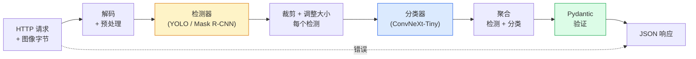

# 构建完整视觉管道 — 结业项目

> 一个生产级视觉系统是由模型和规则通过数据合约串联起来的链条。各个组件在本阶段已经出现；结业项目将它们端到端地连接起来。

**Type:** 构建
**Languages:** Python
**Prerequisites:** 第4阶段 课程 01-15
**Time:** ~120 分钟

## 学习目标

- 设计一个生产级视觉管道：检测对象、对其分类，并输出结构化 JSON —— 处理所有失败路径
- 将检测器（Mask R-CNN 或 YOLO）、分类器（ConvNeXt-Tiny）和数据合约（Pydantic）插入到同一服务中
- 基准评测端到端管道并识别第一个瓶颈（通常是预处理，其次是检测器）
- 发布一个最小的 FastAPI 服务，接受图片上传，运行管道并返回带分类的检测结果

## 问题背景

单个视觉模型有用；视觉产品是多个模型的链条。零售货架审计是检测器 + 产品分类器 + 价格 OCR 管道。自动驾驶是 2D 检测器 + 3D 检测器 + 分割器 + 跟踪器 + 规划器。医疗预筛查是分割器 + 区域分类器 + 临床界面。

把这些链条连接起来是将 ML 原型转为产品的关键。模型之间的每个接口都是潜在的 bug 点。每一次坐标变换、每一次归一化、每一次掩码重采样都可能静默失败。一个管道的强度取决于最弱的接口。

本结业项目搭建最小可行管道：检测 + 分类 + 结构化输出 + 服务层。第4阶段的其他内容都可以插入这个骨架：用 YOLOv8 替换 Mask R-CNN，添加 OCR head，添加分割分支，添加跟踪器。架构稳定；各组件可插拔。

## 概念

### 管道



七个阶段。两个模型阶段开销最大；其余五个阶段是 bug 最容易出现的地方。

### 使用 Pydantic 的数据合约

每个模型边界都变成一个类型化对象。这会把静默失败变成显式错误。

```
Detection(
    box: tuple[float, float, float, float],   # (x1, y1, x2, y2)，绝对像素
    score: float,                              # [0, 1]
    class_id: int,                             # 来自检测器的标签映射
    mask: Optional[list[list[int]]],           # 如果存在则为 RLE 编码
)

PipelineResult(
    image_id: str,
    detections: list[Detection],
    classifications: list[Classification],
    inference_ms: float,
)
```

当检测器返回的是 `(cx, cy, w, h)` 而不是 `(x1, y1, x2, y2)` 时，Pydantic 会在边界处验证失败，你可以立即发现问题，而不是调试下游的裁剪导致静默返回空区域的问题。

### 延迟主要去向

在几乎所有视觉管道中，有三条公认的真相：

1. 预处理通常是单个最大的开销。解码 JPEG、颜色空间转换、调整大小——这些都是 CPU 密集型且容易被忽略。
2. 检测器占据大部分 GPU 时间。70-90% 的 GPU 时间在检测的前向传播中消耗。
3. 后处理（NMS、RLE 编码/解码）在 GPU 上便宜，但在 CPU 上昂贵。一定要用目标环境进行性能剖析。

了解时间分布能把优化变成一个优先级列表。

### 失败模式

- 空检测 —— 返回空列表，不要崩溃。记录日志。
- 越界的框 —— 在裁剪前把坐标夹到图像范围内。
- 过小的裁剪 —— 对小于分类器最小输入的框跳过分类。
- 上传损坏 —— 返回 400 响应并带上具体错误码，而不是 500。
- 模型加载失败 —— 在服务启动时失败，而不是第一次请求时失败。

生产级管道对每种情况都有处理决策，而不是写通用的 try/except 去隐藏错误。每种失败都有命名的错误码和响应。

### 批处理（Batching）

生产服务要为多个客户端提供服务。在请求之间批量处理检测和分类可以成倍提升吞吐量。权衡在于：为了等待批次填满带来的额外延迟。典型做法：收集请求最多 20ms，批量处理，分发响应。`torchserve` 和 `triton` 原生支持；负载可预测的小服务通常会自己实现微型批处理器。

## 构建步骤

### 步骤 1：数据合约

```python
from pydantic import BaseModel, Field
from typing import List, Optional, Tuple

class Detection(BaseModel):
    box: Tuple[float, float, float, float]
    score: float = Field(ge=0, le=1)
    class_id: int = Field(ge=0)
    mask_rle: Optional[str] = None


class Classification(BaseModel):
    detection_index: int
    class_id: int
    class_name: str
    score: float = Field(ge=0, le=1)


class PipelineResult(BaseModel):
    image_id: str
    detections: List[Detection]
    classifications: List[Classification]
    inference_ms: float
```

五秒的代码能为任何严肃的管道节省一小时的调试时间。

### 步骤 2：一个最小的 Pipeline 类

```python
import time
import numpy as np
import torch
from PIL import Image

class VisionPipeline:
    def __init__(self, detector, classifier, class_names,
                 device="cpu", min_crop=32):
        self.detector = detector.to(device).eval()
        self.classifier = classifier.to(device).eval()
        self.class_names = class_names
        self.device = device
        self.min_crop = min_crop

    def preprocess(self, image):
        """
        image: PIL.Image or np.ndarray (H, W, 3) uint8
        returns: CHW float tensor on device
        image: PIL.Image 或 np.ndarray (H, W, 3) uint8
        returns: 在 device 上的 CHW float tensor
        """
        if isinstance(image, Image.Image):
            image = np.asarray(image.convert("RGB"))
        tensor = torch.from_numpy(image).permute(2, 0, 1).float() / 255.0
        return tensor.to(self.device)

    @torch.no_grad()
    def detect(self, image_tensor):
        return self.detector([image_tensor])[0]

    @torch.no_grad()
    def classify(self, crops):
        if len(crops) == 0:
            return []
        batch = torch.stack(crops).to(self.device)
        logits = self.classifier(batch)
        probs = logits.softmax(-1)
        scores, cls = probs.max(-1)
        return list(zip(cls.tolist(), scores.tolist()))

    def run(self, image, image_id="anonymous"):
        t0 = time.perf_counter()
        tensor = self.preprocess(image)
        det = self.detect(tensor)

        crops = []
        detections = []
        valid_indices = []
        for i, (box, score, cls) in enumerate(zip(det["boxes"], det["scores"], det["labels"])):
            x1, y1, x2, y2 = [max(0, int(b)) for b in box.tolist()]
            x2 = min(x2, tensor.shape[-1])
            y2 = min(y2, tensor.shape[-2])
            detections.append(Detection(
                box=(x1, y1, x2, y2),
                score=float(score),
                class_id=int(cls),
            ))
            if (x2 - x1) < self.min_crop or (y2 - y1) < self.min_crop:
                continue
            crop = tensor[:, y1:y2, x1:x2]
            crop = torch.nn.functional.interpolate(
                crop.unsqueeze(0),
                size=(224, 224),
                mode="bilinear",
                align_corners=False,
            )[0]
            crops.append(crop)
            valid_indices.append(i)

        class_preds = self.classify(crops)

        classifications = []
        for valid_idx, (cls_id, cls_score) in zip(valid_indices, class_preds):
            classifications.append(Classification(
                detection_index=valid_idx,
                class_id=int(cls_id),
                class_name=self.class_names[cls_id],
                score=float(cls_score),
            ))

        return PipelineResult(
            image_id=image_id,
            detections=detections,
            classifications=classifications,
            inference_ms=(time.perf_counter() - t0) * 1000,
        )
```

每个接口都是类型化的。每条失败路径都有具体的处理决策。

### 步骤 3：连接检测器和分类器

```python
from torchvision.models.detection import maskrcnn_resnet50_fpn_v2
from torchvision.models import convnext_tiny

# Use ImageNet-pretrained weights for a realistic pipeline without training
detector = maskrcnn_resnet50_fpn_v2(weights="DEFAULT")
classifier = convnext_tiny(weights="DEFAULT")
class_names = [f"imagenet_class_{i}" for i in range(1000)]

pipe = VisionPipeline(detector, classifier, class_names)

# Smoke test with a synthetic image
test_image = (np.random.rand(400, 600, 3) * 255).astype(np.uint8)
result = pipe.run(test_image, image_id="demo")
print(result.model_dump_json(indent=2)[:500])
```

将注释翻译为中文以便阅读：

```python
from torchvision.models.detection import maskrcnn_resnet50_fpn_v2
from torchvision.models import convnext_tiny

# 使用 ImageNet 预训练权重，以便在不训练的情况下得到真实感的管道
detector = maskrcnn_resnet50_fpn_v2(weights="DEFAULT")
classifier = convnext_tiny(weights="DEFAULT")
class_names = [f"imagenet_class_{i}" for i in range(1000)]

pipe = VisionPipeline(detector, classifier, class_names)

# 使用合成图像进行冒烟测试
test_image = (np.random.rand(400, 600, 3) * 255).astype(np.uint8)
result = pipe.run(test_image, image_id="demo")
print(result.model_dump_json(indent=2)[:500])
```

### 步骤 4：FastAPI 服务

```python
from fastapi import FastAPI, UploadFile, HTTPException
from io import BytesIO

app = FastAPI()
pipe = None  # initialised on startup

@app.on_event("startup")
def load():
    global pipe
    detector = maskrcnn_resnet50_fpn_v2(weights="DEFAULT").eval()
    classifier = convnext_tiny(weights="DEFAULT").eval()
    pipe = VisionPipeline(detector, classifier, class_names=[f"c{i}" for i in range(1000)])

@app.post("/detect")
async def detect_endpoint(file: UploadFile):
    if file.content_type not in {"image/jpeg", "image/png", "image/webp"}:
        raise HTTPException(status_code=400, detail="unsupported image type")
    data = await file.read()
    try:
        img = Image.open(BytesIO(data)).convert("RGB")
    except Exception:
        raise HTTPException(status_code=400, detail="cannot decode image")
    result = pipe.run(img, image_id=file.filename or "upload")
    return result.model_dump()
```

保留代码主体不变，只翻译注释：

```python
from fastapi import FastAPI, UploadFile, HTTPException
from io import BytesIO

app = FastAPI()
pipe = None  # 在启动时初始化

@app.on_event("startup")
def load():
    global pipe
    detector = maskrcnn_resnet50_fpn_v2(weights="DEFAULT").eval()
    classifier = convnext_tiny(weights="DEFAULT").eval()
    pipe = VisionPipeline(detector, classifier, class_names=[f"c{i}" for i in range(1000)])
```

使用 `uvicorn main:app --host 0.0.0.0 --port 8000` 运行。用 `curl -F 'file=@dog.jpg' http://localhost:8000/detect` 测试。

### 步骤 5：基准测试管道

```python
import time

def benchmark(pipe, num_runs=20, image_size=(400, 600)):
    img = (np.random.rand(*image_size, 3) * 255).astype(np.uint8)
    pipe.run(img)  # warm up

    stages = {"preprocess": [], "detect": [], "classify": [], "total": []}
    for _ in range(num_runs):
        t0 = time.perf_counter()
        tensor = pipe.preprocess(img)
        t1 = time.perf_counter()
        det = pipe.detect(tensor)
        t2 = time.perf_counter()
        crops = []
        for box in det["boxes"]:
            x1, y1, x2, y2 = [max(0, int(b)) for b in box.tolist()]
            x2 = min(x2, tensor.shape[-1])
            y2 = min(y2, tensor.shape[-2])
            if (x2 - x1) >= pipe.min_crop and (y2 - y1) >= pipe.min_crop:
                crop = tensor[:, y1:y2, x1:x2]
                crop = torch.nn.functional.interpolate(
                    crop.unsqueeze(0), size=(224, 224), mode="bilinear", align_corners=False
                )[0]
                crops.append(crop)
        pipe.classify(crops)
        t3 = time.perf_counter()
        stages["preprocess"].append((t1 - t0) * 1000)
        stages["detect"].append((t2 - t1) * 1000)
        stages["classify"].append((t3 - t2) * 1000)
        stages["total"].append((t3 - t0) * 1000)

    for stage, times in stages.items():
        times.sort()
        print(f"{stage:12s}  p50={times[len(times)//2]:7.1f} ms  p95={times[int(len(times)*0.95)]:7.1f} ms")
```

翻译注释：

```python
    img = (np.random.rand(*image_size, 3) * 255).astype(np.uint8)
    pipe.run(img)  # 预热
```

在 CPU 上的典型输出：preprocess ~3 ms，detect 300-500 ms，classify 20-40 ms，total 350-550 ms。在 GPU 上，detect 是 20-40 ms，预处理 + 分类在相对比例上更重要。

## 使用建议

生产模板趋向相同的结构，外加：

- 模型版本管理 —— 在响应中总是记录模型名称和权重哈希。
- 每请求跟踪 ID —— 为每个请求记录每个阶段的时间，以便关联慢响应与阶段。
- 回退路径 —— 如果分类器超时，返回没有分类的检测而不是让整个请求失败。
- 安全过滤 —— 在分类后、响应发出前运行 NSFW / PII 过滤器。
- 批量端点 —— 一个 `/detect_batch` 接受图像 URL 列表以进行批量处理。

对于生产服务，`torchserve`、`Triton Inference Server`、`BentoML` 原生支持批处理、版本管理、指标和健康检查。直接运行 `FastAPI` 适用于原型和小规模产品。

## 发布内容

本课产出：

- `outputs/prompt-vision-service-shape-reviewer.md` — 一个用于审查视觉服务代码中合约/响应形状违规并指出第一个破坏性 bug 的提示词。
- `outputs/skill-pipeline-budget-planner.md` — 一个技能：给定目标延迟和吞吐量，为每个管道阶段分配时间预算并标注哪个阶段会先超出预算。

## 练习

1. (简单) 在任意开放数据集中对 10 张图运行管道。报告每个阶段的平均时间以及每张图的检测数量分布。
2. (中等) 在 `Detection` 中添加掩码输出字段并以 RLE 编码。验证即使对 10 个目标的图像，JSON 也保持在 1MB 以下。
3. (困难) 在分类器前添加微型批处理器：收集裁剪不超过 10 ms，将其在一次 GPU 调用中分类，按请求返回结果。测量在每秒 5 个并发请求情况下的吞吐量提升以及带来的延迟增加。

## 关键词

| Term | What people say | What it actually means |
|------|----------------|----------------------|
| Pipeline | "The system" | 一个有序链条，包含预处理、推理和后处理步骤，并且每对步骤之间有类型化接口 |
| Data contract | "The schema" | Pydantic / dataclass 定义，每个阶段的输入输出都符合；在边界处捕获集成错误 |
| Preprocessing | "Before the model" | 解码、颜色转换、调整大小、归一化；通常是最大的 CPU 时间消耗 |
| Postprocessing | "After the model" | NMS、掩码重采样、阈值、RLE 编码；在 GPU 上便宜，在 CPU 上昂贵 |
| Microbatcher | "Collect then forward" | 聚合器，等待固定时间窗口收集多个请求，运行单次批量前向 |
| Trace ID | "Request id" | 每请求标识符，在每个阶段记录以便端到端追踪慢请求 |
| Failure code | "Named error" | 每类失败的具体错误码，而不是通用 500；使客户端能做重试决策 |
| Health check | "Readiness probe" | 一个廉价的端点，报告服务是否能响应；负载均衡器依赖于它 |

## 拓展阅读

- [Full Stack Deep Learning — Deploying Models](https://fullstackdeeplearning.com/course/2022/lecture-5-deployment/) — 有关生产 ML 部署的权威概览
- [BentoML docs](https://docs.bentoml.com) — 提供批处理、版本管理和指标的服务框架
- [torchserve docs](https://pytorch.org/serve/) — PyTorch 官方的服务库
- [NVIDIA Triton Inference Server](https://developer.nvidia.com/triton-inference-server) — 支持高吞吐量的批处理和多模型的推理服务器