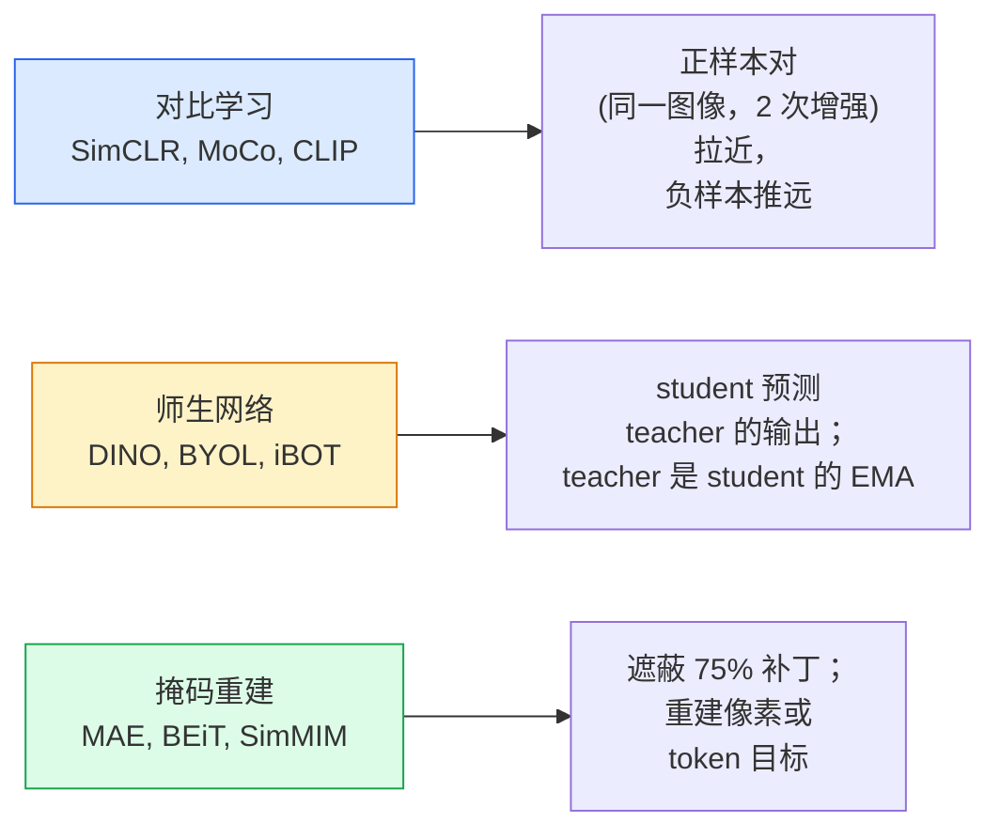

# 自监督视觉 — SimCLR、DINO、MAE

> 标签是监督式视觉的瓶颈。自监督预训练消除了它们：从 1 亿张无标签图像中学习视觉特征，然后在 1 万张有标签图像上微调。

**Type:** 学习 + 实践  
**Languages:** Python  
**Prerequisites:** Phase 4 Lesson 04 (图像分类), Phase 4 Lesson 14 (ViT)  
**Time:** ~75 分钟

## 学习目标

- 理清三大自监督家族 —— 对比学习（SimCLR）、师生蒸馏（DINO）、掩码重建（MAE）—— 并说明每种方法优化的目标
- 从头实现 InfoNCE 损失并解释为什么 batch=512 可行但 batch=32 失败
- 解释为什么 MAE 的 75% 遮蔽比例不是任意选择，以及它与 BERT 在文本上使用的 15% 的不同之处
- 使用 DINOv2 或 MAE 的 ImageNet 检查点进行线性探测和零样本检索

## 问题背景

监督式的 ImageNet 有 130 万张带标签的图像，标注费用估计约为 1000 万美元。医学和工业领域的数据集更小且标注更昂贵。每个视觉团队都会问：我们能否在廉价的无标签数据上进行预训练 —— 如 YouTube 帧、网络爬取、网络摄像头片段、卫星扫描 —— 然后在小规模有标签数据上微调？

自监督学习（SSL）就是答案。用 LAION 或 JFT 训练的现代自监督 ViT 在微调后能达到或超越监督式 ImageNet 的准确率，并且在下游任务（检测、分割、深度估计）上的迁移能力优于监督预训练。DINOv2（Meta，2023）和 MAE（Meta，2022）是当前用于可迁移视觉特征的生产级默认选择。

概念上的转变在于：预文本任务（pretext task）——模型训练时要完成的“假任务”——不必与下游任务相同。重要的是它能促使模型学习到有用的特征。预测灰度图像的颜色、旋转图像并让模型分类旋转角度、遮蔽补丁并重建它们——这些都曾奏效。可扩展的三种方法是：对比学习、师生蒸馏和掩码重建。

## 概念

### 三个家族



### 对比学习（SimCLR）

取一张图像，应用两次随机增强，得到两个视图。将两者输入同一个编码器加投影头。最小化一个损失，要求“这两个嵌入应该接近”，并且“该嵌入应该与批次中所有其他图像的嵌入保持距离”。

```
Loss for positive pair (z_i, z_j) among 2N views per batch:

   L_ij = -log( exp(sim(z_i, z_j) / tau) / sum_k in batch \ {i} exp(sim(z_i, z_k) / tau) )

sim = cosine similarity
tau = temperature (0.1 standard)
```

这是 InfoNCE 损失。它需要大量的负样本，因此批量大小很重要 —— SimCLR 需要 512-8192。MoCo 引入了一个动量队列（momentum queue）来缓存过去批次的条目，从而将负样本数量与当前批次大小解耦。

### 师生（DINO）

两个具有相同架构的网络：student 和 teacher。teacher 是 student 权重的指数移动平均（EMA）。两者都看到图像的增强视图。训练目标是让 student 的输出匹配 teacher 的输出 —— 不需要显式的负样本。

```
loss = CE( student_output(view_1),  teacher_output(view_2) )
     + CE( student_output(view_2),  teacher_output(view_1) )

teacher_weights = m * teacher_weights + (1 - m) * student_weights   (m ≈ 0.996)
```

为什么不会坍缩到“预测常数”：teacher 的输出会进行中心化（减去按维度的均值）并进行锐化（除以较小的温度）。中心化防止某一维度主导输出；锐化防止输出坍缩到均匀分布。

DINO 是 DINOv2 放大的基础，DINOv2 在 1.42 亿张精心挑选的图像上训练。得到的特征在零样本视觉检索和密集预测（dense prediction）上是当前的 SOTA。

### 掩码重建（MAE）

对 ViT 输入的补丁遮蔽 75%。仅将可见的 25% 补丁传入编码器。一个小的解码器接收编码器输出并在被遮蔽位置插入 mask token，训练去重建被遮蔽补丁的像素。

```
Encoder:  visible 25% of patches -> features
Decoder:  features + mask tokens at masked positions -> reconstructed pixels
Loss:     MSE between reconstructed and original pixels on masked patches only
```

使 MAE 工作的关键设计选择：

- **75% 遮蔽率** — 很高。迫使编码器学习语义特征；只遮蔽 25% 几乎是平凡的（邻域像素高度相关，卷积网络可以精确预测）。
- **不对称的编码器/解码器** — 大的 ViT 编码器只看到可见补丁；小的解码器（8 层、512 维）处理重建。比朴素的 BEiT 快约 3 倍的预训练速度。
- **像素空间重建目标** — 比 BEiT 的 token 化目标更简单，并且在 ViT 上效果更好。

预训练后丢弃解码器。编码器即为特征提取器。

### 为什么是 75% 而不是 15%

BERT 遮蔽 15% 的 token。MAE 遮蔽 75%。差别在于信息密度。

- 自然语言每个 token 的熵很高。预测 15% 的 token 仍很困难，因为每个被遮蔽位置有许多可能的补全。
- 图像补丁的信息熵较低 —— 未被遮蔽的邻域通常能几乎完全决定被遮蔽补丁的像素。要使预测需要语义理解，就必须激进地遮蔽。

75% 足够高，简单的空间外推无法解决任务；编码器必须表征图像内容。

### 线性探测评估（Linear-probe）

自监督预训练后，标准评估为 **线性探测（linear probe）**：冻结编码器，在其上训练单层线性分类器以预测 ImageNet 标签，报告 top-1 准确率。

- SimCLR ResNet-50：~71%（2020）
- DINO ViT-S/16：~77%（2021）
- MAE ViT-L/16：~76%（2022）
- DINOv2 ViT-g/14：~86%（2023）

线性探测是对特征质量的纯度量；微调通常会再提升 2-5 个点，但也会混入头部重训练的影响。

## 实战

### 步骤 1：双视图增强流水线

```python
import torch
import torchvision.transforms as T

two_view_train = lambda: T.Compose([
    T.RandomResizedCrop(96, scale=(0.2, 1.0)),
    T.RandomHorizontalFlip(),
    T.ColorJitter(0.4, 0.4, 0.4, 0.1),
    T.RandomGrayscale(p=0.2),
    T.ToTensor(),
])


class TwoViewDataset(torch.utils.data.Dataset):
    def __init__(self, base):
        self.base = base
        self.aug = two_view_train()

    def __len__(self):
        return len(self.base)

    def __getitem__(self, i):
        img, _ = self.base[i]
        v1 = self.aug(img)
        v2 = self.aug(img)
        return v1, v2
```

每个 __getitem__ 返回同一张图像的两个增强视图；不需要标签。

### 步骤 2：InfoNCE 损失

```python
import torch.nn.functional as F

def info_nce(z1, z2, tau=0.1):
    """
    z1, z2: (N, D) L2-normalised embeddings of paired views
    """
    N, D = z1.shape
    z = torch.cat([z1, z2], dim=0)  # (2N, D)
    sim = z @ z.T / tau              # (2N, 2N)

    mask = torch.eye(2 * N, dtype=torch.bool, device=z.device)
    sim = sim.masked_fill(mask, float("-inf"))

    targets = torch.cat([torch.arange(N, 2 * N), torch.arange(0, N)]).to(z.device)
    return F.cross_entropy(sim, targets)
```

请在调用前对嵌入进行 L2 归一化。`tau=0.1` 是 SimCLR 的默认值；更小的温度会使损失更“尖锐”，并需要更多的负样本。

（注：函数内的注释保留为英文格式的维度说明，代码本身保持不变以便直接运行。）

### 步骤 3：InfoNCE 的健检（Sanity check）

```python
z1 = F.normalize(torch.randn(16, 32), dim=-1)
z2 = z1.clone()
loss_same = info_nce(z1, z2, tau=0.1).item()
z2_random = F.normalize(torch.randn(16, 32), dim=-1)
loss_random = info_nce(z1, z2_random, tau=0.1).item()
print(f"InfoNCE with identical pairs:  {loss_same:.3f}")
print(f"InfoNCE with random pairs:     {loss_random:.3f}")
```

对于完全相同的配对，损失应较低（在较大批次和较冷温度下接近 0）。随机配对的损失应为 log(2N-1) ≈ log(31) ≈ 3.4（当批次为 16 对时）。

### 步骤 4：MAE 风格的遮蔽

```python
def random_mask_indices(num_patches, mask_ratio=0.75, seed=0):
    g = torch.Generator().manual_seed(seed)
    n_keep = int(num_patches * (1 - mask_ratio))
    perm = torch.randperm(num_patches, generator=g)
    visible = perm[:n_keep]
    masked = perm[n_keep:]
    return visible.sort().values, masked.sort().values


num_patches = 196
visible, masked = random_mask_indices(num_patches, mask_ratio=0.75)
print(f"visible: {len(visible)} / {num_patches}")
print(f"masked:  {len(masked)} / {num_patches}")
```

简单、快速，并且对给定 seed 是确定性的。真实的 MAE 实现会对批次进行向量化处理并为每个样本维护单独的遮蔽。

## 使用预训练模型

在 2026 年，DINOv2 是生产级标准：

```python
import torch
from transformers import AutoImageProcessor, AutoModel

processor = AutoImageProcessor.from_pretrained("facebook/dinov2-base")
model = AutoModel.from_pretrained("facebook/dinov2-base")
model.eval()

# Per-image embeddings for zero-shot retrieval
with torch.no_grad():
    inputs = processor(images=[pil_image], return_tensors="pt")
    outputs = model(**inputs)
    embedding = outputs.last_hidden_state[:, 0]  # CLS token
```

得到的 768 维嵌入是现代图像检索、密集对应和零样本迁移管线的基石。微调下游任务通常只需要在其上加一个线性头即可。

对于图像-文本嵌入，SigLIP 或 OpenCLIP 是相应的选择；对于 MAE 风格的微调，`timm` 仓库提供了各种 MAE 检查点。

## 上线产物（Ship It）

本课生成：

- `outputs/prompt-ssl-pretraining-picker.md` — 一个提示词，用于根据数据集大小、计算资源和下游任务来选择 SimCLR / MAE / DINOv2。
- `outputs/skill-linear-probe-runner.md` — 一个 skill，用于为任何冻结的编码器 + 有标签数据集编写线性探测评估脚本。

## 练习

1. **（简单）** 验证对于对齐良好的嵌入，降低温度会降低 InfoNCE 损失；对于随机嵌入，降低温度会增加损失。绘制 `tau in [0.05, 0.1, 0.2, 0.5]` 与损失的关系图。
2. **（中等）** 实现一个 DINO 风格的中心缓冲区（centre buffer）。证明如果不做中心化，student 会在几个 epoch 内坍缩成常向量。
3. **（困难）** 使用 Lesson 10 的 TinyUNet 作为骨干，在 CIFAR-100 上训练 MAE。在 10、50、200 个 epoch 时报告线性探测准确率。证明 MAE 预训练的线性探测在同一 1000 张图像子集上优于从头开始的监督线性探测。

## 术语关键释义

| Term | What people say | What it actually means |
|------|----------------|----------------------|
| Self-supervised | "Label-free" | 产生有用表示的无标签数据上的预文本任务 |
| Pretext task | "The fake task" | SSL 期间使用的目标（重建补丁、匹配视图等）；预训练后丢弃 |
| Linear probe | "Frozen encoder + linear head" | SSL 的标准评估：仅在冻结特征上训练线性分类器 |
| InfoNCE | "Contrastive loss" | 基于余弦相似度的 softmax；正样本对为目标类，其他均为负样本 |
| EMA teacher | "Moving-average teacher" | teacher 的权重是 student 权重的指数移动平均；BYOL、MoCo、DINO 使用 |
| Mask ratio | "% of patches hidden" | MAE 中被遮蔽的补丁比例；视觉用 75%，文本用 15% |
| Representation collapse | "Constant output" | SSL 失败，编码器对所有输入输出相同向量；通过中心化、锐化或负样本防止 |
| DINOv2 | "Production SSL backbone" | Meta 在 2023 年的自监督 ViT；到 2026 年为通用视觉特征的最强基线 |

## 相关阅读

- [SimCLR (Chen et al., 2020)](https://arxiv.org/abs/2002.05709) — 对比学习参考
- [DINO (Caron et al., 2021)](https://arxiv.org/abs/2104.14294) — 师生动量、中心化与锐化
- [MAE (He et al., 2022)](https://arxiv.org/abs/2111.06377) — ViT 的掩码自编码器预训练
- [DINOv2 (Oquab et al., 2023)](https://arxiv.org/abs/2304.07193) — 将自监督 ViT 扩展到生产特征的工作