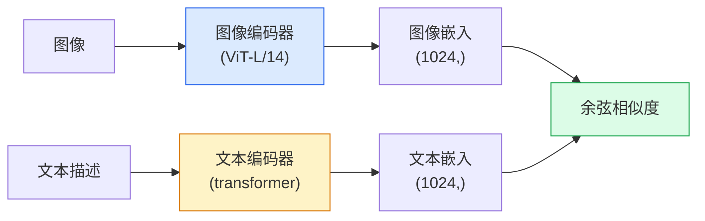

# Open-Vocabulary Vision — CLIP

> 训练一个图像编码器和一个文本编码器，使匹配的（图像，标题）对落在共享空间的相同点上。这就是全部技巧。

**Type:** 构建 + 使用  
**Languages:** Python  
**Prerequisites:** Phase 4 Lesson 14（ViT）、Phase 4 Lesson 17（自监督）  
**Time:** ~45 分钟

## 学习目标

- 解释 CLIP 的双塔架构和对比训练目标  
- 使用预训练的 CLIP（或 SigLIP）进行零样本分类，无需任何任务特定的训练  
- 从头实现零样本分类：编码类别提示词、计算余弦相似度、取 argmax  
- 区分 CLIP、SigLIP、OpenCLIP 与 LLaVA/LLaMA-vision 模型 —— 以及它们在 2026 年的各自用途

## 问题背景

传统分类器是封闭词表的：一个 1000 类的 ImageNet 模型只能预测这 1000 个标签。每添加一个新类别都需要标注数据并重新训练分类头。

CLIP（Radford 等，OpenAI 2021）展示了在互联网上抓取的 4 亿（图像，标题）对上训练可以得到一个模型，该模型在推理时可以针对任意用自然语言描述的类别进行分类。你通过写一句话就能给它一个新类别。

这种能力 —— 零样本迁移 —— 是为什么每个现代视觉系统都以 CLIP 系列检查点为起点。检测（Grounding DINO、OWL-ViT）、分割（CLIPSeg、SAM）、检索、内容审查、VLMs、以及文本到图像生成都构建在 CLIP 风格的联合嵌入之上。

## 概念

### 双塔（Two towers）



两个编码器的末端都有一个线性投影到相同的嵌入维度（CLIP-B/32 为 512，CLIP-L/14 为 1024）。对向量做 L2 归一化并计算余弦相似度。

### 训练目标

给定一个批次 N 个（图像，标题）对，构建一个 N×N 的相似度矩阵。训练两个编码器使对角线（匹配对）具有高相似度，非对角线（不匹配）具有低相似度。

```
sim_matrix = image_embeddings @ text_embeddings.T / tau

loss_i2t = cross_entropy(sim_matrix,       targets=arange(N))
loss_t2i = cross_entropy(sim_matrix.T,     targets=arange(N))
loss = (loss_i2t + loss_t2i) / 2
```

之所以是对称的，是因为既要支持图像到文本的检索，也要支持文本到图像的检索。`tau`（温度）通常作为一个可学习的标量参数，初始化为 0.07 的对数（或其倒数的对数）。

### SigLIP：更好的损失

SigLIP（Zhai 等，2023）将 softmax 换成了逐对的 sigmoid：

```
loss = mean over pairs of log(1 + exp(-y_ij * sim_ij))
y_ij = +1 if matching, -1 otherwise
```

逐对损失消除了 CLIP 依赖的批内归一化。SigLIP 在小批量情况下训练更好，在相同数据下能匹配或超过 CLIP。

### 零样本分类

给定一个训练好的 CLIP：

1. 对于每个类别，构造一个提示模板： "a photo of a {class}"。  
2. 用文本编码器编码所有类别提示 -> `T` 形状为 (C, d)。  
3. 编码测试图像 -> `I` 形状为 (1, d)。  
4. 相似度 = `I @ T.T`，形状为 (1, C)。  
5. Argmax -> 预测类别。

提示词工程很重要。OpenAI 发布了 80 个 ImageNet 的提示模板（"a photo of a {}", "a blurry photo of a {}", "a sketch of a {}", …）。对每个类别对所有模板的嵌入取平均，可以额外提升 1–3% 的 top-1 准确率。

### 2026 年 CLIP 风格模型的常见用途

- 零样本分类 — 直接使用。  
- 图像检索 — 所有图像预先编码一次，推理时对查询进行编码。  
- 文本条件检测 — Grounding DINO、OWL-ViT 将 CLIP 文本塔包装到检测器中。  
- 文本条件分割 — CLIPSeg；SAM 通过 CLIP 接收文本提示输入。  
- 视觉语言模型（VLMs） — LLaVA、Qwen-VL、InternVL 将 CLIP 系列的视觉编码器接入 LLM。  
- 文本到图像生成 — Stable Diffusion、DALL-E 3 使用 CLIP 文本嵌入作为条件。

一旦有了共享的嵌入空间，每个视觉+语言任务都变成了距离计算。

## 实现

### 第 1 步：一个极小的双塔模型

真实的 CLIP 是 ViT + transformer。为本课演示起见，塔端用在预提取特征上的小 MLP，这样在 CPU 上也能看到训练信号。

```python
import torch
import torch.nn as nn
import torch.nn.functional as F


class TwoTower(nn.Module):
    def __init__(self, img_in=128, txt_in=64, emb=64):
        super().__init__()
        self.image_proj = nn.Sequential(nn.Linear(img_in, 128), nn.ReLU(), nn.Linear(128, emb))
        self.text_proj = nn.Sequential(nn.Linear(txt_in, 128), nn.ReLU(), nn.Linear(128, emb))
        self.logit_scale = nn.Parameter(torch.ones([]) * 2.6592)  # ln(1/0.07)（初始温度）
 
    def forward(self, img_feats, txt_feats):
        i = F.normalize(self.image_proj(img_feats), dim=-1)
        t = F.normalize(self.text_proj(txt_feats), dim=-1)
        return i, t, self.logit_scale.exp()
```

两个投影头，输出相同维度，学习的温度。形状与真实 CLIP API 相同。

### 第 2 步：对比损失

```python
def clip_loss(image_emb, text_emb, logit_scale):
    N = image_emb.size(0)
    sim = logit_scale * image_emb @ text_emb.T
    targets = torch.arange(N, device=sim.device)
    l_i = F.cross_entropy(sim, targets)
    l_t = F.cross_entropy(sim.T, targets)
    return (l_i + l_t) / 2
```

对称损失。更高的 logit_scale = 更尖锐的 softmax = 更大的置信度，但也有不稳定的风险。

### 第 3 步：零样本分类器

```python
@torch.no_grad()
def zero_shot_classify(model, image_feats, class_text_feats, class_names):
    """
    image_feats:      (N, img_in)
    class_text_feats: (C, txt_in)   每个类的一个平均文本嵌入
    """
    i = F.normalize(model.image_proj(image_feats), dim=-1)
    t = F.normalize(model.text_proj(class_text_feats), dim=-1)
    sim = i @ t.T
    pred = sim.argmax(dim=-1)
    return [class_names[p] for p in pred.tolist()]
```

每一步只需一行。这就是在生产 CLIP 检查点上使用的完整零样本流程。

### 第 4 步：健全性检查（Sanity check）

```python
torch.manual_seed(0)
model = TwoTower()

img = torch.randn(8, 128)
txt = torch.randn(8, 64)
i, t, scale = model(img, txt)
loss = clip_loss(i, t, scale)
print(f"batch size: {i.size(0)}   loss: {loss.item():.3f}")
```

对于随机初始化的模型，损失应接近 `log(N) = log(8) = 2.08` —— 在尚未学习到任何结构时对称交叉熵的目标值。

## 使用预训练模型

到 2026 年，OpenCLIP 是社区默认选择：

```python
import open_clip
import torch
from PIL import Image

model, _, preprocess = open_clip.create_model_and_transforms("ViT-B-32", pretrained="laion2b_s34b_b79k")
tokenizer = open_clip.get_tokenizer("ViT-B-32")

image = preprocess(Image.open("dog.jpg")).unsqueeze(0)
text = tokenizer(["a photo of a dog", "a photo of a cat", "a photo of a car"])

with torch.no_grad():
    image_features = model.encode_image(image)
    text_features = model.encode_text(text)
    image_features = image_features / image_features.norm(dim=-1, keepdim=True)
    text_features = text_features / text_features.norm(dim=-1, keepdim=True)
    probs = (100.0 * image_features @ text_features.T).softmax(dim=-1)

print(probs)
```

SigLIP 更新，在小规模下训练表现更好，是新工作中的优选：`google/siglip-base-patch16-224`。Hugging Face 同步提供两者。

## 部署产物

本课将产出：

- `outputs/prompt-zero-shot-class-picker.md` — 一个提示，用于根据类别列表和领域为零样本 CLIP 设计类别模板。  
- `outputs/skill-image-text-retriever.md` — 一个技能，使用任意 CLIP 检查点构建图像嵌入索引，支持按文本和按图像查询。

## 练习

1. **（简单）** 使用预训练的 OpenCLIP ViT-B/32，在 CIFAR-10 上使用 80 模板集合进行零样本分类。报告 top-1 准确率；应在大约 85–90% 左右。  
2. **（中等）** 比较单模板（"a photo of a {}"）与 80 模板平均嵌入在同一 CIFAR-10 任务上的表现。量化差距并解释模板为何有帮助。  
3. **（困难）** 构建一个零样本图像检索索引：用 CLIP 嵌入 1,000 张图像，构建 FAISS 索引，用自然语言描述进行查询。对你手工编写的 20 个查询报告检索 recall@5。

## 术语表

| 术语 | 大家怎么说 | 实际含义 |
|------|----------------|----------------------|
| 双塔 / 双编码器 | "Dual encoder" | 独立的图像和文本编码器，结尾有共享维度的投影头 |
| 零样本 | "No task-specific training" | 在推理时对仅由文本描述的类别进行分类；不使用任何标签进行任务特定训练 |
| 温度 / logit_scale | "tau" | 在 softmax 前缩放相似度矩阵的可学习标量 |
| 提示模板 | "A photo of a {}" | 围绕类别名的自然语言包装；对多个模板求平均可以提升零样本准确率 |
| CLIP | "Image+text model" | 2021 年 OpenAI 的图像+文本模型；在 2026 年成为该领域的通用术语 |
| SigLIP | "Sigmoid CLIP" | 将 softmax 替换为逐对 sigmoid；在小批量下训练效果更好 |
| OpenCLIP | "Open reproduction" | 基于 LAION 训练的社区 CLIP 变体；开源生产管线的默认选择 |
| 视觉语言模型（VLM） | "Vision-language model" | 一个 CLIP 系列的视觉编码器加上 LLM，用于回答关于图像的问题 |

## 延伸阅读

- [CLIP: Learning Transferable Visual Models from Natural Language Supervision (Radford et al., 2021)](https://arxiv.org/abs/2103.00020)  
- [SigLIP: Sigmoid Loss for Language-Image Pre-Training (Zhai et al., 2023)](https://arxiv.org/abs/2303.15343)  
- [OpenCLIP](https://github.com/mlfoundations/open_clip) — 社区代码库  
- [DINOv2 vs CLIP vs MAE: a features comparison](https://huggingface.co/blog/dinov2) — Hugging Face 的比较指南与并列用例