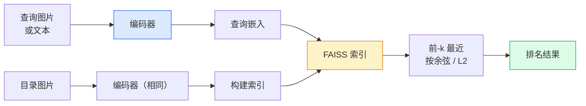

# 图像检索与度量学习

> 检索系统通过嵌入空间中的距离对候选项排序。度量学习的任务是塑造该空间，使距离反映你想要的相似性。

**Type:** 构建  
**Languages:** Python  
**Prerequisites:** 第4阶段 第14课 (ViT), 第4阶段 第18课 (CLIP)  
**Time:** ~45 分钟

## 学习目标

- 解释三元组（triplet）、对比（contrastive）和基于代理（proxy-based）的度量学习损失，并为给定数据集选择合适的方法
- 正确实现 L2 归一化和余弦相似度，并审计“相同项”和“相同类别”检索之间的差异
- 构建 FAISS 索引，按文本或图像查询，并对保留的查询集报告 recall@K
- 使用 DINOv2、CLIP 和 SigLIP 作为现成的嵌入骨干，并知道在什么情况下各自表现最好

## 问题

在生产视觉系统中，检索无处不在：重复检测、反向图片搜索、视觉检索（“查找相似商品”）、人脸重识别、监控下的人体重识别、电子商务的实例级匹配。产品问题始终相同：“给定这张查询图，给我的目录排序。”

两个设计决策决定了整个系统。嵌入——哪个模型生成向量；索引——如何在大规模上找到最近邻。到 2026 年这两者都是商品化的（嵌入使用 DINOv2，索引使用 FAISS），这提高了门槛：棘手的部分是定义“对你的应用来说什么算相似”，然后塑造嵌入空间使距离与之匹配。

这就是度量学习的作用。它是小而高杠杆的学科。

## 概念

### 检索概览



### 四大类损失

| Loss | Requires | Pros | Cons |
|------|----------|------|------|
| **Contrastive** | (anchor, positive) + negatives | 简单，适用于任何对标签 | 若没有大量负样本，收敛慢 |
| **Triplet** | (anchor, positive, negative) | 直观；可直接控制 margin | 硬三元组挖掘成本高 |
| **NT-Xent / InfoNCE** | 对 + 批内挖掘负样本 | 可扩展到大批量 | 需要大批量或动量队列 |
| **Proxy-based (ProxyNCA)** | 仅需类别标签 | 快速、稳定，无需挖掘 | 在小数据集上可能过拟合到代理上 |

对于大多数生产用例，先使用预训练骨干；只有当现成嵌入在你的测试集上表现不佳时，才加入度量学习微调。

### 三元组损失（形式化）

```
L = max(0, ||f(a) - f(p)||^2 - ||f(a) - f(n)||^2 + margin)
```

将锚点 a 拉近正样本 p，推远负样本 n，使用 margin 保证间隔。三图结构可推广到任意相似性排序。

挖掘很重要：简单三元组（n 已经远离 a）贡献为零；只有困难三元组才会教会网络。半困难挖掘（n 比 p 远但在 margin 内）是 2016 年 FaceNet 的做法，至今仍占主导。

### 余弦相似度 vs L2

两种度量，两种约定：

- **余弦**：向量之间的角度。需要对嵌入进行 L2 归一化。
- **L2**：欧氏距离。对原始或归一化嵌入都适用，但通常配合 L2 归一化 + 平方 L2 使用。

对于现代网络，两者等价：当 ||a|| = ||b|| = 1 时，`||a - b||^2 = 2 - 2 cos(a, b)`。选择与嵌入训练相匹配的约定；混用会悄悄改变“最近”的含义。

### Recall@K

标准检索指标：

```
recall@K = 在前 K 个结果中至少有一个正确匹配的查询比例
```

并列出 recall@1、@5、@10。若 recall@10 > 0.95 而 recall@1 < 0.5，说明嵌入空间结构正确但排序噪声较大——尝试更长时间的微调或加入重排序步骤。

对于重复检测，precision@K 更重要，因为每个误报都是用户可见的错误。对于视觉检索，recall@K 是主要信号。

### FAISS 一句话概览

Facebook AI Similarity Search。事实上的最近邻搜索库。三种索引选择：

- `IndexFlatIP` / `IndexFlatL2` — 纯暴力、精确、无需训练。适用于约 1M 向量以内。
- `IndexIVFFlat` — 划分为 K 个簇，只搜索最接近的若干簇。近似、快速、需要训练数据。
- `IndexHNSW` — 基于图，查询量大时最快，但索引体积较大。

对于 10 万向量，你很可能使用基于余弦的 `IndexFlatIP`。对于 1000 万向量使用 `IndexIVFFlat`。对于 1 亿以上结合乘积量化（`IndexIVFPQ`）。

### 实例级 vs 类别级检索

两种完全不同的问题但同名：

- **类别级（Category-level）** — “在我的目录中找到猫”。类别条件的相似性；现成的 CLIP / DINOv2 嵌入表现良好。
- **实例级（Instance-level）** — “找到*这件确切的商品*在我的目录里”。需要细粒度区分同类中视觉极为相似的对象；现成嵌入通常表现不佳；度量学习微调很重要。

在选模型之前，务必先明确你要解决的是哪一种问题。

## 实现

### 步骤 1：三元组损失

```python
import torch
import torch.nn.functional as F

def triplet_loss(anchor, positive, negative, margin=0.2):
    d_ap = F.pairwise_distance(anchor, positive, p=2)
    d_an = F.pairwise_distance(anchor, negative, p=2)
    return F.relu(d_ap - d_an + margin).mean()
```

一行实现。对 L2 归一化或原始嵌入都适用。

### 步骤 2：半困难挖掘

给定一个批次的嵌入和标签，为每个锚点找到最困难的半困难负样本。

```python
def semi_hard_negatives(emb, labels, margin=0.2):
    dist = torch.cdist(emb, emb)
    same_class = labels[:, None] == labels[None, :]
    diff_class = ~same_class
    N = emb.size(0)

    positives = dist.clone()
    positives[~same_class] = float("-inf")
    positives.fill_diagonal_(float("-inf"))
    pos_idx = positives.argmax(dim=1)

    semi_hard = dist.clone()
    semi_hard[same_class] = float("inf")
    d_ap = dist[torch.arange(N), pos_idx].unsqueeze(1)
    semi_hard[dist <= d_ap] = float("inf")
    neg_idx = semi_hard.argmin(dim=1)

    fallback_mask = semi_hard[torch.arange(N), neg_idx] == float("inf")
    if fallback_mask.any():
        hardest = dist.clone()
        hardest[same_class] = float("inf")
        neg_idx = torch.where(fallback_mask, hardest.argmin(dim=1), neg_idx)
    return pos_idx, neg_idx
```

每个锚点得到类内最困难的正样本索引以及一个比正样本更远但在 margin 内的半困难负样本索引。

### 步骤 3：Recall@K

```python
def recall_at_k(query_emb, gallery_emb, query_labels, gallery_labels, k=1):
    sim = query_emb @ gallery_emb.T
    _, top_k = sim.topk(k, dim=-1)
    matches = (gallery_labels[top_k] == query_labels[:, None]).any(dim=-1)
    return matches.float().mean().item()
```

在 L2 归一化的嵌入上，按内积取前 k 等价于按余弦。报告至少有一个正确邻居的查询比例的平均值。

### 步骤 4：整合

```python
import torch
import torch.nn as nn
from torch.optim import Adam

class Encoder(nn.Module):
    def __init__(self, in_dim=128, emb_dim=64):
        super().__init__()
        self.net = nn.Sequential(
            nn.Linear(in_dim, 128), nn.ReLU(),
            nn.Linear(128, emb_dim),
        )

    def forward(self, x):
        return F.normalize(self.net(x), dim=-1)

torch.manual_seed(0)
num_classes = 6
protos = F.normalize(torch.randn(num_classes, 128), dim=-1)

def sample_batch(bs=32):
    labels = torch.randint(0, num_classes, (bs,))
    x = protos[labels] + 0.15 * torch.randn(bs, 128)
    return x, labels

enc = Encoder()
opt = Adam(enc.parameters(), lr=3e-3)

for step in range(200):
    x, y = sample_batch(32)
    emb = enc(x)
    pos_idx, neg_idx = semi_hard_negatives(emb, y)
    loss = triplet_loss(emb, emb[pos_idx], emb[neg_idx])
    opt.zero_grad(); loss.backward(); opt.step()
```

经过几百步训练后，嵌入会形成每个类别一个簇的结构。

## 使用

2026 年的生产栈：

- **DINOv2 + FAISS** — 通用视觉检索，开箱即用。
- **CLIP + FAISS** — 当查询为文本时。
- **Fine-tuned DINOv2 + FAISS** — 实例级检索、人脸/服装重识别、电子商务场景。
- **Milvus / Weaviate / Qdrant** — 基于 FAISS 或 HNSW 的托管向量数据库封装。

对于 SOTA 的实例检索，常见配方是：DINOv2 骨干，添加嵌入头，在实例标注对上用三元组或 InfoNCE 损失微调，然后在 FAISS 中建索引。

## 交付物

本课产出：

- `outputs/prompt-retrieval-loss-picker.md` — 一个用于根据检索问题选择 triplet / InfoNCE / ProxyNCA 的提示词
- `outputs/skill-recall-at-k-runner.md` — 一个用于 recall@K 的干净评估框架，包含 train/val/gallery 划分和明确的数据契约

## 练习

1. **（简单）** 运行上述玩具示例。在训练前后用 PCA 绘制嵌入，观察六个簇的形成。
2. **（中等）** 添加 ProxyNCA 损失实现：为每个类别学习一个“代理”，在余弦相似度上做标准的交叉熵。与三元组损失在玩具数据上的收敛速度比较。
3. **（困难）** 取 1,000 张 ImageNet 验证图像，使用 HuggingFace 的 DINOv2 获取嵌入，构建一个 FAISS flat 索引，并分别对相同图像作为查询（应为 1.0）以及对保留划分使用 ImageNet 标签作为真值，报告 recall@{1, 5, 10}。

## 术语要点

| 术语 | 常说法 | 实际含义 |
|------|----------------|----------------------|
| 度量学习（Metric learning） | “塑造空间” | 训练编码器，使其输出空间中的距离反映目标相似性 |
| 三元组损失（Triplet loss） | “拉与推” | L = max(0, d(a, p) - d(a, n) + margin)；度量学习的经典损失 |
| 半困难挖掘（Semi-hard mining） | “有用的负样本” | 负样本比正样本更远但在 margin 内；实证上最具信息量 |
| 基于代理的损失（Proxy-based loss） | “类别原型” | 每类学习一个代理；基于与代理的相似度做交叉熵；无需样本对挖掘 |
| Recall@K | “Top-K 命中率” | 在前 K 个结果中至少有一个正确结果的查询比例 |
| 实例检索（Instance retrieval） | “找到这件确切的东西” | 细粒度匹配；现成特征通常表现不足 |
| FAISS | “最近邻库” | Facebook 的最近邻库；支持精确与近似索引 |
| HNSW | “图索引” | Hierarchical Navigable Small World；快速的近似最近邻，内存开销小 |

## 延伸阅读

- [FaceNet: A Unified Embedding for Face Recognition (Schroff et al., 2015)](https://arxiv.org/abs/1503.03832) — 三元组损失 / 半困难挖掘论文  
- [In Defense of the Triplet Loss for Person Re-Identification (Hermans et al., 2017)](https://arxiv.org/abs/1703.07737) — 三元组微调的实用指南  
- [FAISS documentation](https://github.com/facebookresearch/faiss/wiki) — 每种索引及其权衡  
- [SMoT: Metric Learning Taxonomy (Kim et al., 2021)](https://arxiv.org/abs/2010.06927) — 现代损失及其连接的综述