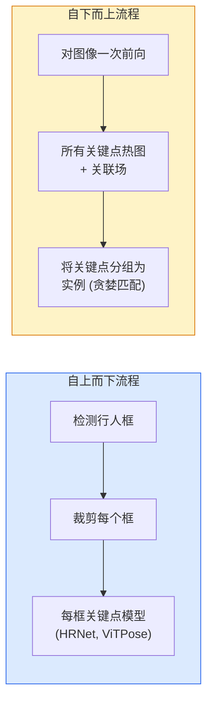

# 关键点检测与姿态估计

> 姿态是一个有序关键点的集合。关键点检测器是一个热图回归器。其他都是记录工作。

**Type:** 构建
**Languages:** Python
**Prerequisites:** 第4阶段 第06课（检测）、第4阶段 第07课（U-Net）
**Time:** ~45 分钟

## 学习目标

- 区分自上而下（top-down）和自下而上（bottom-up）姿态估计，并说明各自适用的场景
- 使用每个关键点对应的高斯目标回归 K 个热图，并在推理时提取关键点坐标
- 解释 Part Affinity Fields (PAFs) 的原理以及自下而上管线如何将关键点关联为实例
- 在生产环境中使用 MediaPipe Pose 或 MMPose 进行关键点估计，并理解它们的输出格式

## 问题概述

关键点任务有许多不同的名称：人体姿态（17 个关节）、人脸关键点（68 或 478 点）、手部（21 点）、动物姿态、机器人物体姿态、医学解剖标志点。它们都有相同的结构：在物体上检测 K 个离散点并输出它们的 (x, y) 坐标。

姿态估计是动作捕捉、健身应用、体育分析、手势控制、动画、AR 试穿和机器人抓取的基础。2D 问题已经非常成熟；从单摄像头估计世界坐标系下的 3D 姿态仍是当前的研究前沿。

工程问题是规模。单张图像、单人姿态是一个约 20ms 的问题。人群中以 30 fps 处理多人的姿态是另一个需要不同架构的问题。

## 概念

### 自上而下 vs 自下而上



- **Top-down（自上而下）** — 先检测人物框，然后对每个 crop 运行每人关键点模型。精度最高；计算量随人数线性增长。
- **Bottom-up（自下而上）** — 单次前向预测所有关键点及关联场；随后进行分组。无论人群规模如何，计算时间近似恒定。

自上而下（HRNet、ViTPose）在精度上领先；自下而上（OpenPose、HigherHRNet）在拥挤场景下的吞吐率上占优。

### 热图回归

不是直接回归 `(x, y)`，而是为每个关键点预测一个 H x W 的热图，真实位置处以高斯斑点为目标。

```
target[k, y, x] = exp(-((x - cx_k)^2 + (y - cy_k)^2) / (2 sigma^2))
```

在推理时，每个热图的 argmax 即为预测的关键点位置。

为什么热图比直接回归效果好：网络的空间结构（卷积特征图）自然与空间输出对齐。高斯目标也提供了正则化——小的定位误差只会产生小的损失，而不会是零。

### 亚像素定位

Argmax 给出整数坐标。要获得亚像素精度，可以在 argmax 及其邻域上拟合抛物线进行细化，或使用常见的偏移估计 `(dx, dy) = 0.25 * (heatmap[y, x+1] - heatmap[y, x-1], ...)` 方向。

### Part Affinity Fields (PAFs)

OpenPose 用于自下而上关联的技巧。对于每一对相连关键点（例如左肩到左肘），预测一个 2 通道场，编码从一个点指向另一个点的单位向量。为了将某个肩膀与其肘部匹配，在连接候选点对的直线上对 PAF 进行积分；积分值最高的点对被匹配。

```
For each connection (limb):
  PAF channels: 2 (unit vector x, y)
  Line integral: sum over sample points of (PAF . line_direction)
  Higher integral = stronger match
```

优雅且可扩展到任意人数的场景，无需对每个人进行裁剪。

### COCO 关键点

标准的人体姿态数据集：每人 17 个关键点，常用指标包括 PCK（Percentage of Correct Keypoints）和 OKS（Object Keypoint Similarity）。OKS 是关键点版的 IoU，也是 COCO 报告的 mAP@OKS 指标。

### 2D vs 3D

- **2D 姿态** — 图像坐标；已具备生产级质量（MediaPipe、HRNet、ViTPose）。
- **3D 姿态** — 世界/相机坐标；仍是活跃的研究方向。常见方法：
  - 使用小型 MLP 将 2D 预测提升到 3D（如 VideoPose3D）。
  - 从图像直接回归 3D（如 PyMAF、MHFormer）。
  - 多视角设置（如 CMU Panoptic）用于获取地面实况标注。

## 实作

### 第 1 步：高斯热图目标

```python
import numpy as np
import torch

def gaussian_heatmap(size, cx, cy, sigma=2.0):
    yy, xx = np.meshgrid(np.arange(size), np.arange(size), indexing="ij")
    return np.exp(-((xx - cx) ** 2 + (yy - cy) ** 2) / (2 * sigma ** 2)).astype(np.float32)

hm = gaussian_heatmap(64, 32, 32, sigma=2.0)
print(f"peak: {hm.max():.3f} at ({hm.argmax() % 64}, {hm.argmax() // 64})")
```

每个关键点的热图沿通道轴堆叠即可得到完整的目标张量。

### 第 2 步：微型关键点头

一个类似 U-Net 的模型，输出 K 个热图通道。

```python
import torch.nn as nn
import torch.nn.functional as F

class TinyKeypointNet(nn.Module):
    def __init__(self, num_keypoints=4, base=16):
        super().__init__()
        self.down1 = nn.Sequential(nn.Conv2d(3, base, 3, 2, 1), nn.ReLU(inplace=True))
        self.down2 = nn.Sequential(nn.Conv2d(base, base * 2, 3, 2, 1), nn.ReLU(inplace=True))
        self.mid = nn.Sequential(nn.Conv2d(base * 2, base * 2, 3, 1, 1), nn.ReLU(inplace=True))
        self.up1 = nn.ConvTranspose2d(base * 2, base, 2, 2)
        self.up2 = nn.ConvTranspose2d(base, num_keypoints, 2, 2)

    def forward(self, x):
        h1 = self.down1(x)
        h2 = self.down2(h1)
        h3 = self.mid(h2)
        u1 = self.up1(h3)
        return self.up2(u1)
```

输入 `(N, 3, H, W)`，输出 `(N, K, H, W)`。损失对每像素与高斯目标采用 MSE。

### 第 3 步：推理 — 提取关键点坐标

```python
def heatmap_to_coords(heatmaps):
    """
    heatmaps: (N, K, H, W)
    returns:  (N, K, 2) float coordinates in image pixels
    """
    N, K, H, W = heatmaps.shape
    hm = heatmaps.reshape(N, K, -1)
    idx = hm.argmax(dim=-1)
    ys = (idx // W).float()
    xs = (idx % W).float()
    return torch.stack([xs, ys], dim=-1)

coords = heatmap_to_coords(torch.randn(2, 4, 32, 32))
print(f"coords: {coords.shape}")  # (2, 4, 2)
```

推理仅一行。欲获得亚像素细化，在 argmax 周围插值或拟合邻域。

（注意：上面的 docstring 可翻译为中文以便阅读；代码本身保持不变。）

### 第 4 步：合成关键点数据集

简单示例：在白色画布上绘制四个点并学习预测它们。

```python
def make_synthetic_sample(size=64):
    img = np.ones((3, size, size), dtype=np.float32)
    rng = np.random.default_rng()
    kps = rng.integers(8, size - 8, size=(4, 2))
    for cx, cy in kps:
        img[:, cy - 2:cy + 2, cx - 2:cx + 2] = 0.0
    hms = np.stack([gaussian_heatmap(size, cx, cy) for cx, cy in kps])
    return img, hms, kps
```

对于一个很小的模型，这个任务在一分钟内就能学会。

### 第 5 步：训练

```python
model = TinyKeypointNet(num_keypoints=4)
opt = torch.optim.Adam(model.parameters(), lr=3e-3)

for step in range(200):
    batch = [make_synthetic_sample() for _ in range(16)]
    imgs = torch.from_numpy(np.stack([b[0] for b in batch]))
    hms = torch.from_numpy(np.stack([b[1] for b in batch]))
    pred = model(imgs)
    # 将 pred 上采样到与 hms 相同的全分辨率
    pred = F.interpolate(pred, size=hms.shape[-2:], mode="bilinear", align_corners=False)
    loss = F.mse_loss(pred, hms)
    opt.zero_grad(); loss.backward(); opt.step()
```

## 使用

- **MediaPipe Pose** — Google 的生产级姿态估计器；提供 WebGL 与移动端运行时，延迟低于 10ms。
- **MMPose**（OpenMMLab）— 完整的研究代码库；包含各种 SOTA 架构与预训练权重。
- **YOLOv8-pose** — 单次前向的最快实时多人体姿态方法之一。
- **transformers HumanDPT / PoseAnything** — 新兴的视觉-语言方法，用于开放词汇的姿态估计（任意对象、任意关键点集合）。

## 上线交付

本课产出：

- `outputs/prompt-pose-stack-picker.md` — 一个提示，用于在 MediaPipe / YOLOv8-pose / HRNet / ViTPose 中，根据延迟、人数密度和 2D vs 3D 需求选择合适方案。
- `outputs/skill-heatmap-to-coords.md` — 一个技能实现，编写用于生产环境的亚像素热图到坐标的常用例程。

## 练习

1. **（简单）** 在合成的 4 点数据集上训练微型关键点模型。报告 200 步训练后预测关键点与真实关键点的平均 L2 误差。
2. **（中等）** 添加亚像素细化：在 argmax 位置沿 x 与 y 的邻域拟合一维抛物线。报告与整数 argmax 相比的精度提升。
3. **（困难）** 构建一个包含两个人的合成数据集，每张图像显示两个 4 点模式的实例。训练一个包含 PAF 的自下而上管线以预测关键点的归属，并评估 OKS。

## 关键词

| Term | What people say | What it actually means |
|------|----------------|----------------------|
| Keypoint | "A landmark" | 物体上的特定有序点（关节、角点、特征） |
| Pose | "The skeleton" | 属于同一实例的一组有序关键点 |
| Top-down | "Detect then pose" | 两阶段管线：先做人检测器再做每框关键点模型；精度最高 |
| Bottom-up | "Pose first, group later" | 单次预测所有关键点并分组；对人群规模的计算时间近似恒定 |
| Heatmap | "Gaussian target" | 每个关键点的 H x W 张量，真实位置处有峰值；首选的回归目标 |
| PAF | "Part Affinity Field" | 编码肢体方向的 2 通道单位向量场；用于将关键点分组为实例 |
| OKS | "Keypoint IoU" | Object Keypoint Similarity；COCO 的关键点评测指标 |
| HRNet | "High-Resolution Net" | 主流的自上而下关键点架构；在整个网络中保持高分辨率特征 |

## 延伸阅读

- [OpenPose (Cao et al., 2017)](https://arxiv.org/abs/1812.08008) — 自下而上方法并使用 PAFs；仍是该方法最详尽的论文之一
- [HRNet (Sun et al., 2019)](https://arxiv.org/abs/1902.09212) — 自上而下的参考架构
- [ViTPose (Xu et al., 2022)](https://arxiv.org/abs/2204.12484) — 以 ViT 作为姿态主干；在许多基准上为当前 SOTA
- [MediaPipe Pose](https://developers.google.com/mediapipe/solutions/vision/pose_landmarker) — 生产级实时姿态；截至 2026 年为部署速度最快的方案之一