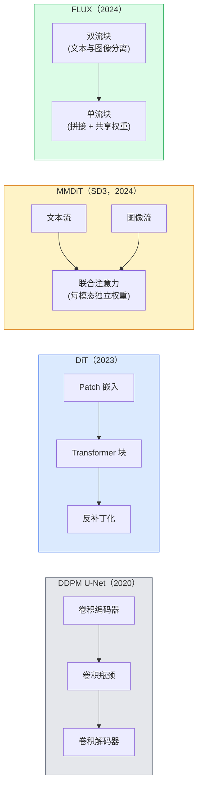

# Diffusion Transformers & Rectified Flow

> The U-Net is not the secret of diffusion. Replace it with a transformer, swap the noise schedule for a straight-line flow, and suddenly you have SD3, FLUX, and every 2026 text-to-image model.

**Type:** 学习 + 构建  
**Languages:** Python  
**Prerequisites:** Phase 4 Lesson 10（扩散 DDPM）, Phase 4 Lesson 14（ViT）, Phase 7 Lesson 02（自注意力）  
**Time:** ~75 分钟

## 学习目标

- 追溯从 U-Net DDPM（Lesson 10）到 Diffusion Transformer（DiT）、MMDiT（SD3）和单流 + 双流 DiT（FLUX）的演进
- 解释 rectified flow：为什么在噪声与数据之间使用直线轨迹能让模型以 20 步而非 1000 步进行采样
- 实现一个极小的 DiT 模块和一个 rectified-flow 训练循环，二者都在 100 行以内
- 通过架构、参数量与许可区分模型变体（SD3、FLUX.1-dev、FLUX.1-schnell、Z-Image、Qwen-Image）

## 问题陈述

Lesson 10 构建了一个以 U-Net 为去噪器的 DDPM。这个配方在 2020-2023 年占主导：U-Net + beta 调度 + 噪声预测损失。它催生了 Stable Diffusion 1.5、2.1 和 DALL·E 2。

到 2026 年的每一个最先进文本到图像模型都已超越它。Stable Diffusion 3、FLUX、SD4、Z-Image、Qwen-Image、昊元图像（Hunyuan-Image）——没有一个使用 U-Net。它们使用 Diffusion Transformers（DiT）。SD3 和 FLUX 还把 DDPM 的噪声调度替换为 rectified flow，将噪声到数据的路径拉直，从而实现 1–4 步的一致性或蒸馏变体推理。

这一转变重要，因为它是基于扩散的图像生成变得可控、提示词准确（SD3/SD4 解决了文本渲染问题）并满足生产速度的原因。理解 DiT + rectified flow 就是理解 2026 年的生成图像栈。

## 概念

### 从 U-Net 到 Transformer



- **DiT**（Peebles & Xie，2023）— 用类似 ViT 的 transformer 在潜空间补丁上替换 U-Net。采用通过自适应层归一化（AdaLN）进行条件控制。
- **MMDiT**（SD3，Esser 等，2024）— 两条流，文本与图像 token 使用各自权重，但共享联合注意力。
- **FLUX**（Black Forest Labs，2024）— 前 N 层像 SD3 一样为双流块，后续层通过拼接并共享权重成为单流块，以在更大深度下提高效率。
- **Z-Image**（2025）— 一个高效的单流 DiT，6B 参数，挑战“以规模为王”的思路。

### 用一句话理解 Rectified Flow

DDPM 将前向过程定义为一个噪声 SDE，其中 x_t 被逐步污染。学习到的反向过程是另一个 SDE，通常通过 1000 个小步来求解。

Rectified flow 定义了一个在干净数据与纯噪声之间的**直线插值**：

```
x_t = (1 - t) * x_0 + t * epsilon,     t in [0, 1]
```

训练网络去预测速度 v_theta(x_t, t) = epsilon - x_0 —— 即沿从干净数据到噪声的直线路径的前向方向（dx_t/dt）。采样时，你对该速度向后积分，从噪声朝数据方向步进。所得的 ODE 更接近直线，因此需要的积分步数大大减少。

SD3 将此称为 **Rectified Flow Matching**。FLUX、Z-Image 以及大多数 2026 年模型都使用相同的目标。典型推理为：20–30 步 Euler（确定性） vs 旧 DDPM 体系中的 50+ 步 DDIM。蒸馏 / turbo / schnell / LCM 变体可将步数降低到 1–4 步。

### AdaLN 条件化

DiT 使用 **自适应层归一化（AdaLN）** 对时间步和类/文本进行条件化：从条件向量预测 scale 与 shift，并在 LayerNorm 之后应用。这比 U-Net 中的 FiLM 样调制更简洁，也成为每个现代 DiT 的默认做法。

```
cond -> MLP -> (scale, shift, gate)
norm(x) * (1 + scale) + shift, 然后残差相加 * gate
```

### SD3 和 FLUX 中的文本编码器

- **SD3** 使用三路文本编码器：两个 CLIP 模型 + T5-XXL。将嵌入串联并作为文本条件输入图像流。
- **FLUX** 使用一个 CLIP-L + T5-XXL。
- **Qwen-Image / Z-Image** 变体使用与其基础大模型对齐的自研文本编码器。

文本编码器是 SD3/FLUX 比 SD1.5 更能理解提示词的重要原因之一。单独的 T5-XXL 就有 47 亿参数（4.7B）。

### 无分类器引导仍然适用

Rectified flow 改变的是采样器，而不是条件化机制。无分类器引导（训练时以 10% 概率丢弃文本条件，推理时混合有条件与无条件预测）在 rectified flow 中同样有效。大多数 2026 年模型使用的 guidance scale 在 3.5–5 之间 —— 比 SD1.5 的 7.5 更低，因为 rectified-flow 模型默认对提示词的遵从度更高。

### 一致性、Turbo、Schnell、LCM

四个名称描述同一个想法：把慢的多步模型蒸馏成快速的少步模型。

- **LCM（Latent Consistency Model）** — 训练一个学生模型能从任意中间 x_t 在一步内预测最终 x_0。
- **SDXL Turbo / FLUX schnell** — 使用对抗扩散蒸馏训练的 1–4 步模型。
- **SD Turbo** — OpenAI 风格的一致性模型，适配到潜空间扩散。

任何新模型的生产部署通常同时发布“全质量”检查点和“turbo / schnell” 变体。Schnell（德语的“快速”，Black Forest Labs 的命名）以 1–4 步运行，适合实时流水线。

### 2026 年的模型格局

| Model | 规模 | 架构 | 许可证 |
|-------|------|------|---------|
| Stable Diffusion 3 Medium | 2B | MMDiT | SAI Community |
| Stable Diffusion 3.5 Large | 8B | MMDiT | SAI Community |
| FLUX.1-dev | 12B | Double + Single Stream DiT | 非商业性（non-commercial） |
| FLUX.1-schnell | 12B | 同上，已蒸馏 | Apache 2.0 |
| FLUX.2 | — | FLUX.1 迭代 | 混合 |
| Z-Image | 6B | S3-DiT（可扩展单流） | 宽松许可 |
| Qwen-Image | ~20B | DiT + Qwen 文本塔 | Apache 2.0 |
| Hunyuan-Image-3.0 | ~80B | DiT | 研究用途 |
| SD4 Turbo | 3B | DiT + 蒸馏 | SAI 商用 |

FLUX.1-schnell 是 2026 年的开源默认。Z-Image 是效率领先者。FLUX.2 与 SD4 是当前质量上的顶尖选项。

### 为什么这个相位迁移很重要

DDPM + U-Net 能工作。但 DiT + rectified flow 做得更好、更快且更易于扩展。这一转变类似于 NLP 中从 RNN 到 Transformer 的迁移：两种架构都能解决相同问题，但 Transformer 能更好地扩展并最终占主导。到 2026 年，每一篇关于图像、视频或 3D 生成的论文几乎都使用 DiT 形态的去噪器，并通常采用 rectified flow 目标。U-Net DDPM 现在主要作为教学用途（见 Lesson 10）。

## 实战构建

### 第 1 步：带 AdaLN 的 DiT 模块

```python
import torch
import torch.nn as nn


class AdaLNZero(nn.Module):
    """
    带门控的自适应 LayerNorm。从条件向量预测 (scale, shift, gate)。
    初始化使整个模块起始为恒等映射（“零初始化”）。
    """

    def __init__(self, dim, cond_dim):
        super().__init__()
        self.norm = nn.LayerNorm(dim, elementwise_affine=False)
        self.mlp = nn.Linear(cond_dim, dim * 3)
        nn.init.zeros_(self.mlp.weight)
        nn.init.zeros_(self.mlp.bias)

    def forward(self, x, cond):
        scale, shift, gate = self.mlp(cond).chunk(3, dim=-1)
        h = self.norm(x) * (1 + scale.unsqueeze(1)) + shift.unsqueeze(1)
        return h, gate.unsqueeze(1)


class DiTBlock(nn.Module):
    def __init__(self, dim=192, heads=3, mlp_ratio=4, cond_dim=192):
        super().__init__()
        self.adaln1 = AdaLNZero(dim, cond_dim)
        self.attn = nn.MultiheadAttention(dim, heads, batch_first=True)
        self.adaln2 = AdaLNZero(dim, cond_dim)
        self.mlp = nn.Sequential(
            nn.Linear(dim, dim * mlp_ratio),
            nn.GELU(),
            nn.Linear(dim * mlp_ratio, dim),
        )

    def forward(self, x, cond):
        h, gate1 = self.adaln1(x, cond)
        a, _ = self.attn(h, h, h, need_weights=False)
        x = x + gate1 * a
        h, gate2 = self.adaln2(x, cond)
        x = x + gate2 * self.mlp(h)
        return x
```

`AdaLNZero` 因为它的 MLP 权重被初始化为零，所以起始时是恒等映射。训练会将模块从恒等状态小幅推动，这显著稳定了深度 transformer 扩散模型的训练过程。

### 第 2 步：一个迷你 DiT

```python
def timestep_embedding(t, dim):
    import math
    half = dim // 2
    freqs = torch.exp(-math.log(10000) * torch.arange(half, device=t.device) / half)
    args = t[:, None].float() * freqs[None]
    return torch.cat([args.sin(), args.cos()], dim=-1)


class TinyDiT(nn.Module):
    def __init__(self, image_size=16, patch_size=2, in_channels=3, dim=96, depth=4, heads=3):
        super().__init__()
        self.patch_size = patch_size
        self.num_patches = (image_size // patch_size) ** 2
        self.patch = nn.Conv2d(in_channels, dim, kernel_size=patch_size, stride=patch_size)
        self.pos = nn.Parameter(torch.zeros(1, self.num_patches, dim))
        self.time_mlp = nn.Sequential(
            nn.Linear(dim, dim * 2),
            nn.SiLU(),
            nn.Linear(dim * 2, dim),
        )
        self.blocks = nn.ModuleList([DiTBlock(dim, heads, cond_dim=dim) for _ in range(depth)])
        self.norm_out = nn.LayerNorm(dim, elementwise_affine=False)
        self.head = nn.Linear(dim, patch_size * patch_size * in_channels)

    def forward(self, x, t):
        n = x.size(0)
        x = self.patch(x)
        x = x.flatten(2).transpose(1, 2) + self.pos
        t_emb = self.time_mlp(timestep_embedding(t, self.pos.size(-1)))
        for blk in self.blocks:
            x = blk(x, t_emb)
        x = self.norm_out(x)
        x = self.head(x)
        return self._unpatchify(x, n)

    def _unpatchify(self, x, n):
        p = self.patch_size
        h = w = int(self.num_patches ** 0.5)
        x = x.view(n, h, w, p, p, -1).permute(0, 5, 1, 3, 2, 4).reshape(n, -1, h * p, w * p)
        return x
```

### 第 3 步：Rectified flow 训练

```python
import torch.nn.functional as F

def rectified_flow_train_step(model, x0, optimizer, device):
    model.train()
    x0 = x0.to(device)
    n = x0.size(0)
    t = torch.rand(n, device=device)
    epsilon = torch.randn_like(x0)
    x_t = (1 - t[:, None, None, None]) * x0 + t[:, None, None, None] * epsilon

    target_velocity = epsilon - x0
    pred_velocity = model(x_t, t)

    loss = F.mse_loss(pred_velocity, target_velocity)
    optimizer.zero_grad()
    loss.backward()
    optimizer.step()
    return loss.item()
```

与 DDPM 的噪声预测损失（Lesson 10）相比：结构相同，但目标不同。我们不是预测噪声 `epsilon`，而是预测沿直线插值从数据指向噪声的**速度** `epsilon - x_0`。

### 第 4 步：Euler 采样器

Rectified flow 是一个 ODE。Euler 方法是最简单的求解器，对于训练良好的 rectified-flow 模型，在 20+ 步时其准确度几乎与更高阶求解器相当。

```python
@torch.no_grad()
def rectified_flow_sample(model, shape, steps=20, device="cpu"):
    model.eval()
    x = torch.randn(shape, device=device)
    dt = 1.0 / steps
    t = torch.ones(shape[0], device=device)
    for _ in range(steps):
        v = model(x, t)
        x = x - dt * v
        t = t - dt
    return x
```

20 步。在训练好的模型上，这将产生与 1000 步 DDPM 可比的样本。

### 第 5 步：端到端冒烟测试

```python
import numpy as np

def synthetic_blobs(num=200, size=16, seed=0):
    rng = np.random.default_rng(seed)
    out = np.zeros((num, 3, size, size), dtype=np.float32)
    yy, xx = np.meshgrid(np.arange(size), np.arange(size), indexing="ij")
    for i in range(num):
        cx, cy = rng.uniform(4, size - 4, size=2)
        r = rng.uniform(2, 4)
        mask = (xx - cx) ** 2 + (yy - cy) ** 2 < r ** 2
        colour = rng.uniform(-1, 1, size=3)
        for c in range(3):
            out[i, c][mask] = colour[c]
    return torch.from_numpy(out)
```

在这个合成 blob 数据集上用 rectified flow 训练一个 `TinyDiT`。经过 500 步训练后，采样的输出应当看起来像淡淡的颜色斑块。

## 使用示例

对于使用 FLUX / SD3 / Z-Image 的真实图像生成，`diffusers` 提供了统一 API：

```python
from diffusers import FluxPipeline, StableDiffusion3Pipeline
import torch

pipe = FluxPipeline.from_pretrained(
    "black-forest-labs/FLUX.1-schnell",
    torch_dtype=torch.bfloat16,
).to("cuda")

out = pipe(
    prompt="a golden retriever surfing a tsunami, hyperrealistic, studio lighting",
    guidance_scale=0.0,           # schnell was trained without CFG
    num_inference_steps=4,
    max_sequence_length=256,
).images[0]
out.save("surf.png")
```

三行代码。使用 `FLUX.1-schnell` 四步即可。把模型 ID 换成 `black-forest-labs/FLUX.1-dev` 可在 20–30 步并配合 CFG 获取更高质量。

对于 SD3：

```python
pipe = StableDiffusion3Pipeline.from_pretrained(
    "stabilityai/stable-diffusion-3.5-large",
    torch_dtype=torch.bfloat16,
).to("cuda")
out = pipe(prompt, guidance_scale=3.5, num_inference_steps=28).images[0]
```

## 部署产出

本课产出包括：

- `outputs/prompt-dit-model-picker.md` — 根据质量、延迟与许可约束在 SD3、FLUX.1-dev、FLUX.1-schnell、Z-Image、SD4 Turbo 之间做出选择。
- `outputs/skill-rectified-flow-trainer.md` — 为带 AdaLN 的 DiT 和 Euler 采样撰写完整的 rectified flow 训练循环。

## 练习

1. **（简单）** 在上面的 synthetic blob 数据集上训练 TinyDiT 500 步。比较用 10、20、50 步 Euler 采样得到的样本。
2. **（中等）** 通过将学习到的类别嵌入与时间嵌入拼接来添加文本条件（10 种颜色类）。用类 0、5、9 采样并验证颜色是否匹配。
3. **（困难）** 计算 rectified-flow 与 DDPM 两个同规模网络在相同数据与相同训练步数下生成样本的 Fréchet 距离（FID 代理）。报告哪个更快收敛。

## 关键术语

| 术语 | 常说 | 实际含义 |
|------|------|---------|
| DiT | "Diffusion transformer" | 替代 U-Net 的扩散去噪 transformer；在补丁化的潜空间上运行 |
| AdaLN | "Adaptive layer norm" | 通过学习到的 scale、shift、gate 在 LayerNorm 后进行时间步/文本条件化；现代 DiT 的标准做法 |
| MMDiT | "Multi-modal DiT (SD3)" | 为文本与图像 token 使用独立权重流，但共享联合自注意力 |
| Single-stream / double-stream | "FLUX trick" | 前 N 层为双流（每模态独立权重），后续层为单流（拼接 + 共享权重）以提高效率 |
| Rectified flow | "Straight-line noise-to-data" | 数据与噪声之间的线性插值；网络预测速度；推理时需要更少的 ODE 步 |
| Velocity target | "epsilon - x_0" | rectified flow 中的回归目标；指向从干净数据到噪声的方向 |
| CFG guidance | "classifier-free guidance" | 混合有条件与无条件预测；rectified-flow 模型中仍然使用 |
| Schnell / turbo / LCM | "1-4 step distillation" | 从全质量模型蒸馏出的少步变体；用于生产实时推理 |

## 延伸阅读

- [Scalable Diffusion Models with Transformers (Peebles & Xie, 2023)](https://arxiv.org/abs/2212.09748) — DiT 论文  
- [Scaling Rectified Flow Transformers (Esser et al., SD3 paper)](https://arxiv.org/abs/2403.03206) — MMDiT 与大规模 rectified-flow  
- [FLUX.1 model card and technical report (Black Forest Labs)](https://huggingface.co/black-forest-labs/FLUX.1-dev) — 双流 + 单流 细节  
- [Z-Image: Efficient Image Generation Foundation Model (2025)](https://arxiv.org/html/2511.22699v1) — 6B 单流 DiT 的高效图像生成基础模型  
- [Elucidating the Design Space of Diffusion (Karras et al., 2022)](https://arxiv.org/abs/2206.00364) — 关于扩散设计权衡的参考性工作  
- [Latent Consistency Models (Luo et al., 2023)](https://arxiv.org/abs/2310.04378) — LCM-LoRA 如何实现 4 步推理