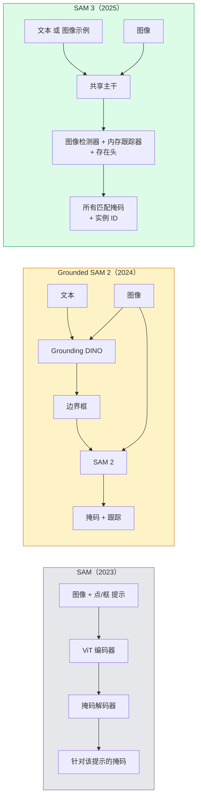

# SAM 3 & 开放词汇分割

> 给模型一个文本提示和一张图片，返回所有匹配对象的掩码。SAM 3 将其压缩为一次前向推理。

**Type:** 使用 + 构建  
**Languages:** Python  
**Prerequisites:** Phase 4 Lesson 07 (U-Net), Phase 4 Lesson 08 (Mask R-CNN), Phase 4 Lesson 18 (CLIP)  
**Time:** ~60 分钟

## 学习目标

- 区分 SAM（仅视觉提示）、Grounded SAM / SAM 2（检测器 + SAM）和 SAM 3（通过 Promptable Concept Segmentation 原生接受文本提示）
- 解释 SAM 3 架构：共享主干 + 图像检测器 + 基于内存的视频跟踪器 + presence head（存在头）+ 解耦的检测器-跟踪器设计
- 使用 Hugging Face `transformers` 的 SAM 3 集成进行文本提示的检测、分割和视频跟踪
- 根据延迟、概念复杂性和部署目标在 SAM 3、Grounded SAM 2、YOLO-World 和 SAM-MI 之间进行选择

## 问题背景

2023 年的 SAM 是仅视觉提示的模型：你点击一个点或画一个框，它返回一个掩码。对于“给我这张照片里的所有橙子”这种需求，你需要一个检测器（Grounding DINO）产生边框，然后用 SAM 对每个边框分割。Grounded SAM 将其变成了一个流水线，但它本质上是两个固定模型的级联，难免误差累积。

SAM 3（Meta，2025 年 11 月，ICLR 2026）将级联合并。它接受简短的名词短语或图像示例作为提示，并在一次前向推理中返回所有匹配掩码和实例 ID。这就是可提示概念分割（Promptable Concept Segmentation，PCS）。结合 2026 年 3 月的 Object Multiplex 更新（SAM 3.1），它能高效地在视频中跟踪同一概念的多个实例。

本课侧重于这种结构性转变。二维分割、检测和文本-图像对齐已合而为一。生产环境下的问题不再是“我应该串联哪个流水线”，而是“哪个可提示模型能端到端处理我的用例”。

## 概念

### 三代演进



### 可提示概念分割（Promptable Concept Segmentation）

“概念提示”是一个简短的名词短语（例如 "yellow school bus"、"striped red umbrella"、"hand holding a mug"）或一个图像示例。模型返回图像中每个匹配该概念的实例的分割掩码，以及每个匹配项的唯一实例 ID。

这与经典的视觉提示 SAM 有三点不同：

1. 无需对每个实例单独提示 —— 一个文本提示即可返回所有匹配项。
2. 开放词汇 —— 概念可以是任何可自然语言描述的事物。
3. 同时返回多个实例，而不是每个提示返回一个掩码。

### 关键架构组件

- **共享主干** — 单个 ViT 处理图像。检测头和基于内存的跟踪器都从该主干读取特征。
- **存在头（presence head）** — 预测概念是否存在于图像中。将“这个存在吗？”与“它在哪里？”解耦，减少对不存在概念的误报。
- **解耦的检测器-跟踪器** — 图像级检测与视频级跟踪设计为独立头部，互不干扰。
- **内存库（Memory bank）** — 在帧间存储每个实例的特征以支持视频跟踪（与 SAM 2 使用的机制相同）。

### 大规模训练

SAM 3 在由 AI + 人类复审迭代注释和修正的数据引擎生成的 **400 万个独特概念** 上训练。新的 **SA-CO 基准** 包含 27 万个独特概念，是以往基准的 50 倍。SAM 3 在 SA-CO 上达到人类表现的 75–80%，并在图像 + 视频 PCS 上使现有系统性能翻倍。

### SAM 3.1 Object Multiplex

2026 年 3 月更新：**Object Multiplex** 引入了一种共享内存机制，用于同时联合跟踪许多相同概念的实例。以前，跟踪 N 个实例意味着 N 个独立的内存库。Multiplex 将其合并为一个共享内存，并使用每实例查询。结果：在不牺牲精度的情况下显著加速多目标跟踪。

### 2026 年仍然需要 Grounded SAM 的情形

- 当你需要替换特定的开放词汇检测器（如 DINO-X、Florence-2）时。
- 当 SAM 3 的许可（受 HF 门控）成为阻碍时。
- 当你需要比 SAM 3 暴露的更多检测器阈值控制时。
- 用于对检测器组件的研究 / 消融实验。

模块化流水线仍有其价值。但对于大多数生产工作，SAM 3 更为简单直接。

### YOLO-World 与 SAM 3 的区别

- **YOLO-World** — 仅开放词汇检测器（无掩码）。实时。需要高帧率时优先使用（只需边框）。
- **SAM 3** — 完整的分割 + 跟踪。更慢但输出更丰富。

生产分工：YOLO-World 用于快速的仅检测流水线（机器人导航、快速仪表盘），SAM 3 用于需要掩码或跟踪的任何场景。

### SAM-MI 的效率改进

SAM-MI（2025–2026）解决了 SAM 解码器的瓶颈。关键思路：

- **稀疏点提示** — 使用少量精心选择的点代替密集提示；将解码器调用减少 96%。
- **浅层掩码聚合** — 将粗糙的掩码预测合并为更清晰的掩码。
- **解耦的掩码注入** — 解码器接收预先计算的掩码特征，而不是重新运行。

结果：在开放词汇基准上相比 Grounded-SAM 提升约 1.6× 的速度。

### 三种模型的一致输出格式

所有模型返回相同的一般结构（边界框 + 标签 + 分数 + 掩码 + ID），这很有帮助 —— 下游流水线不必根据运行的模型分支处理。

## 实现

### 第 1 步：提示构造

构建一个辅助函数，将用户句子转换为 SAM 3 概念提示列表。这是“用户输入”与“模型消费”之间的边界。

```python
def split_concepts(sentence):
    """
    多概念提示的启发式拆分器。
    返回短名词短语的列表。
    """
    for sep in [",", ";", "and", "or", "&"]:
        if sep in sentence:
            parts = [p.strip() for p in sentence.replace("and ", ",").split(",")]
            return [p for p in parts if p]
    return [sentence.strip()]

print(split_concepts("cats, dogs and balloons"))
```

SAM 3 每次前向只接受一个概念；对于多概念查询，请循环或批处理。

### 第 2 步：后处理辅助

将 SAM 3 的原始输出转换为与我们 Phase 4 Lesson 16 流水线契约一致的干净检测列表。

```python
from dataclasses import dataclass
from typing import List

@dataclass
class ConceptDetection:
    concept: str
    instance_id: int
    box: tuple          # (x1, y1, x2, y2)
    score: float
    mask_rle: str       # 运行长度编码（run-length encoded）


def rle_encode(binary_mask):
    flat = binary_mask.flatten().astype("uint8")
    runs = []
    prev, count = flat[0], 0
    for v in flat:
        if v == prev:
            count += 1
        else:
            runs.append((int(prev), count))
            prev, count = v, 1
    runs.append((int(prev), count))
    return ";".join(f"{v}x{c}" for v, c in runs)
```

RLE 在许多高分辨率掩码的情况下保持响应负载较小。相同格式可用于 SAM 2、SAM 3、Grounded SAM 2。

### 第 3 步：统一的开放词汇分割接口

将你拥有的后端（SAM 3、Grounded SAM 2、YOLO-World + SAM 2）封装在单一方法后面。下游代码在后端更换时无需修改。

```python
from abc import ABC, abstractmethod
import numpy as np

class OpenVocabSeg(ABC):
    @abstractmethod
    def detect(self, image: np.ndarray, concept: str) -> List[ConceptDetection]:
        ...


class StubOpenVocabSeg(OpenVocabSeg):
    """
    在未加载真实模型时用于流水线测试的确定性存根。
    """
    def detect(self, image, concept):
        h, w = image.shape[:2]
        return [
            ConceptDetection(
                concept=concept,
                instance_id=0,
                box=(w * 0.2, h * 0.3, w * 0.5, h * 0.8),
                score=0.89,
                mask_rle="0x100;1x50;0x200",
            ),
            ConceptDetection(
                concept=concept,
                instance_id=1,
                box=(w * 0.55, h * 0.25, w * 0.85, h * 0.75),
                score=0.74,
                mask_rle="0x80;1x40;0x220",
            ),
        ]
```

真实的 `SAM3OpenVocabSeg` 子类会封装 `transformers.Sam3Model` 和 `Sam3Processor`。

### 第 4 步：Hugging Face SAM 3 使用示例（参考）

对于实际模型，`transformers` 的集成示例：

```python
from transformers import Sam3Processor, Sam3Model
import torch

processor = Sam3Processor.from_pretrained("facebook/sam3")
model = Sam3Model.from_pretrained("facebook/sam3").eval()

inputs = processor(images=pil_image, return_tensors="pt")
inputs = processor.set_text_prompt(inputs, "yellow school bus")

with torch.no_grad():
    outputs = model(**inputs)

masks = processor.post_process_masks(
    outputs.masks, inputs.original_sizes, inputs.reshaped_input_sizes
)
boxes = outputs.boxes
scores = outputs.scores
```

一个提示，所有匹配项一次返回。

### 第 5 步：衡量 Grounded SAM 2 为你免费提供的内容

一个诚实的基准：当你在真实流水线中用 SAM 3 替换 Grounded SAM 2，会发生什么？

- 延迟：SAM 3 省去了一次前向（不需要单独检测器），但模型本身更重；通常总体相抵或略有加速。
- 精度：SAM 3 在稀有或组合概念（如“条纹红色雨伞”）上明显更好。对常见单词概念，表现相近。
- 灵活性：Grounded SAM 2 允许你替换检测器（DINO-X、Florence-2、Grounding DINO 1.5）；SAM 3 更为一体化。

结论：在 2026 年，SAM 3 是开放词汇分割的默认选择。只有在你需要检测器可替换性或不同许可条款时，Grounded SAM 2 才是更合适的答案。

## 使用场景

生产部署模式：

- **实时标注** — SAM 3 + CVAT 的“以文本提示标注”功能。标注者选择标签名；SAM 3 预标注所有匹配实例。随后复查并修正。
- **视频分析** — 使用 SAM 3.1 的 Object Multiplex 做多目标跟踪；将帧提供给基于内存的跟踪器。
- **机器人** — SAM 3 用于开放词汇的操作（“拿起红色杯子”）；作为规划原语运行。
- **医学影像** — 在医学概念上微调的 SAM 3；需要在 HF 上申请访问权限。

Ultralytics 在其 Python 包中封装了 SAM 3：

```python
from ultralytics import SAM

model = SAM("sam3.pt")
results = model(image_path, prompts="yellow school bus")
```

接口与 YOLO 和 SAM 2 一致。

## 上线交付物

本课将产出：

- `outputs/prompt-open-vocab-stack-picker.md` — 一个根据延迟、概念复杂性和许可选择 SAM 3 / Grounded SAM 2 / YOLO-World / SAM-MI 的提示指南。
- `outputs/skill-concept-prompt-designer.md` — 一个将用户话语转换为良构 SAM 3 概念提示（拆分、消歧、回退）的技能。

## 练习

1. **（简单）** 对 10 张图片用你选择的概念提示运行 SAM 3。与在相同图片上使用 SAM 2 + Grounding DINO 1.5 进行比较。报告每个模型漏检了哪些概念。
2. **（中等）** 在 SAM 3 之上构建一个“点击包含 / 点击排除”的 UI：文本提示返回候选实例；用户点击保留哪些作为正例。将最终概念集输出为 JSON。
3. **（困难）** 在自定义概念集（例如 5 类电子元件）上微调 SAM 3，每类 20 张标注图片。在相同测试集上比较零样本 SAM 3，测量掩码 IoU 的提升。

## 关键术语

| 术语 | 常说的表达 | 实际含义 |
|------|----------------|----------------------|
| Open-vocabulary segmentation | “通过文本分割” | 生成由自然语言描述的对象的掩码，而非固定标签集合 |
| PCS | “Promptable Concept Segmentation” | SAM 3 的核心任务 — 给定名词短语或图像示例，分割所有匹配实例 |
| Concept prompt | “文本输入” | 简短名词短语或图像示例；不是完整句子 |
| Presence head | “它在吗？” | SAM 3 的模块，在定位之前判断概念是否存在于图像中 |
| SA-CO | “SAM 3 基准” | 包含 27 万概念的开放词汇分割基准；比以往基准大 50 倍 |
| Object Multiplex | “SAM 3.1 更新” | 共享内存的多对象跟踪；快速联合跟踪多个实例 |
| Grounded SAM 2 | “模块化流水线” | 检测器 + SAM 2 级联；当需要替换检测器时仍然有价值 |
| SAM-MI | “高效的 SAM 变体” | 通过掩码注入实现对 Grounded-SAM 约 1.6× 的加速 |

## 延伸阅读

- [SAM 3: Segment Anything with Concepts (arXiv 2511.16719)](https://arxiv.org/abs/2511.16719)
- [SAM 3.1 Object Multiplex (Meta AI, March 2026)](https://ai.meta.com/blog/segment-anything-model-3/)
- [SAM 3 model page on Hugging Face](https://huggingface.co/facebook/sam3)
- [Grounded SAM 2 tutorial (PyImageSearch)](https://pyimagesearch.com/2026/01/19/grounded-sam-2-from-open-set-detection-to-segmentation-and-tracking/)
- [Ultralytics SAM 3 docs](https://docs.ultralytics.com/models/sam-3/)
- [SAM3-I: Instruction-aware SAM (arXiv 2512.04585)](https://arxiv.org/abs/2512.04585)