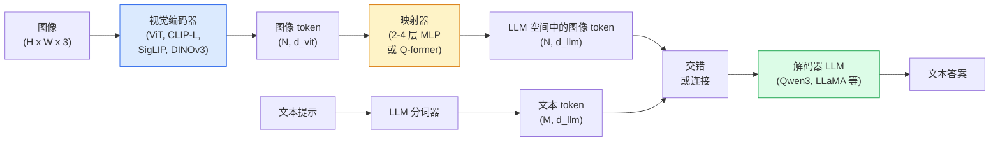

# 视觉-语言模型 — ViT-MLP-LLM 模式

> 一个视觉编码器将图像转换为 tokens。一个 MLP 映射器把这些 tokens 映射到 LLM 的嵌入空间。语言模型完成剩下的工作。这个模式 — ViT-MLP-LLM — 是 2026 年每个生产级 VLM 的标准。

**Type:** 学习 + 应用  
**Languages:** Python  
**Prerequisites:** 阶段 4 课程 14 (ViT), 阶段 4 课程 18 (CLIP), 阶段 7 课程 02 (自注意力)  
**Time:** ~75 分钟

## 学习目标

- 说明 ViT-MLP-LLM 架构并解释三部分各自的贡献  
- 比较 Qwen3-VL、InternVL3.5、LLaVA-Next、GLM-4.6V 在参数量、上下文长度和基准性能上的差异  
- 解释 DeepStack：为何多层 ViT 特征比单一最后一层特征更能收紧视觉-语言对齐  
- 在生产中用跨模态错误率 (CMER) 测量 VLM 幻觉，并据此采取行动

## 问题背景

CLIP（阶段 4 课程 18）为图像和文本提供了共享的嵌入空间，足以做零样本分类与检索。但它无法回答“这张图片里有多少辆红色汽车？”之类的问题，因为 CLIP 不生成文本 —— 它只是打分相似度。

视觉-语言模型（VLM）—— 如 Qwen3-VL、InternVL3.5、LLaVA-Next、GLM-4.6V —— 把 CLIP 家族的图像编码器连接到完整的语言模型上。模型看到图像和问题并生成答案。到 2026 年，开源 VLM 在多模态基准（MMMU、MMBench、DocVQA、ChartQA、MathVista、OSWorld）上的表现可与或超越 GPT-5 和 Gemini-2.5-Pro。

这套三部分（ViT、projector、LLM）就是标准。模型之间的差异在于使用哪个 ViT、哪个 projector、哪个 LLM、训练数据和对齐配方。一旦理解这个模式，替换任一组件就是机械化的工作。

## 概念

### ViT-MLP-LLM 架构



1. **视觉编码器** — 一个预训练的 ViT（CLIP-L/14、SigLIP、DINOv3，或其微调变体）。输出 patch tokens。  
2. **Projector** — 一个小模块（2-4 层 MLP，或 Q-former），把视觉 tokens 映射到 LLM 的嵌入维度。这是大部分微调发生的地方。  
3. **LLM** — 一个 decoder-only 的语言模型（Qwen3、Llama、Mistral、GLM、InternLM）。按顺序读取视觉 + 文本 tokens，生成文本。

原则上三部分都可训练。实际上，视觉编码器和 LLM 通常保持基本冻结，只训练 projector —— 用廉价的几十亿参数信号换来效果。

### DeepStack

传统的映射只使用 ViT 的最后一层。DeepStack（Qwen3-VL）从多个 ViT 深度采样特征并将它们堆叠。更深的层包含高层语义；更浅的层包含细粒度的空间与纹理信息。将两者一并输入 LLM 能弥合“图像包含什么”（语义）与“在何处”（空间定位）之间的差距。

### 三个训练阶段

现代 VLM 的训练分阶段进行：

1. Alignment（对齐） — 冻结 ViT 与 LLM。仅训练 projector，使用图像-字幕对。教会 projector 将视觉空间映射到语言空间。  
2. Pre-training（预训练） — 解冻所有参数。在大规模交错的图文数据（5 亿+ 对）上训练，建立模型的视觉知识。  
3. Instruction tuning（指令微调） — 在精心策划的（图像，问题，答案）三元组上微调。教会对话行为与任务格式。这一步把“具备视觉感知的 LM”变成可用的助手。

大多数 LoRA 微调针对的是第 3 阶段，使用一个小规模有标签的数据集。

### 模型家族对比（2026 年初）

| 模型 | 参数量 | 视觉编码器 | LLM | 上下文 | 优势 |
|------|--------|------------|-----|--------|------|
| Qwen3-VL-235B-A22B (MoE) | 235B (22B active) | custom ViT + DeepStack | Qwen3 | 256K | 通用 SOTA，GUI 代理 |
| Qwen3-VL-30B-A3B (MoE) | 30B (3B active) | custom ViT + DeepStack | Qwen3 | 256K | 更小的 MoE 备选 |
| Qwen3-VL-8B (dense) | 8B | custom ViT | Qwen3 | 128K | 生产环境稠密默认 |
| InternVL3.5-38B | 38B | InternViT-6B | Qwen3 + GPT-OSS | 128K | MMBench / MMVet 表现强 |
| InternVL3.5-241B-A28B | 241B (28B active) | InternViT-6B | Qwen3 | 128K | 可与 GPT-4o 竞争 |
| LLaVA-Next 72B | 72B | SigLIP | Llama-3 | 32K | 开源，易于微调 |
| GLM-4.6V | ~70B | custom | GLM | 64K | 开源，OCR 能力强 |
| MiniCPM-V-2.6 | 8B | SigLIP | MiniCPM | 32K | 边缘友好 |

### 可视化代理（Visual agents）

Qwen3-VL-235B 在 OSWorld（一个针对在 GUI 上操作的视觉代理基准）上达到全球最高性能。该模型看到截图，理解 UI，并输出操作（点击、输入、滚动）。配合工具使用，它能闭环完成常见桌面任务。这正是多数 2026 年 “AI PC” 演示的底层实现。

### Agentic 能力与 RoPE 变体

VLM 需要知道一帧是否属于视频。Qwen3-VL 从 T-RoPE（时序旋转位置嵌入）演进到基于文本的时间对齐 —— 将显式的时间戳文本 tokens 与视频帧交织输入。模型看到 "`<timestamp 00:32>` 帧，提示" 并能推理时间关系。

### 对齐问题

在爬取的数据集中，12% 的图文对包含了并非完全基于图像的描述。一个在这些数据上训练的 VLM 会默默学会幻觉 —— 捏造对象、读错数字、虚构关系。在生产中这是主要的失效模式。

Skywork.ai 引入了 跨模态错误率（Cross-Modal Error Rate，CMER）来跟踪这一问题：

```
CMER = 输出中那些文本置信度很高但图文相似度（通过 CLIP 家族的检查器）很低的比例
```

高 CMER 意味着模型自信地描述与图像不一致的内容。把 CMER 作为生产 KPI，并对其进行监控，Skywork.ai 在部署中将幻觉率降低了约 35%。关键不是“修模型”，而是“将高 CMER 的输出路由到人工复核”。

### 使用 LoRA / QLoRA 微调

对 70B VLM 做完整微调对大多数团队来说不可行。对注意力层和 projector 使用 LoRA（rank 16-64），或用带有 4-bit 基础权重的 QLoRA，可以在单块 A100 / H100 上完成。成本：5k–50k 个示例，计算费用 $100–$5,000，训练时间 2–10 小时。

### 空间推理仍然薄弱

当前 VLM 在空间推理基准（上下、左右、计数、距离）上的得分为 50–60%。如果你的用例依赖“哪个对象在另一个上面”，务必大量验证 —— 通用 VLM 的表现低于人类。对于纯空间任务，比 VLM 更好的替代方案包括：专门的关键点/姿态估计器、深度模型，或带有盒几何后处理的检测模型。

## 构建它

### 步骤 1：Projector

这是你最常训练的部分。2-4 层 MLP，使用 GELU。

```python
import torch
import torch.nn as nn


class Projector(nn.Module):
    def __init__(self, vit_dim=768, llm_dim=4096, hidden=4096):
        super().__init__()
        self.net = nn.Sequential(
            nn.Linear(vit_dim, hidden),
            nn.GELU(),
            nn.Linear(hidden, llm_dim),
        )

    def forward(self, x):
        return self.net(x)
```

输入是一个形状为 `(N_patches, d_vit)` 的 token 张量。输出是 `(N_patches, d_llm)`。LLM 将每一行输出视为普通的 token。

### 步骤 2：端到端组装 ViT-MLP-LLM

最小 VLM 的前向过程骨架。真实代码使用 `transformers`；这是概念性布局。

```python
class MinimalVLM(nn.Module):
    def __init__(self, vit, projector, llm, image_token_id):
        super().__init__()
        self.vit = vit
        self.projector = projector
        self.llm = llm
        self.image_token_id = image_token_id  # 文本提示中的占位符 token

    def forward(self, image, input_ids, attention_mask):
        # 1. 视觉特征
        vision_tokens = self.vit(image)                     # (B, N_patches, d_vit)
        vision_embeds = self.projector(vision_tokens)       # (B, N_patches, d_llm)

        # 2. 文本嵌入
        text_embeds = self.llm.get_input_embeddings()(input_ids)  # (B, M, d_llm)

        # 3. 用视觉嵌入替换图像占位符 token
        merged = self._merge(text_embeds, vision_embeds, input_ids)

        # 4. 运行 LLM
        return self.llm(inputs_embeds=merged, attention_mask=attention_mask)

    def _merge(self, text_embeds, vision_embeds, input_ids):
        out = text_embeds.clone()
        expected = vision_embeds.size(1)
        for b in range(input_ids.size(0)):
            positions = (input_ids[b] == self.image_token_id).nonzero(as_tuple=True)[0]
            if len(positions) != expected:
                raise ValueError(
                    f"batch item {b} has {len(positions)} image tokens but vision_embeds has {expected} patches."
                    " Every sample in the batch must be pre-padded to the same number of image placeholder tokens.")
            out[b, positions] = vision_embeds[b]
        return out
```

文本中的 `<image>` 占位符 token 会被真实的图像嵌入替换 —— 同 LLaVA、Qwen-VL、InternVL 使用的模式。

### 步骤 3：CMER 计算

一个轻量级的运行时检测。

```python
import torch.nn.functional as F


def cross_modal_error_rate(image_emb, text_emb, text_confidence, sim_threshold=0.25, conf_threshold=0.8):
    """
    image_emb, text_emb: 图像与生成文本的嵌入（函数内部会归一化）
    text_confidence:     每个 token 的平均概率，范围 [0, 1]
    Returns:             高置信度输出中图文对齐度低的比例
    """
    image_emb = F.normalize(image_emb, dim=-1)
    text_emb = F.normalize(text_emb, dim=-1)
    sim = (image_emb * text_emb).sum(dim=-1)        # 余弦相似度
    high_conf_low_sim = (text_confidence > conf_threshold) & (sim < sim_threshold)
    return high_conf_low_sim.float().mean().item()
```

将 CMER 作为生产 KPI。按端点、按提示类型、按客户监控它。CMER 上升意味着模型在某些输入分布上开始产生幻觉。

### 步骤 4：玩具 VLM 分类器（可运行示例）

展示 projector 可训练。假的 “ViT 特征” 输入；一个微小的 LLM 风格 token 预测类别。

```python
class ToyVLM(nn.Module):
    def __init__(self, vit_dim=32, llm_dim=64, num_classes=5):
        super().__init__()
        self.projector = Projector(vit_dim, llm_dim, hidden=64)
        self.head = nn.Linear(llm_dim, num_classes)

    def forward(self, vision_tokens):
        projected = self.projector(vision_tokens)
        pooled = projected.mean(dim=1)
        return self.head(pooled)
```

在合成的（特征, 类别）对上，通常不到 200 步就能拟合 —— 足以证明 projector 模式可行。

## 使用它

到 2026 年，生产团队使用 VLM 的三种方式：

- Hosted API（托管 API） — OpenAI Vision、Anthropic Claude Vision、Google Gemini Vision。零基础设施，但有供应商风险。  
- 开源自托管 — 通过 `transformers` 和 `vllm` 使用 Qwen3-VL 或 InternVL3.5。完全可控，但前期工作更多。  
- 针对领域微调 — 加载 Qwen2.5-VL-7B 或 LLaVA-1.6-7B，使用 LoRA 在 5k–50k 的自定义示例上做微调，用 `vllm` 或 `TGI` 部署。

```python
from transformers import AutoProcessor, AutoModelForVision2Seq
import torch
from PIL import Image

model_id = "Qwen/Qwen3-VL-8B-Instruct"
processor = AutoProcessor.from_pretrained(model_id)
model = AutoModelForVision2Seq.from_pretrained(model_id, torch_dtype=torch.bfloat16, device_map="auto")

messages = [{
    "role": "user",
    "content": [
        {"type": "image", "image": Image.open("plot.png")},
        {"type": "text", "text": "What does this chart show?"},
    ],
}]
inputs = processor.apply_chat_template(messages, add_generation_prompt=True, tokenize=True, return_dict=True, return_tensors="pt").to("cuda")
generated = model.generate(**inputs, max_new_tokens=256)
answer = processor.decode(generated[0][inputs["input_ids"].shape[1]:], skip_special_tokens=True)
```

`apply_chat_template` 隐藏了 `<image>` 的占位符 token 化；模型在内部处理合并。

## 部署它

本课产出：

- `outputs/prompt-vlm-selector.md` — 根据准确性、延迟、上下文长度和预算选择 Qwen3-VL / InternVL3.5 / LLaVA-Next / API。  
- `outputs/skill-cmer-monitor.md` — 输出用于为生产 VLM 端点记录跨模态错误率、按端点仪表盘和告警阈值的代码。

## 练习

1. (简单) 对 5 张图像通过任意开源 VLM 运行三条提示（“这是什么？”，“数一数物体”，“描述场景”）。逐条手工对答案进行 正确 / 部分正确 / 幻觉 的评分。计算一个初步的类似 CMER 的比率。  
2. (中等) 用 LoRA（rank 16）在目标领域的 500 张带字幕的图像上微调 Qwen2.5-VL-3B 或 LLaVA-1.6-7B。比较零样本与微调后的 MMBench 风格准确率。  
3. (困难) 将 VLM 的图像编码器替换为 DINOv3（替代默认的 SigLIP/CLIP）。仅重新训练 projector（冻结 LLM 与 DINOv3）。测量密集预测任务（计数、空间推理）是否有所提升。

## 术语表

| 术语 | 俗称 | 实际含义 |
|------|------|---------|
| ViT-MLP-LLM | “VLM 模式” | 视觉编码器 + projector + 语言模型；2026 年的通用 VLM 架构 |
| Projector | “桥接器” | 将视觉 tokens 映射到 LLM 嵌入空间的 2-4 层 MLP（或 Q-former） |
| DeepStack | “Qwen3-VL 的特征技巧” | 使用多层 ViT 特征堆叠而非仅最后一层 |
| Image token | “<image> 占位符” | 文本流中的特殊 token，会被投影后的视觉嵌入替换 |
| CMER | “幻觉 KPI” | 跨模态错误率；当文本置信度高但图文相似度低时为高 |
| Visual agent | “会点击的 VLM” | 在 GUI（OSWorld、移动、网页）上操作并调用工具的 VLM |
| Q-former | “固定计数的 token 桥接” | BLIP-2 风格的 projector，输出固定数量的视觉 query tokens |
| Alignment / pre-training / instruction tuning | “三阶段” | 标准的 VLM 训练流程 |

## 延伸阅读

- [Qwen3-VL Technical Report (arXiv 2511.21631)](https://arxiv.org/abs/2511.21631)  
- [InternVL3.5 Advancing Open-Source Multimodal Models (arXiv 2508.18265)](https://arxiv.org/html/2508.18265v1)  
- [LLaVA-Next series](https://llava-vl.github.io/blog/2024-05-10-llava-next-stronger-llms/)  
- [BentoML: Best Open-Source VLMs 2026](https://www.bentoml.com/blog/multimodal-ai-a-guide-to-open-source-vision-language-models)  
- [MMMU: Multi-discipline Multimodal Understanding benchmark](https://mmmu-benchmark.github.io/)  
- [VLMs in manufacturing (Robotics Tomorrow, March 2026)](https://www.roboticstomorrow.com/story/2026/03/when-machines-learn-to-see-like-experts-the-rise-of-vision-language-models-in-manufacturing/26335/)