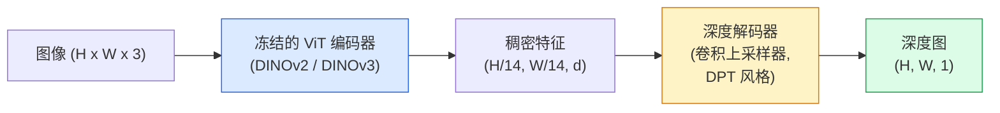

# 单目深度与几何估计

> 深度图是一张单通道图像，其中每个像素表示到相机的距离。从单帧 RGB 预测深度在没有立体或 LiDAR 的情况下曾被认为不可能。到 2026 年，冻结的 ViT 编码器加上轻量的头部可以达到与地面真值相差只有几个百分点的水平。

**Type:** 构建 + 使用  
**Languages:** Python  
**Prerequisites:** Phase 4 Lesson 14 (ViT), Phase 4 Lesson 17 (自监督视觉), Phase 4 Lesson 07 (U-Net)  
**Time:** ~60 分钟

## 学习目标

- 区分相对深度与度量（metric）深度，并说明每个生产模型（MiDaS、Marigold、Depth Anything V3、ZoeDepth）解决的是哪一种
- 使用 Depth Anything V3（DINOv2 backbone）对任意单张图像在无标定条件下预测深度
- 解释为什么单幅图像也能估计深度（透视线索、纹理梯度、学习到的先验）以及哪些信息无法恢复（绝对尺度、被遮挡的几何）
- 使用深度图和针孔相机内参将二维检测提升为三维点

## 问题概述

深度是二维计算机视觉中缺失的轴。给定 RGB，你知道物体在图像平面上的位置；你不知道它们的远近。深度传感器（立体相机、LiDAR、飞行时间）可以直接解决这个问题，但它们昂贵、易损且测距范围有限。

单目深度估计——从单张 RGB 预测深度——过去通常产生模糊且不可靠的结果。到了 2026 年，大型预训练编码器改变了这一点：Depth Anything V3 使用冻结的 DINOv2 backbone 并生成可在室内、室外、医疗和卫星域间泛化的深度图。Marigold 将深度建模为条件扩散问题。ZoeDepth 回归真实的度量距离。

深度也是从 2D 检测到 3D 理解的桥梁：将检测框内像素与深度相乘就能将 2D 对象提升为 3D 点云。这是所有 AR 遮挡系统、避障流水线与“抓起杯子”机器人的核心。

## 概念

### 相对深度 vs 度量深度

- **相对深度** — 有序的 z 值但没有真实世界单位。“像素 A 比像素 B 更近，但距离比率没有以米为锚定。”
- **度量深度** — 以米为单位的绝对距离。要求模型学习图像线索与真实距离之间的统计关系。

MiDaS 和 Depth Anything V3 输出相对深度。Marigold 输出相对深度。ZoeDepth、UniDepth 和 Metric3D 输出度量深度。度量模型对相机内参敏感；相对模型则不敏感。

### 编码器-解码器模式



Depth Anything V3 冻结编码器，仅训练 DPT 风格的解码器。编码器提供丰富的特征；解码器将它们插值回图像分辨率并回归深度。

### 为什么单张图像就能产生深度

一张 2D 图像包含许多与深度相关的单目线索（monocular cues）：

- **透视（Perspective）** — 3D 中的平行线在 2D 中会汇聚。
- **纹理梯度（Texture gradient）** — 远处表面的纹理看起来更小、更密。
- **遮挡顺序（Occlusion order）** — 更近的物体遮挡更远的物体。
- **大小恒常性（Size constancy）** — 已知物体（汽车、人体）提供近似尺度。
- **大气透视（Atmospheric perspective）** — 在户外场景中，远处物体显得更模糊、更偏蓝。

在数十亿张图像上训练的 ViT 内化了这些线索。只要数据足够多、backbone 强大，单目深度在没有显式 3D 监督的情况下也能达到合理精度。

### 单目深度无法做什么

- **绝对度量尺度**（没有内参或场景中已知物体时）。网络可以预测“杯子比勺子远两倍”，但不知道杯子是 1 m 还是 10 m。
- **被遮挡的几何** — 椅子背面不可见，无法可靠推断。
- **完全无纹理/反射表面** — 镜子、玻璃、均匀墙面。网络会给出看似合理但错误的深度。

### 2026 年的 Depth Anything V3

- 使用原生 DINOv2 ViT-L/14 作为编码器（冻结）。
- DPT 解码器。
- 在多源的有位姿图像对上训练（除了光度一致性外无需显式深度监督）。
- 能从任意数量的视觉输入中预测空间一致的几何，无论是否已知相机位姿。
- 在单目深度、任意视角几何、视觉渲染、相机位姿估计上都达到 SOTA。

当你在 2026 年需要深度时，这是可直接替换使用的模型。

### Marigold — 将深度视为扩散问题

Marigold（Ke 等，CVPR 2024）将深度估计重构为条件图像到图像的扩散。条件：RGB。目标：深度图。使用预训练的 Stable Diffusion 2 U-Net 作为骨干。输出的深度图在物体边界处非常锐利。代价是推理比前馈模型慢（10–50 次去噪步骤）。

### 相机内参与针孔相机模型

将像素 (u, v) 和深度 d 提升为相机坐标系中的 3D 点 (X, Y, Z)：

```
fx, fy, cx, cy = camera intrinsics
X = (u - cx) * d / fx
Y = (v - cy) * d / fy
Z = d
```

内参可以来自 EXIF 元数据、标定图案或单目内参估计器（如 Perspective Fields、UniDepth）。没有内参时，你仍可通过假设 60–70° 的视场和中等分辨率主点来渲染点云——可用于可视化，但不可用于精确测量。

### 评估

两个标准度量：

- **AbsRel**（绝对相对误差）：`mean(|d_pred - d_gt| / d_gt)`。越低越好。生产模型通常在 0.05–0.1 区间。
- **delta < 1.25**（阈值精度）：像素满足 `max(d_pred/d_gt, d_gt/d_pred) < 1.25` 的比例。越高越好。SOTA 可达 0.9 以上。

对于相对深度（Depth Anything V3、MiDaS），评估使用尺度与偏移不变版本的这两个指标（scale-and-shift invariant）。

## 实作

### 第 1 步：深度度量

```python
import torch

def abs_rel_error(pred, target, mask=None):
    if mask is not None:
        pred = pred[mask]
        target = target[mask]
    return (torch.abs(pred - target) / target.clamp(min=1e-6)).mean().item()


def delta_accuracy(pred, target, threshold=1.25, mask=None):
    if mask is not None:
        pred = pred[mask]
        target = target[mask]
    ratio = torch.maximum(pred / target.clamp(min=1e-6), target / pred.clamp(min=1e-6))
    return (ratio < threshold).float().mean().item()
```

在评估前始终对无效深度像素（零、NaN、饱和值）进行掩膜处理。

### 第 2 步：尺度与偏移对齐

对于相对深度模型，在计算度量前需要将预测对齐到地面真值。对 `a * pred + b = target` 做最小二乘拟合：

```python
def align_scale_shift(pred, target, mask=None):
    if mask is not None:
        p = pred[mask]
        t = target[mask]
    else:
        p = pred.flatten()
        t = target.flatten()
    A = torch.stack([p, torch.ones_like(p)], dim=1)
    coeffs, *_ = torch.linalg.lstsq(A, t.unsqueeze(-1))
    a, b = coeffs[:2, 0]
    return a * pred + b
```

在评估 MiDaS / Depth Anything 时，先运行 `align_scale_shift` 然后再计算 `abs_rel_error`。

### 第 3 步：将深度提升为点云

```python
import numpy as np

def depth_to_point_cloud(depth, intrinsics):
    H, W = depth.shape
    fx, fy, cx, cy = intrinsics
    v, u = np.meshgrid(np.arange(H), np.arange(W), indexing="ij")
    z = depth
    x = (u - cx) * z / fx
    y = (v - cy) * z / fy
    return np.stack([x, y, z], axis=-1)


depth = np.random.uniform(0.5, 4.0, (240, 320))
intr = (320.0, 320.0, 160.0, 120.0)
pc = depth_to_point_cloud(depth, intr)
print(f"point cloud shape: {pc.shape}  (H, W, 3)")
```

一个函数，适用于所有需要 3D 提升的应用。将点云导出为 `.ply` 并在 MeshLab 或 CloudCompare 中打开。

### 第 4 步：用合成深度场景进行冒烟测试

```python
def synthetic_depth(size=96):
    yy, xx = np.meshgrid(np.arange(size), np.arange(size), indexing="ij")
    # 地面：从近（上部）到远（下部）的线性梯度
    depth = 1.0 + (yy / size) * 4.0
    # 中间的箱子：更近
    mask = (np.abs(xx - size / 2) < size / 6) & (np.abs(yy - size * 0.6) < size / 6)
    depth[mask] = 2.0
    return depth.astype(np.float32)


gt = torch.from_numpy(synthetic_depth(96))
pred = gt + 0.3 * torch.randn_like(gt)  # 模拟的预测
aligned = align_scale_shift(pred, gt)
print(f"before align  absRel = {abs_rel_error(pred, gt):.3f}")
print(f"after align   absRel = {abs_rel_error(aligned, gt):.3f}")
```

### 第 5 步：Depth Anything V3 使用示例（参考）

```python
import torch
from transformers import pipeline
from PIL import Image

pipe = pipeline(task="depth-estimation", model="LiheYoung/depth-anything-v2-large")

image = Image.open("street.jpg").convert("RGB")
out = pipe(image)
depth_np = np.array(out["depth"])
```

就三行。`out["depth"]` 是 PIL 灰度图；转为 numpy 以便做数学运算。对于 Depth Anything V3，发布后只需替换模型 id；API 不变。

## 使用建议

- **Depth Anything V3**（Meta AI / 字节跳动，2024–2026）— 默认的相对深度模型。生产中最快的 ViT-large-backbone 模型。
- **Marigold**（ETH，2024）— 视觉质量最高，但推理慢。
- **UniDepth**（ETH，2024）— 提供带内参估计的度量深度。
- **ZoeDepth**（Intel，2023）— 度量深度；较老但仍可靠。
- **MiDaS v3.1** — 传统且稳定；用于比较的良好基线。

典型集成流程：

1. 收到 RGB 帧。
2. 深度模型生成深度图。
3. 检测器生成检测框。
4. 用深度提升检测框中心到 3D；如果有点云则合并。
5. 下游应用：AR 遮挡、路径规划、物体尺寸估计、立体替代等。

在实时使用中，Depth Anything V2 Small（INT8 量化）在消费级 GPU、518x518 分辨率下可达到约 30 fps。

## 部署产出

本课将产出：

- `outputs/prompt-depth-model-picker.md` — 根据延迟、是否需要度量尺度和场景类型在 Depth Anything V3、Marigold、UniDepth、MiDaS 之间进行选择。
- `outputs/skill-depth-to-pointcloud.md` — 一个技能，用于从深度图构建点云并正确处理内参与导出到 `.ply`。

## 练习

1. **（简单）** 在任意 10 张桌面图片上运行 Depth Anything V2。将深度保存为灰度 PNG 并检查。找出一个预测深度看起来错误的物体并解释单目线索为何失效。
2. **（中等）** 给定 RGB + Depth（Depth Anything V2），将其提升为点云并用 `open3d` 渲染。比较两个场景（室内 / 室外），并记录哪个看起来更可信。
3. **（困难）** 选取五对仅通过已知物体位置变化（例如瓶子靠近 30 cm）不同的图像。使用 UniDepth 在两张图上预测度量深度。报告预测的距离差与真实 30 cm 的对比。

## 术语索引

| Term | What people say | What it actually means |
|------|----------------|----------------------|
| Monocular depth | "Single-image depth" | 单帧 RGB 的深度估计（无立体或 LiDAR） |
| Relative depth | "Ordered depth" | 有序的 z 值，没有真实世界单位（相对深度） |
| Metric depth | "Absolute distance" | 以米为单位的深度；需要标定或以度量监督训练的模型 |
| AbsRel | "Absolute relative error" | |d_pred - d_gt| / d_gt 的均值；标准深度误差指标 |
| Delta accuracy | "delta < 1.25" | 预测在真实值 25% 范围内的像素比例 |
| Pinhole camera | "fx, fy, cx, cy" | 用于将 (u, v, d) 提升为 (X, Y, Z) 的相机模型 |
| DPT | "Dense Prediction Transformer" | 用在冻结 ViT 编码器上的基于卷积的解码器 |
| DINOv2 backbone | "The reason it works" | 自监督特征，在没有深度标签的情况下跨域泛化 |

## 延伸阅读

- [Depth Anything V3 paper page](https://depth-anything.github.io/) — 使用 DINOv2 编码器的 SOTA 单目深度
- [Marigold (Ke et al., CVPR 2024)](https://marigoldmonodepth.github.io/) — 基于扩散的深度估计
- [UniDepth (Piccinelli et al., 2024)](https://arxiv.org/abs/2403.18913) — 带内参估计的度量深度
- [MiDaS v3.1 (Intel ISL)](https://github.com/isl-org/MiDaS) — 规范的相对深度基线
- [DINOv3 blog post (Meta)](https://ai.meta.com/blog/dinov3-self-supervised-vision-model/) — 提升深度精度的编码器家族