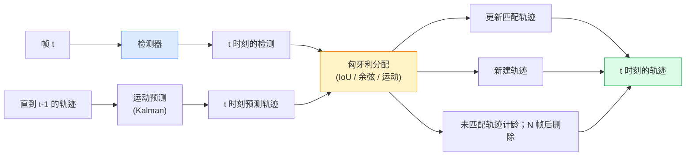

# 多目标跟踪与视频记忆

> 跟踪 = 检测 + 关联。在每一帧做检测。将本帧的检测与上一帧的轨迹按 ID 匹配。

**Type:** 构建  
**Languages:** Python  
**Prerequisites:** Phase 4 Lesson 06 (YOLO Detection), Phase 4 Lesson 08 (Mask R-CNN), Phase 4 Lesson 24 (SAM 3)  
**Time:** ~60 分钟

## 学习目标

- 区分基于检测的跟踪（tracking-by-detection）与基于查询的跟踪，并能列举相关算法家族（SORT、DeepSORT、ByteTrack、BoT-SORT、SAM 2 memory tracker、SAM 3.1 Object Multiplex）
- 从头实现基于 IoU + 匈牙利分配的经典跟踪
- 解释 SAM 2 的 memory bank 及其为何在遮挡情况下比基于 IoU 的关联更可靠
- 阅读三种跟踪评估指标（MOTA、IDF1、HOTA），并根据具体用例选择最重要的指标

## 问题背景

检测器告诉你单帧中对象的位置。跟踪器则告诉你，帧 `t` 中的某个检测是否与帧 `t-1` 中的某个检测是同一个对象。没有跟踪，你无法统计越线物体数量、在遮挡中跟随球的位置，或知道“车 #4 在该车道已存在 8 秒”。

跟踪是所有面向视频的产品的基础：体育分析、监控、自动驾驶、医学影像分析、野生动物监测、品牌计数等。核心模块是通用的：逐帧检测器、运动模型（卡尔曼滤波或更复杂模型）、关联步骤（基于 IoU / 余弦 / 学习到的特征的匈牙利算法）以及轨迹生命周期（出生、更新、消亡）。

2026 年带来了两种新模式：**SAM 2 基于记忆的跟踪**（用特征记忆替代运动模型关联）和 **SAM 3.1 Object Multiplex**（为同一概念的多个实例共享记忆）。本课先讲经典栈，再讲基于记忆的方法。

## 概念

### 基于检测的跟踪 (Tracking-by-detection)



到 2026 年你遇到的每个跟踪器都是这个循环的变体。差异主要在于：

- **SORT** (2016)：卡尔曼滤波 + IoU 匈牙利分配。简单、快速、没有外观模型。
- **DeepSORT** (2017)：在 SORT 基础上为每个轨迹添加基于 CNN 的外观特征（ReID 嵌入）。能更好地处理交叉情况。
- **ByteTrack** (2021)：将低置信度检测作为第二阶段进行关联；不依赖外观特征，但在 MOT17 上表现优异。
- **BoT-SORT** (2022)：ByteTrack + 相机运动补偿 + ReID。
- **StrongSORT / OC-SORT** — ByteTrack 的后续，具有更好的运动和外观建模。

### 卡尔曼滤波一句话说明

卡尔曼滤波为每条轨迹维持状态 `(x, y, w, h, dx, dy, dw, dh)` 及其协方差。在每帧先用恒速模型进行 **预测**，再用匹配到的检测进行 **更新**。当预测不确定性高时，更新会更多地信任检测。这能产生平滑轨迹，并允许在短时遮挡（1-5 帧）中持续跟踪。

几乎所有经典跟踪器在运动预测步骤中都使用卡尔曼滤波。

### 匈牙利算法

给定一个 M x N 的代价矩阵（轨迹 x 检测），求解最小总代价的一对一匹配。代价通常是 `1 - IoU(track_bbox, detection_bbox)` 或者外观特征的负余弦相似度。运行时间为 O((M+N)^3)；对于 M、N 约 1000 的规模，使用 `scipy.optimize.linear_sum_assignment` 在 Python 中足够快。

### ByteTrack 的关键思想

标准跟踪器会丢弃置信度低的检测（< 0.5）。ByteTrack 将它们保留下来作为**第二阶段候选**：先把轨迹与高置信度检测匹配，未匹配的轨迹再尝试与低置信度检测匹配，使用略宽松的 IoU 阈值。能恢复短时遮挡并减少人群中 ID 交换。

### SAM 2 基于记忆的跟踪

SAM 2 通过维护每个实例的时空特征 **记忆库（memory bank）** 来处理视频。给定一个帧上的提示（点击、框、文本），它将该实例编码进记忆。在后续帧中，记忆会与新帧的特征进行交叉注意力，解码器生成新帧中相同实例的掩码。

没有卡尔曼滤波，也没有匈牙利分配。关联隐式地通过记忆-注意力操作实现。

优点：
- 对大范围遮挡更鲁棒（记忆在多帧之间携带实例身份）。
- 与 SAM 3 的文本提示结合时可实现开域（open-vocabulary）跟踪。
- 无需独立的运动模型。

缺点：
- 对大量物体跟踪时比 ByteTrack 更慢。
- 记忆库会增长；受上下文窗口限制。

### SAM 3.1 Object Multiplex

早期的 SAM 2 / SAM 3 跟踪为每个实例维护独立的记忆库。若有 50 个对象即 50 个记忆库。Object Multiplex（2026 年 3 月）将它们合并到一个共享记忆中，并使用**每实例查询 token**。成本随实例数量呈亚线性增长。

Multiplex 成为 2026 年人群跟踪的新默认方案：演唱会人群、仓库工人、交通路口等场景。

### 需要掌握的三个指标

- **MOTA (Multi-Object Tracking Accuracy)** — 1 - (FN + FP + ID switches) / GT。将不同类型错误加权合成的单一指标，混合了检测和关联错误。
- **IDF1 (ID F1)** — ID 精度与召回的调和平均。专注于地面真值轨迹随时间保持相同 ID 的能力。对于对 ID 交换敏感的任务比 MOTA 更有意义。
- **HOTA (Higher Order Tracking Accuracy)** — 分解为检测精度 (DetA) 和关联精度 (AssA)。自 2020 年以来的社区标准；更全面。

监控（谁是谁）：报告 IDF1。体育分析（计数传球）：用 HOTA。一般学术比对：用 HOTA。

## 实现

### 步骤 1：基于 IoU 的代价矩阵

```python
import numpy as np


def bbox_iou(a, b):
    """
    a, b: (N, 4) 形状的数组，格式为 [x1, y1, x2, y2]。
    返回形状为 (N_a, N_b) 的 IoU 矩阵。
    """
    ax1, ay1, ax2, ay2 = a[:, 0], a[:, 1], a[:, 2], a[:, 3]
    bx1, by1, bx2, by2 = b[:, 0], b[:, 1], b[:, 2], b[:, 3]
    inter_x1 = np.maximum(ax1[:, None], bx1[None, :])
    inter_y1 = np.maximum(ay1[:, None], by1[None, :])
    inter_x2 = np.minimum(ax2[:, None], bx2[None, :])
    inter_y2 = np.minimum(ay2[:, None], by2[None, :])
    inter = np.clip(inter_x2 - inter_x1, 0, None) * np.clip(inter_y2 - inter_y1, 0, None)
    area_a = (ax2 - ax1) * (ay2 - ay1)
    area_b = (bx2 - bx1) * (by2 - by1)
    union = area_a[:, None] + area_b[None, :] - inter
    return inter / np.clip(union, 1e-8, None)
```

### 步骤 2：最简化的 SORT 风格跟踪器

为简洁起见，这里省略了恒速卡尔曼的实现 — 我们只使用简单的 IoU 关联；在生产环境中卡尔曼预测是必不可少的。可以使用 `sort` Python 包得到完整实现。

```python
from scipy.optimize import linear_sum_assignment


class Track:
    def __init__(self, tid, bbox, frame):
        self.id = tid
        self.bbox = bbox
        self.last_frame = frame
        self.hits = 1

    def update(self, bbox, frame):
        self.bbox = bbox
        self.last_frame = frame
        self.hits += 1


class SimpleTracker:
    def __init__(self, iou_threshold=0.3, max_age=5):
        self.tracks = []
        self.next_id = 1
        self.iou_threshold = iou_threshold
        self.max_age = max_age

    def step(self, detections, frame):
        if not self.tracks:
            for d in detections:
                self.tracks.append(Track(self.next_id, d, frame))
                self.next_id += 1
            return [(t.id, t.bbox) for t in self.tracks]

        track_boxes = np.array([t.bbox for t in self.tracks])
        det_boxes = np.array(detections) if len(detections) else np.empty((0, 4))

        iou = bbox_iou(track_boxes, det_boxes) if len(det_boxes) else np.zeros((len(track_boxes), 0))
        cost = 1 - iou
        cost[iou < self.iou_threshold] = 1e6

        matched_track = set()
        matched_det = set()
        if cost.size > 0:
            row, col = linear_sum_assignment(cost)
            for r, c in zip(row, col):
                if cost[r, c] < 1.0:
                    self.tracks[r].update(det_boxes[c], frame)
                    matched_track.add(r); matched_det.add(c)

        for i, d in enumerate(det_boxes):
            if i not in matched_det:
                self.tracks.append(Track(self.next_id, d, frame))
                self.next_id += 1

        self.tracks = [t for t in self.tracks if frame - t.last_frame <= self.max_age]
        return [(t.id, t.bbox) for t in self.tracks]
```

大约 60 行。输入逐帧检测，返回逐帧轨迹 ID。真实系统会添加卡尔曼预测、ByteTrack 的第二阶段重匹配以及外观特征。

### 步骤 3：合成轨迹测试

```python
def synthetic_frames(num_frames=20, num_objects=3, H=240, W=320, seed=0):
    rng = np.random.default_rng(seed)
    starts = rng.uniform(20, 200, size=(num_objects, 2))
    velocities = rng.uniform(-5, 5, size=(num_objects, 2))
    frames = []
    for f in range(num_frames):
        dets = []
        for i in range(num_objects):
            cx, cy = starts[i] + f * velocities[i]
            dets.append([cx - 10, cy - 10, cx + 10, cy + 10])
        frames.append(dets)
    return frames


tracker = SimpleTracker()
for f, dets in enumerate(synthetic_frames()):
    tracks = tracker.step(dets, f)
```

三条直线运动的物体在 20 帧内应该保持其 ID 不变。

### 步骤 4：ID 交换计数指标

```python
def count_id_switches(tracks_per_frame, gt_per_frame):
    """
    tracks_per_frame:  每帧的 [(track_id, bbox)] 列表的列表
    gt_per_frame:      每帧的 [(gt_id, bbox)] 列表的列表
    返回 ID 交换（ID switches）的数量。
    """
    prev_assignment = {}
    switches = 0
    for tracks, gts in zip(tracks_per_frame, gt_per_frame):
        if not tracks or not gts:
            continue
        t_boxes = np.array([b for _, b in tracks])
        g_boxes = np.array([b for _, b in gts])
        iou = bbox_iou(g_boxes, t_boxes)
        for g_idx, (gt_id, _) in enumerate(gts):
            j = iou[g_idx].argmax()
            if iou[g_idx, j] > 0.5:
                t_id = tracks[j][0]
                if gt_id in prev_assignment and prev_assignment[gt_id] != t_id:
                    switches += 1
                prev_assignment[gt_id] = t_id
    return switches
```

这是一个简化的、与 IDF1 相关的度量：统计地面真值对象在预测轨迹 ID 上发生变化的次数。完整的 MOTA / IDF1 / HOTA 工具通常使用 `py-motmetrics` 和 `TrackEval`。

## 使用建议

2026 年的生产级跟踪器：

- `ultralytics` — 内置 YOLOv8 + ByteTrack / BoT-SORT。用法示例：`results = model.track(source, tracker="bytetrack.yaml")`（默认）。
- `supervision` (Roboflow) — ByteTrack 的封装以及标注工具。
- SAM 2 / SAM 3.1 — 通过 `processor.track()` 提供基于记忆的跟踪。
- 自定义栈：检测器（YOLOv8 / RT-DETR）+ `sort-tracker` / `OC-SORT` / `StrongSORT`。

选择建议：

- 行人 / 汽车 / 箱子 @ 30+ fps：使用 **ByteTrack + ultralytics**。
- 同一类别大量实例（人群）：使用 **SAM 3.1 Object Multiplex**。
- 强遮挡且可识别外观：使用 **DeepSORT / StrongSORT**（ReID 特征）。
- 运动复杂 / 交互频繁的体育场景：使用 **BoT-SORT** 或学习型跟踪器（如 MOTRv3）。

## 交付项

本课产出：

- `outputs/prompt-tracker-picker.md` — 根据场景类型、遮挡模式和延迟预算，选择 SORT / ByteTrack / BoT-SORT / SAM 2 / SAM 3.1。
- `outputs/skill-mot-evaluator.md` — 编写完整的评估工具，用于对地面真值轨迹计算 MOTA / IDF1 / HOTA。

## 练习

1. (简单) 使用上面的合成跟踪器，分别在 3、10、30 个物体下运行。报告每种情况的 ID 交换计数。找出简单仅 IoU 关联开始失败的节点。
2. (中等) 在关联之前添加恒速卡尔曼预测步骤。证明短时（2-3 帧）遮挡不再导致 ID 交换。
3. (困难) 将 SAM 2 的基于记忆的跟踪器（通过 `transformers`）集成为备选后端。在一段 30 秒的人群视频上同时运行 SimpleTracker 和 SAM 2，并比较 ID 交换计数（手工为 5 个显著人物标注地面真值 ID）。

## 术语表

| 术语 | 通俗说法 | 实际含义 |
|------|----------------|----------------------|
| 基于检测的跟踪 (Tracking-by-detection) | “先检测再关联” | 逐帧检测器 + 基于 IoU / 外观 的匈牙利分配 |
| 卡尔曼滤波 (Kalman filter) | “运动预测” | 线性动力学 + 协方差，用于平滑轨迹预测和遮挡处理 |
| 匈牙利算法 (Hungarian algorithm) | “最优分配” | 求解最小代价二分匹配问题；可用 `scipy.optimize.linear_sum_assignment` |
| ByteTrack | “低置信度二次匹配” | 将未匹配轨迹与低置信度检测重匹配以恢复短时遮挡 |
| DeepSORT | “SORT + 外观” | 在 SORT 基础上加入 ReID 外观特征以改善跨帧匹配和 ID 保持 |
| 记忆库 (Memory bank) | “SAM 2 的技巧” | 存储每个实例的时空特征；通过交叉注意力替代显式关联 |
| 对象复用 (Object Multiplex) | “SAM 3.1 共享记忆” | 用单一共享记忆和每实例查询实现快速的大规模实例跟踪 |
| HOTA | “现代跟踪指标” | 将跟踪性能分解为检测准确度与关联准确度；社区标准 |

## 延伸阅读

- [SORT (Bewley et al., 2016)](https://arxiv.org/abs/1602.00763) — 最小化的基于检测跟踪论文  
- [DeepSORT (Wojke et al., 2017)](https://arxiv.org/abs/1703.07402) — 增加外观特征  
- [ByteTrack (Zhang et al., 2022)](https://arxiv.org/abs/2110.06864) — 低置信度二次匹配  
- [BoT-SORT (Aharon et al., 2022)](https://arxiv.org/abs/2206.14651) — 相机运动补偿  
- [HOTA (Luiten et al., 2020)](https://arxiv.org/abs/2009.07736) — 分解的跟踪指标  
- [SAM 2 视频分割 (Meta, 2024)](https://ai.meta.com/sam2/) — 基于记忆的跟踪  
- [SAM 3.1 Object Multiplex (Meta, March 2026)](https://ai.meta.com/blog/segment-anything-model-3/)