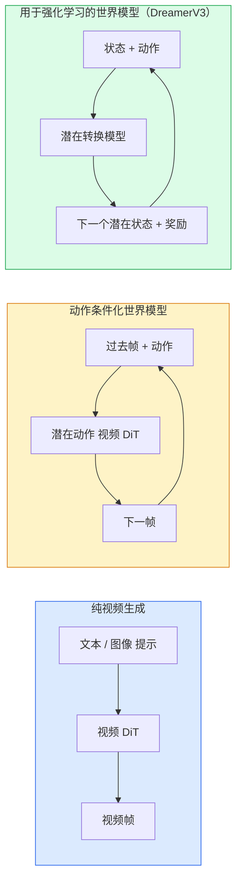

# World Models & Video Diffusion

> A video model that predicts the next seconds of a scene is a world simulator. Condition that prediction on actions and you have a learned game engine.

**Type:** 学习 + 构建  
**Languages:** Python  
**Prerequisites:** 第四阶段 第10课（Diffusion），第四阶段 第12课（视频理解），第四阶段 第23课（DiT + Rectified Flow）  
**Time:** ~75 分钟

## Learning Objectives

- 解释纯视频生成模型（Sora 2）与动作条件化世界模型（Genie 3、DreamerV3）之间的区别
- 描述一个视频 DiT：时空补丁、3D 位置编码、在 (T, H, W) 令牌上的联合注意力
- 跟踪世界模型如何接入机器人系统：VLM 规划 → 视频模型模拟 → 逆动力学输出动作
- 针对不同用例（创意视频、交互式仿真、自动驾驶合成）在 Sora 2、Genie 3、Runway GWM-1 Worlds、Wan-Video 和 HunyuanVideo 之间做出选择

## The Problem

视频生成和世界建模在 2026 年趋于融合。能够生成连贯一分钟视频的模型，从某种意义上已经学会了世界如何运动：物体持存性、重力、因果关系、风格。如果你把这种预测以动作作为条件（向左走、开门），视频模型就变成了一个可学习的模拟器，可以替代游戏引擎、驾驶模拟器或机器人环境。

利益是具体且显著的。Genie 3 能从单张图像生成可玩环境。Runway GWM-1 Worlds 合成可无限探索的场景。Sora 2 生成带同步音频并建模物理的分钟级视频。NVIDIA 的 Cosmos-Drive、Wayve 的 Gaia-2、Tesla 的 DrivingWorld 为自动驾驶生成逼真的驾驶视频作为训练数据。世界模型范式正在悄然主导机器人领域的 sim-to-real。

本课是第四阶段的“宏观”课程。它将图像生成、视频理解与智能体推理连接到当前主导研究方向的架构模式上。

## The Concept

### 三类世界建模家族



- **Sora 2** 是基于提示的纯视频生成。没有动作接口。你无法在生成过程中对其进行“操控”。
- **Genie 3**、**GWM-1 Worlds**、**Mirage / Magica** 属于动作条件化世界模型。它们从观测视频中判别性地推断潜在动作，然后将未来帧预测以这些动作为条件进行生成。交互式——你按键或移动摄像机，场景做出响应。
- **DreamerV3** 和经典的 RL 世界模型家族在潜在空间中进行预测，显式地以动作为条件，并基于奖励信号训练。视觉感知较弱；但在样本高效的强化学习中更有用。

### 视频 DiT 架构

```
Video latent:          (C, T, H, W)
Patchify (spatial):    grid of P_h x P_w patches per frame
Patchify (temporal):   group P_t frames into a temporal patch
Resulting tokens:      (T / P_t) * (H / P_h) * (W / P_w) tokens
```

位置编码是 3D 的：对每个 (t, h, w) 坐标使用 rotary 或可学习嵌入。注意力可以是：

- 全部联合（Full joint）——所有令牌互相注意。复杂度 O(N^2)，对于长视频不可行。
- 划分式（Divided）——交替进行时间注意力（同一空间位置跨时间：`(H*W) * T^2`）和空间注意力（同一时间步跨空间：`T * (H*W)^2`）。TimeSformer 和大多数视频 DiT 采用此法。
- 窗口式（Window）——在 (t, h, w) 上采用局部窗口。Video Swin 使用该方法。

截至 2026 年的每个视频扩散模型都采用这三种模式之一，并结合 AdaLN 条件化（第 23 课）和 rectified flow。

### 基于动作的条件化：潜在动作模型

Genie 为每帧学习一个 **潜在动作（latent action）**，通过判别性地预测一对连续帧之间的动作来获得。模型的解码器随后以推断出的潜在动作为条件——而不是显式的键盘按键。在推理时，用户可以指定一个潜在动作（或从新先验中采样）并让模型生成与该动作一致的下一帧。

Sora 完全跳过动作接口。它的解码器直接从过去的时空令牌预测下一时空令牌。提示词决定起点；生成过程中无人为介入来控制。

### 物理合理性

Sora 2 在 2026 年的发布明确宣传了**物理合理性**：重量、平衡、物体持存性、因果关系。团队通过人工评分的合理性分数来衡量；相较 Sora 1，该模型在掉落物体、角色碰撞以及“故意失败”（如跳跃失误）等情形上有明显改进。

物理合理性仍是主要失效模式。2024–2025 年的视频在表现人们吃意大利面或用杯子喝水时暴露出模型缺乏持久对象表示的问题。2026 年的模型（Sora 2、Runway Gen-5、HunyuanVideo）有所缓解但尚未完全解决。

### 自动驾驶世界模型

驾驶世界模型根据轨迹、边界框或导航地图生成逼真的道路场景。用途包括：

- **Cosmos-Drive-Dreams**（NVIDIA）——为 RL 训练生成分钟级驾驶视频。
- **Gaia-2**（Wayve）——基于轨迹的场景合成，用于策略评估。
- **DrivingWorld**（Tesla）——模拟不同天气、一天中时间、交通状况。
- **Vista**（字节跳动）——响应式驾驶场景合成。

它们替代了昂贵的真实世界数据采集，用以覆盖角落案例——夜间行人乱穿、结冰路口、异常车型等，否则需要数百万英里的驾驶数据。

### 机器人堆栈：VLM + 视频模型 + 逆动力学

新兴的三组件机器人闭环：

1. **VLM** 解析目标（“拿起红色杯子”），规划高层动作序列。
2. **视频生成模型** 模拟执行每个动作时的视觉观测——预测未来 N 帧的观测。
3. **逆动力学模型** 提取能产生这些观测的具体电机命令。

这替代了奖励工程和样本密集的 RL。世界模型负责“想象”，逆动力学则将想象的观测映射回可执行的动作。Genie Envisioner 是该结构的一种实现；许多研究组正在朝这个结构收敛。

### 评估

- 视觉质量 — FVD（Fréchet Video Distance）、用户研究。
- 提示一致性 — 每帧的 CLIPScore，类似 VQA 的评估。
- 物理合理性 — 在基准套件上人工评分（Sora 2 的内部基准、VBench）。
- 可控性（对于交互式世界模型）— 动作 → 观测一致性；能否回到先前状态？

### 2026 年的模型图谱

| 模型 | 用途 | 参数量 | 输出 | 许可 |
|------|------|--------|------|------|
| Sora 2 | 文本到视频，带音频 | — | 1 分钟 1080p + 音频 | 仅 API |
| Runway Gen-5 | 文本/图像 到 视频 | — | 10s 片段 | API |
| Runway GWM-1 Worlds | 交互式世界 | — | 无限 3D 展开 | API |
| Genie 3 | 从图像生成交互式世界 | 11B+ | 可玩帧 | 研究预览 |
| Wan-Video 2.1 | 开放文本到视频 | 14B | 高质量片段 | 非商业 |
| HunyuanVideo | 开放文本到视频 | 13B | 10s 片段 | 宽松许可 |
| Cosmos / Cosmos-Drive | 自动驾驶仿真 | 7-14B | 驾驶场景 | NVIDIA 开放 |
| Magica / Mirage 2 | 原生 AI 游戏引擎 | — | 可修改世界 | 产品化 |

## Build It

### Step 1: 视频的 3D patchify

```python
import torch
import torch.nn as nn


class VideoPatch3D(nn.Module):
    def __init__(self, in_channels=4, dim=64, patch_t=2, patch_h=2, patch_w=2):
        super().__init__()
        self.proj = nn.Conv3d(
            in_channels, dim,
            kernel_size=(patch_t, patch_h, patch_w),
            stride=(patch_t, patch_h, patch_w),
        )
        self.patch_t = patch_t
        self.patch_h = patch_h
        self.patch_w = patch_w

    def forward(self, x):
        # x: (N, C, T, H, W) 输入张量
        x = self.proj(x)
        n, c, t, h, w = x.shape
        tokens = x.reshape(n, c, t * h * w).transpose(1, 2)
        return tokens, (t, h, w)
```

使用步幅等于核大小的 3D 卷积作为时空补丁化器。`(T, H, W) -> (T/2, H/2, W/2)` 的令牌网格。

### Step 2: 3D rotary 位置编码

Rotary Position Embeddings (RoPE) 分别沿 `t`, `h`, `w` 轴应用：

```python
def rope_3d(tokens, t_dim, h_dim, w_dim, grid):
    """
    tokens: (N, T*H*W, D)
    grid: (T, H, W) sizes
    t_dim + h_dim + w_dim == D
    """
    T, H, W = grid
    n, seq, d = tokens.shape
    if t_dim + h_dim + w_dim != d:
        raise ValueError(f"t_dim+h_dim+w_dim ({t_dim}+{h_dim}+{w_dim}) must equal D={d}")
    assert seq == T * H * W
    t_idx = torch.arange(T, device=tokens.device).repeat_interleave(H * W)
    h_idx = torch.arange(H, device=tokens.device).repeat_interleave(W).repeat(T)
    w_idx = torch.arange(W, device=tokens.device).repeat(T * H)
    # 简化：仅按频率缩放通道。真实的 RoPE 会旋转成对的通道。
    freqs_t = torch.exp(-torch.log(torch.tensor(10000.0)) * torch.arange(t_dim // 2, device=tokens.device) / (t_dim // 2))
    freqs_h = torch.exp(-torch.log(torch.tensor(10000.0)) * torch.arange(h_dim // 2, device=tokens.device) / (h_dim // 2))
    freqs_w = torch.exp(-torch.log(torch.tensor(10000.0)) * torch.arange(w_dim // 2, device=tokens.device) / (w_dim // 2))
    emb_t = torch.cat([torch.sin(t_idx[:, None] * freqs_t), torch.cos(t_idx[:, None] * freqs_t)], dim=-1)
    emb_h = torch.cat([torch.sin(h_idx[:, None] * freqs_h), torch.cos(h_idx[:, None] * freqs_h)], dim=-1)
    emb_w = torch.cat([torch.sin(w_idx[:, None] * freqs_w), torch.cos(w_idx[:, None] * freqs_w)], dim=-1)
    return tokens + torch.cat([emb_t, emb_h, emb_w], dim=-1)
```

这里使用简化的加性形式。真实的 RoPE 会旋转成对的通道，但位置编码的信息量相同。

### Step 3: 划分式注意力块

```python
class DividedAttentionBlock(nn.Module):
    def __init__(self, dim=64, heads=2):
        super().__init__()
        self.time_attn = nn.MultiheadAttention(dim, heads, batch_first=True)
        self.space_attn = nn.MultiheadAttention(dim, heads, batch_first=True)
        self.ln1 = nn.LayerNorm(dim)
        self.ln2 = nn.LayerNorm(dim)
        self.ln3 = nn.LayerNorm(dim)
        self.mlp = nn.Sequential(nn.Linear(dim, 4 * dim), nn.GELU(), nn.Linear(4 * dim, dim))

    def forward(self, x, grid):
        T, H, W = grid
        n, seq, d = x.shape
        # 时间注意力：在相同的 (h, w) 上跨 t 进行注意力
        xt = x.view(n, T, H * W, d).permute(0, 2, 1, 3).reshape(n * H * W, T, d)
        a, _ = self.time_attn(self.ln1(xt), self.ln1(xt), self.ln1(xt), need_weights=False)
        xt = (xt + a).reshape(n, H * W, T, d).permute(0, 2, 1, 3).reshape(n, seq, d)
        # 空间注意力：在相同的 t 上跨 (h, w) 进行注意力
        xs = xt.view(n, T, H * W, d).reshape(n * T, H * W, d)
        a, _ = self.space_attn(self.ln2(xs), self.ln2(xs), self.ln2(xs), need_weights=False)
        xs = (xs + a).reshape(n, T, H * W, d).reshape(n, seq, d)
        xs = xs + self.mlp(self.ln3(xs))
        return xs
```

时间注意力在每个空间位置上跨时间进行注意；空间注意力在每个帧内跨空间位置进行注意。两次 O(T^2 + (HW)^2) 操作代替一次 O((THW)^2)，这是 TimeSformer 与现代视频 DiT 的核心。

### Step 4: 组合一个微型视频 DiT

```python
class TinyVideoDiT(nn.Module):
    def __init__(self, in_channels=4, dim=64, depth=2, heads=2):
        super().__init__()
        self.patch = VideoPatch3D(in_channels=in_channels, dim=dim, patch_t=2, patch_h=2, patch_w=2)
        self.blocks = nn.ModuleList([DividedAttentionBlock(dim, heads) for _ in range(depth)])
        self.out = nn.Linear(dim, in_channels * 2 * 2 * 2)

    def forward(self, x):
        tokens, grid = self.patch(x)
        for blk in self.blocks:
            tokens = blk(tokens, grid)
        return self.out(tokens), grid
```

这不是一个可用的视频生成器，而是一个结构示例，用来验证各个模块是否正确组合。

### Step 5: 检查形状

```python
vid = torch.randn(1, 4, 8, 16, 16)  # (N, C, T, H, W)
model = TinyVideoDiT()
out, grid = model(vid)
print(f"input  {tuple(vid.shape)}")
print(f"tokens grid {grid}")
print(f"output {tuple(out.shape)}")
```

在补丁化后，期望 `grid = (4, 8, 8)` 且 `out = (1, 256, 32)`；随后 head 将投影为每个令牌对应的时空补丁，准备反补丁化回视频。

## Use It

2026 年的生产访问模式：

- **Sora 2 API**（OpenAI）— 文本到视频，带同步音频。高端定价。
- **Runway Gen-5 / GWM-1**（Runway）— 图像到视频、交互式世界。
- **Wan-Video 2.1 / HunyuanVideo** — 开源自托管。
- **Cosmos / Cosmos-Drive**（NVIDIA）— 自动驾驶仿真开源权重。
- **Genie 3** — 研究预览，需申请访问。

构建交互式世界模型演示：从 Wan-Video 开始以保证质量，在此之上叠加潜在动作适配器以实现交互性。用于自动驾驶仿真时：Cosmos-Drive 是 2026 年的开放参考实现。

现实中机器人的堆栈：

1. 语言目标 -> VLM（Qwen3-VL） -> 高层计划。  
2. 计划 -> 潜在动作视频模型 -> 想象性展开（rollout）。  
3. 展开 -> 逆动力学模型 -> 低层动作。  
4. 执行动作 -> 观测反馈回步骤 1。

## Ship It

本课产出：

- `outputs/prompt-video-model-picker.md` — 根据任务、许可和延迟，在 Sora 2 / Runway / Wan / HunyuanVideo / Cosmos 之间进行选择。
- `outputs/skill-physical-plausibility-checks.md` — 定义自动化检查（物体持存性、重力、连贯性），在任何生成视频发布前运行的技能。

## Exercises

1. **（简单）** 计算在 patch-t=2、patch-h=8、patch-w=8 的情况下，一段 5 秒 360p 视频的令牌数量。评估在此规模下注意力的内存需求。
2. **（中等）** 将上文的划分式注意力块替换为完整的联合注意力块，测量形状和参数量。解释为何划分式注意力对于真实视频模型是必要的。
3. **（难）** 构建一个最小的潜在动作视频模型：使用一个由 (frame_t, action_t, frame_{t+1}) 三元组组成的数据集（任意简单的 2D 游戏），训练一个条件于动作嵌入的微型视频 DiT，展示不同动作会产生不同的下一帧。

## Key Terms

| 术语 | 流行说法 | 实际含义 |
|------|--------|--------|
| World model | “学习到的模拟器” | 在给定状态和动作的情况下预测未来观测的模型 |
| Video DiT | “时空 Transformer” | 在 3D 补丁化并采用划分注意力的扩散 Transformer |
| Latent action | “推断的控制” | 从帧对中推断出的离散或连续动作潜在变量；用于条件化下一帧生成 |
| Divided attention | “先时间后空间” | 每个块包含两次注意力操作——跨时间然后跨空间，以保持 O(N^2) 可管理 |
| Object permanence | “物体保持性” | 视频模型必须学习的场景属性；在食物、玻璃器皿等上是经典失败模式 |
| FVD | “Fréchet Video Distance” | FID 的视频等价；主要的视觉质量度量 |
| Inverse dynamics model | “从观测到动作” | 给定（状态，下一状态），输出连接两者的动作；完成机器人闭环 |
| Cosmos-Drive | “NVIDIA 驾驶仿真” | 用于强化学习和评估的开源权重自动驾驶世界模型 |

## Further Reading

- [Sora technical report (OpenAI)](https://openai.com/index/video-generation-models-as-world-simulators/)
- [Genie: Generative Interactive Environments (Bruce et al., 2024)](https://arxiv.org/abs/2402.15391) — 潜在动作世界模型
- [TimeSformer (Bertasius et al., 2021)](https://arxiv.org/abs/2102.05095) — 视频 Transformer 的划分注意力
- [DreamerV3 (Hafner et al., 2023)](https://arxiv.org/abs/2301.04104) — 用于强化学习的世界模型
- [Cosmos-Drive-Dreams (NVIDIA, 2025)](https://research.nvidia.com/labs/toronto-ai/cosmos-drive-dreams/) — 驾驶世界模型
- [Top 10 Video Generation Models 2026 (DataCamp)](https://www.datacamp.com/blog/top-video-generation-models)
- [From Video Generation to World Model — survey repo](https://github.com/ziqihuangg/Awesome-From-Video-Generation-to-World-Model/)