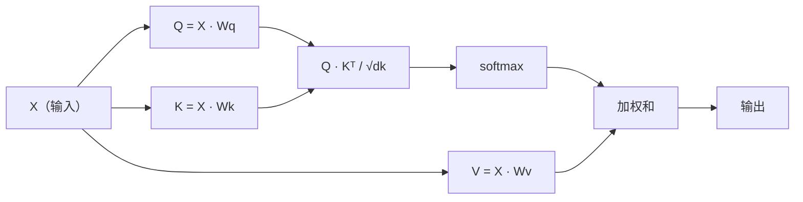

# 从零实现自注意力

> Attention is a lookup table where every word asks "who matters to me?" - and learns the answer.

**Type:** 构建  
**Languages:** Python  
**Prerequisites:** Phase 3 (Deep Learning Core), Phase 5 Lesson 10 (Sequence-to-Sequence)  
**Time:** ~90 分钟

## 学习目标

- 使用仅含 NumPy 的实现，从头实现缩放点积自注意力（scaled dot-product self-attention），包括 query/key/value 的投影和 softmax 加权求和
- 构建一个多头注意力层：拆分 heads、并行计算注意力并拼接结果
- 跟踪注意力矩阵如何捕捉 token 间的关系，并解释为何除以 sqrt(d_k) 能防止 softmax 饱和
- 应用因果掩码将双向注意力转换为自回归（解码器式）注意力

## 问题背景

RNN 按照时间步逐个处理序列。当你处理到第 50 个 token 时，第 1 个 token 的信息已经经过 50 次压缩步骤。长距离依赖被挤压到一个固定大小的隐藏状态中——这是一个瓶颈，任何 LSTM 门控也无法完全解决。

2014 年 Bahdanau 的注意力论文展示了一个修复：让解码器回看每个编码器位置，并决定哪些位置对当前步骤重要。但它仍是附着在 RNN 上的。2017 年的 “Attention Is All You Need” 论文提出了更尖锐的问题：如果注意力是唯一的机制会怎样？没有递归。没有卷积。只有注意力。

自注意力让序列中的每个位置在一个并行步骤内都能关注序列中其它所有位置。这正是 transformer 速度快、可扩展且主导的原因。

## 概念

### 数据库查找类比

把注意力想象成一个软数据库查找：

```
传统数据库：
  Query: "capital of France"  -->  精确匹配  -->  "Paris"

注意力：
  Query: "capital of France"  -->  与所有 keys 的相似度  -->  对所有 values 的加权混合
```

每个 token 生成三个向量：
- **Query (Q)**： “我在寻找什么？”
- **Key (K)**： “我包含了什么？”
- **Value (V)**： “如果被选中，我提供什么信息？”

Query 与所有 Key 的点积会产生注意力分数。高分表示 “这个 key 与我的 query 匹配”。这些分数用于对 values 加权。输出是 values 的加权和。

### Q、K、V 的计算

每个 token 的 embedding 会通过三个可学习的权重矩阵投影：

```
输入嵌入（n 个 token 的序列，每个 d 维）：

  X = [x1, x2, x3, ..., xn]       形状: (n, d)

三个权重矩阵：

  Wq  形状: (d, dk)
  Wk  形状: (d, dk)
  Wv  形状: (d, dv)

投影：

  Q = X @ Wq    形状: (n, dk)      每个 token 的 query
  K = X @ Wk    形状: (n, dk)      每个 token 的 key
  V = X @ Wv    形状: (n, dv)      每个 token 的 value
```

可视化（针对单个 token）：

```
             Wq
  x_i ------[*]------> q_i    "我在寻找什么？"
       |
       |     Wk
       +----[*]------> k_i    "我包含了什么？"
       |
       |     Wv
       +----[*]------> v_i    "我能提供什么？"
```

### 注意力矩阵

当你对所有 token 计算出 Q、K、V 后，注意力分数形成一个矩阵：

```
Scores = Q @ K^T    形状: (n, n)

              k1    k2    k3    k4    k5
        +-----+-----+-----+-----+-----+
   q1   | 2.1 | 0.3 | 0.1 | 0.8 | 0.2 |   <- q1 对每个 key 的关注程度
        +-----+-----+-----+-----+-----+
   q2   | 0.4 | 1.9 | 0.7 | 0.1 | 0.3 |
        +-----+-----+-----+-----+-----+
   q3   | 0.2 | 0.6 | 2.3 | 0.5 | 0.1 |
        +-----+-----+-----+-----+-----+
   q4   | 0.9 | 0.1 | 0.4 | 1.7 | 0.6 |
        +-----+-----+-----+-----+-----+
   q5   | 0.1 | 0.3 | 0.2 | 0.5 | 2.0 |
        +-----+-----+-----+-----+-----+

每一行：一个 token 在整个序列上的注意力分布
```

观看单个 query 逐行扫过 keys：每一行对每个 token 给出分数，softmax 将分数变成权重，context 向量是 values 的加权混合。

```figure
attention-matrix
```

### 为什么要缩放？

点积会随着维度 dk 增大而增大。如果 dk = 64，点积可能达到几十，从而把 softmax 推入梯度消失的区域。解决办法：除以 sqrt(dk)。

```
缩放分数 = (Q @ K^T) / sqrt(dk)
```

这能把值保持在一个使 softmax 产生有效梯度的范围内。

### Softmax 将分数转为权重

Softmax 把原始分数转换成每一行上的概率分布：

```
q1 的原始分数:   [2.1, 0.3, 0.1, 0.8, 0.2]
                            |
                         softmax
                            |
注意力权重:   [0.52, 0.09, 0.07, 0.14, 0.08]   （约和为 1.0）
```

现在每个 token 都有一组权重，表示它对序列中每个位置的关注程度。

### 值的加权和

每个 token 的最终输出是所有 value 向量的加权和：

```
output_i = sum( attention_weight[i][j] * v_j  for all j )

对于 token 1：
  output_1 = 0.52 * v1 + 0.09 * v2 + 0.07 * v3 + 0.14 * v4 + 0.08 * v5
```

### 完整流程



一行公式：

```
Attention(Q, K, V) = softmax( Q @ K^T / sqrt(dk) ) @ V
```

```figure
softmax-attention-scaling
```

## 动手实现

### 步骤 1：从零实现 softmax

Softmax 将原始 logits 转换为概率。为数值稳定性需减去最大值。

```python
import numpy as np

def softmax(x):
    shifted = x - np.max(x, axis=-1, keepdims=True)
    exp_x = np.exp(shifted)
    return exp_x / np.sum(exp_x, axis=-1, keepdims=True)

logits = np.array([2.0, 1.0, 0.1])
print(f"logits:  {logits}")
print(f"softmax: {softmax(logits)}")
print(f"sum:     {softmax(logits).sum():.4f}")
```

### 步骤 2：缩放点积注意力

核心函数。接收 Q、K、V 矩阵并返回注意力输出与权重矩阵。

```python
def scaled_dot_product_attention(Q, K, V):
    dk = Q.shape[-1]
    scores = Q @ K.T / np.sqrt(dk)
    weights = softmax(scores)
    output = weights @ V
    return output, weights
```

### 步骤 3：带可学习投影的自注意力类

完整的自注意力模块，使用类似 Xavier 的缩放初始化 Wq、Wk、Wv。

```python
class SelfAttention:
    def __init__(self, d_model, dk, dv, seed=42):
        rng = np.random.default_rng(seed)
        scale = np.sqrt(2.0 / (d_model + dk))
        self.Wq = rng.normal(0, scale, (d_model, dk))
        self.Wk = rng.normal(0, scale, (d_model, dk))
        scale_v = np.sqrt(2.0 / (d_model + dv))
        self.Wv = rng.normal(0, scale_v, (d_model, dv))
        self.dk = dk

    def forward(self, X):
        Q = X @ self.Wq
        K = X @ self.Wk
        V = X @ self.Wv
        output, weights = scaled_dot_product_attention(Q, K, V)
        return output, weights
```

### 步骤 4：在一句话上运行

为一句话创建假的嵌入并观察注意力权重。

```python
sentence = ["The", "cat", "sat", "on", "the", "mat"]
n_tokens = len(sentence)
d_model = 8
dk = 4
dv = 4

rng = np.random.default_rng(42)
X = rng.normal(0, 1, (n_tokens, d_model))

attn = SelfAttention(d_model, dk, dv, seed=42)
output, weights = attn.forward(X)

print("Attention weights (each row: where that token looks):\n")
print(f"{'':>6}", end="")
for token in sentence:
    print(f"{token:>6}", end="")
print()

for i, token in enumerate(sentence):
    print(f"{token:>6}", end="")
    for j in range(n_tokens):
        w = weights[i][j]
        print(f"{w:6.3f}", end="")
    print()
```

### 步骤 5：用 ASCII 热力图可视化注意力

将注意力权重映射到字符以便快速可视化。

```python
def ascii_heatmap(weights, tokens, chars=" ░▒▓█"):
    n = len(tokens)
    print(f"\n{'':>6}", end="")
    for t in tokens:
        print(f"{t:>6}", end="")
    print()

    for i in range(n):
        print(f"{tokens[i]:>6}", end="")
        for j in range(n):
            level = int(weights[i][j] * (len(chars) - 1) / weights.max())
            level = min(level, len(chars) - 1)
            print(f"{'  ' + chars[level] + '   '}", end="")
        print()

ascii_heatmap(weights, sentence)
```

## 应用（Use It）

PyTorch 的 `nn.MultiheadAttention` 完成了我们构建的全部功能，并包含多头拆分和输出投影：

```python
import torch
import torch.nn as nn

d_model = 8
n_heads = 2
seq_len = 6

mha = nn.MultiheadAttention(embed_dim=d_model, num_heads=n_heads, batch_first=True)

X_torch = torch.randn(1, seq_len, d_model)

output, attn_weights = mha(X_torch, X_torch, X_torch)

print(f"Input shape:            {X_torch.shape}")
print(f"Output shape:           {output.shape}")
print(f"Attention weight shape: {attn_weights.shape}")
print(f"\nAttn weights (averaged over heads):")
print(attn_weights[0].detach().numpy().round(3))
```

关键差别：多头注意力并行运行多个注意力函数，每个都有大小为 dk = d_model / n_heads 的独立 Q、K、V 投影，然后把结果拼接。这使模型能同时关注不同类型的关系。

## 部署产物

本课件会产出：
- `outputs/prompt-attention-explainer.md` - 一个用数据库查找类比解释注意力的提示词

## 练习

1. 修改 `scaled_dot_product_attention` 以接受一个可选的掩码矩阵，该矩阵在 softmax 之前将某些位置设为负无穷（这就是因果/解码器掩码的工作方式）
2. 从头实现多头注意力：将 Q、K、V 拆分为 `n_heads` 段，对每段运行注意力，拼接结果，并通过最终权重矩阵 Wo 投影
3. 取两句相同长度但不同的句子，使用同一个 `SelfAttention` 实例前向传递，比较它们的注意力模式。哪些会变化？哪些保持不变？

## 关键词

| Term | What people say | What it actually means |
|------|----------------|----------------------|
| Query (Q) | "The question vector" | A learned projection of the input that represents what information this token is looking for |
| Key (K) | "The label vector" | A learned projection that represents what information this token contains, matched against queries |
| Value (V) | "The content vector" | A learned projection carrying the actual information that gets aggregated based on attention scores |
| Scaled dot-product attention | "The attention formula" | softmax(QK^T / sqrt(dk)) @ V - scaling prevents softmax saturation in high dimensions |
| Self-attention | "The token looks at itself and others" | Attention where Q, K, V all come from the same sequence, letting every position attend to every other position |
| Attention weights | "How much focus" | A probability distribution over positions, produced by softmax over scaled dot products |
| Multi-head attention | "Parallel attention" | Running multiple attention functions with different projections, then concatenating results for richer representations |

## 延伸阅读

- [Attention Is All You Need (Vaswani et al., 2017)](https://arxiv.org/abs/1706.03762) - Transformer 的原创论文  
- [The Illustrated Transformer (Jay Alammar)](https://jalammar.github.io/illustrated-transformer/) - 最佳的架构可视化讲解  
- [The Annotated Transformer (Harvard NLP)](https://nlp.seas.harvard.edu/annotated-transformer/) - 带解释的逐行 PyTorch 实现