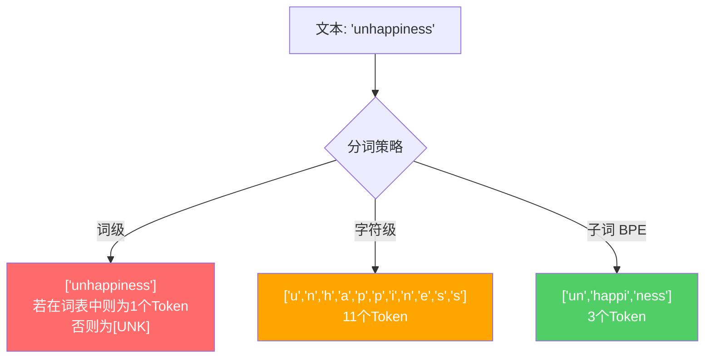
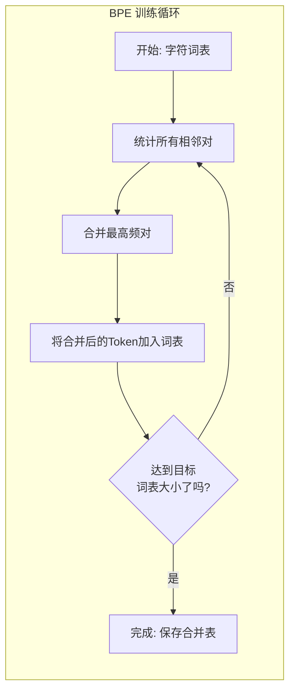
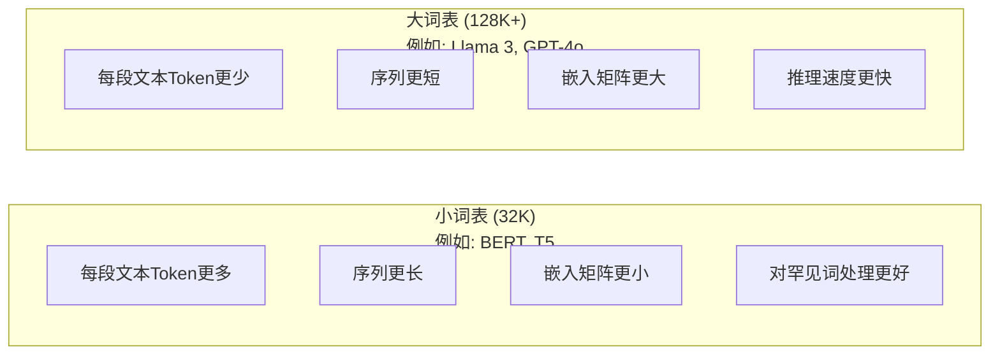

# Tokenizers: BPE, WordPiece, SentencePiece

> 你的大语言模型（LLM）并不阅读英语，它阅读的是整数。分词器（Tokenizer）决定了这些整数是承载了意义，还是被浪费了。

**Type:** Build
**Languages:** Python
**Prerequisites:** Phase 05 (NLP Foundations)
**Time:** ~90 分钟

## 学习目标

- 从零实现 BPE、WordPiece 和 Unigram 分词算法，并比较它们的合并策略
- 解释词表大小（Vocabulary size）如何影响模型效率：词表太小会导致序列过长，词表太大则会浪费嵌入（Embedding）参数
- 分析跨语言和代码的分词伪影（Artifacts），识别特定分词器失效的场景
- 使用 `tiktoken` 和 `sentencepiece` 库对文本进行分词并检查生成的 Token ID

## 问题所在

你的 LLM 不阅读英语，也不阅读任何语言，它只阅读数字。

从 "Hello, world!" 到 [15496, 11, 995, 0] 之间的鸿沟就是分词器。每一个单词、每一个空格、每一个标点符号在模型处理前都必须转换为整数。这种转换并非中立的，它会将一些假设植入模型，且事后无法撤销。

如果处理不当，模型会浪费算力，用多个 Token 来编码常用词。例如，“unfortunately” 被拆分为四个 Token 而不是一个。你的 128K 上下文窗口对于多音节词汇密集的文本来说，实际容量缩水了 75%。如果处理得当，同样的上下文窗口可以承载两倍的意义。“这个模型处理代码很好”与“这个模型在 Python 上表现糟糕”之间的差异，往往归结于分词器的训练方式。

你对 GPT-4 或 Claude 的每一次 API 调用都是按 Token 收费的。模型生成的每一个 Token 都会消耗计算资源。表示输出所需的 Token 越少，端到端的推理速度就越快。分词不是预处理，它是架构的一部分。

## 核心概念

### 三种失败的方法（以及一种成功的方法）

将文本转换为数字有三种显而易见的方法，但其中两种在大规模场景下行不通。

**词级分词（Word-level tokenization）**：按空格和标点符号进行拆分。"The cat sat" 变为 ["The", "cat", "sat"]。这很简单，但“tokenization”怎么办？或者“GPT-4o”？又或者德语复合词“Geschwindigkeitsbegrenzung”？词级分词需要一个巨大的词表来覆盖每种语言中的每个单词。一旦漏掉一个词，你就会得到令人头疼的 `[UNK]` Token——这是模型在说：“我不知道这是什么。”仅英语就有超过一百万种词形。再加上代码、URL、科学计数法以及其他 100 种语言，你需要一个无限大的词表。

**字符级分词（Character-level tokenization）**：走向另一个极端。"hello" 变为 ["h", "e", "l", "l", "o"]。词表非常小（几百个字符），永远不会出现未知 Token。但序列会变得极长。一个在词级分词中只需 10 个 Token 的句子，在字符级分词中会变成 50 个。模型必须学习“t”、“h”、“e”组合在一起意味着“the”——这浪费了模型本应学习更高级逻辑的注意力资源。

**子词分词（Subword tokenization）**：找到了平衡点。常用词保持完整：“the”是一个 Token。罕见词分解为有意义的片段：“unhappiness”变为 ["un", "happi", "ness"]。词表保持在可控范围内（30K 到 128K 个 Token）。序列长度适中。未知 Token 基本消失，因为任何单词都可以由子词片段构建而成。

现代 LLM（GPT-2、GPT-4、BERT、Llama 3、Claude）全部使用子词分词。问题在于使用哪种算法。



### BPE: 字节对编码 (Byte Pair Encoding)

BPE 是一种被重新用于分词的贪心压缩算法。其思想简单到可以写在索引卡片上。

从单个字符开始，统计训练语料库中所有相邻对的频率。将出现频率最高的对合并为一个新的 Token。重复此过程，直到达到目标词表大小。

```figure
tokenizer-bpe
```

以下是 BPE 在包含单词 "lower"、"lowest" 和 "newest" 的微型语料库上的运行过程：

```
语料库（及词频）：
  "lower"  x5
  "lowest" x2
  "newest" x6

第 0 步 -- 从字符开始：
  l o w e r       (x5)
  l o w e s t     (x2)
  n e w e s t     (x6)

第 1 步 -- 统计相邻对：
  (e,s): 8    (s,t): 8    (l,o): 7    (o,w): 7
  (w,e): 13   (e,r): 5    (n,e): 6    ...

第 2 步 -- 合并最高频对 (w,e) -> "we"：
  l o we r        (x5)
  l o we s t      (x2)
  n e we s t      (x6)

第 3 步 -- 重新统计并合并 (e,s) -> "es"：
  l o we r        (x5)
  l o we s t      (x2)    <- 'es' 仅由 'e'+'s' 形成，而非 'we'+'s'
  n e we s t      (x6)    <- 注意 'we' 前后的 'e' 和 's'

精确追踪：
  合并 "we" 后，剩余对：
  (l,o): 7   (o,we): 7   (we,r): 5   (we,s): 8
  (s,t): 8   (n,e): 6    (e,we): 6

第 3 步 -- 合并 (we,s) -> "wes" 或 (s,t) -> "st" (频率均为 8，取前者)：
  合并 (we,s) -> "wes":
  l o we r        (x5)
  l o wes t       (x2)
  n e wes t       (x6)

第 4 步 -- 合并 (wes,t) -> "west":
  l o we r        (x5)
  l o west        (x2)
  n e west        (x6)

...持续进行直到达到目标词表大小。
```

合并表就是分词器。要编码新文本，按学习顺序应用合并规则。训练语料库决定了哪些合并规则存在，这种选择永久性地塑造了模型所看到的内容。



### 字节级 BPE (GPT-2, GPT-3, GPT-4)

标准 BPE 在 Unicode 字符上运行。字节级 BPE 在原始字节（0-255）上运行。这为你提供了正好 256 个的基础词表，可以处理任何语言或编码，且永远不会产生未知 Token。

GPT-2 引入了这种方法。基础词表覆盖了所有可能的字节。BPE 合并是在此基础上构建的。OpenAI 的 `tiktoken` 库实现了字节级 BPE，其词表大小如下：

- GPT-2: 50,257 个 Token
- GPT-3.5/GPT-4: ~100,256 个 Token (cl100k_base 编码)
- GPT-4o: 200,019 个 Token (o200k_base 编码)

### WordPiece (BERT)

WordPiece 看起来与 BPE 相似，但选择合并的方式不同。它不是基于原始频率，而是最大化训练数据的似然性：

```
BPE 合并准则:      count(A, B)
WordPiece 合并准则: count(AB) / (count(A) * count(B))
```

BPE 问：“哪一对出现最频繁？”WordPiece 问：“哪一对在一起出现的频率比偶然预期更高？”这种细微的差别产生了不同的词表。WordPiece 倾向于合并那些共现具有“惊喜感”的对，而不仅仅是高频。

WordPiece 还使用 "##" 前缀来表示后续子词：

```
"unhappiness" -> ["un", "##happi", "##ness"]
"embedding"   -> ["em", "##bed", "##ding"]
```

"##" 前缀告诉你这个片段是前一个 Token 的延续。BERT 使用了包含 30,522 个 Token 的 WordPiece 词表。

### SentencePiece (Llama, T5)

SentencePiece 将输入视为原始 Unicode 字符流，包括空格。没有预分词步骤，也没有针对特定语言的单词边界规则。这使其真正做到了语言无关——它适用于中文、日文、泰文等空格不作为单词分隔符的语言。

SentencePiece 支持两种算法：
- **BPE 模式**：与标准 BPE 相同的合并逻辑，应用于原始字符序列
- **Unigram 模式**：从大词表开始，迭代移除对整体似然性影响最小的 Token。这是 BPE 的逆过程——修剪而非合并。

Llama 2 使用了包含 32,000 个 Token 的 SentencePiece BPE。T5 使用了包含 32,000 个 Token 的 SentencePiece Unigram。注意：Llama 3 切换到了基于 `tiktoken` 的字节级 BPE 分词器，词表大小为 128,256。

### 词表大小的权衡

这是一个具有可衡量后果的工程决策。



具体数字：对于 128K 的词表和 4,096 维的嵌入，仅嵌入矩阵就有 128,000 x 4,096 = 5.24 亿个参数。对于 32K 的词表，则是 1.31 亿个参数。仅分词器的选择就导致了 4 亿个参数的差异。

但更大的词表能更激进地压缩文本。同样的英语段落，32K 词表可能需要 100 个 Token，而 128K 词表可能只需 70 个。这意味着生成过程中前向传播次数减少了 30%。对于处理数百万次请求的模型来说，这是计算成本的直接降低。

趋势很明显：词表大小正在增长。GPT-2 使用 50,257，GPT-4 使用 ~100K，Llama 3 使用 128K，GPT-4o 使用 200K。

| 模型 | 词表大小 | 分词器类型 | 每个英语单词平均 Token 数 |
|-------|-----------|----------------|---------------------------|
| BERT | 30,522 | WordPiece | ~1.4 |
| GPT-2 | 50,257 | 字节级 BPE | ~1.3 |
| Llama 2 | 32,000 | SentencePiece BPE | ~1.4 |
| GPT-4 | ~100,256 | 字节级 BPE | ~1.2 |
| Llama 3 | 128,256 | 字节级 BPE (tiktoken) | ~1.1 |
| GPT-4o | 200,019 | 字节级 BPE | ~1.0 |

### 多语言税

主要针对英语训练的分词器对其他语言非常不友好。GPT-2 分词器处理韩语文本时，平均每个单词需要 2-3 个 Token。中文情况可能更糟。这意味着韩语用户实际拥有的上下文窗口只有英语用户的一半——支付了同样的费用，却获得了更低的信息密度。

这就是为什么 Llama 3 将词表从 32K 扩大到 128K 的原因。为非英语脚本分配更多的 Token 意味着跨语言的压缩更加公平。

```figure
tokenizer-tradeoff
```

## 构建它

### 第 1 步：字符级分词器

从基础开始。字符级分词器将每个字符映射到其 Unicode 码点。无需训练，没有未知 Token，只是直接映射。

```python
class CharTokenizer:
    def encode(self, text):
        return [ord(c) for c in text]

    def decode(self, tokens):
        return "".join(chr(t) for t in tokens)
```

"hello" 变为 [104, 101, 108, 108, 111]。每个字符都是它自己的 Token。这是我们改进的基准。

### 第 2 步：从零实现 BPE 分词器

真正的实现。我们在原始字节上进行训练（像 GPT-2 一样），统计对，合并最高频的，并按顺序记录每次合并。合并表就是分词器。

```python
from collections import Counter

class BPETokenizer:
    def __init__(self):
        self.merges = {}
        self.vocab = {}

    def _get_pairs(self, tokens):
        pairs = Counter()
        for i in range(len(tokens) - 1):
            pairs[(tokens[i], tokens[i + 1])] += 1
        return pairs

    def _merge_pair(self, tokens, pair, new_token):
        merged = []
        i = 0
        while i < len(tokens):
            if i < len(tokens) - 1 and tokens[i] == pair[0] and tokens[i + 1] == pair[1]:
                merged.append(new_token)
                i += 2
            else:
                merged.append(tokens[i])
                i += 1
        return merged

    def train(self, text, num_merges):
        tokens = list(text.encode("utf-8"))
        self.vocab = {i: bytes([i]) for i in range(256)}

        for i in range(num_merges):
            pairs = self._get_pairs(tokens)
            if not pairs:
                break
            best_pair = max(pairs, key=pairs.get)
            new_token = 256 + i
            tokens = self._merge_pair(tokens, best_pair, new_token)
            self.merges[best_pair] = new_token
            self.vocab[new_token] = self.vocab[best_pair[0]] + self.vocab[best_pair[1]]

        return self

    def encode(self, text):
        tokens = list(text.encode("utf-8"))
        for pair, new_token in self.merges.items():
            tokens = self._merge_pair(tokens, pair, new_token)
        return tokens

    def decode(self, tokens):
        byte_sequence = b"".join(self.vocab[t] for t in tokens)
        return byte_sequence.decode("utf-8", errors="replace")
```

训练循环是 BPE 的核心：统计对、合并胜出者、重复。每次合并都会减少总 Token 数。经过 `num_merges` 轮后，词表从 256（基础字节）增长到 256 + num_merges。

编码过程按学习顺序应用合并规则。这很重要。如果合并 1 创建了 "th"，合并 5 创建了 "the"，编码必须先应用合并 1，这样 "the" 才能在合并 5 中由 "th" + "e" 形成。

解码是逆过程：查找每个 Token ID 在词表中的对应项，连接字节，并解码为 UTF-8。

### 第 3 步：编码与解码往返测试

```python
corpus = (
    "The cat sat on the mat. The cat ate the rat. "
    "The dog sat on the log. The dog ate the frog. "
    "Natural language processing is the study of how computers "
    "understand and generate human language. "
    "Tokenization is the first step in any NLP pipeline."
)

tokenizer = BPETokenizer()
tokenizer.train(corpus, num_merges=40)

test_sentences = [
    "The cat sat on the mat.",
    "Natural language processing",
    "tokenization pipeline",
    "unhappiness",
]

for sentence in test_sentences:
    encoded = tokenizer.encode(sentence)
    decoded = tokenizer.decode(encoded)
    raw_bytes = len(sentence.encode("utf-8"))
    ratio = len(encoded) / raw_bytes
    print(f"'{sentence}'")
    print(f"  Tokens: {len(encoded)} (from {raw_bytes} bytes) -- ratio: {ratio:.2f}")
    print(f"  Roundtrip: {'PASS' if decoded == sentence else 'FAIL'}")
```

压缩比告诉我们分词器有多有效。0.50 的比率意味着分词器将文本压缩到了原始字节数的一半。比率越低越好。在训练语料库上，比率会很好。在像 "unhappiness"（未出现在语料库中）这样的分布外文本上，比率会变差——分词器会退回到字符级编码。

### 第 4 步：与 tiktoken 比较

```python
import tiktoken

enc = tiktoken.get_encoding("cl100k_base")

texts = [
    "The cat sat on the mat.",
    "unhappiness",
    "Hello, world!",
    "def fibonacci(n): return n if n < 2 else fibonacci(n-1) + fibonacci(n-2)",
    "Geschwindigkeitsbegrenzung",
]

for text in texts:
    our_tokens = tokenizer.encode(text)
    tiktoken_tokens = enc.encode(text)
    tiktoken_pieces = [enc.decode([t]) for t in tiktoken_tokens]
    print(f"'{text}'")
    print(f"  Our BPE:   {len(our_tokens)} tokens")
    print(f"  tiktoken:  {len(tiktoken_tokens)} tokens -> {tiktoken_pieces}")
```

`tiktoken` 使用完全相同的算法，但在数千亿字节的文本上进行了训练，并进行了 100,000 次合并。算法是一样的，区别在于训练数据和合并次数。你的分词器在一段文本上训练了 40 次合并，无法与 `tiktoken` 在海量语料库上的 100K 次合并相比。但机制是相同的。

### 第 5 步：词表分析

```python
def analyze_vocabulary(tokenizer, test_texts):
    total_tokens = 0
    total_chars = 0
    token_usage = Counter()

    for text in test_texts:
        encoded = tokenizer.encode(text)
        total_tokens += len(encoded)
        total_chars += len(text)
        for t in encoded:
            token_usage[t] += 1

    print(f"词表大小: {len(tokenizer.vocab)}")
    print(f"所有文本的总 Token 数: {total_tokens}")
    print(f"总字符数: {total_chars}")
    print(f"每个字符平均 Token 数: {total_tokens / total_chars:.2f}")

    print(f"\n最常用的 Token:")
    for token_id, count in token_usage.most_common(10):
        token_bytes = tokenizer.vocab[token_id]
        display = token_bytes.decode("utf-8", errors="replace")
        print(f"  Token {token_id:4d}: '{display}' (使用 {count} 次)")

    unused = [t for t in tokenizer.vocab if t not in token_usage]
    print(f"\n未使用的 Token: {len(unused)} / {len(tokenizer.vocab)}")
```

这揭示了词表中的 Zipf 分布。少数 Token 占据主导地位（空格、"the"、"e"）。大多数 Token 很少使用。生产级分词器会针对这种分布进行优化——常用模式获得较短的 Token ID，罕见模式获得较长的表示。

## 使用它

你的 BPE 实现已经可以工作了。现在看看生产工具是什么样的。

### tiktoken (OpenAI)

```python
import tiktoken

enc = tiktoken.get_encoding("cl100k_base")

text = "Tokenizers convert text to integers"
tokens = enc.encode(text)
print(f"Tokens: {tokens}")
print(f"Pieces: {[enc.decode([t]) for t in tokens]}")
print(f"Roundtrip: {enc.decode(tokens)}")
```

`tiktoken` 是用 Rust 编写的，带有 Python 绑定。它每秒可编码数百万个 Token。相同的 BPE 算法，工业级的实现。

### Hugging Face tokenizers

```python
from tokenizers import Tokenizer
from tokenizers.models import BPE
from tokenizers.trainers import BpeTrainer
from tokenizers.pre_tokenizers import ByteLevel

tokenizer = Tokenizer(BPE())
tokenizer.pre_tokenizer = ByteLevel()

trainer = BpeTrainer(vocab_size=1000, special_tokens=["<pad>", "<eos>", "<unk>"])
tokenizer.train(["corpus.txt"], trainer)

output = tokenizer.encode("The cat sat on the mat.")
print(f"Tokens: {output.tokens}")
print(f"IDs: {output.ids}")
```

Hugging Face 的 `tokenizers` 库底层也是 Rust。它可以在几秒钟内对 GB 级的语料库进行 BPE 训练。这是你训练自己的模型时应该使用的工具。

### 加载 Llama 的分词器

```python
from transformers import AutoTokenizer

tokenizer = AutoTokenizer.from_pretrained("meta-llama/Llama-3.1-8B")

text = "Tokenizers are the unsung heroes of LLMs"
tokens = tokenizer.encode(text)
print(f"Token IDs: {tokens}")
print(f"Tokens: {tokenizer.convert_ids_to_tokens(tokens)}")
print(f"词表大小: {tokenizer.vocab_size}")

multilingual = ["Hello world", "Hola mundo", "Bonjour le monde"]
for text in multilingual:
    ids = tokenizer.encode(text)
    print(f"'{text}' -> {len(ids)} tokens")
```

Llama 3 的 128K 词表对非英语文本的压缩效果明显优于 GPT-2 的 50K 词表。你可以自己验证这一点——用多种语言编码同一个句子并计算 Token 数。

## 发布它

本课程生成 `outputs/prompt-tokenizer-analyzer.md` —— 一个可重用的提示词，用于分析任何文本和模型组合的分词效率。输入一个文本样本，它会告诉你哪个模型的分词器处理得最好。

## 练习

1. 修改 BPE 分词器，在每次合并步骤打印词表。观察 "t" + "h" 如何变成 "th"，然后 "th" + "e" 如何变成 "the"。追踪常用英语单词是如何一点点组装起来的。
2. 为 BPE 分词器添加特殊 Token (`<pad>`, `<eos>`, `<unk>`)。为它们分配 ID 0, 1, 2，并相应地移动所有其他 Token。实现一个预分词步骤，在运行 BPE 之前按空格进行拆分。
3. 实现 WordPiece 合并准则（似然比而非频率）。在同一个语料库上使用相同的合并次数训练 BPE 和 WordPiece。比较生成的词表——哪一个产生了更多语言学上有意义的子词？
4. 构建一个多语言分词效率基准。选取英语、西班牙语、中文、韩语和阿拉伯语的 10 个句子。使用 `tiktoken` (cl100k_base) 对每个句子进行分词，并测量每个字符的平均 Token 数。量化每种语言的“多语言税”。
5. 在更大的语料库（下载一篇维基百科文章）上训练你的 BPE 分词器。调整合并次数，使压缩比达到与 `tiktoken` 在同一文本上压缩比的 10% 以内。这会迫使你理解语料库大小、合并次数和压缩质量之间的关系。

## 关键术语

| 术语 | 人们常说的 | 实际含义 |
|------|----------------|----------------------|
| Token | "一个单词" | 模型词表中的一个单元——可以是字符、子词、单词或多词块 |
| BPE | "某种压缩东西" | 字节对编码——迭代合并最高频的相邻 Token 对，直到达到目标词表大小 |
| WordPiece | "BERT 的分词器" | 类似于 BPE，但合并准则是最大化似然比 count(AB)/(count(A)*count(B)) 而非原始频率 |
| SentencePiece | "一个分词库" | 一种语言无关的分词器，在原始 Unicode 上运行，无需预分词，支持 BPE 和 Unigram 算法 |
| 词表大小 | "它认识多少单词" | 唯一 Token 的总数：GPT-2 有 50,257，BERT 有 30,522，Llama 3 有 128,256 |
| 肥力 (Fertility) | "不是分词术语" | 每个单词的平均 Token 数——衡量跨语言的分词效率（1.0 为完美，3.0 意味着模型工作量增加了三倍） |
| 字节级 BPE | "GPT 的分词器" | 在原始字节 (0-255) 而非 Unicode 字符上运行的 BPE，保证对任何输入都没有未知 Token |
| 合并表 | "分词器文件" | 训练期间学习到的有序对合并列表——这才是分词器的核心，且顺序很重要 |
| 预分词 | "按空格拆分" | 在子词分词之前应用的规则：空格拆分、数字分离、标点处理 |
| 压缩比 | "分词器有多高效" | 生成的 Token 数除以输入字节数——比率越低意味着压缩越好，推理越快 |

## 延伸阅读

- [Sennrich et al., 2016 -- "Neural Machine Translation of Rare Words with Subword Units"](https://arxiv.org/abs/1508.07909) -- 引入 BPE 到 NLP 的论文，将 1994 年的压缩算法变成了现代分词的基础
- [Kudo & Richardson, 2018 -- "SentencePiece: A simple and language independent subword tokenizer"](https://arxiv.org/abs/1808.06226) -- 使多语言模型变得实用的语言无关分词技术
- [OpenAI tiktoken repository](https://github.com/openai/tiktoken) -- 生产级的 Rust 实现，带有 Python 绑定，被 GPT-3.5/4/4o 使用
- [Hugging Face Tokenizers documentation](https://huggingface.co/docs/tokenizers) -- 具有 Rust 性能的生产级分词器训练库