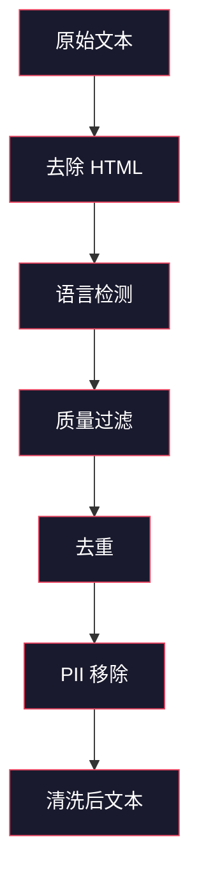

# 预训练用数据管道

> 模型是一面镜子。它反映你喂给它的任何数据。喂给它垃圾，它会以完美的流畅度反映出垃圾。

**Type:** 构建  
**Languages:** Python  
**Prerequisites:** 第10阶段，课程 01-02（分词器，构建分词器）  
**Time:** ~90 分钟

## 学习目标

- 构建一个流式数据管道，能够在不将全部数据加载到内存的情况下对 TB 级文本进行分词、分块、打乱与批处理
- 实现真实预训练流水线中使用的数据质量过滤（去重、语言检测、内容过滤）
- 生成固定长度的训练序列，包含正确的 attention mask 以及文档边界处理
- 对管道吞吐量进行分析，以确保数据加载速度跟上 GPU 训练速度

## 问题描述

你有一个分词器。现在你需要数据。

不是一个数据集，不是一个 CSV 文件。是 TB 级文本 —— 已清洗、去重、过滤质量、被分词成固定长度序列，并以随机批次的速度提供，快到让你的 8-GPU 集群永远不会等待下一个 batch。

大多数人认为训练一个 LLM 是关于模型架构的。事实并非如此。Llama 3 使用了 15.6 万亿（15.6T）token。GPT-3 使用了 3000 亿。DeepSeek-V2 使用了 8.1 万亿。三者的架构大致相同：堆叠的 transformer 模块，包含注意力层和前馈层。输出质量的差异绝大多数来自数据。

DeepMind 的 Chinchilla 论文把这一点量化了。对于给定的计算预算，有一个参数数量与训练 token 数量的最优比率。Chinchilla 表明 2022 年的大多数模型都严重欠训 —— 相对于它们看到的数据量参数太多。一个 700 亿参数模型在 1.4 万亿 token（Chinchilla 最优）上的训练效果，超过了一个 2800 亿参数在 3000 亿 token 上训练的模型（Gopher）。

你的数据管道决定了你的模型是学会语言，还是学会噪声。

## 概念

### 数据来源

每个大型语言模型都在多种来源的混合数据上训练。确切组成对大多数实验室来说是高度保密的，但我们知道足够的类别来理解总体情况。

| Source | Size | Quality | Used By |
|--------|------|---------|---------|
| Common Crawl | ~250 TB raw | 低（需要大量过滤） | GPT-3、Llama、大多数开源模型 |
| Wikipedia | ~20 GB | 高 | 每个主要的 LLM |
| GitHub code | ~1 TB+ | 中等（大量重复、死代码） | StarCoder、CodeLlama、DeepSeek-Coder |
| Books (BookCorpus, Pile) | ~100 GB | 高 | GPT-2、GPT-3、早期模型 |
| Academic papers (arXiv, S2ORC) | ~100 GB | STEM 领域高质量 | Llama、Galactica |
| StackOverflow, Reddit | ~100 GB | 中等 | Llama、Falcon |
| Curated web (C4, RefinedWeb) | ~5 TB | 中高（已预过滤） | T5、Falcon |

Llama 3 披露了其数据组合：约 50% 为网页数据，25% 为代码，13% 为书籍和学术论文，8% 为数学数据，4% 为多语种网页数据。总计来自超过 5 TB 原始文本，合计 15.6 万亿 token。

比率与总体规模一样重要。网页数据过多，模型会变成 Reddit 鹦鹉。代码太少，无法编程。数学数据太少，推理能力不足。把这个混合比例弄对是训练 LLM 最困难的部分之一，并且没有公式 —— 需要实验与评估。

### 数据清洗

原始网页数据非常脏。一份典型的 Common Crawl 转储包含：

- HTML 标签与 JavaScript
- 模板页眉、页脚、导航菜单
- 重复页面（完全重复与近似重复）
- 机器生成的垃圾内容
- 个人可识别信息（PII）
- 低质量文本（关键词列表、SEO 垃圾）
- 被当作文本编码的非文本内容

清洗不是可选项。这决定了一个模型是输出连贯段落，还是混合输出 HTML 标签和商品列表。



每一步都会消除一类噪声：

**去除 HTML：** 删除所有标记。只保留可见文本内容。像 `trafilatura` 或 `readability` 这样的库在丢弃导航、广告和模板内容的同时提取文章主体。

**语言检测：** 使用 fastText 的语言识别模型（lid.176.bin）对每个文档进行分类。过滤到目标语言。被判定为英语且置信度低于 0.8 的文档很可能不是干净的英语。

**质量过滤：** 这里更有趣。RefinedWeb（Falcon 背后的数据集）使用基于困惑度的过滤：在 Wikipedia 上训练一个小型语言模型，然后给每个文档打分。高困惑度意味着该文档与 Wikipedia 不同 —— 很可能是垃圾、关键词列表或机器生成内容。困惑度高于阈值的文档会被移除。

**去重：** 单个最有影响力的清洗步骤。Common Crawl 包含大量重复页面 —— 法律免责声明、cookie 通知、服务条款等。对重复文档进行训练浪费计算资源，并可能导致模型记忆并逐字复述特定段落。

**PII 移除：** 名字、电子邮件地址、电话号码、社会保障号码。对结构化 PII 使用正则检测，对上下文中的姓名使用 NER 模型。

### 使用 MinHash 的去重

精确去重很容易：为每个文档做哈希并删除重复。但近似重复是真正的问题。两份同一新闻文章的副本周围广告稍有不同就是近似重复。内容 95% 相同，但逐字节不同。

MinHash + 局部敏感哈希（LSH）能够高效解决这个问题。


思路：

1. **分片（Shingling）：** 将每个文档转换为 n-gram 集合（例如基于词或字符的 5-gram）。例如 "the quick brown fox" 用 3-词 shingles 得到 {"the quick brown", "quick brown fox"}。

2. **MinHash：** 对每个文档的 shingle 集合计算 k 个哈希值。每个哈希值是在不同哈希函数下所有 shingles 的最小哈希值。这样得到一个固定大小的“签名”，可近似估计任意两份文档之间的 Jaccard 相似度。

3. **LSH：** 基于 MinHash 签名的若干 band（段）将文档分入桶。位于同一桶内的文档是候选近似重复。这避免了对每一对文档的比较 —— 只比较候选集即可。

4. **校验：** 对每个候选对计算精确的 Jaccard 相似度。如果相似度超过阈值（通常为 0.8），则移除其中一份。

Llama 团队报告通过去重大约移除了 38% 的网页数据。这不是一个小数字。超过三分之一的 Common Crawl 内容是重复或近似重复内容。

### 序列打包（Sequence Packing）

模型期望固定长度的输入序列，而文档长度可变。有些文档只有 50 token，有些则有 50,000 token。

简单方法：将每个文档填充到最大序列长度。这会在填充 token 上浪费大量计算，这些 token 对学习没有贡献。

更好的方法：把多个文档打包到同一序列中，用 end-of-sequence token 分隔。一个 2048-token 的序列可能包含三个简短文档，通过 [EOS] 令牌连接。

```mermaid
graph TD
    subgraph 原始填充（Naive Packing）
        A1["文档 A（200 tokens）"] --> P1["[PAD] x 1848"]
        A2["文档 B（500 tokens）"] --> P2["[PAD] x 1548"]
        A3["文档 C（100 tokens）"] --> P3["[PAD] x 1948"]
    end

    subgraph 高效打包（Efficient Packing）
        B1["文档 A（200） | 文档 B（500） | 文档 C（100） | 文档 D（400） | 文档 E（848）"]
    end

    style A1 fill:#1a1a2e,stroke:#e94560,color:#fff
    style A2 fill:#1a1a2e,stroke:#e94560,color:#fff
    style A3 fill:#1a1a2e,stroke:#e94560,color:#fff
    style P1 fill:#333,stroke:#666,color:#999
    style P2 fill:#333,stroke:#666,color:#999
    style P3 fill:#333,stroke:#666,color:#999
    style B1 fill:#1a1a2e,stroke:#16c784,color:#fff
```

attention mask 必须设置正确。同一打包序列中来自文档 A 的 token 不应该关注（attend）文档 B 的 token。这需要一个块对角（block-diagonal）的 attention mask。

较长文档会在序列边界处被截断或分割。分割点很重要：在句子中间分割会迫使模型看到不完整的想法。一些流水线在可能时会将分割与段落或句子边界对齐。

### Chinchilla 缩放定律

对于固定的计算预算 C（以 FLOPs 计），最优的模型规模 N 和数据集大小 D 遵循：

```
N_opt ~ C^0.5
D_opt ~ C^0.5
```

在实践中，这意味着你应当使模型规模和数据规模大致等比例增长。参数数量多 10 倍的模型需要大约 10 倍的训练 token 才能达到相同的损失。

| Model | Parameters | Training Tokens | Chinchilla-Optimal? |
|-------|-----------|----------------|-------------------|
| GPT-3 | 175B | 300B | 否（欠训约 3-4 倍） |
| Chinchilla | 70B | 1.4T | 是（按设计） |
| Llama 2 | 70B | 2T | 过度训练（有意） |
| Llama 3 | 70B | 15T | 严重过度训练 |

Llama 3 故意违反了 Chinchilla 规律。Meta 发现对更多数据进行过度训练 —— 远超计算最优比率 —— 在推理时能得到更好的模型。额外的训练成本只需支付一次，但更小的模型部署成本更低，长期更划算。这有时被称为“推理最优”缩放方法，自 2024 年起成为行业标准。

## 开始构建

### 步骤 1：文本清洗

去除 HTML，规范化空白，移除非文本内容。我们将使用公共领域文本（古腾堡项目，Project Gutenberg）作为小型语料。

```python
import re

def clean_text(text):
    text = re.sub(r"<[^>]+>", "", text)
    text = re.sub(r"http\S+", "", text)
    text = re.sub(r"[^\x20-\x7E\n]", "", text)
    text = re.sub(r"\n{3,}", "\n\n", text)
    text = re.sub(r" {2,}", " ", text)
    return text.strip()

def quality_filter(text, min_words=50, max_ratio_caps=0.3, max_ratio_special=0.1):
    words = text.split()
    if len(words) < min_words:
        return False
    caps_ratio = sum(1 for w in words if w.isupper()) / len(words)
    if caps_ratio > max_ratio_caps:
        return False
    special_chars = sum(1 for c in text if not c.isalnum() and not c.isspace())
    if special_chars / max(len(text), 1) > max_ratio_special:
        return False
    return True
```

质量过滤会捕捉到 SEO 垃圾（全大写）、机器生成噪声（高特殊字符比例）和内容太短的页面。这三项检查就能从网页爬取数据中剔除大量垃圾。

### 步骤 2：MinHash 去重

从零实现 MinHash。无需外部库 —— 仅用 `hashlib`。

```python
import hashlib
from collections import defaultdict

def get_shingles(text, k=5):
    words = text.lower().split()
    if len(words) < k:
        return set()
    return {" ".join(words[i:i+k]) for i in range(len(words) - k + 1)}

def minhash_signature(shingles, num_hashes=128):
    signature = []
    for i in range(num_hashes):
        min_hash = float("inf")
        for shingle in shingles:
            h = int(hashlib.sha256(f"{i}:{shingle}".encode()).hexdigest(), 16)
            min_hash = min(min_hash, h)
        signature.append(min_hash)
    return signature

def lsh_buckets(signature, bands=16):
    rows_per_band = len(signature) // bands
    buckets = []
    for b in range(bands):
        start = b * rows_per_band
        band_data = tuple(signature[start:start + rows_per_band])
        bucket_hash = hashlib.md5(str(band_data).encode()).hexdigest()
        buckets.append((b, bucket_hash))
    return buckets

def deduplicate(documents, threshold=0.8, num_hashes=128, bands=16):
    signatures = []
    shingle_sets = []
    for doc in documents:
        shingles = get_shingles(doc)
        shingle_sets.append(shingles)
        signatures.append(minhash_signature(shingles, num_hashes))

    bucket_map = defaultdict(list)
    for doc_idx, sig in enumerate(signatures):
        for band_id, bucket_hash in lsh_buckets(sig, bands):
            bucket_map[(band_id, bucket_hash)].append(doc_idx)

    duplicate_pairs = set()
    for bucket_docs in bucket_map.values():
        if len(bucket_docs) < 2:
            continue
        for i in range(len(bucket_docs)):
            for j in range(i + 1, len(bucket_docs)):
                duplicate_pairs.add((bucket_docs[i], bucket_docs[j]))

    removed = set()
    for i, j in duplicate_pairs:
        if i in removed or j in removed:
            continue
        s1, s2 = shingle_sets[i], shingle_sets[j]
        if not s1 or not s2:
            continue
        jaccard = len(s1 & s2) / len(s1 | s2)
        if jaccard >= threshold:
            removed.add(j)

    return [doc for idx, doc in enumerate(documents) if idx not in removed], len(removed)
```

`num_hashes=128` 和 `bands=16` 控制精确度与召回的折中。更多的哈希会带来更准确的相似度估计。更多的 band 会提高召回（捕获更多重复），但会增加假阳性。这些参数对典型网页文本表现良好。

### 步骤 3：分词与序列打包

对清洗并去重后的文本进行分词，并打包成用于训练的固定长度序列。

```python
def tokenize_corpus(documents, tokenizer):
    all_tokens = []
    for doc in documents:
        tokens = tokenizer.encode(doc)
        all_tokens.extend(tokens)
        all_tokens.append(tokenizer.eos_id)
    return all_tokens

def pack_sequences(token_ids, seq_length, pad_id=0):
    sequences = []
    attention_masks = []
    for i in range(0, len(token_ids), seq_length):
        seq = token_ids[i:i + seq_length]
        mask = [1] * len(seq)
        if len(seq) < seq_length:
            pad_count = seq_length - len(seq)
            seq = seq + [pad_id] * pad_count
            mask = mask + [0] * pad_count
        sequences.append(seq)
        attention_masks.append(mask)
    return sequences, attention_masks
```

### 步骤 4：训练用 DataLoader

生成打乱的打包序列批次。这是训练循环所消费的内容。

```python
import random

class PreTrainingDataLoader:
    def __init__(self, sequences, attention_masks, batch_size, shuffle=True):
        self.sequences = sequences
        self.attention_masks = attention_masks
        self.batch_size = batch_size
        self.shuffle = shuffle

    def __len__(self):
        return (len(self.sequences) + self.batch_size - 1) // self.batch_size

    def __iter__(self):
        indices = list(range(len(self.sequences)))
        if self.shuffle:
            random.shuffle(indices)
        for start in range(0, len(indices), self.batch_size):
            batch_idx = indices[start:start + self.batch_size]
            batch_seqs = [self.sequences[i] for i in batch_idx]
            batch_masks = [self.attention_masks[i] for i in batch_idx]
            yield batch_seqs, batch_masks
```

### 步骤 5：数据集统计

计算关键指标：总 token 数、唯一 token 数、压缩比、文档长度分布等。

```python
from collections import Counter

def compute_statistics(documents, token_ids, sequences, tokenizer_vocab_size):
    total_chars = sum(len(d) for d in documents)
    total_tokens = len(token_ids)
    unique_tokens = len(set(token_ids))
    compression_ratio = total_chars / total_tokens

    doc_lengths = [len(d.split()) for d in documents]
    avg_doc_length = sum(doc_lengths) / max(len(doc_lengths), 1)
    max_doc_length = max(doc_lengths) if doc_lengths else 0
    min_doc_length = min(doc_lengths) if doc_lengths else 0

    token_counts = Counter(token_ids)
    top_tokens = token_counts.most_common(10)

    non_pad_tokens = sum(sum(1 for t in seq if t != 0) for seq in sequences)
    total_positions = sum(len(seq) for seq in sequences)
    utilization = non_pad_tokens / max(total_positions, 1)

    stats = {
        "total_documents": len(documents),
        "total_characters": total_chars,
        "total_tokens": total_tokens,
        "unique_tokens": unique_tokens,
        "vocab_utilization": unique_tokens / tokenizer_vocab_size,
        "compression_ratio": compression_ratio,
        "avg_doc_length_words": avg_doc_length,
        "max_doc_length_words": max_doc_length,
        "min_doc_length_words": min_doc_length,
        "num_sequences": len(sequences),
        "sequence_utilization": utilization,
        "top_10_tokens": top_tokens,
    }
    return stats
```

压缩比告诉你分词器在该语料上的效率。英语文本通常压缩到约每个 token 3-4 个字符。如果看到约 1.5 个字符/ token，说明分词器分得过细。如果看到 8+，说明它学到了非常领域化的合并。

序列利用率告诉你打包序列中真实数据相对于填充的比例。低于 90% 表示打包效率低 —— 你在填充 token 上浪费计算。

## 使用方法

### 与 HuggingFace Datasets 比较

通过 HuggingFace 的 datasets 库加载相同语料并比较流水线速度。

```python
from datasets import load_dataset
from transformers import AutoTokenizer

ds = load_dataset("wikitext", "wikitext-2-raw-v1", split="train")
tokenizer = AutoTokenizer.from_pretrained("meta-llama/Meta-Llama-3-8B")

import time

start = time.time()
tokenized = ds.map(
    lambda x: tokenizer(x["text"], truncation=True, max_length=2048),
    batched=True,
    num_proc=4,
)
hf_time = time.time() - start
total_tokens = sum(len(t) for t in tokenized["input_ids"])
print(f"HuggingFace: {total_tokens:,} tokens in {hf_time:.2f}s ({total_tokens/hf_time:,.0f} tokens/sec)")
```

HuggingFace 流水线在底层使用 Rust 实现的分词器并跨 4 个核心并行处理。你的纯 Python 管道会慢 10-50 倍。正是这个差距促使生产团队使用已编译的分词器。算法相同，实现语言决定了差异。

## 部署

本课产生了一个用于校验和调试 LLM 训练流水线中数据质量的提示（prompt）。见 `outputs/prompt-data-quality-checker.md`。

## 练习

1. 简单：在清洗流水线中添加语言检测，使用简单启发式（字符集分析）。过滤为仅保留英语文档，并统计被移除的文档数量。
2. 中等：在 MinHash 近似去重的基础上实现基于 SHA-256 的精确去重。比较两种方法在网页爬取语料上捕获的重复数量。
3. 困难：构建基于困惑度（perplexity）的质量过滤器。在 Wikipedia 文本上训练一个小型二元（bigram）语言模型，为每个文档计算困惑度，并移除最低的 20%。比较在过滤与未过滤数据上训练的模型输出质量。

## 关键术语

| Term | What people say | What it actually means |
|------|----------------|----------------------|
| Common Crawl | "The internet" | 一个每月抓取网页的非营利组织 —— 约 250TB 原始数据，是大多数 LLM 训练数据的起点 |
| MinHash | "Some hashing trick" | 一种用固定大小签名估计集合间 Jaccard 相似度的技术 —— 使得大规模近似去重成为可能 |
| LSH | "Locality-Sensitive Hashing" | 一种将相似项分组到同一桶中的方法 —— 将成对比较从 O(n^2) 降到近线性 |
| Sequence packing | "Concatenating documents" | 将多个文档装入固定长度序列并设置正确的 attention mask —— 消除填充浪费 |
| Chinchilla scaling | "Train on more data" | 对固定计算预算，最优性能要求模型规模与训练 token 数大致等比增长 |
| Fertility | "Tokens per word" | 每词平均 token 数 —— GPT-4 中英语约为 1.3，非拉丁文字会更高 |
| Data mixing | "Choosing training data" | 代码、文本、数学、多语种数据的比例 —— 无公式，需实验 |
| Perplexity filter | "Quality scoring" | 使用小型语言模型为文档打分 —— 高困惑度表示文本与干净参考数据差异大 |
| Deduplication | "Removing copies" | 消除完全与近似重复文档 —— 通常会移除 30-40% 的原始网页数据 |
| Attention mask | "Which tokens to look at" | 一个二值掩码，防止在打包序列中跨文档的 attention |

（注：本文中部分术语的标准翻译示例：Prompt engineering -> 提示词工程，RAG -> RAG，Embeddings -> 嵌入，Fine-tuning -> 微调，Context window -> 上下文窗口，few-shot -> 少样本，chain-of-thought -> 思维链，guardrails -> 护栏，function calling -> 函数调用，speculative decoding -> 投机性解码，positional embeddings -> 位置嵌入，self-attention -> 自注意力，instruction tuning -> 指令微调，distributed training -> 分布式训练，Model Context Protocol -> 模型上下文协议。）

## 延伸阅读

- [Hoffmann et al., 2022 -- Training Compute-Optimal Large Language Models (Chinchilla)](https://arxiv.org/abs/2203.15556) -- 改变我们对数据规模思考方式的论文
- [Penedo et al., 2023 -- The RefinedWeb Dataset for Falcon LLM](https://arxiv.org/abs/2306.01116) -- 如何将 Common Crawl 过滤为高质量数据
- [Touvron et al., 2023 -- Llama 2: Open Foundation and Fine-Tuned Chat Models](https://arxiv.org/abs/2307.09288) -- Llama 2 的数据流水线细节
- [Lee et al., 2022 -- Deduplicating Training Data Makes Language Models Better](https://arxiv.org/abs/2107.06499) -- 为什么去重比你想的更重要
- [Broder, 1997 -- On the Resemblance and Containment of Documents](https://ieeexplore.ieee.org/document/666900) -- 原始 MinHash 论文
- [Meta, 2024 -- Llama 3 Technical Report](https://arxiv.org/abs/2407.21783) -- 15.6T token，数据混合比例与过滤流水线