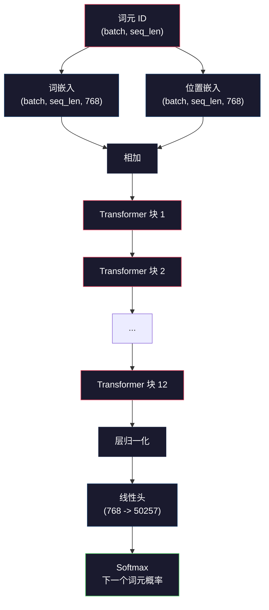
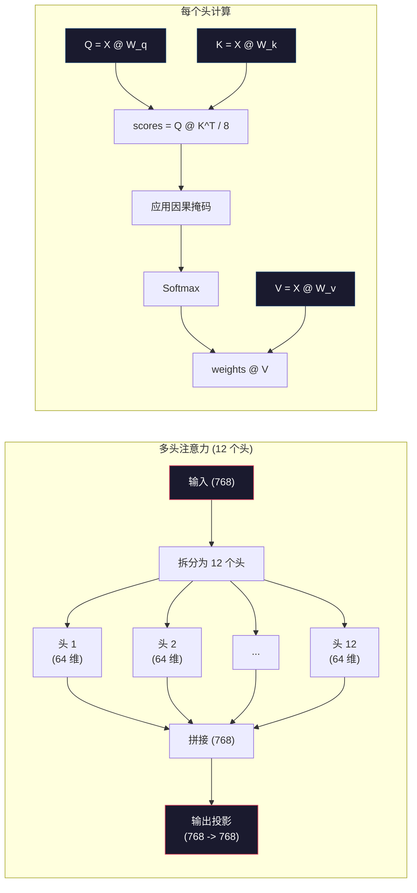
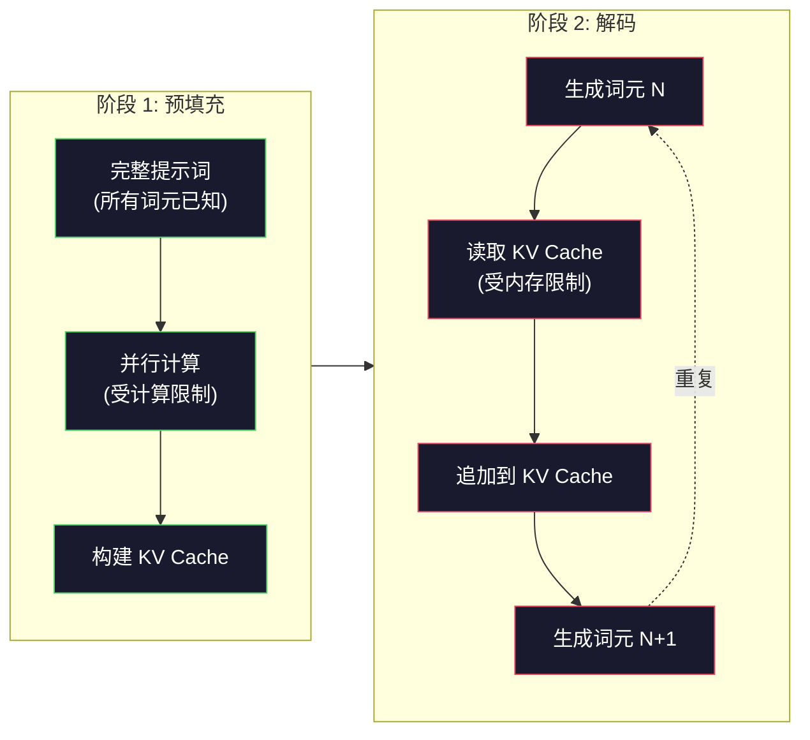

# 预训练一个迷你 GPT (124M 参数)

> GPT-2 Small 拥有 1.24 亿个参数。它包含 12 层 Transformer、12 个注意力头以及 768 维的嵌入。你可以在单张 GPU 上用几个小时从零开始训练它。大多数人从未这样做过，他们通常直接使用预训练好的检查点（checkpoints）。但如果你不亲自训练一个，你就无法真正理解你所构建的产品背后的模型内部到底发生了什么。

**Type:** Build
**Languages:** Python (使用 numpy)
**Prerequisites:** 第 10 阶段，第 01-03 课（分词器、构建分词器、数据流水线）
**Time:** ~120 分钟

## 学习目标

- 从零实现完整的 GPT-2 架构（124M 参数）：词嵌入、位置嵌入、Transformer 块以及语言模型头（Language Model Head）
- 使用交叉熵损失（Cross-Entropy Loss）通过下一个词预测（Next-token prediction）在文本语料库上训练 GPT 模型
- 实现带有温度采样（Temperature Sampling）和 Top-k/Top-p 过滤的自回归文本生成
- 监控训练损失曲线，并验证模型是否学习到了连贯的语言模式

## 问题所在

你知道什么是 Transformer。你读过相关的图表。你可以背诵“Attention Is All You Need”，也能在白板上画出标有“多头注意力（Multi-Head Attention）”的方框。

但这并不意味着你理解模型在生成文本时到底发生了什么。

GPT-2 Small（使用权重绑定）共有 124,438,272 个参数。每一个参数都是通过运行训练循环设置的：前向传播、计算损失、反向传播、更新权重。十二个 Transformer 块。每个块有十二个注意力头。一个 768 维的嵌入空间。一个包含 50,257 个词元的词表。每当模型生成一个词元时，所有 1.24 亿个参数都会参与到一个矩阵乘法链中，该链接收一系列词元 ID 并生成下一个词元的概率分布。

如果你从未亲手构建过它，你就是在面对一个黑盒。你可以调用 API，可以进行微调。但当出现问题时——比如模型产生幻觉、重复自身、拒绝遵循指令——你将无法从心理模型上理解“为什么”。

本课将从零开始构建 GPT-2 Small。不是用 PyTorch，而是用 numpy。每一个矩阵乘法都是可见的。每一个梯度都是由你的代码计算出来的。你将确切地看到 1.24 亿个数字是如何协同工作来预测下一个词的。

## 核心概念

### GPT 架构

GPT 是一种自回归语言模型。“自回归”意味着它一次生成一个词元，每个词元的生成都以之前所有的词元为条件。该架构是一堆 Transformer 解码器块（Decoder blocks）的堆叠。

以下是从词元 ID 到下一个词元概率的完整计算图：

1. 输入词元 ID。形状：(batch_size, seq_len)。
2. 词嵌入查找。每个 ID 映射到一个 768 维的向量。形状：(batch_size, seq_len, 768)。
3. 位置嵌入查找。每个位置 (0, 1, 2, ...) 映射到一个 768 维的向量。形状相同。
4. 将词嵌入与位置嵌入相加。
5. 通过 12 个 Transformer 块。
6. 最终层归一化（Layer Normalization）。
7. 线性投影到词表大小。形状：(batch_size, seq_len, vocab_size)。
8. Softmax 得到概率。

这就是整个模型。没有卷积，没有循环。只有嵌入、注意力、前馈网络和层归一化，堆叠了 12 次。



### Transformer 块

12 个块中的每一个都遵循相同的模式。采用预归一化（Pre-norm）架构（GPT-2 使用预归一化，而不是原始 Transformer 中的后归一化）：

1. 层归一化
2. 多头自注意力
3. 残差连接（将输入加回）
4. 层归一化
5. 前馈网络 (MLP)
6. 残差连接（将输入加回）

残差连接至关重要。没有它们，在反向传播过程中，梯度到达第 1 块时就会消失。有了它们，梯度可以通过“跳跃”路径直接从损失函数流向任何一层。这就是为什么你可以堆叠 12、32 甚至 96 个块（据传 GPT-4 使用了 120 层）。

### 注意力：核心机制

自注意力让每个词元都能查看之前的所有词元，并决定对每个词元关注多少。数学原理如下：

对于每个词元位置，从输入中计算三个向量：
- **Query (Q)**：“我在寻找什么？”
- **Key (K)**：“我包含什么？”
- **Value (V)**：“我携带什么信息？”

```
Q = input @ W_q    (768 -> 768)
K = input @ W_k    (768 -> 768)
V = input @ W_v    (768 -> 768)

attention_scores = Q @ K^T / sqrt(d_k)
attention_scores = mask(attention_scores)   # 因果掩码：未来位置设为 -inf
attention_weights = softmax(attention_scores)
output = attention_weights @ V
```

因果掩码（Causal mask）是 GPT 实现自回归的关键。位置 5 可以关注位置 0-5，但不能关注 6、7、8 等。这防止了模型在训练期间通过查看未来的词元来“作弊”。

**多头注意力**将 768 维空间拆分为 12 个头，每个头 64 维。每个头学习不同的注意力模式。一个头可能跟踪句法关系（主谓一致），另一个可能跟踪语义相似性（同义词），还有一个可能跟踪位置邻近性（附近的词）。所有 12 个头的输出被拼接并投影回 768 维。



除以 sqrt(d_k) —— 即 sqrt(64) = 8 —— 是缩放操作。没有它，高维向量的点积会变得非常大，将 Softmax 推向梯度几乎为零的区域。这是原始“Attention Is All You Need”论文中的关键见解之一。

### KV Cache：为什么推理速度快

在训练期间，你一次处理整个序列。在推理期间，你一次生成一个词元。如果不进行优化，生成第 N 个词元需要重新计算之前所有 N-1 个词元的注意力。这对于每个生成的词元是 O(N^2)，对于长度为 N 的序列总共是 O(N^3)。

KV Cache 解决了这个问题。在为每个词元计算 K 和 V 后，将其存储起来。当生成第 N+1 个词元时，你只需要为新词元计算 Q，并从缓存中查找之前所有词元的 K 和 V。这使得 K 和 V 的计算成本从每个词元 O(N) 降低到 O(1)。注意力分数的计算仍然是 O(N)，因为你需要关注所有之前的位置，但你避免了对输入进行冗余的矩阵乘法。

对于 12 层 12 个头的 GPT-2，KV Cache 每个词元存储 2 (K + V) x 12 层 x 12 头 x 64 维 = 18,432 个值。对于 1024 个词元的序列，这大约是 75MB 的 FP32 数据。对于拥有 128 层的 Llama 3 405B，单个序列的 KV Cache 可能超过 10GB。这就是为什么长上下文推理受限于内存带宽。

### Prefill 与 Decode：推理的两个阶段

当你向 LLM 发送提示词时，推理分为两个截然不同的阶段。

**Prefill（预填充）**：并行处理你的整个提示词。所有词元都是已知的，因此模型可以同时计算所有位置的注意力。此阶段受计算能力限制（Compute-bound）—— GPU 正在以最大吞吐量进行矩阵乘法。对于 A100 上 1000 个词元的提示词，预填充大约需要 20-50ms。

**Decode（解码）**：一次生成一个词元。每个新词元都依赖于之前所有的词元。此阶段受内存带宽限制（Memory-bound）—— 瓶颈在于从 GPU 内存中读取模型权重和 KV Cache，而不是矩阵运算本身。GPU 的计算核心大部分时间都在等待内存读取。对于 GPT-2，无论矩阵乘法需要多少 FLOPs，每个解码步骤所需的时间大致相同，因为内存带宽是约束条件。

这种区别对于生产系统很重要。预填充吞吐量随 GPU 计算能力扩展（更多的 FLOPS = 更快的预填充）。解码吞吐量随内存带宽扩展（更快的内存 = 更快的解码）。这就是为什么 NVIDIA 的 H100 相比 A100 专注于内存带宽改进的原因 —— 它直接加速了词元生成。



### 训练循环

训练 LLM 就是预测下一个词元。给定词元 [0, 1, 2, ..., N-1]，预测词元 [1, 2, 3, ..., N]。损失函数是模型预测的概率分布与实际下一个词元之间的交叉熵。

一个训练步骤：

1. **前向传播**：将批次数据通过所有 12 个块。获取每个位置的 Logits（Softmax 前的分数）。
2. **计算损失**：计算 Logits 与目标词元（输入向后移动一位）之间的交叉熵。
3. **反向传播**：使用反向传播计算所有 1.24 亿个参数的梯度。
4. **优化器步骤**：更新权重。GPT-2 使用 Adam 优化器，配合学习率预热（Warmup）和余弦衰减（Cosine decay）。

学习率调度比你想象的更重要。GPT-2 在前 2000 步将学习率从 0 预热到峰值，然后遵循余弦曲线衰减。以过高的学习率开始会导致模型发散。保持恒定的高学习率会导致后期训练震荡。预热后衰减的模式被所有主流 LLM 所采用。

### GPT-2 Small：参数统计

| 组件 | 形状 | 参数量 |
|-----------|-------|------------|
| 词嵌入 | (50257, 768) | 38,597,376 |
| 位置嵌入 | (1024, 768) | 786,432 |
| 每块注意力 (W_q, W_k, W_v, W_out) | 4 x (768, 768) | 2,359,296 |
| 每块 FFN (上投影 + 下投影) | (768, 3072) + (3072, 768) | 4,718,592 |
| 每块层归一化 (2x) | 2 x 768 x 2 | 3,072 |
| 最终层归一化 | 768 x 2 | 1,536 |
| **每块总计** | | **7,080,960** |
| **总计 (12 块)** | | **85,054,464 + 39,383,808 = 124,438,272** |

输出投影（Logits 头）与词嵌入矩阵共享权重。这被称为权重绑定（Weight tying）—— 它减少了 3800 万个参数，并提高了性能，因为它强制模型在输入和输出中使用相同的表示空间。

## 构建它

### 第 1 步：嵌入层

词嵌入将 50,257 个可能的词元映射到 768 维向量。位置嵌入添加了关于每个词元在序列中位置的信息。两者相加。

```python
import numpy as np

class Embedding:
    def __init__(self, vocab_size, embed_dim, max_seq_len):
        # 使用 0.02 的标准差进行初始化
        self.token_embed = np.random.randn(vocab_size, embed_dim) * 0.02
        self.pos_embed = np.random.randn(max_seq_len, embed_dim) * 0.02

    def forward(self, token_ids):
        seq_len = token_ids.shape[-1]
        tok_emb = self.token_embed[token_ids]
        pos_emb = self.pos_embed[:seq_len]
        return tok_emb + pos_emb
```

0.02 的标准差来自 GPT-2 论文。如果太大，初始前向传播会产生极端值，导致训练不稳定；如果太小，初始输出对所有输入几乎相同，使得早期的梯度信号无效。

### 第 2 步：带因果掩码的自注意力

先实现单头注意力。因果掩码在 Softmax 之前将未来位置设为负无穷，确保每个位置只能关注自身及之前的位置。

```python
def attention(Q, K, V, mask=None):
    d_k = Q.shape[-1]
    scores = Q @ K.transpose(0, -1, -2 if Q.ndim == 4 else 1) / np.sqrt(d_k)
    if mask is not None:
        scores = scores + mask
    # 数值稳定性技巧：减去最大值以防止 exp 溢出
    weights = np.exp(scores - scores.max(axis=-1, keepdims=True))
    weights = weights / weights.sum(axis=-1, keepdims=True)
    return weights @ V
```

### 第 3 步：多头注意力

将 768 维输入拆分为 12 个 64 维的头。每个头独立计算注意力。拼接结果并投影回 768 维。

```python
class MultiHeadAttention:
    def __init__(self, embed_dim, num_heads):
        self.num_heads = num_heads
        self.head_dim = embed_dim // num_heads
        self.W_q = np.random.randn(embed_dim, embed_dim) * 0.02
        self.W_k = np.random.randn(embed_dim, embed_dim) * 0.02
        self.W_v = np.random.randn(embed_dim, embed_dim) * 0.02
        self.W_out = np.random.randn(embed_dim, embed_dim) * 0.02

    def forward(self, x, mask=None):
        batch, seq_len, d = x.shape
        # 变形、转置以分离多头
        Q = (x @ self.W_q).reshape(batch, seq_len, self.num_heads, self.head_dim).transpose(0, 2, 1, 3)
        K = (x @ self.W_k).reshape(batch, seq_len, self.num_heads, self.head_dim).transpose(0, 2, 1, 3)
        V = (x @ self.W_v).reshape(batch, seq_len, self.num_heads, self.head_dim).transpose(0, 2, 1, 3)

        scores = Q @ K.transpose(0, 1, 3, 2) / np.sqrt(self.head_dim)
        if mask is not None:
            scores = scores + mask
        weights = np.exp(scores - scores.max(axis=-1, keepdims=True))
        weights = weights / weights.sum(axis=-1, keepdims=True)
        attn_out = weights @ V

        # 恢复形状
        attn_out = attn_out.transpose(0, 2, 1, 3).reshape(batch, seq_len, d)
        return attn_out @ self.W_out
```

### 第 4 步：Transformer 块

一个完整的 Transformer 块：层归一化、带残差的多头注意力、层归一化、带残差的前馈网络。

```python
class LayerNorm:
    def __init__(self, dim, eps=1e-5):
        self.gamma = np.ones(dim)
        self.beta = np.zeros(dim)
        self.eps = eps

    def forward(self, x):
        mean = x.mean(axis=-1, keepdims=True)
        var = x.var(axis=-1, keepdims=True)
        return self.gamma * (x - mean) / np.sqrt(var + self.eps) + self.beta


class FeedForward:
    def __init__(self, embed_dim, ff_dim):
        self.W1 = np.random.randn(embed_dim, ff_dim) * 0.02
        self.b1 = np.zeros(ff_dim)
        self.W2 = np.random.randn(ff_dim, embed_dim) * 0.02
        self.b2 = np.zeros(embed_dim)

    def forward(self, x):
        h = x @ self.W1 + self.b1
        h = np.maximum(0, h)  # GELU 近似：为简单起见使用 ReLU
        return h @ self.W2 + self.b2


class TransformerBlock:
    def __init__(self, embed_dim, num_heads, ff_dim):
        self.ln1 = LayerNorm(embed_dim)
        self.attn = MultiHeadAttention(embed_dim, num_heads)
        self.ln2 = LayerNorm(embed_dim)
        self.ffn = FeedForward(embed_dim, ff_dim)

    def forward(self, x, mask=None):
        # 残差连接
        x = x + self.attn.forward(self.ln1.forward(x), mask)
        x = x + self.ffn.forward(self.ln2.forward(x))
        return x
```

### 第 5 步：完整 GPT 模型

堆叠 12 个 Transformer 块。在前端添加嵌入层，在后端添加输出投影。

```python
class MiniGPT:
    def __init__(self, vocab_size=50257, embed_dim=768, num_heads=12,
                 num_layers=12, max_seq_len=1024, ff_dim=3072):
        self.embedding = Embedding(vocab_size, embed_dim, max_seq_len)
        self.blocks = [
            TransformerBlock(embed_dim, num_heads, ff_dim)
            for _ in range(num_layers)
        ]
        self.ln_f = LayerNorm(embed_dim)
        self.vocab_size = vocab_size
        self.embed_dim = embed_dim

    def forward(self, token_ids):
        seq_len = token_ids.shape[-1]
        mask = np.triu(np.full((seq_len, seq_len), -1e9), k=1)

        x = self.embedding.forward(token_ids)
        for block in self.blocks:
            x = block.forward(x, mask)
        x = self.ln_f.forward(x)

        # 权重绑定：重用词嵌入矩阵
        logits = x @ self.embedding.token_embed.T
        return logits
```

### 第 6 步：训练循环

```python
def cross_entropy_loss(logits, targets):
    batch, seq_len, vocab_size = logits.shape
    logits_flat = logits.reshape(-1, vocab_size)
    targets_flat = targets.reshape(-1)

    max_logits = logits_flat.max(axis=-1, keepdims=True)
    log_softmax = logits_flat - max_logits - np.log(
        np.exp(logits_flat - max_logits).sum(axis=-1, keepdims=True)
    )

    loss = -log_softmax[np.arange(len(targets_flat)), targets_flat].mean()
    return loss
```

### 第 7 步：文本生成

```python
def generate(model, prompt_tokens, max_new_tokens=100, temperature=0.8):
    tokens = list(prompt_tokens)
    seq_len = model.embedding.pos_embed.shape[0]

    for _ in range(max_new_tokens):
        context = np.array(tokens[-seq_len:]).reshape(1, -1)
        logits = model.forward(context)
        next_logits = logits[0, -1, :]

        # 温度采样
        next_logits = next_logits / temperature
        probs = np.exp(next_logits - next_logits.max())
        probs = probs / probs.sum()

        next_token = np.random.choice(len(probs), p=probs)
        tokens.append(next_token)

    return tokens
```

## 关键术语

| 术语 | 通俗说法 | 实际含义 |
|------|----------------|----------------------|
| Autoregressive | “一次生成一个词” | 每个输出词元都以之前所有词元为条件 —— 模型预测 P(token_n \| token_0, ..., token_{n-1}) |
| Causal mask | “它看不到未来” | 一个上三角矩阵，包含负无穷值，防止在训练期间关注未来位置 |
| Multi-head attention | “多种注意力模式” | 将 Q, K, V 拆分为并行头（例如 GPT-2 为 12 个 64 维的头），使每个头能学习不同类型的关系 |
| KV Cache | “缓存以提速” | 存储之前词元计算出的 Key 和 Value 张量，以避免在自回归生成期间进行冗余计算 |
| Prefill | “处理提示词” | 推理的第一阶段，所有提示词词元并行处理 —— 受 GPU FLOPS 限制 |
| Decode | “生成词元” | 推理的第二阶段，词元逐个生成 —— 受 GPU 内存带宽限制 |
| Weight tying | “共享嵌入” | 对输入词嵌入和输出投影头使用相同的矩阵 —— 在 GPT-2 中节省了 38M 参数 |
| Residual connection | “跳跃连接” | 将输入直接加到子层的输出上 (x + sublayer(x)) —— 使深层网络中的梯度能够流动 |
| Layer normalization | “归一化激活值” | 在特征维度上进行归一化，使其均值为 0，方差为 1，并带有可学习的缩放和平移参数 |
| Cross-entropy loss | “预测有多错” | -log(分配给正确下一个词元的概率)，在所有位置上取平均 —— 标准的 LLM 训练目标 |

## 进一步阅读

- [Radford et al., 2019 -- "Language Models are Unsupervised Multitask Learners" (GPT-2)](https://cdn.openai.com/better-language-models/language_models_are_unsupervised_multitask_learners.pdf)
- [Vaswani et al., 2017 -- "Attention Is All You Need"](https://arxiv.org/abs/1706.03762)
- [Llama 3 Technical Report](https://arxiv.org/abs/2407.21783)
- [Pope et al., 2022 -- "Efficiently Scaling Transformer Inference"](https://arxiv.org/abs/2211.05102)