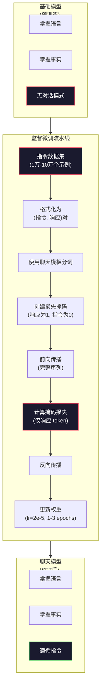

# 指令微调 (SFT)

> 基础模型（Base Model）只会预测下一个 token。仅此而已。它不会遵循指令、回答问题，也不会拒绝有害请求。SFT 是连接“token 预测器”与“有用助手”之间的桥梁。你所接触过的每一个模型——Claude、GPT、Llama Chat——都经历过这一步。

**Type:** 构建
**Languages:** Python (包含 numpy)
**Prerequisites:** 第 10 阶段，第 04 课（预训练一个迷你 GPT）
**Time:** ~90 分钟

## 学习目标

- 实现监督微调 (SFT)，将基础语言模型转换为遵循指令的助手
- 使用包含系统、用户和助手角色的聊天模板格式化训练数据，并对非助手 token 进行损失掩码 (Masking) 处理
- 解释为什么 SFT 是必要的：基础模型倾向于续写文本，而不是回答问题
- 通过比较基础模型与微调模型在留出指令集上的响应，评估 SFT 的质量

## 问题所在

你在第 04 课中训练了一个模型。它能够根据给定的序列预测下一个 token。输入“The transformer architecture”，它可能会续写为“has revolutionized natural language processing.”。对于一个“下一个 token 预测器”来说，这已经很令人印象深刻了。

现在尝试这样：输入“法国的首都是哪里？”。基础模型不会回答“巴黎”。它会继续遵循模式。它可能会输出“德国的首都是哪里？西班牙的首都是哪里？”，因为它从包含问题列表的文档中学习过。或者它可能会输出“是一个许多人都会问的问题”，因为这是合理的下一个 token 续写。模型没有“回答”的概念。它只知道“续写”。

这就是 GPT-3（基础模型，2020 年 6 月发布）与 ChatGPT（指令微调，2022 年 11 月发布）之间的差距。架构相同，预训练相同。区别在于 2 万到 10 万个精心制作的（指令，响应）对，这些数据教会了模型遵循对话模式。

斯坦福大学的 Alpaca 证明了你不需要数百万个示例。2023 年 3 月，他们仅用 GPT-3.5 生成的 52,000 个指令-响应对对 Llama 7B 进行了微调。总成本：600 美元。结果是一个能够遵循指令、回答问题并进行对话的聊天机器人。虽然不如 ChatGPT，但对于 600 美元和几个小时的训练来说，效果惊人地接近。

Meta 的 Llama 2 Chat 在其初始 SFT 阶段仅使用了约 27,000 个高质量示例。关键见解：质量胜过数量。由熟练标注员编写的 27,000 个示例，胜过从互联网上抓取的 100 万个嘈杂示例。

## 核心概念

### SFT 实际上做了什么

监督微调 (SFT) 继续沿用预训练的训练循环——前向传播、计算损失、反向传播、更新权重——但使用的是不同类型的数据。你不再训练原始文本，而是训练结构化的对话：

```json
{
  "system": "你是一个乐于助人的助手。",
  "user": "法国的首都是哪里？",
  "assistant": "法国的首都是巴黎。"
}
```

模型在维基百科、教科书和网页的预训练过程中，已经知道巴黎是法国的首都。SFT 并没有教给模型新的事实。它教给模型一种新的*行为*：当你看到问题时，给出答案。当你看到指令时，给出补全。当你看到有害请求时，给出拒绝。

可以这样理解：预训练赋予模型知识，SFT 赋予模型礼貌。

### 数据格式

行业内主要有三种格式。每种格式都编码了相同的信息——谁说了什么——只是使用了不同的分隔符。

**Alpaca 格式** (斯坦福，2023 年 3 月)：

```json
{
  "instruction": "用 3 句话总结以下文章。",
  "input": "欧洲央行提高了利率...",
  "output": "欧洲央行将利率提高了 25 个基点..."
}
```

简单且被广泛使用。`input` 字段是可选的——许多指令不需要额外的上下文。斯坦福发布了 52,000 个此格式的示例，由 GPT-3.5 生成，成本 600 美元。这开启了开源指令微调运动。

**ShareGPT 格式** (社区，2023)：

```json
{
  "conversations": [
    {"from": "system", "value": "你是一个乐于助人的助手。"},
    {"from": "human", "value": "潮汐是由什么引起的？"},
    {"from": "gpt", "value": "潮汐是由月球的引力引起的..."},
    {"from": "human", "value": "它们发生的频率是多少？"},
    {"from": "gpt", "value": "大多数沿海地区每天经历两次高潮和两次低潮..."}
  ]
}
```

支持多轮对话。`from` 字段按惯例使用 "human" 和 "gpt"，无论实际模型是什么。Vicuna 就是在从用户分享的 ChatGPT 转录中抓取的 70,000 个 ShareGPT 对话上训练的。

**ChatML 格式** (OpenAI，许多开源模型使用)：

```
<|im_start|>system
你是一个乐于助人的助手。<|im_end|>
<|im_start|>user
法国的首都是哪里？<|im_end|>
<|im_start|>assistant
法国的首都是巴黎。<|im_end|>
```

使用特殊 token (`<|im_start|>`, `<|im_end|>`) 来界定角色。这些 token 在微调期间被添加到分词器 (Tokenizer) 的词汇表中。Qwen、Yi 和许多其他模型都使用 ChatML。

所有这三种格式都实现了相同的目标：它们告诉模型“这是指令，这是响应，学习这个模式。”

### 为什么它有效

模型在预训练中已经掌握了语言。它见过数十亿个“问题后跟答案”、“指令后跟补全”以及人与人之间对话的示例。这些模式已经编码在权重中。

SFT 集中了这种潜在能力。模型不再需要从上下文中判断它是应该回答问题还是续写文档，SFT 明确地在对话模式上进行训练。经过几千个示例后，模型学会了：当你看到助手角色标记时，产生一个有用的响应。

这就是为什么 27,000 个示例就足够了。你不是在教模型英语。你不是在教它世界知识。你是在教它一个简单的行为：响应指令。知识本来就在那里。

### 掩码损失 (Masked Loss)

这是 SFT 中最重要的技术细节，大多数教程都跳过了它。

在预训练期间，你对每个 token 计算损失。模型学习预测序列中的每一个下一个 token。在 SFT 期间，你只对*响应* token 计算损失。指令 token 仅用于上下文，但模型不会因为“预测”它们不正确而受到惩罚。

为什么？因为你不希望模型学会*生成*指令。你希望它学会*响应*指令。如果你对指令 token 计算损失，你就是在训练模型去预测“法国的首都是哪里？”，就好像它自己才是那个提问的人。这浪费了梯度信号，并可能使模型对其角色感到困惑。

在实践中，你创建一个损失掩码：响应 token 为 1，指令 token 为 0。在取平均值之前，将每个 token 的损失乘以该掩码。

```
Tokens:    [SYS] 你是助手 [USER] 首都是哪？ [ASST] 巴黎是首都 [EOS]
Loss mask:   0    0    0     0     0    0   0     1     1    1   1     1      1
```

只有 `[ASST]` 之后的 token 才会贡献损失。模型在前向传播期间看到完整的对话（它需要指令来产生正确的响应），但仅根据它预测响应的准确程度来更新权重。

### 训练超参数

SFT 使用的超参数与预训练截然不同。你不是从零开始训练，而是在调整一个已经能工作的模型。

| 参数 | 预训练 (Llama 2 7B) | SFT (Llama 2 Chat) |
|-----------|---------------------------|---------------------|
| 学习率 | 3e-4 (峰值) | 2e-5 |
| Epochs | 1 (数据单次遍历) | 2 |
| Batch size | 4M tokens | 64 个示例 |
| Warmup steps | 2,000 | 0-100 |
| Weight decay | 0.1 | 0.0-0.1 |
| 数据规模 | 2T tokens | 27,000 个示例 |

SFT 的学习率降低了 15 倍。这一点至关重要。微调期间的高学习率会破坏预训练知识。模型会“忘记”它学到的东西，并对小的微调数据集过拟合。这就是灾难性遗忘。

两个 Epoch 意味着模型将每个训练示例看两次。在小数据集上超过 3 个 Epoch 会导致死记硬背——模型开始逐字复述训练示例，而不是进行泛化。

### 灾难性遗忘 (Catastrophic Forgetting)

微调可能会破坏通用能力。在指令遵循数据上训练时间过长，模型就会失去编写代码、进行数学运算或生成创造性文本的能力。它变得非常擅长训练数据的特定格式，而在其他方面表现极差。

三种缓解措施：

1. **低学习率。** 1e-5 到 5e-5。较小的更新意味着对预训练特征的破坏较小。

2. **短时间训练。** 1-3 个 Epoch。在模型过拟合之前停止。

3. **混合预训练数据。** Llama 2 Chat 在 SFT 数据集中混合了少量（2-5%）的原始预训练数据。这在学习新的指令遵循行为的同时，“提醒”模型其通用能力。

### 实际数字

在单个 NVIDIA A100 80GB GPU 上，对 7B 模型进行 10,000 个高质量指令对的微调大约需要 1 小时。计算如下：

- 10,000 个示例 x 平均 512 个 token = 512 万个 token
- 2 个 Epoch = 总计 1024 万个 token
- 7B 模型微调的 A100 吞吐量：约 3,000 token/秒
- 1024 万 / 3,000 = 约 3,400 秒 = 约 57 分钟

对于我们的迷你 GPT（4 层，128 维），训练几乎是瞬间完成的。重点是理解机制，而不是规模。



## 构建它

### 第 1 步：指令数据集

创建一个合成指令数据集。在生产环境中，像 Scale AI 和 Anthropic 这样的公司会雇佣人类标注员来编写这些数据。我们将以编程方式创建它们以演示格式。

```python
import numpy as np

# 指令数据集示例
INSTRUCTION_DATA = [
    {
        "instruction": "法国的首都是哪里？",
        "response": "法国的首都是巴黎。"
    },
    {
        "instruction": "用一句话解释重力。",
        "response": "重力是具有质量的物体之间相互吸引的力。"
    },
    {
        "instruction": "写一首关于海洋的俳句。",
        "response": "波浪拍岸边，阳光下泡沫盐分，无尽蓝广阔。"
    },
    {
        "instruction": "15 乘以 7 等于多少？",
        "response": "15 乘以 7 等于 105。"
    },
    {
        "instruction": "列举三种编程语言。",
        "response": "三种编程语言是 Python、Rust 和 TypeScript。"
    },
    {
        "instruction": "总结光合作用。",
        "response": "光合作用将阳光、水和二氧化碳转化为葡萄糖和氧气。"
    },
    {
        "instruction": "第二次世界大战是哪一年结束的？",
        "response": "第二次世界大战于 1945 年结束。"
    },
    {
        "instruction": "定义机器学习。",
        "response": "机器学习是一个算法从数据中学习模式以进行预测的领域。"
    },
]
```

8 个示例非常少。斯坦福 Alpaca 使用了 52,000 个。但无论你有 8 个还是 52,000 个，机制都是一样的：分词、掩码、仅对响应计算损失。

### 第 2 步：使用聊天模板分词

将指令-响应对转换为带有特殊角色标记的 token 序列。标记告诉模型指令在哪里结束，响应在哪里开始。

```python
SPECIAL_TOKENS = {
    "INST_START": 253,
    "INST_END": 254,
    "RESP_START": 255,
}

def tokenize_instruction_pair(instruction, response, vocab_size=256):
    inst_tokens = list(instruction.encode("utf-8"))
    resp_tokens = list(response.encode("utf-8"))

    inst_tokens = [min(t, vocab_size - 4) for t in inst_tokens]
    resp_tokens = [min(t, vocab_size - 4) for t in resp_tokens]

    tokens = (
        [SPECIAL_TOKENS["INST_START"]]
        + inst_tokens
        + [SPECIAL_TOKENS["INST_END"]]
        + [SPECIAL_TOKENS["RESP_START"]]
        + resp_tokens
    )

    return tokens

def create_loss_mask(tokens):
    mask = np.zeros(len(tokens), dtype=np.float32)
    in_response = False

    for i, token in enumerate(tokens):
        if token == SPECIAL_TOKENS["RESP_START"]:
            in_response = True
            continue
        if in_response:
            mask[i] = 1.0

    return mask
```

损失掩码对于指令 token 全为 0，对于响应 token 全为 1。`RESP_START` token 本身掩码为 0，因为它是一个分隔符，不是响应内容的一部分。

### 第 3 步：掩码交叉熵损失

标准的交叉熵，但乘以损失掩码。只有响应 token 贡献梯度。

```python
def masked_cross_entropy_loss(logits, targets, loss_mask):
    batch, seq_len, vocab_size = logits.shape
    logits_flat = logits.reshape(-1, vocab_size)
    targets_flat = targets.reshape(-1)
    mask_flat = loss_mask.reshape(-1)

    # 数值稳定性处理
    max_logits = logits_flat.max(axis=-1, keepdims=True)
    log_softmax = logits_flat - max_logits - np.log(
        np.exp(logits_flat - max_logits).sum(axis=-1, keepdims=True)
    )

    per_token_loss = -log_softmax[np.arange(len(targets_flat)), targets_flat]

    masked_loss = per_token_loss * mask_flat
    num_response_tokens = mask_flat.sum()
    if num_response_tokens == 0:
        return 0.0
    loss = masked_loss.sum() / num_response_tokens

    return loss
```

分母是 `num_response_tokens`，而不是 `seq_len`。如果你除以总序列长度，较长的指令会稀释梯度信号。除以响应 token 计数确保无论指令长度如何，每个响应 token 的权重相等。

### 第 4 步：SFT 训练循环

重用第 04 课中的 MiniGPT。训练循环看起来与预训练几乎相同，但增加了指令格式化和掩码损失。

```python
# 训练循环逻辑
def sft_train(model, dataset, num_epochs=2, lr=2e-5, seq_len=64):
    formatted_data = []
    for example in dataset:
        tokens = tokenize_instruction_pair(example["instruction"], example["response"])
        mask = create_loss_mask(tokens)
        formatted_data.append((tokens, mask))

    print(f"SFT 训练: {len(formatted_data)} 个示例, {num_epochs} 个 Epoch, lr={lr}")
    
    losses = []
    for epoch in range(num_epochs):
        epoch_loss = 0.0
        indices = np.random.permutation(len(formatted_data))

        for idx in indices:
            tokens, mask = formatted_data[idx]
            # ... (省略部分数据截断与前向传播逻辑)
            
            logits = model.forward(input_ids)
            loss = masked_cross_entropy_loss(logits, target_ids, loss_mask)
            
            # ... (省略反向传播与权重更新逻辑)
            epoch_loss += loss
            losses.append(loss)

        print(f"Epoch {epoch + 1}/{num_epochs} | 平均损失: {epoch_loss/len(formatted_data):.4f}")
    return model, losses
```

学习率为 2e-5，与 Llama 2 Chat 匹配。与预训练中使用的 3e-4 相比——小了 15 倍。梯度被掩码：指令 token 产生零梯度。只有响应 token 推动权重更新。

### 第 5 步：比较基础模型与 SFT 模型

SFT 的全部意义在于行为改变。让我们通过检查模型对指令格式化输入与原始文本续写的响应方式来衡量它。

```python
# 评估指令遵循能力
def evaluate_instruction_following(model, instructions):
    # ... (生成响应逻辑)
    # 重点：模型现在应该在响应标记后输出内容，而不是继续生成指令
    pass
```

在一个只有 8 个示例的微型模型上，响应不会有意义。这是预期的。重要的是*结构*：模型学会了在响应标记后产生输出，而不是继续生成更多指令。

### 第 6 步：衡量灾难性遗忘

比较模型在 SFT 前后的下一个 token 预测能力。如果 SFT 损害了通用能力，原始文本上的损失就会增加。

```python
# 衡量遗忘程度
def measure_forgetting(model, test_text, seq_len=64):
    # 计算模型在通用文本上的困惑度/损失
    pass
```

在实际微调中，你会全程跟踪此指标。如果原始文本损失增加了 10-15% 以上，说明你的 SFT 太激进了。降低学习率或减少 Epoch 数量。

## 使用它

### 完整 SFT 流水线演示

（此处省略了完整的 Python 运行代码，其逻辑已在上述步骤中详细说明）

## 练习

1. **添加系统提示词支持。** 修改 `tokenize_instruction_pair` 以接受系统消息并将其置于指令之前。创建 5 个带有不同系统提示词（“你是一位诗人”、“你是一位数学导师”）的示例，并验证模型在训练期间看到了不同的系统提示词。

2. **实现数据混合。** 创建一个函数，接收 SFT 数据集和原始文本语料库，然后生成训练批次，其中 5% 的示例是原始文本（无掩码），95% 是指令对（掩码）。运行 3 个 Epoch 并比较遗忘指标。

3. **构建数据质量评分器。** 对于每个指令-响应对，计算：(a) 响应的 token 长度，(b) 指令与响应的比例，(c) 词汇多样性（唯一 token / 总 token）。过滤掉响应长度 < 10 个 token 或多样性 < 0.3 的示例。展示过滤如何影响最终损失。

4. **实现多轮对话训练。** 扩展分词逻辑以处理 3 轮对话（用户-助手-用户-助手-用户-助手）。损失掩码应覆盖所有三轮助手回复。通过打印一个示例的 token-掩码对齐来验证掩码是否正确。

5. **比较学习率。** 使用 lr=1e-4、lr=2e-5 和 lr=1e-6 训练同一个模型三次。绘制损失曲线。1e-4 的运行应该显示快速的初始下降，但最终损失较高（过拟合）。1e-6 的运行几乎没有变化。2e-5 应该是最佳平衡点。

## 关键术语

| 术语 | 人们怎么说 | 实际含义 |
|------|----------------|----------------------|
| SFT | “在对话上进行微调” | 监督微调：在 (指令, 响应) 对上继续训练，仅对响应 token 计算损失 |
| 指令微调 | “教模型遵循指令” | 在明确的指令-响应对上训练，使基础模型学习对话模式，而非学习新知识 |
| 损失掩码 | “忽略提示词” | 将指令 token 的损失设为零，使梯度仅从响应 token 的预测中流动 |
| ChatML | “聊天标记语言” | 一种使用 `<\|im_start\|>` 和 `<\|im_end\|>` 分隔符来标记对话数据中说话者角色的 token 格式 |
| Alpaca 格式 | “斯坦福格式” | 一种带有 instruction/input/output 字段的 JSON 格式，用于 52K 个 GPT-3.5 生成的示例，成本 600 美元 |
| 灾难性遗忘 | “模型变笨了” | 微调破坏了预训练能力，因为梯度更新用任务特定模式覆盖了通用知识 |
| 权重绑定 | “共享嵌入” | 对输入 token 嵌入和输出预测头使用相同的矩阵，节省参数并提高一致性 |
| 聊天模板 | “如何格式化提示词” | 将对话结构化为模型可读的特定 token 序列（角色标记、分隔符） |

## 延伸阅读

- [Ouyang et al., 2022 -- "Training language models to follow instructions with human feedback" (InstructGPT)](https://arxiv.org/abs/2203.02155) -- 在 OpenAI 引入指令微调 + RLHF 的论文
- [Taori et al., 2023 -- "Stanford Alpaca: An Instruction-following LLaMA Model"](https://github.com/tatsu-lab/stanford_alpaca) -- 以 600 美元实现 52K 指令示例，证明 SFT 在小数据集上有效
- [Touvron et al., 2023 -- "Llama 2: Open Foundation and Fine-Tuned Chat Models"](https://arxiv.org/abs/2307.09288) -- Meta 的 SFT + RLHF 流水线，包含 27K 高质量示例
- [Chiang et al., 2023 -- "Vicuna: An Open-Source Chatbot Impressing GPT-4"](https://lmsys.org/blog/2023-03-30-vicuna/) -- 在 70K ShareGPT 对话上进行训练
- [Zhou et al., 2023 -- "LIMA: Less Is More for Alignment"](https://arxiv.org/abs/2305.11206) -- 证明 1,000 个精心策划的示例可以媲美在更大数据集上的 SFT 效果