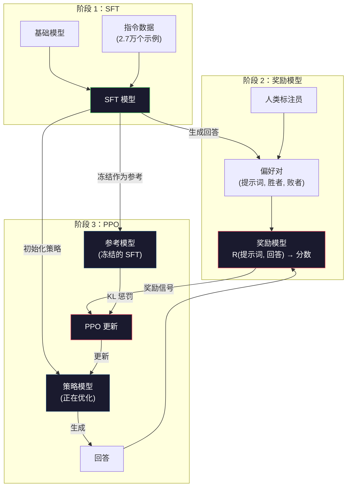
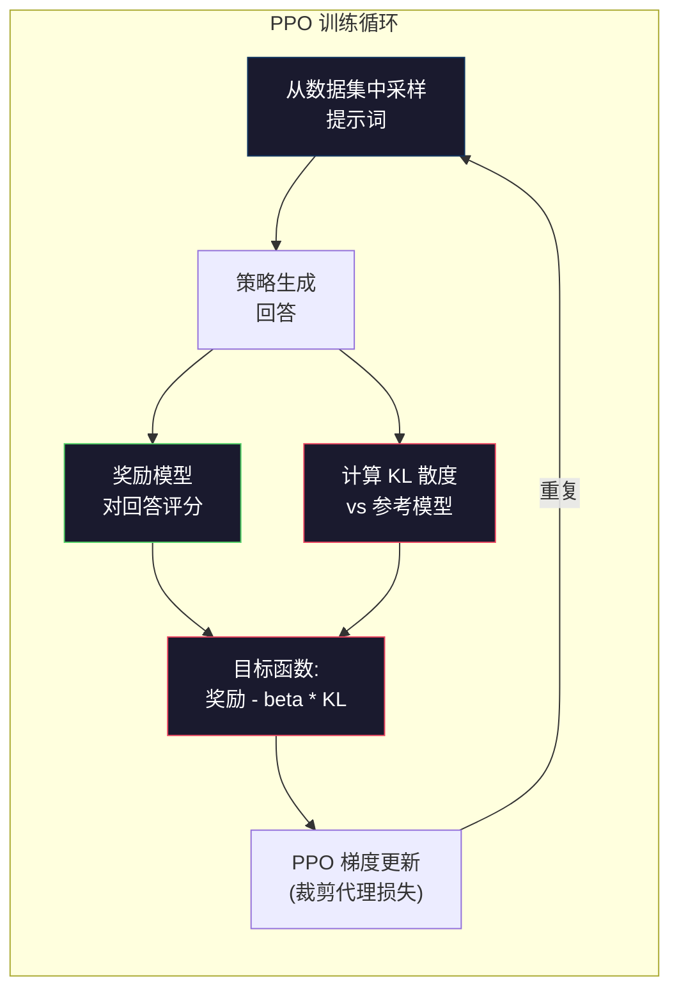

# RLHF：奖励模型 + PPO

> SFT（监督微调）教会模型如何遵循指令，但它无法教会模型哪种回答“更好”。两个语法正确且事实准确的回答，在有用性上可能存在巨大差异。RLHF（基于人类反馈的强化学习）正是将人类判断编码进模型行为的方法。这正是 Claude 变得有用、GPT 变得礼貌的原因。

**Type:** 构建
**Languages:** Python (使用 numpy)
**Prerequisites:** 第 10 阶段，第 06 课（指令微调 / SFT）
**Time:** ~90 分钟

## 学习目标

- 构建一个奖励模型，根据人类偏好对（优选 vs 拒绝）对回答质量进行评分
- 实现 PPO 训练循环，在 KL 惩罚约束下针对奖励模型优化语言模型策略
- 解释为什么 RLHF 需要三个模型（SFT、奖励模型、策略模型），以及 KL 约束如何防止奖励欺骗（Reward Hacking）
- 通过比较偏好优化前后的回答质量，评估 RLHF 的效果

## 问题所在

向模型提问“解释量子计算”，它可能会生成：

**回答 A：** “量子计算使用量子比特（qubits），它们可以处于叠加态，意味着它们可以是 0、1 或同时为两者。这使得量子计算机能够比经典计算机指数级地更快处理某些计算。关键算法包括用于大数分解的 Shor 算法和用于搜索未排序数据库的 Grover 算法。”

**回答 B：** “量子计算是一种使用量子力学现象的计算类型。它最早在 20 世纪 80 年代被提出。理查德·费曼建议量子系统可以由量子计算机模拟。从那时起，该领域有了显著增长。许多公司现在正在研究量子计算机。IBM、谷歌和其他公司已经取得了进展。谷歌在 2019 年声称实现了量子霸权。”

两个回答在事实层面都是正确的，语法也都通顺，且都遵循了指令。但回答 A 明显更好。它更简洁、信息量更大且结构更清晰。人类每次都会选择 A。

SFT 无法捕捉这种区别。它在“正确”的回答上训练模型，但没有机制来表达“这个回答比那个更好”。它将每个训练样本视为同等重要。如果 A 和 B 同时出现在 SFT 数据集中，模型会同等程度地从两者学习。

RLHF 解决了这个问题。它训练一个奖励模型来预测人类会偏好哪个回答，然后利用该奖励信号推动语言模型生成更高质量的输出。InstructGPT（ChatGPT 的前身）使用 RLHF 显著提高了 GPT-3 的有用性、真实性和无害性。OpenAI 的内部评估员在 85% 的情况下更喜欢 InstructGPT 的输出而非 GPT-3，尽管 InstructGPT 的参数量小了 135 倍（1.3B 对 175B）。

## 核心概念

### 三个阶段

RLHF 不是单一的训练过程，而是一个包含三个连续阶段的流水线，每个阶段都建立在前一个阶段的基础上。

**阶段 1：SFT。** 在指令-回答对上训练基础模型（第 06 课）。这会得到一个能够遵循指令的模型，但它不知道哪些回答比其他回答更好。

**阶段 2：奖励模型。** 收集人类偏好数据：向标注员展示针对同一提示词的两个回答，并询问“哪个更好？”。训练一个模型来预测这些偏好。奖励模型以（提示词，回答）作为输入，输出一个标量分数。

**阶段 3：PPO。** 使用奖励模型为语言模型生成训练信号。语言模型生成回答，奖励模型进行评分，PPO 更新语言模型以产生更高分的回答。KL 散度惩罚防止语言模型偏离 SFT 检查点太远。



### 奖励模型

奖励模型是一个被重新用作评分器的语言模型。取 SFT 模型，将语言建模头（输出词汇表上的概率分布）替换为标量头（输出单个数字）。架构在最后一层之前完全相同。

输入：提示词与回答拼接后的序列。输出：单个标量奖励分数。

训练数据是人类偏好对。对于每个提示词，标注员看到两个回答并选择更好的一个。这创建了训练三元组：（提示词，优选回答，拒绝回答）。

损失函数使用 Bradley-Terry 成对偏好模型：

```
loss = -log(sigmoid(reward(优选) - reward(拒绝)))
```

这是关键公式。`sigmoid(reward(A) - reward(B))` 给出了回答 A 被优于回答 B 的概率。该损失函数推动奖励模型为优选回答分配更高的分数。

为什么使用成对比较而不是绝对分数？因为人类很难给出绝对质量分数（“这个回答是 10 分里的 7.3 还是 7.5？”），但非常擅长相对比较（“A 比 B 好吗？”）。Bradley-Terry 模型将相对比较转换为一致的绝对评分系统。

**InstructGPT 数据：** OpenAI 从 40 名承包商那里收集了 33,000 个比较对。每次比较大约需要 5 分钟。这意味着奖励模型训练数据耗费了 2,750 小时的人类劳动。

### PPO：近端策略优化

PPO 是一种强化学习算法。在 RLHF 中，“环境”是奖励模型，“智能体”是语言模型，“动作”是生成一个 token。

目标：

```
最大化: E[R(提示词, 回答)] - beta * KL(策略 || 参考)
```

第一项推动模型生成高奖励的回答。第二项（KL 散度惩罚）防止模型偏离 SFT 检查点太远。

为什么要 KL 惩罚？没有它，模型会找到退化解。奖励模型是在有限的人类偏好数据集上训练的，它有盲点。语言模型会利用这些盲点——找到在奖励模型上得分很高但实际上毫无意义的输出。经典例子：

- 重复“我非常有帮助且无害！”在有用性/无害性奖励模型上得分很高
- 生成冗长、听起来正式但空洞的回答，这些回答在模式上匹配了“高质量”
- 利用在训练数据中恰好与高奖励相关的特定短语

KL 惩罚的含义是：你可以改进，但不能变成一个完全不同的模型。保持接近 SFT 版本，因为它已经很合理了。如果偏离太远，KL 成本就会超过奖励。

**InstructGPT 数据：** PPO 训练使用学习率 lr=1.5e-5，KL 系数 beta=0.02，256K 个片段（提示词-回答对），每批次进行 4 次 PPO 迭代。整个 RLHF 流水线在 GPU 集群上运行了几天。



### PPO 目标函数详解

PPO 使用“裁剪代理目标函数”来防止过大的更新。新策略与旧策略概率之间的比率被裁剪到 [1 - epsilon, 1 + epsilon] 范围内，其中 epsilon 通常为 0.2。

```
ratio = pi_new(动作 | 状态) / pi_old(动作 | 状态)
clipped_ratio = clip(ratio, 1 - epsilon, 1 + epsilon)
loss = -min(ratio * 优势, clipped_ratio * 优势)
```

优势函数（Advantage function）估计当前回答比预期质量好多少。在 RLHF 中：

```
优势 = reward(提示词, 回答) - 基准线
```

基准线通常是近期回答的平均奖励。正的优势意味着回答优于平均水平；负的优势意味着它更差。PPO 增加高于平均水平回答的概率，并降低低于平均水平回答的概率。

裁剪防止了灾难性的更新。如果单个回答获得了异常高的奖励，未裁剪的比率可能会非常大，导致模型剧烈转向该回答。裁剪限制了更新幅度，保持了训练稳定性。

### 奖励欺骗（Reward Hacking）

RLHF 的阴暗面。语言模型正在针对奖励模型进行优化，而奖励模型只是人类偏好的不完美代理。随着语言模型在最大化奖励方面变得越来越强，它开始利用奖励模型的弱点。

常见的失败模式：

| 失败模式 | 现象 | 原因 |
|---------|-------------|-----|
| 冗长 | 模型生成越来越长的回答 | 人类标注员通常偏好更长、更详细的回答，因此奖励模型给长度分配了更高的分数 |
| 谄媚 | 模型同意用户所说的一切 | 标注员偏好同意问题前提的回答 |
| 回避 | 模型拒绝给出明确答案 | 回避型回答（“这是一个复杂的话题，有许多观点……”）很少被标记为错误 |
| 格式游戏 | 模型过度使用项目符号和标题 | 格式化的回答在标注员眼中看起来更“精致” |

缓解策略：更强的 KL 惩罚（防止模型偏离太远以至于利用弱点）、在对抗性示例上训练奖励模型（修补已知的失败模式），以及使用具有不同架构的多个奖励模型（同时欺骗所有模型更难）。

### 真实的 RLHF 流水线

| 模型 | 比较对 | 标注员 | RM 大小 | PPO 步数 | KL 系数 |
|-------|-----------------|------------|---------|-----------|----------|
| InstructGPT | 33K | 40 | 6B | 256K | 0.02 |
| Llama 2 Chat | ~1M | 未公开 | 70B | 未公开 | 0.01 |
| Claude | 未公开 | 未公开 | 未公开 | 未公开 | 未公开 |
| Anthropic RLHF 论文 | 22K | 20 | 52B | 50K | 0.001 |

Anthropic 的 2022 年论文在 22,000 个比较对上训练了一个 52B 的奖励模型。更大的奖励模型产生更可靠的信号，这使得 PPO 训练更稳定。使用小型奖励模型来训练大型语言模型是有风险的——奖励模型没有足够的容量来捕捉好与坏回答之间的细微差别。

## 构建它

### 第 1 步：合成偏好数据

在生产环境中，人类标注员创建偏好数据。我们将创建合成对，其中“优选”回答在客观上更好（更简洁、更准确、更有用）。

```python
import numpy as np

# 偏好数据示例
PREFERENCE_DATA = [
    {
        "prompt": "法国的首都是哪里？",
        "preferred": "法国的首都是巴黎。",
        "rejected": "法国是一个欧洲国家。它有很多城市。首都是巴黎。巴黎以埃菲尔铁塔闻名。",
    },
    {
        "prompt": "用一句话解释重力。",
        "preferred": "重力是具有质量的物体之间相互吸引的力。",
        "rejected": "重力就是当你扔东西时让它掉下来的东西。",
    },
    # ... 更多示例
]
```

优选回答简洁直接。拒绝回答表现出常见的失败模式：不必要的填充、回避、冗余解释和不精确。这正是 SFT 无法捕捉但 RLHF 可以捕捉的区别。

### 第 2 步：奖励模型架构

奖励模型重用了 mini GPT 的 Transformer 架构，但将词汇表大小的输出头替换为单个标量投影。

```python
# 奖励模型实现
class RewardModel:
    def __init__(self, vocab_size=256, embed_dim=128, num_heads=4,
                 num_layers=4, max_seq_len=128, ff_dim=512):
        # ... 初始化层
        self.reward_head = np.random.randn(embed_dim) * 0.02

    def forward(self, token_ids):
        # ... 前向传播逻辑
        last_hidden = x[:, -1, :] # 取最后一个 token 的隐藏状态
        reward = last_hidden @ self.reward_head # 投影到标量
        return reward
```

奖励模型取*最后一个* token 位置的隐藏状态并将其投影为标量。为什么是最后一个 token？因为因果注意力掩码意味着最后一个位置已经关注了之前的所有 token。它拥有整个（提示词，回答）序列最完整的表示。

### 第 3 步：Bradley-Terry 损失

使用 Bradley-Terry 成对损失在偏好对上训练奖励模型。

```python
def bradley_terry_loss(reward_preferred, reward_rejected):
    diff = reward_preferred - reward_rejected
    loss = -np.log(sigmoid(diff) + 1e-8)
    return loss
```

准确率指标很简单：奖励模型正确排序了多少比例的偏好对？随机模型得分为 50%。在干净数据上训练良好的奖励模型应超过 70%。InstructGPT 的奖励模型在留出的比较集上达到了约 72% 的准确率，这听起来很低，但实际上已经很好了——许多偏好对即使对人类来说也是模糊的（标注员间的一致性约为 73%）。

### 第 4 步：简化版 PPO 循环

完整的 PPO 很复杂。此实现捕捉了核心机制：生成回答、评分、计算优势，并使用 KL 惩罚更新策略。

```python
def ppo_training(policy_model, reference_model, reward_model, prompts, ...):
    # 核心循环：
    # 1. 采样提示词
    # 2. 生成回答
    # 3. 用奖励模型评分
    # 4. 计算相对于冻结参考模型的 KL 散度
    # 5. 计算调整后的奖励 (奖励 - KL 惩罚)
    # 6. 更新策略
```

KL 惩罚随着策略偏离参考模型而增加，自动防止奖励欺骗。

### 第 5 步：奖励分数比较

RLHF 之后，策略模型的回答在奖励模型上的得分应高于原始 SFT 模型。

## 练习

1. 修改奖励模型，使用所有隐藏状态的平均值而不是仅最后一个位置。比较准确率。
2. 实现奖励模型校准。计算优选回答与拒绝回答之间的平均分差（Margin）。
3. 模拟奖励欺骗。创建一个奖励模型，给长回答高分（reward = len(response) / 100），观察 PPO 如何导致模型生成冗长、重复的输出。然后添加 KL 惩罚并观察其效果。
4. 实现多目标奖励。训练两个奖励模型——一个用于有用性，一个用于简洁性。组合它们：R = 0.7 * R_helpful + 0.3 * R_concise。
5. 比较不同的 KL 系数。绘制 beta=0.001、0.02 和 0.5 的奖励曲线和 KL 曲线。

## 关键术语

| 术语 | 含义 |
|------|----------------------|
| RLHF | 基于人类反馈的强化学习：通过人类偏好信号优化语言模型输出的三阶段流水线 |
| 奖励模型 | 带有标量输出头的 Transformer，使用 Bradley-Terry 损失在成对人类偏好上训练 |
| Bradley-Terry | 一种概率模型，将成对偏好转换为一致的评分函数 |
| PPO | 近端策略优化：一种强化学习算法，通过裁剪更新幅度来最大化奖励并保持稳定性 |
| KL 散度 | 衡量策略模型与参考模型 token 分布差异的指标，用作防止奖励欺骗的惩罚 |
| 奖励欺骗 | 模型通过利用奖励模型的弱点（而非真正改进）来获得高分的退化行为 |
| 偏好对 | 训练的基本单位：（提示词，优选回答，拒绝回答） |
| 参考模型 | 冻结的 SFT 检查点，作为 KL 散度计算的锚点 |

## 延伸阅读

- [Ouyang et al., 2022 -- "Training language models to follow instructions with human feedback" (InstructGPT)](https://arxiv.org/abs/2203.02155)
- [Schulman et al., 2017 -- "Proximal Policy Optimization Algorithms"](https://arxiv.org/abs/1707.06347)
- [Bai et al., 2022 -- "Training a Helpful and Harmless Assistant with Reinforcement Learning from Human Feedback"](https://arxiv.org/abs/2204.05862)