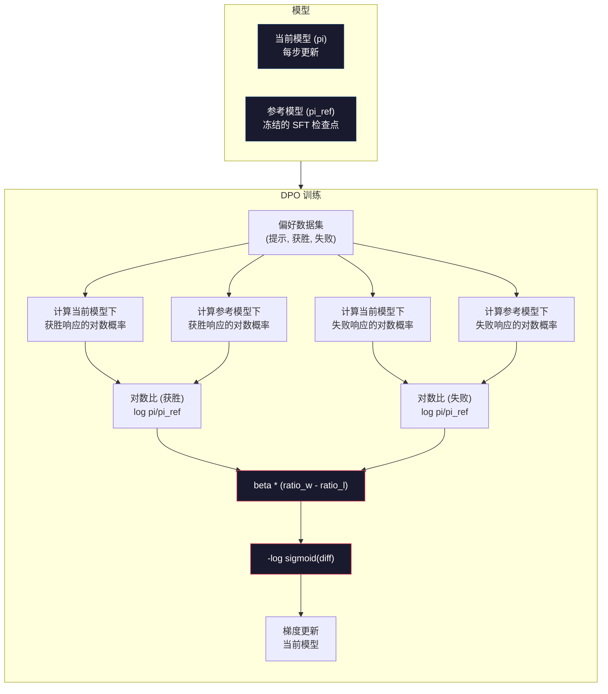

# DPO：直接偏好优化 (Direct Preference Optimization)

> RLHF 确实有效，但它需要训练三个模型（SFT 模型、奖励模型、策略模型），管理 PPO 的不稳定性，并调整 KL 惩罚系数。DPO 提出了一个问题：如果能跳过所有这些步骤会怎样？DPO 直接在偏好对上优化语言模型。没有奖励模型，没有 PPO，只有一个训练循环，却能获得同样的结果。

**Type:** 构建 (Build)
**Languages:** Python (使用 numpy)
**Prerequisites:** 第 10 阶段，第 07 课 (RLHF)
**Time:** ~90 分钟

## 学习目标

- 实现 DPO 训练，在没有独立奖励模型的情况下，直接在偏好对上优化语言模型
- 推导 DPO 损失函数，并解释它如何通过策略的对数概率隐式地表示奖励模型
- 从训练稳定性、计算成本和所需模型数量等方面比较 DPO 与 RLHF
- 调整 beta 参数，以控制训练后的策略偏离参考模型的程度

## 问题所在

你在第 07 课中构建了一个 RLHF 流水线。三个阶段，三个模型：SFT 模型、奖励模型以及使用 PPO 优化的策略模型。仅奖励模型就需要数千个人类偏好对和一个独立的训练循环。PPO 则需要仔细调整 KL 系数、学习率、裁剪比例 (clip ratio) 和训练轮数。

在实践中，PPO 训练以不稳定著称。超参数的微小变化就会导致训练发散。奖励模型只是人类偏好的不完美代理，而策略模型总能找到利用其弱点的方法。KL 惩罚虽然有帮助，但需要单独调整——太低会导致奖励欺骗 (reward hacking)，太高则模型几乎无法学习。

这种复杂性正是为什么在 InstructGPT 发布后的几年里，大多数开源模型在 RLHF 方面表现挣扎的原因。三阶段流水线非常脆弱，每个阶段都有其失效模式，且错误会累积。

2023 年 5 月，斯坦福大学的 Rafael Rafailov、Archit Sharma 及其同事发表了《Direct Preference Optimization: Your Language Model is Secretly a Reward Model》（直接偏好优化：你的语言模型其实是一个奖励模型）。其核心洞察是：你不需要独立的奖励模型。最优奖励函数在数学上由语言模型自身的 Token 概率决定。你可以完全跳过奖励模型，直接在偏好对上优化语言模型。

DPO 将 RLHF 简化为单一的监督学习步骤。一个模型，一个损失函数，一个训练循环，无需强化学习。Zephyr-7B 是首批大规模使用 DPO 的模型之一，在多个基准测试中匹配或超越了使用完整 RLHF 训练的模型。Meta 将 DPO 作为 Llama 3 对齐流水线的一部分。Anthropic 也在其对齐研究中引用了 DPO 类方法。

## 核心概念

### 关键洞察

RLHF 优化的目标是：

```
maximize: E[R(x, y)] - beta * KL(pi || pi_ref)
```

其中 R 是奖励模型，pi 是策略模型，pi_ref 是参考模型，beta 是 KL 系数。

DPO 论文证明了该目标具有闭式最优解。对于任何奖励函数 R，最优策略为：

```
pi*(y | x) = pi_ref(y | x) * exp(R(x, y) / beta) / Z(x)
```

其中 Z(x) 是归一化常数。重排后得到：

```
R(x, y) = beta * log(pi*(y | x) / pi_ref(y | x)) + beta * log Z(x)
```

这就是突破点。奖励完全由策略模型的概率和参考模型的概率表示。你不需要训练独立的奖励模型，奖励隐含在概率比率中。

将其代入 Bradley-Terry 偏好模型：

```
P(y_w > y_l | x) = sigmoid(R(x, y_w) - R(x, y_l))
                  = sigmoid(beta * (log pi(y_w|x)/pi_ref(y_w|x) - log pi(y_l|x)/pi_ref(y_l|x)))
```

Z(x) 项被抵消了，因为两个响应都以相同的提示 x 为条件。剩下的只是策略模型和参考模型在偏好响应和拒绝响应上的对数概率函数。

### DPO 损失函数

```
L_DPO = -log(sigmoid(beta * (log pi(y_w|x)/pi_ref(y_w|x) - log pi(y_l|x)/pi_ref(y_l|x))))
```

解析各项：

- **y_w** = 偏好（获胜）响应
- **y_l** = 拒绝（失败）响应
- **x** = 提示
- **pi** = 当前模型（正在训练）
- **pi_ref** = 参考模型（冻结的 SFT 检查点）
- **beta** = 控制偏离参考程度的温度参数（通常为 0.1 到 0.5）

比率 `log pi(y|x) / pi_ref(y|x)` 是对数概率比。当该比率为正时，当前模型对响应 y 分配的概率高于参考模型；为负时则更低。

DPO 损失函数推动模型增加偏好响应的对数概率比，并降低拒绝响应的对数概率比。beta 参数控制模型偏离参考模型的激进程度——小 beta 允许大幅偏离，大 beta 则使模型保持在参考模型附近。



### 为什么 DPO 更简单

| 方面 | RLHF (PPO) | DPO |
|--------|-----------|-----|
| 需训练模型 | 3 (SFT + 奖励 + 策略) | 1 (仅策略) |
| 训练循环 | 3 (SFT, RM 训练, PPO) | 2 (SFT, DPO) |
| 超参数 | lr, KL 系数, 裁剪比例, RM lr, 轮数 x3 | lr, beta, 轮数 |
| 奖励模型 | 需要 (独立训练) | 隐含在模型概率中 |
| RL 算法 | PPO (复杂，不稳定) | 监督学习 (稳定) |
| GPU 显存 | PPO 期间需 3-4 个模型 | 2 个模型 (当前 + 参考) |
| 训练稳定性 | 对超参数敏感 | 稳健，类似于 SFT |

DPO 在训练期间需要两个模型在显存中——当前模型和冻结的参考模型。RLHF 需要三个或四个：策略、参考、奖励模型，以及可选的价值函数基线。对于 70B 模型，每个副本在 FP16 下占用 140GB。消除奖励模型带来的显存节省是巨大的。

### DPO 何时优于 RLHF

**小数据集。** 在 5,000 到 20,000 个偏好对的情况下，DPO 通常能匹配或超过 RLHF。RLHF 中的奖励模型需要足够的数据来泛化——数据有限时，它会过拟合并产生不可靠的奖励信号。DPO 通过完全不需要奖励模型绕过了这个问题。

**计算资源有限。** DPO 所需的计算量大约是完整 RLHF 的三分之一（一个训练循环而不是三个）。对于没有大型 GPU 集群的团队来说，这是实际的选择。

**快速迭代。** 想尝试 10 个不同的偏好数据集来看看哪个能产生最好的模型？DPO 让你可以几小时内完成每个实验。RLHF 则需要为每个数据集重新训练奖励模型。

### RLHF 何时优于 DPO

**大规模训练。** 在 GPT-4 或 Claude 的规模下，RLHF 的独立奖励模型可以捕捉到更细微的偏好信号。奖励模型充当了一个学习到的损失函数，能够适应复杂的质量标准。

**复杂的奖励信号。** 当“更好”涉及多个维度（有用性、无害性、诚实性）时，奖励模型可以学习这种多目标权衡。DPO 将每个偏好对视为二元信号——一个更好，一个更差——而不建模原因。

**迭代对齐。** RLHF 流水线可以使用当前策略生成新响应，让人类进行评分，并在在线循环中重新训练奖励模型。DPO 在固定的偏好对数据集上工作。宪法 AI (Anthropic 的方法) 广泛使用了 RLHF 的这种迭代特性。

### 超越 DPO：KTO, ORPO, SimPO

DPO 启发了一系列简化的对齐方法。

**KTO (Kahneman-Tversky Optimization, 2024)：** 你甚至不需要偏好对。KTO 使用非配对反馈——只需将每个响应标记为“好”或“坏”，而无需将其与替代方案进行比较。这极大地简化了数据收集。与其向标注员展示两个响应并问“哪个更好？”，不如展示一个响应并问“这个好吗？”损失函数应用了前景理论中的损失厌恶：对坏响应的惩罚比对好响应的奖励更重。

**ORPO (Odds Ratio Preference Optimization, 2024)：** 将 SFT 和对齐合并为一个训练步骤。ORPO 修改了 SFT 损失，使其包含偏好信号。损失包含两项：偏好响应上的标准下一 Token 预测损失，以及增加偏好与拒绝响应概率差距的几率比项。一个训练循环代替了两个。

**SimPO (Simple Preference Optimization, 2024)：** 完全消除了参考模型。SimPO 使用响应的平均对数概率（按长度归一化）作为隐式奖励，而不是计算相对于冻结参考的对数概率比。这节省了显存（无需参考模型）并简化了训练。长度归一化防止模型偏向较短的响应。

| 方法 | 年份 | 显存中模型数 | 需要配对？ | 需要参考？ | 训练循环 |
|--------|------|-----------------|-------------|-----------------|----------------|
| RLHF | 2022 | 3-4 | 是 (用于 RM) | 是 | 3 |
| DPO | 2023 | 2 | 是 | 是 | 2 |
| KTO | 2024 | 2 | 否 (非配对) | 是 | 2 |
| ORPO | 2024 | 1 | 是 | 否 | 1 |
| SimPO | 2024 | 1 | 是 | 否 | 1 |

趋势很明显：每种方法都消除了一层复杂性。RLHF 需要奖励模型和 PPO。DPO 消除了两者。KTO 消除了配对数据。ORPO 消除了独立的 SFT 阶段。SimPO 消除了参考模型。对齐税——从基础模型到对齐模型所需的计算和复杂性成本——正在持续下降。

### 实际 DPO 部署

**Zephyr-7B (HuggingFace, 2023年10月)：** Mistral 7B 基础模型，在 UltraChat 上进行 SFT（20 万示例），然后在 UltraFeedback 上进行 DPO（6 万偏好对）。在 MT-Bench 上得分 6.47——当时得分最高的 7B 模型。相比之下，Llama 2 Chat 70B 得分为 6.86，这意味着 Zephyr 仅使用 DPO 对齐就达到了其规模 1/10 模型 6% 以内的性能。

**Llama 3 (Meta, 2024年4月)：** 在初始 RLHF 阶段后使用了 DPO。这种组合表明 DPO 和 RLHF 可以互补——RLHF 用于广泛对齐，DPO 用于针对性优化。

**Neural Magic / nm-chat (2024)：** 将 DPO 应用于多个开源模型，在对齐基准测试中始终显示出比仅 SFT 基线高出 5-15% 的提升。

```figure
dpo-loss
```

## 构建它

### 第 1 步：偏好数据集

与 RLHF 格式相同——(提示, 偏好, 拒绝) 三元组。DPO 直接使用此数据，无需中间奖励模型。

```python
import numpy as np
import sys
import os
sys.path.insert(0, os.path.join(os.path.dirname(__file__), "..", "..", "04-pre-training-mini-gpt", "code"))
from main import MiniGPT, LayerNorm, Embedding, TransformerBlock

# 偏好数据集示例
PREFERENCE_DATA = [
    {
        "prompt": "法国的首都是哪里？",
        "preferred": "法国的首都是巴黎。",
        "rejected": "法国是一个欧洲国家。它有很多城市。首都是巴黎。巴黎以埃菲尔铁塔闻名。",
    },
    # ... 其他示例
]
```

### 第 2 步：序列对数概率

DPO 损失需要计算给定提示下响应的总对数概率。这意味着在完整（提示 + 响应）序列上运行模型，并对每个响应 Token 的对数概率求和。

```python
def tokenize_sequence(text, vocab_size=256):
    return [min(t, vocab_size - 1) for t in list(text.encode("utf-8"))]


def compute_sequence_log_prob(model, prompt_tokens, response_tokens, max_seq_len=128):
    full_sequence = prompt_tokens + response_tokens
    if len(full_sequence) > max_seq_len:
        full_sequence = full_sequence[:max_seq_len]

    if len(full_sequence) < 2:
        return 0.0

    input_ids = np.array(full_sequence[:-1]).reshape(1, -1)
    target_ids = np.array(full_sequence[1:])

    logits = model.forward(input_ids)
    logits = logits[0]

    # 计算 LogSoftmax
    max_logits = logits.max(axis=-1, keepdims=True)
    log_probs = logits - max_logits - np.log(
        np.exp(logits - max_logits).sum(axis=-1, keepdims=True)
    )

    prompt_len = len(prompt_tokens)
    response_start = max(0, prompt_len - 1)
    response_end = len(target_ids)

    if response_start >= response_end:
        return 0.0

    response_log_probs = log_probs[response_start:response_end, :]
    response_targets = target_ids[response_start:response_end]

    total_log_prob = 0.0
    for i, target in enumerate(response_targets):
        total_log_prob += response_log_probs[i, target]

    return total_log_prob
```

此函数是 DPO 的核心。对于每个偏好对，它运行四次：模型在偏好响应上，模型在拒绝响应上，参考模型在偏好响应上，参考模型在拒绝响应上。这比 RLHF 的生成 + 奖励评分 + 价值估计 + PPO 更新要简单、快速且稳定得多。

### 第 3 步：DPO 损失函数

代码中的论文核心。一个函数，一个损失，没有奖励模型。

```python
def sigmoid(x):
    return np.where(
        x >= 0,
        1.0 / (1.0 + np.exp(-x)),
        np.exp(x) / (1.0 + np.exp(x))
    )


def dpo_loss(policy_logprob_preferred, policy_logprob_rejected,
             ref_logprob_preferred, ref_logprob_rejected, beta=0.1):
    # 计算对数概率比
    preferred_ratio = policy_logprob_preferred - ref_logprob_preferred
    rejected_ratio = policy_logprob_rejected - ref_logprob_rejected

    # 计算 Logit
    logit = beta * (preferred_ratio - rejected_ratio)

    # DPO 损失
    loss = -np.log(sigmoid(logit) + 1e-8)

    # 隐式奖励
    preferred_reward = beta * preferred_ratio
    rejected_reward = beta * rejected_ratio

    return loss, {
        "preferred_ratio": float(preferred_ratio),
        "rejected_ratio": float(rejected_ratio),
        "logit": float(logit),
        "implicit_preferred_reward": float(preferred_reward),
        "implicit_rejected_reward": float(rejected_reward),
        "reward_margin": float(preferred_reward - rejected_reward),
    }
```

`preferred_ratio` 和 `rejected_ratio` 是来自 DPO 推导的对数概率比。当当前模型对偏好响应分配的概率（相对于参考模型）更高，而对拒绝响应分配的概率更低时，Logit 为正，损失较低。训练信号正是将模型推向这个方向。

### 第 4 步：DPO 训练循环

标准的监督训练循环。没有 PPO，没有奖励模型。只有前向传播和梯度更新。

```python
def dpo_train(policy_model, reference_model, preference_data,
              num_epochs=5, lr=5e-6, beta=0.1, max_seq_len=128):
    # ... 训练逻辑
    # 循环遍历数据，计算四个 log_prob，调用 dpo_loss，更新权重
    # ...
```

训练循环比 RLHF 简单得多。对于每个偏好对：计算四个对数概率，代入 DPO 损失，计算梯度，更新策略。没有生成步骤，没有奖励模型推理，没有优势估计，没有裁剪。

### 第 5 步：比较 DPO 与 RLHF

测量隐式奖励边际和对数概率偏移，以比较 DPO 与第 07 课中的 RLHF 模型。

### 第 6 步：Beta 敏感性分析

Beta 参数是 DPO 中相当于 RLHF 中 KL 系数的参数。它控制模型偏离参考模型的程度。

## 使用它

### 完整 DPO 流水线演示

```python
if __name__ == "__main__":
    # 初始化模型，运行 dpo_train，评估准确率，分析隐式奖励
```

## 练习

1. **实现 KTO**：KTO 不需要配对——只需将每个响应标记为“好”或“坏”。好响应的损失为 `-log(sigmoid(beta * log_ratio))`，坏响应的损失为 `-log(1 - sigmoid(beta * log_ratio))`，并对坏响应损失应用损失厌恶乘数（通常为 1.5x）。
2. **实现长度归一化 DPO**：将总对数概率除以响应 Token 数，防止模型偏向较短的响应。
3. **构建 ORPO 风格的组合损失**：将偏好响应上的标准下一 Token 预测损失添加到 DPO 损失中：`L = L_sft(preferred) + alpha * L_dpo`。
4. **实现迭代 DPO**：运行 DPO 3 轮，然后使用训练后的模型生成新响应，将其与原始偏好响应配对作为新的偏好对，再次运行 DPO。
5. **比较不同参考模型**：尝试使用 (a) 基础模型（预 SFT），(b) DPO 第 1 轮的检查点，(c) 策略模型的指数移动平均作为参考模型。

## 关键术语

| 术语 | 含义 |
|------|----------------|
| **DPO** | 直接偏好优化：一种监督学习算法，直接在偏好对上优化语言模型，绕过奖励模型和 PPO |
| **隐式奖励** | 奖励函数由策略模型和参考模型之间的对数概率比决定，无需独立奖励模型 |
| **Beta (DPO)** | 温度参数，控制策略偏离参考模型的程度 |
| **对数概率比** | `log pi(y|x) - log pi_ref(y|x)`，正值表示当前模型分配的概率高于参考模型 |
| **参考模型** | 冻结的 SFT 检查点，作为计算概率比的锚点 |
| **KTO** | Kahneman-Tversky 优化：使用非配对的“好”或“坏”标签，无需偏好对 |
| **ORPO** | 几率比偏好优化：通过在 SFT 损失中添加偏好项，将 SFT 和对齐合并为一个训练循环 |
| **SimPO** | 简单偏好优化：通过使用长度归一化的平均对数概率作为隐式奖励，消除了参考模型 |
| **对齐税** | 从基础模型到对齐模型所需的额外计算、数据和复杂性成本 |

## 进一步阅读

- [Rafailov et al., 2023 -- "Direct Preference Optimization"](https://arxiv.org/abs/2305.18290)
- [Tunstall et al., 2023 -- "Zephyr: Direct Distillation of LM Alignment"](https://arxiv.org/abs/2310.16944)
- [Ethayarajh et al., 2024 -- "KTO: Model Alignment as Prospect Theoretic Optimization"](https://arxiv.org/abs/2402.01306)
- [Hong et al., 2024 -- "ORPO: Monolithic Preference Optimization without Reference Model"](https://arxiv.org/abs/2403.07691)
- [Meng et al., 2024 -- "SimPO: Simple Preference Optimization with a Reference-Free Reward"](https://arxiv.org/abs/2405.14734)
- [Llama 3 技术报告](https://arxiv.org/abs/2407.21783)