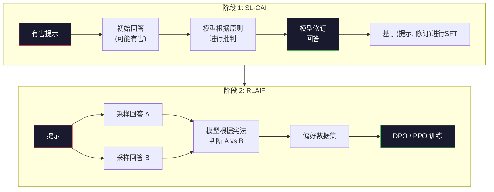
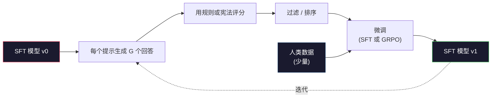

# Constitutional AI 与自我提升

> RLHF 需要人类参与循环。Constitutional AI（宪法 AI）用模型自身取代了大部分人类工作。编写一系列原则，让模型根据这些原则对自己的输出进行批判，并基于这些批判进行训练。DeepSeek-R1 在 2025 年将这一理念推向了极致：让模型生成数百万条推理轨迹，用规则对其进行评分，并对结果运行 GRPO。在 2026 年的前沿模型中，大部分“对齐工作”实际上是模型自身的对齐。本课程将构建这两个循环。

**Type:** Build
**Languages:** Python (标准库 + numpy)
**Prerequisites:** 第 10 阶段，课程 06-08 (SFT, RLHF, DPO)
**Time:** ~45 分钟

## 学习目标

- 实现 Constitutional AI 的两阶段循环：自我批判加自我修订，然后对修订后的配对进行偏好训练。
- 推导 GRPO 目标函数（DeepSeek-R1 的组相对策略优化），并将其与 PPO 的价值函数基线进行对比。
- 生成带有基于规则的结果奖励的可验证推理轨迹，并在没有独立奖励模型的情况下对其进行评分。
- 判断何时自我提升优于人类偏好数据，以及何时会陷入模式崩溃（mode seeking）。

## 问题所在

你在课程 07 中构建了 RLHF，在课程 08 中构建了 DPO。两者都依赖于同一个昂贵的输入：人类偏好配对。Anthropic 在 InstructGPT 时代的流水线使用了大约 33,000 条比较数据。Llama 2 Chat 使用了超过 150 万条。Claude 3 使用的更多。这些数据获取缓慢、昂贵，并且容易受到标注者在评分当天所持观点的影响。

2022 年的 Constitutional AI 论文提出了一个简单的问题：如果模型自己生成偏好标签会怎样？给它一份书面原则列表——即“宪法”——并让它批判自己的回答。这些批判就成为了训练信号。

2024 年，DeepSeek 将这一想法进一步推进。他们证明，对于任何具有可验证结果的任务（已知答案的数学题、通过或失败的测试代码、胜负明确的游戏），你可以完全跳过批判者。生成多个候选解决方案，用确定性规则对每个方案进行评分，然后对奖励运行策略梯度算法。DeepSeek-R1 就是以这种方式训练的，几乎没有使用人类偏好数据，却达到了 o1 级别的推理性能。

这两个循环——用于主观行为的 Constitutional AI 和用于可验证行为的基于规则的 RL——是 2026 年主流的对齐方案。过去投入到 RLHF 中的人类偏好预算，现在只需用于更小的一步：选择宪法和选择奖励规则。

## 核心概念

### Constitutional AI 循环

Bai 等人 (2022) 将流水线分为两个阶段。

**阶段 1：基于 AI 反馈的监督学习 (SL-CAI)。** 从一个有帮助但可能有害的 SFT 模型开始。用潜在的有害请求提示它。对于每个回答，要求*同一个模型*根据宪法原则批判其回答，然后进行修订。在修订后的回答上进行微调。数据集是 (提示, 修订后的回答) 配对。

**阶段 2：基于 AI 反馈的强化学习 (RLAIF)。** 对回答进行配对采样。要求模型判断哪一个更符合宪法。配对偏好用于训练奖励模型。然后使用该奖励对模型运行 PPO 或 DPO。与 RLHF 的关键区别在于：偏好来自模型，而不是人类。



宪法是杠杆。Anthropic 最初有 16 条原则（后来有所扩展）。一条原则读起来像：“请选择最不容易引起各种文化背景人士反感的回答。”你为每一步选择原则，有时是随机选择，有时根据提示类别选择。

### 宪法的作用

宪法将对齐契约从*数据*转移到了*文本*。在 RLHF 下改变行为意味着重新标注数千个配对。在 CAI 下改变行为意味着编辑一段文字。这是主要的实际收益。

它也有代价。模型的自我判断能力仅取决于其初始校准水平。如果 SFT 模型存在盲点——例如，它无法识别操纵性措辞——那么批判步骤也会继承这些盲点。CAI 压缩了对齐循环，但无法将信号放大到超过基础模型的能力上限。这就是为什么每个生产级的 CAI 流水线仍然使用少量人类偏好数据，通常是纯 RLHF 量的 5-10%。

### GRPO：组相对策略优化

DeepSeek 在 DeepSeekMath 论文 (2024) 中引入了 GRPO，并将其作为 DeepSeek-R1 (2025) 的骨干。GRPO 是 PPO 的一种变体，它去掉了价值函数。

回顾 PPO 的目标函数（来自课程 07）：

```
L_PPO = E[min(r(theta) * A, clip(r(theta), 1-eps, 1+eps) * A)]
```

其中 `A` 是优势（advantage），通常使用学习到的价值网络 `V(s)` 通过 GAE 进行估计。价值网络是与策略模型大小相同的第二个模型。它使内存需求翻倍，并引入了自身的训练循环。

GRPO 抛弃了价值函数。对于每个提示，它采样一组 G 个回答（通常 G=16 或 64）。计算每个回答的奖励，然后在组内进行归一化：

```
A_i = (r_i - mean(r_1, ..., r_G)) / std(r_1, ..., r_G)
```

优势是回答的奖励相对于其同组回答的 Z 分数。没有价值函数。该组充当了自身的基线。

```
L_GRPO = E[min(r(theta) * A_group, clip(r(theta), 1-eps, 1+eps) * A_group)] - beta * KL(pi || pi_ref)
```

针对参考模型的 KL 惩罚依然存在，与 PPO 相同。裁剪比例（clip ratio）依然存在。消失的是独立的批判者（critic）。

### 为什么 GRPO 对推理很重要

对于推理任务，奖励通常是稀疏且二元的：最终答案要么对，要么错。在稀疏二元奖励上训练价值函数是一种浪费——它无法学习有用的中间估计，因为在最后一步之前，几乎每个状态都有相同的预期回报。GRPO 的组归一化为你提供了直接的相对信号：在针对同一个数学问题的 16 次尝试中，哪些尝试高于该问题的平均水平？

这正是你从基于规则的奖励中获得的信号形状：

- **数学**：sympy 或符号检查器决定最终答案是否匹配。
- **代码**：测试套件决定通过/失败。
- **格式**：正则表达式决定答案是否在所需的 XML 标签内。
- **多步证明**：证明助手（Lean, Coq）决定有效性。

DeepSeek-R1-Zero 仅使用两种奖励进行训练：数学基准测试的准确性和格式合规性（答案在 `<answer>` 标签内）。没有人类偏好。没有批判模型。DeepSeek 论文中描述的“顿悟时刻”——模型自发学会自我检查和回溯——正是源于在稀疏规则奖励上运行的 GRPO。

### 过程奖励模型 vs 结果奖励模型

你仍然面临一个设计选择：奖励最终答案（结果奖励模型，ORM）还是奖励每个中间步骤（过程奖励模型，PRM）。

| 维度 | ORM | PRM |
|------|-----|-----|
| 每条轨迹的信号 | 1 个数字 | N 个数字（每步一个） |
| 监督来源 | 最终答案检查 | 步骤级标签或自我判断 |
| 训练成本 | 低廉 | 昂贵 |
| 信用分配 | 稀疏、有噪声 | 密集、有针对性 |
| 奖励作弊风险 | 较低 | 较高（模型优化 PRM 的伪影） |
| 使用者 | DeepSeek-R1, R1-Zero | OpenAI o1 (据称), Math-Shepherd |

2024-2025 年的共识是，ORM 加 GRPO 比 PRM 扩展性更好。PRM 在每个 token 的样本效率上更高，但需要昂贵的步骤标注数据，并且容易陷入捷径行为（编写看起来对 PRM 有利但无法推进证明的步骤）。对于大多数团队来说，ORM + GRPO 是首选方案。

### 自我提升：反馈乘数

一旦你有了双循环模式（批判/修订和带有规则奖励的组相对 RL），你就可以将它们串联起来。

1. 从 SFT 模型开始。
2. 每个提示生成多个候选回答。
3. 用基于规则的奖励（对于可验证任务）或宪法批判者（对于主观任务）对它们进行评分。
4. 保留顶级候选者作为新的 SFT 数据或偏好配对。
5. 微调。使用改进后的模型回到第 2 步。

DeepSeek 在 R1-Zero 之后应用此方法时称其为“拒绝采样微调”（rejection sampling fine-tuning）。Anthropic 将此方法的早期版本称为“宪法 AI 蒸馏”。模式是：每次迭代都会放大模型中已有的信号。它不会添加新信号。如果模型完全无法解决 X 类问题，那么再多的自我提升也无法创造出这种能力。

危险在于模式崩溃。自生成数据总是比训练语料库分布更窄。经过 3-5 轮自我蒸馏后，模型通常会在创造性任务上失去多样性，变得过度自信，并表现出特征性的“AI 腔调”（重复的措辞、公式化的结构）。生产流水线会将自生成数据与少量新鲜人类数据混合，以保持分布的真实性。



### 何时使用何种方法

- **纯 CAI**：主观行为（语气、安全性、拒绝风格）。你有一份定义明确的宪法。你没有清晰可验证的结果。
- **GRPO + ORM**：可验证任务（数学、代码、结构化提取）。你可以廉价地检查正确性。奖励是稀疏且二元的。
- **对自生成配对进行 DPO**：混合方法。使用宪法生成偏好配对，然后使用 DPO（课程 08）而不是 PPO/GRPO 进行训练。
- **完整 RLHF**：当你需要规则或简短宪法无法表达的多目标权衡时，仍然适用。

大多数 2026 年的前沿流水线会同时运行这四种方法。CAI 用于安全层。GRPO 用于推理后训练阶段。DPO 用于偏好润色。小型 RLHF 阶段用于处理那些抵制其他方法的残留行为。

## 构建它

代码使用纯 Python + numpy 实现了三件事：Constitutional AI 自我批判循环、用于简单算术的基于规则的奖励检查器，以及一个在课程 04 的小型语言模型上运行的最小化 GRPO 训练器。

### 第 1 步：宪法

原则列表。在生产中，每一行都会更丰富并带有类别标签。对于本课程，保持简短。

```python
CONSTITUTION = [
    "回答必须直接回答所问问题，不得含糊其辞。",
    "回答不得包含不必要的填充词或废话。",
    "如果问题有单一数值答案，请直接陈述该数字。",
    "回答不得拒绝合理的、良性的请求。",
]
```

### 第 2 步：自我批判与修订

在真实系统中，模型本身会进行批判。在本课程中，我们用手写的准则模拟批判者，以便流水线无需 LLM 调用即可运行。

```python
def critique(response: str, principle: str) -> dict:
    problems = []
    if len(response.split()) > 40 and "plainly" in principle:
        problems.append("答案被埋在多余的文字中")
    if response.strip().lower().startswith(("i can't", "i cannot", "as an ai")):
        problems.append("无理拒绝")
    if response.count(",") > 4:
        problems.append("含糊其辞过多")
    return {"principle": principle, "problems": problems}

def revise(response: str, critique_result: dict) -> str:
    if "答案被埋" in " ".join(critique_result["problems"]):
        return response.split(".")[-2].strip() + "."
    if "无理拒绝" in " ".join(critique_result["problems"]):
        return "这是答案: " + response.split(":")[-1].strip()
    return response
```

修订函数是一个占位符。在真实的 LLM 中，它将是第二个提示：“根据批判，重写回答。”

### 第 3 步：基于规则的奖励

对于可验证任务，完全替换批判者。此检查器对算术答案进行评分。

```python
import re

def reward_math(prompt: str, response: str) -> float:
    try:
        expected = eval(prompt.replace("What is ", "").replace("?", "").strip())
    except Exception:
        return 0.0
    numbers = re.findall(r"-?\d+", response)
    if not numbers:
        return 0.0
    return 1.0 if int(numbers[-1]) == expected else 0.0

def reward_format(response: str) -> float:
    return 1.0 if re.search(r"<answer>.*</answer>", response) else 0.0
```

两个确定性规则。没有训练数据。没有人类标签。组合奖励为 `reward_math + 0.1 * reward_format`，在不掩盖正确性的前提下惩罚缺失的格式。

### 第 4 步：组相对优势

给定同一提示的一组回答的奖励列表，计算 Z 分数：

```python
import numpy as np

def group_relative_advantage(rewards: list[float]) -> np.ndarray:
    r = np.array(rewards, dtype=float)
    if r.std() < 1e-8:
        return np.zeros_like(r)
    return (r - r.mean()) / (r.std() + 1e-8)
```

如果组中的每个样本都有相同的奖励，则优势为零，没有梯度信号流动。这是一个特性。它告诉你该提示对于当前策略来说要么是微不足道的，要么是极其困难的，步骤应该跳过它。

### 第 5 步：GRPO 更新

一步，符号梯度。在生产中，这将是一个 torch 自动求导过程。这里我们直接展示更新规则。

```python
def grpo_step(policy_logprobs: np.ndarray, ref_logprobs: np.ndarray,
              advantages: np.ndarray, beta: float = 0.01, clip_eps: float = 0.2) -> dict:
    ratios = np.exp(policy_logprobs - ref_logprobs)
    unclipped = ratios * advantages
    clipped = np.clip(ratios, 1 - clip_eps, 1 + clip_eps) * advantages
    policy_loss = -np.minimum(unclipped, clipped).mean()
    kl = (ref_logprobs - policy_logprobs).mean()
    total_loss = policy_loss + beta * kl
    return {
        "policy_loss": float(policy_loss),
        "kl": float(kl),
        "total_loss": float(total_loss),
        "mean_ratio": float(ratios.mean()),
    }
```

这是 PPO 的裁剪代理目标函数，有一个变化：优势来自组相对 Z 分数，而不是价值函数。没有 V(s) 需要训练。没有 GAE。该组就是基线。

### 第 6 步：自我提升轮次

将各部分连接起来。采样一组，用规则对每个回答评分，计算优势，报告你将输入到真实优化器中的指标。

```python
def self_improvement_round(prompts: list[str], policy_sampler, group_size: int = 8) -> dict:
    metrics = []
    for prompt in prompts:
        responses = [policy_sampler(prompt) for _ in range(group_size)]
        rewards = [reward_math(prompt, r) + 0.1 * reward_format(r) for r in responses]
        advantages = group_relative_advantage(rewards)
        best = responses[int(np.argmax(rewards))]
        metrics.append({
            "prompt": prompt,
            "mean_reward": float(np.mean(rewards)),
            "best_reward": float(np.max(rewards)),
            "std_reward": float(np.std(rewards)),
            "best_response": best,
            "advantages": advantages.tolist(),
        })
    return {"per_prompt": metrics,
            "overall_mean": float(np.mean([m["mean_reward"] for m in metrics]))}
```

## 使用它

运行 `code/main.py` 会端到端地运行两个循环。CAI 循环产生一小部分 (初始, 修订) 配对，你可以对其进行微调。GRPO 循环产生算术问题的每提示奖励统计信息，展示了组相对优势如何让弱采样器在没有价值函数或人类标签的情况下进行改进。

数字本身并不重要。在带有训练模型的真实运行中，奖励均值应该在各轮次中攀升，奖励标准差应该保持正值（如果降至零，说明策略已模式崩溃，你应该停止），并且与参考模型的 KL 散度应该缓慢增长。这三条曲线——奖励均值上升、标准差稳定、KL 有界——是 GRPO 或 CAI 流水线的生产健康检查指标。

## 发布它

本课程生成 `outputs/skill-self-improvement-auditor.md`。输入一个拟议的自我提升流水线，它会强制执行不可协商的门槛：一个真正可验证的奖励规则、针对参考模型的 KL 预算、多样性底线以及人类数据配额。它拒绝批准任何声称是“纯自我提升”但没有任何外部基础的循环。

## 练习

1. 将第 2 步中的手写批判者替换为 LLM 调用。使用任何本地聊天模型。测量批判和修订在多大程度上真正改进了回答，而不是保持不变。

2. 添加第三条关于事实性的宪法原则。在需要事实性声明（首都、日期）的提示上运行流水线，并测量有多少修订消除了事实错误，又有多少引入了新错误。

3. 在 CAI 阶段 2 产生的偏好配对上实现 DPO。选取 20 个提示，每个生成两个回答，让批判者为每对选择一个获胜者，然后运行课程 08 中的 DPO 损失函数。与同一数据上的 GRPO 路径进行比较。

4. 将熵正则化添加到 GRPO 目标函数中。项 `-alpha * entropy(policy)`（alpha=0.01）鼓励多样化采样。测量它是否在 5 轮自我提升中延迟了模式崩溃。

5. 为两步算术问题构建一个过程奖励评分器。给定“What is (3+4)*5?”，模型必须展示中间步骤 3+4=7。将中间步骤与最终答案分开评分，并比较 PRM 加权的 GRPO 与纯 ORM 加权的 GRPO 在 10 轮中的表现。

## 关键术语

| 术语 | 人们怎么说 | 它实际意味着什么 |
|------|----------------|----------------------|
| Constitutional AI | “模型自我对齐” | 一种两阶段流水线（自我批判 + RLAIF），用模型根据书面宪法进行的自我判断取代了大部分人类偏好标签 |
| RLAIF | “没有人类的 RLHF” | 基于 AI 反馈的强化学习——在模型自身生成的偏好上运行 PPO 或 DPO |
| GRPO | “没有价值函数的 PPO” | 组相对策略优化——每个提示采样 G 个回答，使用 Z 分数化的组奖励作为优势 |
| ORM | “奖励答案” | 结果奖励模型——仅对最终答案进行单一标量奖励 |
| PRM | “奖励每一步” | 过程奖励模型——对每个中间推理步骤进行奖励，通常从步骤标注数据中训练 |
| 基于规则的奖励 | “确定性评分器” | 一种验证器（正则表达式、sympy、测试套件），在没有学习模型的情况下返回二元或数值分数 |
| 拒绝采样微调 | “保留赢家，重新训练” | 采样多个回答，过滤出奖励最高的回答，添加到 SFT 数据中，重新训练 |
| 模式崩溃 | “模型不再多样化” | 后训练策略集中在响应空间的狭窄区域；表现为组内奖励标准差下降 |
| KL 预算 | “你可以偏离多远” | 优化器在训练停止前允许累积的与参考模型的总 KL 散度 |
| R1 时刻 | “模型学会了回溯” | DeepSeek 报告的行为，即仅在结果奖励上训练的策略在思维链中自发发展出了自我检查和回溯能力 |

## 延伸阅读

- [Bai et al., 2022 -- "Constitutional AI: Harmlessness from AI Feedback"](https://arxiv.org/abs/2212.08073) -- Anthropic 最初的 CAI 论文，包含两阶段 SL-CAI + RLAIF 流水线
- [Shao et al., 2024 -- "DeepSeekMath: Pushing the Limits of Mathematical Reasoning in Open Language Models"](https://arxiv.org/abs/2402.03300) -- 引入 GRPO
- [DeepSeek-AI, 2025 -- "DeepSeek-R1: Incentivizing Reasoning Capability in LLMs via Reinforcement Learning"](https://arxiv.org/abs/2501.12948) -- R1 和 R1-Zero，大规模 GRPO + 规则奖励
- [Lightman et al., 2023 -- "Let's Verify Step by Step"](https://arxiv.org/abs/2305.20050) -- OpenAI 的 PRM800K 以及过程奖励模型的案例
- [Wang et al., 2024 -- "Math-Shepherd: Verify and Reinforce LLMs Step-by-step without Human Annotations"](https://arxiv.org/abs/2312.08935) -- 通过蒙特卡洛展开自动标注 PRM
- [Huang et al., 2024 -- "Large Language Models Cannot Self-Correct Reasoning Yet"](https://arxiv.org/abs/2310.01798) -- 关于没有外部基础的自我提升的怀疑论观点