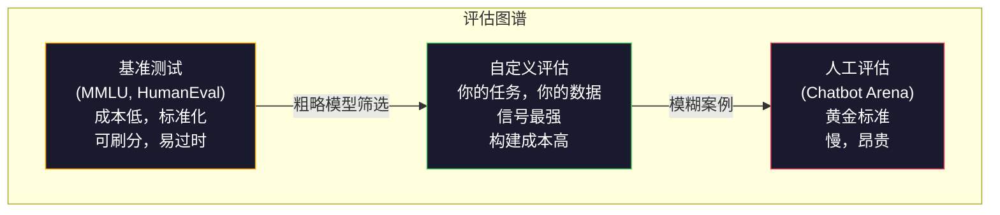
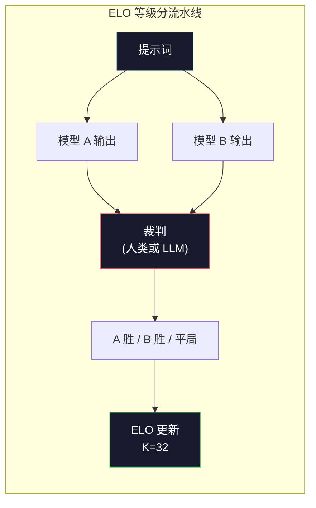

# 评估：基准测试、Evals、LM Harness

> 古德哈特定律（Goodhart's Law）：当一个指标变成目标时，它就不再是一个好指标了。每一个前沿实验室都在“刷”基准测试分数。MMLU 分数不断攀升，但模型仍然无法可靠地数出“strawberry”中有几个“r”。唯一重要的评估是你自己的评估——针对你的任务，使用你的数据。

**Type:** 构建
**Languages:** Python
**Prerequisites:** 第 10 阶段，第 01-05 课（从零构建 LLM）
**Time:** ~90 分钟

## 学习目标

- 构建一个自定义评估工具（Evaluation Harness），用于针对语言模型运行多项选择和开放式基准测试
- 解释为什么标准基准测试（如 MMLU、HumanEval）会达到饱和，并失去区分前沿模型的能力
- 使用适当的指标实现特定任务的评估：精确匹配（Exact Match）、F1 分数、BLEU 和“LLM 作为裁判”（LLM-as-judge）评分
- 设计一套针对你特定用例的自定义评估套件，而不是仅仅依赖公共排行榜

## 问题所在

MMLU 于 2020 年发布，包含 57 个学科的 15,908 个问题。在三年内，前沿模型就已将其“刷”到饱和。GPT-4 得分为 86.4%，Claude 3 Opus 为 86.8%，Llama 3 405B 为 88.6%。排行榜压缩在 3 个百分点的范围内，其中的差异更多是统计噪声，而非真正的能力差距。

与此同时，这些模型在 10 岁孩子都能轻松处理的任务上却频频翻车。Claude 3.5 Sonnet 在 MMLU 上得分 88.7%，但最初却无法数出“strawberry”中的字母个数——这本是一个不需要任何世界知识和推理，仅需字符级迭代的任务。HumanEval 通过 164 个问题测试代码生成，模型得分超过 90%，但生成的代码在任何初级开发人员都能发现的边缘情况下依然会崩溃。

基准测试表现与现实世界可靠性之间的鸿沟是 LLM 评估的核心问题。基准测试只能告诉你模型在基准测试上的表现，几乎无法告诉你该模型在你的特定任务、特定数据以及特定故障模式下的表现。如果你正在构建一个客户支持机器人，MMLU 是无关紧要的。如果你正在构建一个代码助手，HumanEval 仅涵盖函数级的生成——它对跨文件的调试、重构或代码解释毫无参考价值。

你需要自定义评估。这并不是说基准测试毫无用处（它们对于粗略的模型筛选很有用），而是因为最终的评估必须与你的部署条件完全匹配。

## 概念

### 评估图谱

评估分为三类，每类的成本和信号质量各不相同。

**基准测试（Benchmarks）** 是标准化的测试套件。如 MMLU、HumanEval、SWE-bench、MATH、ARC、HellaSwag。你让模型运行基准测试并获得分数。优点：每个人都使用相同的测试，因此可以比较模型。缺点：模型和训练数据日益污染这些基准测试。实验室在包含基准测试问题的数据上进行训练，分数上去了，但能力可能并未提升。

**自定义评估（Custom Evals）** 是你为特定用例构建的测试套件。你定义输入、预期输出和评分函数。法律文档摘要器应在法律文档上进行评估；SQL 生成器应在你的数据库模式上进行评估。这些评估构建成本高，但它们是唯一能预测生产环境性能的评估。

**人工评估（Human Evals）** 使用付费标注员根据有用性、正确性、流畅性和安全性等标准来判断模型输出。这是自动化评分失效时，开放式任务的黄金标准。Chatbot Arena 已经在 100 多个模型中收集了超过 200 万次人类偏好投票。缺点：成本高（每次判断 $0.10-$2.00）且速度慢（需要数小时到数天）。



### 为什么基准测试会失效

三个机制导致基准测试分数不再反映真实能力：

**数据污染（Data contamination）。** 训练语料库抓取自互联网，而基准测试问题也存在于互联网上。模型在训练期间会看到答案。这在传统意义上不算作弊——实验室并非故意包含基准测试数据，但网络规模的抓取使得排除这些数据几乎不可能。

**应试教育（Teaching to the test）。** 实验室会优化训练混合数据以提升基准测试表现。如果训练混合数据中有 5% 是 MMLU 风格的多项选择题，模型就会学习这种格式和答案分布。MMLU 是 4 选 1 的选择题，模型会学到答案分布在 A/B/C/D 之间大致均匀，这即使在模型不知道答案时也能提高得分。

**饱和（Saturation）。** 当每个前沿模型在基准测试中得分都在 85-90% 时，基准测试就失去了区分度。剩下的 10-15% 的问题可能是模糊的、标记错误的，或者需要冷门的领域知识。在 MMLU 上从 87% 提高到 89% 可能意味着模型多记住了两个冷门问题，而不是变得更聪明了。

### 困惑度（Perplexity）：快速健康检查

困惑度衡量模型对 token 序列的“惊讶程度”。形式上，它是平均负对数似然的指数：

```
PPL = exp(-1/N * sum(log P(token_i | context)))
```

困惑度为 10 意味着模型在每个 token 位置上的不确定性平均相当于在 10 个选项中均匀选择。数值越低越好。GPT-2 在 WikiText-103 上的困惑度约为 30，GPT-3 约为 20，Llama 3 8B 约为 7。

困惑度对于在同一测试集上比较模型很有用，但它有盲点。模型可以通过擅长预测常见模式而获得低困惑度，但在罕见但重要的模式上表现极差。它也无法反映指令遵循、推理或事实准确性。将其作为一种“健康检查”，而不是最终判决。

### LLM 作为裁判（LLM-as-judge）

使用强大的模型来评估较弱模型的输出。思路很简单：要求 GPT-4o 或 Claude Sonnet 对回答的正确性、有用性和安全性进行 1-5 分的评分。使用 GPT-4o-mini 进行此类评估，每次判断成本约为 $0.01，且与人类判断的相关性惊人地高——在大多数任务上达成约 80% 的一致性。

评分提示词（Prompt）比模型本身更重要。模糊的提示词（“给这个回答评分”）会产生噪声分数。结构化的提示词配合评分准则（“如果答案事实正确并引用了来源则得 5 分，正确但未引用得 4 分，部分正确得 3 分……”）会产生一致且可复现的分数。

故障模式：裁判模型表现出位置偏见（在成对比较中偏好第一个回答）、冗长偏见（偏好更长的回答）和自我偏好（GPT-4 给 GPT-4 的输出打分高于同等的 Claude 输出）。缓解措施：随机化顺序、按长度归一化、使用与被评估模型不同的裁判模型。

### 基于成对比较的 ELO 等级分

Chatbot Arena 的方法。向人类（或 LLM 裁判）展示同一提示词下两个不同模型的回答，选择较好的一个。通过数千次此类比较，为每个模型计算 ELO 等级分——这与国际象棋中使用的系统相同。

ELO 的优点：相对排名比绝对评分更可靠，能优雅地处理平局，且比独立评分每个输出收敛所需的比较次数更少。截至 2026 年初，Chatbot Arena 的排名显示 GPT-4o、Claude 3.5 Sonnet 和 Gemini 1.5 Pro 在榜首的 ELO 分数差距在 20 分以内。



### 评估框架

**lm-evaluation-harness** (EleutherAI)：标准的开源评估框架。支持 200 多个基准测试。通过一条命令即可针对 MMLU、HellaSwag、ARC 等运行任何 Hugging Face 模型。被 Open LLM Leaderboard 所使用。

**RAGAS**：专门用于 RAG 流水线的评估框架。衡量忠实度（回答是否匹配检索到的上下文？）、相关性（检索到的上下文是否与问题相关？）以及回答正确性。

**promptfoo**：基于配置的提示词工程评估工具。在 YAML 中定义测试用例，针对多个模型运行，并获得通过/失败报告。对于提示词的回归测试非常有用——确保提示词的更改不会破坏现有的测试用例。

### 构建自定义评估

这是生产环境中唯一重要的评估。流程如下：

1. **定义任务。** 模型到底应该做什么？要精确。 “回答问题”太模糊。“给定一封客户投诉邮件，提取产品名称、问题类别和情感”是一个可以评估的任务。

2. **创建测试用例。** 原型评估至少 50 个，生产环境 200 个以上。每个测试用例都是一个 (输入, 预期输出) 对。包含边缘情况：空输入、对抗性输入、模糊输入、其他语言的输入。

3. **定义评分。** 结构化输出使用精确匹配。文本相似度使用 BLEU/ROUGE。开放式生成使用 LLM 作为裁判。提取任务使用 F1 分数。结合多个指标并赋予权重。

4. **自动化。** 每次评估都通过一条命令运行。没有手动步骤。以支持长期比较的格式存储结果。

5. **长期跟踪。** 评估分数孤立来看毫无意义。你需要趋势线。上一次提示词更改后分数是否提高？切换模型后是否倒退？将评估与提示词一起进行版本控制。

| 评估类型 | 每次判断成本 | 与人类一致性 | 最佳适用场景 |
|-----------|------------------|----------------------|----------|
| 精确匹配 | ~$0 | 100% (适用时) | 结构化输出、分类 |
| BLEU/ROUGE | ~$0 | ~60% | 翻译、摘要 |
| LLM 作为裁判 | ~$0.01 | ~80% | 开放式生成 |
| 人工评估 | $0.10-$2.00 | N/A (即真值) | 模糊、高风险任务 |

```figure
perplexity-loss
```

## 构建它

### 第 1 步：最小化评估框架

定义核心抽象。评估用例包含输入、预期输出和可选的元数据字典。评分器接收预测值和参考值，并返回 0 到 1 之间的分数。

```python
import json
from collections import Counter

class EvalCase:
    def __init__(self, input_text, expected, metadata=None):
        self.input_text = input_text
        self.expected = expected
        self.metadata = metadata or {}

class EvalSuite:
    def __init__(self, name, cases, scorers):
        self.name = name
        self.cases = cases
        self.scorers = scorers

    def run(self, model_fn):
        results = []
        for case in self.cases:
            prediction = model_fn(case.input_text)
            scores = {}
            for scorer_name, scorer_fn in self.scorers.items():
                scores[scorer_name] = scorer_fn(prediction, case.expected)
            results.append({
                "input": case.input_text,
                "expected": case.expected,
                "prediction": prediction,
                "scores": scores,
            })
        return results
```

### 第 2 步：评分函数

构建精确匹配、Token F1 和模拟的“LLM 作为裁判”评分器。

```python
def exact_match(prediction, expected):
    return 1.0 if prediction.strip().lower() == expected.strip().lower() else 0.0

def token_f1(prediction, expected):
    pred_tokens = set(prediction.lower().split())
    exp_tokens = set(expected.lower().split())
    if not pred_tokens or not exp_tokens:
        return 0.0
    common = pred_tokens & exp_tokens
    precision = len(common) / len(pred_tokens)
    recall = len(common) / len(exp_tokens)
    if precision + recall == 0:
        return 0.0
    return 2 * (precision * recall) / (precision + recall)

def llm_judge_simulated(prediction, expected):
    pred_words = set(prediction.lower().split())
    exp_words = set(expected.lower().split())
    if not exp_words:
        return 0.0
    overlap = len(pred_words & exp_words) / len(exp_words)
    length_penalty = min(1.0, len(prediction) / max(len(expected), 1))
    return round(overlap * 0.7 + length_penalty * 0.3, 3)
```

### 第 3 步：ELO 等级分系统

实现带有 ELO 更新的成对比较。这正是 Chatbot Arena 用于模型排名的方法。

```python
class ELOTracker:
    def __init__(self, k=32, initial_rating=1500):
        self.ratings = {}
        self.k = k
        self.initial_rating = initial_rating
        self.history = []

    def _ensure_player(self, name):
        if name not in self.ratings:
            self.ratings[name] = self.initial_rating

    def expected_score(self, rating_a, rating_b):
        return 1 / (1 + 10 ** ((rating_b - rating_a) / 400))

    def record_match(self, player_a, player_b, outcome):
        self._ensure_player(player_a)
        self._ensure_player(player_b)

        ea = self.expected_score(self.ratings[player_a], self.ratings[player_b])
        eb = 1 - ea

        if outcome == "a":
            sa, sb = 1.0, 0.0
        elif outcome == "b":
            sa, sb = 0.0, 1.0
        else:
            sa, sb = 0.5, 0.5

        self.ratings[player_a] += self.k * (sa - ea)
        self.ratings[player_b] += self.k * (sb - eb)

        self.history.append({
            "a": player_a, "b": player_b,
            "outcome": outcome,
            "rating_a": round(self.ratings[player_a], 1),
            "rating_b": round(self.ratings[player_b], 1),
        })

    def leaderboard(self):
        return sorted(self.ratings.items(), key=lambda x: -x[1])
```

### 第 4 步：困惑度计算

使用 token 概率计算困惑度。在实践中，你会从模型的 logits 中获取这些概率。这里我们用概率分布进行模拟。

```python
import numpy as np

def perplexity(log_probs):
    if not log_probs:
        return float("inf")
    avg_neg_log_prob = -np.mean(log_probs)
    return float(np.exp(avg_neg_log_prob))

def token_log_probs_simulated(text, model_quality=0.8):
    np.random.seed(hash(text) % 2**31)
    tokens = text.split()
    log_probs = []
    for i, token in enumerate(tokens):
        base_prob = model_quality
        if len(token) > 8:
            base_prob *= 0.6
        if i == 0:
            base_prob *= 0.7
        prob = np.clip(base_prob + np.random.normal(0, 0.1), 0.01, 0.99)
        log_probs.append(float(np.log(prob)))
    return log_probs
```

### 第 5 步：汇总结果

计算评估运行的汇总统计信息：平均值、中位数、阈值通过率以及各指标的细分。

```python
def summarize_results(results, threshold=0.8):
    all_scores = {}
    for r in results:
        for metric, score in r["scores"].items():
            all_scores.setdefault(metric, []).append(score)

    summary = {}
    for metric, scores in all_scores.items():
        arr = np.array(scores)
        summary[metric] = {
            "mean": round(float(np.mean(arr)), 3),
            "median": round(float(np.median(arr)), 3),
            "std": round(float(np.std(arr)), 3),
            "min": round(float(np.min(arr)), 3),
            "max": round(float(np.max(arr)), 3),
            "pass_rate": round(float(np.mean(arr >= threshold)), 3),
            "n": len(scores),
        }
    return summary

def print_summary(summary, suite_name="Eval"):
    print(f"\n{'=' * 60}")
    print(f"  {suite_name} 汇总")
    print(f"{'=' * 60}")
    for metric, stats in summary.items():
        print(f"\n  {metric}:")
        print(f"    平均值:      {stats['mean']:.3f}")
        print(f"    中位数:    {stats['median']:.3f}")
        print(f"    标准差:       {stats['std']:.3f}")
        print(f"    范围:     [{stats['min']:.3f}, {stats['max']:.3f}]")
        print(f"    通过率: {stats['pass_rate']:.1%} (阈值 >= 0.8)")
        print(f"    样本数:         {stats['n']}")
```

### 第 6 步：运行完整流水线

将所有内容串联起来。定义任务，创建测试用例，模拟两个模型，运行评估，从成对比较中计算 ELO，并打印排行榜。

```python
def demo_model_good(prompt):
    responses = {
        "What is the capital of France?": "Paris",
        "What is 2 + 2?": "4",
        "Who wrote Hamlet?": "William Shakespeare",
        "What language is PyTorch written in?": "Python and C++",
        "What is the boiling point of water?": "100 degrees Celsius",
    }
    return responses.get(prompt, "I don't know")

def demo_model_bad(prompt):
    responses = {
        "What is the capital of France?": "Paris is the capital city of France",
        "What is 2 + 2?": "The answer is four",
        "Who wrote Hamlet?": "Shakespeare",
        "What language is PyTorch written in?": "Python",
        "What is the boiling point of water?": "212 Fahrenheit",
    }
    return responses.get(prompt, "Unknown")

cases = [
    EvalCase("What is the capital of France?", "Paris"),
    EvalCase("What is 2 + 2?", "4"),
    EvalCase("Who wrote Hamlet?", "William Shakespeare"),
    EvalCase("What language is PyTorch written in?", "Python and C++"),
    EvalCase("What is the boiling point of water?", "100 degrees Celsius"),
]

suite = EvalSuite(
    name="通用知识",
    cases=cases,
    scorers={
        "exact_match": exact_match,
        "token_f1": token_f1,
        "llm_judge": llm_judge_simulated,
    },
)

results_good = suite.run(demo_model_good)
results_bad = suite.run(demo_model_bad)

print_summary(summarize_results(results_good), "模型 A (简洁)")
print_summary(summarize_results(results_bad), "模型 B (冗长)")
```

“好”模型给出精确答案，“坏”模型给出冗长的释义。精确匹配严重惩罚了冗长的模型。Token F1 和 LLM 作为裁判则更具包容性。这说明了指标选择的重要性：同一个模型根据评分方式的不同，看起来可能非常出色或非常糟糕。

### 第 7 步：ELO 锦标赛

在多轮比赛中运行模型之间的成对比较。

```python
elo = ELOTracker(k=32)

for case in cases:
    pred_a = demo_model_good(case.input_text)
    pred_b = demo_model_bad(case.input_text)

    score_a = token_f1(pred_a, case.expected)
    score_b = token_f1(pred_b, case.expected)

    if score_a > score_b:
        outcome = "a"
    elif score_b > score_a:
        outcome = "b"
    else:
        outcome = "tie"

    elo.record_match("model_a_concise", "model_b_verbose", outcome)

print("\nELO 排行榜:")
for name, rating in elo.leaderboard():
    print(f"  {name}: {rating:.0f}")
```

### 第 8 步：困惑度比较

比较不同质量水平“模型”的困惑度。

```python
test_text = "The quick brown fox jumps over the lazy dog in the garden"

for quality, label in [(0.9, "强模型"), (0.7, "中模型"), (0.4, "弱模型")]:
    log_probs = token_log_probs_simulated(test_text, model_quality=quality)
    ppl = perplexity(log_probs)
    print(f"  {label} (质量={quality}): 困惑度 = {ppl:.2f}")
```

## 使用它

### lm-evaluation-harness (EleutherAI)

在任何模型上运行基准测试的标准工具。

```python
# pip install lm-eval
# 命令行:
# lm_eval --model hf --model_args pretrained=meta-llama/Llama-3.1-8B --tasks mmlu --batch_size 8

# Python API:
# import lm_eval
# results = lm_eval.simple_evaluate(
#     model="hf",
#     model_args="pretrained=meta-llama/Llama-3.1-8B",
#     tasks=["mmlu", "hellaswag", "arc_easy"],
#     batch_size=8,
# )
# print(results["results"])
```

### promptfoo

用于提示词工程的配置驱动评估工具。在 YAML 中定义测试并针对多个提供商运行。

```yaml
# promptfoo.yaml
providers:
  - openai:gpt-4o-mini
  - anthropic:claude-3-haiku

prompts:
  - "用一个词回答: {{question}}"

tests:
  - vars:
      question: "法国的首都是哪里?"
    assert:
      - type: contains
        value: "Paris"
  - vars:
      question: "2 + 2 等于多少?"
    assert:
      - type: equals
        value: "4"
```

### RAGAS 用于 RAG 评估

```python
# pip install ragas
# from ragas import evaluate
# from ragas.metrics import faithfulness, answer_relevancy, context_precision
#
# result = evaluate(
#     dataset,
#     metrics=[faithfulness, answer_relevancy, context_precision],
# )
# print(result)
```

RAGAS 衡量了通用评估所忽略的内容：模型的回答是否基于检索到的上下文，而不仅仅是抽象意义上的“正确”。

## 发布它

本课生成了 `outputs/prompt-eval-designer.md` —— 一个可重用的提示词，用于为任何任务设计自定义评估套件。提供任务描述，它就会生成测试用例、评分函数和通过/失败阈值建议。

它还生成了 `outputs/skill-llm-evaluation.md` —— 一个基于任务类型、预算和延迟要求选择正确评估策略的决策框架。

## 练习

1. 添加一个“一致性”评分器，将相同的输入运行 5 次，并衡量输出匹配的频率。在确定性输入上出现不一致的回答，通常揭示了脆弱的提示词或过高的温度（Temperature）设置。

2. 扩展 ELO 追踪器以支持多个裁判函数（精确匹配、F1、LLM 作为裁判）并为它们加权。比较当你对精确匹配赋予高权重与对 F1 赋予高权重时，排行榜有何变化。

3. 为特定任务构建评估套件：将电子邮件分类为 5 个类别。创建 100 个包含多样化示例的测试用例，包括边缘情况（属于多个类别的邮件、空邮件、其他语言的邮件）。衡量不同“模型”（基于规则、关键词匹配、模拟 LLM）的表现。

4. 实现污染检测：给定一组评估问题和训练语料库，检查百分之多少的评估问题（或近义改写）出现在训练数据中。这是研究人员审计基准测试有效性的方法。

5. 构建一个“模型差异”工具。给定两个模型版本的评估结果，高亮显示哪些特定测试用例有所改进、哪些倒退、哪些保持不变。这是代码差异（code diff）的评估版本——对于理解更改是有益还是有害至关重要。

## 关键术语

| 术语 | 人们常说 | 实际含义 |
|------|----------------|----------------------|
| MMLU | “那个基准测试” | 大规模多任务语言理解——57 个学科的 15,908 个多项选择题，到 2025 年已在 88% 以上饱和 |
| HumanEval | “代码评估” | OpenAI 的 164 个 Python 函数补全问题，仅测试孤立的函数生成 |
| SWE-bench | “真实编码评估” | 来自 10 个 Python 仓库的 2,294 个 GitHub Issue，衡量包括测试生成在内的端到端 Bug 修复能力 |
| 困惑度 | “模型有多困惑” | exp(-avg(log P(token_i | context))) —— 数值越低，意味着模型为实际 token 分配的概率越高 |
| ELO 等级分 | “模型的国际象棋排名” | 从成对胜负记录计算出的相对技能等级，Chatbot Arena 用它来对 100 多个模型进行排名 |
| LLM 作为裁判 | “用 AI 给 AI 打分” | 强模型根据准则对弱模型的输出进行评分，与人类裁判的一致性约为 80%，成本约为 $0.01/次 |
| 数据污染 | “模型看过考题” | 训练数据包含基准测试问题，导致分数虚高而真实能力未提升 |
| 评估套件 | “一堆测试” | 一个版本化的 (输入, 预期输出, 评分器) 三元组集合，用于衡量特定能力 |
| 通过率 | “它做对了百分之几” | 得分超过阈值的评估用例比例——比平均分更具可操作性，因为它衡量的是可靠性 |
| Chatbot Arena | “模型排名网站” | LMSYS 平台，拥有 200 万+人类偏好投票，通过 ELO 等级分产生最受信任的 LLM 排行榜 |

## 延伸阅读

- [Hendrycks et al., 2021 -- "Measuring Massive Multitask Language Understanding"](https://arxiv.org/abs/2009.03300) -- MMLU 论文，尽管已饱和，仍是引用次数最多的 LLM 基准测试
- [Chen et al., 2021 -- "Evaluating Large Language Models Trained on Code"](https://arxiv.org/abs/2107.03374) -- OpenAI 的 HumanEval 论文，确立了代码生成评估方法论
- [Zheng et al., 2023 -- "Judging LLM-as-a-Judge"](https://arxiv.org/abs/2306.05685) -- 关于使用 LLM 评估 LLM 的系统性分析，包括位置偏见和冗长偏见的发现
- [LMSYS Chatbot Arena](https://chat.lmsys.org/) -- 众包模型比较平台，拥有 200 万+投票，最受信任的现实世界 LLM 排名