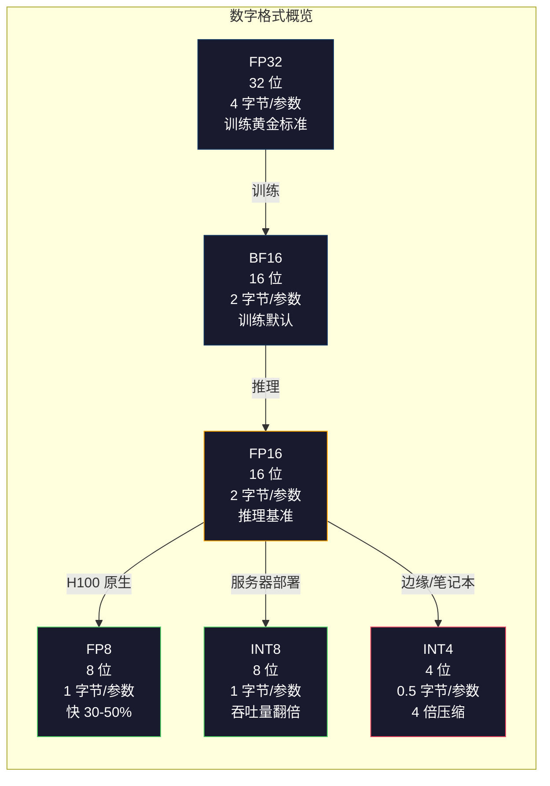
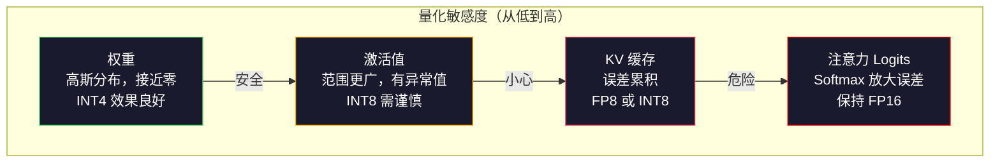
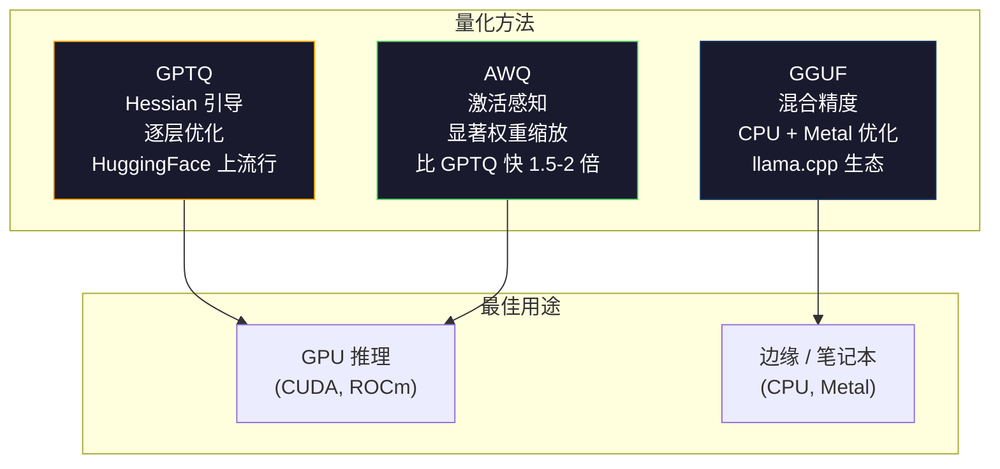

# 量化：让模型“瘦身”

> 一个 70B 参数的模型在 FP16 下需要 140GB 显存。仅权重就需要两张 A100。量化到 FP8：只需一张 80GB GPU。INT4：甚至可以在 MacBook 上运行。

**Type:** 构建 (Build)
**Languages:** Python (使用 numpy)
**Prerequisites:** 第 10 阶段，第 01-10 课 (从零构建 LLM)
**Time:** ~120 分钟

## 学习目标

- 实现从 FP16 到 INT8 和 INT4 的对称与非对称量化，包括张量级 (per-tensor) 和通道级 (per-channel) 缩放
- 计算量化带来的内存节省，并确定给定 GPU 显存所能容纳的精度
- 解释训练后量化 (PTQ) 与量化感知训练 (QAT) 的区别
- 应用 GPTQ 或 AWQ 量化真实模型，并衡量基准测试中的精度与内存权衡

## 问题所在

Llama 3 70B 拥有 700 亿个参数。每个参数是一个 16 位浮点数。即 1400 亿字节，也就是 140GB。单张 A100 只有 80GB 显存。你甚至无法将权重加载到单张 GPU 上，更不用说进行推理了。你需要两张 A100，每小时花费 2 美元，仅仅是为了服务一个模型。

但每个参数 16 位是浪费的。神经网络中的大多数权重都聚集在零附近。FP16 的完整动态范围（从 0.000000059 到 65,504）几乎完全未被利用。如果你测量 Llama 3 70B 中权重的实际分布，95% 的权重落在 -0.1 到 +0.1 之间。你正在消耗 16 位来表示本可以用 4 位就能容纳的值。

量化用低精度数字替换高精度数字。FP16 到 FP8 将内存减半。FP16 到 INT4 将其减少到四分之一。那个 140GB 的模型变成了 35GB。它可以在单张消费级 GPU 上运行。推向 2 位量化（激进、有损，但对某些任务可用），同一个模型可以在 16GB 的笔记本电脑上运行。

代价是精度。你移除的每一位都会破坏信息。问题在于你损失了多少精度以及损失在哪里。一个经过良好量化的 INT4 模型在大多数基准测试中保留了原始模型 95-99% 的质量。而盲目的 INT4 量化可能会彻底摧毁模型。区别在于技术。

社区使用 GPTQ 对 Llama 3 进行的 INT4 量化显示，在 WikiText 上大约损失 1-2 个困惑度 (perplexity) 点。Mistral 发布了 Mixtral 8x22B 的 FP8 检查点，在 MMLU 上没有可测量的质量损失。GGUF 格式驱动了 llama.cpp，使得 70B 模型可以在配备 M 系列芯片的 MacBook 上运行。量化不是一种黑客手段，它是所有大于 7B 的模型部署的标准路径。

## 概念

### 数字格式：每一位的作用

每个浮点数都有三个部分：符号位、指数位和尾数位（也称为有效数字）。符号位占 1 位。指数决定范围（数字可以有多大或多小）。尾数决定精度（你能得到多少位小数）。

```
FP32:  [1 符号] [8 指数] [23 尾数]  = 32 位
FP16:  [1 符号] [5 指数] [10 尾数]  = 16 位
BF16:  [1 符号] [8 指数] [7  尾数]  = 16 位
FP8:   [1 符号] [4 指数] [3  尾数]  = 8  位 (E4M3)
FP8:   [1 符号] [5 指数] [2  尾数]  = 8  位 (E5M2)
INT8:  [1 符号] [7 数值]           = 8  位 (均匀步长)
INT4:  [1 符号] [3 数值]           = 4  位 (共 16 个级别)
```

**FP32** 是全精度。23 位尾数提供了约 7 位十进制数字的精度。范围：大约 1.2 x 10^-38 到 3.4 x 10^38。过去训练完全在 FP32 中进行。它在累加（矩阵乘法期间的运行总和）中仍然使用。

**FP16** 将位数减半。10 位尾数提供约 3.3 位十进制数字。指数缩小到 5 位，极大地减小了范围（最大值约 65,504）。这对于权重（聚集在零附近）来说没问题，但对于在训练期间可能激增的激活值和梯度来说很危险。FP16 训练需要损失缩放 (loss scaling) 来防止下溢。

**BF16** (Brain Float 16) 保留了 FP32 的 8 位指数，但将尾数缩小到 7 位。与 FP32 相同的范围，精度低于 FP16。Google 专门为深度学习设计了它。直觉是：对于神经网络，范围比精度更重要。一个在 FP16 中下溢为零的 10^-20 梯度在 BF16 中可以存活。一个在 BF16 中四舍五入为 0.0734 的权重 0.07342 已经足够接近了。现代训练运行都使用 BF16 或 BF16/FP32 混合。

**FP8** 有两种形式。E4M3（4 位指数，3 位尾数）用于推理期间的权重和激活。E5M2（5 位指数，2 位尾数）用于训练期间范围比精度更重要的梯度。H100 GPU 上的 FP8 推理比 FP16 实现了 30-50% 的加速，且质量损失可忽略不计。

**INT8** 是一种整数格式。没有指数，没有尾数。只有从 -128 到 127 的 256 个均匀间隔的值。你需要一个缩放因子将浮点权重映射到这个范围。优势：整数算术比浮点算术更快、更节能。A100 上的 INT8 矩阵乘法运行速度为 624 TOPS，而 FP16 为 312 TFLOPS。

**INT4** 更进一步。只有 16 个可能的值。缩放因子起到了关键作用。质量完全取决于你如何选择缩放比例以及量化哪些权重。最先进的 INT4 方法（GPTQ、AWQ）保留了原始模型 95% 以上的质量。



### 量化是如何工作的

核心操作很简单。取一个浮点值张量，找到一个缩放因子，相乘，四舍五入到最接近的整数，然后存储整数和缩放因子。

**量化：**
```
scale = max(abs(tensor)) / max_int_value
quantized = round(tensor / scale)
```

**反量化：**
```
reconstructed = quantized * scale
```

对于具有对称范围（-127 到 127）的 INT8：
```
scale = max(abs(tensor)) / 127
quantized = clamp(round(tensor / scale), -128, 127)
```

误差就是舍入误差。每个值最多偏离 `scale / 2`。整个层的总误差取决于你有多少权重以及模型对这些权重的扰动有多敏感。

**张量级与通道级量化。** 张量级量化对整个权重矩阵使用一个缩放因子。简单但有损：如果一列有大值而另一列有小值，小值会丢失大部分精度。通道级量化对每个输出通道（权重矩阵的每一行或每一列）使用一个缩放因子。开销更大（你存储 N 个缩放因子而不是 1 个），但质量显著提高。每个生产级量化方法都使用通道级或更细粒度的量化。

**非对称量化**增加了零点偏移：`quantized = round(tensor / scale) + zero_point`。这处理了不以零为中心的分布。例如，ReLU 激活始终是非负的。对称量化在从不出现的负值上浪费了一半的整数范围。非对称量化将实际范围 [min, max] 映射到完整的整数范围。

### 敏感度层级

模型中并非所有部分对量化的容忍度都相同。存在一个明确的层级。

**权重（最稳健）。** 模型权重在训练期间变化缓慢，并遵循以零为中心的高斯分布。它们量化效果很好。具有通道级缩放的 INT8 权重产生几乎无损的结果。INT4 需要更复杂的方法，但也能工作。

**激活值（中等敏感度）。** 激活值是推理期间流经网络的中间值。它们比权重具有更宽的动态范围，并且包含异常值。单个注意力头可能会产生比平均值大 100 倍的激活值。这些异常值对模型质量至关重要。盲目量化它们会破坏信息。解决方案：将异常值通道保持在更高精度 (LLM.int8())，使用每个 Token 或每个通道的激活缩放。

**KV 缓存（高敏感度）。** KV 缓存存储了所有先前 Token 的注意力状态。在长上下文长度下，KV 缓存占据了内存的主导地位。对于 32K 上下文的 70B 模型，仅 KV 缓存在 FP16 下就占 40GB。将 KV 缓存量化为 FP8 或 INT8 可以节省大量内存，但任何误差都会在所有未来的注意力计算中累积。质量影响随序列长度而增加。

**注意力 Logits（最敏感）。** 注意力中的 Softmax 对其输入的微小变化高度敏感。Softmax 前 Logit 中 0.01 的量化误差可能会显著改变注意力分布。大多数量化方案即使在其他一切都被量化时，也会将注意力计算保持在更高精度（FP16 或 BF16）。



### PTQ 与 QAT

**训练后量化 (PTQ)** 量化一个已经训练好的模型。无需重新训练。你获取 FP16 权重，计算缩放因子，四舍五入，然后部署。快速（几分钟到几小时）且廉价。对于 INT8 和 FP8 效果很好。对于 INT4，朴素的 PTQ 通常会严重失败，因为舍入误差会累积。高级 PTQ 方法（GPTQ、AWQ）使用校准数据来最小化量化误差。

**量化感知训练 (QAT)** 在训练期间将伪量化操作插入前向传播中。模型学习将其权重放置在舍入误差较小的地方。梯度通过伪量化使用直通估计器 (STE) 流动：假定舍入操作的梯度为 1。QAT 比 PTQ 产生更好的 INT4 和 INT2 模型，但需要完整的训练运行。Google 将 QAT 用于 Gemini 的高效服务。Meta 将 QAT 用于某些 Llama 部署目标。

| 方面 | PTQ | QAT |
|--------|-----|-----|
| 成本 | 分钟到小时 | 完整训练运行 |
| INT8 质量 | 极佳 (< 0.1% 损失) | 极佳 |
| INT4 质量 | GPTQ/AWQ 下良好 (1-3% 损失) | 更好 (< 1% 损失) |
| INT2 质量 | 较差 | 对某些任务可用 |
| 校准数据 | 128-1024 个样本 | 完整训练数据集 |
| 何时使用 | 部署、迭代 | 低位宽下的最高质量 |

### GPTQ, AWQ, GGUF

**GPTQ (GPT Quantization)** 是一种一次性 PTQ 方法。它逐层量化权重，使用少量校准数据集（通常为 128 个样本）来测量 Hessian 矩阵（关于输出对每个权重敏感程度的二阶信息）。Hessian 认为重要的权重会被更仔细地量化。GPTQ 是第一个使 LLM 的 INT4 量化变得实用的方法。Hugging Face 上的 TheBloke 通过发布数百个模型的量化版本普及了 GPTQ。

**AWQ (Activation-Aware Weight Quantization)** 观察到一小部分权重（约 1%）因为与大的激活值相乘而具有不成比例的重要性。AWQ 使用校准数据识别这些显著权重，并在量化前将其放大（然后相应地缩小激活值）。这使得重要权重保持在 INT4 量化准确的范围内。AWQ 通常在质量上匹配或略胜于 GPTQ，同时应用速度快 1.5-2 倍。

**GGUF (GPT-Generated Unified Format)** 是 llama.cpp 及其生态系统使用的文件格式。它支持混合量化：不同的层获得不同的位宽。第一层和最后一层（嵌入层和输出头）通常保持在更高精度。中间层获得 INT4 或 INT3。GGUF 文件是自包含的：权重、分词器、元数据都在一个文件中。该格式专为 CPU 推理和 Apple Silicon 设计，其中将整个模型加载到内存并在 CPU 或 Metal GPU 上运行矩阵乘法是标准路径。Q4_K_M 是最流行的 GGUF 量化变体，平衡了质量和大小。



### 质量衡量

你怎么知道你的量化模型是否仍然好用？

**困惑度 (Perplexity)。** 最常见的指标。越低越好。计算原始模型和量化模型在留出数据集（WikiText-2 是标准）上的困惑度。差值告诉你量化破坏了多少信息。经验法则：差值 < 0.5 为极佳，0.5-1.0 为良好，1.0-2.0 对大多数任务可接受，> 2.0 意味着出了问题。

**任务特定基准。** 在 MMLU、HumanEval、GSM8K 或你的自定义评估套件上运行量化模型。与原始模型进行比较。量化对不同能力的影响不均匀。数学和代码任务对精度损失比一般知识更敏感。

**输出比较。** 在相同的提示词上生成两个模型的响应并进行比较。LLM-as-judge（第 10 课）在这里效果很好。计算胜率：量化模型在多少比例的提示词上匹配或击败了原始模型？

**延迟和吞吐量。** 量化是为了使模型更快、更便宜。测量每秒 Token 数、首个 Token 时间和内存使用情况。比原始模型慢的量化模型不仅没用，甚至更糟。

| 模型 | 格式 | 大小 | 困惑度 (WikiText-2) | MMLU | Token/秒 (A100) |
|-------|--------|------|------------------------|------|-------------------|
| Llama 3 70B | FP16 | 140GB | 3.12 | 79.5% | 38 |
| Llama 3 70B | FP8 | 70GB | 3.14 | 79.3% | 55 |
| Llama 3 70B | GPTQ INT4 | 35GB | 4.32 | 77.8% | 72 |
| Llama 3 70B | AWQ INT4 | 35GB | 4.18 | 78.1% | 75 |
| Llama 3 70B | GGUF Q4_K_M | 40GB | 4.25 | 77.9% | 28 (CPU) |

规律：FP8 几乎是免费的。INT4 损失 1-2 个 MMLU 点，但吞吐量翻倍，内存减为四分之一。对于几乎所有的部署，这种权衡都是值得的。

### 实际数字

H100 上的 FP16 到 FP8：30-50% 的推理加速，< 0.1% 的质量损失。这是无需思考的量化。每个 H100 部署都应该使用它。

FP16 到 INT8 (LLM.int8())：2 倍内存减少，< 0.5% 质量损失。混合精度方法将异常特征保持在 FP16 中，同时将其他所有内容量化为 INT8。

FP16 到 INT4 (GPTQ/AWQ)：4 倍内存减少，1-3% 的质量损失，具体取决于模型和方法。使 70B 模型可以在单张 48GB GPU 上运行。

FP16 到 INT4 (GGUF Q4_K_M)：3.5 倍内存减少，1-2% 的质量损失。针对 CPU 推理优化。Q4_K_M 下的 70B 模型约为 40GB，在配备 64GB 内存的 M3 Max 上以 10-15 Token/秒的速度运行。

FP16 到 INT2：8 倍内存减少，5-15% 的质量损失。仅适用于你可以容忍退化的特定狭窄任务。研究前沿，尚未准备好用于通用生产。

## 构建它

### 第 1 步：数字格式表示

构建每种格式的位级表示，以确切了解符号、指数和尾数的作用。

```python
import numpy as np

# ... (此处省略代码实现，请参考原文档中的 Python 代码块)
```

### 第 2 步：对称量化（张量级和通道级）

基本的量化操作。张量级对整个矩阵使用一个缩放比例。通道级对每一行或每一列使用一个缩放比例。

```python
# ... (此处省略代码实现)
```

### 第 3 步：质量衡量

衡量量化破坏了多少信息。均方误差、信噪比以及原始张量与重构张量之间的余弦相似度。

```python
# ... (此处省略代码实现)
```

### 第 4 步：位宽扫描

在不同的位宽（2, 3, 4, 8, 16）下量化同一个张量，并测量每个级别的质量。这准确地展示了质量悬崖在哪里。

```python
# ... (此处省略代码实现)
```

### 第 5 步：敏感度实验

模拟量化 Transformer 的不同部分，并测量哪些组件最敏感。这证明了敏感度层级：权重 < 激活值 < KV 缓存 < 注意力。

```python
# ... (此处省略代码实现)
```

### 第 6 步：模拟 GPTQ

GPTQ 一次量化一列，使用 Hessian 矩阵来决定如何分配舍入误差。这是一个简化的版本，捕捉了核心思想：使用校准数据来测量权重重要性，然后更激进地量化最不重要的权重。

```python
# ... (此处省略代码实现)
```

### 第 7 步：AWQ 模拟

AWQ 识别显著权重（那些与大激活值相乘的权重），并通过在量化前进行缩放来保护它们。

```python
# ... (此处省略代码实现)
```

### 第 8 步：完整流水线

将所有内容连接起来。在同一个权重矩阵上比较朴素量化、通道级量化、GPTQ 和 AWQ。

```python
# ... (此处省略代码实现)
```

## 使用它

### 使用 AutoGPTQ 进行量化

```python
# pip install auto-gptq transformers
# ... (代码实现)
```

### 使用 AutoAWQ 进行量化

```python
# pip install autoawq
# ... (代码实现)
```

### 转换为 GGUF

```bash
# pip install llama-cpp-python
# python convert_hf_to_gguf.py meta-llama/Llama-3.1-8B --outtype q4_k_m --outfile llama-8b-q4km.gguf
# llama-server -m llama-8b-q4km.gguf -c 4096 -ngl 99
```

### 使用 vLLM 服务

```python
# pip install vllm
# vllm serve model-awq --quantization awq --dtype half --max-model-len 8192
```

vLLM 原生支持 AWQ 和 GPTQ 模型。它在矩阵乘法期间处理反量化，并为 KV 缓存使用分页注意力 (paged attention)。对于 H100 上的 FP8，添加 `--dtype float8_e4m3fn`。

## 发布它

本课生成 `outputs/skill-quantization.md`，这是一个用于选择正确量化策略的决策框架。根据你的模型大小、目标硬件和质量要求，它会告诉你使用哪种格式、方法和验证步骤。它包括内存预算计算、各组件精度建议以及 vLLM、llama.cpp 和 TensorRT-LLM 的部署方案。

## 练习

1. 实现分组量化。不要每个通道使用一个缩放比例，而是对通道内每 128 个权重的组使用一个缩放比例。这就是 GPTQ 和 AWQ 实际使用的。在同一个权重矩阵上比较 32、64、128 和 256 的组大小。较小的组提供更好的质量，但缩放因子的存储开销更大。

2. 构建一个混合精度量化器。将多层网络的第一层和最后一层量化为 INT8，同时将中间层量化为 INT4。比较端到端输出质量与统一 INT4 和统一 INT8 的对比。测量与全 INT8 相比的内存节省。

3. 实现用于量化感知训练的直通估计器 (STE)。在简单的两层网络的前向传播中插入伪量化/反量化操作，该网络在回归任务上进行训练。比较正常训练（然后 PTQ 到 INT4）的模型与从一开始就使用 QAT 训练的模型的最终损失。

4. 构建一个受 LLM.int8() 启发的异常值感知量化器。检测激活幅度超过平均值 6 倍的通道。将这些通道保持在 FP16 中，并将其他所有内容量化为 INT8。在第 5 步的 Transformer 层上，使用不同的异常值阈值（3x, 6x, 10x）测量端到端质量。

5. 构建一个量化质量仪表板。给定一个权重矩阵，计算并显示：权重分布直方图、量化误差分布、通道级缩放因子、最差量化通道（重构误差最高），以及在 100 个随机输入上原始输出与量化输出之间的余弦相似度。确定哪些通道应该保持在更高精度。

## 关键术语

| 术语 | 人们怎么说 | 它实际上意味着什么 |
|------|----------------|----------------------|
| FP16 | “半精度” | 16 位浮点数，具有 5 位指数和 10 位尾数，最大值 65,504，标准推理格式 |
| BF16 | “Brain float” | 16 位浮点数，具有 8 位指数（与 FP32 范围相同）和 7 位尾数，由 Google 为训练设计 |
| FP8 | “八位浮点数” | 两种变体：E4M3（推理，精度更高）和 E5M2（训练，范围更大），H100 原生支持 |
| INT8 | “八位整数” | 从 -128 到 127 的 256 个均匀间隔的值，需要缩放因子从浮点数映射 |
| INT4 | “四位整数” | 总共 16 个级别，需要复杂的方法（GPTQ、AWQ）来保持质量 |
| 通道级量化 | “每行一个缩放比例” | 为每个输出通道使用单独的缩放因子，而不是为整个张量使用一个，显著减少误差 |
| GPTQ | “Hessian 方法” | 使用二阶信息最小化输出误差的训练后量化，一次一层 |
| AWQ | “激活感知” | 在量化前缩放显著权重（那些与大激活值相乘的权重）以保护它们 |
| GGUF | “llama.cpp 格式” | 包含混合精度层的自包含模型文件，针对 CPU 和 Apple Silicon 推理优化 |
| PTQ | “训练后量化” | 在不重新训练的情况下将训练好的模型权重转换为低精度，快速但在极端压缩下受限 |
| QAT | “训练期间量化” | 在前向传播中插入伪量化，使模型学习容忍舍入，在 INT4/INT2 下更好 |
| 校准数据 | “128 个样本” | 通过模型运行的一小部分数据集，用于计算设置缩放因子的激活统计信息 |
| 缩放因子 | “乘数” | 在浮点范围和整数范围之间转换：`float_val = int_val * scale` |
| 困惑度差值 | “差多少” | 原始模型和量化模型之间的困惑度差异，< 0.5 为极佳，> 2.0 为问题 |

## 延伸阅读

- [Frantar et al., 2022 -- "GPTQ: Accurate Post-Training Quantization for Generative Pre-trained Transformers"](https://arxiv.org/abs/2210.17323) -- 使 INT4 量化通过 Hessian 引导的权重舍入对 LLM 变得实用的论文
- [Lin et al., 2023 -- "AWQ: Activation-aware Weight Quantization for LLM Compression and Acceleration"](https://arxiv.org/abs/2306.00978) -- 通过在量化前缩放来保护显著权重，匹配或击败 GPTQ
- [Dettmers et al., 2022 -- "LLM.int8(): 8-bit Matrix Multiplication for Transformers at Scale"](https://arxiv.org/abs/2208.07339) -- 混合精度 INT8，将异常特征保持在 FP16 中，实现无质量损失的 INT8 推理
- [Xiao et al., 2023 -- "SmoothQuant: Accurate and Efficient Post-Training Quantization for Large Language Models"](https://arxiv.org/abs/2211.10438) -- 将量化难度从激活值迁移到权重，用于 W8A8 部署
- [Micikevicius et al., 2022 -- "FP8 Formats for Deep Learning"](https://arxiv.org/abs/2209.05433) -- 定义了现在 H100 原生支持的 E4M3 和 E5M2 格式的 NVIDIA/ARM/Intel 论文