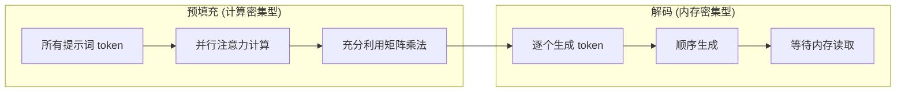
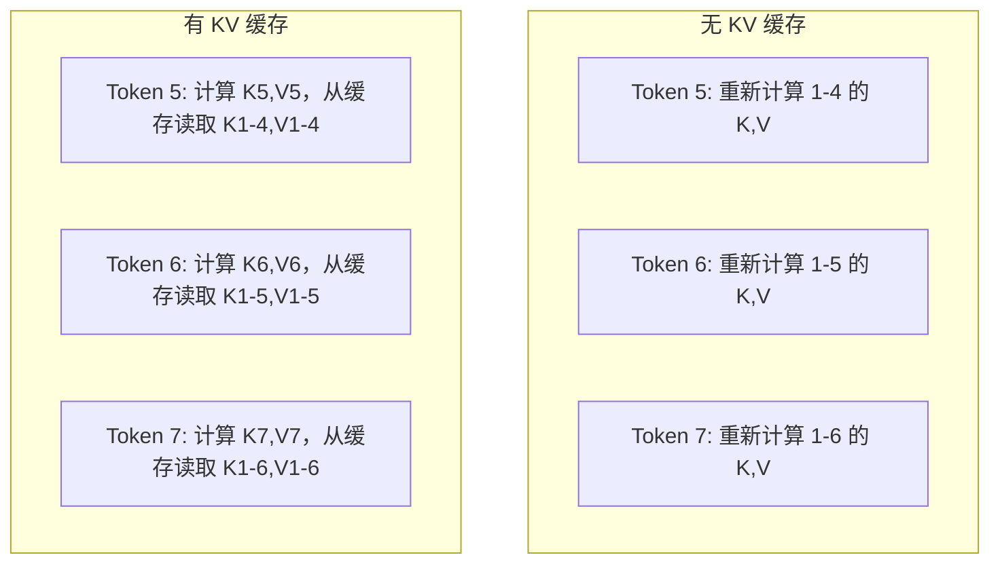
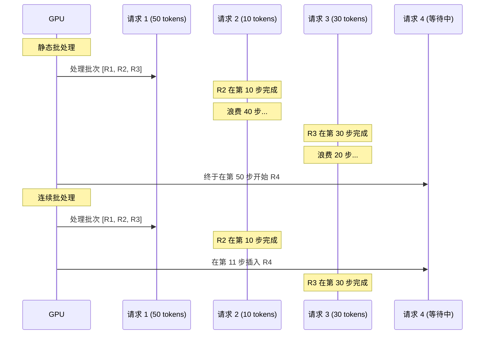
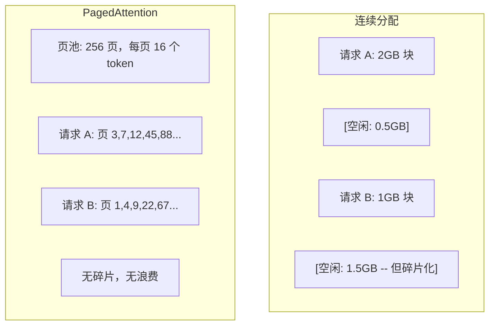
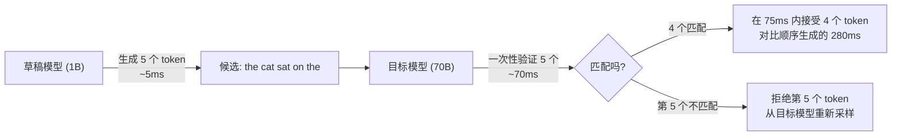

# 推理优化

> LLM 推理分为两个阶段。预填充（Prefill）并行处理提示词——属于计算密集型。解码（Decode）逐个生成 token——属于内存密集型。每一项优化都针对其中一个或两个阶段。

**Type:** 构建
**Languages:** Python
**Prerequisites:** 第 10 阶段，第 01-08 课（Transformer 架构，注意力机制）
**Time:** ~120 分钟

## 学习目标

- 实现 KV 缓存（KV-cache），以消除自回归 token 生成过程中的冗余计算
- 解释 LLM 推理的预填充与解码阶段，以及为何它们具有不同的瓶颈（计算密集型 vs 内存密集型）
- 实现连续批处理（Continuous batching）和 PagedAttention 概念，以在并发请求下最大化 GPU 利用率
- 比较推理优化技术（KV 缓存、投机性解码、Flash Attention）及其在吞吐量/延迟方面的权衡

## 问题所在

你在 4x A100 GPU 上部署了 Llama 3 70B 模型。单个用户可以获得约 50 token/秒的响应速度，感觉很快。但当 100 个用户同时访问该端点时，吞吐量下降到 3 token/秒/用户。你每月 25,000 美元的 GPU 账单产生的响应速度甚至比人类打字还慢。

模型本身在 1 个用户和 100 个用户之间没有变化。权重相同，架构相同，数学原理相同。改变的是你调度工作的方式。朴素的推理浪费了 90% 以上的可用 GPU 计算能力。一个等待第 47 个 token 的用户会占用整个批处理槽位，而 GPU 内存总线在矩阵乘法之间处于空闲状态。与此同时，新用户 2,000 个 token 的提示词本可以填补这段空闲时间进行有效的计算。

这不是一个扩展性问题，而是一个调度问题。本课介绍的技术——KV 缓存、连续批处理、PagedAttention、投机性解码、前缀缓存——是将每月 2.5 万美元的推理账单降至 5 千美元且服务相同流量的关键。

vLLM 在 4x A100-80GB 上运行 Llama 3 70B，在低并发下可达到约 50 token/秒/用户，通过连续批处理和 PagedAttention，在 100 个并发请求下仍能维持 15-25 TPS/用户。如果没有这些优化，同样的硬件在相同并发下仅能提供 5 TPS/用户。同样的 GPU，同样的模型，吞吐量却提升了 4 倍。

## 概念

### 预填充 vs 解码

每个 LLM 推理请求都有两个截然不同的阶段。

**预填充（Prefill）** 处理整个输入提示词。所有 token 都是已知的，因此可以在整个序列上并行计算注意力。这是一个大型矩阵乘法——GPU 核心保持忙碌。瓶颈在于计算：硬件每秒能提供多少 FLOPS。A100 可提供 312 TFLOPS (BF16)。在单张 A100 上，对 70B 模型进行 4,096 个 token 的预填充大约需要 400 毫秒。

**解码（Decode）** 逐个生成输出 token。每个新 token 都会关注之前的所有 token，但每次前向传播只产生一个 token。权重矩阵的大小与预填充时相同，但你是在将它们与一个向量而不是矩阵相乘。GPU 核心在微秒内完成计算，然后等待下一批权重从内存中加载。瓶颈在于内存带宽：从 HBM（高带宽内存）向计算单元传输模型权重的速度。A100 的带宽为 2 TB/s。FP16 格式的 70B 模型大小为 140 GB。读取整个模型一次需要 70 毫秒——这就是单步解码的理论下限。



**运算:字节比（ops:byte ratio）**（也称为算术强度）捕捉了这种权衡。它衡量了每从内存加载一个字节所执行的运算次数。

```
运算:字节比 = 每个 token 的 FLOPs / 从内存读取的字节数
```

在 4,096 个 token 的批处理预填充期间，每加载一个权重，你执行约 4,096 次乘加运算。该比率很高——属于计算密集型。在批大小为 1 的解码期间，每加载一个权重，你执行约 1 次运算。该比率很低——属于内存密集型。

核心洞察：*解码之所以是内存密集型的，是因为你为了生成一个 token 而读取了整个模型*。下面提到的每一项优化要么减少读取量，要么增加每次读取处理的 token 批次，要么完全避免读取。

### KV 缓存

在注意力计算过程中，每个 token 的查询（Query）都会关注之前所有 token 的键（Key）和值（Value）向量。如果不使用缓存，生成第 N 个 token 需要重新计算所有 N-1 个前序 token 的键和值投影。生成第 2 个 token 时投影第 1 个 token，生成第 3 个时再次投影，生成第 4 个时又投影。到第 1,000 个 token 时，你总共对第 1 个 token 进行了 999 次投影。

KV 缓存存储了所有前序 token 的键和值投影。当生成第 N 个 token 时，你只需计算第 N 个 token 的键和值，然后将它们与第 1 到 N-1 个 token 的缓存 K/V 连接起来。



**KV 缓存内存公式：**

```
KV 缓存大小 = 2 * 层数 * KV 头数 * 头维度 * 序列长度 * 每个参数的字节数
```

以 Llama 3 70B 为例（80 层，使用 GQA 的 8 个 KV 头，head_dim=128，BF16）：

```
每个 token: 2 * 80 * 8 * 128 * 2 字节 = 327,680 字节 = 320 KB
4,096 个 token: 320 KB * 4,096 = 1.28 GB
128K 个 token: 320 KB * 131,072 = 40 GB
```

Llama 3 70B 的单次 128K 上下文对话会消耗 40 GB 的 KV 缓存——占用了 A100 一半的内存。如果有 100 个并发用户，每个用户 4K token，仅 KV 缓存就需要 128 GB。这就是为什么 KV 缓存管理是推理优化的核心挑战。

### 连续批处理

静态批处理会等待一批 N 个请求到达，一起处理，并在接受新请求之前等待*所有*请求完成。如果一个请求需要 500 个 token，另一个需要 10 个，那么短的请求在完成后的 490 个解码步骤中会处于空闲状态。

连续批处理（也称为迭代级批处理）会在任何请求完成时立即将新请求插入批次中。批次在每个解码步骤都会重新评估。一个在 10 个 token 后完成的请求会立即被等待中的请求替换。



吞吐量的提升取决于输出长度的变化程度。如果长度均匀，连续批处理与静态批处理相当。如果长度可变（常见情况），连续批处理可以提供 2-5 倍的吞吐量，因为 GPU 槽位永远不会空闲。

### PagedAttention

每个请求的 KV 缓存通常是一块连续的内存。随着请求的到达和离开，内存会产生碎片——就像操作系统中的 RAM 碎片一样。一个 4K token 的请求需要 1.28 GB 的连续空间。即使你总共有 2 GB 的空闲内存，也可能没有 1.28 GB 的*连续*空间。你要么浪费内存，要么拒绝请求。

PagedAttention（来自 vLLM）将操作系统风格的虚拟内存应用于 KV 缓存。它不再为每个请求分配一块连续的内存，而是分配固定大小的“页”（通常每页 16 个 token）。页可以位于物理 GPU 内存的任何位置。页表将每个请求的逻辑序列位置映射到物理页位置。



PagedAttention 还为共享前缀启用了**写时复制（copy-on-write）**。如果 50 个请求共享相同的系统提示词，该系统提示词的 KV 缓存页只存储一次，并被所有 50 个请求引用。只有当请求出现分歧（不同的用户消息）时，它才会获得自己的页。这对于具有共享系统提示词的应用程序来说，极大地减少了内存使用。

vLLM 报告称，通过 PagedAttention，内存浪费几乎为零（约 4%，而朴素分配为 60-80%）。

### 投机性解码

解码之所以慢，是因为它是顺序的——你生成一个 token，反馈回去，再生成下一个。但如果你能以低成本猜出接下来的 5 个 token，然后一次性验证它们呢？

投机性解码使用一个小型、快速的**草稿模型（draft model）**来生成 K 个候选 token。然后，大型**目标模型（target model）**在一次前向传播中处理所有 K 个候选 token（这看起来像预填充——并行、计算密集、高效）。如果目标模型同意草稿模型的预测，你就在一次目标模型前向传播的时间内接受了所有 K 个 token。如果它在位置 j 处不同意，你接受 1 到 j-1 个 token，并丢弃其余部分。



加速比取决于**接受率（acceptance rate）**——草稿模型的预测与目标模型匹配的频率。对于用 Llama 3 8B 为 Llama 3 70B 打草稿，在自然语言上，70-85% 的接受率是典型的。这转化为 2-3 倍的解码加速。

投机性解码的三种方法：

| 方法 | 草稿来源 | 接受率 | 开销 |
|--------|-------------|-----------------|----------|
| Draft-target (Leviathan 等) | 独立的微型模型 | 70-85% | 草稿模型内存 |
| EAGLE (Li 等) | 目标模型上的轻量级头 | 75-90% | ~1% 额外参数 |
| N-gram 查找 | Token n-gram 表 | 40-60% | 可忽略不计 |

**EAGLE** 在目标模型的隐藏状态之上训练了一个小型自回归头。它使用目标模型倒数第二层的特征来预测下一个 token 的嵌入。因为它操作的是目标模型自身的表示（而不是单独的模型），所以它以极小的额外内存实现了更高的接受率。EAGLE-2 增加了一个动态草稿树，根据上下文调整候选数量。

**N-gram 投机性解码** 维护一个来自当前上下文或预构建语料库的 n-gram 延续表。如果草稿与同一对话中之前出现的内容（重复模式、代码、结构化输出）匹配，它将以零神经网络开销触发。平均接受率较低，但每次投机的成本几乎为零。

投机性解码在**数学上是精确的**——输出分布与目标模型的分布完全相同。它不是一种近似。验证步骤确保每个被接受的 token 都具有目标模型本应分配的精确概率。

### 前缀缓存

许多请求共享相同的前缀。例如聊天机器人系统提示词、RAG 上下文块、少样本示例集。如果没有前缀缓存，每个请求都会从头开始重新计算这些共享 token 的 KV 缓存。

前缀缓存存储常用前缀的 KV 缓存，并在请求之间重用它们。当带有已知前缀的新请求到达时，系统会复制（或引用）缓存的 KV 条目，并仅计算唯一后缀的 KV。

对于所有请求共享的 2,000 个 token 的系统提示词，前缀缓存消除了每个请求约 400 毫秒的预填充时间。在每秒 100 个请求的情况下，这每秒节省了 40 秒的 GPU 计算时间——相当于超过一个 GPU 的工作量。

SGLang 的 RadixAttention 通过基数树（trie）实现前缀缓存，该树按 token 内容索引前缀。任何匹配存储前缀的请求都可以免费获得其 KV 缓存。该树支持部分前缀匹配——如果你与缓存条目共享 2,000 个前缀 token 中的 1,500 个，你将重用这 1,500 个并仅重新计算 500 个。

### 推理引擎

三种引擎主导了生产环境的 LLM 服务：

| 引擎 | 关键创新 | 适用场景 |
|--------|---------------|----------|
| vLLM | PagedAttention, 连续批处理 | 通用服务，兼容性最强 |
| SGLang | RadixAttention (前缀缓存), 结构化生成 | 多轮对话机器人，受限解码 |
| TensorRT-LLM | NVIDIA 内核融合, FP8 量化 | NVIDIA 硬件上的最大单卡吞吐量 |

**vLLM** 是默认的起点。它支持最广泛的模型，可在任何 GPU 供应商（NVIDIA, AMD, Intel）上运行，并通过 PagedAttention + 连续批处理实现强大的吞吐量。其 OpenAI 兼容的 API 意味着你可以将其作为任何 OpenAI API 调用的直接替代品。

**SGLang** 在 vLLM 的基础上增加了用于前缀缓存的 RadixAttention 和用于结构化 LLM 程序的领域特定语言。如果你的工作负载涉及多轮对话、工具使用或受限解码（JSON 输出、正则引导生成），SGLang 通常通过前缀重用比 vLLM 快 2-5 倍。

**TensorRT-LLM** 将模型编译为优化的 NVIDIA GPU 内核。它融合了操作（在一个内核中完成注意力 + 线性层 + 激活），在 H100 GPU 上使用 FP8，并与 NVIDIA Triton Inference Server 集成以进行生产部署。它在 NVIDIA 硬件上实现了最高的单卡吞吐量，但需要更多的设置，且仅适用于 NVIDIA GPU。

Llama 3 70B 的实际数据（4xA100-80GB, BF16）：

| 指标 | vLLM | SGLang | TensorRT-LLM |
|--------|------|--------|---------------|
| 吞吐量 (1 用户) | ~50 TPS | ~55 TPS | ~65 TPS |
| 吞吐量 (100 用户) | ~2,500 总 TPS | ~3,200 总 TPS | ~3,000 总 TPS |
| 首字延迟 (TTFT) | ~400ms | ~300ms (前缀命中) | ~350ms |
| 最大上下文 | 128K | 128K | 128K |

### 运算:字节框架

你无法优化你无法衡量的东西。运算:字节比告诉你你是计算密集型还是内存密集型，这决定了哪些优化是重要的。

```
计算上限: GPU 的峰值 FLOPS
内存上限: 峰值带宽 * 运算:字节比
```

当运算:字节比很低（解码、小批次）时，你会触及内存带宽上限。增加更多计算能力（更高的时钟频率、更多核心）没有帮助。你需要减少内存读取（量化、KV 缓存压缩）或增加批大小，以将读取分摊到更多有用的工作中。

当运算:字节比很高（预填充、大批次）时，你会触及计算上限。内存带宽优化没有帮助。你需要更快的 GPU、内核融合或降低精度来挤出更多的 FLOPS。

| 场景 | 运算:字节比 | 瓶颈 | 优化手段 |
|----------|----------|-------|---------------|
| 预填充, batch=1 | ~4,096 | 计算 | 内核融合, FP8 |
| 解码, batch=1 | ~1 | 内存 | 量化, KV 压缩 |
| 解码, batch=32 | ~32 | 内存 | 更大批次, 连续批处理 |
| 解码, batch=256 | ~256 | 过渡中 | 两者都重要 |
| 解码, batch=1024 | ~1,024 | 计算 | 内核融合, 张量并行 |

A100 上的交叉点大约在运算:字节比 = 156 (312 TFLOPS / 2 TB/s)。低于 156，你是内存密集型。高于 156，你是计算密集型。连续批处理通过在每次迭代中打包更多 token，将解码推向这个交叉点。

## 构建

### 第 1 步：从零开始实现 KV 缓存

我们构建一个多头 KV 缓存，按层、按头存储键和值投影，并演示内存增长模式。

```python
import numpy as np

class KVCache:
    def __init__(self, num_layers, num_heads, head_dim, max_seq_len, dtype=np.float16):
        self.num_layers = num_layers
        self.num_heads = num_heads
        self.head_dim = head_dim
        self.max_seq_len = max_seq_len
        self.dtype = dtype

        # 初始化 K 和 V 缓存
        self.k_cache = np.zeros(
            (num_layers, num_heads, max_seq_len, head_dim), dtype=dtype
        )
        self.v_cache = np.zeros(
            (num_layers, num_heads, max_seq_len, head_dim), dtype=dtype
        )
        self.seq_len = 0

    def update(self, layer_idx, new_keys, new_values):
        num_new = new_keys.shape[1]
        end = self.seq_len + num_new
        self.k_cache[layer_idx, :, self.seq_len:end, :] = new_keys
        self.v_cache[layer_idx, :, self.seq_len:end, :] = new_values
        return (
            self.k_cache[layer_idx, :, :end, :],
            self.v_cache[layer_idx, :, :end, :]
        )

    def advance(self, num_tokens):
        self.seq_len += num_tokens

    def memory_bytes(self):
        return self.k_cache.nbytes + self.v_cache.nbytes

    def used_bytes(self):
        per_token = 2 * self.num_layers * self.num_heads * self.head_dim * np.dtype(self.dtype).itemsize
        return per_token * self.seq_len
```

### 第 2 步：带 KV 缓存的注意力机制

一个简化的多头注意力机制，在解码步骤中使用 KV 缓存。

```python
def scaled_dot_product_attention(query, keys, values):
    head_dim = query.shape[-1]
    scores = np.matmul(query, keys.transpose(0, 1, 3, 2)) / np.sqrt(head_dim)
    seq_len_q = scores.shape[-2]
    seq_len_k = scores.shape[-1]
    if seq_len_q > 1:
        # 因果掩码
        mask = np.triu(np.ones((seq_len_q, seq_len_k), dtype=np.float32), k=seq_len_k - seq_len_q + 1)
        scores = scores + mask * (-1e9)
    max_scores = np.max(scores, axis=-1, keepdims=True)
    exp_scores = np.exp(scores - max_scores)
    attn_weights = exp_scores / np.sum(exp_scores, axis=-1, keepdims=True)
    return np.matmul(attn_weights, values)


class MultiHeadAttention:
    def __init__(self, d_model, num_heads):
        self.num_heads = num_heads
        self.head_dim = d_model // num_heads
        scale = np.sqrt(2.0 / d_model)
        self.W_q = np.random.randn(d_model, d_model).astype(np.float32) * scale
        self.W_k = np.random.randn(d_model, d_model).astype(np.float32) * scale
        self.W_v = np.random.randn(d_model, d_model).astype(np.float32) * scale
        self.W_o = np.random.randn(d_model, d_model).astype(np.float32) * scale

    def forward(self, x, kv_cache=None, layer_idx=0):
        batch, seq_len, d_model = x.shape
        Q = np.matmul(x, self.W_q).reshape(batch, seq_len, self.num_heads, self.head_dim).transpose(0, 2, 1, 3)
        K = np.matmul(x, self.W_k).reshape(batch, seq_len, self.num_heads, self.head_dim).transpose(0, 2, 1, 3)
        V = np.matmul(x, self.W_v).reshape(batch, seq_len, self.num_heads, self.head_dim).transpose(0, 2, 1, 3)

        if kv_cache is not None:
            K_full, V_full = kv_cache.update(layer_idx, K[0], V[0])
            K = K_full[np.newaxis, :, :, :]
            V = V_full[np.newaxis, :, :, :]
            if seq_len == 1:
                kv_cache.advance(1)

        attn_out = scaled_dot_product_attention(Q, K, V)
        attn_out = attn_out.transpose(0, 2, 1, 3).reshape(batch, -1, d_model)
        return np.matmul(attn_out, self.W_o)
```

### 第 3 步：连续批处理模拟器

模拟静态批处理和连续批处理之间的调度差异。

```python
import heapq

class Request:
    def __init__(self, request_id, prompt_tokens, output_tokens, arrival_step):
        self.request_id = request_id
        self.prompt_tokens = prompt_tokens
        self.output_tokens = output_tokens
        self.arrival_step = arrival_step
        self.tokens_generated = 0
        self.start_step = None
        self.end_step = None

    def is_done(self):
        return self.tokens_generated >= self.output_tokens


def simulate_static_batching(requests, batch_size):
    step = 0
    completed = []
    queue = list(requests)
    queue.sort(key=lambda r: r.arrival_step)

    while queue:
        batch = []
        while queue and len(batch) < batch_size:
            r = queue.pop(0)
            r.start_step = max(step, r.arrival_step)
            batch.append(r)

        if batch:
            step = max(step, max(r.start_step for r in batch))
            max_output = max(r.output_tokens for r in batch)
            for r in batch:
                r.tokens_generated = r.output_tokens
                r.end_step = step + max_output
            step += max_output
            completed.extend(batch)

    return completed


def simulate_continuous_batching(requests, batch_size):
    step = 0
    completed = []
    queue = sorted(requests, key=lambda r: r.arrival_step)
    queue_idx = 0
    active = []
    waiting = []

    while queue_idx < len(queue) or active or waiting:
        while queue_idx < len(queue) and queue[queue_idx].arrival_step <= step:
            waiting.append(queue[queue_idx])
            queue_idx += 1

        while waiting and len(active) < batch_size:
            r = waiting.pop(0)
            r.start_step = step
            active.append(r)

        if not active:
            if waiting:
                step += 1
                continue
            elif queue_idx < len(queue):
                step = queue[queue_idx].arrival_step
                continue
            else:
                break

        for r in active:
            r.tokens_generated += 1

        done = [r for r in active if r.is_done()]
        for r in done:
            r.end_step = step + 1
            completed.append(r)
        active = [r for r in active if not r.is_done()]

        step += 1

    return completed
```

### 第 4 步：前缀缓存

基于 Trie 的前缀缓存，存储共享前缀的 KV 条目。

```python
class TrieNode:
    def __init__(self):
        self.children = {}
        self.kv_data = None
        self.hit_count = 0


class PrefixCache:
    def __init__(self, max_entries=1000):
        self.root = TrieNode()
        self.max_entries = max_entries
        self.total_entries = 0
        self.hits = 0
        self.misses = 0

    def _walk(self, token_ids):
        node = self.root
        depth = 0
        for tid in token_ids:
            if tid not in node.children:
                break
            node = node.children[tid]
            depth += 1
        return node, depth

    def lookup(self, token_ids):
        node, depth = self._walk(token_ids)
        if depth > 0:
            self.hits += 1
            # ... 逻辑省略 ...
            return depth, []
        self.misses += 1
        return 0, []
```

### 第 5 步：投机性解码模拟器

模拟具有可配置接受率的草稿-目标投机性解码。

```python
# 模拟逻辑省略，重点在于理解接受率对加速比的影响
```

### 第 6 步：KV 缓存内存分析器

计算真实模型配置下的 KV 缓存内存需求。

```python
# 内存计算逻辑省略
```

## 使用

使用 vLLM：

```python
from vllm import LLM, SamplingParams

llm = LLM(
    model="meta-llama/Llama-3-70B-Instruct",
    tensor_parallel_size=4,
    enable_prefix_caching=True,
    max_model_len=8192,
    gpu_memory_utilization=0.9,
)

params = SamplingParams(temperature=0.7, max_tokens=256)
outputs = llm.generate(["用一段话解释推理优化。"], params)
```

使用 SGLang 进行前缀缓存 + 结构化输出：

```python
import sglang as sgl

@sgl.function
def classify(s, text):
    s += sgl.system("你是一个分类器。仅输出 JSON。")
    s += sgl.user(f"分类这段文本: {text}")
    s += sgl.assistant(sgl.gen("result", regex=r'\{"label": "(positive|negative|neutral)"\}'))

runtime = sgl.Runtime(model_path="meta-llama/Llama-3-70B-Instruct", tp_size=4)
sgl.set_default_backend(runtime)

results = classify.run_batch([
    {"text": "这个产品太棒了!"},
    {"text": "糟糕的体验。"},
    {"text": "我觉得还可以。"},
])
```

## 练习

1. 修改 KV 缓存分析器，比较 FP16 vs FP8 vs INT4 KV 缓存量化。对于 4K 上下文的 Llama 3 70B，计算在 4xA100-80GB 上每种配置的最大并发用户数。
2. 扩展连续批处理模拟器以跟踪 GPU 利用率。绘制静态和连续批处理在 50 个请求下的利用率曲线。
3. 实现 KV 缓存的分组查询注意力（GQA）版本，其中 `num_kv_heads < num_query_heads`。
4. 构建一个使用 LRU 驱逐策略的前缀缓存。
5. 扩展投机性解码模拟器以实现树状投机（EAGLE-2 风格）。

## 关键术语

| 术语 | 含义 |
|------|------|
| 预填充 (Prefill) | 并行计算所有输入 token 的注意力，计算密集型 |
| 解码 (Decode) | 逐个生成 token，每次读取完整模型权重，内存密集型 |
| KV 缓存 | 存储之前 token 的键值投影，以空间换时间 |
| 连续批处理 | 在解码迭代中动态插入新请求，而非等待整个批次完成 |
| PagedAttention | 将 KV 缓存分页，消除内存碎片并支持写时复制 |
| 投机性解码 | 使用草稿模型生成候选，目标模型一次性验证，加速 2-3 倍 |
| EAGLE | 在目标模型隐藏状态上训练轻量级头，提高接受率 |
| 前缀缓存 | 重用系统提示词等常用前缀的 KV 缓存 |
| 运算:字节比 | 算术强度，决定工作负载是计算还是内存瓶颈 |
| 首字延迟 (TTFT) | 从接收请求到产生第一个 token 的延迟 |

## 进一步阅读

- Kwon 等, "Efficient Memory Management for Large Language Model Serving with PagedAttention" (2023)
- Leviathan 等, "Fast Inference from Transformers via Speculative Decoding" (2023)
- Li 等, "EAGLE: Speculative Sampling Requires Rethinking Feature Uncertainty" (2024)
- Zheng 等, "SGLang: Efficient Execution of Structured Language Model Programs" (2024)
- Williams 等, "Roofline: An Insightful Visual Performance Model for Multicore Architectures" (2009)