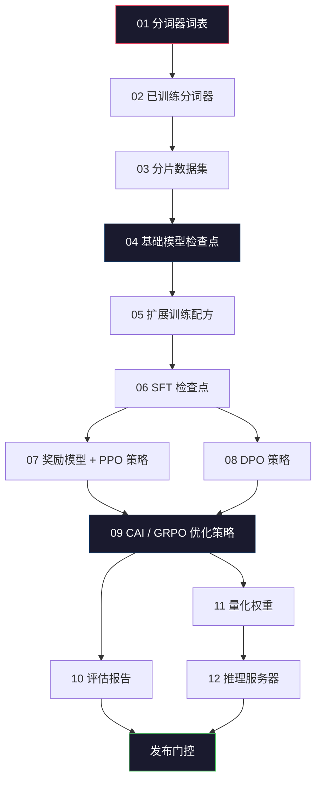
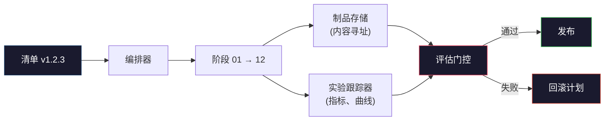

# 构建完整的 LLM 流水线

> 从第 01 课到第 12 课的所有内容，都是整个流水线中某一个阶段的组成部分。本课是构建端到端运行流程的脚手架，将这些阶段串联起来：分词、预训练、扩展、SFT（监督微调）、对齐、评估、量化、服务化。你无法在笔记本电脑上训练 70B 模型，但你可以构建编排层、清单（manifest）、评估门控（eval gate）以及回滚计划，这些正是 2026 年前沿团队决定产品发布所依赖的核心工具。这是本课程的结业项目。

**Type:** 构建
**Languages:** Python (标准库)
**Prerequisites:** 第 10 阶段第 01-12 课全部内容
**Time:** ~120 分钟

## 学习目标

- 将之前的十一个课程（分词器、数据、预训练、扩展、SFT、RLHF、DPO、CAI、评估、量化、推理）组合成一个可复现的流水线规范。
- 定义各阶段之间的制品契约（artifact contract）：每个阶段消耗什么、产生什么，以及下一阶段如何验证输入。
- 构建一个编排器（orchestrator），用于跟踪实验、对制品进行哈希校验，并根据评估阈值决定是否发布。
- 设计回滚计划：明确哪些制品重新运行成本较低，哪些成本较高，以及损坏的检查点（checkpoint）代价几何。

## 问题所在

之前的课程每一课都能独立运行。分词器已训练，小型 GPT 已预训练，SFT 数据集已组装，奖励模型已训练，DPO 已运行，评估已测量，量化权重已导出，推理服务器已启动。但每一课都是一个独立的 Notebook，有自己的约定、输出路径和随机种子。

前沿的训练任务绝不是一个 Notebook 能完成的。Llama 3 405B 耗费了 3000 万个 H100 小时，历时约 54 天。DeepSeek-V3 使用了约 280 万个 H800 小时。在此期间，一个损坏的检查点、一次数据污染或一次评估回归，都可能让团队损失一周的实际时间和一个月的 GPU 预算。团队生存之道在于流水线卫生（pipeline hygiene）：每个阶段都有确定性的输入、确定性的输出、清单、哈希值和门控。

这是结业项目。你不需要在笔记本电脑上端到端运行整个流水线，但你需要编写编排器来协调各个阶段，编写描述运行过程的清单，编写用于决定是否发布的验证器，以及让第三方能够从单个文件重新运行你工作的重放计划。代码量虽小，但纪律要求极高。

这种模式在 100M 到 1T 参数规模下均适用。同样的四个组件——清单、编排器、评估门控、制品存储——既能运行 Llama 3，也能运行你的个人 GPT。区别仅在于每个阶段配置中数字的大小，而非流水线的形态。

## 概念

### 十二个阶段

第 10 阶段的每一课都是一个阶段。以下是完整的依赖关系图。



阶段 07 和 08 可以并行运行，其他阶段均为强依赖。阶段 02（分词器）的任何更改都会导致所有下游制品失效。阶段 10（评估）的更改仅影响发布决策。

### 清单 (Manifest)

清单是一个单一文件，它对运行过程的描述足够详尽，足以实现重放。流水线产生的任何内容都不应依赖于清单之外的状态。其字段简单且强制：

```
pipeline_version: 1.2.3
seed: 42
git_commit: a1b2c3d4
stages:
  01_tokenizer:
    recipe: bpe_32k
    input_hash: sha256:...
    output_hash: sha256:...
    wall_clock_sec: 3600
    cost_usd: 12
```

阶段 N 的输出哈希必须是阶段 N+1 的输入哈希。任何偏差都会导致流水线停止。这就是尽早发现数据损坏的方法。这也是身处不同大洲的队友验证其重放结果是否与你产生相同制品的方式。

在实践中，团队使用小型 YAML 模式加上一个清单检查器，将其与上一次成功运行的结果进行对比。任何超出预期字段（成本、运行时间）的增量都是红色警报。

### 制品类型 (Artifact Typing)

每个阶段的输出都是一个有类型的制品。它不是一个目录块，也不是一个 pickle 文件，而是一个具有已知模式的命名类型。

| 阶段 | 制品类型 | 关键字段 |
|-------|--------------|-----------|
| 01-02 | 分词器 | vocab.json, merges.txt, config.json, hash |
| 03 | 数据集 | shards[], 行数, token 数, 去重统计 |
| 04-05 | 检查点 | weights.safetensors, config.json, 优化器状态, 步数 |
| 06 | SFT 模型 | 检查点 + SFT 配方 + 数据混合比例 |
| 07 | 奖励模型 | RM 检查点 + 偏好数据哈希 |
| 08-09 | 策略 | 检查点 + 参考哈希 + beta + 已消耗 KL 预算 |
| 10 | 评估报告 | 基准测试分数 + 回归差异 + 评估数据哈希 |
| 11 | 量化模型 | 量化权重 + 校准数据 + 相对于 FP16 的精度增量 |
| 12 | 服务规范 | 端点 + 模型哈希 + 配置 + 可观测性钩子 |

类型化可以防止最常见的故障模式：将阶段 08 的输出作为阶段 06 的输入，或者通过 SFT 路径发布 DPO 训练的模型。类型化的制品和阶段签名使得这些错误在编译时就能被发现，而不是在运行五天后才暴露。

### 评估门控 (Eval Gate)

发布并不意味着“训练结束”，而是“训练结束且通过了评估门控”。门控在运行开始前就已定义。

```
gates:
  mmlu:      >= baseline + 0.5   # 无回归
  humaneval: >= baseline + 1.0
  truthfulqa: >= baseline         # 无下降
  safety_refusal_rate: <= 0.05
  kl_from_reference: <= 25.0
  cost_total_usd: <= 50000
```

每个门控都是一个数值阈值。没有“看起来不错”这种模糊门控，也没有主观签字。如果所有门控通过，制品被标记为可发布；如果任何门控失败，运行将被挂起，除非有指定审核员进行明确覆盖，且该覆盖操作会被记录在清单中。

两个门控可以捕获大多数灾难：*回归门控*（新模型在核心基准测试上必须至少与前一个模型一样好）用于捕获训练错误；*KL 预算门控*（对齐后的策略与参考策略的偏离程度不得超过 X）用于捕获对齐过拟合。每个生产流水线都具备这两者。

### 编排器 (Orchestrator)

这是一小段读取清单、调度阶段、跟踪制品并在违反契约时停止运行的代码。这不是 Airflow，也不是 Kubeflow。为了流水线卫生，你需要编写一些简单、可控的代码。

编排器的工作非常明确：

1. 从清单中解析 DAG（有向无环图）。
2. 对于每个阶段，检查预期的输出是否已存在且哈希正确（如果存在则跳过）。
3. 运行阶段，捕获 stdout/stderr，测量运行时间和成本。
4. 验证输出哈希是否与下游阶段的预期输入哈希匹配。
5. 失败时，写入包含确切失败阶段的部分清单并以非零状态退出。

这大约是 200 行 Python 代码。它看起来就像本课中的 `code/main.py` 文件。在底层，真正的流水线使用 `torchrun` 或 `ray` 在集群上执行各个阶段，但编排器本身运行在单机上。

### 实验跟踪与制品存储

两个外部系统支撑着流水线。

**实验跟踪器 (wandb, neptune, mlflow)。** 记录每个阶段的损失曲线、评估指标、系统遥测数据。当你三周后需要对比运行 A 和运行 B 时，跟踪器就是你的去处。团队几乎总是使用托管的跟踪器——自己编写这些工具会浪费本应投入到训练中的时间。

**制品存储 (S3, R2, GCS)。** 用于检查点、数据集、分词器、评估报告的不可变对象存储。制品通过哈希而非文件名进行寻址。像 `latest.pt` 这样的文件名是隐患；`ckpt-7b-step-20000-sha256:abc123.safetensors` 才是契约。

编排器同时向两者写入数据。跟踪器供人类查看图表，制品存储供下一阶段查找输入。

### 成本核算

前沿运行任务都有明确的美元成本。预算纪律体现在两个方面：

**运行前估算。** 根据清单，计算预期的 FLOPs（对于预训练：6 x 参数量 x token 数）、预期的 GPU 小时数（FLOPs / 峰值吞吐量 / 利用率）以及当前租赁费率下的美元成本。如果估算超过预算门控，流水线将拒绝启动。

**运行中跟踪。** 每个阶段的运行时间和成本都会记录在清单中。每个阶段结束后，检查剩余预算。如果某个阶段超支，下一个阶段的门控将根据新的剩余预算进行评估。你不会等到 VC 打电话时才发现钱花光了。

Llama 3 的报告成本为 6100 万美元。DeepSeek-V3 报告其主要预训练运行成本为 560 万美元。比例差异主要源于硬件效率和混合专家模型（MoE）——但具体成本之所以可见，是因为两个团队都是按阶段而非按运行任务进行跟踪的。

### 可复现性 vs 确定性

这两者并不相同。*可复现*意味着相同的清单、相同的代码和相同的基础设施能产生具有等效下游指标的检查点。*确定性*意味着位级完全一致的输出。

现代 LLM 训练是可复现的，但不是确定性的。分布式训练的规约顺序（reduce-order）、GPU 内核的非确定性（cuBLAS, flash-attn）以及混合精度舍入，共同导致浮点数在不同运行之间存在 1e-5 级别的差异。对于最终指标而言，这没问题，因为指标不会变动。但如果你试图通过位级差异进行调试，这就是致命的。解决方法是记录每个阶段的输入哈希、输出哈希和核心指标——如果这些匹配，即使权重不是位级一致，运行也被视为“已复现”。



### 回滚计划

在运行开始前，写下每个阶段失败时的应对措施。分为三类：

- **重新运行成本低**（小时级）：分词器、评估、量化、推理服务器。直接重新运行。
- **中等成本**（天级）：SFT、DPO、CAI。保留基础模型，仅重新运行对齐阶段。
- **高成本**（周级和数百万美元）：预训练。这里的回滚计划不是“重新运行”，而是“使用上一个好的检查点，并用修订后的数据重新运行成本较低的下游阶段”。

由于阶段依赖是类型化且经过哈希校验的，编排器可以自动计算回滚集：使失败的阶段及其所有后代失效。阶段 06 (SFT) 的失败会导致 06, 07, 08, 09, 10, 11, 12 失效。阶段 11 (量化) 的失败仅导致 11 和 12 失效。提前明确这一点，可以避免在凌晨团队疲惫不堪时临时抱佛脚。

### 2026 年观察到的生产配方

大多数前沿团队已收敛于相同的骨架：

- 分词器：128k BPE，带字节回退。在小型、平衡的多语言切片上训练。
- 预训练：10-20T tokens，主要是网页数据、代码和合成数据。Muon 或 AdamW 优化器。FSDP2 或 DeepSpeed ZeRO-3。梯度检查点。BF16 权重，FP32 主权重。
- SFT：500k-2M 指令对，混合人类和合成数据，与评估集进行严格去重。
- 对齐：DPO 或 CAI + GRPO。仅在偏好信号对于 DPO 来说过于多维时才使用 RLHF。
- 评估：MMLU-Pro, MATH, HumanEval+, GPQA, SWE-Bench Verified, LiveBench，以及一套公众无法接触的私有留存集。
- 量化：服务化使用 4-bit GPTQ 或 AWQ，精度增量敏感的安全评估使用 8-bit。
- 服务化：vLLM, TensorRT-LLM 或自研。连续批处理（Continuous batching）。投机性解码。KV 缓存驱逐。

数字每六个月就会变动，但骨架不会。

## 构建它

本课的代码是一个编排器和一个清单检查器，而不是十二个训练脚本。每个阶段都用一个占位符模拟，该占位符产生具有正确形状和哈希值的输出制品。端到端运行编排器可以证明流水线的管道在烧钱进行真实训练之前是通畅的。

查看 `code/main.py` 获取完整实现。关键部分：

- `Manifest` 数据类：流水线版本、种子、git 提交、阶段、门控。
- `Stage` 数据类：名称、类型、输入（哈希）、输出（哈希）、运行时间、成本。
- `Orchestrator.run()`：解析 DAG，调度阶段，验证哈希，更新清单。
- `EvalGate.check()`：读取阈值，与最新评估报告对比，返回通过/失败。
- `ArtifactStore`（内存存根）：按哈希存取，模拟 S3。
- `CostTracker`：按阶段和累计跟踪，超过上限时停止。

`main.py` 中的流水线运行十二个占位符阶段，生成清单，并执行一个失败的评估门控以展示挂起运行的样子。将每个占位符替换为相应课程中的真实训练脚本，你就拥有了真实前沿流水线所使用的骨架。

## 使用它

规范的工作流包含三个命令：

```
python code/main.py plan    # 验证清单，计算成本估算，打印 DAG
python code/main.py run     # 执行阶段，写入 manifest.out.yaml
python code/main.py gate    # 读取 manifest.out.yaml，应用评估门控，发布或挂起
```

每次务必先运行 `plan`。大多数流水线错误在计划阶段就会显现——缺失的门控阈值、过期的哈希、预算超支。运行 `plan` 是免费的，运行 `run` 是昂贵的。通过在廉价阶段捕获错误来节省资金。

`gate` 的输出要么是 `SHIP`（发布），要么是 `HOLD: <reason>`（挂起：原因）。挂起运行不是失败，而是一个决策点。指定审核员要么进行覆盖（覆盖操作会被记录），要么批准回滚。

## 发布它

本课生成 `outputs/skill-llm-pipeline-reviewer.md`。将提议的流水线清单输入其中，它会检查所有契约：阶段类型、哈希链、门控、回滚计划、成本估算。它会拒绝批准缺少评估门控、KL 预算无限制或混合了评估数据与训练数据的清单。

## 练习

1. 扩展编排器以支持阶段 07 和 08 的并行执行。使用标准库 `concurrent.futures` 模块。确认最终清单记录了两个阶段的输出，并且阶段 09 的输入哈希是两者的确定性组合。

2. 添加一个“污染检查”门控。给定评估数据集哈希和训练数据集分片，计算重叠度（精确字符串匹配或 13-gram 匹配）。如果重叠超过 0.1%，门控失败。输入一个受污染的训练集并确认门控挂起了运行。

3. 从第一性原理实现成本估算器。对于阶段 04（预训练），将 FLOPs 估算为 6 x 参数量 x token 数，假设在 H100 上以 989 TFLOPs BF16 达到 40% MFU（模型 FLOPs 利用率），价格为 $2.50/GPU-小时。报告 7B 模型在 2T tokens 上训练的估算值，并与已发布的 Llama 2 数据进行对比。

4. 构建部分回滚。模拟阶段 09 (CAI) 的失败，然后重新运行阶段 09 到 12，同时保持 01-08 缓存。编排器应通过哈希检测到缓存的制品并跳过它们。测量节省的运行时间与完全重新运行的对比。

5. 添加可观测性。为每个阶段发出 OpenTelemetry 跨度（span），包含参数、已见 token 数、损失和成本等属性。将跨度管道传输到本地收集器。重点不在于仪表盘，而在于每个阶段的健康状况都可以通过单个 trace ID 进行追踪。

## 关键术语

| 术语 | 人们常说的 | 实际含义 |
|------|----------------|----------------------|
| Manifest | “配方文件” | 描述流水线版本、种子、各阶段配置和门控阈值的 YAML 或 JSON 文件——足以重放运行 |
| Content-addressed | “按哈希而非名称” | 制品按其内容的 SHA-256 存储，因此永远不会混淆版本 A 和版本 B |
| Eval gate | “发布标准” | 必须在制品被标记为可发布之前通过的基准测试指标和安全分数的数值阈值 |
| KL budget | “对齐偏离程度” | 对齐阶段中累积 KL(策略 \|\| 参考) 的上限，作为门控强制执行 |
| MFU | “GPU 利用率” | 模型 FLOPs 利用率——实际达到的 FLOPs 除以理论峰值。70B 规模通常为 40%，7B 为 55% |
| Rollback plan | “出问题怎么办” | 针对每个阶段失败预先编写的行动集：重新运行、回退、使用修订后的输入重新训练 |
| Orchestrator | “指挥官” | 读取清单、调度阶段、验证哈希、在任何契约违规时停止运行的进程 |
| Artifact store | “权重的版本化 S3” | 不可变的、内容寻址的对象存储——检查点、数据集、评估报告的单一事实来源 |
| Reproducible | “重放时指标相同” | 权重位级不同但下游指标等效——分布式 LLM 训练的现实目标 |
| Cost gate | “不能超过 X” | 运行前成本估算加上运行中跟踪——如果估算超过预算，流水线拒绝启动 |

## 延伸阅读

- [Dubey et al., 2024 -- "The Llama 3 Herd of Models"](https://arxiv.org/abs/2407.21783) -- 对前沿流水线（包括数据、训练、对齐、评估）最详细的公开描述
- [DeepSeek-AI, 2024 -- "DeepSeek-V3 Technical Report"](https://arxiv.org/abs/2412.19437) -- 以约 1/10 的成本实现 Llama 3 级别训练的效率优先流水线
- [Kaplan et al., 2020 -- "Scaling Laws for Neural Language Models"](https://arxiv.org/abs/2001.08361) -- 最初的计算-数据-参数扩展关系
- [Hoffmann et al., 2022 -- "Training Compute-Optimal Large Language Models (Chinchilla)"](https://arxiv.org/abs/2203.15556) -- 对 Kaplan 的修正，重新校准了现代数据预算
- [PyTorch FSDP2 文档](https://pytorch.org/docs/stable/fsdp.html) -- 在 PyTorch 2.4+ 中取代 FSDP1 的分布式训练原语
- [Weights & Biases LLM 报告](https://wandb.ai/site/llms) -- 开源 LLM 运行的真实清单和实验跟踪器输出，可用作可抄袭的模板