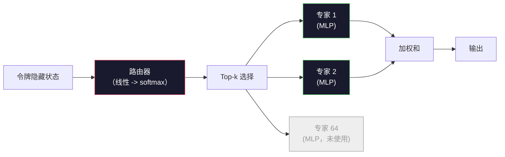

# Open Models: Architecture Walkthroughs

> You built a GPT-2 Small from scratch in Lesson 04. Frontier open models in 2026 are the same family with five or six concrete changes. RMSNorm instead of LayerNorm. SwiGLU instead of GELU. RoPE instead of learned positions. GQA or MLA instead of full MHA. Mixture-of-Experts at scale. The math you already know covers 95% of them. This lesson reads Llama 3, DeepSeek-V3, Mixtral, Qwen, and Gemma side by side and names the exact line where each architecture diverges.

**Type:** Learn  
**Languages:** Python（stdlib）  
**Prerequisites:** Phase 10、Lessons 04、05、12（预训练、扩展、推理）  
**Time:** ~45 分钟

## Learning Objectives

- 阅读 Llama 3、Mistral、Mixtral、Gemma 2、Qwen 2.5、DeepSeek-V3 的 config.json 并能解释每一个字段
- 指出每个模型相对于 GPT-2 Small 的具体架构改动并从第一性原理给出理由
- 从 config 单独计算任一开源模型的参数量、KV 缓存大小和激活内存
- 在延迟、内存和能力约束下，为部署目标选择合适的开源模型

## The Problem

In Lesson 04 you wrote 350 lines of numpy and had a GPT-2-shaped model. Llama 3 405B has a 200-page technical report. Your instinct is that these are different beasts. They are not. The 200 pages describe the same object with five or six well-motivated modifications, plus a thousand implementation details about scaling. The skeleton -- embedding, transformer blocks, attention, MLP, norm, head -- is unchanged.

This lesson is a diff. For each major open model family, we list exactly what changed from GPT-2, why, and what it cost. When you are done you can read a fresh model card and mentally translate it back to the GPT-2 baseline.

The practical payoff is that when Meta releases Llama 5 or DeepSeek releases V4, you will not need a new mental model. You will look at the config, see which of the well-known knobs moved, and know what the downstream implications are. The 2026 architectures are a finite toolbox. Each new model picks a different subset.

## The Concept

### The Invariant Core

所有自回归开源模型都共享：

- 词嵌入矩阵（vocab_size x hidden_dim）。
- N 层解码器块的堆叠：norm、self-attention、残差、norm、MLP、残差。
- 最终的 norm 和投射到 vocab_size 的线性 head（通常与嵌入权重绑定）。
- 因果掩码、下一个词的交叉熵损失。

这就是整体骨架。其余都是可调旋钮。

### The Six Knobs That Actually Move

在每个 2024–2026 年的前沿开源模型中，这六个设计选择反复被挑选和调整：

1. **Normalization.** LayerNorm -> RMSNorm。  
2. **Positional encoding.** Learned absolute -> RoPE（以及变体：YaRN、NTK）。  
3. **Activation.** GELU -> SwiGLU（或 GeGLU）。  
4. **Attention head sharing.** MHA -> GQA -> MQA -> MLA。  
5. **Dense vs sparse MLP.** Dense -> Mixture-of-Experts。  
6. **Pre-norm placement.** 预归一化（Pre-norm）保留。后置归一化（Post-norm）已不再使用。

其他的（学习率调度、数据混合、批大小、上下文长度）都属于训练配置，不属于架构本身。六个旋钮。

### Knob 1: RMSNorm

LayerNorm 会减去均值、除以标准差、缩放并偏移。RMSNorm 只保留缩放：

```
RMSNorm(x) = x / sqrt(mean(x^2) + eps) * gamma
```

没有均值减除，没有偏置。每个 token 少一次矩阵乘法。Zhang 和 Sennrich（2019）指出它在机器翻译上与 LayerNorm 相当但速度快约 10%。每个现代开源模型都在用它。

代价：无。收益：小幅吞吐量提升，代码更简单。

### Knob 2: RoPE

GPT-2 的位置嵌入是一个 1024 槽的查找表。上下文长度超过训练时的最大位置会超出表格。模型无法在训练长度之外外推。

旋转位置嵌入（RoPE，Su 等人 2021）通过在 attention 点积之前按成对维度旋转每个 Q 和 K 向量来注入位置信息。旋转角度是位置的确定性函数，所以没有可学参数，也不会“用尽”。结合缩放技巧（NTK-aware 插值、YaRN），在 8k 上训练的模型可在推理时扩展到 128k，上下文外推仅有适度精度损失。

```
q_rotated = rotate(q, angle(pos))
k_rotated = rotate(k, angle(pos))
score = q_rotated . k_rotated
```

每个 Llama、Mistral、Qwen、DeepSeek 和 Gemma 都使用 RoPE。Gemma 2 使用混合方案（大多数层用 RoPE，部分层用局部滑动窗口注意力）。

### Knob 3: SwiGLU

GPT-2 的 MLP 是 `x -> gelu(xW1 + b1) -> (...)W2 + b2`。SwiGLU（Shazeer 2020）把激活替换为门控乘积：

```
SwiGLU(x) = (xW1) * sigmoid(xW1) * xV
```

并行地用两个投影代替一个，由 Swish（sigmoid 门）进行门控。经验上在每参数困惑度上更优。Llama 2 采用后，大家纷纷跟进。MLP 的隐藏维通常设置为使总参数量与原先的稠密 MLP 匹配：若 GPT-2 使用 `ff_dim = 4 * hidden`，SwiGLU 通常使用 `ff_dim = 8/3 * hidden`（对应 `(2/3)*4*hidden` 的推导）。

### Knob 4: Attention Head Sharing

GPT-2 使用的是 **Multi-Head Attention (MHA)**：每个 head 有独立的 Q、K、V 投影。

**Multi-Query Attention (MQA, Shazeer 2019)** 在所有头之间共享一个 K 和一个 V。将 KV 缓存按头数削减（在典型模型上常见 12x 到 32x 的减少）。在硬性基准上准确率略有下降。

**Grouped-Query Attention (GQA, Ainslie 等人 2023)** 是折中方案：把 Q heads 分成 G 组，每组共享一个 K 和一个 V。Llama 3 8B 使用 GQA，有 32 个 Q 头和 8 个 KV 头（G=8），因此相比完全 MHA，KV 缓存缩小 4x。

**Multi-Head Latent Attention (MLA, DeepSeek 2024)** 将 K 和 V 压缩到一个共享的低秩潜变量中，然后在每个头上重新投影回去。进一步减少 KV 缓存的同时保留每头的表达能力。DeepSeek-V2 与 V3 在其长上下文性能上依赖此方案。

| Scheme | KV Heads | KV Cache | Accuracy |
|--------|----------|----------|----------|
| MHA    | num_heads | full | best |
| GQA    | num_groups (G < num_heads) | num_heads / G reduction | near-MHA |
| MQA    | 1 | num_heads reduction | small hit |
| MLA    | latent, per-head decompression | smaller than MQA | near-MHA |

对于任意超过 ~13B 参数的模型，GQA 或 MLA 基本是必选。大规模下的全 MHA 会导致灾难性的 KV 缓存需求。

### Knob 5: Mixture of Experts

稠密 MLP 在每个 token 上都会激活所有参数。MoE MLP 在每个块中有 K 个专家和一个路由器，路由器为每个 token 选择 top-k 个专家（通常是 top-2）。只有被选中的专家权重会在该 token 的前向过程中被访问。

```
router_logits = xW_r
indices, weights = top_k(router_logits, k=2)
output = sum_i weights[i] * expert[indices[i]](x)
```

吸引力在于：你可以有 64 个专家，每个专家大小为 7B（因此总参数巨大），但每个 token 只运行 2 个专家（因此每 token 的计算量与稠密的 7B 模型相当）。Mixtral 8x7B 有 47B 的总参数但每 token 只激活 13B。DeepSeek-V3 总参数 671B，但每 token 只激活 37B。



优点：保持相同的计算量却拥有更多参数与更强的容量。缺点：专家权重仍需放在某处（因此服务时需要比等效稠密模型更多的显存），路由器的负载平衡困难，且在对齐微调时如何训练路由器本身仍是研究问题。

### Knob 6: Pre-norm stays

原始 transformer 在每个子层之后应用 layer norm。自 GPT-2 以来的所有开源模型都把它放在每个子层之前（pre-norm）。Pre-norm 在深层模型上严格更容易训练。无需争论。

### Model-by-Model Diff

下面的表将所有内容具体化。

| 模型 | 年份 | 总参数 | 激活参数 | Norm | 激活函数 | 位置编码 | 注意力 | MoE | 上下文 |
|------|------|--------:|---------:|------|----------|----------|--------|-----:|-------:|
| GPT-2 Small | 2019 | 124M | 124M | LayerNorm | GELU | Learned | MHA (12 heads) | no | 1k |
| Llama 3 8B | 2024 | 8B | 8B | RMSNorm | SwiGLU | RoPE | GQA (32/8) | no | 128k |
| Llama 3 70B | 2024 | 70B | 70B | RMSNorm | SwiGLU | RoPE | GQA (64/8) | no | 128k |
| Llama 3 405B | 2024 | 405B | 405B | RMSNorm | SwiGLU | RoPE | GQA (128/16) | no | 128k |
| Mistral 7B | 2023 | 7.2B | 7.2B | RMSNorm | SwiGLU | RoPE | GQA | no | 32k |
| Mixtral 8x7B | 2023 | 47B | 13B | RMSNorm | SwiGLU | RoPE | GQA | yes (8 experts, top-2) | 32k |
| Gemma 2 9B | 2024 | 9B | 9B | RMSNorm (pre+post) | GeGLU | RoPE + sliding | GQA | no | 8k |
| Qwen 2.5 72B | 2024 | 72B | 72B | RMSNorm | SwiGLU | RoPE (YaRN) | GQA (64/8) | no | 128k |
| DeepSeek V2 236B | 2024 | 236B | 21B | RMSNorm | SwiGLU | RoPE | MLA | yes (160 experts, top-6) | 128k |
| DeepSeek V3 | 2024 | 671B | 37B | RMSNorm | SwiGLU | RoPE | MLA | yes (256 experts, top-8) | 128k |

扫一眼表格。RMSNorm 已成普遍。SwiGLU 或其近亲 GeGLU 也普遍采用。RoPE 成为标配。GQA 在 7B 以上普遍采用，除非被 MLA 取代。MoE 是高端的区分器。

### Reading a config.json

Llama 3 8B 配置：

```
{
  "hidden_size": 4096,
  "intermediate_size": 14336,
  "num_hidden_layers": 32,
  "num_attention_heads": 32,
  "num_key_value_heads": 8,
  "max_position_embeddings": 131072,
  "rope_theta": 500000.0,
  "rms_norm_eps": 1e-5,
  "vocab_size": 128256
}
```

每个字段都对应你已经实现过的某样东西。

- `hidden_size`：嵌入维度（embedding dimension）。
- `intermediate_size`：MLP 隐藏维（SwiGLU 的扩展比率）。
- `num_hidden_layers`：堆叠层数（depth）。
- `num_attention_heads`：Q 头数（num Q heads）。
- `num_key_value_heads`：KV 头数（GQA 中的 KV heads）。
- `max_position_embeddings`：训练时的上下文长度（max context）。
- `rope_theta`：RoPE 的基频。Meta 将默认值从 10k 缩放到 500k 以利于长上下文外推。
- `rms_norm_eps`：数值稳定性 epsilon。
- `vocab_size`：词表大小。

仅从这些字段就可以计算总参数量、KV 缓存和峰值激活内存。参见 `code/main.py` 获取精确公式。

### Activation memory budget

在参数量达到数十亿以上时，激活（activations）主导训练内存。带梯度检查点（gradient checkpointing）时的经验法则：

```
activation_mem ~ batch_size * seq_len * hidden_size * num_layers * bytes_per_element
```

以 Llama 3 8B 为例：batch 1、seq 8192、BF16、32 层、hidden 4096：使用检查点时激活大约 8 GB，不使用检查点则约 40 GB。这也是为什么 flash-attention 和 ring-attention 很重要——它们重写注意力计算以便激活可以适配内存。

### KV Cache budget

在最大上下文下做推理：

```
kv_cache = 2 * num_layers * num_kv_heads * head_dim * max_seq_len * bytes_per_element
```

Llama 3 8B 在 128k 上下文、BF16、head_dim = hidden / num_heads = 128：
`2 * 32 * 8 * 128 * 131072 * 2 = 17.2 GB`（每个序列）。

8B 权重在 BF16 下大约 16 GB。单个 128k 序列的 KV 缓存比权重还要大。这正是推动 GQA、MLA 和 KV 缓存量化研究的内存压力来源。

### When Each Model Wins

- 单卡 80GB，且不使用 MoE：Llama 3 8B、Mistral 7B、Gemma 2 9B。易于服务，工具链成熟。  
- 单节点（8x80GB），大容量需求：Llama 3 70B、Qwen 2.5 72B。最佳的稠密开源能力。  
- 最大开源能力，接受 MoE 复杂性：DeepSeek V3、Mixtral 8x22B。按激活 FLOP 的能力最优。  
- 长上下文需求：Llama 3（RoPE 缩放到 128k）、DeepSeek（MLA 优势）。  
- 低延迟服务：Gemma 2 9B（滑动窗口层能减少长上下文计算）。

```figure
rmsnorm-vs-layernorm
```

## Build It

本课的代码是一个计算器。给定任意 config.json，它会按组件打印参数计数、在最大上下文下的 KV 缓存、SwiGLU 的 MLP 比例，以及对架构（dense / GQA / MLA / MoE）的简短判断。

```python
config = {
    "hidden_size": 4096, "intermediate_size": 14336,
    "num_hidden_layers": 32, "num_attention_heads": 32,
    "num_key_value_heads": 8, "vocab_size": 128256,
    "max_position_embeddings": 131072,
}
```

脚本逐字段走访架构，计算嵌入、注意力（考虑 GQA 缩减）、MLP（SwiGLU 扩展）、layernorms 与 head 的参数量。然后计算声明的上下文长度下的 KV 缓存并打印摘要。

实现细节见 `code/main.py`。

## Use It

在脚本中对 Llama 3 8B、Mistral 7B、Mixtral 8x7B、DeepSeek V3 的配置运行计算器。比较参数构成的细目。注意 MoE 模型的总参数远超稠密模型，但激活参数往往更小。注意 DeepSeek V3 的 KV 缓存比 Llama 3 405B 小，尽管其总参数更多 —— 这就是 MLA 的效果。

然后把你本地的任意模型的 config 插入，阅读摘要，并决定它是否适合你的 GPU。

## Ship It

本课产出 `outputs/skill-open-model-picker.md`。给定部署目标（GPU 类型、显存、上下文长度、延迟预算）和任务特征（聊天、代码、推理、长上下文），它会推荐一个开源模型、Lesson 11 的量化方案和 Lesson 12 的推理栈，并就六个架构旋钮给出明确推理。

## Exercises

1. 从 HuggingFace 读取 Qwen 2.5 72B 的配置。手工计算总参数。与 HF 报告的值比较并指出差异来源（head dim 四舍五入、KV 共享因子等）。  
2. DeepSeek V3 使用 256 个专家并 top-8 路由。计算激活的专家数量与总专家数的比率，并与 Mixtral 8x7B 的 8 个专家 top-2 做对比。从稀疏（25%）到更稠密稀疏（3%）的转变对每 FLOP 的容量意味着什么？  
3. 计算 Llama 3 405B 在 128k 上下文下的 KV 缓存，分别以 FP8 和 BF16 表示。在 FP8 下它是 BF16 的一半。在单个 8xH100 节点（每卡 80GB，共 640GB，总显存，减去权重内存）上你能并行服务多少序列？  
4. Gemma 2 在全注意力层和滑动窗口注意力层之间交替。写出当一半的层使用 4096-token 的滑动窗口而不是全上下文时的 KV 缓存数学式。在 8k 总上下文下这能节省多少内存？  
5. 找到一款在本课编写后发布的最新前沿开源模型。识别它选择了哪几个旋钮，以及它是否引入了第七个旋钮。课程在新架构发布的瞬间会显得过时——目标是不用重建心智模型就能更新你的表格。

## Key Terms

| 术语 | 常见说法 | 实际含义 |
|------|---------|---------|
| RMSNorm | "LayerNorm without the mean" | 仅按均方根归一化并带有可学习缩放 —— 更便宜且与 LayerNorm 相当 |
| RoPE | "Rotary positions" | 在二维配对维度上按位置旋转每个 Q 和 K 向量 —— 通过缩放技巧可以在训练长度之外外推 |
| SwiGLU | "The new MLP activation" | 带 Swish 的门控线性单元：`(xW1) * sigmoid(xW1) * xV` —— 是 2024+ 每个开源模型的标准 |
| GQA | "Middle ground attention" | Grouped-Query Attention：将 Q 头分组，每组共享一个 K 和 V —— 在不产生 MQA 精度损失的情况下缩小 KV 缓存 |
| MLA | "DeepSeek's attention" | Multi-Head Latent Attention：将 K/V 压缩为共享低秩潜变量，在每个头上解压 —— 大模型中 KV 缓存最小化方案 |
| MoE | "Sparse experts" | Mixture of Experts：每个块有 N 个 MLP，路由器为每个 token 选择 top-k —— 总参数巨大，激活参数小 |
| Top-k routing | "Pick k experts per token" | 路由器为每个专家计算得分并激活得分最高的 k 个 —— 常见 k 为 2（Mixtral）到 8（DeepSeek） |
| YaRN | "Stretch RoPE" | 又一 RoPE 扩展 —— 插值旋转角以在推理时把上下文从 8k 扩展到 128k+ |
| Sliding-window attention | "Don't attend to everything" | 每个 token 仅关注最近的 W 个 token —— 将注意力开销限定为 O(W) 每 token，Gemma 2 与早期 Mistral 使用该策略 |
| Active params | "What runs per token" | 对于 MoE 模型，指每个 token 实际会参与前向的参数量（远小于总参数）——决定每 token 的 FLOPs |

## Further Reading

- [Dubey et al., 2024 -- "The Llama 3 Herd of Models"](https://arxiv.org/abs/2407.21783) -- dense Llama 3 系列的架构与训练参考  
- [DeepSeek-AI, 2024 -- "DeepSeek-V3 Technical Report"](https://arxiv.org/abs/2412.19437) -- MLA 加上无需辅助损失的负载均衡及 671B MoE 的技术报告  
- [Jiang et al., 2024 -- "Mixtral of Experts"](https://arxiv.org/abs/2401.04088) -- MoE 开源模型的规范性论文  
- [Su et al., 2021 -- "RoFormer: Enhanced Transformer with Rotary Position Embedding"](https://arxiv.org/abs/2104.09864) -- RoPE 论文  
- [Shazeer, 2020 -- "GLU Variants Improve Transformer"](https://arxiv.org/abs/2002.05202) -- SwiGLU、GeGLU 等变体论文  
- [Ainslie et al., 2023 -- "GQA: Training Generalized Multi-Query Transformer Models"](https://arxiv.org/abs/2305.13245) -- GQA 论文  
- [Gemma 2 Team, 2024 -- "Gemma 2: Improving Open Language Models at a Practical Size"](https://arxiv.org/abs/2408.00118) -- 混合全注意力+滑动注意力、pre+post-norm 的实用规模改进  
- [Qwen Team, 2024 -- "Qwen 2.5 Technical Report"](https://arxiv.org/abs/2412.15115) -- YaRN 上下文扩展与长上下文训练方案