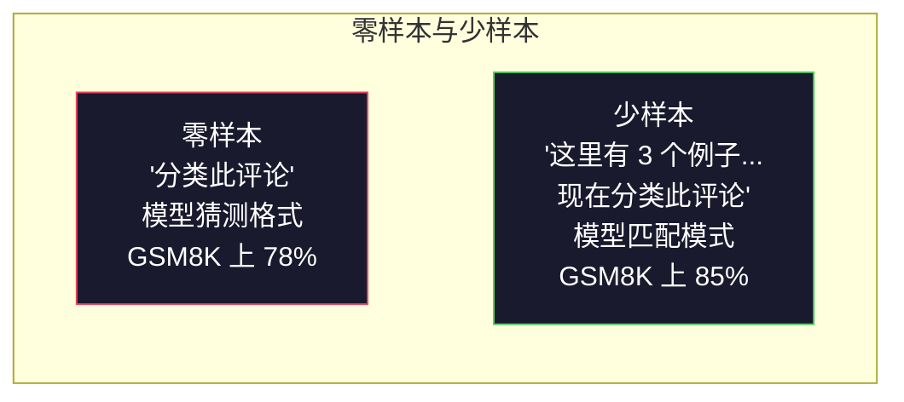
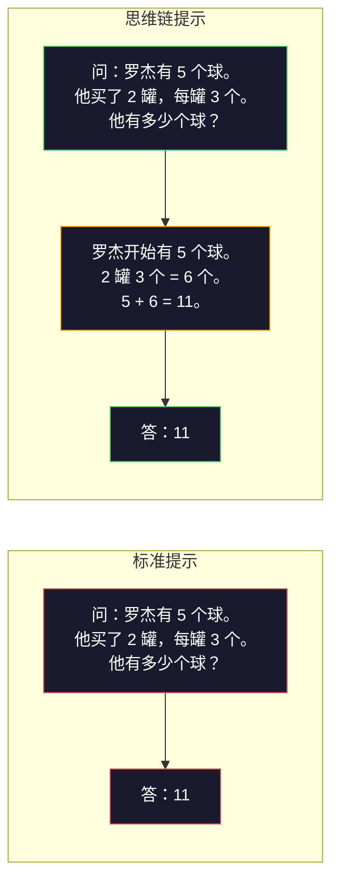
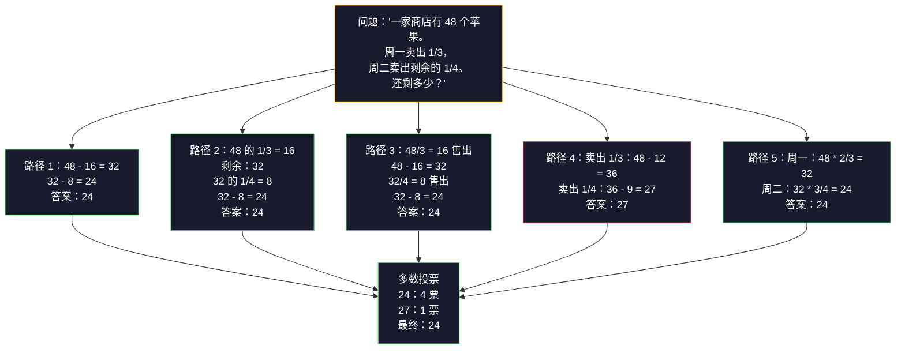
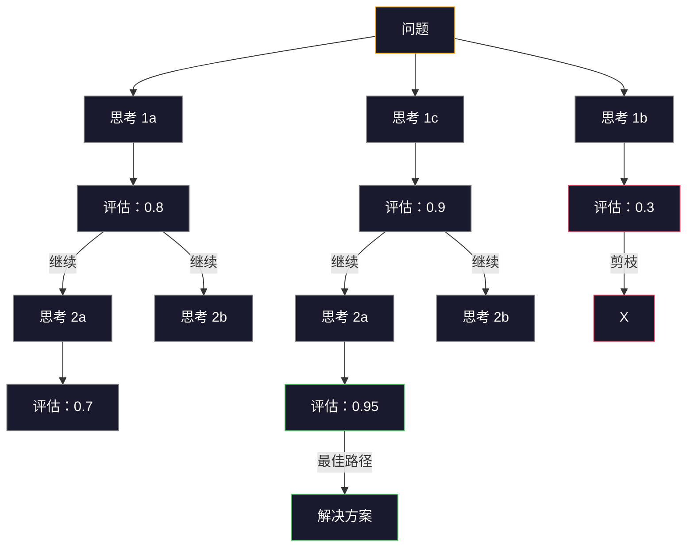
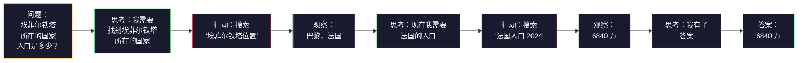

# 少样本、思维链、思维树

> 告诉模型做什么叫提示。展示模型如何思考叫工程。在相同的模型、相同的任务、相同的数据上，准确率从 78% 提升到 91% 靠的不是更好的模型，而是更好的推理策略。

**Type:** Build
**Languages:** Python
**Prerequisites:** 课程 11.01 (提示词工程)
**Time:** ~45 分钟

## 学习目标

- 通过选择和格式化示例演示来实现少样本提示，从而最大化任务准确率
- 应用思维链 (CoT) 推理来提高数学应用题等多步问题的准确率
- 构建一个思维树提示，探索多个推理路径并选择最佳路径
- 衡量零样本、少样本和思维链在标准基准测试上的准确率提升

## 问题

您正在构建一个数学辅导应用。您的提示词是：“解决这个应用题。” GPT-5 在标准小学数学基准测试 GSM8K 上有 94% 的正确率。您可能认为这已经达到顶峰了。但实际上并没有——思维链仍然可以再提升 3-4 个百分点。

只需添加五个词——“让我们一步一步地思考”——准确率就能跃升到 91%。再添加几个已解决的示例，准确率就能达到 95%。相同的模型。相同的温度。相同的 API 成本。唯一的区别是您给了模型草稿纸。

这不是一个技巧。这是推理的工作方式。人类不会通过一次心智飞跃来解决多步问题。Transformer 模型也不会。当您强制模型生成中间令牌时，这些令牌会成为下一个令牌的上下文。每个推理步骤都为下一个步骤提供信息。模型实际上是通过计算得出答案的。

但“一步一步地思考”只是开始，而不是结束。如果您采样五条推理路径并进行多数投票呢？如果您让模型探索一棵可能性之树，评估并剪枝分支呢？如果您将推理与工具使用交织在一起呢？这些都不是假设。它们是已发表的、经过测量改进的技术，您将在本课程中构建所有这些技术。

## 概念

### 零样本与少样本：当示例胜过指令

零样本提示只给模型一个任务，没有其他。少样本提示则先给模型示例。

Wei 等人 (2022) 在 8 个基准测试中对此进行了测量。对于情感分类等简单任务，零样本和少样本的表现相差不到 2%。对于多步算术和符号推理等复杂任务，少样本将准确率提高了 10-25%。

直觉是：示例是压缩的指令。您不是描述输出格式，而是展示它。您不是解释推理过程，而是演示它。模型对示例的模式匹配比它解释抽象指令更可靠。



**少样本何时胜出：** 格式敏感型任务、分类、结构化提取、领域特定术语，以及任何模型需要匹配特定模式的任务。

**零样本何时胜出：** 简单事实问题、示例会限制创造力的创意任务，以及寻找好示例比编写好指令更困难的任务。

### 示例选择：相似胜过随机

并非所有示例都同等重要。在分类任务中，选择与目标输入相似的示例比随机选择的准确率高 5-15% (Liu 等人，2022)。三个原则：

1.  **语义相似性**：选择在嵌入空间中与输入最接近的示例
2.  **标签多样性**：在您的示例中涵盖所有输出类别
3.  **难度匹配**：匹配目标问题的复杂程度

大多数任务的最佳示例数量是 3-5 个。少于 3 个，模型没有足够的信号来提取模式。多于 5 个，则会遇到边际效益递减，并浪费上下文窗口令牌。对于具有许多标签的分类任务，每个标签使用一个示例。

### 思维链：给模型草稿纸

思维链 (CoT) 提示由 Google Brain 的 Wei 等人 (2022) 引入。其思想很简单：不是只向模型询问答案，而是先要求它展示推理步骤。



为什么这在机制上有效？Transformer 模型生成的每个令牌都成为下一个令牌的上下文。如果没有思维链，模型必须将所有推理压缩到单个前向传播的隐藏状态中。有了思维链，模型将中间计算外部化为令牌。每个推理令牌都扩展了有效计算深度。

**GSM8K 基准测试（小学数学，8.5K 问题）：**

| 模型 | 零样本 | 零样本思维链 | 少样本思维链 |
|-------|-----------|---------------|--------------|
| GPT-4o | 78% | 91% | 95% |
| GPT-5 | 94% | 97% | 98% |
| o4-mini (推理) | 97% | — | — |
| Claude Opus 4.7 | 93% | 97% | 98% |
| Gemini 3 Pro | 92% | 96% | 98% |
| Llama 4 70B | 80% | 89% | 94% |
| DeepSeek-V3.1 | 89% | 94% | 96% |

**关于推理模型的说明。** 像 OpenAI 的 o 系列（o3, o4-mini）和 DeepSeek-R1 这样的模型在发出答案之前会在内部运行思维链。向推理模型添加“让我们一步一步地思考”是冗余的，有时甚至适得其反——它们已经这样做了。

思维链的两种形式：

**零样本思维链**：在提示词后附加“让我们一步一步地思考”。无需示例。Kojima 等人 (2022) 表明，这一句话可以提高算术、常识和符号推理任务的准确率。

**少样本思维链**：提供包含推理步骤的示例。比零样本思维链更有效，因为模型看到了您期望的确切推理格式。

**思维链何时有害**：简单事实回忆（“法国的首都是什么？”）、单步分类、速度比准确率更重要的任务。思维链每次查询会增加 50-200 个令牌的推理开销。对于高吞吐量、低复杂性任务，这是浪费的成本。

### 自洽性：多次采样，一次投票

Wang 等人 (2023) 引入了自洽性。其洞察是：单一的思维链路径可能包含推理错误。但如果您采样 N 条独立的推理路径（使用温度 > 0）并对最终答案进行多数投票，错误就会相互抵消。



在最初的 PaLM 540B 实验中，自洽性将 GSM8K 的准确率从 56.5%（单一思维链）提高到 N=40 时的 74.4%。在 GPT-5 上，提升很小（97% 到 98%），因为基础准确率已经饱和。该技术在基础思维链准确率在 60-85% 的模型上表现最佳——这是单路径错误频繁但非系统性的最佳范围。对于推理模型（o 系列，R1），自洽性被内置的内部采样所涵盖。

权衡是：N 次采样意味着 N 倍的 API 成本和延迟。实际上，N=5 就能获得大部分好处。N=3 是有意义投票的最小值。对于大多数任务，N > 10 会出现边际效益递减。

### 思维树：分支探索

Yao 等人 (2023) 引入了思维树 (ToT)。思维链遵循一条线性推理路径，而思维树则探索多个分支，并在继续之前评估哪些分支最有前景。



思维树有三个组成部分：

1.  **思考生成**：产生多个候选的下一步
2.  **状态评估**：对每个候选进行评分（可以使用 LLM 本身作为评估器）
3.  **搜索算法**：通过树进行 BFS 或 DFS，剪枝低分分支

在 24 点游戏任务（使用算术组合 4 个数字得到 24）中，使用标准提示的 GPT-4 解决了 7.3% 的问题。使用思维链，解决了 4.0%（思维链在这里实际上有害，因为搜索空间很广）。使用思维树，解决了 74%。

思维树很昂贵。树中的每个节点都需要一次 LLM 调用。一个分支因子为 3、深度为 3 的树最多需要 39 次 LLM 调用。仅在搜索空间大但可评估的问题中使用它——规划、解谜、带约束的创意问题解决。

### ReAct：思考 + 行动

Yao 等人 (2022) 将推理轨迹与行动结合起来。模型在思考（生成推理）和行动（调用工具、搜索、计算）之间交替。



ReAct 在知识密集型任务上优于纯思维链，因为它能将其推理建立在真实数据上。在 HotpotQA（多跳问答）上，ReAct 与 GPT-4 实现了 35.1% 的精确匹配，而纯思维链仅为 29.4%。真正的力量在于推理错误可以通过观察得到纠正——模型可以在执行过程中更新其计划。

ReAct 是现代 AI 智能体的基础。每个智能体框架（LangChain、CrewAI、AutoGen）都实现了某种形式的思考-行动-观察循环。您将在第 14 阶段构建完整的智能体。本课程涵盖了提示模式。

### 结构化提示：XML 标签、分隔符、标题

当提示变得复杂时，结构可以防止模型混淆不同部分。三种方法：

**XML 标签**（最适合 Claude，在所有地方都表现良好）：
```
<context>
您正在审查一个拉取请求。
代码库使用 TypeScript 和 React。
</context>

<task>
审查以下差异，查找错误、安全问题和风格违规。
</task>

<diff>
{diff_content}
</diff>

<output_format>
列出每个问题，包括：文件、行、严重性（严重/警告/信息）、描述。
</output_format>
```

**Markdown 标题**（通用）：
```
## 角色
一家金融科技公司的高级安全工程师。

## 任务
分析此 API 端点的漏洞。

## 输入
{api_code}

## 规则
- 专注于 OWASP Top 10
- 评估每个发现：严重、高、中、低
- 包含补救措施
```

**分隔符**（简洁但有效）：
```
---INPUT---
{user_text}
---END INPUT---

---INSTRUCTIONS---
将上述内容总结为 3 个要点。
---END INSTRUCTIONS---
```

### 提示链：顺序分解

有些任务过于复杂，无法通过单个提示完成。提示链将其分解为多个步骤，其中一个提示的输出成为下一个提示的输入。


提示链胜过单个提示有三个原因：

1.  **每一步都更简单**：模型处理一个专注的任务，而不是同时处理所有事情
2.  **中间输出可检查**：您可以在步骤之间验证和纠正
3.  **不同步骤可以使用不同模型**：使用廉价模型进行提取，使用昂贵模型进行推理

### 性能比较

| 技术 | 最适合 | GSM8K 准确率 (GPT-5) | API 调用 | 令牌开销 | 复杂性 |
|-----------|----------|------------------------|-----------|----------------|------------|
| 零样本 | 简单任务 | 94% | 1 | 无 | 微不足道 |
| 少样本 | 格式匹配 | 96% | 1 | 200-500 令牌 | 低 |
| 零样本思维链 | 快速推理提升 | 97% | 1 | 50-200 令牌 | 微不足道 |
| 少样本思维链 | 最大单次调用准确率 | 98% | 1 | 300-600 令牌 | 低 |
| 自洽性 (N=5) | 高风险推理 | 98.5% | 5 | 5 倍令牌成本 | 中 |
| 推理模型 (o4-mini) | 即插即用型思维链替代 | 97% | 1 | 隐藏（内部 2-10 倍） | 微不足道 |
| 思维树 | 搜索/规划问题 | 不适用（24 点游戏 74%） | 10-40+ | 10-40 倍令牌成本 | 高 |
| ReAct | 基于知识的推理 | 不适用（HotpotQA 35.1%） | 3-10+ | 可变 | 高 |
| 提示链 | 复杂多步任务 | 96% (流水线) | 2-5 | 2-5 倍令牌成本 | 中 |

正确的选择取决于三个因素：准确性要求、延迟预算和成本容忍度。对于大多数生产系统，带有 3 样本自洽性回退的少样本思维链涵盖了 90% 的用例。

## 构建它

我们将构建一个数学问题求解器，它将少样本提示、思维链推理和自洽性投票组合成一个单一的流水线。然后我们将为难题添加思维树。

完整实现位于 `code/advanced_prompting.py` 中。以下是关键组件。

### 步骤 1：少样本示例存储

第一个组件管理少样本示例，并为给定问题选择最相关的示例。

```python
GSM8K_EXAMPLES = [
    {
        "question": "Janet 的鸭子每天下 16 个蛋。她每天早上吃三个作为早餐，每天用四个为朋友烤松饼。她每天在农贸市场以每个 2 美元的价格出售所有鸡蛋。她每天在农贸市场赚多少钱？",
        "reasoning": "Janet 的鸭子每天下 16 个蛋。她吃 3 个，烤 4 个，总共用了 3 + 4 = 7 个蛋。所以她还剩下 16 - 7 = 9 个蛋。她以每个 2 美元的价格出售，所以她每天赚 9 * 2 = 18 美元。",
        "answer": "18"
    },
    ...
]
```

每个示例包含三个部分：问题、推理链和最终答案。推理链是将常规少样本示例转换为思维链少样本示例的关键。

### 步骤 2：思维链提示构建器

提示构建器将系统消息、带有推理链的少样本示例和目标问题组装成一个单一提示。

```python
def build_cot_prompt(question, examples, num_examples=3):
    system = (
        "您是一个数学问题求解器。 "
        "对于每个问题，请展示您的逐步推理，"
        "然后在最后一行以 '答案是 [数字]' 的格式给出最终的数值答案。"
    )

    example_text = ""
    for ex in examples[:num_examples]:
        example_text += f"Q: {ex['question']}\n"
        example_text += f"A: {ex['reasoning']} 答案是 {ex['answer']}.\n\n"

    user = f"{example_text}Q: {question}\nA:"
    return system, user
```

格式约束（“答案是 [数字]”）至关重要。没有它，自洽性就无法从样本中提取和比较答案。

### 步骤 3：自洽性投票

采样 N 条推理路径并取多数答案。

```python
def self_consistency_solve(question, examples, client, model, n_samples=5):
    system, user = build_cot_prompt(question, examples)

    answers = []
    reasonings = []
    for _ in range(n_samples):
        response = client.chat.completions.create(
            model=model,
            messages=[
                {"role": "system", "content": system},
                {"role": "user", "content": user}
            ],
            temperature=0.7 # 设置温度以获得多样化的推理路径
        )
        text = response.choices[0].message.content
        reasonings.append(text)
        answer = extract_answer(text)
        if answer is not None:
            answers.append(answer)

    vote_counts = Counter(answers)
    best_answer = vote_counts.most_common(1)[0][0] if vote_counts else None
    confidence = vote_counts[best_answer] / len(answers) if best_answer else 0

    return best_answer, confidence, reasonings, vote_counts
```

温度 0.7 很重要。在温度 0.0 时，所有 N 个样本都将相同，从而违背了目的。您需要足够的随机性以产生多样化的推理路径，但又不能多到模型产生乱码。

### 4：思维树求解器

对于线性推理失败的问题，思维树探索多种方法并评估哪个方向最有前景。

```python
def tree_of_thought_solve(question, client, model, breadth=3, depth=3):
    # 生成初始思考
    thoughts = generate_initial_thoughts(question, client, model, breadth)
    # 评估每个思考
    scored = [(t, evaluate_thought(t, question, client, model)) for t in thoughts]
    scored.sort(key=lambda x: x[1], reverse=True)

    for current_depth in range(1, depth):
        next_thoughts = []
        # 扩展得分最高的思考
        for thought, score in scored[:2]: # 仅扩展得分最高的 2 个分支
            extensions = extend_thought(thought, question, client, model, breadth)
            for ext in extensions:
                ext_score = evaluate_thought(ext, question, client, model)
                next_thoughts.append((ext, ext_score))
        scored = sorted(next_thoughts, key=lambda x: x[1], reverse=True)

    best_thought = scored[0][0] if scored else ""
    return extract_answer(best_thought), best_thought
```

评估器本身就是一个 LLM 调用。您询问模型：“从 0.0 到 1.0 的范围，这个推理路径解决问题的可能性有多大？” 这是思维树的关键洞察——模型评估自己的部分解决方案。

### 步骤 5：完整流水线

该流水线将所有技术与升级策略相结合。

```python
def solve_with_escalation(question, examples, client, model):
    # 尝试单一思维链
    system, user = build_cot_prompt(question, examples)
    single_response = call_llm(client, model, system, user, temperature=0.0)
    single_answer = extract_answer(single_response)

    # 尝试自洽性
    sc_answer, confidence, _, _ = self_consistency_solve(
        question, examples, client, model, n_samples=5
    )

    # 如果自洽性置信度高，则返回
    if confidence >= 0.8:
        return sc_answer, "self_consistency", confidence

    # 否则，升级到思维树
    tot_answer, _ = tree_of_thought_solve(question, client, model)
    return tot_answer, "tree_of_thought", None
```

升级逻辑：首先尝试廉价的（单一思维链）。如果自洽性置信度低于 0.8（5 个样本中少于 4 个同意），则升级到思维树。这平衡了成本和准确性——大多数问题以低成本解决，难题则获得更多计算资源。

## 使用它

### 使用 LangChain

LangChain 提供内置的提示模板和输出解析支持，简化了少样本和思维链模式：

```python
from langchain_core.prompts import FewShotPromptTemplate, PromptTemplate
from langchain_openai import ChatOpenAI

example_prompt = PromptTemplate(
    input_variables=["question", "reasoning", "answer"],
    template="Q: {question}\nA: {reasoning} 答案是 {answer}."
)

few_shot_prompt = FewShotPromptTemplate(
    examples=examples, # 您的示例列表
    example_prompt=example_prompt,
    suffix="Q: {input}\nA: 让我们一步一步地思考。", # 添加思维链触发器
    input_variables=["input"]
)

llm = ChatOpenAI(model="gpt-4o", temperature=0.7)
chain = few_shot_prompt | llm
result = chain.invoke({"input": "如果一列火车在 2 小时内行驶 120 公里..."})
```

LangChain 还提供 `ExampleSelector` 类用于语义相似性选择：

```python
from langchain_core.example_selectors import SemanticSimilarityExampleSelector
from langchain_openai import OpenAIEmbeddings

selector = SemanticSimilarityExampleSelector.from_examples(
    examples, # 您的示例列表
    OpenAIEmbeddings(), # 用于计算嵌入的嵌入模型
    k=3 # 选择 3 个最相似的示例
)
```

### 使用 DSPy

DSPy 将提示策略视为可优化模块。您无需手工制作思维链提示，而是定义一个签名，让 DSPy 优化提示：

```python
import dspy

dspy.configure(lm=dspy.LM("openai/gpt-4o", temperature=0.7))

class MathSolver(dspy.Module):
    def __init__(self):
        super().__init__()
        self.solve = dspy.ChainOfThought("question -> answer") # 定义一个思维链模块

    def forward(self, question):
        return self.solve(question=question)

solver = MathSolver()
result = solver(question="Janet 的鸭子每天下 16 个蛋...")
```

DSPy 的 `ChainOfThought` 自动添加推理轨迹。`dspy.majority` 实现自洽性：

```python
result = dspy.majority(
    [solver(question=q) for _ in range(5)], # 运行求解器 5 次
    field="answer" # 对 'answer' 字段进行多数投票
)
```

### 比较：从零开始与框架

| 特性 | 从零开始（本课程） | LangChain | DSPy |
|---------|--------------------------|-----------|------|
| 对提示格式的控制 | 完全 | 基于模板 | 自动 |
| 自洽性 | 手动投票 | 手动 | 内置 (`dspy.majority`) |
| 示例选择 | 自定义逻辑 | `ExampleSelector` | `dspy.BootstrapFewShot` |
| 思维树 | 自定义树搜索 | 社区链 | 未内置 |
| 提示优化 | 手动迭代 | 手动 | 自动编译 |
| 最适合 | 学习、自定义流水线 | 标准工作流 | 研究、优化 |

## 交付它

本课程产生两个产物。

**1. 推理链提示** (`outputs/prompt-reasoning-chain.md`)：一个生产就绪的少样本思维链提示模板，支持自洽性。插入您的示例和问题领域即可使用。

**2. 思维链模式选择技能** (`outputs/skill-cot-patterns.md`)：一个决策框架，用于根据任务类型、准确性要求和成本约束选择正确的推理技术。

## 练习

1.  **衡量差距**：选取 10 个 GSM8K 问题。分别使用零样本、少样本、零样本思维链和少样本思维链解决每个问题。记录每种方法的准确率。哪种技术在您的模型上提升最大？

2.  **示例选择实验**：对于相同的 10 个问题，比较随机示例选择与手动挑选的相似示例。测量准确率差异。示例质量何时比示例数量更重要？

3.  **自洽性成本曲线**：在 20 个 GSM8K 问题上，使用 N=1、3、5、7、10 运行自洽性。绘制准确率与成本（总令牌数）的关系图。您的模型的曲线拐点在哪里？

4.  **构建 ReAct 循环**：使用计算器工具扩展流水线。当模型生成数学表达式时，使用 Python 的 `eval()`（在沙盒中）执行它，并将结果反馈。测量工具辅助推理是否优于纯思维链。

5.  **用于创意任务的思维树**：将思维树求解器应用于创意写作任务：“写一个既有趣又悲伤的六字故事。” 使用 LLM 作为评估器。分支探索是否比单次生成产生更好的创意输出？

## 关键术语

| 术语 | 人们常说 | 实际含义 |
|------|----------------|----------------------|
| 少样本提示 | “给它一些例子” | 在提示中包含输入-输出演示，以锚定模型的输出格式和行为 |
| 思维链 | “让它一步一步地思考” | 引出中间推理令牌，在生成最终答案之前扩展模型的有效计算 |
| 自洽性 | “运行多次” | 在温度 > 0 的情况下采样 N 条多样化的推理路径，并通过多数投票选择最常见的最终答案 |
| 思维树 | “让它探索选项” | 对推理分支进行结构化搜索，其中每个部分解决方案都经过评估，并且只扩展有前景的路径 |
| ReAct | “思考 + 工具使用” | 在思考-行动-观察循环中，将推理轨迹与外部行动（搜索、计算、API 调用）交织在一起 |
| 提示链 | “将其分解为多个步骤” | 将复杂任务分解为顺序提示，其中每个输出作为下一个输入的输入 |
| 零样本思维链 | “只需添加‘一步一步地思考’” | 在提示中添加一个推理触发短语，不带任何示例，依赖于模型的潜在推理能力 |

## 延伸阅读

- [Chain-of-Thought Prompting Elicits Reasoning in Large Language Models](https://arxiv.org/abs/2201.11903) -- Wei 等人，2022。Google Brain 的原始思维链论文。阅读第 2-3 节了解核心结果。
- [Self-Consistency Improves Chain of Thought Reasoning in Language Models](https://arxiv.org/abs/2203.11171) -- Wang 等人，2023。自洽性论文。表 1 包含您需要的所有数据。
- [Tree of Thoughts: Deliberate Problem Solving with Large Language Models](https://arxiv.org/abs/2305.10601) -- Yao 等人，2023。思维树论文。第 4 节中的 24 点游戏结果是亮点。
- [ReAct: Synergizing Reasoning and Acting in Language Models](https://arxiv.org/abs/2210.03629) -- Yao 等人，2022。现代 AI 智能体的基础。第 3 节解释了思考-行动-观察循环。
- [Large Language Models are Zero-Shot Reasoners](https://arxiv.org/abs/2205.11916) -- Kojima 等人，2022。“让我们一步一步地思考”论文。尽管简单，但效果惊人。
- [DSPy: Compiling Declarative Language Model Calls into Self-Improving Pipelines](https://arxiv.org/abs/2310.03714) -- Khattab 等人，2023。将提示视为一个编译问题。如果您想超越手动提示词工程，请阅读此文。
- [OpenAI — Reasoning models guide](https://platform.openai.com/docs/guides/reasoning) -- 供应商关于思维链何时成为内部的、按令牌计费的“推理”模式，以及何时是提示词层面技巧的指南。
- [Lightman et al., "Let's Verify Step by Step" (2023)](https://arxiv.org/abs/2305.20050) -- 过程奖励模型 (PRM)，用于评估链中的每个步骤；这是在仅结果奖励之后成功的推理监督信号。
- [Snell et al., "Scaling LLM Test-Time Compute Optimally" (2024)](https://arxiv.org/abs/2408.03314) -- 对思维链长度、自洽性采样和蒙特卡洛树搜索的系统研究；当准确性比延迟更重要时，“一步一步地思考”的去向。