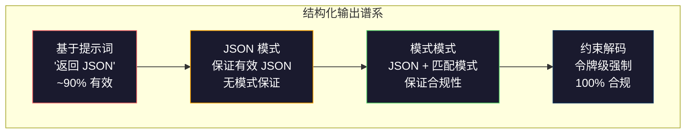
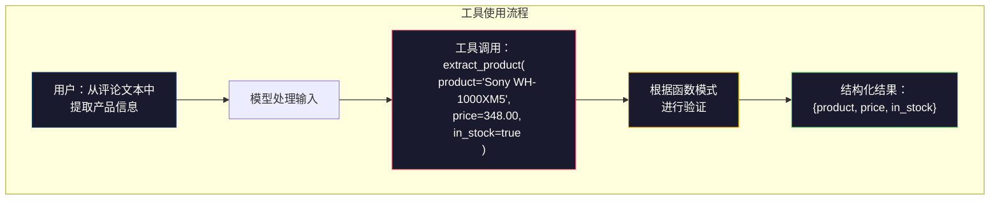

# 结构化输出：JSON、模式验证、约束解码

> 你的 LLM 返回一个字符串。你的应用程序需要 JSON。这个差距导致生产系统崩溃的次数比任何模型幻觉都要多。结构化输出是自然语言和类型化数据之间的桥梁。如果处理得当，你的 LLM 将成为一个可靠的 API。如果处理不当，你将在凌晨 3 点用正则表达式解析自由文本。

**Type:** 构建
**Languages:** Python
**Prerequisites:** 阶段 10，课程 01-05 (从零开始的 LLM)
**Time:** ~90 分钟
**Related:** 阶段 5 · 20（结构化输出与约束解码）涵盖了解码器层面的理论（FSM/CFG logit 处理器、Outlines、XGrammar）。本课程侧重于生产 SDK 接口（OpenAI `response_format`、Anthropic 工具使用、Instructor）—— 如果你想了解 API 底层发生的事情，请先阅读阶段 5 · 20。

## 学习目标

- 使用 OpenAI 和 Anthropic API 参数实现 JSON 模式和模式约束输出
- 构建一个 Pydantic 验证层，拒绝格式错误的 LLM 输出并附带错误反馈进行重试
- 解释约束解码如何在令牌级别强制执行有效 JSON 而无需后处理
- 设计健壮的提取提示词，可靠地将非结构化文本转换为类型化数据结构

## 问题

你问 LLM：“从这段文本中提取产品名称、价格和可用性。”它回答：

```
The product is the Sony WH-1000XM5 headphones, which cost $348.00 and are currently in stock.
```

这是一个完全正确的答案。但它对你的应用程序来说也完全没用。你的库存系统需要 `{"product": "Sony WH-1000XM5", "price": 348.00, "in_stock": true}`。你需要一个具有特定键、特定类型和特定值约束的 JSON 对象。你不需要一个句子。

天真的解决方案：在你的提示词中添加“以 JSON 格式响应”。这在 90% 的情况下有效。另外 10% 的情况下，模型会将 JSON 包装在 Markdown 代码围栏中，或者添加一个前导语，如“这是 JSON：”，或者因为它过早地关闭了一个括号而生成语法无效的 JSON。你的 JSON 解析器崩溃了。你的管道中断了。你添加了 try/except 和重试循环。重试有时会产生不同的数据。现在你在解析问题之上又遇到了一个一致性问题。

这不是一个提示词工程问题。这是一个解码问题。模型从左到右生成令牌。在每个位置，它从 10 万多个选项的词汇表中选择最有可能的下一个令牌。在任何给定位置，这些选项中的大多数都会产生无效的 JSON。如果模型刚刚发出了 `{"price":`，那么下一个令牌必须是数字、引号（用于字符串）、`null`、`true`、`false` 或负号。任何其他内容都会产生无效的 JSON。如果没有约束，模型可能会选择一个在语法上灾难性错误的、但完全合理的英文单词。

## 概念

### 结构化输出谱系

结构化输出控制有四个级别，每个级别都比上一个更可靠。



**基于提示词**（“以有效 JSON 格式响应”）：无强制。模型通常会遵守，但有时不会。可靠性：~90%。失败模式：Markdown 围栏、前导文本、截断输出、错误结构。

**JSON 模式**：API 保证输出是有效的 JSON。OpenAI 的 `response_format: { type: "json_object" }` 启用此功能。输出将无错误地解析。但它可能不符合你预期的模式——多余的键、错误的类型、缺失的字段。

**模式模式**：API 接受一个 JSON Schema 并保证输出与之匹配。到 2026 年，所有主要提供商都将原生支持此功能：OpenAI 的 `response_format: { type: "json_schema", json_schema: {...} }`（也作为 `tool_choice="required"`），Anthropic 的工具使用与 `input_schema`，以及 Gemini 的 `response_schema` + `response_mime_type: "application/json"`。输出将具有你指定的精确键、类型和约束。

**约束解码**：在生成过程中的每个令牌位置，解码器会屏蔽所有会产生无效输出的令牌。如果模式要求一个数字而模型即将发出一个字母，则该令牌的概率被设置为零。模型只能生成导致有效输出的令牌。这就是 OpenAI 的结构化输出模式以及 Outlines 和 Guidance 等库在底层实现的功能。

### JSON Schema：契约语言

JSON Schema 是你告诉模型（或验证层）输出必须具有什么形状的方式。每个主要的结构化输出系统都使用它。

```json
{
  "type": "object",
  "properties": {
    "product": { "type": "string" },
    "price": { "type": "number", "minimum": 0 },
    "in_stock": { "type": "boolean" },
    "categories": {
      "type": "array",
      "items": { "type": "string" }
    }
  },
  "required": ["product", "price", "in_stock"]
}
```

此模式表示：输出必须是一个对象，包含一个字符串 `product`、一个非负数 `price`、一个布尔值 `in_stock`，以及一个可选的字符串数组 `categories`。任何不匹配的输出都将被拒绝。

模式处理复杂情况：嵌套对象、带类型项的数组、枚举（将字符串约束为特定值）、模式匹配（字符串上的正则表达式）和组合器（oneOf、anyOf、allOf 用于多态输出）。

### Pydantic 模式

在 Python 中，你不需要手动编写 JSON Schema。你定义一个 Pydantic 模型，它会为你生成模式。

```python
from pydantic import BaseModel

class Product(BaseModel):
    product: str
    price: float
    in_stock: bool
    categories: list[str] = []
```

这会生成与上面相同的 JSON Schema。Instructor 库（和 OpenAI 的 SDK）直接接受 Pydantic 模型：传入模型类，返回一个经过验证的实例。如果 LLM 输出不匹配，Instructor 会自动重试。

### 函数调用 / 工具使用

解决相同问题的另一种接口。你不是直接要求模型生成 JSON，而是定义带有类型化参数的“工具”（函数）。模型输出一个带有结构化参数的函数调用。OpenAI 称之为“函数调用”。Anthropic 称之为“工具使用”。结果是相同的：结构化数据。



当模型需要选择调用哪个函数，而不仅仅是填写参数时，工具使用是首选。如果你有 10 个不同的提取模式，并且模型必须根据输入选择正确的模式，那么工具使用可以为你提供模式选择和结构化输出。

### 常见失败模式

即使有模式强制，结构化输出也可能以微妙的方式失败。

**幻觉值**：输出与模式匹配，但包含虚构数据。模型生成 `{"price": 299.99}`，而文本中说是 $348。模式验证无法捕获这一点——类型正确，但值错误。

**枚举混淆**：你将一个字段约束为 `["in_stock", "out_of_stock", "preorder"]`。模型输出 `"available"`——语义上正确，但不在允许的集合中。良好的约束解码可以防止这种情况。基于提示词的方法则不能。

**嵌套对象深度**：深度嵌套的模式（4 层以上）会产生更多错误。每个嵌套级别都是模型可能失去结构跟踪的另一个地方。

**数组长度**：模型可能会在数组中生成过多或过少的项。模式支持 `minItems` 和 `maxItems`，但并非所有提供商都在解码级别强制执行它们。

**可选字段遗漏**：模型遗漏了技术上可选但对你的用例而言语义上重要的字段。即使数据有时缺失，也要在模式中将它们设置为必需——强制模型明确生成 `null`。

## 构建它

### 步骤 1：JSON Schema 验证器

从头开始构建一个验证器，检查 Python 对象是否匹配 JSON Schema。这是在输出端运行以验证合规性的组件。

```python
import json

def validate_schema(data, schema):
    """
    根据给定的 JSON Schema 验证数据。
    返回一个错误列表。如果列表为空，则数据有效。
    """
    errors = []
    _validate(data, schema, "", errors)
    return errors

def _validate(data, schema, path, errors):
    """
    递归验证数据与模式。
    """
    schema_type = schema.get("type")

    if schema_type == "object":
        if not isinstance(data, dict):
            errors.append(f"{path}: 预期为对象，得到 {type(data).__name__}")
            return
        for key in schema.get("required", []):
            if key not in data:
                errors.append(f"{path}.{key}: 必需字段缺失")
        properties = schema.get("properties", {})
        for key, value in data.items():
            if key in properties:
                _validate(value, properties[key], f"{path}.{key}", errors)

    elif schema_type == "array":
        if not isinstance(data, list):
            errors.append(f"{path}: 预期为数组，得到 {type(data).__name__}")
            return
        min_items = schema.get("minItems", 0)
        max_items = schema.get("maxItems", float("inf"))
        if len(data) < min_items:
            errors.append(f"{path}: 数组有 {len(data)} 项，最小值为 {min_items}")
        if len(data) > max_items:
            errors.append(f"{path}: 数组有 {len(data)} 项，最大值为 {max_items}")
        items_schema = schema.get("items", {})
        for i, item in enumerate(data):
            _validate(item, items_schema, f"{path}[{i}]", errors)

    elif schema_type == "string":
        if not isinstance(data, str):
            errors.append(f"{path}: 预期为字符串，得到 {type(data).__name__}")
            return
        enum_values = schema.get("enum")
        if enum_values and data not in enum_values:
            errors.append(f"{path}: '{data}' 不在允许的值 {enum_values} 中")

    elif schema_type == "number":
        if not isinstance(data, (int, float)):
            errors.append(f"{path}: 预期为数字，得到 {type(data).__name__}")
            return
        minimum = schema.get("minimum")
        maximum = schema.get("maximum")
        if minimum is not None and data < minimum:
            errors.append(f"{path}: {data} 小于最小值 {minimum}")
        if maximum is not None and data > maximum:
            errors.append(f"{path}: {data} 大于最大值 {maximum}")

    elif schema_type == "boolean":
        if not isinstance(data, bool):
            errors.append(f"{path}: 预期为布尔值，得到 {type(data).__name__}")

    elif schema_type == "integer":
        if not isinstance(data, int) or isinstance(data, bool): # bool is subclass of int
            errors.append(f"{path}: 预期为整数，得到 {type(data).__name__}")
```

### 步骤 2：Pydantic 风格模型到模式转换器

构建一个最小的类到模式转换器。定义一个 Python 类并自动生成其 JSON Schema。

```python
class SchemaField:
    """
    表示模式中的一个字段，包含其类型和约束。
    """
    def __init__(self, field_type, required=True, default=None, enum=None, minimum=None, maximum=None):
        self.field_type = field_type
        self.required = required
        self.default = default
        self.enum = enum
        self.minimum = minimum
        self.maximum = maximum

def python_type_to_schema(field):
    """
    将 Python 类型和 SchemaField 属性转换为 JSON Schema 属性。
    """
    type_map = {
        str: "string",
        int: "integer",
        float: "number",
        bool: "boolean",
    }

    schema = {}

    if field.field_type in type_map:
        schema["type"] = type_map[field.field_type]
    elif field.field_type == list:
        schema["type"] = "array"
        # 假设列表项默认为字符串，可以扩展以支持更复杂的类型
        schema["items"] = {"type": "string"}
    elif isinstance(field.field_type, dict):
        # 允许直接传入一个字典作为子模式
        schema = field.field_type

    if field.enum:
        schema["enum"] = field.enum
    if field.minimum is not None:
        schema["minimum"] = field.minimum
    if field.maximum is not None:
        schema["maximum"] = field.maximum

    return schema

def model_to_schema(name, fields):
    """
    将一个简单的 Python 模型定义（名称和字段字典）转换为 JSON Schema。
    """
    properties = {}
    required = []

    for field_name, field in fields.items():
        properties[field_name] = python_type_to_schema(field)
        if field.required:
            required.append(field_name)

    return {
        "type": "object",
        "properties": properties,
        "required": required,
    }
```

### 步骤 3：约束令牌过滤器

模拟约束解码。给定一个部分 JSON 字符串和一个模式，确定当前位置哪些令牌类别是有效的。

```python
def next_valid_tokens(partial_json, schema):
    """
    根据部分 JSON 字符串和（简化）JSON 语法规则，
    返回下一个有效令牌类别的列表。
    这只是一个非常简化的模拟，不考虑完整的 JSON Schema。
    """
    stripped = partial_json.strip()

    if not stripped:
        # 如果字符串为空，只能以对象开始
        return ["{"]

    try:
        # 尝试加载 JSON，如果成功，则表示可以结束
        json.loads(stripped)
        return ["<EOS>"] # End Of String
    except json.JSONDecodeError:
        pass # 尚未完成，继续检查

    last_char = stripped[-1] if stripped else ""

    if last_char == "{":
        # 在对象开始后，可以有键（字符串）或结束对象
        return ['"', "}"]
    elif last_char == '"':
        # 如果以引号结尾，可能是键的结束，后面跟冒号；
        # 或者值的结束，后面跟逗号或对象/数组结束
        if stripped.endswith('":'): # 键已完成，等待值
            return ['"', "0-9", "true", "false", "null", "[", "{"]
        return ["a-z", '"', ":", ",", "}", "]"] # 字符串内容或结束
    elif last_char == ":":
        # 冒号后等待值
        return [" ", '"', "0-9", "true", "false", "null", "[", "{"]
    elif last_char == ",":
        # 逗号后等待下一个键或数组项
        return [" ", '"', "{", "["]
    elif last_char in "0123456789":
        # 数字后可以继续是数字、小数点、逗号、对象/数组结束
        return ["0-9", ".", ",", "}", "]"]
    elif last_char == "}":
        # 对象结束后可以有逗号（下一个键值对）或结束对象/数组
        return [",", "}", "]"]
    elif last_char == "]":
        # 数组结束后可以有逗号（下一个数组项）或结束对象/数组
        return [",", "}", "<EOS>"]
    elif last_char == "[":
        # 数组开始后可以有值或结束数组
        return ['"', "0-9", "true", "false", "null", "{", "[", "]"]
    else:
        # 默认情况下，允许任何字符（非常简化）
        return ["any"]

def demonstrate_constrained_decoding():
    """
    演示约束解码的模拟过程。
    """
    partial_states = [
        '',
        '{',
        '{"product"',
        '{"product":',
        '{"product": "Sony"',
        '{"product": "Sony",',
        '{"product": "Sony", "price":',
        '{"product": "Sony", "price": 348',
        '{"product": "Sony", "price": 348}',
    ]

    print(f"{'部分 JSON':<45} {'有效下一个令牌'}")
    print("-" * 80)
    for state in partial_states:
        valid = next_valid_tokens(state, {}) # 简化，不使用实际模式
        display = state if state else "(空)"
        print(f"{display:<45} {valid}")
```

### 步骤 4：提取管道

将所有内容组合成一个提取管道：定义一个模式，模拟 LLM 生成结构化输出，验证输出，并处理重试。

```python
def simulate_llm_extraction(text, schema, attempt=0):
    """
    模拟 LLM 根据输入文本生成 JSON 输出。
    在第一次尝试时，可能会故意引入错误以演示重试。
    """
    if "headphones" in text.lower() or "sony" in text.lower():
        if attempt == 0:
            # 第一次尝试时，故意返回一个缺少 'categories' 字段的 JSON，
            # 或者 'categories' 字段类型不匹配的 JSON，
            # 以触发验证失败和重试。
            # 这里我们模拟一个缺少 'categories' 字段的场景，
            # 假设 schema 中 'categories' 是必需的（虽然我们当前定义为可选）。
            # 为了演示重试，我们让第一次尝试返回一个不完全符合 schema 的结果。
            # 假设 schema 期望 categories 是一个数组，但第一次尝试可能返回一个字符串，
            # 或者直接省略。这里我们模拟一个省略的情况，如果 schema 把它设为 required。
            # 更好的演示是让它返回一个类型错误，例如 "categories": "audio, headphones"
            return '{"product": "Sony WH-1000XM5", "price": 348.00, "in_stock": true, "categories": "audio, headphones"}' # 故意返回错误类型
        # 第二次尝试返回正确格式
        return '{"product": "Sony WH-1000XM5", "price": 348.00, "in_stock": true, "categories": ["audio", "headphones"]}'

    if "laptop" in text.lower():
        return '{"product": "MacBook Pro 16", "price": 2499.00, "in_stock": false, "categories": ["computers"]}'

    return '{"product": "Unknown", "price": 0, "in_stock": false}'

def extract_with_retry(text, schema, max_retries=3):
    """
    尝试从文本中提取结构化数据，并在验证失败时重试。
    """
    for attempt in range(max_retries):
        print(f"  尝试 {attempt + 1}...")
        raw = simulate_llm_extraction(text, schema, attempt)
        print(f"    LLM 原始输出: {raw}")

        try:
            data = json.loads(raw)
        except json.JSONDecodeError as e:
            print(f"  尝试 {attempt + 1}: JSON 解析错误 -- {e}")
            continue # JSON 无效，无法验证，直接重试

        errors = validate_schema(data, schema)
        if not errors:
            print(f"  尝试 {attempt + 1}: 验证成功。")
            return data

        print(f"  尝试 {attempt + 1}: 模式验证错误 -- {errors}")
        # 在实际场景中，这里会将错误反馈给 LLM，让它在下一次尝试中纠正。
        # 我们的模拟只是简单地重试。

    print(f"  在 {max_retries} 次重试后失败。")
    return None

# 定义一个产品模式
product_schema = {
    "type": "object",
    "properties": {
        "product": {"type": "string"},
        "price": {"type": "number", "minimum": 0},
        "in_stock": {"type": "boolean"},
        "categories": {
            "type": "array",
            "items": {"type": "string"}
        },
    },
    "required": ["product", "price", "in_stock"], # categories 是可选的
}
```

### 步骤 5：运行完整管道

```python
def run_demo():
    print("=" * 60)
    print("  结构化输出管道演示")
    print("=" * 60)

    print("\n--- 模式定义 ---")
    product_fields = {
        "product": SchemaField(str),
        "price": SchemaField(float, minimum=0),
        "in_stock": SchemaField(bool),
        "categories": SchemaField(list, required=False), # 设为可选
    }
    generated_schema = model_to_schema("Product", product_fields)
    print(json.dumps(generated_schema, indent=2, ensure_ascii=False)) # ensure_ascii=False for Chinese output

    print("\n--- 模式验证 ---")
    test_cases = [
        ({"product": "Test", "price": 10.0, "in_stock": True, "categories": ["a"]}, "有效对象"),
        ({"product": "Test", "price": -5.0, "in_stock": True}, "负价格"),
        ({"product": "Test", "in_stock": True}, "缺少价格"),
        ({"product": "Test", "price": "ten", "in_stock": True}, "字符串作为价格"),
        ("not an object", "字符串而非对象"),
        ({"product": "Test", "price": 10.0, "in_stock": True, "categories": "audio"}, "类别类型错误"), # 新增测试用例
    ]

    for data, label in test_cases:
        errors = validate_schema(data, product_schema)
        status = "通过" if not errors else f"失败: {errors}"
        print(f"  {label}: {status}")

    print("\n--- 约束解码模拟 ---")
    demonstrate_constrained_decoding()

    print("\n--- 提取管道 ---")
    texts = [
        "Sony WH-1000XM5 耳机售价 $348，目前有货。",
        "新款 MacBook Pro 16 英寸笔记本电脑售价 $2499，但已售罄。",
        "这是一句没有产品信息的随机句子。",
    ]

    for text in texts:
        print(f"\n  输入: {text[:60]}...")
        result = extract_with_retry(text, product_schema)
        if result:
            print(f"  输出: {json.dumps(result, indent=2, ensure_ascii=False)}")
        else:
            print(f"  输出: 重试后失败")

if __name__ == "__main__":
    run_demo()
```

## 使用它

### OpenAI 结构化输出

```python
# from openai import OpenAI
# from pydantic import BaseModel
#
# client = OpenAI()
#
# class Product(BaseModel):
#     product: str
#     price: float
#     in_stock: bool
#
# response = client.beta.chat.completions.parse(
#     model="gpt-5-mini",
#     messages=[
#         {"role": "system", "content": "提取产品信息。"}, # 翻译注释
#         {"role": "user", "content": "Sony WH-1000XM5, $348, 有货"}, # 翻译注释
#     ],
#     response_format=Product,
# )
#
# product = response.choices[0].message.parsed
# print(product.product, product.price, product.in_stock)
```

OpenAI 的结构化输出模式在内部使用约束解码。模型生成的每个令牌都保证产生与 Pydantic 模式匹配的输出。无需重试。无需验证。约束已嵌入到解码过程中。

### Anthropic 工具使用

```python
# import anthropic
#
# client = anthropic.Anthropic()
#
# response = client.messages.create(
#     model="claude-opus-4-7",
#     max_tokens=1024,
#     tools=[{
#         "name": "extract_product",
#         "description": "从文本中提取产品信息", # 翻译注释
#         "input_schema": {
#             "type": "object",
#             "properties": {
#                 "product": {"type": "string"},
#                 "price": {"type": "number"},
#                 "in_stock": {"type": "boolean"},
#             },
#             "required": ["product", "price", "in_stock"],
#         },
#     }],
#     messages=[{"role": "user", "content": "提取: Sony WH-1000XM5, $348, 有货"}], # 翻译注释
# )
```

Anthropic 通过工具使用实现结构化输出。模型发出一个工具调用，其结构化参数与 `input_schema` 匹配。结果相同，API 接口不同。

### Instructor 库

```python
# pip install instructor
# import instructor
# from openai import OpenAI
# from pydantic import BaseModel
#
# client = instructor.from_openai(OpenAI())
#
# class Product(BaseModel):
#     product: str
#     price: float
#     in_stock: bool
#
# product = client.chat.completions.create(
#     model="gpt-5-mini",
#     response_model=Product,
#     messages=[{"role": "user", "content": "Sony WH-1000XM5, $348, 有货"}], # 翻译注释
# )
```

Instructor 包装任何 LLM 客户端，并添加带有验证的自动重试。如果第一次尝试验证失败，它会将错误作为上下文发送回模型，并要求模型修复输出。这适用于任何提供商，而不仅仅是 OpenAI。

## 交付它

本课程生成 `outputs/prompt-structured-extractor.md`——一个可重用的提示词模板，可以根据模式定义从任何文本中提取结构化数据。向它提供 JSON Schema 和非结构化文本，它将返回经过验证的 JSON。

它还生成 `outputs/skill-structured-outputs.md`——一个决策框架，用于根据你的提供商、可靠性要求和模式复杂性选择正确的结构化输出策略。

## 练习

1.  扩展模式验证器以支持 `oneOf`（数据必须与多个模式中的一个完全匹配）。这处理多态输出——例如，一个字段可以是 `Product` 对象或 `Service` 对象，具有不同的形状。

2.  构建一个“模式差异”工具，比较两个模式并识别破坏性更改（删除的必需字段、更改的类型）与非破坏性更改（添加的可选字段、放宽的约束）。这对于在生产环境中对提取模式进行版本控制至关重要。

3.  实现一个更真实的约束解码模拟器。给定一个 JSON Schema 和一个包含 100 个令牌（字母、数字、标点符号、关键字）的词汇表，逐步进行生成，在每个位置屏蔽无效令牌。测量在每个步骤中词汇表中有多少百分比是有效的。

4.  构建一个提取评估套件。创建 50 个带有手动标记 JSON 输出的产品描述。在所有 50 个描述上运行你的提取管道，并测量精确匹配、字段级准确性和类型合规性。识别哪些字段最难正确提取。

5.  为你的提取管道添加“置信度分数”。对于每个提取的字段，估计模型的置信度（基于令牌概率，或通过运行提取 3 次并测量一致性）。标记低置信度字段以供人工审查。

## 关键术语

| 术语 | 人们常说 | 实际含义 |
|------|----------------|----------------------|
| JSON mode | “返回 JSON” | API 标志，保证语法有效的 JSON 输出，但不强制执行任何特定模式 |
| Structured output | “类型化 JSON” | 与特定 JSON Schema 匹配的输出，具有正确的键、类型和约束 |
| Constrained decoding | “引导式生成” | 在每个令牌位置，屏蔽会产生无效输出的令牌——保证 100% 的模式合规性 |
| JSON Schema | “一个 JSON 模板” | 一种声明性语言，用于描述 JSON 数据的结构、类型和约束（由 OpenAPI、JSON Forms 等使用） |
| Pydantic | “Python 数据类+” | Python 库，定义带有类型验证的数据模型，由 FastAPI 和 Instructor 用于生成 JSON Schema |
| Function calling | “工具使用” | LLM 输出一个结构化的函数调用（名称 + 类型化参数）而不是自由文本——OpenAI 和 Anthropic 都支持此功能 |
| Instructor | “LLM 的 Pydantic” | Python 库，包装 LLM 客户端以返回经过验证的 Pydantic 实例，并在验证失败时自动重试 |
| Token masking | “过滤词汇表” | 在生成过程中将特定令牌的概率设置为零，使模型无法生成它们 |
| Schema compliance | “匹配形状” | 输出具有所有必需字段、正确的类型、在约束范围内的值，并且没有额外不允许的字段 |
| Retry loop | “反复尝试直到成功” | 将验证错误发送回模型，并要求它修复输出——Instructor 会自动执行此操作，最多可配置重试次数 |

## 延伸阅读

- [OpenAI 结构化输出指南](https://platform.openai.com/docs/guides/structured-outputs)——OpenAI API 中基于 JSON Schema 的约束解码的官方文档
- [Willard & Louf, 2023 -- "Efficient Guided Generation for Large Language Models"](https://arxiv.org/abs/2307.09702)——Outlines 论文，描述如何将 JSON Schema 编译成有限状态机以实现令牌级约束
- [Instructor 文档](https://python.useinstructor.com/)——用于从任何 LLM 获取结构化输出并进行 Pydantic 验证和重试的标准库
- [Anthropic 工具使用指南](https://docs.anthropic.com/en/docs/tool-use)——Claude 如何通过工具使用和 JSON Schema `input_schema` 实现结构化输出
- [JSON Schema 规范](https://json-schema.org/)——所有主要结构化输出系统使用的模式语言的完整规范
- [Outlines 库](https://github.com/outlines-dev/outlines)——使用正则表达式和 JSON Schema 编译为有限状态机的开源约束生成库
- [Dong et al., "XGrammar: Flexible and Efficient Structured Generation Engine for Large Language Models" (MLSys 2025)](https://arxiv.org/abs/2411.15100)——当前最先进的语法引擎；下推自动机编译，以约 100 纳秒/令牌的速度屏蔽令牌。
- [Beurer-Kellner et al., "Prompting Is Programming: A Query Language for Large Language Models" (LMQL)](https://arxiv.org/abs/2212.06094)——LMQL 论文，将约束解码框定为具有类型和值约束的查询语言。
- [Microsoft Guidance (框架文档)](https://github.com/guidance-ai/guidance)——模板驱动的约束生成；与 Outlines 和 XGrammar 互补的供应商无关框架。