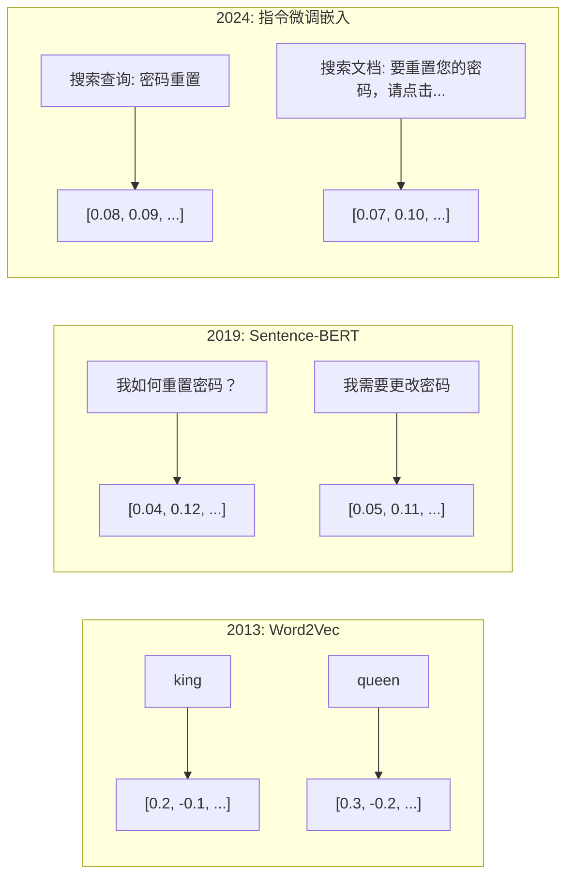
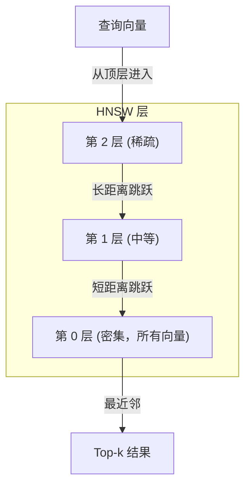

# 嵌入与向量表示

> 文本是离散的。数学是连续的。每当你要求大型语言模型（LLM）查找“相似”文档、比较含义或进行超越关键词的搜索时，你都在依赖连接这两个世界的桥梁。这座桥梁就是嵌入。如果你不理解嵌入，你就不理解现代人工智能。你只是在使用它。

**Type:** Build
**Languages:** Python
**Prerequisites:** 阶段 11，课程 01 (提示词工程)
**Time:** ~75 分钟
**Related:** 阶段 5 · 22 (嵌入模型深度解析) 涵盖了密集向量与稀疏向量、多向量、Matryoshka 截断以及逐轴模型选择。本课程侧重于生产管线（向量数据库、HNSW、相似度计算）。在选择模型之前，请阅读阶段 5 · 22。

## 学习目标

- 使用 API 提供商和开源模型生成文本嵌入，并计算它们之间的余弦相似度
- 解释为什么嵌入能够解决关键词搜索无法处理的词汇不匹配问题
- 构建一个语义搜索索引，通过含义而非精确关键词匹配来检索文档
- 使用检索基准（precision@k, recall）评估嵌入质量，并为你的任务选择合适的嵌入模型

## 问题

你有 10,000 张支持工单。一位客户写道“我的付款失败了（my payment didn't go through）”。你需要找到类似的过往工单。关键词搜索会找到包含“payment”和“didn't go through”的工单。它会错过“transaction failed”、“charge was declined”和“billing error”等工单。这些工单用完全不同的词语描述了完全相同的问题。

这就是词汇不匹配问题。人类语言有几十种方式来表达同一件事。关键词搜索将每个词视为一个独立的、没有意义的符号。它无法知道“declined”和“didn't go through”指的是同一个概念。

你需要一种文本表示方式，其中相似性由含义而非拼写决定。你需要一种方法，将“我的付款失败了（my payment didn't go through）”和“交易被拒绝了（transaction was declined）”在某个数学空间中放置得彼此靠近，同时将“我的付款按时到达了（my payment arrived on time）”推开，尽管它们共享了“payment”这个词。

这种表示就是嵌入。

## 概念

### 什么是嵌入？

嵌入是一个由浮点数组成的密集向量，它代表文本的含义。“密集”这个词很重要——每个维度都承载信息，这与大多数维度为零的稀疏表示（词袋模型、TF-IDF）不同。

“猫坐在垫子上（The cat sat on the mat）”会变成类似 `[0.023, -0.041, 0.087, ..., 0.012]` 的形式——一个包含 768 到 3072 个数字的列表，具体取决于模型。这些数字编码了含义。你从不直接检查它们。你比较它们。

### Word2Vec 的突破

2013 年，Tomas Mikolov 及其在 Google 的同事发表了 Word2Vec。其核心思想是：训练一个神经网络，使其能够根据一个词的邻居词（或根据一个词预测其邻居词），然后隐藏层的权重就变成了有意义的向量表示。

著名的结果是：

```
king - man + woman = queen
```

词嵌入上的向量算术捕捉了语义关系。“man”到“woman”的方向大致与“king”到“queen”的方向相同。正是从那一刻起，该领域意识到几何学可以编码含义。

Word2Vec 生成了 300 维向量。每个词都获得一个向量，无论上下文如何。“river bank”（河岸）中的“bank”和“bank account”（银行账户）中的“bank”具有相同的嵌入。这一局限性推动了接下来十年的研究。

### 从词到句子

词嵌入表示单个词元。生产系统需要嵌入整个句子、段落或文档。出现了四种方法：

**平均法**：取句子中所有词向量的平均值。成本低，有损，对于短文本来说效果出奇地好。完全丢失词序——“狗咬人（dog bites man）”和“人咬狗（man bites dog）”会得到相同的嵌入。

**CLS 词元**：Transformer 模型（BERT，2018）输出一个特殊的 [CLS] 词元嵌入，它代表整个输入。比平均法更好，但 [CLS] 词元是为下一句预测而非相似性训练的。

**对比学习**：明确训练模型，使相似的对彼此靠近，不相似的对彼此远离。Sentence-BERT（Reimers & Gurevych，2019）采用了这种方法，并成为现代嵌入模型的基础。给定“我如何重置密码？”和“我需要更改密码”，模型学习到这些应该具有几乎相同的向量。

**指令微调嵌入**：最新的方法。E5 和 GTE 等模型接受一个任务前缀（“search_query:”、“search_document:”），告诉模型要生成哪种类型的嵌入。这使得一个模型可以服务于多个任务。



### 现代嵌入模型

市场已经稳定在少数几个生产级选项上（截至 2026 年初的 MTEB 分数，MTEB v2）：

| 模型 | 提供商 | 维度 | MTEB | 上下文 | 每百万词元成本 |
|-------|----------|-----------|------|---------|------------------|
| Gemini Embedding 2 | Google | 3072 (Matryoshka) | 67.7 (retrieval) | 8192 | $0.15 |
| embed-v4 | Cohere | 1024 (Matryoshka) | 65.2 | 128K | $0.12 |
| voyage-4 | Voyage AI | 1024/2048 (Matryoshka) | 66.8 | 32K | $0.12 |
| text-embedding-3-large | OpenAI | 3072 (Matryoshka) | 64.6 | 8192 | $0.13 |
| text-embedding-3-small | OpenAI | 1536 (Matryoshka) | 62.3 | 8192 | $0.02 |
| BGE-M3 | BAAI | 1024 (dense+sparse+ColBERT) | 63.0 multilingual | 8192 | 开源 |
| Qwen3-Embedding | Alibaba | 4096 (Matryoshka) | 66.9 | 32K | 开源 |
| Nomic-embed-v2 | Nomic | 768 (Matryoshka) | 63.1 | 8192 | 开源 |

MTEB (大规模文本嵌入基准) v2 涵盖了检索、分类、聚类、重排序和摘要等 100 多个任务。分数越高越好。到 2026 年，开源模型（Qwen3-Embedding, BGE-M3）在大多数方面与闭源托管模型持平或超越。Gemini Embedding 2 在纯检索方面领先；Voyage/Cohere 在特定领域（金融、法律、代码）领先。在投入使用前，务必在自己的查询上进行基准测试。

### 相似度指标

给定两个嵌入向量，有三种方法可以衡量它们的相似程度：

**余弦相似度**：两个向量之间夹角的余弦值。范围从 -1（完全相反）到 1（方向相同）。忽略大小——一个 10 个词的句子和一个 500 个词的文档如果指向同一方向，可以得到 1.0 分。这是 90% 用例的默认选择。

```
cosine_sim(a, b) = dot(a, b) / (||a|| * ||b||)
```

**点积**：两个向量的原始内积。当向量归一化（单位长度）时，与余弦相似度相同。计算速度更快。OpenAI 的嵌入是归一化的，因此点积和余弦给出相同的排名。

```
dot(a, b) = sum(a_i * b_i)
```

**欧几里得（L2）距离**：向量空间中的直线距离。值越小越相似。对大小差异敏感。当空间中的绝对位置很重要，而不仅仅是方向时使用。

```
L2(a, b) = sqrt(sum((a_i - b_i)^2))
```

何时使用哪种：

| 指标 | 使用场景 | 避免场景 |
|--------|----------|------------|
| 余弦相似度 | 比较不同长度的文本；大多数检索任务 | 大小携带信息时 |
| 点积 | 嵌入已归一化；追求最大速度 | 向量大小不同时 |
| 欧几里得距离 | 聚类；空间最近邻问题 | 比较长度差异巨大的文档时 |

### 向量数据库与 HNSW

暴力相似度搜索会将查询与每个存储的向量进行比较。对于 100 万个 1536 维向量，每次查询需要 15 亿次乘加运算。这太慢了。

向量数据库通过近似最近邻（ANN）算法解决了这个问题。主流算法是 HNSW（分层可导航小世界）：

1. 构建一个多层向量图
2. 顶层稀疏——连接遥远簇的长距离连接
3. 底层密集——连接附近向量的细粒度连接
4. 搜索从顶层开始，贪婪地向下层细化
5. 以 O(log n) 时间而非 O(n) 时间返回近似的 top-k 结果

HNSW 以牺牲少量准确性（通常 95-99% 的召回率）换取巨大的速度提升。对于 1000 万个向量，暴力搜索需要数秒，而 HNSW 只需要数毫秒。



生产选项：

| 数据库 | 类型 | 最适合 | 最大规模 |
|----------|------|----------|-----------|
| Pinecone | 托管 SaaS | 零运维生产 | 数十亿 |
| Weaviate | 开源 | 自托管，混合搜索 | 1 亿+ |
| Qdrant | 开源 | 高性能，过滤 | 1 亿+ |
| ChromaDB | 嵌入式 | 原型开发，本地开发 | 100 万 |
| pgvector | Postgres 扩展 | 已使用 Postgres | 1000 万 |
| FAISS | 库 | 进程内，研究 | 10 亿+ |

### 分块策略

文档太长，无法作为单个向量进行嵌入。一个 50 页的 PDF 涵盖了数十个主题——它的嵌入会变成所有内容的平均值，与任何特定内容都不相似。你需要将文档分割成块，并对每个块进行嵌入。

**固定大小分块**：每 N 个词元分割一次，M 个词元重叠。简单且可预测。当文档没有清晰结构时效果良好。一个 512 词元块，50 词元重叠：块 1 是词元 0-511，块 2 是词元 462-973。

**基于句子分块**：在句子边界处分割，将句子分组直到达到词元限制。每个块至少是一个完整的句子。比固定大小更好，因为你永远不会将一个思想切成两半。

**递归分块**：首先尝试在最大的边界（章节标题）处分割。如果仍然太大，尝试段落边界。然后是句子边界。然后是字符限制。这是 LangChain 的 `RecursiveCharacterTextSplitter`，它对于混合格式语料库效果很好。

**语义分块**：嵌入每个句子，然后将嵌入相似的连续句子分组。当嵌入相似度低于某个阈值时，开始一个新的块。成本较高（需要单独嵌入每个句子），但能产生最连贯的块。

| 策略 | 复杂度 | 质量 | 最适合 |
|----------|-----------|---------|----------|
| 固定大小 | 低 | 尚可 | 非结构化文本，日志 |
| 基于句子 | 低 | 良好 | 文章，电子邮件 |
| 递归 | 中 | 良好 | Markdown，HTML，混合文档 |
| 语义 | 高 | 最佳 | 关键检索质量 |

大多数系统的最佳选择：256-512 词元块，50 词元重叠。

### 双编码器与交叉编码器

双编码器独立地嵌入查询和文档，然后比较向量。速度快——你只需嵌入查询一次，然后与预先计算好的文档嵌入进行比较。这正是你用于检索的方案。

交叉编码器将查询和文档作为单个输入，并输出一个相关性分数。速度慢——它需要通过完整模型处理每个查询-文档对。但由于它能够同时关注查询和文档词元，因此准确性要高得多。

生产模式：双编码器检索前 100 个候选，交叉编码器将其重排序至前 10 个。这就是“检索-然后-重排序”的管线。


重排序模型：Cohere Rerank 3.5（每 1000 次查询 2 美元）、BGE-reranker-v2（免费，开源）、Jina Reranker v2（免费，开源）。

### Matryoshka 嵌入

传统嵌入是全有或全无的。一个 1536 维向量使用 1536 个浮点数。你无法在不重新训练的情况下截断到 256 维。

Matryoshka 表示学习（Kusupati 等人，2022）解决了这个问题。模型经过训练，使得前 N 个维度捕获最重要的信息，就像俄罗斯套娃一样。将 1536 维的 Matryoshka 嵌入截断到 256 维会损失一些准确性，但仍能正常工作。

OpenAI 的 text-embedding-3-small 和 text-embedding-3-large 通过 `dimensions` 参数支持 Matryoshka 截断。请求 256 维而不是 1536 维，可以将存储空间减少 6 倍，同时在 MTEB 基准测试中损失大约 3-5% 的准确性。

### 二值量化

一个存储为 float32 的 1536 维嵌入占用 6,144 字节。乘以 1000 万个文档：仅向量就占用 61 GB。

二值量化将每个浮点数转换为单个比特：正值变为 1，负值变为 0。存储空间从 6,144 字节降至 192 字节——减少了 32 倍。相似度使用汉明距离（计算不同比特的数量）进行计算，CPU 可以在单个指令中完成。

准确性损失约为检索召回率的 5-10%。常见模式是：对数百万个向量进行第一遍搜索时使用二值量化，然后用全精度向量对前 1000 个结果进行重新评分。这可以在内存减少 32 倍的情况下，获得 95% 以上的全精度准确性。

```figure
cosine-similarity
```

## 动手实践

我们将从头开始构建一个语义搜索引擎。不使用向量数据库。不使用外部嵌入 API。纯 Python 实现，使用 numpy 进行数学计算。

### 步骤 1：文本分块

```python
def chunk_text(text, chunk_size=200, overlap=50):
    # 将文本分割成带重叠的词块
    words = text.split()
    chunks = []
    start = 0
    while start < len(words):
        end = start + chunk_size
        chunk = " ".join(words[start:end])
        chunks.append(chunk)
        start += chunk_size - overlap
    return chunks


def chunk_by_sentences(text, max_chunk_tokens=200):
    # 将文本分割成句子，然后将句子分组为块
    sentences = text.replace("\n", " ").split(".")
    sentences = [s.strip() + "." for s in sentences if s.strip()]
    chunks = []
    current_chunk = []
    current_length = 0
    for sentence in sentences:
        sentence_length = len(sentence.split())
        if current_length + sentence_length > max_chunk_tokens and current_chunk:
            chunks.append(" ".join(current_chunk))
            current_chunk = []
            current_length = 0
        current_chunk.append(sentence)
        current_length += sentence_length
    if current_chunk:
        chunks.append(" ".join(current_chunk))
    return chunks
```

### 步骤 2：从头构建嵌入

我们使用 TF-IDF 和 L2 归一化实现一个简单的密集嵌入。这不是一个神经网络嵌入，但它遵循相同的约定：文本输入，固定大小向量输出，相似文本产生相似向量。

```python
import math
import numpy as np
from collections import Counter

class SimpleEmbedder:
    def __init__(self):
        self.vocab = []
        self.idf = []
        self.word_to_idx = {}

    def fit(self, documents):
        # 构建词汇表并计算 IDF 分数
        vocab_set = set()
        for doc in documents:
            vocab_set.update(doc.lower().split())
        self.vocab = sorted(vocab_set)
        self.word_to_idx = {w: i for i, w in enumerate(self.vocab)}
        n = len(documents)
        self.idf = np.zeros(len(self.vocab))
        for i, word in enumerate(self.vocab):
            doc_count = sum(1 for doc in documents if word in doc.lower().split())
            self.idf[i] = math.log((n + 1) / (doc_count + 1)) + 1

    def embed(self, text):
        # 为给定文本计算 TF-IDF 向量
        words = text.lower().split()
        count = Counter(words)
        total = len(words) if words else 1
        vec = np.zeros(len(self.vocab))
        for word, freq in count.items():
            if word in self.word_to_idx:
                tf = freq / total
                vec[self.word_to_idx[word]] = tf * self.idf[self.word_to_idx[word]]
        # 对向量进行 L2 归一化
        norm = np.linalg.norm(vec)
        if norm > 0:
            vec = vec / norm
        return vec
```

### 步骤 3：相似度函数

```python
def cosine_similarity(a, b):
    # 两个向量之间的余弦相似度
    dot = np.dot(a, b)
    norm_a = np.linalg.norm(a)
    norm_b = np.linalg.norm(b)
    if norm_a == 0 or norm_b == 0:
        return 0.0
    return float(dot / (norm_a * norm_b))


def dot_product(a, b):
    # 两个向量的点积
    return float(np.dot(a, b))


def euclidean_distance(a, b):
    # 两个向量之间的欧几里得距离
    return float(np.linalg.norm(a - b))
```

### 步骤 4：带暴力搜索的向量索引

```python
class VectorIndex:
    def __init__(self):
        # 带有暴力搜索的简单内存向量索引
        self.vectors = []
        self.texts = []
        self.metadata = []

    def add(self, vector, text, meta=None):
        # 将向量及其关联的文本/元数据添加到索引
        self.vectors.append(vector)
        self.texts.append(text)
        self.metadata.append(meta or {})

    def search(self, query_vector, top_k=5, metric="cosine"):
        # 执行暴力搜索以查找 top_k 最近邻
        scores = []
        for i, vec in enumerate(self.vectors):
            # 根据所选指标计算分数
            if metric == "cosine":
                score = cosine_similarity(query_vector, vec)
            elif metric == "dot":
                score = dot_product(query_vector, vec)
            elif metric == "euclidean":
                score = -euclidean_distance(query_vector, vec)
            else:
                raise ValueError(f"Unknown metric: {metric}")
            scores.append((i, score))
        # 按分数降序排序结果
        scores.sort(key=lambda x: x[1], reverse=True)
        results = []
        for idx, score in scores[:top_k]:
            results.append({
                "text": self.texts[idx],
                "score": score,
                "metadata": self.metadata[idx],
                "index": idx
            })
        return results

    def size(self):
        # 返回索引中的向量数量
        return len(self.vectors)
```

### 步骤 5：语义搜索引擎

```python
class SemanticSearchEngine:
    def __init__(self, chunk_size=200, overlap=50):
        # 初始化嵌入器和向量索引
        self.embedder = SimpleEmbedder()
        self.index = VectorIndex()
        self.chunk_size = chunk_size
        self.overlap = overlap

    def index_documents(self, documents, source_names=None):
        # 通过分块并嵌入每个块来索引文档列表
        all_chunks = []
        all_sources = []
        for i, doc in enumerate(documents):
            chunks = chunk_text(doc, self.chunk_size, self.overlap)
            all_chunks.extend(chunks)
            name = source_names[i] if source_names else f"doc_{i}"
            all_sources.extend([name] * len(chunks))
        self.embedder.fit(all_chunks)
        for chunk, source in zip(all_chunks, all_sources):
            vec = self.embedder.embed(chunk)
            self.index.add(vec, chunk, {"source": source})
        return len(all_chunks)

    def search(self, query, top_k=5, metric="cosine"):
        # 嵌入查询并搜索索引
        query_vec = self.embedder.embed(query)
        return self.index.search(query_vec, top_k, metric)

    def search_with_scores(self, query, top_k=5):
        # 带分数搜索以供显示
        results = self.search(query, top_k)
        return [
            {
                "text": r["text"][:200],
                "source": r["metadata"].get("source", "unknown"),
                "score": round(r["score"], 4)
            }
            for r in results
        ]
```

### 步骤 6：比较相似度指标

```python
def compare_metrics(engine, query, top_k=3):
    # 使用不同的相似度指标比较搜索结果
    results = {}
    for metric in ["cosine", "dot", "euclidean"]:
        hits = engine.search(query, top_k=top_k, metric=metric)
        results[metric] = [
            {"score": round(h["score"], 4), "preview": h["text"][:80]}
            for h in hits
        ]
    return results
```

## 使用它

使用生产级嵌入 API 时，架构保持不变。只有嵌入器会改变：

```python
from openai import OpenAI

client = OpenAI()

def openai_embed(texts, model="text-embedding-3-small", dimensions=None):
    # OpenAI 嵌入函数
    kwargs = {"model": model, "input": texts}
    if dimensions:
        kwargs["dimensions"] = dimensions
    response = client.embeddings.create(**kwargs)
    return [item.embedding for item in response.data]
```

OpenAI 的 Matryoshka 截断——相同模型，更少维度，更低存储：

```python
full = openai_embed(["semantic search query"], dimensions=1536)
compact = openai_embed(["semantic search query"], dimensions=256)
```

256 维向量使用的存储空间减少了 6 倍。对于 1000 万个文档，这意味着 10 GB 对比 61 GB。在标准基准测试中，准确性损失大约为 3-5%。

使用 Cohere 进行重排序：

```python
import cohere

co = cohere.ClientV2()

results = co.rerank(
    model="rerank-v3.5",
    query="What is the refund policy?",
    documents=["Full refund within 30 days...", "No refunds after 90 days..."],
    top_n=3
)
```

对于没有 API 依赖的本地嵌入：

```python
from sentence_transformers import SentenceTransformer

model = SentenceTransformer("BAAI/bge-small-en-v1.5")
embeddings = model.encode(["semantic search query", "another document"])
```

我们构建的 `VectorIndex` 类适用于上述任何一种。只需替换嵌入函数，保留搜索逻辑即可。

## 交付成果

本课程产出：
- `outputs/prompt-embedding-advisor.md` —— 一个用于为特定用例选择嵌入模型和策略的提示词
- `outputs/skill-embedding-patterns.md` —— 一个教导智能体如何在生产环境中有效使用嵌入的技能

## 练习

1.  **指标比较**：使用余弦相似度、点积和欧几里得距离，对示例文档运行相同的 5 个查询。记录每种方法的 top-3 结果。哪些查询的指标结果不一致？为什么？

2.  **分块大小实验**：使用 50、100、200 和 500 词的分块大小索引示例文档。对于每种大小，运行 5 个查询并记录 top-1 相似度分数。绘制分块大小与检索质量之间的关系图。找出分块大小开始损害性能的点。

3.  **Matryoshka 模拟**：构建一个生成 500 维向量的 SimpleEmbedder。截断到 50、100、200 和 500 维。测量每次截断后检索召回率的下降情况。这模拟了 Matryoshka 行为，而无需真正的训练技巧。

4.  **二值量化**：从搜索引擎中获取嵌入，将其转换为二进制（正值设为 1，负值设为 0），并实现汉明距离搜索。将 top-10 结果与全精度余弦相似度进行比较。测量重叠百分比。

5.  **基于句子分块**：将固定大小分块替换为 `chunk_by_sentences`。运行相同的查询并比较检索分数。尊重句子边界是否能改善结果？

## 关键术语

| 术语 | 人们常说 | 实际含义 |
|------|----------------|----------------------|
| 嵌入 | “文本转数字” | 一个密集向量，其中几何邻近度编码语义相似性 |
| Word2Vec | “嵌入的鼻祖” | 2013 年的模型，通过预测上下文词来学习词向量；证明了向量算术可以编码含义 |
| 余弦相似度 | “两个向量有多相似” | 向量之间夹角的余弦值；1 = 方向相同，0 = 正交，-1 = 相反 |
| HNSW | “快速向量搜索” | 分层可导航小世界图——多层结构，实现 O(log n) 近似最近邻搜索 |
| 双编码器 | “独立嵌入，快速比较” | 独立地将查询和文档编码成向量；实现预计算和快速检索 |
| 交叉编码器 | “慢但准确的重排序器” | 通过完整模型联合处理查询-文档对；准确性更高，无预计算 |
| Matryoshka 嵌入 | “可截断向量” | 经过训练的嵌入，使得前 N 个维度捕获最重要的信息，从而实现可变大小存储 |
| 二值量化 | “1 比特嵌入” | 将浮点向量转换为二进制（仅符号位），通过汉明距离搜索实现 32 倍存储减少 |
| 分块 | “为嵌入分割文档” | 将文档分解为 256-512 词元片段，以便每个片段可以独立嵌入和检索 |
| 向量数据库 | “嵌入搜索引擎” | 针对存储向量和大规模执行近似最近邻搜索优化的数据存储 |
| 对比学习 | “通过比较训练” | 一种训练方法，将相似对的嵌入推近，将不相似对的嵌入推远 |
| MTEB | “嵌入基准” | 大规模文本嵌入基准——涵盖 8 个任务的 56 个数据集；用于比较嵌入模型的标准 |

## 延伸阅读

- Mikolov 等人，“向量空间中词表示的有效估计”（2013）——开启嵌入革命的 Word2Vec 论文，提出了国王-女王类比
- Reimers & Gurevych，“Sentence-BERT：使用 Siamese BERT-Networks 的句子嵌入”（2019）——如何训练双编码器以实现句子级相似性，现代嵌入模型的基础
- Kusupati 等人，“Matryoshka 表示学习”（2022）——OpenAI 为 text-embedding-3 采用的可变维度嵌入技术
- Malkov & Yashunin，“使用分层可导航小世界图的高效鲁棒近似最近邻搜索”（2018）——HNSW 论文，大多数生产向量搜索背后的算法
- OpenAI 嵌入指南 (platform.openai.com/docs/guides/embeddings)——text-embedding-3 模型的实用参考，包括 Matryoshka 维度缩减
- MTEB 排行榜 (huggingface.co/spaces/mteb/leaderboard)——比较所有嵌入模型在不同任务和语言上的实时基准
- [Muennighoff 等人，“MTEB：大规模文本嵌入基准”（EACL 2023）](https://arxiv.org/abs/2210.07316)——定义了排行榜报告的 8 个任务类别（分类、聚类、对分类、重排序、检索、STS、摘要、双语文本挖掘）的基准；在信任任何单一 MTEB 分数之前请阅读此文。
- [Sentence Transformers 文档](https://www.sbert.net/)——关于双编码器与交叉编码器、池化策略以及本课程实现的摄取-分割-嵌入-存储 RAG 管线的权威参考。
