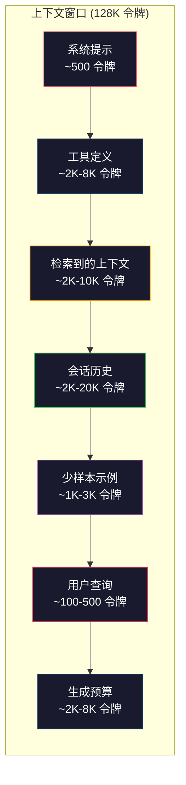
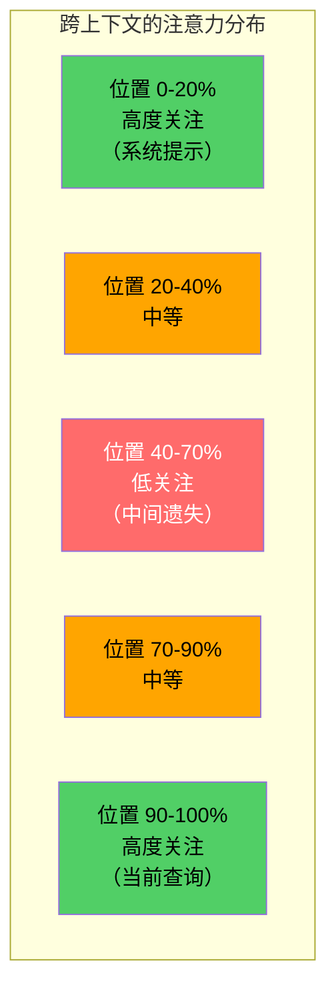
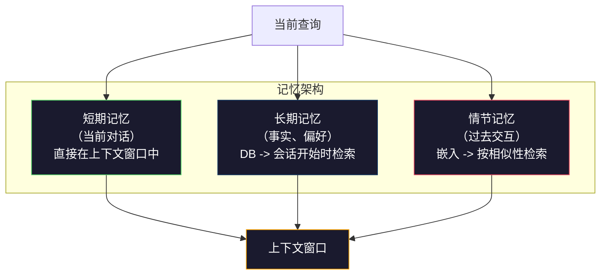

# 上下文工程：窗口、预算、记忆与检索

> 提示词工程是一个子集。上下文工程才是整个游戏。提示词是你输入的一段字符串。上下文是进入模型窗口的一切：系统指令、检索到的文档、工具定义、对话历史、少样本示例以及提示词本身。到 2026 年，最优秀的 AI 工程师是上下文工程师。他们决定哪些内容应当进入，哪些应当排除，以及以何种顺序放入。

**Type:** 构建  
**Languages:** Python  
**Prerequisites:** Phase 10（LLMs from Scratch）、Phase 11 课程 01-02  
**Time:** ~90 分钟  
**Related:** Phase 11 · 15 (Prompt Caching) — 缓存友好的布局是上下文工程的扩展。Phase 5 · 28 (Long-Context Evaluation) — 用于说明如何用 NIAH/RULER 测量“中间遗失”。

## 学习目标

- 计算跨所有上下文窗口组件的令牌预算（系统提示、工具、历史、检索文档、生成冗余）
- 实现上下文窗口管理策略：截断、摘要和对话历史的滑动窗口
- 优先排序并安排上下文组件的顺序，以最大化模型对最相关信息的注意力
- 构建一个上下文组装器，根据查询类型和可用窗口空间动态分配令牌

## 问题描述

Claude Opus 4.7 拥有 200K 令牌窗口（beta 为 1M）。GPT-5 有 400K。Gemini 3 Pro 有 2M。Llama 4 宣称 10M。这些数字听起来很大，直到你开始填满它们。

下面是一个面向代码助手的真实拆解。系统提示：500 令牌。50 个工具的工具定义：8,000 令牌。检索到的文档：4,000 令牌。对话历史（10 回合）：6,000 令牌。当前用户查询：200 令牌。生成预算（最大输出）：4,000 令牌。合计：22,700 令牌。对于 128K 的窗口，这仅占 18%。

但注意力并不会随上下文长度线性扩展。具有 128K 上下文的模型在计算注意力时存在二次成本（在原始 Transformer 中为 O(n^2)，尽管大多数生产模型使用高效注意力变体）。更重要的是，检索准确性会下降。“Needle in a Haystack”（干草堆里找针）测试表明，模型难以在长上下文的中间找到放置的信息。Liu 等人（2023）研究显示，LLM 在长上下文开头和结尾的检索准确率接近完美，但当相关信息放在中间（上下文的 40-70% 位置）时，准确率会下降 10-20%。这种“中间遗失”效应随模型差异而变化，但影响当前所有主流架构。

实践教训：可用 200K 令牌并不意味着使用 200K 令牌就有效。经过精心策划的 10K 令牌上下文常常胜过直接倾倒的 100K 令牌上下文。上下文工程的目标是最大化上下文窗口内的信噪比。

你放入窗口的每一个令牌都会取代可能承载更相关信息的令牌。每一个不相关的工具定义、每一个陈旧的对话回合、每一段并不能回答问题的检索文本——它们都会让模型在任务上表现略差一些。

## 概念

### 上下文窗口是稀缺资源

把上下文窗口想成 RAM，而不是磁盘。它快速且直接可访问，但有限。你不可能把一切都塞进去。你必须做选择。



每个组件都在争夺空间。增加更多工具定义会占用更多对话历史的空间。增加更多检索到的上下文会减少少样本示例的空间。上下文工程就是如何分配这个预算以最大化任务性能的艺术。

### 中间遗失（Lost-in-the-Middle）

这是上下文工程中最重要的经验性发现。模型对上下文开头和结尾的信息关注度更高。位于中间的信息得到的注意力分数较低，更容易被忽略。

Liu 等人（2023）进行了系统测试。他们在 20 个不相关文档中把一个相关文档放在不同位置并测量回答准确率。当相关文档在第一个或最后一个位置时，准确率为 85-90%；当它位于中间（20 个中的第 10 位）时，准确率降至 60-70%。

这对工程实践有直接影响：

- 把最重要的信息放在最前面（系统提示、关键指令）
- 把当前查询和最相关的上下文放在最后（时序偏好有帮助）
- 把上下文的中间当作最低优先级区域
- 如果必须在中间包含信息，请在末尾复写关键点（duplicate）



### 上下文组件

**System prompt（系统提示）**：设定角色、约束和行为规则。它放在最前面并跨回合保持不变。Claude Code 的系统提示（包括工具定义和行为指令）大约占用 6,000 令牌。保持简洁。系统提示中的每个词都会在每次 API 调用时重复发送。

**Tool definitions（工具定义）**：每个工具会增加 50-200 令牌（名称、描述、参数 schema）。50 个工具每个 150 令牌就是 7,500 令牌，这还是在对话开始前。动态工具选择——只包含与当前查询相关的工具——可以将这部分减少 60-80%。

**Retrieved context（检索到的上下文）**：来自向量数据库的文档、搜索结果、文件内容。检索质量直接决定回答质量。糟糕的检索比没有检索更糟——它会用噪声填满窗口并主动误导模型。

**Conversation history（对话历史）**：每一次用户消息和助手回复。随着对话长度线性增长。一个 50 回合的对话每回合 200 令牌就是 10,000 令牌的历史。大多数内容与当前查询无关。

**Few-shot examples（少样本示例）**：展示期望行为的输入/输出对。两到三个精心挑选的示例常常比数千令牌的指令更能提升输出质量。但它们也占用空间。

**Generation budget（生成预算）**：为模型的响应保留的令牌。如果把窗口填满，模型就没有回答空间。至少保留 2,000-4,000 令牌用于生成。

### 上下文压缩策略

**History summarization（历史摘要）**：不必把所有之前的回合逐字保留，周期性地对对话进行摘要。“我们讨论了 X，决定了 Y，用户想要 Z” 用 100 令牌替代了消耗 2,000 令牌的 10 个回合。当历史超过阈值（例如 5,000 令牌）时运行摘要。

**Relevance filtering（相关性过滤）**：根据当前查询为每个检索文档打分并丢弃低于阈值的文档。如果检索到 10 个片段但只有 3 个相关，就丢弃另外 7 个。3 个高度相关的片段比 10 个平庸的更有价值。

**Tool pruning（工具修剪）**：对用户查询意图进行分类，只包含与该意图相关的工具。代码类问题不需要日历工具；排期问题不需要文件系统工具。这可以把工具定义从 8,000 令牌降到 1,000。

**Recursive summarization（递归摘要）**：对于超长文档，分阶段摘要。先对每节进行摘要，再对摘要进行摘要。一本 50 页的文档可以压缩为 500 令牌的摘要，捕捉关键点。

### 记忆系统

上下文工程跨越三个时间视域。

**Short-term memory（短期记忆）**：当前对话。直接存放在上下文窗口中。随着每轮增长。通过摘要和截断进行管理。

**Long-term memory（长期记忆）**：跨会话持续的事实和偏好。“用户偏好 TypeScript”“项目使用 PostgreSQL”。存储在数据库中，在会话开始时检索。Claude Code 把这些存在 CLAUDE.md 文件中。ChatGPT 使用其记忆功能。

**Episodic memory（情节/事件记忆）**：可能相关的具体过往交互。“上周二我们在 auth 模块调试了类似的问题。”以嵌入形式存储，在当前会话与过去某个事件相似时检索。



### 动态上下文组装

关键洞见：不同的查询需要不同的上下文。静态的系统提示 + 静态工具 + 静态历史是浪费。最佳系统会针对每个查询动态组装上下文。

1. 对查询进行意图分类  
2. 选择相关工具（而不是全部工具）  
3. 检索相关文档（而不是固定集合）  
4. 包含相关的历史回合（而不是全部历史）  
5. 添加匹配任务类型的少样本示例  
6. 按重要性排序：关键的先放、重要的放在后、可选的放在中间

这就是优秀 AI 应用与普通应用的区别。模型是相同的，区别在于上下文。

## 实现

### 第 1 步：令牌计数器

如果你无法衡量，就无法预算。构建一个简单的令牌计数器（用空白符拆分做近似，因为精确计数依赖具体的 tokenizer）。

```python
import json
import numpy as np
from collections import OrderedDict

def count_tokens(text):
    if not text:
        return 0
    return int(len(text.split()) * 1.3)

def count_tokens_json(obj):
    return count_tokens(json.dumps(obj))
```

### 第 2 步：上下文预算管理器

核心抽象。预算管理器跟踪每个组件使用了多少令牌并强制执行限制。

```python
class ContextBudget:
    def __init__(self, max_tokens=128000, generation_reserve=4000):
        self.max_tokens = max_tokens
        self.generation_reserve = generation_reserve
        self.available = max_tokens - generation_reserve
        self.allocations = OrderedDict()

    def allocate(self, component, content, max_tokens=None):
        tokens = count_tokens(content)
        if max_tokens and tokens > max_tokens:
            words = content.split()
            target_words = int(max_tokens / 1.3)
            content = " ".join(words[:target_words])
            tokens = count_tokens(content)

        used = sum(self.allocations.values())
        if used + tokens > self.available:
            allowed = self.available - used
            if allowed <= 0:
                return None, 0
            words = content.split()
            target_words = int(allowed / 1.3)
            content = " ".join(words[:target_words])
            tokens = count_tokens(content)

        self.allocations[component] = tokens
        return content, tokens

    def remaining(self):
        used = sum(self.allocations.values())
        return self.available - used

    def utilization(self):
        used = sum(self.allocations.values())
        return used / self.max_tokens

    def report(self):
        total_used = sum(self.allocations.values())
        lines = []
        lines.append(f"Context Budget Report ({self.max_tokens:,} token window)")
        lines.append("-" * 50)
        for component, tokens in self.allocations.items():
            pct = tokens / self.max_tokens * 100
            bar = "#" * int(pct / 2)
            lines.append(f"  {component:<25} {tokens:>6} tokens ({pct:>5.1f}%) {bar}")
        lines.append("-" * 50)
        lines.append(f"  {'Used':<25} {total_used:>6} tokens ({total_used/self.max_tokens*100:.1f}%)")
        lines.append(f"  {'Generation reserve':<25} {self.generation_reserve:>6} tokens")
        lines.append(f"  {'Remaining':<25} {self.remaining():>6} tokens")
        return "\n".join(lines)
```

### 第 3 步：中间遗失重排序

实现重排序策略：最重要的项放在开头和结尾，最不重要的放在中间。

```python
def reorder_lost_in_middle(items, scores):
    paired = sorted(zip(scores, items), reverse=True)
    sorted_items = [item for _, item in paired]

    if len(sorted_items) <= 2:
        return sorted_items

    first_half = sorted_items[::2]
    second_half = sorted_items[1::2]
    second_half.reverse()

    return first_half + second_half

def score_relevance(query, documents):
    query_words = set(query.lower().split())
    scores = []
    for doc in documents:
        doc_words = set(doc.lower().split())
        if not query_words:
            scores.append(0.0)
            continue
        overlap = len(query_words & doc_words) / len(query_words)
        scores.append(round(overlap, 3))
    return scores
```

### 第 4 步：对话历史压缩器

对旧的对话回合进行摘要以回收令牌预算。

```python
class ConversationManager:
    def __init__(self, max_history_tokens=5000):
        self.turns = []
        self.summaries = []
        self.max_history_tokens = max_history_tokens

    def add_turn(self, role, content):
        self.turns.append({"role": role, "content": content})
        self._compress_if_needed()

    def _compress_if_needed(self):
        total = sum(count_tokens(t["content"]) for t in self.turns)
        if total <= self.max_history_tokens:
            return

        while total > self.max_history_tokens and len(self.turns) > 4:
            old_turns = self.turns[:2]
            summary = self._summarize_turns(old_turns)
            self.summaries.append(summary)
            self.turns = self.turns[2:]
            total = sum(count_tokens(t["content"]) for t in self.turns)

    def _summarize_turns(self, turns):
        parts = []
        for t in turns:
            content = t["content"]
            if len(content) > 100:
                content = content[:100] + "..."
            parts.append(f"{t['role']}: {content}")
        return "Previous: " + " | ".join(parts)

    def get_context(self):
        parts = []
        if self.summaries:
            parts.append("[Conversation Summary]")
            for s in self.summaries:
                parts.append(s)
        parts.append("[Recent Conversation]")
        for t in self.turns:
            parts.append(f"{t['role']}: {t['content']}")
        return "\n".join(parts)

    def token_count(self):
        return count_tokens(self.get_context())
```

### 第 5 步：动态工具选择器

只包含与当前查询相关的工具。先进行意图分类，然后过滤工具。

```python
TOOL_REGISTRY = {
    "read_file": {
        "description": "Read contents of a file",
        "tokens": 120,
        "categories": ["code", "files"],
    },
    "write_file": {
        "description": "Write content to a file",
        "tokens": 150,
        "categories": ["code", "files"],
    },
    "search_code": {
        "description": "Search for patterns in codebase",
        "tokens": 130,
        "categories": ["code"],
    },
    "run_command": {
        "description": "Execute a shell command",
        "tokens": 140,
        "categories": ["code", "system"],
    },
    "create_calendar_event": {
        "description": "Create a new calendar event",
        "tokens": 180,
        "categories": ["calendar"],
    },
    "list_emails": {
        "description": "List recent emails",
        "tokens": 160,
        "categories": ["email"],
    },
    "send_email": {
        "description": "Send an email message",
        "tokens": 200,
        "categories": ["email"],
    },
    "web_search": {
        "description": "Search the web for information",
        "tokens": 140,
        "categories": ["research"],
    },
    "query_database": {
        "description": "Run a SQL query on the database",
        "tokens": 170,
        "categories": ["code", "data"],
    },
    "generate_chart": {
        "description": "Generate a chart from data",
        "tokens": 190,
        "categories": ["data", "visualization"],
    },
}

def classify_intent(query):
    query_lower = query.lower()

    intent_keywords = {
        "code": ["code", "function", "bug", "error", "file", "implement", "refactor", "debug", "test"],
        "calendar": ["meeting", "schedule", "calendar", "appointment", "event"],
        "email": ["email", "mail", "send", "inbox", "message"],
        "research": ["search", "find", "what is", "how does", "explain", "look up"],
        "data": ["data", "query", "database", "chart", "graph", "analytics", "sql"],
    }

    scores = {}
    for intent, keywords in intent_keywords.items():
        score = sum(1 for kw in keywords if kw in query_lower)
        if score > 0:
            scores[intent] = score

    if not scores:
        return ["code"]

    max_score = max(scores.values())
    return [intent for intent, score in scores.items() if score >= max_score * 0.5]

def select_tools(query, token_budget=2000):
    intents = classify_intent(query)
    relevant = {}
    total_tokens = 0

    for name, tool in TOOL_REGISTRY.items():
        if any(cat in intents for cat in tool["categories"]):
            if total_tokens + tool["tokens"] <= token_budget:
                relevant[name] = tool
                total_tokens += tool["tokens"]

    return relevant, total_tokens
```

### 第 6 步：完整的上下文组装流水线

把所有部分连接起来。给定一个查询，动态组装最佳上下文。

```python
class ContextEngine:
    def __init__(self, max_tokens=128000, generation_reserve=4000):
        self.budget = ContextBudget(max_tokens, generation_reserve)
        self.conversation = ConversationManager(max_history_tokens=5000)
        self.system_prompt = (
            "You are a helpful AI assistant. You have access to tools for "
            "code editing, file management, web search, and data analysis. "
            "Use the appropriate tools for each task. Be concise and accurate."
        )
        self.knowledge_base = [
            "Python 3.12 introduced type parameter syntax for generic classes using bracket notation.",
            "The project uses PostgreSQL 16 with pgvector for embedding storage.",
            "Authentication is handled by Supabase Auth with JWT tokens.",
            "The frontend is built with Next.js 15 using the App Router.",
            "API rate limits are set to 100 requests per minute per user.",
            "The deployment pipeline uses GitHub Actions with Docker multi-stage builds.",
            "Test coverage must be above 80% for all new modules.",
            "The codebase follows the repository pattern for data access.",
        ]

    def assemble(self, query):
        self.budget = ContextBudget(self.budget.max_tokens, self.budget.generation_reserve)

        system_content, _ = self.budget.allocate("system_prompt", self.system_prompt, max_tokens=1000)

        tools, tool_tokens = select_tools(query, token_budget=2000)
        tool_text = json.dumps(list(tools.keys()))
        tool_content, _ = self.budget.allocate("tools", tool_text, max_tokens=2000)

        relevance = score_relevance(query, self.knowledge_base)
        threshold = 0.1
        relevant_docs = [
            doc for doc, score in zip(self.knowledge_base, relevance)
            if score >= threshold
        ]

        if relevant_docs:
            doc_scores = [s for s in relevance if s >= threshold]
            reordered = reorder_lost_in_middle(relevant_docs, doc_scores)
            doc_text = "\n".join(reordered)
            doc_content, _ = self.budget.allocate("retrieved_context", doc_text, max_tokens=3000)

        history_text = self.conversation.get_context()
        if history_text.strip():
            history_content, _ = self.budget.allocate("conversation_history", history_text, max_tokens=5000)

        query_content, _ = self.budget.allocate("user_query", query, max_tokens=500)

        return self.budget

    def chat(self, query):
        self.conversation.add_turn("user", query)
        budget = self.assemble(query)
        response = f"[Response to: {query[:50]}...]"
        self.conversation.add_turn("assistant", response)
        return budget


def run_demo():
    print("=" * 60)
    print("  Context Engineering Pipeline Demo")
    print("=" * 60)

    engine = ContextEngine(max_tokens=128000, generation_reserve=4000)

    print("\n--- Query 1: Code task ---")
    budget = engine.chat("Fix the bug in the authentication module where JWT tokens expire too early")
    print(budget.report())

    print("\n--- Query 2: Research task ---")
    budget = engine.chat("What is the best approach for implementing vector search in PostgreSQL?")
    print(budget.report())

    print("\n--- Query 3: After conversation history builds up ---")
    for i in range(8):
        engine.conversation.add_turn("user", f"Follow-up question number {i+1} about the implementation details of the system")
        engine.conversation.add_turn("assistant", f"Here is the response to follow-up {i+1} with technical details about the architecture")

    budget = engine.chat("Now implement the changes we discussed")
    print(budget.report())

    print("\n--- Tool Selection Examples ---")
    test_queries = [
        "Fix the bug in auth.py",
        "Schedule a meeting with the team for Tuesday",
        "Show me the database query performance stats",
        "Search for best practices on error handling",
    ]

    for q in test_queries:
        tools, tokens = select_tools(q)
        intents = classify_intent(q)
        print(f"\n  Query: {q}")
        print(f"  Intents: {intents}")
        print(f"  Tools: {list(tools.keys())} ({tokens} tokens)")

    print("\n--- Lost-in-the-Middle Reordering ---")
    docs = ["Doc A (most relevant)", "Doc B (somewhat relevant)", "Doc C (least relevant)",
            "Doc D (relevant)", "Doc E (moderately relevant)"]
    scores = [0.95, 0.60, 0.20, 0.80, 0.50]
    reordered = reorder_lost_in_middle(docs, scores)
    print(f"  Original order: {docs}")
    print(f"  Scores:         {scores}")
    print(f"  Reordered:      {reordered}")
    print(f"  (Most relevant at start and end, least relevant in middle)")
```

## 使用方法

### Claude Code 的上下文策略

Claude Code 使用分层方法管理上下文。系统提示包含行为规则和工具定义（约 6K 令牌）。当你打开文件时，其内容会注入为上下文。当你搜索时，结果会被加入。旧的对话回合会被摘要。CLAUDE.md 提供跨会话的长期记忆。

关键工程决策：Claude Code 不会把整个代码库都倾倒进上下文。它按需检索相关文件。这就是上下文工程的实践。

### Cursor 的动态上下文加载

Cursor 将整个代码库索引为嵌入。当你输入查询时，它使用向量相似性检索最相关的文件和代码片段。只有这些片段会进入上下文窗口。一个 50 万行的代码库被压缩为 5-10 个最相关的代码块。

模式是：把一切嵌入，按需检索，只包含重要内容。

### ChatGPT 的记忆

ChatGPT 将用户偏好和事实存为长期记忆。在每次会话开始时，相关记忆被检索并包含在系统提示中。“用户偏好 Python”成本约 5 令牌，但能节省跨会话重复指令的数百令牌。

### RAG 作为上下文工程

检索增强生成（RAG）是上下文工程的形式化表现。与其把知识塞进模型权重（训练）或系统提示（静态上下文），不如在查询时检索相关文档并注入上下文窗口。整个 RAG 流水线——切块、嵌入、检索、重排序——其存在的目的就是为一个问题服务：把正确的信息放入上下文窗口。

## 部署交付物

本课将产生 `outputs/prompt-context-optimizer.md` —— 一个可复用的提示词，用于审计上下文组装策略并推荐优化。向它提供你的系统提示、工具数量、平均历史长度和检索策略，它会识别令牌浪费并提出改进建议。

它还会产生 `outputs/skill-context-engineering.md` —— 基于任务类型、上下文窗口大小和延迟预算的上下文组装流水线设计决策框架。

## 练习

1. 为 ContextBudget 类添加一个“令牌浪费检测器”。它应标记使用超过 30% 预算的组件，并针对每种组件类型建议具体的压缩策略（摘要历史、修剪工具、重新排序文档）。
2. 实现检索上下文的语义去重。如果两个检索文档的相似度超过 80%（按词重叠或嵌入余弦相似度），只保留得分更高的那一个。衡量这能回收多少令牌预算。
3. 构建一个“上下文回放”工具。给定对话记录，把它通过 ContextEngine 回放并可视化预算分配随回合的变化。绘制每个组件随时间的令牌使用曲线。找出上下文开始被压缩的那一回合。
4. 实现基于优先级的工具选择器。不是二元的包含/排除，而是为每个工具分配一个与当前查询相关性的得分。按相关性降序包含工具，直到工具预算耗尽。比较包含 5、10、20、50 个工具时的任务性能。
5. 构建一个多策略上下文压缩器。实现三种压缩策略（截断、摘要、关键句抽取），并在 20 个文档集合上基准测试。衡量压缩率与信息保留之间的权衡（压缩后版本是否仍包含对查询的答案？）。

## 术语表

| Term | What people say | What it actually means |
|------|----------------|----------------------|
| Context window | "How much the model can read" | 模型在一次前向传递中处理的最大令牌数（输入 + 输出）——例如 GPT-5 为 400K，Claude Opus 4.7 为 200K（1M beta），Gemini 3 Pro 为 2M |
| Context engineering | "Advanced prompt engineering" | 决定什么进入上下文窗口、以何种顺序和优先级放置的学科——涵盖检索、压缩、工具选择和记忆管理 |
| Lost-in-the-middle | "Models forget stuff in the middle" | 经验发现：LLM 对上下文开头和结尾关注更高，将信息放在中间会带来约 10-20% 的准确率下降 |
| Token budget | "How many tokens you have left" | 在各个组件（系统提示、工具、历史、检索、生成）之间显式分配上下文窗口容量，并为每个组件设定上限 |
| Dynamic context | "Loading stuff on the fly" | 根据意图分类、相关工具选择和检索结果，为每个查询组装不同的上下文窗口 |
| History summarization | "Compressing the conversation" | 用简洁摘要替换逐字的历史回合，在减少令牌成本的同时保留关键信息 |
| Tool pruning | "Only including relevant tools" | 对查询意图分类，只包含匹配的工具，将工具令牌成本减少 60-80% |
| Long-term memory | "Remembering across sessions" | 存储在数据库中并在会话开始时检索的事实与偏好 —— 如 CLAUDE.md、ChatGPT Memory 等 |
| Episodic memory | "Remembering specific past events" | 以嵌入形式存储的过去交互，在当前查询与过去某次交互相似时检索 |
| Generation budget | "Room for the answer" | 为模型输出保留的令牌 —— 如果上下文填满窗口，模型将没有空间响应 |

## 延伸阅读

- [Liu et al., 2023 -- "Lost in the Middle: How Language Models Use Long Contexts"](https://arxiv.org/abs/2307.03172) -- 关于位置依赖注意力的权威研究，展示模型在长上下文中处理中间信息的困难  
- [Anthropic's Contextual Retrieval blog post](https://www.anthropic.com/news/contextual-retrieval) -- Anthropic 如何处理上下文感知的分块检索，减少检索失败 49%  
- [Simon Willison's "Context Engineering"](https://simonwillison.net/2025/Jun/27/context-engineering/) -- 将该学科命名并将其与提示词工程区分的博文  
- [LangChain documentation on RAG](https://python.langchain.com/docs/tutorials/rag/) -- 将检索增强生成作为上下文工程模式的实用实现  
- [Greg Kamradt's Needle in a Haystack test](https://github.com/gkamradt/LLMTest_NeedleInAHaystack) -- 揭示所有主流模型位置依赖检索失败的基准测试  
- [Pope et al., "Efficiently Scaling Transformer Inference" (2022)](https://arxiv.org/abs/2211.05102) -- 为什么上下文长度影响内存和延迟，以及 KV 缓存、MQA 和 GQA 如何改变预算计算  
- [Agrawal et al., "SARATHI: Efficient LLM Inference by Piggybacking Decodes with Chunked Prefills" (2023)](https://arxiv.org/abs/2308.16369) -- 说明两阶段推理为何使得长提示在 TTFT 中昂贵但在 TPOT 中便宜；揭示上下文打包权衡的真相  
- [Ainslie et al., "GQA: Training Generalized Multi-Query Transformer Models from Multi-Head Checkpoints" (EMNLP 2023)](https://arxiv.org/abs/2305.13245) -- 分组查询注意力论文，显示在生产解码器中将 KV 内存减少 8× 而不损失质量