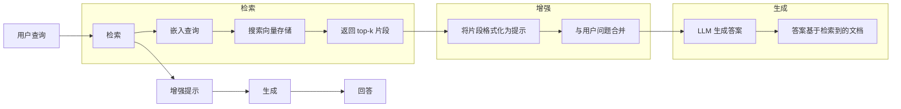
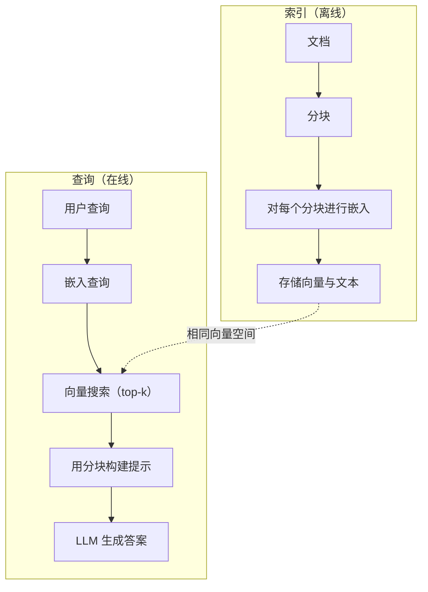

# RAG (Retrieval-Augmented Generation)

> 你的 LLM 知识截止到训练时间点。它不知道你公司的文档、代码库或上周的会议记录。RAG 通过检索相关文档并将它们塞入提示词来解决这个问题。这是生产环境中部署率最高的模式。如果你从本课程中只做一件事，就构建一个 RAG 流水线。

**Type:** 构建  
**Languages:** Python  
**Prerequisites:** Phase 10 (LLMs from Scratch)、Phase 11 Lessons 01-05  
**Time:** ~90 分钟  
**Related:** Phase 5 · 23（Chunking Strategies for RAG），讲六种分块算法及其适用场景。Phase 5 · 22（Embedding Models Deep Dive），用于选择嵌入模型。Phase 11 · 07（Advanced RAG），涵盖混合搜索、重排序和查询转换。

## 学习目标

- 构建一个完整的 RAG 流水线：文档加载、分块、嵌入、向量存储、检索与生成  
- 使用向量数据库（ChromaDB、FAISS 或 Pinecone）并实现正确索引，来实现语义检索  
- 解释为何在知识落地应用中 RAG 通常优于微调（成本、新鲜度、可审计性）  
- 使用检索指标（精确率、召回率）和生成指标（忠实度、相关性）评估 RAG 质量

## 问题背景

你为公司构建一个聊天机器人。客户问：“企业套餐的退款政策是什么？”LLM 回答了一个关于典型 SaaS 退款政策的通用答案。真实政策藏在 200 页的内部 wiki 中，规定企业客户有 60 天的窗口并按比例退款。LLM 从未见过这份文档，因此无法知道这些信息。

微调是一种解决办法：拿模型，用内部文档继续训练并部署更新后的模型。这能奏效，但有严重问题。微调需要成千上万美元的计算成本。文档一旦变更模型就会过时。你无法确定模型引用了哪些来源。如果公司下个月并购了另一个产品线，你又得重新微调。

RAG 是另一种解决办法。保持模型不变。当有问题时，在文档存储中检索相关片段，把它们粘贴到用户问题之前，让模型在这些片段的上下文中作答。文档存储可以在几分钟内更新。你可以确切看到检索到哪些文档。模型本身从未改变。这就是为什么 RAG 在生产环境中占主导地位：它更便宜、更及时、更可审计，并且适用于任何 LLM。

## 概念

### RAG 模式

整个模式包含四个步骤：



查询 -> 检索 -> 扩展提示 -> 生成。每个 RAG 系统都遵循这个模式。生产环境中 RAG 系统的差异体现在每一步的细节：如何分块、如何嵌入、如何搜索以及如何构造提示词。

### 为何 RAG 胜过微调

| 关注点 | 微调 | RAG |
|--------|------|-----|
| 成本 | 每次训练运行 $1,000-$100,000+ | 每次查询 $0.01-$0.10（嵌入 + LLM） |
| 新鲜度 | 必须重新训练才能更新，容易过时 | 通过重新索引文档可在几分钟内更新 |
| 可审计性 | 无法追溯答案来源 | 可展示确切检索到的片段 |
| 幻觉（Hallucination） | 仍可能自由幻觉 | 以检索到的文档为依据，减少幻觉 |
| 数据隐私 | 训练数据被写入权重 | 文档保留在你的向量存储中 |

微调永久改变模型权重。RAG 只在上下文中临时改变模型可见的信息。对于大多数应用，临时上下文就是你所需要的。

微调唯一胜出的场景：当你需要模型采用特定风格、语气或推理模式，而仅通过提示无法实现时。对于事实性知识检索，RAG 每次都占优。

### 嵌入模型

嵌入模型将文本转换为稠密向量。相似文本在高维空间中会产生相近的向量。"How do I reset my password?" 和 "I need to change my password" 尽管共词少，但会产生几乎相同的向量。"The cat sat on the mat" 则会产生非常不同的向量。

常见嵌入模型（2026 年阵容 — 详见 Phase 5 · 22）：

| Model | Dimensions | Provider | Notes |
|-------|-----------|----------|-------|
| text-embedding-3-small | 1536 (Matryoshka) | OpenAI | 对多数用例具有最佳性价比 |
| text-embedding-3-large | 3072 (Matryoshka) | OpenAI | 更高精度，可截断为 256/512/1024 |
| Gemini Embedding 2 | 3072 (Matryoshka) | Google | Top MTEB 检索；支持 8K 上下文 |
| voyage-4 | 1024/2048 (Matryoshka) | Voyage AI | 有领域变体（代码、金融、法律） |
| Cohere embed-v4 | 1024 (Matryoshka) | Cohere | 强大的多语言支持，128K 上下文 |
| BGE-M3 | 1024 (dense + sparse + ColBERT) | BAAI (开源权重) | 单模型的三种视角 |
| Qwen3-Embedding | 4096 (Matryoshka) | Alibaba (开源权重) | 开源权重中检索表现顶级 |
| all-MiniLM-L6-v2 | 384 | 开源（Sentence Transformers） | 原型验证的基线模型 |

本课中，我们用 TF-IDF 构建一个简单嵌入。并非生产系统普遍采用 TF-IDF，而是为了把概念具体化：文本输入，向量输出，相似文本产生相似向量。

### 向量相似度

给定两个向量，如何衡量相似度？三种常用方法：

Cosine similarity：向量夹角的余弦值。范围从 -1（相反）到 1（相同）。忽略幅值，只关心方向。RAG 默认使用此方法。

```
cosine_sim(a, b) = dot(a, b) / (||a|| * ||b||)
```

Dot product：原始内积。向量幅值大的会得到更高分。适用于幅值携带信息的场景（更长文档可能更相关）。

```
dot(a, b) = sum(a_i * b_i)
```

L2 (Euclidean) distance：向量空间中的欧氏距离。距离越小越相似。对幅值差异敏感。

```
L2(a, b) = sqrt(sum((a_i - b_i)^2))
```

Cosine similarity 是标准做法。它能优雅地处理不同长度的文档，因为它按幅值归一化。当人们说“向量检索”时，通常指的就是余弦相似度。

### 分块策略

文档通常太长，不能作为单个向量嵌入。一本 50 页的 PDF 可能涵盖数十个话题，导致糟糕的嵌入。相反，你要将文档拆成多个分块（chunk），分别嵌入。

固定大小分块：每 N 个 token 切分一次。简单且可预测。512-token 的分块配合 50-token 重叠，意味着分块 1 为 token 0-511，分块 2 为 462-973，依此类推。重叠可以避免在不合适的位置拆句。

语义分块：在自然边界处切分。段落、章节或 Markdown 标题。每个分块是一个连贯的意义单元。实现更复杂，但检索效果更好。

递归分块：先在最大的边界处切分（章节标题）。如果一个章节仍然太大，则在段落边界处切分；若段落仍然过大，则在句子边界处切分。这是 LangChain 的 RecursiveCharacterTextSplitter 方法，在实践中表现良好。

分块大小比很多人想象的更重要：

- 太小（64-128 tokens）：每个分块上下文不足。“It increased 15% last quarter” 在不知道“it”指什么时毫无意义。  
- 太大（2048+ tokens）：每个分块涵盖多个话题，相关性被稀释。你搜营收数据，却得到一个 10% 涉及营收、90% 讨论员工人数的分块。  
- 合适区间（256-512 tokens）：足够的上下文使分块自成一体，并且足够集中以保持相关性。

大多数生产 RAG 系统使用 256-512 token 的分块，配合 50 token 的重叠。Anthropic 的 RAG 指南也建议这个区间。

### 向量数据库

有了嵌入之后，你需要存储并搜索它们。选项包括：

| Database | Type | 适用场景 |
|----------|------|----------|
| FAISS | 库（进程内） | 原型、小到中等数据集 |
| Chroma | 轻量级 DB | 本地开发、小规模部署 |
| Pinecone | 托管服务 | 无运维的生产环境 |
| Weaviate | 开源 DB | 自托管生产 |
| pgvector | Postgres 扩展 | 已在使用 Postgres 时 |
| Qdrant | 开源 DB | 高性能自托管 |

本课中，我们构建一个简单的内存向量存储。它把向量保存在列表中，并做暴力的余弦相似度搜索。这等同于 FAISS 的 flat 索引。它可以扩展到大约 100k 向量，之后会变慢。生产系统使用近似最近邻（ANN）算法（如 HNSW）在毫秒级搜索数百万向量。

### 完整流水线



索引阶段对每个文档运行一次（或在文档更新时运行）。查询阶段在每个用户请求时运行。在生产环境，索引可能需要数小时处理数百万份文档。查询必须在一秒内响应。

### 真实参数

大多数生产 RAG 系统使用如下参数：

- k = 每次检索 5 到 10 个分块  
- 分块大小 = 256 到 512 tokens，配 50-token 重叠  
- 上下文预算：每次查询检索内容 2,500-5,000 tokens  
- 总提示长度：约 8,000-16,000 tokens（系统提示 + 检索到的分块 + 会话历史 + 用户查询）  
- 嵌入维度：384-3072，视模型而定  
- 索引吞吐量：使用 API 嵌入时 100-1,000 文档/秒  
- 查询延迟：检索 50-200ms，生成 500-3000ms

```figure
rag-chunking
```

## 实现

### 第 1 步：文档分块

```python
def chunk_text(text, chunk_size=200, overlap=50):
    words = text.split()
    chunks = []
    start = 0
    while start < len(words):
        end = start + chunk_size
        chunk = " ".join(words[start:end])
        chunks.append(chunk)
        start += chunk_size - overlap
    return chunks
```

### 第 2 步：TF-IDF 嵌入

我们构建一个简单的嵌入函数。TF-IDF（词频-逆文档频率）并非神经嵌入，但它能把文本转换为向量并体现词的重要性。词在文档中出现频率高 TF 值高，而在语料中少见的词 IDF 值高。两者相乘能得到一个向量，使得在语料中具有区分性的词获得较高权重。

```python
import math
from collections import Counter

def build_vocabulary(documents):
    vocab = set()
    for doc in documents:
        vocab.update(doc.lower().split())
    return sorted(vocab)

def compute_tf(text, vocab):
    words = text.lower().split()
    count = Counter(words)
    total = len(words)
    return [count.get(word, 0) / total for word in vocab]

def compute_idf(documents, vocab):
    n = len(documents)
    idf = []
    for word in vocab:
        doc_count = sum(1 for doc in documents if word in doc.lower().split())
        idf.append(math.log((n + 1) / (doc_count + 1)) + 1)
    return idf

def tfidf_embed(text, vocab, idf):
    tf = compute_tf(text, vocab)
    return [t * i for t, i in zip(tf, idf)]
```

### 第 3 步：余弦相似度搜索

```python
def cosine_similarity(a, b):
    dot = sum(x * y for x, y in zip(a, b))
    norm_a = math.sqrt(sum(x * x for x in a))
    norm_b = math.sqrt(sum(x * x for x in b))
    if norm_a == 0 or norm_b == 0:
        return 0.0
    return dot / (norm_a * norm_b)

def search(query_embedding, stored_embeddings, top_k=5):
    scores = []
    for i, emb in enumerate(stored_embeddings):
        sim = cosine_similarity(query_embedding, emb)
        scores.append((i, sim))
    scores.sort(key=lambda x: x[1], reverse=True)
    return scores[:top_k]
```

### 第 4 步：提示词构建

这就是 RAG 中“增强”部分的核心。将检索到的分块格式化到提示中，并让 LLM 基于这些上下文来回答问题。

```python
def build_rag_prompt(query, retrieved_chunks):
    context = "\n\n---\n\n".join(
        f"[Source {i+1}]\n{chunk}"
        for i, chunk in enumerate(retrieved_chunks)
    )
    return f"""Answer the question based ONLY on the following context.
If the context doesn't contain enough information, say "I don't have enough information to answer that."

Context:
{context}

Question: {query}

Answer:"""
```

（注意：上面代码块内的字符串为示例提示词，实际使用时可按需本地化或调整。）

### 第 5 步：完整 RAG 流水线

```python
class RAGPipeline:
    def __init__(self):
        self.chunks = []
        self.embeddings = []
        self.vocab = []
        self.idf = []

    def index(self, documents):
        all_chunks = []
        for doc in documents:
            all_chunks.extend(chunk_text(doc))
        self.chunks = all_chunks
        self.vocab = build_vocabulary(all_chunks)
        self.idf = compute_idf(all_chunks, self.vocab)
        self.embeddings = [
            tfidf_embed(chunk, self.vocab, self.idf)
            for chunk in all_chunks
        ]

    def query(self, question, top_k=5):
        query_emb = tfidf_embed(question, self.vocab, self.idf)
        results = search(query_emb, self.embeddings, top_k)
        retrieved = [(self.chunks[i], score) for i, score in results]
        prompt = build_rag_prompt(
            question, [chunk for chunk, _ in retrieved]
        )
        return prompt, retrieved
```

### 第 6 步：生成（仿真）

在生产中，这一步是调用 LLM API。本课中我们通过从检索到的上下文中抽取与查询词重叠最多的句子来模拟生成。

```python
def simple_generate(prompt, retrieved_chunks):
    query_words = set(prompt.lower().split("question:")[-1].split())
    best_sentence = ""
    best_score = 0
    for chunk in retrieved_chunks:
        for sentence in chunk.split("."):
            sentence = sentence.strip()
            if not sentence:
                continue
            words = set(sentence.lower().split())
            overlap = len(query_words & words)
            if overlap > best_score:
                best_score = overlap
                best_sentence = sentence
    return best_sentence if best_sentence else "I don't have enough information."
```

## 使用示例

使用真实嵌入模型与 LLM 时，代码几乎不变：

```python
from openai import OpenAI

client = OpenAI()

def embed(text):
    response = client.embeddings.create(
        model="text-embedding-3-small",
        input=text
    )
    return response.data[0].embedding

def generate(prompt):
    response = client.chat.completions.create(
        model="gpt-4o-mini",
        messages=[{"role": "user", "content": prompt}],
        temperature=0
    )
    return response.choices[0].message.content
```

或者使用 Anthropic：

```python
import anthropic

client = anthropic.Anthropic()

def generate(prompt):
    response = client.messages.create(
        model="claude-sonnet-4-20250514",
        max_tokens=1024,
        messages=[{"role": "user", "content": prompt}]
    )
    return response.content[0].text
```

流水线是相同的：替换嵌入函数，替换生成函数。检索逻辑、分块、提示构造——不论使用哪个模型都相同。

在规模化存储向量时，将暴力搜索替换为合适的向量数据库：

```python
import chromadb

client = chromadb.Client()
collection = client.create_collection("my_docs")

collection.add(
    documents=chunks,
    ids=[f"chunk_{i}" for i in range(len(chunks))]
)

results = collection.query(
    query_texts=["What is the refund policy?"],
    n_results=5
)
```

Chroma 会内部处理嵌入（默认使用 all-MiniLM-L6-v2）并在本地数据库中存储向量。模式相同，仅 plumbing 不同。

## 上线产出

本课将产出：
- `outputs/prompt-rag-architect.md` — 一个用于为特定用例设计 RAG 系统的提示词  
- `outputs/skill-rag-pipeline.md` — 教授 agent 如何构建和调试 RAG 流水线的技能文档

## 练习

1. 用简单的词袋法替换 TF-IDF 嵌入（二元表示：词存在为 1，不存在为 0）。在示例文档上比较检索质量。TF-IDF 应当优于词袋法，因为它对稀有词加权更高。  
2. 试验不同分块大小：在相同文档集上尝试 50、100、200、500 词。对每个大小用同样的 5 个查询并统计在 top-3 中返回相关分块的次数。找出检索质量达到峰值的分块大小。  
3. 给每个分块添加元数据（来源文档名、分块位置）。修改提示词模板以包含来源归属，使 LLM 能引用其来源。  
4. 实现一个简单评估：给定 10 对问答对，对每个问题运行 RAG 流水线，测量在检索到的分块中包含答案的比例。这即是 top-k 的检索召回率。  
5. 构建一个会话感知的 RAG 流水线：维护最近 3 次交互的历史，并将它们与检索到的分块一并包含在提示中。测试后续问题（例如在问了定价后接着问 “企业版呢？”）。

## 术语表

| 术语 | 常见说法 | 实际含义 |
|------|--------|---------|
| RAG | “让 AI 阅读你的文档” | 检索相关文档，将它们粘贴到提示中，并生成基于这些文档的答案 |
| Embedding | “把文本变成数字” | 文本的稠密向量表示，相似含义对应相似向量 |
| Vector database | “AI 的搜索引擎” | 一个优化用于存储向量并按相似度查找最近邻的存储系统 |
| Chunking | “把文档拆开” | 将文档分解为较小片段（通常 256-512 tokens），使每个片段可以独立嵌入与检索 |
| Cosine similarity | “两个向量有多相似” | 两个向量夹角的余弦；1 = 方向相同，0 = 正交，-1 = 方向相反 |
| Top-k retrieval | “取前 k 个匹配” | 返回向量存储中与查询最相似的 k 个分块 |
| Context window | “LLM 能看到多少文本” | LLM 在单次请求中可处理的最大 token 数；检索到的分块必须能装进这个窗口 |
| Augmented generation | “用给定上下文来回答” | 使用检索到的文档作为上下文生成响应，而不是仅依赖训练好的知识 |
| TF-IDF | “词重要性评分” | 词频（TF）乘以逆文档频率（IDF）；按词在语料中是否具区分性来加权 |
| Indexing | “为搜索准备文档” | 离线执行的分块、嵌入与存储过程，以便在查询时检索 |

## 深入阅读

- Lewis 等人，《Retrieval-Augmented Generation for Knowledge-Intensive NLP Tasks》（2020）— Facebook AI Research 提出的 RAG 原始论文，正式化了检索-生成模式  
- Anthropic 的 RAG 文档（docs.anthropic.com）— 关于分块大小、提示构造与评估的实用指南  
- Pinecone Learning Center，《What is RAG?》— 清晰的 RAG 流水线可视化解释与生产考量  
- Sentence-BERT: Reimers & Gurevych（2019）— all-MiniLM 嵌入模型背后的论文，展示如何训练双编码器用于语义相似度  
- [Karpukhin 等人，《Dense Passage Retrieval for Open-Domain Question Answering》（EMNLP 2020）](https://arxiv.org/abs/2004.04906) — DPR 论文，证明了稠密双编码器检索在开放域 QA 中优于 BM25，并为现代 RAG 检索器奠定了模式。  
- [LlamaIndex High-Level Concepts](https://docs.llamaindex.ai/en/stable/getting_started/concepts.html) — 构建 RAG 流水线时需要了解的核心概念：数据加载器、节点解析器、索引、检索器、响应合成器。  
- [LangChain RAG tutorial](https://python.langchain.com/docs/tutorials/rag/) — 另一种风格的编排器；以 chain-of-runnables 的视角展示相同的检索-生成模式。