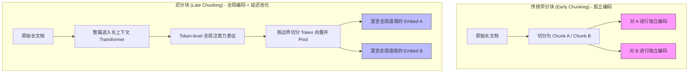
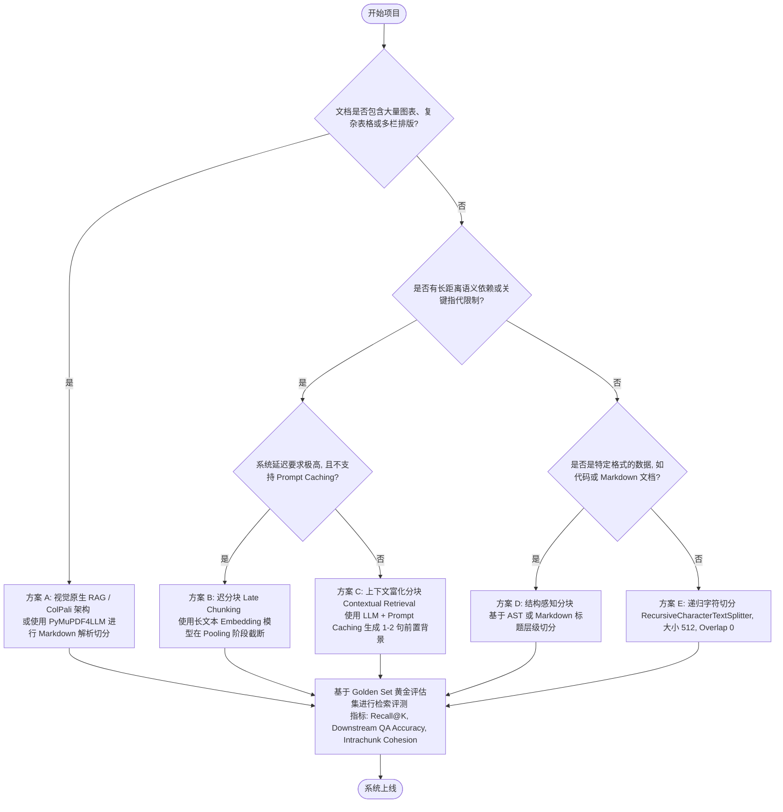

# RAG 分块（Chunking）技术演进与 2026 最佳实践指南

在 RAG（检索增强生成）系统的构建中，开发者常将注意力集中在选择大模型（LLM）或向量模型（Embedding）上。然而，随着大模型应用走向深水区，业界达成了一项核心共识：**数据清洗与分块（Chunking）策略决定了检索质量的下限，直接贡献了 RAG 系统 60% - 70% 的检索召回效果。**

本篇文档旨在全面梳理 RAG Chunking 的技术演进脉络，拆解 2026 年的核心前沿技术（如 Late Chunking、Contextual Retrieval、Vision-Native RAG），并提供一套面向生产环境的工程选型与落地最佳实践。

---

## 1. 为什么 Chunking 是 RAG 系统的“第一生命线”

在将非结构化文档导入向量数据库时，我们必须将长文本切分成离散的“块（Chunks）”。分块的质量直接决定了下游生成的效果，其核心痛点在于**信息粒度（Granularity）的权衡**：

*   **信息碎片化（Context Fragmentation / Context Cliff）**：分块过小会导致核心语境丢失。例如，一条关于退款的规则：“*除非商品在运输过程中受损，否则促销商品一律不予退款。*” 如果分块时将前置条件与结论切分到了两个块中，检索器可能仅检索到“促销商品一律不予退款”或“运输受损退款”，导致 LLM 生成完全错误的判定结果。
*   **检索噪音（Retrieval Noise）**：分块过大（如整页甚至整章）会导致向量嵌入的语义被稀释，引入大量无关的背景噪音，不仅增加 LLM 提示词的 token 成本和推理延迟，还会引发 LLM 在长上下文中迷失（Lost in the Middle）的问题。

因此，Chunking 的本质是在**检索精确度（Precision）**与**上下文完整度（Recall/Context）**之间寻找一条动态的平衡曲线。

---

## 2. RAG Chunking 技术演进历程

从 2020 年 RAG 概念诞生至今，分块技术经历了三个显著的发展阶段：

```
[2020-2022] 第一代：静态规则切分 ───► [2023-2024] 第二代：语义与层级聚合 ───► [2025-2026] 第三代：视觉原生与迟分块
```

### 第一代：静态与规则分块（2020 - 2022）—— “暴力硬切”

这一时期的分块手段高度依赖硬性规则和正则表达式，是 RAG 早期的妥协产物。

1.  **字符/Token 计数切分（Character/Token-based Splitting）**：
    *   **机制**：设定固定的字符或 Token 长度（如 512 tokens），并辅以一定比例的滑动窗口（Overlap，如 10%）。
    *   **缺点**：完全忽略人类语言的语法结构，经常在句子、甚至单词或公式中间强行切断，造成严重的语义破损。
2.  **基于分隔符的递归切分（Recursive Character Splitting）**：
    *   **机制**：根据预定义的分隔符优先级列表（通常为 `\n\n` [段落] -> `\n` [换行] -> ` ` [空格] -> `""` [字符]）递归地尝试切分文本，直到每个块的长度小于设定阈值。
    *   **代表工具**：LangChain 中的 `RecursiveCharacterTextSplitter`。
    *   **缺点**：虽然在一定程度上保护了段落和句子的结构完整性，但依然缺乏语义层面的感知，在处理表格、代码块以及排版复杂的文档时表现极不稳定。
3.  **结构感知切分（Structure-Aware Splitting）**：
    *   **机制**：利用 Markdown、HTML 或代码（AST，抽象语法树）的语法树结构，沿着标题标记（如 `#`, `##`）、表格标签（`<table>`）或类/函数定义边界进行切分，保护逻辑单元的独立性。

> [!NOTE]
> **2026 年工程避坑提示：重叠度（Overlap）的退场**
> 过去几年中，业界习惯将 10%~20% 的 overlap 作为固定配置。然而，在 2026 年针对现代 Reranker（如 BGE-Reranker-v2, Cohere Rerank v3）的系统性评测中表明：**在包含重排器和长上下文窗口的现代化 RAG 系统中，Overlap 对检索指标（Recall@K）的贡献微乎其微，反而平白增加了 10%~20% 的向量存储和计算成本**。在绝大多数生产场景中，建议默认将 overlap 设为 0，转而使用语义更连贯的切分技术。

---

### 第二代：语义与层级分块（2023 - 2024）—— “动态聚合”

随着 Embedding 技术的普及，开发者开始尝试使用“向量距离”来动态决定分块边界，摆脱硬性字数限制。

1.  **语义相似度分块（Semantic Chunking）**：
    *   **机制**：将文档初步拆分为单句，使用 Embedding 模型计算相邻句子之间的余弦相似度。当相邻句子的相似度低于预设阈值（或相似度变化的梯度曲线出现局部极小值点）时，判定为“主题切换”，在此处实施切分。
    *   **效果**：确保了每个块内部的主题高度凝聚，能够天然适应段落长短不一的自然语言文档。
2.  **父子分块（Parent-Child / Small-to-Big Chunking）**：
    *   **机制**：在向量库中索引较小、语义极其聚焦的“子块”（如 100-200 tokens），以实现高精度的向量相似度匹配；但在检索命中后，通过 Key-Value 关联，实际喂给 LLM 的是子块关联的更大“父块”（如 1024 tokens）或子块周边的上下文窗口。
    *   **效果**：完美平衡了“检索匹配的高精度”与“大模型生成阶段所需的充沛上下文”。
3.  **递归摘要树检索（RAPTOR - Recursive Abstractive Processing for Tree-Organized Retrieval）**：
    *   **机制**：对底层文本块进行聚类，利用 LLM 对每个聚类生成高层摘要，并递归重复此过程，构建一棵自底向上的“摘要树”。检索时，可以同时检索底层细节块和高层摘要块。
    *   **效果**：突破了传统 RAG 只能检索孤立碎片的限制，显著提升了针对“全书主旨是什么？”、“两家公司财务状况对比”等宏观/多跳（Multi-hop）问题的回答质量。

---

### 第三代：迟绑定、视觉原生与上下文富化（2025 - 2026）—— “端到端语境保持”

进入 2026 年，RAG 分块技术迎来了革命性的突破。其核心目标是解决**“单兵作战（孤立分块导致的语义断尾）”**与**“非结构化视觉信息流失（OCR 造成的排版破坏）”**。

#### 1. 迟分块（Late Chunking / Late Interaction Splitting）

传统的“早分块”是在文本送入 Embedding 模型前进行切分，这导致每个块在生成向量时完全无法感知文档其他部分的信息，造成语义孤岛。

*   **技术机制**：
    1.  **全局编码**：不作任何物理切分，将整篇长文档（或长达数千/数万 Token 的大段落）完整送入长上下文 Embedding 模型（如 Gemini Embedding v2 或 BGE-M3 等支持 8k+ 窗口的模型）。
    2.  **注意力保留**：模型在 Transformer 编码器中运行，通过自注意力（Self-Attention）机制生成整篇文档所有 Token 的表征向量。此时，**每个 Token 的向量中已经融入了整篇文档的全局语境**。
    3.  **迟池化切分**：在模型输出层，按照常规的边界对 Token 序列进行分块，然后对各个分块内的 Token 向量进行池化（如 Mean Pooling），输出每个 Chunk 的最终 Embedding。



*   **优势**：无需额外的 LLM API 开销，仅靠 Embedding 阶段的 Pooling 顺序调整，便能彻底消除边界截断带来的语义遗失。

#### 2. 上下文富化检索（Contextual Retrieval）

由 Anthropic 提出，旨在通过生成式背景信息让每个 Chunk 哪怕在完全孤立的状态下也具备自解释性。

*   **技术机制**：
    1.  **上下文提炼**：对于文档中的每一个原始 Chunk，通过 LLM 对“整篇文档 + 当前 Chunk”进行分析。
    2.  **背景拼接**：利用 LLM 自动生成 1-2 句的背景前置说明（Contextual Summary），拼接在 Chunk 的最前端。
    3.  **编码入库**：将富化后的文本送入 Embedding 和 BM25 索引。
*   **具体示例**：
    *   *原始分块*：“其资本支出同比增长了 24%，达到了 120 亿美元。”（检索该句时，极易因缺乏主体和时间信息而匹配失败）
    *   *富化后分块*：“`[文档背景：Alphabet 2025 年第三季度财报；章节：谷歌云业务与资本开支]` 其资本支出同比增长了 24%，达到了 120 亿美元。”
*   **降本利器：提示词缓存（Prompt Caching）**：
    处理一个文档的几百个分块需要重复输入整篇文档，这在过去是无法承受的成本。2026 年，几乎所有主流大模型 API 都原生支持了 Prompt Caching。处理第一个 Chunk 时缓存整篇文档，后续 Chunks 仅需支付极低的缓存命中（Cache Read）费用，使生成总成本降低了 90% 以上，具备了大规模生产落地可行性。
*   **效果**：结合向量检索、BM25 和 Reranker，将检索失败率（Recall 缺失）大幅降低了 67%。

#### 3. 视觉原生 RAG（Vision-Native RAG / ColPali 架构）

传统的 PDF 解析依赖于“PDF -> OCR -> 提取文本 -> 过滤噪音 -> 分块 -> 向量化”这一极其脆弱的流水线，极易在表格、跨行排版、插图和公式处崩溃。

*   **技术机制**：
    *   **免去传统分块（OCR-free）**：不作任何文本提取。利用类似 **ColPali (ColQwen2.5 / ColSmol)** 等视觉多模态语言模型，直接将 PDF 的**“整页图像”**作为基本分块单元。
    *   **多向量延迟交互（Multi-vector Late Interaction）**：模型将一页图像编码为数百个特征补丁（Patch Embeddings）向量。检索时，并不对单向量进行 Top-K 搜索，而是利用 MaxSim 算子直接计算查询词 Token 向量与页面图像所有 Patch 向量的最佳交互匹配度。
*   **效果**：完美保留了文档中的复杂表格、排版格式、字体大小、流程图、插图等所有视觉特征，实现了真正意义上的“所见即所检”。

---

## 3. 2026 年 RAG Chunking 最佳实践与选型指南

在 2026 年，没有一种“万能”的分块算法。生产环境的最佳实践是**“根据文档的模态、排版结构和计算预算，针对性地匹配分块策略”**。

### 维度选型决策矩阵

| 文档类型 | 推荐分块策略 | 核心实施方案 | 备选方案 |
| :--- | :--- | :--- | :--- |
| **标准规章、法律合同、政策白皮书** | **上下文富化分块（Contextual Retrieval）** | 利用大模型结合 Prompt Caching 自动为每一条规则/条款生成背景摘要前置拼接。 | 迟分块（Late Chunking） |
| **金融财报、多栏排版 PDF、学术论文（带图表）** | **视觉原生 RAG (ColPali 系列) 或 布局感知切分** | 将 PDF 页面渲染为图片，直接通过视觉多模态进行整页索引；或使用布局分析工具（如 PyMuPDF4LLM、Marker）提取为包含 Markdown 表格的文本后，按表格边界物理切分。 | Markdown 格式化解析 + 父子分块 |
| **通用知识 Wiki、百科、新闻报道** | **递归字符切分（Sane Default）** | 使用递归字符切分作为 baseline，大小设为 512 tokens，Overlap 设为 0。 | 语义分块（Semantic Chunking） |
| **软件代码库** | **AST（抽象语法树）解析分块** | 使用 Tree-sitter 等工具按类、函数、模块物理切分，并在块头部自动拼接当前文件路径、类名及依赖上下文。 | 递归字符切分（按行/括号） |
| **跨章节宏观综述文档** | **层级树状分块 (RAPTOR)** | 递归生成相邻段落的摘要并建树，支持跨层级（细节/摘要）联合检索。 | 全文检索 + LLM 长上下文直读 |

---

## 4. 2026 年 RAG 分块工程实施流程（Decision Flow）

在实际工程落地中，你可以参考以下决策路径来确定分块方案：



---

## 5. 总结与未来前瞻

1.  **“无分块（Chunkless RAG）”是伪命题**：虽然 Gemini 1.5 Pro 等长上下文模型（2M+ 窗口）使得直接把整本书塞给大模型成为可能，但在高并发生产环境中，**出于推理成本、响应延迟（Time-To-First-Token）、精准引用归因（Attribution）和检索去噪的考量，智能分块依然是生产级 RAG 系统的必修课。**
2.  **Embedding 与 Chunking 的深度绑定**：迟分块（Late Chunking）等技术打破了“文本处理归文本，向量编码归向量”的界限。未来，分块策略将越来越多地由 Embedding 模型在推理过程中原生处理。
3.  **多模态端到端化**：视觉原生 RAG (ColPali 架构) 正在快速淘汰传统的“OCR + 文本清洗 + 分块”链路，预计在处理 PPT、图表财报等高含图量企业文档中将成为绝对主流。

---
*本文档为 [06-rag](file:///Users/shmihanzhongqing/Workspace/ai-engineering-from-scratch/phases/11-llm-engineering/06-rag) 课程的进阶知识补充，用于指导构建生产级高鲁棒性检索增强生成系统。*
