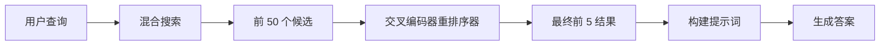
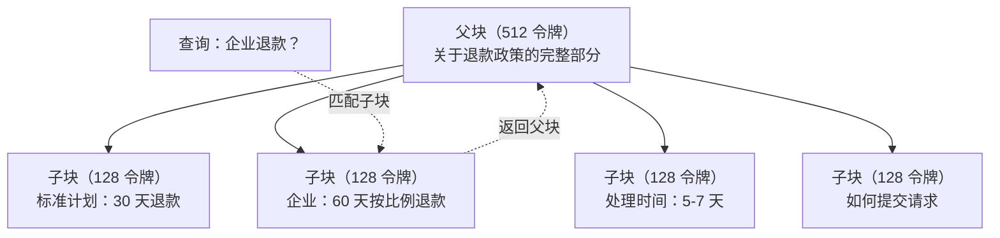
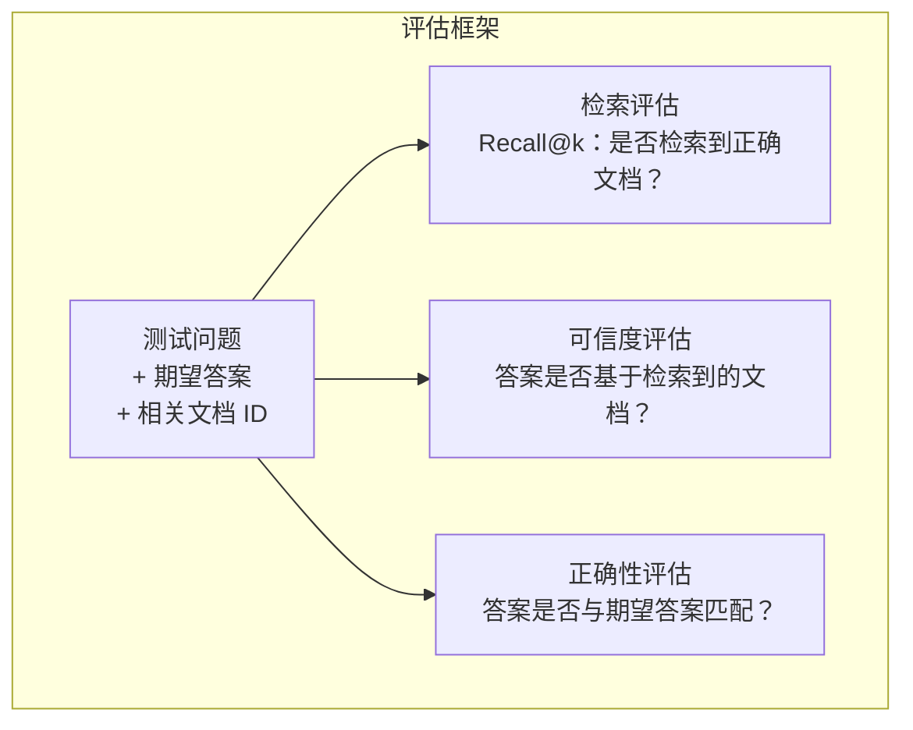

# Advanced RAG (Chunking, Reranking, Hybrid Search)

> Basic RAG retrieves the top-k most similar chunks. That works for simple questions. It falls apart for multi-hop reasoning, ambiguous queries, and large corpora. Advanced RAG is the difference between a demo that works on 10 documents and a system that works on 10 million.

**Type:** 构建  
**Languages:** Python  
**Prerequisites:** Phase 11，Lesson 06（RAG）  
**Time:** ~90 分钟  
**Related:** 第 5 阶段 · 第 23 课（RAG 的分块策略）涵盖了六种分块算法——递归分块、语义分块、句子分块、父文档分块、后期分块、上下文检索——并包含 Vectara/Anthropic 的基准测试。本课在此基础上进一步讲解：混合搜索、重排序、查询转换。

## 学习目标

- 实现高级分块策略（语义分块、递归分块、父-子分块），以保留文档结构和上下文
- 构建一个将 BM25 关键字匹配与语义向量搜索和交叉编码器重排序器结合的混合检索流水线
- 应用查询转换技术（HyDE、multi-query、step-back）以提高对歧义或复杂问题的检索效果
- 诊断并修复常见的 RAG 失败：检索到错误的 chunk、答案不在上下文中、多跳推理失败

## 问题背景

你在第 06 课构建了一个基本的 RAG 流水线。它可用于小语料库的直接问题。现在尝试这些情况：

歧义查询："What was revenue last quarter?"（上季度收入是多少？）语义检索返回了关于收入策略、收入预测以及 CFO 对收入增长的看法的 chunks。由于都与单词 "revenue" 语义相似，检索系统把这些放在前面，但没有包含实际数字。正确的 chunk 中写的是 "Q3 2025 的收益为 $47.2M"，但使用了单词 "earnings"（收益）而不是 "revenue"（收入）。嵌入模型将 "revenue strategy" 判断得比 "Q3 earnings were $47.2M" 更接近查询。

多跳问题："Which team had the highest customer satisfaction score improvement?"（哪个团队的客户满意度提升最多？）需要先找到每个团队的满意度分数，再比较并找出最大值。没有单一 chunk 包含完整答案，信息分散在多个团队报告中。

大规模语料问题：你有 200 万个 chunks。正确答案在 chunk #1,847,293。你的 top-5 检索得到的是 #14、#89,201、#1,200,000、#44、#901,333。它们在嵌入空间很接近，但都不包含答案。在这个规模上，近似最近邻搜索引入的误差会把相关结果排挤出 top-k。

基本 RAG 失败的根本原因是向量相似度并不等于相关性。一个 chunk 在语义上可能类似于查询，但对回答问题无用。高级 RAG 通过四种技术解决这个问题：混合搜索（加入关键字匹配）、重排序（更精细评分候选集）、查询转换（在检索前修正查询）和更好的分块（以合适的粒度检索）。

## 概念

### 混合搜索：语义 + 关键字

语义搜索（向量相似度）擅长理解含义。"How do I cancel my subscription?" 可以匹配到 "Steps to terminate your plan"，即使两者没有共有词。但它会错过精确匹配。"Error code E-4021" 如果嵌入模型把它当噪声，可能无法匹配包含 "E-4021" 的 chunk。

关键字搜索（BM25）则相反。它在精确匹配上表现优秀。"E-4021" 会被完美匹配。但 "cancel my subscription" 如果文档用 "terminate your plan" 描述，就可能没有结果。

混合搜索同时运行两者，然后合并结果。

BM25（Best Matching 25）是标准的关键字检索算法，自 1990 年代起一直是搜索引擎的核心。公式如下：

```
BM25(q, d) = sum over terms t in q:
    IDF(t) * (tf(t,d) * (k1 + 1)) / (tf(t,d) + k1 * (1 - b + b * |d| / avgdl))
```

其中 tf(t,d) 是词项 t 在文档 d 中的词频，IDF(t) 是逆文档频率，|d| 是文档长度，avgdl 是平均文档长度，k1 控制词频饱和（默认 1.2），b 控制长度归一化（默认 0.75）。

通俗地说：BM25 在文档包含查询词（尤其是稀有词）时给分更高，但重复词的收益是递减的。一个包含 "revenue" 50 次的文档并不会比只包含一次的文档高 50 倍。

### Reciprocal Rank Fusion (RRF)

你有两份排序列表：一份来自向量搜索，一份来自 BM25。如何合并？Reciprocal Rank Fusion 是标准方法。

```
RRF_score(d) = sum over rankings R:
    1 / (k + rank_R(d))
```

其中 k 是常数（通常为 60），用来防止排名第一的结果独占分数。

比如一个文档在向量搜索中排名第 1，在 BM25 中排名第 5，得分为：1/(60+1) + 1/(60+5) = 0.0164 + 0.0154 = 0.0318

一个文档在向量搜索中排名第 3，在 BM25 中排名第 2，得分为：1/(60+3) + 1/(60+2) = 0.0159 + 0.0161 = 0.0320

RRF 自然平衡两种信号：在两个列表中都排名靠前的文档得分最高。若文档在一个列表中排名第 1，另一个列表中缺失，则得分中等。这种方法稳健，因为它使用排名而非原始分数，所以无需担心不同系统分数分布的差异。

### 重排序（Reranking）

检索（向量、关键字或混合）速度快但精度有限。它通常使用 bi-encoders：查询和每个文档分别嵌入后比较。嵌入是预先计算并缓存的，这使得该方法可扩展到数百万文档。

重排序使用 cross-encoders：将查询和候选文档一起输入模型，输出一个相关性分数。模型同时看到两个文本，可以捕获细粒度的交互。交叉编码器能理解 "What were Q3 earnings?" 与包含 "$47.2M in Q3" 的 chunk 高度相关，即使 bi-encoder 没有捕捉到这一连接。

代价是：交叉编码器比 bi-encoder 慢 100-1000 倍，因为它需要联合处理查询-文档对。你无法为一百万份文档预计算交叉编码器分数。解决方案是：先检索较大的候选集（例如混合搜索的 top-50），然后用交叉编码器重排得到最终 top-5。



常见的重排序模型（2026 年阵容）：
- Cohere Rerank 3.5：托管 API，多语言，对混合语料的召回增益最佳
- Voyage rerank-2.5：托管 API，在托管选项中延迟最低
- Jina-Reranker-v2 Multilingual：开源权重，支持 100+ 语言
- bge-reranker-v2-m3：开源权重，强基线
- cross-encoder/ms-marco-MiniLM-L-6-v2：开源权重，可在 CPU 上进行原型验证
- ColBERTv2 / Jina-ColBERT-v2：晚交互（late-interaction）多向量重排器——在评分时复杂度为 O(tokens) 而非 O(docs)

### 查询转换（Query Transformation）

有时候问题不在检索系统，而在查询本身。"What was that thing about the new policy change?" 是一个糟糕的检索查询——没有具体词项，嵌入模糊。任何检索系统都难以找到正确文档。

查询重写（Query rewriting）：将用户查询改写为更适合检索的查询。LLM 可以做这件事：

```
User: "What was that thing about the new policy change?"
Rewritten: "Recent policy changes and updates"
```

HyDE（Hypothetical Document Embeddings）：不是用原始查询检索，而是先生成一个假设答案，将其嵌入，然后用该嵌入去检索相似的真实文档。

```
Query: "What is the refund policy for enterprise?"
Hypothetical answer: "Enterprise customers are eligible for a full refund
within 60 days of purchase. Refunds are pro-rated based on the remaining
subscription period and processed within 5-7 business days."
```

将假设答案嵌入并检索与之相似的真实文档。直观上来看，假设答案在嵌入空间中更接近真实答案，而非原始问题本身。问题与答案的语言结构不同：通过生成假设答案，你把“问题空间”与“答案空间”之间的差距连接起来。

HyDE 在检索前增加一次 LLM 调用，延迟增加约 500–2000ms。对于原始查询检索质量较差的情况，这是值得的。

### 父-子分块（Parent-Child Chunking）

标准分块会在精确性与上下文充足性之间权衡：小块便于精确检索，大块提供足够上下文。父-子分块消除了这一权衡。

对小块（128 令牌）建立索引用于检索。当检索到小块时，返回其父块（512 令牌）用于拼接提示。小块精确匹配查询，父块提供足够上下文让 LLM 生成良好答案。



查询 "enterprise refund?" 精确匹配子块 C2，但提示接收的是完整的父块 P，包含了处理时间与提交流程等上下文。

### 元数据过滤（Metadata Filtering）

在运行向量搜索之前，通过元数据过滤语料库：日期、来源、类别、作者、语言。这样可以减少搜索空间并避免不相关结果。

例如 "What changed in the security policy last month?" 应该只搜索过去 30 天内的安全类文档。若不进行元数据过滤，你可能会检索到一篇两年前但语义相近的安全文档。

生产级 RAG 系统会将元数据与每个 chunk 一起存储：源文档、创建日期、类别、作者、版本。向量数据库通常支持在相似度搜索前按元数据预过滤，这对大规模性能至关重要。

### 评估

你已经构建了 RAG 系统。如何判断它是否有效？三个指标：

检索相关性（Recall@k）：对于一组带有已知相关文档的测试问题，相关文档出现在 top-k 结果中的比例是多少？如果问题答案在 chunk #47，chunk #47 是否出现在 top-5？

可信度（Faithfulness）：生成答案是否基于检索到的文档？如果检索的 chunks 写的是 "60-day refund window" 而模型回答 "90-day refund window"，即为可信度失败。模型尽管有正确上下文，仍然产生了幻觉。

答案正确性（Answer correctness）：生成的答案是否与期望答案匹配？这是端到端指标，结合了检索质量与生成质量。

一个简单的可信度检测：将生成答案中的每个断言与检索到的 chunks 核对（其实质性匹配）。如果答案中出现的事实不在任何检索到的 chunk 中，则很可能是幻觉。



## 动手构建

### 第 1 步：BM25 实现

```python
import math
from collections import Counter

class BM25:
    def __init__(self, k1=1.2, b=0.75):
        self.k1 = k1
        self.b = b
        self.docs = []
        self.doc_lengths = []
        self.avg_dl = 0
        self.doc_freqs = {}
        self.n_docs = 0

    def index(self, documents):
        self.docs = documents
        self.n_docs = len(documents)
        self.doc_lengths = []
        self.doc_freqs = {}

        for doc in documents:
            words = doc.lower().split()
            self.doc_lengths.append(len(words))
            unique_words = set(words)
            for word in unique_words:
                self.doc_freqs[word] = self.doc_freqs.get(word, 0) + 1

        self.avg_dl = sum(self.doc_lengths) / self.n_docs if self.n_docs else 1

    def score(self, query, doc_idx):
        query_words = query.lower().split()
        doc_words = self.docs[doc_idx].lower().split()
        doc_len = self.doc_lengths[doc_idx]
        word_counts = Counter(doc_words)
        score = 0.0

        for term in query_words:
            if term not in word_counts:
                continue
            tf = word_counts[term]
            df = self.doc_freqs.get(term, 0)
            idf = math.log((self.n_docs - df + 0.5) / (df + 0.5) + 1)
            numerator = tf * (self.k1 + 1)
            denominator = tf + self.k1 * (1 - self.b + self.b * doc_len / self.avg_dl)
            score += idf * numerator / denominator

        return score

    def search(self, query, top_k=10):
        scores = [(i, self.score(query, i)) for i in range(self.n_docs)]
        scores.sort(key=lambda x: x[1], reverse=True)
        return scores[:top_k]
```

### 第 2 步：Reciprocal Rank Fusion

```python
def reciprocal_rank_fusion(ranked_lists, k=60):
    scores = {}
    for ranked_list in ranked_lists:
        for rank, (doc_id, _) in enumerate(ranked_list):
            if doc_id not in scores:
                scores[doc_id] = 0.0
            scores[doc_id] += 1.0 / (k + rank + 1)
    fused = sorted(scores.items(), key=lambda x: x[1], reverse=True)
    return fused
```

### 第 3 步：混合搜索流水线

```python
def hybrid_search(query, chunks, vector_embeddings, vocab, idf, bm25_index, top_k=5, fusion_k=60):
    query_emb = tfidf_embed(query, vocab, idf)
    vector_results = search(query_emb, vector_embeddings, top_k=top_k * 3)
    bm25_results = bm25_index.search(query, top_k=top_k * 3)
    fused = reciprocal_rank_fusion([vector_results, bm25_results], k=fusion_k)
    return fused[:top_k]
```

### 第 4 步：简单重排序器

在生产环境中，你会使用交叉编码器模型。这里我们构建一个简单的重排序器，使用词重叠、词项重要性和短语匹配来评分查询-文档相关性。

```python
def rerank(query, candidates, chunks):
    query_words = set(query.lower().split())
    stop_words = {"the", "a", "an", "is", "are", "was", "were", "what", "how",
                  "why", "when", "where", "do", "does", "for", "of", "in", "to",
                  "and", "or", "on", "at", "by", "it", "its", "this", "that",
                  "with", "from", "be", "has", "have", "had", "not", "but"}
    query_terms = query_words - stop_words

    scored = []
    for doc_id, initial_score in candidates:
        chunk = chunks[doc_id].lower()
        chunk_words = set(chunk.split())

        term_overlap = len(query_terms & chunk_words)

        query_bigrams = set()
        q_list = [w for w in query.lower().split() if w not in stop_words]
        for i in range(len(q_list) - 1):
            query_bigrams.add(q_list[i] + " " + q_list[i + 1])
        bigram_matches = sum(1 for bg in query_bigrams if bg in chunk)

        position_boost = 0
        for term in query_terms:
            pos = chunk.find(term)
            if pos != -1 and pos < len(chunk) // 3:
                position_boost += 0.5

        rerank_score = (
            term_overlap * 1.0
            + bigram_matches * 2.0
            + position_boost
            + initial_score * 5.0
        )
        scored.append((doc_id, rerank_score))

    scored.sort(key=lambda x: x[1], reverse=True)
    return scored
```

### 第 5 步：HyDE（Hypothetical Document Embeddings）

```python
def hyde_generate_hypothesis(query):
    templates = {
        "what": "The answer to '{query}' is as follows: Based on our documentation, {topic} involves specific policies and procedures that define how the process works.",
        "how": "To address '{query}': The process involves several steps. First, you need to initiate the request. Then, the system processes it according to the defined rules.",
        "default": "Regarding '{query}': Our records indicate specific details and policies related to this topic that provide a comprehensive answer."
    }
    query_lower = query.lower()
    if query_lower.startswith("what"):
        template = templates["what"]
    elif query_lower.startswith("how"):
        template = templates["how"]
    else:
        template = templates["default"]

    topic_words = [w for w in query.lower().split()
                   if w not in {"what", "is", "the", "how", "do", "does", "a", "an",
                                "for", "of", "to", "in", "on", "at", "by", "and", "or"}]
    topic = " ".join(topic_words) if topic_words else "this topic"

    return template.format(query=query, topic=topic)


def hyde_search(query, chunks, vector_embeddings, vocab, idf, top_k=5):
    hypothesis = hyde_generate_hypothesis(query)
    hypothesis_emb = tfidf_embed(hypothesis, vocab, idf)
    results = search(hypothesis_emb, vector_embeddings, top_k)
    return results, hypothesis
```

### 第 6 步：父-子分块实现

```python
def create_parent_child_chunks(text, parent_size=200, child_size=50):
    words = text.split()
    parents = []
    children = []
    child_to_parent = {}

    parent_idx = 0
    start = 0
    while start < len(words):
        parent_end = min(start + parent_size, len(words))
        parent_text = " ".join(words[start:parent_end])
        parents.append(parent_text)

        child_start = start
        while child_start < parent_end:
            child_end = min(child_start + child_size, parent_end)
            child_text = " ".join(words[child_start:child_end])
            child_idx = len(children)
            children.append(child_text)
            child_to_parent[child_idx] = parent_idx
            child_start += child_size

        parent_idx += 1
        start += parent_size

    return parents, children, child_to_parent
```

### 第 7 步：可信度评估（Faithfulness Evaluation）

```python
def evaluate_faithfulness(answer, retrieved_chunks):
    answer_sentences = [s.strip() for s in answer.split(".") if len(s.strip()) > 10]
    if not answer_sentences:
        return 1.0, []

    grounded = 0
    ungrounded = []
    context = " ".join(retrieved_chunks).lower()

    for sentence in answer_sentences:
        words = set(sentence.lower().split())
        stop_words = {"the", "a", "an", "is", "are", "was", "were", "and", "or",
                      "to", "of", "in", "for", "on", "at", "by", "it", "this", "that"}
        content_words = words - stop_words
        if not content_words:
            grounded += 1
            continue

        matched = sum(1 for w in content_words if w in context)
        ratio = matched / len(content_words) if content_words else 0

        if ratio >= 0.5:
            grounded += 1
        else:
            ungrounded.append(sentence)

    score = grounded / len(answer_sentences) if answer_sentences else 1.0
    return score, ungrounded


def evaluate_retrieval_recall(queries_with_relevant, retrieval_fn, k=5):
    total_recall = 0.0
    results = []

    for query, relevant_indices in queries_with_relevant:
        retrieved = retrieval_fn(query, k)
        retrieved_indices = set(idx for idx, _ in retrieved)
        relevant_set = set(relevant_indices)
        hits = len(retrieved_indices & relevant_set)
        recall = hits / len(relevant_set) if relevant_set else 1.0
        total_recall += recall
        results.append({
            "query": query,
            "recall": recall,
            "hits": hits,
            "total_relevant": len(relevant_set)
        })

    avg_recall = total_recall / len(queries_with_relevant) if queries_with_relevant else 0
    return avg_recall, results
```

## 使用示例

使用真实交叉编码器进行重排序：

```python
from sentence_transformers import CrossEncoder

reranker = CrossEncoder("cross-encoder/ms-marco-MiniLM-L-6-v2")

def rerank_with_cross_encoder(query, candidates, chunks, top_k=5):
    pairs = [(query, chunks[doc_id]) for doc_id, _ in candidates]
    scores = reranker.predict(pairs)
    scored = list(zip([doc_id for doc_id, _ in candidates], scores))
    scored.sort(key=lambda x: x[1], reverse=True)
    return scored[:top_k]
```

使用 Cohere 的托管重排序器：

```python
import cohere

co = cohere.Client()

def rerank_with_cohere(query, candidates, chunks, top_k=5):
    docs = [chunks[doc_id] for doc_id, _ in candidates]
    response = co.rerank(
        model="rerank-english-v3.0",
        query=query,
        documents=docs,
        top_n=top_k
    )
    return [(candidates[r.index][0], r.relevance_score) for r in response.results]
```

使用真实 LLM 的 HyDE：

```python
import anthropic

client = anthropic.Anthropic()

def hyde_with_llm(query):
    response = client.messages.create(
        model="claude-sonnet-4-20250514",
        max_tokens=256,
        messages=[{
            "role": "user",
            "content": f"Write a short paragraph that would be a good answer to this question. Do not say you don't know. Just write what the answer would look like.\n\nQuestion: {query}"
        }]
    )
    return response.content[0].text
```

使用 Weaviate 的生产级混合搜索：

```python
import weaviate

client = weaviate.connect_to_local()

collection = client.collections.get("Documents")
response = collection.query.hybrid(
    query="enterprise refund policy",
    alpha=0.5,
    limit=10
)
```

alpha 参数控制平衡：0.0 = 纯关键字（BM25），1.0 = 纯向量，0.5 = 等权。大多数生产系统将 alpha 设置在 0.3 到 0.7 之间。

## 部署产出（Ship It）

本课将产出：
- `outputs/prompt-advanced-rag-debugger.md` -- 用于诊断与修复 RAG 质量问题的提示词
- `outputs/skill-advanced-rag.md` -- 构建具备混合搜索与重排序的生产级 RAG 的技能文档

## 练习

1. 在示例文档上比较 BM25、向量搜索和混合搜索。对 5 个测试查询中的每一个，记录哪种方法在位置 #1 返回了最相关的 chunk。混合搜索在至少 3/5 的查询中应取得最好结果。

2. 实现一个元数据过滤器。为每个文档添加一个 "category" 字段（security、billing、api、product）。在运行向量搜索前，只过滤出相关类别的 chunks。使用 "What encryption is used?" 测试并验证它只在 security 类别的 chunks 中搜索。

3. 使用第 06 课中的简单生成函数构建完整的 HyDE 流水线。比较直接查询搜索与 HyDE 搜索在 5 个测试查询上的检索质量（top-3 相关性）。对于模糊查询，HyDE 应能提升结果。

4. 在示例文档上实现父-子分块策略。使用 child_size=30 和 parent_size=100。以子块检索，但在提示中返回父块。把生成的答案与标准分块（chunk_size=50）进行对比。

5. 创建评估数据集：10 个问题及其已知答案 chunks。测量（a）向量搜索仅、（b）BM25 仅、（c）混合搜索、（d）混合搜索+重排序 在 Recall@3、Recall@5、Recall@10 上的表现。绘图并识别重排序最有帮助的场景。

## 关键术语

| Term | What people say | What it actually means |
|------|----------------|----------------------|
| BM25 | "Keyword search" | 一种基于词频、逆文档频率和文档长度归一化的概率排序算法 |
| Hybrid search | "Best of both worlds" | 并行运行语义（向量）和关键字（BM25）搜索，然后用 rank fusion 合并结果 |
| Reciprocal Rank Fusion | "Merge ranked lists" | 通过对每个列表中每个文档求和 1/(k + rank) 来合并多个排序列表 |
| Reranking | "Second pass scoring" | 使用更昂贵的交叉编码器模型对初次检索得到的候选集进行重新评分 |
| Cross-encoder | "Joint query-document model" | 将查询与文档作为单一输入的模型，输出相关性分数；比 bi-encoder 更准确但不可对整个语料库直接搜索 |
| Bi-encoder | "Independent embedding model" | 将查询与文档独立嵌入的模型；因为嵌入可预计算，所以速度快，但精度低于 cross-encoder |
| HyDE | "Search with a fake answer" | 对查询生成一个假设答案，将其嵌入并检索与之相似的真实文档 |
| Parent-child chunking | "Small search, big context" | 用小块进行检索以获得精确匹配，但在提示中返回较大的父块以提供充足上下文 |
| Metadata filtering | "Narrow before searching" | 在运行向量搜索前按属性（日期、来源、类别）过滤文档以缩小搜索空间 |
| Faithfulness | "Did it stay grounded" | 生成答案是否由检索到的文档支持，而非模型训练数据中的幻觉 |

（注：文中术语翻译遵循标准 AI 工程术语，例如“Prompt engineering”翻译为“提示词工程”，“Embeddings”翻译为“嵌入”，“Fine-tuning”翻译为“微调”，“Context window”翻译为“上下文窗口”，“few-shot”翻译为“少样本”，“chain-of-thought”翻译为“思维链”，“guardrails”翻译为“护栏”，“function calling”翻译为“函数调用”。）

## 延伸阅读

- Robertson & Zaragoza, "The Probabilistic Relevance Framework: BM25 and Beyond" (2009) — BM25 的权威参考，解释了公式背后的概率基础  
- Cormack et al., "Reciprocal Rank Fusion Outperforms Condorcet and Individual Rank Learning Methods" (2009) — 原始 RRF 论文，展示其优于更复杂的融合方法  
- Gao et al., "Precise Zero-Shot Dense Retrieval without Relevance Labels" (2022) — HyDE 论文，展示了假设文档嵌入在无标注情况下也能提升检索  
- Nogueira & Cho, "Passage Re-ranking with BERT" (2019) — 展示了在 BM25 之上做 BERT 重排序能显著提升检索质量  
- [Khattab et al., "DSPy: Compiling Declarative Language Model Calls into Self-Improving Pipelines" (2023)](https://arxiv.org/abs/2310.03714) — 将提示构造与权重选择视为检索流水线优化问题；阅读此文可了解“程序化 LLMs”而非“提示式 LLMs”  
- [Edge et al., "From Local to Global: A Graph RAG Approach to Query-Focused Summarization" (Microsoft Research 2024)](https://arxiv.org/abs/2404.16130) — GraphRAG 论文：实体-关系抽取 + Leiden 社区检测用于面向查询的摘要；讨论了全局与局部检索的区别  
- [Asai et al., "Self-RAG: Learning to Retrieve, Generate, and Critique through Self-Reflection" (ICLR 2024)](https://arxiv.org/abs/2310.11511) — 通过反思令牌实现自我评估的 RAG；这是静态检索-生成之外的智能化前沿  
- [LangChain Query Construction blog](https://blog.langchain.dev/query-construction/) — 如何将自然语言查询翻译为结构化数据库查询（Text-to-SQL、Cypher）作为检索前的预处理步骤