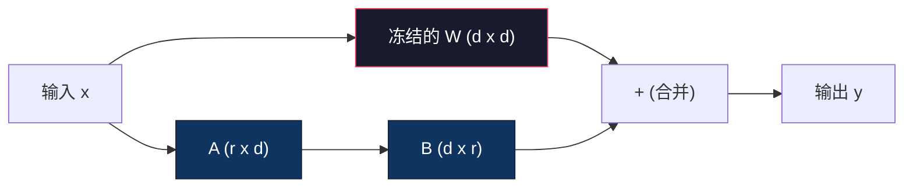
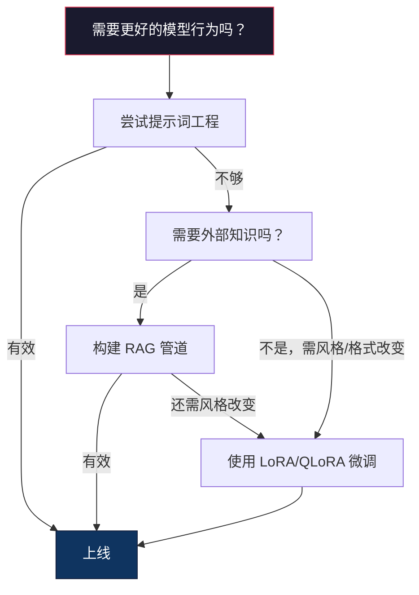

# 使用 LoRA 与 QLoRA 进行微调

> 完整微调一个 7B 模型需要 56GB 的显存。你没有这么多。大多数公司也没有。LoRA 允许你在 6GB 的显存中微调同一模型，只需训练不到 1% 的参数。这不是妥协 —— 在大多数任务上其质量可匹配完整微调。整个开源微调生态系统都基于这一技巧运行。

**Type:** 构建  
**Languages:** Python  
**Prerequisites:** Phase 10，第06课（指令微调 / SFT）  
**Time:** ~75 分钟  
**Related:** Phase 10 从零讲解 SFT/DPO 循环。本课将这些概念接入 2026 年的 PEFT 工具链（PEFT、TRL、Unsloth、Axolotl、LLaMA-Factory）。

## 学习目标

- 通过在预训练模型的注意力层中注入低秩适配矩阵（A 和 B），实现 LoRA
- 计算 LoRA 相对于完整微调的参数节省：秩 r 在 d_model 维度下训练 2*r*d 参数而不是 d^2
- 使用 QLoRA（4-bit 量化基座 + LoRA 适配器）微调模型以适配消费级 GPU 内存
- 将 LoRA 权重合并回基座模型以用于部署，并比较合并前后推理速度差异

## 问题背景

你有一个基座模型。Llama 3 8B。你希望它以公司语气回复客户支持工单。SFT（监督微调）是答案。但 SFT 有成本问题。

完整微调会更新模型中的每一个参数。Llama 3 8B 有 80 亿参数。以 fp16 存储时，每个参数占 2 字节。仅加载权重就需要 16GB。训练过程中还需要梯度（16GB）、Adam 的优化器状态（用于动量 + 方差约 32GB），以及激活。总计：单个 8B 模型大约需要 56GB 的显存。

一块 A100 80GB 勉强能装下。两块 A100 在云上每小时要 3-4 美元。对 50,000 个样本训练 3 个 epoch 需要 6-10 小时。每次试验大约 30-40 美元。要跑 10 次超参试验，部署之前就花掉 ~400 美元。

把规模扩到 Llama 3 70B，数字就荒谬了。仅权重就需要 140GB。你需要一个集群。每次试验 100+ 美元。

还有一个更深层的问题。完整微调修改了模型的所有权重。如果在客户支持数据上微调，可能会破坏模型的通用能力。这叫灾难性遗忘。模型在你的任务上变好，但可能在其他任务上变差。

你需要一种只训练更少参数、使用更少内存、并且不会破坏模型已有知识的方法。

## 概念

### LoRA：低秩适配

Edward Hu 等人在微软于 2021 年 6 月发表了 LoRA。论文的洞见是：微调期间的权重更新具有低内在秩。你不需要去更新一个 4096x4096 权重矩阵中的全部 1,677 万参数。更新中有用的信息可以被秩为 16 或 32 的矩阵捕捉到。

数学形式如下。标准线性层计算：

```
y = Wx
```

其中 W 是 d_out x d_in 的矩阵。对一个 4096x4096 的注意力投影，这就是 16,777,216 个参数。

LoRA 冻结 W 并添加一个低秩分解：

```
y = Wx + BAx
```

其中 B 是 (d_out x r)，A 是 (r x d_in)。秩 r 远小于 d —— 通常为 8、16 或 32。

对于一个 4096x4096 层且 r=16：
- 原始参数：4096 x 4096 = 16,777,216
- LoRA 参数：(4096 x 16) + (16 x 4096) = 65,536 + 65,536 = 131,072
- 缩减比例：131,072 / 16,777,216 = 0.78%

你只训练了 0.78% 的参数，但在多数任务上可获得 95-100% 的质量。



A 使用随机高斯初始化。B 初始化为零。这意味着 LoRA 的贡献从零开始——模型从原始行为开始训练，逐渐学习适配。

### 缩放因子：Alpha

LoRA 引入了缩放因子 alpha，用来控制低秩更新对输出的影响：

```
y = Wx + (alpha / r) * BAx
```

当 alpha = r 时，缩放为 1x。alpha = 2r（常用默认）时，缩放为 2x。这个超参数可以独立于基础学习率控制 LoRA 路径的步长。

实用建议：
- alpha = 2 * rank 是常见社区约定（原始论文多数实验使用 alpha = rank）
- alpha = rank 给出 1x 缩放，较保守但稳定
- 更高的 alpha 意味着每步更大的更新，可能加速收敛，也可能引起不稳定

### 在哪里应用 LoRA

Transformer 有许多线性层。你不必对所有层都加 LoRA。原始论文测试了不同组合：

| Target Layers | Trainable Params (7B) | Quality |
|--------------|----------------------|---------|
| q_proj only | 4.7M | 良好 |
| q_proj + v_proj | 9.4M | 更好 |
| q_proj + k_proj + v_proj + o_proj | 18.9M | 对注意力最优 |
| All linear (attention + MLP) | 37.7M | 收益有限，参数翻倍 |

对于大多数任务的甜点位置是：q_proj + v_proj。这针对自注意力中的 query 与 value 投影，控制模型关注什么以及提取什么信息。对复杂任务（如代码生成）加入 MLP 层会有帮助，但参数翻倍且对简单任务带来的收益递减。

### 秩的选择

秩 r 控制适配的表达能力：

| Rank | Trainable Params (per layer) | Best For |
|------|---------------------------|----------|
| 4 | 32,768 | 简单分类、情感分析 |
| 8 | 65,536 | 单一领域问答、摘要 |
| 16 | 131,072 | 多领域任务、指令跟随 |
| 32 | 262,144 | 复杂推理、代码生成 |
| 64 | 524,288 | 大多数任务收益递减 |
| 128 | 1,048,576 | 很少有理由使用 |

Hu 等人表明 r=4 已经能捕捉到简单任务大部分的适配信息。r=8 与 r=16 是实践中最常用的选择。超过 r=64 很少改善质量，并开始丧失 LoRA 的内存优势。

### QLoRA：4-bit 量化 + LoRA

Tim Dettmers 等人在华盛顿大学于 2023 年 5 月提出了 QLoRA。核心思想：将冻结的基座模型量化为 4-bit 精度，然后在其上附加以 fp16 存储的 LoRA 适配器。

这显著改变了内存方程式：

| Method | Weight Memory (7B) | Training Memory (7B) | GPU Required |
|--------|-------------------|---------------------|-------------|
| Full fine-tune (fp16) | 14GB | ~56GB | 1x A100 80GB |
| LoRA (fp16 base) | 14GB | ~18GB | 1x A100 40GB |
| QLoRA (4-bit base) | 3.5GB | ~6GB | 1x RTX 3090 24GB |

QLoRA 提出三项技术贡献：

- NF4（Normal Float 4-bit）：为神经网络权重专门设计的新数据类型。神经网络权重大致服从正态分布。NF4 将其 16 个量化等级放在标准正态分布的分位点处。对于近似正态分布的数据来说，这是信息论上更优的选择。它比均匀 4-bit 量化（INT4）或标准 Float4 丢失的信息更少。
- 双重量化（Double quantization）：量化常数本身也会占内存。每个 64 个权重的块需要一个 fp32 的缩放因子（4 字节）。对一个 7B 模型，这会额外占用 0.4GB。双重量化将这些常数量化为 fp8，减少到 0.1GB。虽然看起来小，但累计起来还是很可观。
- 分页优化器（Paged optimizers）：训练时，优化器状态（Adam 的动量与方差）在长序列或大 batch 上可能超出 GPU 内存。分页优化器使用 NVIDIA 的统一内存在 GPU 内存耗尽时将优化器状态自动分页到 CPU RAM，当需要时再分页回 GPU。这能防止 OOM 崩溃，但会以吞吐量为代价。

### 质量问题

减少参数或对基座进行量化会影响质量吗？多篇论文的数据如下：

| Method | MMLU (5-shot) | MT-Bench | HumanEval |
|--------|--------------|----------|-----------|
| Full fine-tune (Llama 2 7B) | 48.3 | 6.72 | 14.6 |
| LoRA r=16 | 47.9 | 6.68 | 14.0 |
| QLoRA r=16 (NF4) | 47.5 | 6.61 | 13.4 |
| QLoRA r=64 (NF4) | 48.1 | 6.70 | 14.2 |

在大多数基准上，r=16 的 LoRA 与完整微调的差距在 1% 以内。QLoRA r=16 再损失小部分百分比。QLoRA r=64 基本上可以匹配完整微调，同时使用少 90% 的内存。

### 真实世界成本

对 Llama 3 8B 在 50,000 个样本上训练（3 个 epoch）：

| Method | GPU | Time | Cost |
|--------|-----|------|------|
| Full fine-tune | 2x A100 80GB | 8 hours | ~$32 |
| LoRA r=16 | 1x A100 40GB | 4 hours | ~$8 |
| QLoRA r=16 | 1x RTX 4090 24GB | 6 hours | ~$5 |
| QLoRA r=16 (Unsloth) | 1x RTX 4090 24GB | 2.5 hours | ~$2 |
| QLoRA r=16 | 1x T4 16GB | 12 hours | ~$4 |

在单张消费级 GPU 上做 QLoRA 的成本不到一顿午餐。这也是 2023 年开源微调社区爆发的原因，并且每个下面列出的训练框架在 2026 年默认都支持 QLoRA。

### 2026 年的 PEFT 栈

| Framework | What it is | Pick when |
|-----------|-----------|-----------|
| **Hugging Face PEFT** | 经典的 LoRA/QLoRA/DoRA/IA3 库 | 你想要原生控制并且训练循环已基于 `transformers.Trainer` |
| **TRL** | HF 的基于反馈的强化训练器（SFT, DPO, GRPO, PPO, ORPO） | 你在 SFT 后需要 DPO/GRPO；基于 PEFT 构建 |
| **Unsloth** | 使用 Triton 重写的前向/反向核 | 你想要 2-5x 的加速 + 半数显存且不损失精度；对 Llama/Mistral/Qwen 系列有效 |
| **Axolotl** | 基于 YAML 的 PEFT + TRL + DeepSpeed + Unsloth 封装 | 你想要可复现、受版本控制的训练运行 |
| **LLaMA-Factory** | 在 PEFT + TRL 之上的 GUI/CLI/API | 你想要零代码微调；支持 100+ 模型家族 |
| **torchtune** | 原生 PyTorch 配方，无 `transformers` 依赖 | 你想要最小依赖并且组织内部标准化为 PyTorch |

经验法则：研究或一次性实验 → PEFT。可重复的生产流水线 → 在启用 Unsloth 内核的 Axolotl 上运行。临时原型 → LLaMA-Factory。

### 合并适配器

训练后，你会得到两样东西：冻结的基座模型和一个小的 LoRA 适配器（通常 10-100MB）。你可以：

1. 保持它们分离：加载基座模型，叠加适配器。为不同任务切换适配器。这是从一个基座服务多个微调变体的方式。
2. 永久合并它们：计算 W' = W + (alpha/r) * BA 并保存为新的完整模型。合并后的模型与原始大小相同。无推理开销，也无需管理适配器。

合并多个适配器的高级技巧：

- TIES-Merging（Yadav 等人，2023）：裁剪小幅度参数，解决符号冲突，然后合并。减少适配器之间的干扰。
- DARE（Yu 等人，2023）：在合并前随机丢弃部分适配器参数并对剩余参数重新缩放。出乎意料地在合并能力时很有效。
- 任务算术（Task arithmetic）：简单地相加或相减适配器权重。把“代码”适配器和“数学”适配器相加常常能得到同时擅长两者的模型。

### 什么时候不该微调

微调是第三种选择，而不是第一。

第一：提示词工程。写一个更好的 system prompt。加入少样本示例。使用思维链。这不会花钱，几分钟就能完成。如果提示词能解决 80% 的问题，你大概率不需要微调。

第二：RAG（检索增强生成）。如果模型需要知道你特定的数据（文档、知识库、产品目录），检索比把知识烙进权重更便宜、更易维护。参见第 06 课。

第三：微调。当你需要模型采用特定风格、格式或推理模式且提示词无法达到时；当你需要一致的结构化输出；当你需要把大模型蒸馏成小模型；或者延迟很关键且你无法承担少样本提示带来的额外 token 成本时，使用微调。



```figure
lora-params
```

## 构建实现

我们在纯 PyTorch 中从头实现 LoRA。无外部库。无魔法。你将构建 LoRA 层、将其注入模型、训练并将权重合并回去。

### 第 1 步：LoRA 层

```python
import torch
import torch.nn as nn
import math

class LoRALayer(nn.Module):
    def __init__(self, in_features, out_features, rank=8, alpha=16):
        super().__init__()
        self.rank = rank
        self.alpha = alpha
        self.scaling = alpha / rank

        self.A = nn.Parameter(torch.randn(in_features, rank) * (1 / math.sqrt(rank)))
        self.B = nn.Parameter(torch.zeros(rank, out_features))

    def forward(self, x):
        return (x @ self.A @ self.B) * self.scaling
```

A 使用缩放的随机值初始化。B 初始化为零。BA 的乘积从零开始，因此模型保持初始行为。

### 第 2 步：带 LoRA 的线性层封装

```python
class LinearWithLoRA(nn.Module):
    def __init__(self, linear, rank=8, alpha=16):
        super().__init__()
        self.linear = linear
        self.lora = LoRALayer(
            linear.in_features, linear.out_features, rank, alpha
        )

        for param in self.linear.parameters():
            param.requires_grad = False

    def forward(self, x):
        return self.linear(x) + self.lora(x)
```

原始线性层被冻结。整个模型中可训练的只有 LoRA 参数（A 和 B）。

### 第 3 步：将 LoRA 注入模型

```python
def inject_lora(model, target_modules, rank=8, alpha=16):
    for param in model.parameters():
        param.requires_grad = False

    lora_layers = {}
    for name, module in model.named_modules():
        if isinstance(module, nn.Linear):
            if any(t in name for t in target_modules):
                parent_name = ".".join(name.split(".")[:-1])
                child_name = name.split(".")[-1]
                parent = dict(model.named_modules())[parent_name]
                lora_linear = LinearWithLoRA(module, rank, alpha)
                setattr(parent, child_name, lora_linear)
                lora_layers[name] = lora_linear
    return lora_layers
```

先冻结模型中的所有参数。然后遍历模型树，找到名称匹配目标模块的线性层，并将其替换为 LoRA 封装层。整个模型中可训练的只有 LoRA 的 A 和 B 矩阵。

### 第 4 步：统计参数

```python
def count_parameters(model):
    total = sum(p.numel() for p in model.parameters())
    trainable = sum(p.numel() for p in model.parameters() if p.requires_grad)
    frozen = total - trainable
    return {
        "total": total,
        "trainable": trainable,
        "frozen": frozen,
        "trainable_pct": 100 * trainable / total if total > 0 else 0
    }
```

### 第 5 步：合并 LoRA 权重回模型

```python
def merge_lora_weights(model):
    for name, module in model.named_modules():
        if isinstance(module, LinearWithLoRA):
            with torch.no_grad():
                merged = (
                    module.lora.A @ module.lora.B
                ) * module.lora.scaling
                module.linear.weight.data += merged.T
            parent_name = ".".join(name.split(".")[:-1])
            child_name = name.split(".")[-1]
            if parent_name:
                parent = dict(model.named_modules())[parent_name]
            else:
                parent = model
            setattr(parent, child_name, module.linear)
```

合并后，LoRA 层被移除。模型与原始大小相同，适配已烙入权重中。无推理开销。

### 第 6 步：QLoRA 量化的模拟

```python
def quantize_to_nf4(tensor, block_size=64):
    blocks = tensor.reshape(-1, block_size)
    scales = blocks.abs().max(dim=1, keepdim=True).values / 7.0
    scales = torch.clamp(scales, min=1e-8)
    quantized = torch.round(blocks / scales).clamp(-8, 7).to(torch.int8)
    return quantized, scales

def dequantize_from_nf4(quantized, scales, original_shape):
    dequantized = quantized.float() * scales
    return dequantized.reshape(original_shape)
```

这段代码通过将权重在每个 64 个权重的块中映射到 16 个离散等级来模拟 4-bit 量化。生产级 QLoRA 在 GPU 上使用 bitsandbytes 库实现真实的 NF4。

### 第 7 步：训练循环

```python
def train_lora(model, data, epochs=5, lr=1e-3, batch_size=4):
    optimizer = torch.optim.AdamW(
        [p for p in model.parameters() if p.requires_grad], lr=lr
    )
    criterion = nn.MSELoss()

    losses = []
    for epoch in range(epochs):
        epoch_loss = 0.0
        n_batches = 0
        indices = torch.randperm(len(data["inputs"]))

        for i in range(0, len(indices), batch_size):
            batch_idx = indices[i:i + batch_size]
            x = data["inputs"][batch_idx]
            y = data["targets"][batch_idx]

            output = model(x)
            loss = criterion(output, y)

            optimizer.zero_grad()
            loss.backward()
            optimizer.step()

            epoch_loss += loss.item()
            n_batches += 1

        avg_loss = epoch_loss / n_batches
        losses.append(avg_loss)

    return losses
```

### 第 8 步：完整演示

```python
def demo():
    torch.manual_seed(42)
    d_model = 256
    n_classes = 10

    model = nn.Sequential(
        nn.Linear(d_model, 512),
        nn.ReLU(),
        nn.Linear(512, 512),
        nn.ReLU(),
        nn.Linear(512, n_classes),
    )

    n_samples = 500
    x = torch.randn(n_samples, d_model)
    y = torch.randint(0, n_classes, (n_samples,))
    y_onehot = torch.zeros(n_samples, n_classes).scatter_(1, y.unsqueeze(1), 1.0)

    data = {"inputs": x, "targets": y_onehot}

    params_before = count_parameters(model)

    lora_layers = inject_lora(
        model, target_modules=["0", "2"], rank=8, alpha=16
    )

    params_after = count_parameters(model)

    losses = train_lora(model, data, epochs=20, lr=1e-3)

    merge_lora_weights(model)
    params_merged = count_parameters(model)

    return {
        "params_before": params_before,
        "params_after": params_after,
        "params_merged": params_merged,
        "losses": losses,
    }
```

演示创建了一个小模型，在两个层注入 LoRA，训练并合并权重。参数计数在 LoRA 训练期间从全部可训练降到约 1% 可训练，合并后返回到原始架构。

## 使用方法

在 Hugging Face 生态中，对真实模型使用 LoRA 大约只需 20 行代码：

```python
from transformers import AutoModelForCausalLM, AutoTokenizer
from peft import LoraConfig, get_peft_model, TaskType

model = AutoModelForCausalLM.from_pretrained("meta-llama/Llama-3.1-8B")
tokenizer = AutoTokenizer.from_pretrained("meta-llama/Llama-3.1-8B")

lora_config = LoraConfig(
    task_type=TaskType.CAUSAL_LM,
    r=16,
    lora_alpha=32,
    lora_dropout=0.05,
    target_modules=["q_proj", "v_proj"],
)

model = get_peft_model(model, lora_config)
model.print_trainable_parameters()
```

对 QLoRA，添加 bitsandbytes 的量化配置：

```python
from transformers import BitsAndBytesConfig

bnb_config = BitsAndBytesConfig(
    load_in_4bit=True,
    bnb_4bit_quant_type="nf4",
    bnb_4bit_compute_dtype=torch.bfloat16,
    bnb_4bit_use_double_quant=True,
)

model = AutoModelForCausalLM.from_pretrained(
    "meta-llama/Llama-3.1-8B",
    quantization_config=bnb_config,
    device_map="auto",
)

model = get_peft_model(model, lora_config)
```

就是这么简单。相同的训练循环。相同的数据管道。基座模型以 4-bit 存放，LoRA 适配器以 fp16 训练，整个过程可装入 6GB 显存。

使用 Hugging Face Trainer 训练示例：

```python
from transformers import TrainingArguments, Trainer
from datasets import load_dataset

dataset = load_dataset("tatsu-lab/alpaca", split="train[:5000]")

training_args = TrainingArguments(
    output_dir="./lora-llama",
    num_train_epochs=3,
    per_device_train_batch_size=4,
    gradient_accumulation_steps=4,
    learning_rate=2e-4,
    fp16=True,
    logging_steps=10,
    save_strategy="epoch",
    optim="paged_adamw_8bit",
)

trainer = Trainer(
    model=model,
    args=training_args,
    train_dataset=dataset,
)

trainer.train()

model.save_pretrained("./lora-adapter")
```

保存的适配器大小为 10-100MB。基座模型保持不变。你可以在 Hugging Face Hub 上仅分享适配器而不重新分发完整模型。

## 上线部署

本课产出：
- `outputs/prompt-lora-advisor.md` -- 一个提示词，帮助你为特定任务决定 LoRA 的秩、目标模块和超参数
- `outputs/skill-fine-tuning-guide.md` -- 一个技能文档，教会 agent 何时以及如何进行微调的决策树

## 练习

1. 秩消融研究。以 r=2,4,8,16,32,64 运行 demo。绘制最终损失随秩变化的曲线。找出收益递减点（即再翻倍秩不再能使损失减半）。对于 256 维特征的简单分类任务，这个点应在 r=8-16 左右。
2. 目标模块比较。修改 inject_lora，只针对层 "0"、仅 "2"、仅 "4"、以及全部三层分别训练 20 个 epoch。比较收敛速度和最终损失。这类似在真实决策中选择 q_proj、v_proj 或全部线性层。
3. 量化误差分析。对训练后的模型权重在 quantize_to_nf4 / dequantize_from_nf4 前后计算均方误差、最大绝对误差以及原始与重构权重之间的相关性。尝试 block_size 为 32、64、128、256 的效果。
4. 多适配器服务。分别在数据的不同子集（偶数索引 vs 奇数索引）上训练两个 LoRA 适配器。保存两个适配器。只加载一次基座模型，然后切换适配器并验证同一输入下输出不同。这就是在生产中如何用一个基座服务多个微调模型。
5. 合并与未合并的推理比较。在相同的 100 个输入上比较 LoRA 模型合并前后输出。验证输出在浮点容忍度 1e-5 内相同。然后对两者做推理速度基准测试 —— 合并后应略快一些，因为它是一次矩阵乘而不是两次。

## 关键术语

| Term | What people say | What it actually means |
|------|----------------|----------------------|
| LoRA | "Efficient fine-tuning" | 低秩适配：冻结基座权重，训练两个小矩阵 A 与 B，二者乘积近似完整的权重更新 |
| QLoRA | "Fine-tune on a laptop" | 量化 LoRA：以 4-bit NF4 加载基座，LoRA 适配器以 fp16 在其上训练，使 7B 微调能在 6GB VRAM 内完成 |
| Rank (r) | "How much the model can learn" | A 与 B 矩阵的内部维度；控制表达能力与参数量的折中 |
| Alpha | "LoRA learning rate" | 应用于 LoRA 输出的缩放因子；alpha/r 缩放适配对最终输出的贡献 |
| NF4 | "4-bit quantization" | Normal Float 4：一种 4-bit 数据类型，其量化等级位于正态分布的分位点，适合神经网络权重 |
| Adapter | "The small trained part" | 作为单独文件保存的 LoRA A 与 B 矩阵（10-100MB），可以加载到任意基座模型之上 |
| Target modules | "Which layers to LoRA" | 注入 LoRA 的特定线性层（q_proj、v_proj 等） |
| Merging | "Bake it in" | 计算 W + (alpha/r) * BA 并替换原始权重，从而在推理时消除适配器开销 |
| Paged optimizers | "Don't OOM during training" | 在 GPU 内存耗尽时将优化器状态（Adam 的动量、方差）卸载到 CPU |
| Catastrophic forgetting | "Fine-tuning broke everything else" | 更新所有权重导致模型丢失先前学习到的能力 |

## 延伸阅读

- Hu et al., "LoRA: Low-Rank Adaptation of Large Language Models" (2021) — 介绍低秩分解方法的原始论文，在 GPT-3 175B 上测试到秩为 4 的有效性
- Dettmers et al., "QLoRA: Efficient Finetuning of Quantized Language Models" (2023) — 介绍 NF4、双重量化与分页优化器，使得在单张 48GB GPU 上微调 65B 成为可能
- PEFT 库文档 (https://huggingface.co/docs/peft) — Hugging Face 生态中用于 LoRA、QLoRA 及其他参数高效方法的标准库
- Yadav et al., "TIES-Merging: Resolving Interference When Merging Models" (2023) — 合并多个 LoRA 适配器而不损失质量的技术
- [Rafailov et al., "Direct Preference Optimization: Your Language Model is Secretly a Reward Model" (NeurIPS 2023)](https://arxiv.org/abs/2305.18290) — DPO 推导；即 SFT 之后的偏好微调阶段，无需奖励模型
- [TRL 文档](https://huggingface.co/docs/trl/) — 关于 `SFTTrainer`, `DPOTrainer`, `KTOTrainer` 及与 PEFT/bitsandbytes/Unsloth 的集成的官方参考
- [Unsloth 文档](https://docs.unsloth.ai/) — 提供融合核以倍增微调吞吐量并减半内存；是 TRL 之上的性能层
- [Axolotl 文档](https://axolotl-ai-cloud.github.io/axolotl/) — 基于 YAML 配置的多 GPU SFT/DPO/QLoRA 训练器；是手写脚本的 config-as-code 替代方案