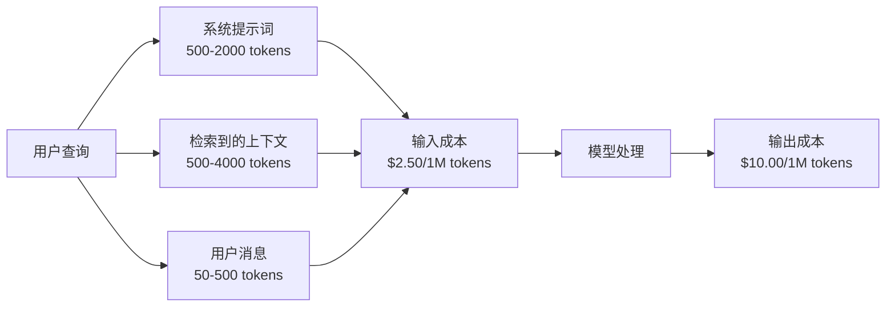
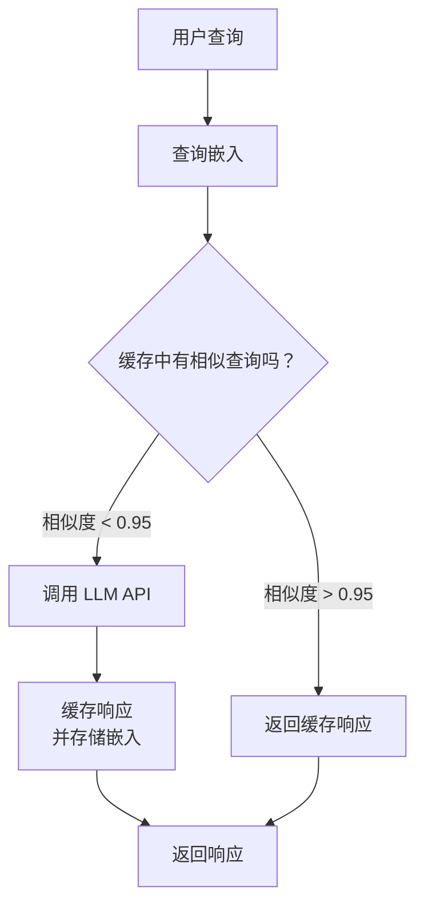
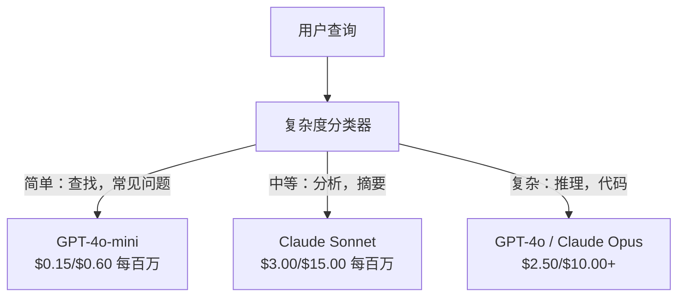

# 缓存、速率限制与成本优化

> 大多数 AI 初创公司并不是因为模型差而倒闭，而是因为单位经济学糟糕。一次 GPT-4o 调用只需几分钱的千分之一。假设一万名用户每天各发起十次调用，仅输入 token 的成本就要 250 美元——这还没有计入任何收入。能存活下来的公司把每一次 API 调用当作一次财务交易来对待，而不是一次简单的函数调用。

**Type:** 构建
**Languages:** Python
**Prerequisites:** Phase 11 Lesson 09（函数调用）
**Time:** ~45 分钟
**Related:** Phase 11 · 15（提示词缓存） — 本课覆盖应用层缓存（语义缓存、精确哈希缓存、模型路由）。第 15 课覆盖提供商层的提示词缓存（Anthropic 的 cache_control、OpenAI 的自动缓存、Gemini 的 CachedContent）。结合两者可实现 50–95% 的成本下降。

## 学习目标

- 实现语义缓存，在重复或相似查询时直接从缓存返回而不是发起新的 API 调用
- 跨提供商计算每次请求成本，实施基于 token 的速率限制与预算告警
- 构建一个包含提示词压缩、模型路由（昂贵 vs 便宜）和响应缓存的成本优化层
- 设计分层缓存策略，针对不同查询类型使用精确匹配、语义相似度和前缀缓存

## 问题所在

你构建了一个 RAG 聊天机器人，运行得很好，用户很喜欢。

然后发票来了。

GPT-5 的输入成本是每百万 token 5 美元，输出成本 15 美元。Claude Opus 4.7 的输入 15 / 输出 75。Gemini 3 Pro 输入 1.25 / 输出 5。GPT-5-mini 为 0.25/2。以下价格为示例；请始终查看提供商的实时定价页面。

以下数学会杀死初创公司：

- 10,000 日活跃用户
- 每用户每天 10 次查询
- 每次查询 1,000 输入 token（系统提示 + 上下文 + 用户消息）
- 每次响应 500 输出 token

每日输入成本：10,000 x 10 x 1,000 / 1,000,000 x $2.50 = **$250/天**  
每日输出成本：10,000 x 10 x 500 / 1,000,000 x $10.00 = **$500/天**  
每月合计：**$22,500/月**

这还只是 LLM 的花费。再加上嵌入、向量数据库托管、基础设施，你可能会看到 30,000 美元/月 的聊天机器人成本。

更残酷的是：40–60% 的查询是近重复的。用户用稍微不同的措辞问同样的问题。你的系统提示——每次请求都相同——每次都会计费。RAG 检索的上下文文档在问同一主题的用户之间重复。

你为冗余计算付了全价。

## 概念

### 一次 LLM 调用的成本构成

每次 API 调用包含五个成本组成部分。



系统提示是沉默的杀手。每次请求发送 1,500 token 的系统提示，仅这段前缀的成本在每百万次请求上就是 3.75 美元。在每日 10 万次请求下，这就是 375 美元/天 —— 每月 11,250 美元 —— 而这段文本从未改变。

### 提供商缓存：内置折扣

到 2026 年，三大提供商都提供了提供商侧的提示词缓存，但机制不同。详见 Phase 11 · 15。

| Provider | Mechanism | Discount | Minimum | Cache Duration |
|----------|-----------|----------|---------|----------------|
| Anthropic | Explicit cache_control markers | 90% on cache hits (pay 25% extra on write) | 1,024 tokens (Sonnet/Opus), 2,048 (Haiku) | 5 min default; 1h extended (2x write premium) |
| OpenAI | Automatic prefix matching | 50% on cache hits | 1,024 tokens | Best-effort up to 1 hour |
| Google Gemini | Explicit CachedContent API | ~75% reduction (plus storage) | 4,096 (Flash) / 32,768 (Pro) | User-configurable TTL |

Anthropic 的方法是显式的。你用 `cache_control: {"type": "ephemeral"}` 在提示词中标注片段。第一次请求将支付 25% 的写入溢价。随后具有相同前缀的请求命中时获得 90% 的折扣。一个 2,000-token 的系统提示，正常成本为 $0.005，在命中缓存时只需 $0.000625。在 100K 次请求下，可节省 $437.50/天。

OpenAI 的方法是自动的。任何与先前请求匹配的提示词前缀可获得 50% 折扣。无需标记。交换的是：折扣较低、可控性较少，但实现工作为零。

### 语义缓存：你的自定义层

提供商缓存仅对完全相同的前缀有效。语义缓存处理更难的情况：不同的字符串但相同的含义。

“What is the return policy?” 和 “How do I return an item?” 是不同的字符串但意图相同。语义缓存会对两个查询做嵌入，计算余弦相似度，如果相似度超过阈值（通常 0.92–0.95），则返回缓存的响应。



嵌入成本几乎可以忽略不计。OpenAI 的 text-embedding-3-small 每百万 tokens 仅 $0.02。检查缓存的成本与一次完整 LLM 调用相比几乎可以忽略。

### 精确缓存：哈希与匹配

对于确定性调用（temperature=0、相同模型、相同提示词），精确缓存更简单也更快。对完整提示做哈希，检查缓存，找到则返回。

这种方式完美适用于：
- 系统提示 + 固定上下文 + 完全相同的用户查询
- 函数调用且工具定义相同
- 批量处理同一文档被多次处理的场景

### 速率限制：保护你的预算

速率限制不仅为了公平，也是为了生存。

Token bucket 算法：每个用户有一个容量为 N 的桶，以速率 R 每秒补充。一次请求从桶中消耗 token。如果桶空了，请求被拒绝。该算法允许突发（一次性使用满桶）同时约束平均速率。

按用户配额：为不同用户层设置日/月 token 限额。

| Tier | Daily Token Limit | Max Requests/min | Model Access |
|------|------------------|------------------|-------------|
| Free | 50,000 | 10 | GPT-4o-mini only |
| Pro | 500,000 | 60 | GPT-4o, Claude Sonnet |
| Enterprise | 5,000,000 | 300 | All models |

### 模型路由：为任务选对模型

并非每个查询都需要 GPT-4o。

“商店什么时候关门？”不需要每百万输出 $10 的模型。GPT-4o-mini（$0.60/M output）即可胜任。Claude Haiku（$1.25/M）也可以。一个简单的分类器会把便宜的问题路由到廉价模型，把复杂问题路由到昂贵模型。



一个调优良好的路由器仅在模型成本上就能节省 40–70%。

### 成本追踪：知道钱花到哪儿去了

不可优化你无法衡量的东西。记录每次 API 调用，包含：

- 时间戳
- 模型名称
- 输入 token 数
- 输出 token 数
- 延迟（ms）
- 计算出的成本（$）
- 用户 ID
- 缓存命中/未命中
- 请求分类

这些数据揭示了哪些功能成本高、哪些用户是重度使用者，以及缓存在哪些场景中影响最大。

### 批量处理：批量折扣

OpenAI 的 Batch API 异步处理请求，可享受 50% 折扣。你提交最多 50,000 个请求的批次，结果在 24 小时内返回。

使用场景：
- 夜间文档处理
- 批量分类
- 评估任务
- 数据富集管道

不适合：实时面向用户的查询（延迟敏感）。

### 预算告警与断路器

断路器在触及限额时停止消费。没有断路器，Bug 或滥用可能在数小时内烧光你的月预算。

设置三个阈值：
1. 警告（70% 的预算）：发送告警
2. 限速（85% 的预算）：切换到更便宜的模型
3. 停止（95% 的预算）：拒绝新请求，仅返回缓存响应

### 优化栈

按顺序应用这些技术。每一层都在前一层的基础上复合节省效果。

| Layer | Technique | Typical Savings | Implementation Effort |
|-------|-----------|----------------|----------------------|
| 1 | Provider prompt caching | 30-50% | Low (add cache markers) |
| 2 | Exact caching | 10-20% | Low (hash + dict) |
| 3 | Semantic caching | 15-30% | Medium (embeddings + similarity) |
| 4 | Model routing | 40-70% | Medium (classifier) |
| 5 | Rate limiting | Budget protection | Low (token bucket) |
| 6 | Prompt compression | 10-30% | Medium (rewrite prompts) |
| 7 | Batching | 50% on eligible | Low (batch API) |

一个在 RAG 应用上同时应用第 1–5 层的系统，通常能把成本从 $22,500/月 降到 $4,000–6,000/月。这就是烫干跑道与构建业务之间的差别。

### 实际节省：优化前后

下面是一个为 10,000 DAU 的 RAG 聊天机器人提供的真实分解。

| Metric | Before Optimization | After Optimization | Savings |
|--------|--------------------|--------------------|---------|
| Monthly LLM cost | $22,500 | $5,200 | 77% |
| Avg cost per query | $0.0075 | $0.0017 | 77% |
| Cache hit rate | 0% | 52% | -- |
| Queries routed to mini | 0% | 65% | -- |
| P95 latency | 2,800ms | 900ms (cache hits: 50ms) | 68% |
| Monthly embedding cost | $0 | $180 | （新增成本） |
| Total monthly cost | $22,500 | $5,380 | 76% |

用于语义缓存的嵌入成本（$180/月）在缓存命中后的第一个小时内就能自我收回。

## 构建它

### 第 1 步：成本计算器

构建一个 token 成本计算器，知道主流模型的当前定价。

```python
import hashlib
import time
import json
import math
from dataclasses import dataclass, field


MODEL_PRICING = {
    "gpt-4o": {"input": 2.50, "output": 10.00, "cached_input": 1.25},
    "gpt-4o-mini": {"input": 0.15, "output": 0.60, "cached_input": 0.075},
    "gpt-4.1": {"input": 2.00, "output": 8.00, "cached_input": 0.50},
    "gpt-4.1-mini": {"input": 0.40, "output": 1.60, "cached_input": 0.10},
    "gpt-4.1-nano": {"input": 0.10, "output": 0.40, "cached_input": 0.025},
    "o3": {"input": 2.00, "output": 8.00, "cached_input": 0.50},
    "o3-mini": {"input": 1.10, "output": 4.40, "cached_input": 0.55},
    "o4-mini": {"input": 1.10, "output": 4.40, "cached_input": 0.275},
    "claude-opus-4": {"input": 15.00, "output": 75.00, "cached_input": 1.50},
    "claude-sonnet-4": {"input": 3.00, "output": 15.00, "cached_input": 0.30},
    "claude-haiku-3.5": {"input": 0.80, "output": 4.00, "cached_input": 0.08},
    "gemini-2.5-pro": {"input": 1.25, "output": 10.00, "cached_input": 0.3125},
    "gemini-2.5-flash": {"input": 0.15, "output": 0.60, "cached_input": 0.0375},
}


def calculate_cost(model, input_tokens, output_tokens, cached_input_tokens=0):
    if model not in MODEL_PRICING:
        return {"error": f"Unknown model: {model}"}
    pricing = MODEL_PRICING[model]
    non_cached = input_tokens - cached_input_tokens
    input_cost = (non_cached / 1_000_000) * pricing["input"]
    cached_cost = (cached_input_tokens / 1_000_000) * pricing["cached_input"]
    output_cost = (output_tokens / 1_000_000) * pricing["output"]
    total = input_cost + cached_cost + output_cost
    return {
        "model": model,
        "input_tokens": input_tokens,
        "output_tokens": output_tokens,
        "cached_input_tokens": cached_input_tokens,
        "input_cost": round(input_cost, 6),
        "cached_input_cost": round(cached_cost, 6),
        "output_cost": round(output_cost, 6),
        "total_cost": round(total, 6),
    }
```

（代码内无需翻译注释；保持原样。）

### 第 2 步：精确缓存

对完整提示做哈希，对于相同请求返回缓存响应。

```python
class ExactCache:
    def __init__(self, max_size=1000, ttl_seconds=3600):
        self.cache = {}
        self.max_size = max_size
        self.ttl = ttl_seconds
        self.hits = 0
        self.misses = 0

    def _hash(self, model, messages, temperature):
        key_data = json.dumps({"model": model, "messages": messages, "temperature": temperature}, sort_keys=True)
        return hashlib.sha256(key_data.encode()).hexdigest()

    def get(self, model, messages, temperature=0.0):
        if temperature > 0:
            self.misses += 1
            return None
        key = self._hash(model, messages, temperature)
        if key in self.cache:
            entry = self.cache[key]
            if time.time() - entry["timestamp"] < self.ttl:
                self.hits += 1
                entry["access_count"] += 1
                return entry["response"]
            del self.cache[key]
        self.misses += 1
        return None

    def put(self, model, messages, temperature, response):
        if temperature > 0:
            return
        if len(self.cache) >= self.max_size:
            oldest_key = min(self.cache, key=lambda k: self.cache[k]["timestamp"])
            del self.cache[oldest_key]
        key = self._hash(model, messages, temperature)
        self.cache[key] = {
            "response": response,
            "timestamp": time.time(),
            "access_count": 1,
        }

    def stats(self):
        total = self.hits + self.misses
        return {
            "hits": self.hits,
            "misses": self.misses,
            "hit_rate": round(self.hits / total, 4) if total > 0 else 0,
            "cache_size": len(self.cache),
        }
```

（代码内无需翻译注释；保持原样。）

### 第 3 步：语义缓存

对查询做嵌入，当相似度超过阈值时返回缓存响应。

```python
def simple_embed(text):
    words = text.lower().split()
    vocab = {}
    for w in words:
        vocab[w] = vocab.get(w, 0) + 1
    norm = math.sqrt(sum(v * v for v in vocab.values()))
    if norm == 0:
        return {}
    return {k: v / norm for k, v in vocab.items()}


def cosine_similarity(a, b):
    if not a or not b:
        return 0.0
    all_keys = set(a) | set(b)
    dot = sum(a.get(k, 0) * b.get(k, 0) for k in all_keys)
    return dot


class SemanticCache:
    def __init__(self, similarity_threshold=0.85, max_size=500, ttl_seconds=3600):
        self.entries = []
        self.threshold = similarity_threshold
        self.max_size = max_size
        self.ttl = ttl_seconds
        self.hits = 0
        self.misses = 0

    def get(self, query):
        query_embedding = simple_embed(query)
        now = time.time()
        best_match = None
        best_sim = 0.0
        for entry in self.entries:
            if now - entry["timestamp"] > self.ttl:
                continue
            sim = cosine_similarity(query_embedding, entry["embedding"])
            if sim > best_sim:
                best_sim = sim
                best_match = entry
        if best_match and best_sim >= self.threshold:
            self.hits += 1
            best_match["access_count"] += 1
            return {"response": best_match["response"], "similarity": round(best_sim, 4), "original_query": best_match["query"]}
        self.misses += 1
        return None

    def put(self, query, response):
        if len(self.entries) >= self.max_size:
            self.entries.sort(key=lambda e: e["timestamp"])
            self.entries.pop(0)
        self.entries.append({
            "query": query,
            "embedding": simple_embed(query),
            "response": response,
            "timestamp": time.time(),
            "access_count": 1,
        })

    def stats(self):
        total = self.hits + self.misses
        return {
            "hits": self.hits,
            "misses": self.misses,
            "hit_rate": round(self.hits / total, 4) if total > 0 else 0,
            "cache_size": len(self.entries),
        }
```

（代码内无需翻译注释；保持原样。）

### 第 4 步：速率限制器

基于 token 桶的速率限制器，并支持按用户配额。

```python
class TokenBucketRateLimiter:
    def __init__(self):
        self.buckets = {}
        self.tiers = {
            "free": {"capacity": 50_000, "refill_rate": 500, "max_requests_per_min": 10},
            "pro": {"capacity": 500_000, "refill_rate": 5_000, "max_requests_per_min": 60},
            "enterprise": {"capacity": 5_000_000, "refill_rate": 50_000, "max_requests_per_min": 300},
        }

    def _get_bucket(self, user_id, tier="free"):
        if user_id not in self.buckets:
            tier_config = self.tiers.get(tier, self.tiers["free"])
            self.buckets[user_id] = {
                "tokens": tier_config["capacity"],
                "capacity": tier_config["capacity"],
                "refill_rate": tier_config["refill_rate"],
                "last_refill": time.time(),
                "request_timestamps": [],
                "max_rpm": tier_config["max_requests_per_min"],
                "tier": tier,
                "total_tokens_used": 0,
            }
        return self.buckets[user_id]

    def _refill(self, bucket):
        now = time.time()
        elapsed = now - bucket["last_refill"]
        refill = int(elapsed * bucket["refill_rate"])
        if refill > 0:
            bucket["tokens"] = min(bucket["capacity"], bucket["tokens"] + refill)
            bucket["last_refill"] = now

    def check(self, user_id, tokens_needed, tier="free"):
        bucket = self._get_bucket(user_id, tier)
        self._refill(bucket)
        now = time.time()
        bucket["request_timestamps"] = [t for t in bucket["request_timestamps"] if now - t < 60]
        if len(bucket["request_timestamps"]) >= bucket["max_rpm"]:
            return {"allowed": False, "reason": "rate_limit", "retry_after_seconds": 60 - (now - bucket["request_timestamps"][0])}
        if bucket["tokens"] < tokens_needed:
            deficit = tokens_needed - bucket["tokens"]
            wait = deficit / bucket["refill_rate"]
            return {"allowed": False, "reason": "token_limit", "tokens_available": bucket["tokens"], "retry_after_seconds": round(wait, 1)}
        return {"allowed": True, "tokens_available": bucket["tokens"]}

    def consume(self, user_id, tokens_used, tier="free"):
        bucket = self._get_bucket(user_id, tier)
        bucket["tokens"] -= tokens_used
        bucket["request_timestamps"].append(time.time())
        bucket["total_tokens_used"] += tokens_used

    def get_usage(self, user_id):
        if user_id not in self.buckets:
            return {"error": "User not found"}
        b = self.buckets[user_id]
        return {
            "user_id": user_id,
            "tier": b["tier"],
            "tokens_remaining": b["tokens"],
            "capacity": b["capacity"],
            "total_tokens_used": b["total_tokens_used"],
            "utilization": round(b["total_tokens_used"] / b["capacity"], 4) if b["capacity"] else 0,
        }
```

（代码内无需翻译注释；保持原样。）

### 第 5 步：成本追踪器

记录每次调用并计算运行时累计总额。

```python
class CostTracker:
    def __init__(self, monthly_budget=1000.0):
        self.logs = []
        self.monthly_budget = monthly_budget
        self.alerts = []

    def log_call(self, model, input_tokens, output_tokens, cached_input_tokens=0, latency_ms=0, user_id="anonymous", cache_status="miss"):
        cost = calculate_cost(model, input_tokens, output_tokens, cached_input_tokens)
        entry = {
            "timestamp": time.time(),
            "model": model,
            "input_tokens": input_tokens,
            "output_tokens": output_tokens,
            "cached_input_tokens": cached_input_tokens,
            "latency_ms": latency_ms,
            "cost": cost["total_cost"],
            "user_id": user_id,
            "cache_status": cache_status,
        }
        self.logs.append(entry)
        self._check_budget()
        return entry

    def _check_budget(self):
        total = self.total_cost()
        pct = total / self.monthly_budget if self.monthly_budget > 0 else 0
        if pct >= 0.95 and not any(a["level"] == "stop" for a in self.alerts):
            self.alerts.append({"level": "stop", "message": f"Budget 95% consumed: ${total:.2f}/${self.monthly_budget:.2f}", "timestamp": time.time()})
        elif pct >= 0.85 and not any(a["level"] == "throttle" for a in self.alerts):
            self.alerts.append({"level": "throttle", "message": f"Budget 85% consumed: ${total:.2f}/${self.monthly_budget:.2f}", "timestamp": time.time()})
        elif pct >= 0.70 and not any(a["level"] == "warning" for a in self.alerts):
            self.alerts.append({"level": "warning", "message": f"Budget 70% consumed: ${total:.2f}/${self.monthly_budget:.2f}", "timestamp": time.time()})

    def total_cost(self):
        return round(sum(e["cost"] for e in self.logs), 6)

    def cost_by_model(self):
        by_model = {}
        for e in self.logs:
            m = e["model"]
            if m not in by_model:
                by_model[m] = {"calls": 0, "cost": 0, "input_tokens": 0, "output_tokens": 0}
            by_model[m]["calls"] += 1
            by_model[m]["cost"] = round(by_model[m]["cost"] + e["cost"], 6)
            by_model[m]["input_tokens"] += e["input_tokens"]
            by_model[m]["output_tokens"] += e["output_tokens"]
        return by_model

    def cache_savings(self):
        cache_hits = [e for e in self.logs if e["cache_status"] == "hit"]
        if not cache_hits:
            return {"saved": 0, "cache_hits": 0}
        saved = 0
        for e in cache_hits:
            full_cost = calculate_cost(e["model"], e["input_tokens"], e["output_tokens"])
            saved += full_cost["total_cost"]
        return {"saved": round(saved, 4), "cache_hits": len(cache_hits)}

    def summary(self):
        if not self.logs:
            return {"total_calls": 0, "total_cost": 0}
        total_latency = sum(e["latency_ms"] for e in self.logs)
        cache_hits = sum(1 for e in self.logs if e["cache_status"] == "hit")
        return {
            "total_calls": len(self.logs),
            "total_cost": self.total_cost(),
            "avg_cost_per_call": round(self.total_cost() / len(self.logs), 6),
            "avg_latency_ms": round(total_latency / len(self.logs), 1),
            "cache_hit_rate": round(cache_hits / len(self.logs), 4),
            "cost_by_model": self.cost_by_model(),
            "cache_savings": self.cache_savings(),
            "budget_remaining": round(self.monthly_budget - self.total_cost(), 2),
            "budget_utilization": round(self.total_cost() / self.monthly_budget, 4) if self.monthly_budget > 0 else 0,
            "alerts": self.alerts,
        }
```

（代码内无需翻译注释；保持原样。）

### 第 6 步：模型路由器

把查询路由到能胜任且最便宜的模型。

```python
SIMPLE_KEYWORDS = ["what time", "hours", "address", "phone", "price", "return policy", "hello", "hi", "thanks", "yes", "no"]
COMPLEX_KEYWORDS = ["analyze", "compare", "explain why", "write code", "debug", "architect", "design", "trade-off", "evaluate"]


def classify_complexity(query):
    q = query.lower()
    if len(q.split()) <= 5 or any(kw in q for kw in SIMPLE_KEYWORDS):
        return "simple"
    if any(kw in q for kw in COMPLEX_KEYWORDS):
        return "complex"
    return "medium"


def route_model(query, tier="pro"):
    complexity = classify_complexity(query)
    routing_table = {
        "simple": {"free": "gpt-4.1-nano", "pro": "gpt-4o-mini", "enterprise": "gpt-4o-mini"},
        "medium": {"free": "gpt-4o-mini", "pro": "claude-sonnet-4", "enterprise": "claude-sonnet-4"},
        "complex": {"free": "gpt-4o-mini", "pro": "gpt-4o", "enterprise": "claude-opus-4"},
    }
    model = routing_table[complexity].get(tier, "gpt-4o-mini")
    return {"query": query, "complexity": complexity, "model": model, "tier": tier}
```

（代码内无需翻译注释；保持原样。）

### 第 7 步：运行演示

```python
def simulate_llm_call(model, query):
    input_tokens = len(query.split()) * 4 + 500
    output_tokens = 150 + (len(query.split()) * 2)
    latency = 200 + (output_tokens * 2)
    return {
        "model": model,
        "response": f"[Simulated {model} response to: {query[:50]}...]",
        "input_tokens": input_tokens,
        "output_tokens": output_tokens,
        "latency_ms": latency,
    }


def run_demo():
    print("=" * 60)
    print("  Caching, Rate Limiting & Cost Optimization Demo")
    print("=" * 60)

    print("\n--- Model Pricing ---")
    for model, pricing in list(MODEL_PRICING.items())[:6]:
        cost_1k = calculate_cost(model, 1000, 500)
        print(f"  {model}: ${cost_1k['total_cost']:.6f} per 1K in + 500 out")

    print("\n--- Cost Comparison: 100K Requests ---")
    for model in ["gpt-4o", "gpt-4o-mini", "claude-sonnet-4", "claude-haiku-3.5"]:
        cost = calculate_cost(model, 1000 * 100_000, 500 * 100_000)
        print(f"  {model}: ${cost['total_cost']:.2f}")

    print("\n--- Anthropic Cache Savings ---")
    no_cache = calculate_cost("claude-sonnet-4", 2000, 500, 0)
    with_cache = calculate_cost("claude-sonnet-4", 2000, 500, 1500)
    saving = no_cache["total_cost"] - with_cache["total_cost"]
    print(f"  Without cache: ${no_cache['total_cost']:.6f}")
    print(f"  With 1500 cached tokens: ${with_cache['total_cost']:.6f}")
    print(f"  Savings per call: ${saving:.6f} ({saving/no_cache['total_cost']*100:.1f}%)")

    exact_cache = ExactCache(max_size=100, ttl_seconds=300)
    semantic_cache = SemanticCache(similarity_threshold=0.75, max_size=100)
    rate_limiter = TokenBucketRateLimiter()
    tracker = CostTracker(monthly_budget=100.0)

    print("\n--- Exact Cache ---")
    messages_1 = [{"role": "user", "content": "What is the return policy?"}]
    result = exact_cache.get("gpt-4o-mini", messages_1, 0.0)
    print(f"  First lookup: {'HIT' if result else 'MISS'}")
    exact_cache.put("gpt-4o-mini", messages_1, 0.0, "You can return items within 30 days.")
    result = exact_cache.get("gpt-4o-mini", messages_1, 0.0)
    print(f"  Second lookup: {'HIT' if result else 'MISS'} -> {result}")
    result = exact_cache.get("gpt-4o-mini", messages_1, 0.7)
    print(f"  With temp=0.7: {'HIT' if result else 'MISS (non-deterministic, skip cache)'}")
    print(f"  Stats: {exact_cache.stats()}")

    print("\n--- Semantic Cache ---")
    test_queries = [
        ("What is the return policy?", "Items can be returned within 30 days with receipt."),
        ("How do I return an item?", None),
        ("What are your store hours?", "We are open 9am-9pm Monday through Saturday."),
        ("When does the store open?", None),
        ("Tell me about quantum computing", "Quantum computers use qubits..."),
        ("Explain quantum mechanics", None),
    ]
    for query, response in test_queries:
        cached = semantic_cache.get(query)
        if cached:
            print(f"  '{query[:40]}' -> CACHE HIT (sim={cached['similarity']}, original='{cached['original_query'][:40]}')")
        elif response:
            semantic_cache.put(query, response)
            print(f"  '{query[:40]}' -> MISS (stored)")
        else:
            print(f"  '{query[:40]}' -> MISS (no match)")
    print(f"  Stats: {semantic_cache.stats()}")

    print("\n--- Rate Limiting ---")
    for i in range(12):
        check = rate_limiter.check("user_1", 1000, "free")
        if check["allowed"]:
            rate_limiter.consume("user_1", 1000, "free")
        status = "OK" if check["allowed"] else f"BLOCKED ({check['reason']})"
        if i < 5 or not check["allowed"]:
            print(f"  Request {i+1}: {status}")
    print(f"  Usage: {rate_limiter.get_usage('user_1')}")

    print("\n--- Model Routing ---")
    routing_queries = [
        "What time do you close?",
        "Summarize this quarterly earnings report",
        "Analyze the trade-offs between microservices and monoliths",
        "Hello",
        "Write code for a binary search tree with deletion",
    ]
    for q in routing_queries:
        route = route_model(q, "pro")
        print(f"  '{q[:50]}' -> {route['model']} ({route['complexity']})")

    print("\n--- Full Pipeline: Before vs After Optimization ---")
    queries = [
        "What is the return policy?",
        "How do I return something?",
        "What are your hours?",
        "When do you open?",
        "Explain the difference between TCP and UDP",
        "Compare TCP vs UDP protocols",
        "Hello",
        "What is your phone number?",
        "Write a Python function to sort a list",
        "Analyze the pros and cons of serverless architecture",
    ]

    print("\n  [Before: no caching, single model (gpt-4o)]")
    tracker_before = CostTracker(monthly_budget=1000.0)
    for q in queries:
        result = simulate_llm_call("gpt-4o", q)
        tracker_before.log_call("gpt-4o", result["input_tokens"], result["output_tokens"], latency_ms=result["latency_ms"], cache_status="miss")
    before = tracker_before.summary()
    print(f"  Total cost: ${before['total_cost']:.6f}")
    print(f"  Avg cost/call: ${before['avg_cost_per_call']:.6f}")
    print(f"  Avg latency: {before['avg_latency_ms']}ms")

    print("\n  [After: caching + routing + rate limiting]")
    exact_c = ExactCache()
    semantic_c = SemanticCache(similarity_threshold=0.75)
    tracker_after = CostTracker(monthly_budget=1000.0)

    for q in queries:
        messages = [{"role": "user", "content": q}]
        cached = exact_c.get("gpt-4o", messages, 0.0)
        if cached:
            tracker_after.log_call("gpt-4o-mini", 0, 0, latency_ms=5, cache_status="hit")
            continue
        sem_cached = semantic_c.get(q)
        if sem_cached:
            tracker_after.log_call("gpt-4o-mini", 0, 0, latency_ms=15, cache_status="hit")
            continue
        route = route_model(q)
        result = simulate_llm_call(route["model"], q)
        tracker_after.log_call(route["model"], result["input_tokens"], result["output_tokens"], latency_ms=result["latency_ms"], cache_status="miss")
        exact_c.put(route["model"], messages, 0.0, result["response"])
        semantic_c.put(q, result["response"])

    after = tracker_after.summary()
    print(f"  Total cost: ${after['total_cost']:.6f}")
    print(f"  Avg cost/call: ${after['avg_cost_per_call']:.6f}")
    print(f"  Avg latency: {after['avg_latency_ms']}ms")
    print(f"  Cache hit rate: {after['cache_hit_rate']:.0%}")

    if before["total_cost"] > 0:
        savings_pct = (1 - after["total_cost"] / before["total_cost"]) * 100
        print(f"\n  SAVINGS: {savings_pct:.1f}% cost reduction")
        print(f"  Latency improvement: {(1 - after['avg_latency_ms'] / before['avg_latency_ms']) * 100:.1f}% faster")

    print("\n--- Budget Alerts Demo ---")
    alert_tracker = CostTracker(monthly_budget=0.01)
    for i in range(5):
        alert_tracker.log_call("gpt-4o", 5000, 2000, latency_ms=500)
    print(f"  Total spent: ${alert_tracker.total_cost():.6f} / ${alert_tracker.monthly_budget}")
    for alert in alert_tracker.alerts:
        print(f"  ALERT [{alert['level'].upper()}]: {alert['message']}")

    print("\n--- Cost Breakdown by Model ---")
    multi_tracker = CostTracker(monthly_budget=500.0)
    for _ in range(50):
        multi_tracker.log_call("gpt-4o-mini", 800, 200, latency_ms=150)
    for _ in range(30):
        multi_tracker.log_call("claude-sonnet-4", 1500, 500, latency_ms=400)
    for _ in range(10):
        multi_tracker.log_call("gpt-4o", 2000, 800, latency_ms=600)
    for _ in range(10):
        multi_tracker.log_call("claude-opus-4", 3000, 1000, latency_ms=1200)
    breakdown = multi_tracker.cost_by_model()
    for model, data in sorted(breakdown.items(), key=lambda x: x[1]["cost"], reverse=True):
        print(f"  {model}: {data['calls']} calls, ${data['cost']:.6f}, {data['input_tokens']:,} in / {data['output_tokens']:,} out")
    print(f"  Total: ${multi_tracker.total_cost():.6f}")

    print("\n" + "=" * 60)
    print("  Demo complete.")
    print("=" * 60)


if __name__ == "__main__":
    run_demo()
```

（演示代码内的注释已保留为英文输出/打印信息；若需要，可在本地将打印文本替换为中文。）

## 使用方法

### Anthropic 提示词缓存

```python
# 导入 anthropic
#
# client = anthropic.Anthropic()
#
# response = client.messages.create(
#     model="claude-sonnet-4-20250514",
#     max_tokens=1024,
#     system=[
#         {
#             "type": "text",
#             "text": "You are a helpful customer support agent for Acme Corp...",
#             "cache_control": {"type": "ephemeral"},
#         }
#     ],
#     messages=[{"role": "user", "content": "What is the return policy?"}],
# )
#
# print(f"Input tokens: {response.usage.input_tokens}")
# print(f"Cache creation tokens: {response.usage.cache_creation_input_tokens}")
# print(f"Cache read tokens: {response.usage.cache_read_input_tokens}")
```

第一次调用会写入缓存（25% 写入溢价）。随后每次使用相同系统提示前缀的调用都会从缓存读取（90% 折扣）。缓存默认保持 5 分钟，并在每次命中时重置计时器。

### OpenAI 自动缓存

```python
# 来自 openai 的 OpenAI 客户端
#
# from openai import OpenAI
#
# client = OpenAI()
#
# response = client.chat.completions.create(
#     model="gpt-4o",
#     messages=[
#         {"role": "system", "content": "You are a helpful customer support agent..."},
#         {"role": "user", "content": "What is the return policy?"},
#     ],
# )
#
# print(f"Prompt tokens: {response.usage.prompt_tokens}")
# print(f"Cached tokens: {response.usage.prompt_tokens_details.cached_tokens}")
# print(f"Completion tokens: {response.usage.completion_tokens}")
```

OpenAI 会自动缓存。任何与最近请求匹配的 1,024+ token 的提示前缀都可获得 50% 折扣。无需修改代码 —— 只需在响应中检查 `prompt_tokens_details.cached_tokens` 即可验证缓存是否生效。

### OpenAI 批量 API

```python
# import json
# from openai import OpenAI
#
# client = OpenAI()
#
# requests = []
# for i, query in enumerate(queries):
#     requests.append({
#         "custom_id": f"request-{i}",
#         "method": "POST",
#         "url": "/v1/chat/completions",
#         "body": {
#             "model": "gpt-4o-mini",
#             "messages": [{"role": "user", "content": query}],
#         },
#     })
#
# with open("batch_input.jsonl", "w") as f:
#     for r in requests:
#         f.write(json.dumps(r) + "\n")
#
# batch_file = client.files.create(file=open("batch_input.jsonl", "rb"), purpose="batch")
# batch = client.batches.create(input_file_id=batch_file.id, endpoint="/v1/chat/completions", completion_window="24h")
# print(f"Batch ID: {batch.id}, Status: {batch.status}")
```

Batch API 对所有 token 提供固定 50% 折扣。结果在 24 小时内返回。适用于非实时工作负载：评估、数据标注、批量摘要。

### 生产环境语义缓存（Redis）

```python
# 导入 redis、numpy 以及 OpenAI 客户端
#
# import redis
# import numpy as np
# from openai import OpenAI
#
# r = redis.Redis()
# client = OpenAI()
#
# def get_embedding(text):
#     response = client.embeddings.create(model="text-embedding-3-small", input=text)
#     return response.data[0].embedding
#
# def semantic_cache_lookup(query, threshold=0.95):
#     query_emb = np.array(get_embedding(query))
#     keys = r.keys("cache:emb:*")
#     best_sim, best_key = 0, None
#     for key in keys:
#         stored_emb = np.frombuffer(r.get(key), dtype=np.float32)
#         sim = np.dot(query_emb, stored_emb) / (np.linalg.norm(query_emb) * np.linalg.norm(stored_emb))
#         if sim > best_sim:
#             best_sim, best_key = sim, key
#     if best_sim >= threshold and best_key:
#         response_key = best_key.decode().replace("cache:emb:", "cache:resp:")
#         return r.get(response_key).decode()
#     return None
```

在生产中，用向量索引（Redis Vector Search、Pinecone 或 pgvector）替代线性扫描。线性扫描在 <1,000 条目时可用；超过该规模请使用 ANN（近似最近邻）以实现 O(log n) 的查找。

## 部署

本课会产出 `outputs/prompt-cost-optimizer.md` —— 一个可复用的提示，用于分析你的 LLM 应用并推荐具体的成本优化及预计节省。

它还会产出 `outputs/skill-cost-patterns.md` —— 一个决策框架，帮助你为用例选择合适的缓存策略、速率限制配置和模型路由规则。

## 练习

1. 实现语义缓存的 LRU 淘汰策略。用最近访问时间替换按时间戳的最旧优先淘汰。当缓存满时，淘汰最后访问时间最早的条目。在 100 次查询上比较两种策略的命中率。

2. 构建成本预测工具。给定一份 API 调用日志（CostTracker 日志），基于过去 7 天的平均值预测月度成本。考虑工作日/周末模式。如果预测月度成本超出预算 20% 触发告警。

3. 实现分层语义缓存。使用两个相似度阈值：0.98 作为高置信命中（直接返回）和 0.90 作为中等置信命中（返回并带免责声明：“基于之前一个相似问题…”）。追踪每次命中来自哪个层级并测量用户满意度差异。

4. 构建模型路由分类器。用基于嵌入的方法替换关键词分类器。对 50 条带标签的查询（simple/medium/complex）做嵌入，然后通过找到最近的带标签样本对新查询进行分类。在一个 20 条的测试集中测量分类准确率。

5. 实现带有退化级别的断路器。在 70% 预算时记录警告；在 85% 时自动将全部路由切换到最便宜模型（gpt-4o-mini）；在 95% 时仅返回缓存响应并拒绝新查询。通过对 $1.00 月预算模拟 1,000 次请求并验证每个阈值能否正确触发来进行测试。

## 关键术语

| Term | What people say | What it actually means |
|------|----------------|----------------------|
| Prompt caching | "Cache the system prompt" | 提供商层的缓存，重复的提示词前缀可获得折扣（Anthropic 90%，OpenAI 50%）——OpenAI 无需代码改动，Anthropic 需要显式标记 |
| Semantic caching | "Smart caching" | 对查询做嵌入，计算与历史查询的相似度；若超过阈值则返回缓存响应 —— 捕捉精确匹配无法识别的同义改写 |
| Exact caching | "Hash caching" | 对完整提示（model + messages + temperature）做哈希，若输入完全相同则返回缓存响应 —— 仅对 temperature=0 的确定性调用有效 |
| Token bucket | "Rate limiter" | 一种速率限制算法：每个用户有容量为 N 的桶，以速率 R 补充，可允许突发量但约束平均速率 |
| Model routing | "Cheapskate routing" | 使用分类器将简单查询发送到廉价模型（GPT-4o-mini、Haiku），复杂查询发送到昂贵模型（GPT-4o、Opus）——可节省 40–70% 的模型成本 |
| Cost tracking | "Metering" | 记录每次 API 调用（模型、tokens、延迟、成本、用户 ID），以便精确了解钱花到哪里，以及哪些功能最耗费资源 |
| Circuit breaker | "Kill switch" | 在接近预算上限时自动降级服务（切换更便宜模型、仅缓存响应）或完全停止请求 |
| Batch API | "Bulk discount" | OpenAI 的异步处理并提供 50% 折扣 —— 提交 JSONL 格式，24 小时完成，最多 50K 请求 |
| Prompt compression | "Token diet" | 重写系统提示与上下文以使用更少的 token，同时保留含义 —— 更短的提示词成本更低且经常性能更好 |
| Cache hit rate | "Cache efficiency" | 被缓存服务的请求占比 —— 生产聊天机器人通常为 40–60%，按比例节省成本 |

## 延伸阅读

- [Anthropic Prompt Caching Guide](https://docs.anthropic.com/en/docs/build-with-claude/prompt-caching) — Anthropic 的显式 cache_control 标记、定价与缓存生命周期官方文档
- [OpenAI Prompt Caching](https://platform.openai.com/docs/guides/prompt-caching) — OpenAI 的自动缓存，如何通过 usage 字段验证缓存命中，以及最小前缀长度
- [OpenAI Batch API](https://platform.openai.com/docs/guides/batch) — 异步处理 50% 折扣、JSONL 格式、24 小时完成窗口与 50K 请求限制
- [GPTCache](https://github.com/zilliztech/GPTCache) — 支持多种嵌入后端、向量存储和淘汰策略的开源语义缓存库
- [Martian Model Router](https://docs.withmartian.com) — 生产级模型路由，自动为每个查询选择最便宜且能胜任的模型
- [Not Diamond](https://www.notdiamond.ai) — 基于 ML 的模型路由器，学习你的流量模式以优化不同提供商间的成本/质量权衡
- [Helicone](https://www.helicone.ai) — LLM 可观察性平台，提供成本追踪、缓存、速率限制和预算告警的代理层
- [Dean & Barroso, "The Tail at Scale" (CACM 2013)](https://research.google/pubs/the-tail-at-scale/) — 延迟、吞吐、TTFT/TPOT 百分位以及对“挑选满足 P95 的最便宜模型”的成本模型的理论支撑
- [Kwon et al., "Efficient Memory Management for Large Language Model Serving with PagedAttention" (SOSP 2023)](https://arxiv.org/abs/2309.06180) — vLLM 论文；为什么 paged KV-cache + 连续批处理在吞吐量上能比朴素服务器高 24×，是“缓存与成本”之下的基础设施层
- [Dao et al., "FlashAttention-2: Faster Attention with Better Parallelism and Work Partitioning" (ICLR 2024)](https://arxiv.org/abs/2307.08691) — 与提示词缓存正交的内核级成本优化；结合 speculative decoding 与 GQA 阅读可获得完整的成本曲线视角。