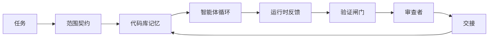

# Agent Workbench Engineering: Why Capable Models Still Fail

> 能力强大的模型并不足够。可靠的智能体需要一个工作台：说明、状态、范围、反馈、验证、审查与交接。剥离这些环节，即便是前沿模型也会产生无法交付的结果。

**Type:** Learn + Build  
**Languages:** Python（标准库）  
**Prerequisites:** Phase 14 · 01（智能体循环），Phase 14 · 26（故障模式）  
**Time:** ~45 分钟

## 学习目标

- 区分模型能力与执行可靠性。  
- 理清决定智能体能否交付的七个工作台表面（surfaces）。  
- 在一个小型仓库任务上比较仅提示词（prompt-only）运行与由工作台引导的运行。  
- 生成一份故障模式报告，将每个缺失的表面映射到它导致的症状。

## 问题陈述

你把一个前沿模型丢进真实的代码仓库，请它添加输入校验。它打开四个文件，写出看起来合理的代码，声称成功并停止。你运行测试，有两项失败。第三个原本与校验无关的文件被改动。没有记录表明智能体做了哪些假设、首先尝试了什么，或还剩下什么工作。

模型在 Python 层面并没有出错。出错的是工程环节。它不知道什么算作完成、被允许写入的位置、哪些测试是权威，或者下一次会话如何接手。

这不是模型的缺陷，而是工作台的缺陷。围绕智能体的表面缺失了把一次性生成转换为可靠、可恢复工程的要素。

## 概念

工作台是包裹模型以执行任务的运行环境。它有七个表面：

| Surface | What it carries | Failure when missing |
|---------|-----------------|----------------------|
| Instructions | Startup rules, forbidden actions, definition of done | Agent guesses what shipping means |
| State | Current task, touched files, blockers, next action | Each session restarts from zero |
| Scope | Allowed files, forbidden files, acceptance criteria | Edits leak into unrelated code |
| Feedback | Real command output captured into the loop | Agent declares success on a 400 |
| Verification | Tests, lint, smoke run, scope check | "Looks good" reaches main |
| Review | A second pass with a different role | Builder marks own homework |
| Handoff | What changed, why, what is left | Next session re-discovers everything |

工作台与模型无关。你可以替换模型而保留这些表面；但不能替换表面而仍保持可靠性。



循环在状态文件上闭合，而不是在聊天历史上。聊天是易失的。代码仓库是事实系统（system of record）。

### 工作台 vs 提示词工程

提示词（prompting）告诉模型你这轮想要什么。工作台告诉模型如何在多轮、多会话中开展工作。大多数智能体失败故事都是伪装成提示词工程的工作台失败。

### 工作台 vs 框架

框架为你提供一个运行时（例如 LangGraph、AutoGen、Agents SDK）。工作台为智能体在该运行时中提供一个可工作的场所。两者都需要。这个小模块关注第二类——工作台。

### 从分布式系统原语推理，而不是从厂商分类法出发

目前关于“harness engineering”有大量论述。Addy Osmani、OpenAI、Anthropic、LangChain、Martin Fowler、MongoDB、HumanLayer、Augment Code、Thoughtworks、walkinglabs 的优秀列表，以及大量 Medium / Hacker News 文章都在讨论。有分歧：什么算 harness、范围是什么、用什么词汇。我们不需要选边。七个表面是一个 UX 层；在每个工作台下面，都有一套分布式系统的原语，支撑着任何可靠后端。

暂时把“智能体”标签去掉。一次智能体运行是跨时间、进程和机器的计算。要让它可靠，你需要任何生产系统都需要的相同原语。

| Primitive | What it is | What it carries for an agent |
|-----------|------------|------------------------------|
| Function | Typed handler. Pure where possible. Owns its inputs and outputs. | A tool call, a rule check, a verification step, a model invocation |
| Worker | Long-lived process that owns one or more functions and a lifecycle | The builder, the reviewer, the verifier, an MCP server |
| Trigger | Event source that invokes a function | Agent loop tick, HTTP request, queue message, cron, file change, hook |
| Runtime | The boundary that decides what runs where, with what timeouts and resources | Claude Code's process, LangGraph's runtime, a worker container |
| HTTP / RPC | The wire between caller and worker | Tool-call protocol, MCP request, model API |
| Queue | Durable buffer between trigger and worker; back-pressure, retry, idempotency | The task board, the feedback log, the review inbox |
| Session persistence | State that survives crashes, restarts, model swaps | `agent_state.json`, checkpoints, KV stores, the repo itself |
| Authorization policy | Who can call what function with which scope | Allowed/forbidden files, approval boundaries, MCP capability lists |

现在把七个工作台表面映射到这些原语上。

- **Instructions** — policy + function metadata。规则以函数的形式实现。路由器（`AGENTS.md`）是附着在运行时启动上的策略。  
- **State** — 会话持久化。一个键值存储，运行时每一步都会读取。可以是文件、KV 或数据库；持久化语义重要，存储后端本身不重要。  
- **Scope** — 每个任务的授权策略。允许/禁止的 glob 是 ACL。需要审批的是权限格。  
- **Feedback** — 写入队列的调用日志。每个 shell 调用都是一条记录，可持久化、可重放。  
- **Verification** — 一个函数。对输入具有确定性。在任务关闭时触发。失败时默认拒绝（fail closed）。  
- **Review** — 一个独立的 worker，对 builder 产物有只读权限，对审查报告有写入权限。  
- **Handoff** — 会话结束触发器发出的持久记录。下一次会话的启动触发器读取它。

智能体循环本身是一个消费事件的 worker（用户消息、工具结果、计时器滴答），调用函数（先调用模型，再调用模型选定的工具），写入记录（状态、反馈），并发出触发（验证、审查、交接）。没有神秘之处；它与作业处理器的形态相同。

### 流行模式，翻译到原语

每个流行的 harness 模式都归结为这些原语。对照表：

| Vendor or community pattern | What it actually is |
|------------------------------|--------------------|
| Ralph Loop (Claude Code, Codex, agentic_harness book) — re-inject original intent into a fresh context window when the agent tries to stop early | A trigger that re-enqueues a task with a clean context; session persistence carries the goal forward |
| Plan / Execute / Verify (PEV) | Three workers, one per role, communicating via state and a queue between phases |
| Harness-compute separation (OpenAI Agents SDK, April 2026) — split control plane from execution plane | Restating control-plane / data-plane. Predates the agent label by decades |
| Open Agent Passport (OAP, March 2026) — sign and audit every tool call against a declarative policy before execution | An authorization policy enforced by a pre-action worker, with a signed audit queue |
| Guides and Sensors (Birgitta Böckeler / Thoughtworks) — feedforward rules + feedback observability | Authorization policy + verification functions + observability traces |
| Progressive compaction, 5-stage (Claude Code reverse engineering, April 2026) | A state-management worker that runs cron-like over session persistence to keep it within a budget |
| Hooks / middleware (LangChain, Claude Code) — intercept model and tool calls | Triggers + functions wrapped around the runtime's invocation path |
| Skills as Markdown with progressive disclosure (Anthropic, Flue) | A function registry where the function metadata is loaded into context just-in-time |
| Sandbox agents (Codex, Sandcastle, Vercel Sandbox) | The compute plane: a runtime with isolated filesystem, network, and lifecycle |
| MCP servers | Workers exposing functions over a stable RPC, with capability lists as authorization |

表中每一项都是智能体社区将已有的分布式系统原语重新命名。对市场营销有用；对工程语汇没有帮助。

### 收据（results）到底说明了什么

“更好的 harness 胜过更聪明的模型”的主张现在有数据支持。了解这些数据很重要，因为它们也是反对“等更聪明的模型就行”的唯一诚实论据。

- Terminal Bench 2.0 — 使用相同模型，通过改变 harness 把一个编码智能体从前 30 名之外提升到第五名（LangChain，*Anatomy of an Agent Harness*）。  
- Vercel — 删除了 80% 的智能体工具；成功率从 80% 提升到 100%（MongoDB）。  
- Harvey — 法律领域智能体单靠 harness 优化就将准确率翻倍（MongoDB）。  
- 88% 的企业级 AI 智能体项目未能进入生产环境。失败集中在运行时，而非推理（preprints.org，*Harness Engineering for Language Agents*，2026 年 3 月）。  
- 一项 2025 年跨三个流行开源框架的基准研究报告约 50% 的任务完成率；在长上下文条件下，long-context WebAgent 的完成率从 40–50% 崩溃到不足 10%，主要原因是无限循环和目标丢失（在 2026 年初的多篇报道中被广泛覆盖）。

结论不是“harness 永远胜利”。模型会随着时间吸收某些 harness 技巧。结论是，在当下，承重的工程工作围绕模型之外，而这些承重原语正是任何生产系统一直需要的那一套。

### 厂商写作的不足之处

下面这一段可以直说。

- LangChain 的 *Anatomy of an Agent Harness* 列举了十一项组件——prompts、tools、hooks、sandboxes、orchestration、memory、skills、subagents、runtime 等。它没有命名队列、把 worker 当作部署单元、触发语义、会话持久化作为独立关注点，或授权策略。它把 harness 当作一个可配置的对象，而不是一个要部署的系统。  
- Addy Osmani 的 *Agent Harness Engineering* 给出公式 `Agent = Model + Harness` 和棘轮模式，但并未说明 harness 是由什么构建的。读起来像一种立场，而非规范。  
- Anthropic 与 OpenAI 对表面（surfaces）讨论最深入，但都局限于自家运行时。2026 年 4 月 Agents SDK 中的 “harness-compute separation” 声明是首个明确支持控制平面/数据平面分离的厂商文档。但那是一个原语思想，并非新创。  
- agentic_harness 一书把 harness 当作配置对象（Jaymin West 的 *Agentic Engineering*，第 6 章），并指出 “harness 是 agentic 系统的主要安全边界”。这不过是授权策略的一种重新表述。  
- Hacker News 的讨论常常归结到相同结论。2026 年 4 月的线程 *The agent harness belongs outside the sandbox* 主张 harness 应该像一个位于外部的虚拟管理器（hypervisor），基于上下文授权访问。那其实也是授权策略被抽象到独立平面上的说法。

你不需要反驳上述任何文章来看到空缺。它们在写一个已经存在系统的 UX 描述。我们要写的是系统。当系统构建正确时，七个表面会自原语中自然出现；当构建错误时，再多的 `AGENTS.md` 抛光也修补不了缺失的队列。

所以，当你在别处听到“harness engineering”，把概念翻译回原语。Prompts 和规则是策略与函数。脚手架是运行时。护栏（guardrails）是授权 + 验证。Hooks 是触发器。记忆是会话持久化。Ralph Loop 是重入队列。Subagents 是 workers。Sandboxes 是计算平面。词汇会换，但工程不变。工作台是面向智能体的 UX；而能在下一轮厂商改名后仍然有用的 harness，是函数、workers、triggers、runtimes、queues、持久化与策略正确连线后的产物。

## 构建它

`code/main.py` 在一个小仓库任务上运行两次。第一次仅使用提示词，第二次把七个表面接入。相同模型，相同任务。脚本统计失败运行中缺失了哪些表面，并打印故障模式报告。

仓库任务很小：对一个单文件的 FastAPI 风格处理器添加输入校验并写一个通过的测试。

运行：

```
python3 code/main.py
```

输出：两个运行结果的并排日志，一个总结提示词-only 运行的 `failure_modes.json`，以及工作台运行的一行判定。

智能体是一个简单的基于规则的存根；重点在于表面，而不是模型。接下来的小模块中，你将把每个表面作为真实的、可复用的工件重建。

## 使用场景

工作台表面已经在现实中出现，尽管没有人明确称之为“工作台”：

- Claude Code、Codex、Cursor：`AGENTS.md` 和 `CLAUDE.md` 是 instructions 表面。斜杠命令是 scope。hooks 是 verification。  
- LangGraph、OpenAI Agents SDK：检查点与会话存储是 state 表面。handoffs 是交接表面。  
- 真实仓库中的 CI：测试、lint 与类型检查是 verification。PR 模板是交接。CODEOWNERS 是 review。

工作台工程的目标是把这些表面显式化和可复用化，而不是让每个团队各自重新发明。

## 发布它

`outputs/skill-workbench-audit.md` 是一个可移植技能（skill），用于审计现有仓库的七个工作台表面，并报告哪些缺失、哪些部分就绪、哪些健康。把它放在任何智能体设置旁边；它会告诉你先修什么。

## 练习

1. 选一个你已经运行智能体的仓库。对七个表面分别打分：0（缺失）到 2（健康）。你最弱的表面是哪一个？  
2. 扩展 `main.py`，使得提示词-only 的运行也会生成一个假的“成功”声明。验证验证闸门（verification gate）本应捕获到它。  
3. 为你的产品添加第八个表面。证明它为何不会合并回已有七项之一。  
4. 用另一个会幻想性写入额外文件的存根智能体重新运行脚本。哪个表面最先捕获到该问题？  
5. 将 Phase 14 · 26 中的五类行业复现故障模式映射到七个表面。每个表面旨在吸收哪个故障模式？

## 术语表

| Term | What people say | What it actually means |
|------|----------------|------------------------|
| Workbench | "The setup" | Engineered surfaces around the model that make work reliable |
| Surface | "A doc" or "a script" | A named, machine-readable input the agent reads or writes every turn |
| System of record | "The notes" | The file the agent treats as truth when chat history is gone |
| Definition of done | "Acceptance" | An objective, file-backed checklist the agent cannot fake |
| Workbench audit | "Repo readiness check" | A pass over the seven surfaces that flags missing pieces before work begins |

翻译为中文：

| 术语 | 常见表述 | 实际含义 |
|------|--------|---------|
| Workbench（工作台） | “设置” | 围绕模型以实现可靠工作的工程化表面 |
| Surface（表面） | “一个文档”或“一段脚本” | 一个命名的、机器可读的输入，智能体每轮会读或写 |
| System of record（事实系统） | “笔记” | 当聊天历史不可用时，智能体当作真实的文件 |
| Definition of done（完成定义） | “验收” | 一个客观的、基于文件的检查清单，智能体无法伪造 |
| Workbench audit（工作台审计） | “仓库就绪检查” | 对七个表面的一次检查，在工作开始前标记缺失项 |

## 延伸阅读

把下面的资料作为数据点而非权威。每一篇都是部分分类法。在决定采纳前，把每个概念翻译回原语（function、worker、trigger、runtime、HTTP/RPC、queue、persistence、policy）。

厂商与框架视角：

- [Addy Osmani, Agent Harness Engineering](https://addyosmani.com/blog/agent-harness-engineering/) — 给出 `Agent = Model + Harness` 和棘轮模式；对基础设施讨论较少  
- [LangChain, The Anatomy of an Agent Harness](https://blog.langchain.com/the-anatomy-of-an-agent-harness/) — 列举十一项组件：prompts、tools、hooks、orchestration、sandboxes、memory、skills、subagents、runtime；未覆盖队列、部署、授权等  
- [OpenAI, Harness engineering: leveraging Codex in an agent-first world](https://openai.com/index/harness-engineering/) — Codex 团队关于其运行时周边表面的观点  
- [OpenAI, Unrolling the Codex agent loop](https://openai.com/index/unrolling-the-codex-agent-loop/) — 将智能体循环简化为基于函数调用的 while 循环  
- [Anthropic, Effective harnesses for long-running agents](https://www.anthropic.com/engineering/effective-harnesses-for-long-running-agents) — 在特定运行时下的长时程表面讨论  
- [Anthropic, Harness design for long-running application development](https://www.anthropic.com/engineering/harness-design-long-running-apps) — 设计实践笔记  
- [LangChain Deep Agents harness capabilities](https://docs.langchain.com/oss/python/deepagents/harness) — 运行时配置表面

具有实践细节的文章：

- [Martin Fowler / Birgitta Böckeler, Harness engineering for coding agent users](https://martinfowler.com/articles/harness-engineering.html) — 指南（feedforward）+ 传感器（feedback）；控制论视角最为清晰  
- [HumanLayer, Skill Issue: Harness Engineering for Coding Agents](https://www.humanlayer.dev/blog/skill-issue-harness-engineering-for-coding-agents) — “这不是模型问题，是配置问题”  
- [MongoDB, The Agent Harness: Why the LLM Is the Smallest Part of Your Agent System](https://www.mongodb.com/company/blog/technical/agent-harness-why-llm-is-smallest-part-of-your-agent-system) — 证据：Vercel 80%→100%、Harvey 精度翻倍、Terminal Bench 排名提升  
- [Augment Code, Harness Engineering for AI Coding Agents](https://www.augmentcode.com/guides/harness-engineering-ai-coding-agents) — 以约束优先的实操演练  
- [Sequoia podcast, Harrison Chase on Context Engineering Long-Horizon Agents](https://sequoiacap.com/podcast/context-engineering-our-way-to-long-horizon-agents-langchains-harrison-chase/) — 更关注运行时问题胜于模型问题

书籍、论文与参考实现：

- [Jaymin West, Agentic Engineering — Chapter 6: Harnesses](https://www.jayminwest.com/agentic-engineering-book/6-harnesses) — 书籍级讨论，将 harness 视为主要安全边界  
- [preprints.org, Harness Engineering for Language Agents (March 2026)](https://www.preprints.org/manuscript/202603.1756) — 学术化的控制 / 能动性 / 运行时框架  
- [walkinglabs/awesome-harness-engineering](https://github.com/walkinglabs/awesome-harness-engineering) — 关于上下文、评估、可观测性、编排的精选阅读列表  
- [ai-boost/awesome-harness-engineering](https://github.com/ai-boost/awesome-harness-engineering) — 另一份精选列表（工具、评估、记忆、MCP、权限）  
- [andrewgarst/agentic_harness](https://github.com/andrewgarst/agentic_harness) — 生产就绪的参考实现，包含基于 Redis 的记忆和评估套件  
- [HKUDS/OpenHarness](https://github.com/HKUDS/OpenHarness) — 带内置个人代理的开源 agent harness

值得在 Hacker News 上阅读的争论（为分歧而非共识）：

- [HN: Effective harnesses for long-running agents](https://news.ycombinator.com/item?id=46081704)  
- [HN: Improving 15 LLMs at Coding in One Afternoon. Only the Harness Changed](https://news.ycombinator.com/item?id=46988596)  
- [HN: The agent harness belongs outside the sandbox](https://news.ycombinator.com/item?id=47990675) — 主张将授权抽象成独立平面

本课程内的交叉引用：

- Phase 14 · 23 — OpenTelemetry GenAI 约定：传感器文献指向的可观测性层  
- Phase 14 · 26 — 故障模式 列举了七个表面旨在吸收的常见失败模式  
- Phase 14 · 27 — 提示词注入防护，位于授权策略原语上  
- Phase 14 · 29 — 生产运行时（队列、事件、cron）：这些课中提到的原语在部署时所在位置