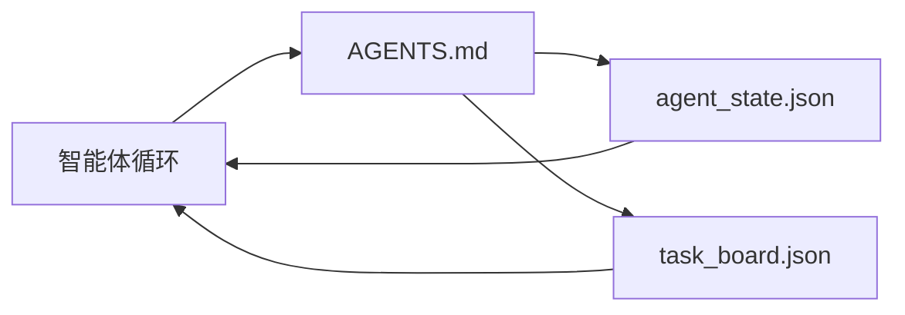

# The Minimal Agent Workbench

> 最小可用的 workbench 由三个文件构成：一个根指令路由器、一个状态文件和一个任务板。其他所有内容都建立在这三者之上。如果一个仓库无法承载这三个文件，没有任何模型能拯救它。

**Type:** 构建  
**Languages:** Python（stdlib）  
**Prerequisites:** Phase 14 · 31（为什么有能力的模型仍然失败）  
**Time:** ~45 分钟

## 学习目标

- 定义构成最小可行 workbench 的三个文件。
- 解释为什么一个简短的根路由比冗长的单体 `AGENTS.md` 更好。
- 构建一个代理每轮都能读取并在结束时写回的状态文件。
- 构建一个在多会话工作中能存活且无需聊天历史的任务板。

## 问题

大多数团队通过编写一个 3000 行的 `AGENTS.md` 来试图构建 workbench，然后就认为完成了。模型加载它，忽略无法总结的部分，仍然会在那些它一贯失败的方面出错。

你需要的是相反的策略。一个微小的根文件，只有在相关时才将智能体路由到更深层的文件。持久的状态文件，智能体在行动前读取、行动后写回。一个能说明正在进行、被阻塞和接下来要做什么的任务板。

三个文件。每个都有其职责。每个都是机器可读的，足以日后演化成真实系统。

## 概念



### AGENTS.md 是路由器，不是手册

一个好的 `AGENTS.md` 很短。它指引智能体到：

- 状态文件（你当前的位置）。
- 任务板（剩余工作）。
- 更深层的规则（例如 `docs/agent-rules.md`）。
- 验证命令（如何知道工作完成）。

任何更长的内容放在更深层的文档中，仅在需要时加载。冗长的手册会被忽视。短小的路由会被遵循。

### agent_state.json 是权威记录（system of record）

状态承载：当前活动任务 id、触及过的文件、已做的假设、阻塞项，以及下一步行动。智能体在每一轮都会读取它。下一次会话会读取它，而不是回放聊天记录。

状态保存在文件中，因为聊天历史不可靠。会话会断开。对话会被裁剪。文件不会。

### task_board.json 是队列

任务板承载每个任务，状态为 `todo | in_progress | done | blocked`。这是当状态为空时智能体从中拉取任务的队列，也是你想要知道智能体是否在正轨上时要查看的队列。

看板上的任务包含 id、目标（goal）、负责人（`builder`、`reviewer` 或 `human`）和验收标准。看板刻意保持简洁：当它超出一屏时，你有的是规划问题，而不是看板问题。

### 三个文件是下限，不是上限

后续课程会加入范围契约、反馈运行器、验证门、审阅者核对清单和交接包。这里的三个文件是一切扩展的基础假设。

## 构建它

`code/main.py` 会在一个空仓库中写入最小 workbench，并演示一个单次智能体回合，过程如下：

1. 读取 `agent_state.json`。
2. 如果状态为空，从 `task_board.json` 拉取下一个任务。
3. 触及范围内的单个文件。
4. 写回更新后的状态。

运行它：

```
python3 code/main.py
```

脚本会在自身旁创建 `workdir/`，写入三个文件，运行一轮，并打印 diff。再次运行以查看第二轮如何从第一轮停下的地方继续。

## 使用它

在生产级智能体产品中，同样的三个文件会以不同名称出现：

- **Claude Code：** 使用 `AGENTS.md` 或 `CLAUDE.md` 作为路由器，使用类似 `.claude/state.json` 的存储作为状态文件，并有针对任务板的钩子。
- **Codex / Cursor：** 将工作区规则作为路由器，使用会话内存作为状态，聊天侧边栏中的队列任务作为任务板。
- **自定义 Python 智能体：** 就是你刚写的那些文件。

名称会变，但形状不会。

## 真实环境中的生产模式

当将最小 workbench 与真实 monorepo 接触时，三个模式常被叠加在其上以求生存。它们相互独立；按需选择适合仓库的模式。

**嵌套的 `AGENTS.md`，以最近者为准。** OpenAI 在其主仓库里发布了 88 个 `AGENTS.md`，每个子组件一个。Codex、Cursor、Claude Code 和 Copilot 会从工作文件向仓库根遍历并串联它们在路径上遇到的每个 `AGENTS.md`。子目录文件扩展根文件。Codex 引入了 `AGENTS.override.md` 来替代而不是扩展；该覆盖机制是 Codex 专有的，跨工具使用时应避免。Augment Code 的度量结果很重要：最好的 `AGENTS.md` 能带来相当于从 Haiku 升级到 Opus 的质量跳跃；最差的则比根本没有文件还要糟糕。

**即便看似覆盖的反模式也要拒绝。** 冲突的指令会默默地把智能体从交互模式降级为贪婪模式（ICLR 2026 AMBIG-SWE：解析率从 48.8% → 28%）；不要用编号优先级代替扁平堆叠的指令。不可验证的风格规则（“遵循 Google Python 风格指南”）若没有配套的执行命令，会让智能体自行“发明”合规性；为每条风格规则配对确切的 lint 命令。以风格开头而非命令，会埋没验证路径；命令优先、风格次之。为人类而写而不是为智能体写，会浪费上下文预算；简洁是一个功能点。

**跨工具的符号链接（symlinks）。** 一个根文件加上符号链接（`ln -s AGENTS.md CLAUDE.md`、`ln -s AGENTS.md .github/copilot-instructions.md`、`ln -s AGENTS.md .cursorrules`）能让每个编码智能体共享同一信息源。Nx 的 `nx ai-setup` 能从单个配置自动化这一过程，覆盖 Claude Code、Cursor、Copilot、Gemini、Codex 和 OpenCode。

## 交付

`outputs/skill-minimal-workbench.md` 会为任何新仓库生成三文件 workbench：一个针对项目调优的 `AGENTS.md` 路由器，一个具有正确键的 `agent_state.json`，以及一个用当前积压任务初始化的 `task_board.json`。

## 练习

1. 在 `agent_state.json` 中添加 `last_run` 时间戳。如果该文件超过 24 小时，除非有人操作员确认，否则拒绝运行。
2. 在任务板中添加 `priority` 字段，并将拉取器修改为始终选择最高优先级的 `todo`。
3. 将 `task_board.json` 迁移为 JSON Lines，使每个任务占一行，便于版本控制中的 diff 清晰。
4. 编写一个 `lint_workbench.py`，当 `AGENTS.md` 超过 80 行或引用不存在的文件时失败。
5. 决定这三个文件中哪一个丢失起来伤害最大。为你的选择辩护。

## 关键术语

| 术语 | 常见表述 | 实际含义 |
|------|--------|----------|
| Router | `AGENTS.md` | 指向更深文档和文件的简短根文件 |
| State file | “笔记” | 每轮写入的机器可读记录，说明智能体当前所在 |
| Task board | “backlog / 待办” | 带有状态、负责人和验收条件的 JSON 工作队列 |
| System of record | “Source of truth” | 当聊天不可用时，workbench 视为权威的文件 |

（注：文中术语采用标准 AI 工程翻译，如 “agent loop” 翻译为 “智能体循环”，“prompt engineering” 为 “提示词工程”，“Embeddings” 为 “嵌入”，“Fine-tuning” 为 “微调”，“Context window” 为 “上下文窗口”，“few-shot” 为 “少样本”，“chain-of-thought” 为 “思维链”，“guardrails” 为 “护栏”，“function calling” 为 “函数调用”，“stateful graphs” 为 “有状态图”，“actor model” 为 “参与者模型”。）

## 延伸阅读

- [agents.md — the open spec](https://agents.md/) — 已被 Cursor、Codex、Claude Code、Copilot、Gemini、OpenCode 采纳
- [Augment Code, A good AGENTS.md is a model upgrade. A bad one is worse than no docs at all](https://www.augmentcode.com/blog/how-to-write-good-agents-dot-md-files) — 测量到的质量跳跃
- [Blake Crosley, AGENTS.md Patterns: What Actually Changes Agent Behavior](https://blakecrosley.com/blog/agents-md-patterns) — 实证有效与无效的做法
- [Datadog Frontend, Steering AI Agents in Monorepos with AGENTS.md](https://dev.to/datadog-frontend-dev/steering-ai-agents-in-monorepos-with-agentsmd-13g0) — 嵌套优先级的实践
- [Nx Blog, Teach Your AI Agent How to Work in a Monorepo](https://nx.dev/blog/nx-ai-agent-skills) — 跨六种工具的单一来源生成
- [The Prompt Shelf, AGENTS.md Best Practices: Structure, Scope, and Real Examples](https://thepromptshelf.dev/blog/agents-md-best-practices/) — 能通过审查的章节排布
- [Anthropic, Claude Code subagents and session store](https://docs.anthropic.com/en/docs/agents-and-tools/claude-code/sub-agents)
- Phase 14 · 31 — 本最小方案吸收的失败模式
- Phase 14 · 34 — 本课预览的持久状态 schema