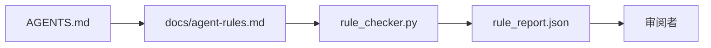

# 将代理指令作为可执行约束

> 以散文形式写的指令是愿望。以约束形式写的指令是测试。工作台将每条规则转换为代理可以在运行时检查的东西，以及评审者在事后可以验证的内容。

**Type:** 构建  
**Languages:** Python（标准库）  
**Prerequisites:** Phase 14 · 32（最小化工作台）  
**Time:** ~50 分钟

## 学习目标

- 将路由散文与操作性规则分离。
- 以机器可检查的约束来表达启动规则、禁止操作、完成定义、不确定性处理和审批边界。
- 实现一个规则检查器，对一次运行按规则集进行评分。
- 使规则集便于差异对比，以便评审能看到变化。

## 问题

典型的 `AGENTS.md` 更像是入职文档。它告诉代理“要小心”、“彻底测试”和“不确定时询问”。三天后，代理提交了没有测试的更改，修改了一个被禁止的目录，并且从未询问，因为它不知道界限在哪里。

当指令是可操作的时，它们是强有力的；当是立志式的时，它们是无效的。解决办法是编写工作台可以解释、评审者可以评分的规则。

## 概念

规则应放在 `docs/agent-rules.md` 中，远离简短的根路由。每条规则都有一个名称、一个类别和一个检查函数。



### 覆盖大多数规则的五个类别

| Category | Question the rule answers | Example |
|----------|---------------------------|---------|
| Startup | 在开始工作之前必须为真什么？ | "state file exists and is fresh" |
| Forbidden | 什么绝对不能发生？ | "do not edit `scripts/release.sh`" |
| Definition of done | 什么能证明任务已完成？ | "pytest exits 0 and acceptance line passes" |
| Uncertainty | 当不确定时代理应做什么？ | "open a question note instead of guessing" |
| Approval | 什么需要人工审批？ | "any new dependency, any prod write" |

不符合这五类之一的规则通常应拆分为两个规则。强制拆分。

### 规则是机器可读的

每条规则都有一个 slug、一个类别、一行描述，以及一个 `check` 字段，该字段命名了 `rule_checker.py` 中的函数。添加规则意味着添加一个检查；检查器随工作台一起增长。

### 规则便于差异对比

规则以单个标题为单位保存在一个 Markdown 文件中。重命名在 diff 中可见。新规则置于其类别顶部。过时的规则会被删除，而不是注释掉，因为工作台是事实来源，而不是团队上季度感受的聊天记录。

### 规则与框架护栏的区别

框架护栏（OpenAI Agents SDK 护栏，LangGraph 中断）在运行时级别强制执行规则。本课的规则集是人类可读、可审查的契约，这些护栏实现了该契约。两者都需要：运行时在回合中捕获违规，规则集证明运行时在做正确的事。

### 渐进披露：一张地图，而非一本百科全书

`AGENTS.md` 不断增长的原因是每次事件都会增加一条规则，而没有事件会删除一条。过了一年，文件两千行，代理只读了第一页，注意力耗尽，只按照其中的一小部分操作。一本巨大的指令文件之所以失败，原因与 40 页的入职手册相同：读者只浏览一次，从未回到真正重要的部分。

解决办法不是更短的文件，而是分层的文件。根路由保持足够简短以便每次会话都能阅读，并只包含指向其他内容的指针。深度内容保存在主题文件中，只有当任务触及它们时代理才加载。给代理一张地图，而不是整本百科，它会走到需要的那一页。

```
AGENTS.md                  # router, < 50 lines: what this repo is, where to look, the 5 hard rules
docs/
  agent-rules.md           # the full rule set (this lesson)
  architecture.md          # loaded when the task touches module boundaries
  testing.md               # loaded when the task writes or runs tests
  deploy.md                # loaded only for release work, gated behind an approval rule
feature_list.json          # the backlog (Phase 14 · 36)
```

| Tier | Lives in | Read when | Size budget |
|------|----------|-----------|-------------|
| Router | `AGENTS.md` | 每次会话，始终 | 控制在 ~50 行以内 |
| Rules | `docs/agent-rules.md` | 每次会话，启动时读取 | 每个类别一屏 |
| Topic docs | `docs/<topic>.md` | 仅当任务触及该主题时 | 深度按需扩展 |

有两个测试使分层保持有效。可达性测试：代理应在至多两步内到达任何规则，因此路由必须按路径链接每个主题文档，而不是在散文中描述它们。新鲜度测试：路由足够短，以便评审者在每个 PR 时重新阅读，这是阻止它悄悄再次膨胀成原来百科全书的唯一办法。比起缺失规则，一个无法解析的指针更糟，因此路由中的断链本身就是一个启动检查违规。

## 构建它

`code/main.py` 随附：

- 一个 `agent-rules.md` 解析器，将规则加载到 dataclass。
- `rule_checker.py` 风格的检查函数，针对每个 `check` 引用实现一个函数。
- 一个演示代理运行，该运行违反了两条规则，并有一个检查过程捕获它们。

运行：

```
python3 code/main.py
```

输出：解析后的规则集、运行跟踪、每条规则的通过/失败情况，以及保存在脚本旁的 `rule_report.json`。

## 生产环境中的模式

三种模式将规则集从会在一周内衰败，与能维持一个季度的区别开来。

**编写时的严重性标注。** 每条规则包含 `severity`：`block`、`warn` 或 `info`。检查器报告这三种；运行时只会对 `block` 拒绝执行。大多数团队在早期会夸大严重性，然后在截止期压力下默默削弱；在编写时进行标注迫使前期校准。与验证门（Phase 14 · 38）配合，该门会将任何对 `block` 规则的覆盖记录到 `overrides.jsonl` 审计日志中。

**规则过期作为强制函数。** 每条规则都有一个 `expires_at` 日期（默认从创建起 90 天）。当一条未过期的规则连续 60 天没有任何违规时，检查器发出警告；下一个季度评审要么证明保留的正当性，要么将其降级为 `info`，或删除。Cloudflare 的生产 AI 代码审查数据（2026 年 4 月，30 天内在 5,169 个仓库中的 131,246 次审查运行）显示，带有明确过期的规则集每个仓库保持在 30 条以下；没有过期的规则集增长到 80+ 条，且大多数从未触发。

**Markdown 为源，JSON 为缓存。** `agent-rules.md` 是编写文件；`agent-rules.lock.json` 是检查器在热路径中读取的缓存。该锁由 pre-commit 钩子重新生成。Markdown 差异可审查；JSON 解析不会阻塞每次运行。形态与 `package.json` / `package-lock.json` 和 `Cargo.toml` / `Cargo.lock` 相同。

## 使用它

在生产中：

- Claude Code、Codex、Cursor 在会话开始时读取规则并在拒绝操作时引用它们。检查器在 CI 中重新运行，以捕获静默漂移。
- OpenAI Agents SDK 护栏将相同的检查注册为输入和输出护栏。Markdown 是文档表面；SDK 是运行时表面。
- LangGraph 中断在正在进行的节点违反规则时触发。中断处理程序读取规则，询问人工，然后恢复。

规则集在这三者之间可移植，因为它只是 Markdown 加上函数名。

## 发布它

`outputs/skill-rule-set-builder.md` 会询问项目负责人，将其现有的散文说明分类为五类规则，并生成版本化的 `agent-rules.md` 以及检查器存根。

## 练习

1. 如果你的产品确实需要，添加第六类。说明为什么它不会归入五类之一。
2. 扩展检查器以便规则可以携带严重性（`block`、`warn`、`info`），并让报告据此聚合。
3. 将检查器接入 CI：如果最新代理运行中有 `block` 严重性规则失败，则构建失败。
4. 为每条规则添加“expiry”字段。90 天内未出现检查失败后，该规则进入复审状态。
5. 找到一个真实的 `AGENTS.md` 并将其重写为五类规则。它有多少行是操作性的？多少是立志式的？

## 关键术语

| Term | What people say | What it actually means |
|------|----------------|------------------------|
| Operational rule | "A real instruction" | 一个工作台可以在运行时检查的规则 |
| Aspirational rule | "Be careful" | 没有检查的规则；要么删除要么升级为可检查的规则 |
| Definition of done | "Acceptance" | 一个客观的、基于文件的证据表明任务已完成 |
| Block severity | "Hard rule" | 违规会中止运行；不能在没有操作员的情况下静默忽略 |
| Rule expiry | "Stale rule sweep" | 在 N 天内没有失败的规则需要复审 |

## 延伸阅读

- [OpenAI Agents SDK guardrails](https://platform.openai.com/docs/guides/agents-sdk/guardrails)
- [LangGraph interrupts](https://langchain-ai.github.io/langgraph/how-tos/human_in_the_loop/breakpoints/)
- [Anthropic, Building Effective Agents](https://www.anthropic.com/research/building-effective-agents)
- [Rick Hightower, Agent RuleZ: A Deterministic Policy Engine](https://medium.com/@richardhightower/agent-rulez-a-deterministic-policy-engine-for-ai-coding-agents-9489e0561edf) — 在生产中使用 block/warn/info 严重性
- [Cloudflare, Orchestrating AI Code Review at Scale](https://blog.cloudflare.com/ai-code-review/) — 131k 次审查运行，规则组合经验
- [microservices.io, GenAI development platform — part 1: guardrails](https://microservices.io/post/architecture/2026/03/09/genai-development-platform-part-1-development-guardrails.html) — 规则与 CI 之间的纵深防御
- [Type-Checked Compliance: Deterministic Guardrails (arXiv 2604.01483)](https://arxiv.org/pdf/2604.01483) — 将 Lean 4 视为规则即检查的上界
- [logi-cmd/agent-guardrails](https://github.com/logi-cmd/agent-guardrails) — 合并门实现：范围、变更测试、违规预算
- Phase 14 · 32 — 此规则集所嵌入的最小化工作台
- Phase 14 · 38 — 消耗规则报告的验证门
- Phase 14 · 39 — 对规则合规性进行评分的审阅代理