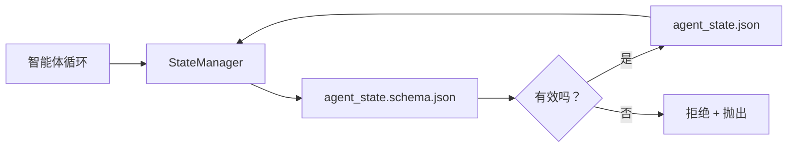

# Repo Memory and Durable State

> 聊天记录是易失的。仓库是持久的。工作台将智能体状态存储在版本化文件中，从而让下一个会话、下一个智能体以及下一个审阅者都从相同的事实来源读取。

**Type:** 构建  
**Languages:** Python (stdlib + `jsonschema` 可选)  
**Prerequisites:** Phase 14 · 32（最小工作台）  
**Time:** ~60 分钟

## 学习目标

- 定义哪些内容属于仓库记忆，哪些属于聊天记录。  
- 为 `agent_state.json` 和 `task_board.json` 编写 JSON Schema。  
- 构建一个状态管理器，用于以原子方式加载、验证、变更并持久化状态。  
- 使用 schema 在损坏工作台之前拒绝错误写入。

## 问题

智能体结束了一次会话。聊天关闭。下一个会话打开并询问从何开始。模型说“让我检查文件”，读取了过时的笔记，重复了已经完成的工作。更糟的是，它可能会重写一个已经完成的文件，因为没人告诉它该文件已完成。

工作台的解决方案是仓库记忆：状态保存在仓库中的 JSON 文件里，按 Schema 写入，以原子方式持久化，便于代码评审中的差异比对。聊天是短暂的流；仓库是记录系统（system of record）。

## 概念



### 什么属于仓库记忆

| 属于 | 不属于 |
|---------|-----------------|
| 活动任务 id | 原始聊天记录 |
| 本次会话触及的文件 | 逐 token 的推理轨迹 |
| 智能体做出的假设 | “用户似乎很沮丧” |
| 未解决的阻塞项 | 采样得到的完成结果 |
| 下一个行动 | 厂商特定的模型 id |

测试标准是持久性：在三个月后的 CI 重跑中这是否仍然有用？如果是，放到仓库。如果不是，放到遥测。

### 以 Schema 为先的状态

JSON Schema 是契约。没有它，每个智能体都会发明新字段，每个审阅者都要学一种新结构，每个 CI 脚本都要对历史版本做特殊处理。有了它，错误写入会被拒绝。

Schema 覆盖内容包括：

- 必需键。  
- 允许的 `status` 值。  
- 禁止值（例如数组不能为 `null`）。  
- 模式约束（任务 id 匹配 `T-\d{3,}`）。  
- 用于迁移的版本字段。

### 原子写入

状态写入需要经得起部分失败：写入临时文件，fsync，重命名覆盖目标。状态文件是事实来源；半写入的文件比不存在的文件更糟糕。

### 迁移

当 schema 变化时，在 schema 升级旁边一并发布迁移脚本。状态文件携带 `schema_version` 字段；管理器会拒绝加载无法迁移的版本。

## 构建它

`code/main.py` 实现：

- `agent_state.schema.json` 和 `task_board.schema.json`。  
- 仅使用标准库的验证器（支持 JSON Schema 的子集：required、type、enum、pattern、items）。  
- `StateManager.load`、`StateManager.update`、`StateManager.commit`，并实现临时文件写入然后重命名的原子写入。  
- 一个演示：变更状态、持久化、重载，并证明往返无误。

运行：

```
python3 code/main.py
```

脚本会写入 `workdir/agent_state.json` 和 `workdir/task_board.json`，在两轮中变更它们，并在每一步打印经过验证的状态。

## 生产环境中的常见模式

四种模式将本课的最小实现扩展为多智能体单仓库可存活的方案。

- 原子临时写入并重命名不是可选项。2026 年 3 月某 Hive 项目的 bug 报告清晰地记录了失败模式：`state.json` 使用 `write_text()` 写入，异常被捕获并静默忽略。部分写入导致会话在损坏的状态上恢复而没有任何信号。修复办法总是：在目标同目录用 `tempfile.mkstemp`，写入，`fsync`，然后 `os.replace`（在 POSIX 与 Windows 上都是原子重命名）。本课的 `atomic_write` 即实现了该流程。

- 每个非幂等的工具调用都带上幂等键（idempotency keys）。如果智能体在调用工具后崩溃但在检查点持久化结果之前恢复，重试会重新执行工具调用。对于读操作安全；对于发送邮件、插入数据库、上传文件则危险。模式是：在执行前将每个工具调用的 ID 记录到 `pending_calls.jsonl`。重试时检查该 ID；如果存在则跳过调用并使用缓存的结果。Anthropic 与 LangChain 在 2026 年的指南中都提到了这一点；LangGraph 的检查点器也出于相同原因持久化待处理写入。

- 将大型产物与状态分离。不要将 CSV、长对话记录或生成文件存入 `agent_state.json`。把产物保存为独立文件（或上传到对象存储），在状态中只保留路径。检查点保持小且快速；产物按需增长。

- 审计使用事件溯源，恢复使用快照。对每次变更追加写入事件日志（`state.events.jsonl`）；定期将快照写为 `state.json`。恢复时读取快照，然后重放快照时间戳之后的事件。这样花费更多磁盘但可以逐条重放智能体决策——在调试长时序运行时至关重要。这与 Postgres 内部对 WAL 的使用方式类似。

- Schema 迁移或拒绝加载。`schema_version` 整数是契约。当管理器加载未知版本的文件时，会拒绝读取。在 schema 升级旁边发布迁移脚本；`tools/migrate_state.py` 在每次启动时幂等地运行。

## 使用场景

在生产中：

- LangGraph 检查点器（checkpointers）。思路相同，存储不同。检查点器将图状态持久化到 SQLite、Postgres 或自定义后端。本课教授的 schema 是当检查点器失效且需要手工读取状态时的救援方法。  
- Letta 的 memory blocks。带结构化 schema 的持久化块（Phase 14 · 08）。相同的约束应用于长期人格。  
- OpenAI Agents SDK 会话存储。可插拔后端，支持 schema 感知。本课的状态文件就是本地文件后端的示例。

## 交付物

`outputs/skill-state-schema.md` 会生成一对项目特定的 JSON Schema（state + board）、一个与原子写入连接的 Python `StateManager`，以及一个迁移脚手架，以便下次 schema 升级不会破坏工作台。

## 练习

1. 添加 `last_human_touch` 时间戳。拒绝任何在人工编辑五秒内的智能体写入。  
2. 扩展验证器以支持 `oneOf`，使任务可以是构建任务或审阅任务，并具有不同的必需字段。  
3. 添加 `schema_version` 字段并实现 v1 到 v2 的迁移（将 `blockers` 重命名为 `risks`）。  
4. 将存储后端从本地文件迁移到 SQLite。保持 `StateManager` API 不变。  
5. 用两个智能体对同一状态文件进行 50 ms 的写竞争。会出什么问题？原子重命名如何拯救你？

## 关键术语

| 术语 | 人们说 | 实际含义 |
|------|----------------|------------------------|
| 仓库记忆（Repo memory） | “笔记文件” | 在受版本控制的仓库文件中以 schema 存储的状态 |
| 模式优先（Schema-first） | “验证输入” | 在写入方之前定义契约，拒绝偏离 |
| 原子写入（Atomic write） | “只需重命名” | 写入临时文件，fsync，重命名，防止部分失败导致损坏 |
| 迁移（Migration） | “schema 升级” | 将 vN 状态转换为 v(N+1) 状态的脚本 |
| 记录系统（System of record） | “事实来源” | 工作台视为权威的工件 |

## 延伸阅读

- [JSON Schema specification](https://json-schema.org/specification.html)  
- [LangGraph checkpointers](https://langchain-ai.github.io/langgraph/concepts/persistence/)  
- [Letta memory blocks](https://docs.letta.com/concepts/memory)  
- [Fast.io, AI Agent State Checkpointing: A Practical Guide](https://fast.io/resources/ai-agent-state-checkpointing/) — 基于 schema 的检查点与幂等性实践  
- [Fast.io, AI Agent Workflow State Persistence: Best Practices 2026](https://fast.io/resources/ai-agent-workflow-state-persistence/) — 并发控制、TTL、事件溯源  
- [Hive Issue #6263 — non-atomic state.json writes silently ignored](https://github.com/aden-hive/hive/issues/6263) — 一个真实项目中的失败模式  
- [eunomia, Checkpoint/Restore Systems: Evolution, Techniques, Applications](https://eunomia.dev/blog/2025/05/11/checkpointrestore-systems-evolution-techniques-and-applications-in-ai-agents/) — 将操作系统历史中的检查点/恢复原语应用到智能体  
- [Indium, 7 State Persistence Strategies for Long-Running AI Agents in 2026](https://www.indium.tech/blog/7-state-persistence-strategies-ai-agents-2026/)  
- [Microsoft Agent Framework, Compaction](https://learn.microsoft.com/en-us/agent-framework/agents/conversations/compaction) — 厂商的检查点管理方案  
- Phase 14 · 08 — memory blocks 与休眠时计算  
- Phase 14 · 32 — 本课模式化的三文件最小集  
- Phase 14 · 40 — 使用相同 schema 的交接包