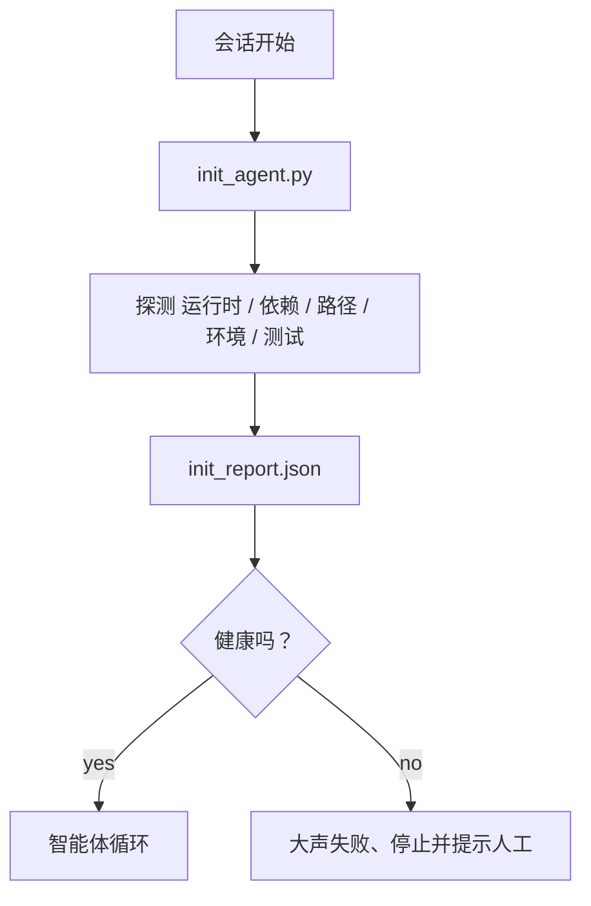

# 初始化脚本（Agents）

> 每次从冷启动开始的会话都要交一笔税。智能体会读取相同的文件、重试相同的探测、重新发现相同的路径。一个 init 脚本支付一次这笔税并将答案写入状态。

**Type:** 构建  
**Languages:** Python (stdlib)  
**Prerequisites:** Phase 14 · 32 (最小工作台), Phase 14 · 34 (仓库记忆)  
**Time:** ~45 分钟

## 学习目标

- 识别智能体每个会话不应重复做的工作。
- 构建一个确定性的初始化脚本，用于探测运行时、依赖项和仓库健康状况。
- 持久化探测结果，使智能体在启动时读取这些结果而不是重新运行检查。
- 出错时快速、大声地失败，并将错误集中在一个可查看的位置。

## 问题

打开一次会话。智能体猜测 Python 版本。猜测测试命令。列出仓库根目录五次以查找入口点。尝试导入未安装的包。询问用户配置文件在哪里。在它真正修改代码之前，已经消耗了大量 token 用于本应由单个脚本完成的初始化工作。

解决方法是：在智能体做任何其他事情之前运行一个初始化脚本，并写出一个 init_report.json，智能体在启动时读取它。

## 概念



### 初始化脚本探测的内容

| 探测项 | 为什么重要 |
|-------|----------------|
| 运行时版本 | 错误的 Python 或 Node 版本会导致静默的版本不兼容错误 |
| 依赖项可用性 | 以后发现缺少包的代价是现在捕获它的十倍 |
| 测试命令 | 智能体必须知道如何进行验证；如果命令缺失则说明工作台已损坏 |
| 仓库路径 | 硬编码路径会漂移；解析一次并固定它们 |
| 环境变量 | 缺少 `OPENAI_API_KEY` 是一个失败面，而不是运行时之谜 |
| 状态 + board 新鲜度 | 来自崩溃会话的陈旧状态是一个自伤炸弹（footgun） |
| 上次已知良好提交 | 为会话结束时的交接 diff 提供锚点 |

### 大声失败、快速失败、在一个地方失败

探测失败意味着停止并提示人工。不要抱有“智能体会自己解决”的想法。初始化的整个意义就在于：当工作台损坏时拒绝启动。

### 幂等性

连续运行两次。第二次应该是无操作（no-op），除了更新时间戳之外。幂等性让你可以将脚本接入 CI、钩子或 pre-task 的斜杠命令。

### Init 与 rules 的区别

Rules（Phase 14 · 33）描述了行动前必须成立的条件。Init 是建立可以去检查这些 rules 的脚本。没有 init 的规则会变成“请小心”。没有规则的 init 只是一个精致的失败。

## 构建它

`code/main.py` 实现了 `init_agent.py`：

- 五个探测：Python 版本、通过 `importlib.util.find_spec` 列举的依赖项、测试命令可解析性、必需的环境变量、状态文件新鲜度。
- 每个探测返回 `(name, status, detail)`。
- 脚本写出 `init_report.json`，如果任何块级严重的探测失败则以非零状态退出。

运行：

```
python3 code/main.py
```

脚本会打印探测表，写出 `init_report.json`，在成功路径上以 0 退出；如果失败则以非零退出并列出失败的探测项。

## 生产环境中的常见模式

三种模式将有用的 init 脚本与形式主义区分开来。

- 上次已知良好提交锚定（Last-known-good commit anchoring）。将当前提交与在上次成功合并时写入的 `LKG` 文件进行比较。如果 diff 超过预算（默认 50 个文件），拒绝启动并要求人工确认新的基线。这是 Cloudflare 的 AI 代码审查用于限定审查智能体范围的做法：每次审查会话都以相同的上次已知良好为锚点，永不让会话间的漂移累积。
- 带 TTL 的锁文件（Lock files with TTL）。在第一次成功探测后写入 `prereqs.lock`。随后的运行在 N 小时内（默认 24 小时）信任该锁并跳过昂贵的探测。初始化脚本先读取锁；如果锁是新的并且依赖清单哈希匹配，则短路。这与 Docker 用于层缓存的模式相同：幂等探测 + 内容哈希 = 跳过。
- 热路径上无网络、无 LLM、无惊喜（No network, no LLM, no surprises in the hot path）。Init 探测应是确定性的基础设施 plumbing。一个调用 LLM 来分类失败或打外部服务检查许可证的探测就不是探测，而是工作流。如果一个探测在干运行中耗时超过三秒，将其视为工作台的异味（smell），要么将其移出 init，要么缓存其结果。

## 使用方式

在生产环境中：

- Claude Code 钩子。`pre-task` 钩子调用初始化脚本并在失败时拒绝启动智能体。
- GitHub Actions。一个 `setup-agent` 作业运行初始化脚本；智能体作业依赖它。
- Docker entrypoint。智能体容器在 exec 智能体运行时之前运行初始化脚本；失败时日志会暴露出来。

初始化脚本具有可移植性，因为它不依赖于特定框架。Bash、Make 或任务文件都可以将其包装起来。

## 发布它

`outputs/skill-init-script.md` 会采访项目、将其设置工作分类到探测项中，并生成一个项目特定的 `init_agent.py` 以及在任何智能体步骤之前运行它的 CI 工作流。

## 练习

1. 添加一个探测，将当前提交与上次已知良好提交进行 diff，如果超过 50 个文件变更则拒绝启动。
2. 将脚本接入以写入 `prereqs.lock` 文件，并在锁文件超过七天时拒绝启动。
3. 添加 `--fix` 标志，自动安装缺失的开发依赖，但未经批准绝不修改运行时依赖。
4. 将探测从硬编码函数移到 YAML 注册表中。为这种权衡辩护。
5. 为每个探测添加时间预算。干运行中耗时超过三秒的探测被视为工作台异味。

## 关键术语

| 术语 | 人们怎么说 | 实际含义 |
|------|----------------|------------------------|
| 探测（Probe） | “一个检查” | 一个确定性函数，返回 `(name, status, detail)` |
| 初始化报告（Init report） | “设置输出” | 写在 state 旁的 JSON，包含探测结果 |
| 幂等（Idempotent） | “可安全重跑” | 连续两次运行产生相同的报告，除了时间戳外 |
| 大声失败（Fail loud） | “别吞掉错误” | 停止并提示人工；不做静默回退 |
| 设置税（Setup tax） | “引导成本” | 智能体每个会话为重发现显而易见事物所花费的 token |

（注：文中部分技术术语采用标准 AI 工程翻译，例如“提示词工程”、“RAG”、“嵌入”、“微调”、“上下文窗口”、“少样本”、“思维链”、“护栏”、“函数调用”、“智能体循环”、“有状态图”、“参与者模型”。）

## 延伸阅读

- [Anthropic, Effective harnesses for long-running agents](https://www.anthropic.com/engineering/effective-harnesses-for-long-running-agents)
- [GitHub Actions, composite actions for setup](https://docs.github.com/en/actions/sharing-automations/creating-actions/creating-a-composite-action)
- [microservices.io, GenAI dev platform: guardrails](https://microservices.io/post/architecture/2026/03/09/genai-development-platform-part-1-development-guardrails.html) — 将 pre-commit + CI 检查作为 init
- [Augment Code, How to Build Your AGENTS.md (2026)](https://www.augmentcode.com/guides/how-to-build-agents-md) — init 期望
- [Codex Blog, Codex CLI Context Compaction](https://codex.danielvaughan.com/2026/03/31/codex-cli-context-compaction-architecture/) — 将会话开始视为可压缩意识的 init
- Phase 14 · 33 — 本脚本所启用的规则集
- Phase 14 · 34 — 本脚本播种的状态文件
- Phase 14 · 38 — 本脚本喂入的验证门（verification gate）
- Phase 14 · 40 — 消费初始化报告中上次已知良好信息的交接流程